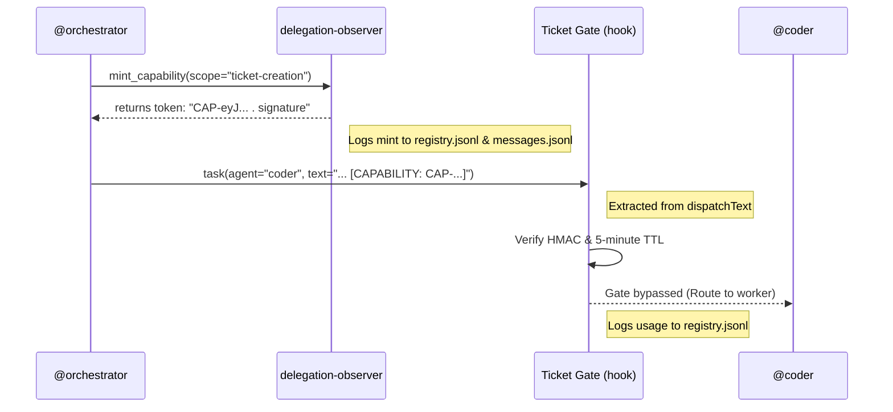

# Capability-Based Authorization System

**Ticket Reference:** DIA-260820-jlu0 'capability-authorization-system'
**Status:** Approved for implementation

## 1. System Context

The existing ticket gate (`DIA-217`) enforces that all engineering work requires a pre-existing ticket. This creates a "chicken-and-egg" deadlock for meta-tasks: the orchestrator needs to dispatch `@coder` to create a ticket, but the gate blocks the dispatch because no ticket exists yet.

To solve this without reverting to brittle, globally-applicable regex bypasses, we introduce **Capability Tokens**: short-lived, cryptographically signed, scope-specific authorizations that the orchestrator mints and passes to subagents to explicitly bypass the gate.



## 2. Architectural Decisions (ADRs)

### ADR 1: HMAC Stateless Capability (Conspect Pattern 1)

- **Decision:** Capability tokens are JSON payloads signed with `HMAC-SHA256` using an ephemeral, in-memory secret (`CAPABILITY_SECRET`) generated at plugin load.
- **Rationale:** (Ponytail rule: _stdlib does it? use it._) Node.js native `crypto` is sufficient. 10x simpler than UCAN or JWT. Because tokens expire in 5 minutes, an ephemeral secret that resets on process restart is perfectly safe (no persistent key management needed).

### ADR 2: Capability-in-Text (Conspect Pattern 3 Variant)

- **Decision:** Tokens are passed directly in the `task()` dispatch text (e.g., `[CAPABILITY: CAP-...]`) rather than modifying the built-in `task` tool schema.
- **Rationale:** Requires zero modifications to OpenCode core tool schemas. The `delegation-observer` plugin already parses `dispatchText` extensively; extracting a regex-bound token from text is non-intrusive and backward compatible.

### ADR 3: Trusted Minter Model

- **Decision:** Expose a new `mint_capability` tool in the `delegation-observer` plugin, accessible only to the orchestrator.
- **Rationale:** The orchestrator is the trusted entity managing workflows. Minting a token forces the orchestrator to explicitly declare _why_ a bypass is needed, leaving a clear audit trail.

## 3. Implementation Specification (for @coder)

**Target File:** `.opencode/plugins/delegation-observer.ts`

### Phase 1: Cryptography & Token Utilities

1. Update imports from `node:crypto` to include `createHmac` and `randomBytes`.
2. At the top level of the plugin (near `const opencodeVersion`), declare the ephemeral secret:
   ```typescript
   const CAPABILITY_SECRET = randomBytes(32);
   ```
3. Add utility functions:
   - `base64url(buf: Buffer | string): string` (standard base64 to base64url encoding).
   - `mintCapabilityToken(scope: string, reason: string): string`
     - Payload: `{ id: randomUUID(), scope, reason, exp: Date.now() + 5 * 60 * 1000 }`
     - Returns: `CAP-${base64url(JSON.stringify(payload))}.${base64url(hmac)}`
   - `verifyCapabilityToken(token: string): { valid: boolean, payload?: any, error?: string }`
     - Splits at `.`, verifies HMAC matches the payload, and checks `Date.now() <= payload.exp`.

### Phase 2: Expose `mint_capability` Tool

In the plugin's exported `tool` block (alongside `log_decision`), add `mint_capability`:

```typescript
mint_capability: tool({
  description:
    'Mint a short-lived capability token (5 min TTL) to bypass ticket gates. Use ONLY for ticket creation, bootstrap operations, or applying ai-auditor recommendations.',
  args: {
    scope: tool.schema.enum(['ticket-creation', 'ai-infra-application', 'bootstrap']),
    reason: tool.schema.string(),
  },
  async execute(args, ctx) {
    const token = mintCapabilityToken(args.scope, args.reason);

    // Log to registry.jsonl
    appendRow({
      event: 'capability_minted',
      session_id: ctx.sessionID,
      scope: args.scope,
      reason: args.reason,
      writer: 'plugin',
    });

    return {
      token,
      instruction: `Embed this token anywhere in your task dispatch text exactly as: [CAPABILITY: ${token}]`,
    };
  },
});
```

### Phase 3: Gate Integration (`tool.execute.before`)

Inside the `tool.execute.before` hook, **before line 2478** (before the DIA-217 `ticket_id` field check):

1. **Remove** the brittle regex exemption for `ticket creation` (lines ~2826-2832), but **keep** the `checksum verif` exemption (mechanical boot tasks still need it).
2. **Inject Token Verification:**

   ```typescript
   const capMatch = /\[CAPABILITY:\s*(CAP-[A-Za-z0-9_-]+\.[A-Za-z0-9_-]+)\]/.exec(dispatchText);
   if (capMatch) {
     const result = verifyCapabilityToken(capMatch[1]);
     if (result.valid) {
       appendRow({
         event: 'capability_used',
         session_id: input.sessionID,
         scope: result.payload.scope,
         writer: 'plugin',
       });
       tuiSafeWarn(
         `[capability-auth] Bypassing ticket gate via valid capability: ${result.payload.scope}`,
         { level: 'info' },
       );
       return; // Bypass the gate
     } else {
       throw new Error(
         `§10 TICKET GATE: Capability token invalid (${result.error}). Mint a new one and try again.`,
       );
     }
   }
   ```

   **Design Decision:** `isScopeExempt()` at line 1691 also exempts ticket creation from adaptive routing gates. Two options:
   - **Option A (recommended):** Extend capability tokens to bypass routing gates too — add a routing-gate check similar to the ticket-gate check.
   - **Option B:** Remove the ticket-creation arms from the `isScopeExempt()` regex to match the §10 gate cleanup.

   Choose Option A for consistency — capability tokens are the unified bypass mechanism.

### Phase 4: Permission Configuration

Add `mint_capability` to the orchestrator's permission block in `.opencode/opencode.jsonc` (near line 230 alongside `log_decision`):

```jsonc
"orchestrator": {
  "permission": {
    "mint_capability": "allow",
    ...
  }
}
```

## 4. Testing Strategy

1. **Unit verification:** Dispatch `@coder` on a fake §10 task without a token to ensure the gate still blocks.
2. **Integration verification:**
   - As orchestrator, call `mint_capability(scope="ticket-creation", reason="test")`.
   - Dispatch `@coder` with `[CAPABILITY: CAP-...]` embedded in the task description.
   - Verify `@coder` launches successfully and the `capability_used` event appears in `registry.jsonl`.
3. **Expiry verification:** Wait >5 minutes (or fake an expired token) and attempt dispatch to confirm rejection.
