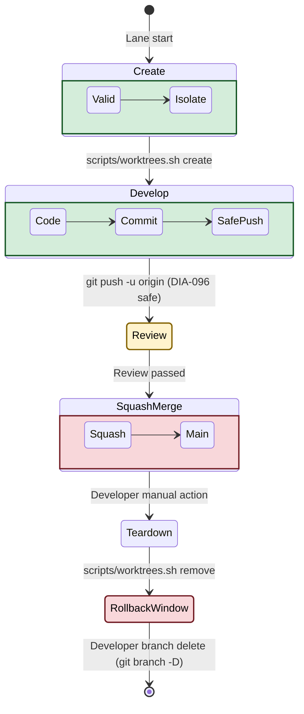

# Architecture: Dev-Infra (Parallel Dev Model)

Status: Retrospective (Implemented via DIA-100)
Parent: ../architecture.md
Decision Sources:

- DIA-073 (Developer decision 2026-08-09: worktrees-only model)
- DIA-096 (Developer decision 2026-08-11: safe vs destructive git operations)
- Commits: a387f72, 44865c3, 8cd270d

## Purpose

This document defines the architectural boundaries and operational mechanics of the "parallel dev model" for the dev-infra module. It governs how parallel OpenCode lanes operate concurrently within the repository, focusing on isolation, branch lifecycle, conflict resolution, and the physical safety constraints enforcing the DIA-096 git policy.

## Architectural Decisions (ADRs)

### ADR 1: Worktrees-Only Parallel Dev Model

- **Status:** Accepted (DIA-073 option d)
- **Context:** Parallel OpenCode sessions running in the same directory clobber shared state (like the single `.opencode/session/current-handoff.json` file), resulting in a last-writer-wins race condition.
- **Decision:** We use git worktrees for true parallel development. Each lane gets a completely independent working directory.
- **Consequences:** Eliminates the need for handoff file coordination protocols or locking mechanisms. Adds minimal disk overhead per lane.
- **Alternatives Considered:** Per-session handoff files, owner-field lock protocols, and registry-based pointers were rejected as over-engineering for a convenience file.

### ADR 2: Branch Naming Convention (DIA-074)

- **Status:** Accepted
- **Context:** Lanes create branches automatically. Without strict naming, the origin repository becomes polluted with unidentifiable AI-generated branch names.
- **Decision:** All lane-created feature branches must adhere strictly to `feature/<ticket>-<short-name>`. The stem must contain only alphanumeric characters, dots, underscores, or hyphens.
- **Consequences:** Ensures human readability and clear ticket traceability for every branch.
- **Alternatives Considered:** Using the generic worktree skill default `omos/<slug>` was rejected in favor of the explicit `feature/` convention.

### ADR 3: Squash-Merge Integration Strategy

- **Status:** Accepted
- **Context:** Parallel lanes produce numerous small, iterative commits. Merging these directly pollutes the main branch history.
- **Decision:** Code produced by lanes must be integrated into `main` via squash-merge after code review.
- **Consequences:** Keeps `main` linear and readable (one commit per ticket).
- **Alternatives Considered:** Rebase-merging was rejected because rebasing against a moving `main` requires a force-push, and force-pushes are strictly denied to lanes under DIA-096.

### ADR 4: Session Isolation via Physical Directories

- **Status:** Accepted
- **Context:** OpenCode needs isolated runtime states.
- **Decision:** Each worktree automatically provisions its own physical, git-ignored `.opencode/session/` directory. The creation script explicitly verifies this directory is not a symlink back to the primary checkout.
- **Consequences:** Lanes operate blindly to one another. There is zero state leakage.
- **Alternatives Considered:** Relying on process-level separation without physical directory isolation.

### ADR 5: DIA-096 Safe/Destructive Boundary Enforcement

- **Status:** Accepted
- **Context:** The OpenCode permission config globally restricts destructive git commands, but `git worktree remove --force` is not globally blocked by the config, creating a bypass vector for deleting dirty working state.
- **Decision:** The lifecycle CLI (`scripts/worktrees.sh`) enforces policy physically. `remove --force` explicitly requires the `WORKTREES_FORCE=1` environment variable, which lanes are not permitted to set.
- **Consequences:** Pushes policy enforcement to the shell script boundary, keeping OpenCode permission config uncluttered. Ensures a dirty worktree must be handed off to the developer.
- **Alternatives Considered:** Adding `git worktree remove --force` to the OpenCode JSON config deny list. Rejected to keep the CLI tools strictly self-policing.

### ADR 6: Conflict Escalation Criteria

- **Status:** Accepted
- **Context:** When lanes pull `main` into their feature branch, they may encounter merge conflicts. Infinite agent loops occur if they cannot resolve complex domain conflicts.
- **Decision:** A strict deterministic bounds policy: Lanes may resolve simple conflicts if they are confined to lane-owned hunks, have no semantic overlap, are 3 hunks or fewer, and both sides are clearly understood. Otherwise (e.g., generated artifacts, lockfiles, domain overlaps), the lane must escalate to the developer.
- **Consequences:** Prevents AI agents from hallucinating arbitrary conflict resolutions that break domain rules or derived artifacts.

### ADR 7: Worktree Location Deviation

- **Status:** Accepted
- **Context:** The generic worktrees skill defaults to `.slim/worktrees/`.
- **Decision:** We place worktrees in `.worktrees/` at the repository root. Branch slashes are mapped to dashes (e.g., `.worktrees/feature-DIA-100-name`).
- **Consequences:** Keeps paths flat and predictable at the repository root.

### ADR 8: Bash-3 Compatibility and Bounded Remote Checks

- **Status:** Accepted
- **Context:** Infrastructure scripts should be portable and resilient to network partitions.
- **Decision:** `worktrees.sh` uses strictly bash-3 compatible syntax. Remote branch collision checks during creation use a 5-second `timeout git ls-remote`.
- **Consequences:** Aligns with `session-log` constraints. Ensures an unreachable origin server does not block a local lane creation for minutes.

### ADR 9: Worktree husky shim materialization (copy, not install)

- **Status:** Accepted
- **Context:** DIA-174 S1: fresh git worktrees lack `.husky/_`, so the husky pre-commit hook (and with it the DIA-094 docker-container gate) is silently not enforced on worktree commits.
- **Decision:** `scripts/worktrees.sh create` COPIES `.husky/_` from the main tree into each new worktree at create time (filesystem-only operation; NOT `husky install`, NOT a symlink).
- **Consequences:** Deterministic, filesystem-only shim materialization with no `core.hooksPath` side effects; keeps each worktree isolated from the main tree's husky runtime; fails loudly when the main tree lacks `.husky/_` (no silent bypass of DIA-094).
- **Alternatives Considered:** `husky install` - rejected (mutates `.git/config`, cross-worktree side effects, husky binary required on PATH); symlink - rejected (breaks the worktree-isolation invariant and breaks on worktree moves).

### ADR 10: Batch-D behavioral suite persistence (committed, wired into test-config)

- **Status:** Accepted
- **Context:** DIA-174 S2 (design.md DD2) made `scripts/__tests__/batch-d-infra.test.mjs` gitignored by design ("session-local reconstruction" of the DIA-172 throwaway suite; absence fails `make test-config` loudly). Review of the 2-day commit window (DIA-176) found the fresh-clone gate break: a fresh clone lacks the file entirely, so `make test-config` hard-fails before any work can be validated - the gitignore rationale did not hold because the suite asserts committed files only (plugin classification outcomes, config grep checks, .sdd ADR structure), none of it session-local.
- **Decision:** The suite is UN-GITIGNORED and committed (DIA-176 F2), remaining wired into `make test-config` as the single entry point for batch-D infra invariants. Regeneration is by the maintainers when the plugin/config invariants it asserts evolve (documented in the file header + Makefile comment).
- **Consequences:** Fresh clones can run the full config gate without re-materialization; the suite ships with the repo and its drift is caught by the assertions themselves. Supersedes design.md DD2's "gitignored, recreate per session" decision.
- **Alternatives Considered:** Keep gitignored + add a Makefile existence check (rejected: silently skips the suite on fresh clone, weakening the gate); keep the suite in /tmp (rejected - the DIA-172 problem this suite was created to fix).

### ADR 11: Container Topology - One Dev-Toolchain Container + One Stateful Postgres

- **Status:** Accepted (supersedes the two-dev-image topology; refines DIA-260821-x5nj and ana025 Variant C)
- **Context:** Two developer workflows must share one repository: (a) Linux-in-container (runs make opencode / docker compose exec dev), and (b) Windows/WSL-host (runs opencode on the WSL host; uses the container only as the postgres host and the DIA-094 delegated test/lint executor). The legacy topology shipped two divergent dev images (Dockerfile.dev and tools/opencode-docker/Dockerfile) with drifted OpenCode pins and duplicated toolchain pins. ana023/ana024 documented the duplication; ana025 recommended keeping both runtime boundaries and deduplicating pins (Variant C). DIA-260821-x5nj instead selected a unified image (Dockerfile.dev), with DIA-260824-iirx grilling decisions removing the engine socket and Docker CLI, and DIA-260824-8k62 gating retirement of the legacy image.
- **Decision:** The development stack consists of exactly one writable dev-toolchain container (dev, image poetry-platform-dev built from Dockerfile.dev) plus one stateful database container (postgres, named volume pgdata). The dev image carries the full toolchain and the in-container opencode binary needed by the Linux workflow. Engine differences (Podman keep-id vs rootless Docker) are expressed only as compose overlays selected by scripts/compose-env.sh; OS differences as an optional WSL overlay. The legacy tools/opencode-docker runtime was retired under developer direction (acceptance chain superseded) (DIA-260824-8k62; commit 63d6478); no second dev image is maintained.
- **Consequences:** Database state is isolated from dev-image rebuilds by service and named-volume boundaries; a dev rebuild cannot destroy pgdata. The Windows/WSL-host developer does not depend on the container opencode binary; their crash exposure is host-side and unaffected by image rebuilds. Shared tool pins must have exactly one edit site; parity is enforced by a gate (check-pin-sync.sh family). The duplication that required dual BUN bumps is removed with the legacy image. The read-only/capability-dropped interactive boundary described in ana025 is intentionally not preserved; it was traded for drift elimination under the DIA-260824-iirx decisions. The dev healthcheck must not depend on the opencode binary, since one workflow never uses it. Host-side compose-config validation (`check-compose-config.sh`, wired into `verify-pre-push.sh`) replaces the in-container Docker CLI, which was removed from the image (~90MB savings). SSH agent forwarding (DIA-173, shipped and bats-covered in the retired tools/opencode-docker launcher) is deliberately not ported to the unified image; it probed the SSH_AUTH_SOCK / keyring / gcr sockets, mounted the first found read-only, and set SSH_AUTH_SOCK + GIT_SSH_COMMAND, with key material never entering the container. It was dropped as a consequence of retirement, not by decision, and is re-implemented only if an SSH-remote workflow inside the dev container appears.
- **Alternatives Considered:** Revert to two dev images (ana025 Variant C) - rejected: reintroduces the version drift that motivated the change and raises maintenance. Merge everything including postgres into one container - rejected: would couple durable state to dev-image lifecycle and rebuilds. Merge into the hardened opencode-docker image (ana025 Variant A) - rejected: high migration/security risk; loses the app toolchain and postgres network modeling.

#### Implementation status (2026-09-22)

Decision ACCEPTED by the developer. PHASE 1 COMPLETE (commit 07c0513): the opencode install block was moved to the last layer, immediately before the OMO cache layer. Measured ~85% reduction in invalidated layers per opencode bump (13 -> 3). PHASE-1 verification: test-shell 734 ok / 0 not-ok; opencode 1.18.32 + bun 1.4.2; binary ownership 1001:1001 preserved. The DNS misdiagnosis correction (plain docker compose build dev works, no --network=host needed) is recorded in the DIA-260922-cp0m ticket. PHASE 3 COMPLETE (commit 63d6478): the legacy tools/opencode-docker runtime was retired. PHASES 2/4/5 COMPLETE (commits 68b0283 + f67a97b): pins consolidated to 4-pair parity (check-pin-sync.sh), healthcheck decoupled from opencode (node probe), Docker CLI removed from image, host-side compose-config gate added. Last full run: test-shell 704 ok / 0 not-ok.

## Traceability Table

| ADR | Topic                     | Origin Ticket                    | Implementation Evidence                                                   |
| --- | ------------------------- | -------------------------------- | ------------------------------------------------------------------------- |
| 1   | Worktrees-Only Model      | DIA-073, DIA-100                 | `scripts/worktrees.sh`                                                    |
| 2   | Branch Naming             | DIA-074, DIA-100                 | `validate_branch` in `scripts/worktrees.sh`                               |
| 3   | Squash-Merge Strategy     | DIA-100                          | `docs/dev-infra-audit/worktree-conventions.md`                            |
| 4   | Session Isolation         | DIA-100                          | `cmd_create` isolation check in `worktrees.sh`                            |
| 5   | DIA-096 Boundary          | DIA-096, DIA-100                 | `cmd_remove` force guard in `worktrees.sh`                                |
| 6   | Conflict Escalation       | DIA-100                          | `worktree-conventions.md`                                                 |
| 7   | Worktree Location         | DIA-100                          | `WORKTREES_DIR` default in `worktrees.sh`                                 |
| 8   | Bash-3 / Remote Bounds    | DIA-100                          | `timeout 5 git ls-remote` in `worktrees.sh`                               |
| 9   | Worktree Husky Shim       | DIA-174                          | `cmd_create` husky shim copy in `worktrees.sh`                            |
| 10  | Batch-D Suite Persistence | DIA-174 DD2, DIA-176             | `scripts/__tests__/batch-d-infra.test.mjs` (tracked) + `make test-config` |
| 11  | Container Topology        | DIA-260922-cp0m, DIA-260821-x5nj | `Dockerfile.dev` + `docker-compose.yml` (two services: dev, postgres)     |

## Module Boundaries

What this module DOES cover:

- Branch generation, validation, and localized worktree shell commands.
- Localized git state isolation and OpenCode session separation.
- Escalation criteria for merge conflicts.

What this module DOES NOT cover:

- Global OpenCode agent permissions (managed by `.opencode/opencode.jsonc`).
- OpenSpec planning artifacts or domain logic specification.
- General AI prompt or skill definitions (except where they interact with the lifecycle CLI).

## Open Questions / Follow-ups

- **DIA-085 / ana011**: Parallel-session protocol finalization.
- **Skill Metadata Sync**: Determine if/how `scripts/worktrees.sh` should update `.slim/worktrees.json` for global skill metadata parity.
- **Tickets Ledger**: `docs/dev-infra-audit/tickets/README.md` requires an index row update (currently deferred due to uncommitted DIA-158 edits).

## Worktree Lifecycle Diagram

