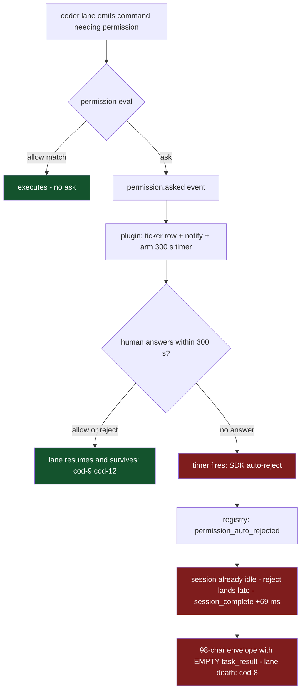
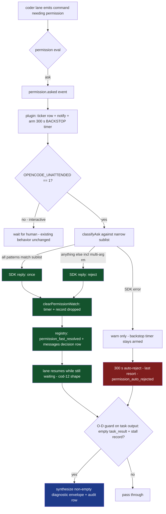

# permission-stall-hardening architecture

Status: accepted (developer-approved 2026-09-28). Governing campaign ticket: DIA-260928-nm2u. Persisted per DIA-174 R2.

## DESIGN_AUDIT

**What governs this change today:**

1. `AGENTS.md` - process authority. This change touches `.opencode/plugins/` (section 2.5 OpenCode-config workflow: ai-specialist gate -> developer decision -> architector design -> coder -> ai-auditor) and `scripts/overnight.sh` (section 2.4 dev-infra workflow: bats tests required). Section 2.5 step 1 is already satisfied by two committed learnings (`2026-09-27-permission-asks-unattended-gate.md`, `2026-09-27-cause-b-permission-ask-stall-gate.md`). Section 4 practice-protected zones apply: the allow-sublist literal is developer sign-off content.
2. `.sdd/scratch-lifecycle/architecture.md` ADR-001 (Status: proposed) - contains the O4 directive this design executes (:30-32: "make an unanswered ask non-fatal - tune/shorten the stall bound, surface the ask, or synthesize a non-fatal decision - so no ask class can end a lane with an empty envelope") and the invariant at :50-58 that this design operationalizes.
3. `.opencode/memory/adr.md:2513-2545` - the falsification record: scratch-lifecycle ADR-001's multi-argument-rm invariant was CONTRADICTED by runtime probes (2026-09-28), open ticket DIA-260928-rzty. The memory entry says "Do NOT edit the .sdd file; this entry records the contradiction so a future change corrects it." This design is that future change.
4. `.opencode/session/coder-lane-early-termination-synthesis.md` - retained incident state (cod-8 death signature, cod-12 reject-survival, :45-92).
5. Root `architecture.md` - does NOT govern. It is the application (poetry platform) architecture; this change is dev-infra/tooling surface. No module boundary in it is touched.
6. `.sdd/dia-redispatch-cycle/`, `.sdd/dev-infra/`, `.sdd/opencode-config/`, `.sdd/capability-authorization/` - adjacent; none address the permission-ask lifecycle. Not governing.

**What must be superseded/corrected:** scratch-lifecycle ADR-001 is partially consumed and partially corrected. Consumed: decision item 3 (the O4 spend directive) - this design IS that spend. Corrected: the falsified multi-argument-rm containment assumption; the invariant at :50-58 moves to the new module doc verbatim, with corrected enforcement semantics (the anchored allows are ask-suppression, never containment). Recommended: flip its Status to `superseded (partial) by .sdd/permission-stall-hardening` as part of implementation - the correction the memory entry anticipates. Flagged as a developer decision (practice-protected).

**Where the new ADRs belong:** a NEW module doc `.sdd/permission-stall-hardening/architecture.md`. Boundary reasoning: the module being designed is the permission-ask lifecycle (ask raised -> bounded resolution -> envelope outcome), spanning needs-input-observer, the task-output envelope, and the overnight launcher. scratch-lifecycle owns `.scratch` deletion policy (O1/O2/O3) - the incident that revealed the stall bug, not the stall mechanism. The invariant covers EVERY ask class in EVERY lane, a wider and different boundary than scratch cleanup. Per `.sdd/README.md` convention, an unnumbered dev-infra module directory is acceptable (precedent: `dia-redispatch-cycle/`).

## GOVERNING_DOCS

| Doc                                                                                                                   | Role for this change                                                                                                                             |
| --------------------------------------------------------------------------------------------------------------------- | ------------------------------------------------------------------------------------------------------------------------------------------------ |
| `AGENTS.md` sections 2.4, 2.5, 4, 5.1                                                                                 | Process gates; practice-protected sublist sign-off; ponytail ladder                                                                              |
| `.sdd/permission-stall-hardening/architecture.md` (NEW)                                                               | Home of ADR-001..004 + the moved invariant                                                                                                       |
| `.sdd/scratch-lifecycle/architecture.md`                                                                              | Partially superseded; O4 directive consumed                                                                                                      |
| `.opencode/memory/adr.md:2513-2545`                                                                                   | Falsification constraint on the sublist matcher design                                                                                           |
| `.opencode/session/coder-lane-early-termination-synthesis.md`                                                         | Death/survival evidence (cod-8/cod-9/cod-11/cod-12, :45-92)                                                                                      |
| `knowledge/ana-260927-6bpp-scratch-permission-model-safety/ana-260927-6bpp-scratch-permission-model-safety-report.md` | O-option analysis; "asks, not deletes, are the proven killer" (:28-31)                                                                           |
| `.opencode/learnings/external-patterns/2026-09-27-permission-asks-unattended-gate.md`                                 | ai-specialist gate findings: deny-before-ask (:30-32), --auto reframe (:33-36), timer ownership (:37-41), "raising the bound is a stopgap" (:52) |
| `.opencode/plugins/needs-input-observer.ts`                                                                           | The code being changed (verified :316-323, :347-362, :369-385, :393-402, :411-479, :1211-1218, :1367-1407)                                       |
| `.opencode/plugins/delegation-observer.ts`                                                                            | Envelope parse/measure precedents (:2654, :2751, :2941-2953, :3299-3341) - NOT modified                                                          |
| `scripts/overnight.sh` + `.opencode/opencode-overnight.jsonc`                                                         | Unattended launch contract (verified :214-215 export pattern; OPENCODE_PERMISSION mechanism :66-77)                                              |

## ADRS

### ADR-001: Resolve the ask FAST; keep the 300 s bound as last-resort backstop

**Status:** accepted (developer-approved 2026-09-28)
**Module:** permission-stall-hardening

**Context.** The confirmed fatal arm is the UNANSWERED 300 s window: cod-8 (no answer, auto-reject at +300.018 s, `session_complete` +69 ms, 98-char envelope with empty `<task_result>`) died; cod-12 (human REJECT at 28.2 s) survived with text (`coder-lane-early-termination-synthesis.md:50-53`). The reject decision itself is exonerated; the LATE reject - landing after the session went idle - is the killer. The ai-specialist gate ruled "Raising PERMISSION_STALL_TIMEOUT_MINUTES is a stopgap, not a fix" (`2026-09-27-permission-asks-unattended-gate.md:52`). The timer (`needs-input-observer.ts:316-323`, env `PERMISSION_STALL_TIMEOUT_MINUTES`, default 300 s), the arm path (:347-362 via `startPermissionWatch` :369-385), the SDK reject lever (`postSessionIdPermissionsPermissionId`, body `{response: "once"|"always"|"reject"}`, :436-439), and the audit rows (:452-458, :469-478) already exist and are tested (per-permission-rows test 3).

**Decision.**

1. In unattended mode, resolve every observed pending permission ask FAST (sub-second, at observation time) via the existing SDK permissions endpoint, with an explicit decision: `once` for asks whose every pattern matches the narrow allow-sublist, else `reject`. Never `always` (it persists and widens surface silently; an unattended grant must be per-ask and audited).
2. KEEP the 300 s watchdog and the existing `autoRejectPermission` path (:411-479) as the last-resort backstop. It fires only when the fast path failed (SDK error, plugin restart mid-flight). It is not removed and not re-tuned in this change.
3. On boot in unattended mode, fast-resolve re-armed pending asks too (a restart does not resurrect the human; re-arm path :673-755).

**Consequences.** The common unattended outcome becomes "decision in milliseconds while the model is still waiting" - the cod-12 shape, which the four-arm matrix showed is survivable. The backstop preserves invariant clause 1 (resolution within the configured stall bound) under fast-path failure. Interactive mode is byte-identical (ADR-002 gate). `permission_auto_rejected` rows keep their exact existing field shape so the old death signature (auto_rejected -> session_complete -> empty envelope) stays greppably distinct from the new health signature (`permission_fast_resolved` -> lane continues) in registry archaeology.

**Alternatives Considered.** (a) Shorten the bound - still produces the fatal shape, just sooner: any reject landing after idle risks the empty envelope; the failure is timing-relative-to-idle, not the absolute value. (b) Raise the bound - the gate's rejected stopgap; stalls persist. (c) Remove auto-reject - asks hang forever, lanes hang; strictly worse. (d) `--auto` - does not cascade to child/subagent sessions (upstream #36868, #43888); this project's lanes are children. (e) The dormant `permission.ask` hook - see ADR-004.

### ADR-002: Unattended gating signal is a dedicated env var exported by scripts/overnight.sh

**Status:** accepted (developer-approved 2026-09-28)
**Module:** permission-stall-hardening

**Context.** The fast path must never fire in an interactive session ("interactive sessions must be completely unaffected"). Candidates are evaluated in GATING_SIGNAL below. The overnight launcher already exports `OPENCODE_CONFIG` and `OPENCODE_PERMISSION` (`scripts/overnight.sh:214-215`) and is the project's single sanctioned unattended entry point (DIA-126/DIA-134).

**Decision.** Gate on `process.env.OPENCODE_UNATTENDED === "1"`, exported by `scripts/overnight.sh` (one-line addition alongside :214-215). Evaluated per-ask (no caching, so tests can toggle). Absent/unset/any other value = interactive = fast path behaviorally compiled out.

**Consequences.** Zero false positives interactively (fail-safe default). Testable by env injection in the existing hermetic harness. One-line launcher change plus one bats assertion. Recorded implication: unattended runs launched by any other path are NOT covered; they degrade to today's backstop + O-D guard behavior (bounded damage, not absence of protection), and the fix is launcher discipline, which is already project convention.

**Alternatives Considered.** OPENCODE_PERMISSION-presence proxy (conflates payload with mode; any future OPENCODE_PERMISSION use silently enables auto-answering; misleading in audits - rejected). Runtime `--auto` detection (no detection surface exists in the plugin ctx; and --auto does not cascade to child asks, so the sessions needing O-B are invisible to it anyway - impossible today). Session-level marker file (lifecycle/staleness management for a process-level binary fact - over-engineering). Always-on fast path (violates the interactive-untouched requirement - rejected).

### ADR-003: O-D envelope guard in needs-input-observer, mutation-attempt with audited fallback

**Status:** accepted (developer-approved 2026-09-28)
**Module:** permission-stall-hardening

**Context.** cod-8's death signature ends in a 98-char envelope with an empty `<task_result>` body. Whether OpenCode honors a mutation of `output.output` in `tool.execute.after` is UNDETERMINED. The output object is read as a mutable string property at `delegation-observer.ts:2654` and :2751; the `<task_result>` body measurement precedent is :2941-2953; the existing empty-result detector is :3299-3341. needs-input-observer already has a task branch in its `tool.execute.after` (:1211-1218).

**Decision.**

1. The guard lives in **needs-input-observer.ts** (single-plugin ownership of the whole stall lifecycle; no cross-plugin state). It triggers narrowly: `input.tool === "task"` AND empty/whitespace `<task_result>` body (or no parseable envelope) AND an unconsumed stall record (fast-resolved or auto-rejected) exists for the parsed child task id within TTL. It does NOT trigger on non-stall empty envelopes - those keep the existing `empty_result_detected` semantics (:3299-3341, read-only exemptions intact).
2. It attempts `output.output = synthesized`, where the synthesized text preserves the original envelope shape (task id, `state="completed"`) and replaces only the empty body with a non-empty diagnostic naming the session, the permission id, the decision, and the registry rows to consult.
3. Regardless of whether the mutation is honored, it emits a `permission_stall_envelope_synthesized` registry row carrying the diagnostic text. If a one-time live probe shows mutation is NOT honored, the fallback is already running: the diagnostic rides the registry row and the existing empty-result detector + orchestrator redispatch protocol handle the lane (today's working behavior, upgraded with a named cause).
4. The diagnostic text builder is a pure function shared by both paths, so post-probe cleanup is deleting one branch.

**Consequences.** Primary case: invariant clause 2 (non-empty result envelope) holds mechanically. Fallback case: clause 2 holds procedurally (non-empty diagnostic in the audit trail + redispatch), and the probe result decides which branch survives. Stall records are in-memory per session with a 10-minute TTL (the task output arrives seconds after the reject - cod-8: +69 ms); accepted ceiling: a stall record across a plugin restart is missed and falls to the existing detector, marked with a `ponytail:` comment in code. In interactive sessions the guard is inert (a human answers inside 300 s, so no stall record exists); the one interactive case with a record is the cod-8 case itself, where synthesis is the fix, not a regression.

**Alternatives Considered.** Guard in delegation-observer (needs the stall record to cross plugins via a globalThis Symbol store; established pattern - `Symbol.for` stores at needs-input-observer.ts:243-250 - but coupling without benefit; rejected). Session-abort-based synthesis (no per-tool abort exists; whole-session abort destroys resumable state; rejected). Tool-result injection API (does not exist upstream; rejected).

### ADR-004: `permission.ask` is a migration target, not the mechanism

**Status:** accepted (developer-approved 2026-09-28)
**Module:** permission-stall-hardening

**Context.** `"permission.ask"` (input Permission, output `{status:"ask"|"deny"|"allow"}`) is declared in the installed `@opencode-ai/plugin` types (~`dist/index.d.ts:225-227`, per the established ground truth - the file is not present under `/workspace` to re-verify) but upstream issue #7006 (open since 2026-01-05) records that core never triggers it. No project plugin subscribes it.

**Decision.** The mechanism is the post-hoc `event` catch-all (`permission.asked`/`permission.v2.asked`, needs-input-observer.ts:1367-1407) plus SDK reply - it works on today's runtime. The migration seam is structural: the event case parses the untyped event into a typed `AskSignal {sessionID, permissionID, permission, patterns}` and calls ONE internal `resolveAsk(signal)`. When #7006 lands, a thin adapter maps the hook's typed Permission to the same `AskSignal`, calls the same `resolveAsk`, and translates the decision to the hook's return (`allow`/`deny`/`ask`). No dead subscription is shipped now; a follow-up ticket tracks adding the ~10-line hook when core emits it.

**Consequences.** Migration is deletion of the event-case parsing plus the adapter, not re-architecture. Open semantic question recorded in OPEN_QUESTIONS: whether the hook's `allow` is once-or-always upstream.

**Alternatives Considered.** Subscribe the hook now as dead code (ponytail: no speculative scaffolding; rejected). Build on the hook as the primary mechanism (builds on a non-firing upstream contract; rejected).

## MECHANISM

**Where the fast path triggers.** In `needs-input-observer.ts`, inside the `event` hook's `permission.asked`/`permission.v2.asked` case (:1367-1407), AFTER the existing `enterPermission(...)` (:999-1022) and the `permission_asked_logged` registry row (:1398-1405). Order is preserved deliberately: the persisted record exists BEFORE the SDK call, so a crash between ask and resolve is recovered by the boot rule. Gate:

```
if (unattendedMode() && typeof permissionID === "string" && permissionID) {
  await fastResolveAsk({ sessionID, permissionID, permission: p?.permission, patterns })
}
```

Also on boot: after `seedFromDisk()` (:1174), in unattended mode, iterate `permissionAsks` and `void fastResolveAsk(...)` each (ADR-001 item 3). Awaiting in the event handler mirrors the existing `await notify(...)` precedent (:1019); one SDK call is the same order of latency as the toast call already on that path.

**Classification and the allow-sublist (kept NARROW).** New pure lib module `.opencode/plugins/lib/permission-fast-resolve.ts`, DI'd like `lib/stall-sweep.ts` (injected `now`, client, journal, env lookup; no ctx capture - the settled DI seam from `stall-sweep.test.mjs:1-30`). Shape:

```ts
type AskSignal = {
  sessionID: string;
  permissionID: string;
  permission?: string;
  patterns?: string[];
};
type FastDecision = { decision: 'once' | 'reject'; matchedRule: string | null };

// v1 seed - ONE entry. Adding an entry requires a DIA ticket + developer
// sign-off (practice-protected). Every entry must name its invariant.
const UNATTENDED_ALLOW_SUBLIST = [
  {
    permission: 'bash',
    rule: 'rm .scratch single-target',
    match: (pattern: string): boolean => {
      const toks = pattern.trim().split(/\s+/);
      if (toks[0] !== 'rm') return false;
      const targets = toks.slice(1).filter((t) => !t.startsWith('-'));
      // Multi-argument rm is REJECTED here - the "anchored allows contain
      // multi-arg rm" invariant was FALSIFIED (memory/adr.md:2513-2545,
      // probe table A-E). Exactly one non-flag target, under .scratch only.
      if (targets.length !== 1) return false;
      const t = targets[0];
      return t.startsWith('/workspace/.scratch/') || t.startsWith('.scratch/');
    },
  },
];
// ponytail: naive whitespace tokenizer (no quote/escape handling - quoted
// forms fail closed to reject). Upgrade to a real shell lexer only if the
// sublist grows beyond the rm family.

function classifyAsk(signal: AskSignal): FastDecision {
  for (const entry of UNATTENDED_ALLOW_SUBLIST) {
    if (signal.permission !== entry.permission) continue;
    const patterns = signal.patterns ?? [];
    // "once" requires EVERY pattern of the ask to match - an ask carrying
    // any out-of-sublist pattern rejects as a whole.
    if (patterns.length > 0 && patterns.every((p) => entry.match(p))) {
      return { decision: 'once', matchedRule: entry.rule };
    }
  }
  return { decision: 'reject', matchedRule: null };
}
```

Narrowness mechanics: (1) literal array in the lib, no config file - edits are code-review events; (2) `matched_rule` is written to the registry row on every resolution, so sublist drift is auditable from `registry.jsonl`; (3) the multi-target rejection encodes the falsified-invariant lesson structurally; (4) fail-closed: anything unrecognized rejects.

**fastResolveAsk - exact ordering and the race with the backstop timer:**

```
1. Guard: if the permission key is absent from permissionAsks, return
   (a reply or a prior resolution already handled it).
2. classifyAsk -> decision.
3. await ctx.client.postSessionIdPermissionsPermissionId(
     { body: { response: decision }, path: { id: sessionID, permissionID } })
   - on res.error or throw: console.warn; LEAVE record + waiting row +
     armed timer untouched; return. The backstop resolves within the
     bound (invariant clause 1 holds). No v1 retry; the backstop IS the retry.
4. On success: clearPermissionWatch(sessionID, permissionID)   // existing :393-402
   - clearTimeout(timer) + delete the handle -> the backstop CANNOT fire;
   - delete the permissionAsks record -> autoRejectPermission's
     record-absence guard (:417-419) is the second fence if a fire was queued.
5. appendRegistryRow({ event: "permission_fast_resolved", session_id,
   permission_id, decision, matched_rule, elapsed_ms, mode: "unattended" })
6. appendMessageRow({ "gen_ai.operation.name": "invoke_workflow",
   from: "orchestrator", event_type: "decision", task_ref: sessionID,
   resolution_status: "done", content_ref: `permission_fast_resolved_${decision}`,
   next_action: "lane continues with decision", "gen_ai.agent.id": sessionID })
7. Record the O-D stall record: stallRecords.set(sessionID,
   { decision, permissionID, source: "fast_resolved", at: now() })
```

Race matrix (both-fire cases):

| Case                                                                   | Outcome                                                                                                                                                                        |
| ---------------------------------------------------------------------- | ------------------------------------------------------------------------------------------------------------------------------------------------------------------------------ |
| Fast path succeeds, timer later fires                                  | Impossible: `clearPermissionWatch` deleted the handle and record; even a queued fire hits the :417-419 guard and returns                                                       |
| Timer fires first (fast path failed or plugin restarting)              | `permission_auto_rejected` as today; a late fast-path attempt finds the record absent (step-1 guard) and stands down before any SDK call                                       |
| Human replies while the fast path is in flight (unattended mis-launch) | `permission.replied` clears the record (:1444-1460); the SDK reply then 404s -> warn, stand down, backstop already cleared; no resolution row written (no resolution occurred) |

**Accepted bounded residual (v1): boot double-fire interleaving.** The step-1 record guard above only prevents those cases under SEQUENTIAL ordering. At boot the re-armed 0 ms backstop callback and the `void fastResolveAsk(...)` call can BOTH pass their record guards before either deletes the record: the fast path reads the record at step 1, suspends on its SDK reply, and the timer callback's guard runs before the fast path's step 4 clears. That interleaving can yield two SDK replies and BOTH a `permission_fast_resolved` and a `permission_auto_rejected` row for one ask. Bounded: duplicate audit rows are the only lasting artifact; whichever reply lands second 404s to a `console.warn`; the decisions agree at boot (the persisted ask carries no permission name, so boot classification is fail-closed reject - the same decision the backstop always sends); record/timer deletes are idempotent on both paths. No v1 code change - accepted until registry archaeology shows the double-row shape mattering.

**The existing bound: KEPT as last-resort backstop** (ADR-001 item 2). Not removed, not re-tuned. `PERMISSION_STALL_TIMEOUT_MINUTES` (:316-323) still bounds resolution when the fast path fails. `permission_auto_rejected` rows keep their exact existing field set (`session_id`, `permission_id`, `timeout_seconds`, `reason: "no_human_response_within_threshold"`, :452-458) plus the existing messages row (:469-478, content_ref `permission_auto_rejected_after_Nmin`, resolution_status `escalated`) - the death signature stays greppably distinct from the new health signature.

**New row types and field sets:**

- Registry `permission_fast_resolved`: `{ event, session_id, permission_id, decision: "once"|"reject", matched_rule: string|null, elapsed_ms: number, mode: "unattended" }` (`writer: "plugin"` auto-added by `appendRegistryRow`, :333-336).
- Messages (paired with the above): `{ "gen_ai.operation.name": "invoke_workflow", from: "orchestrator", event_type: "decision", task_ref, resolution_status: "done", content_ref: "permission_fast_resolved_<decision>", next_action: "lane continues with decision", "gen_ai.agent.id": sessionID }`.
- Registry `permission_stall_envelope_synthesized`: `{ event, session_id (child or "unknown"), decision_source: "fast_resolved"|"auto_rejected", mutation_attempted: true, diagnostic_len: number }` plus the full diagnostic text in a `diagnostic` field so the fallback path preserves it for audit.

**O-D envelope guard (same plugin).** Extend the existing `tool.execute.after` task branch (:1211-1218):

```
if (input.tool === "task") {
  ...existing parentSessionId / delegationsSinceIdle logic...
  envelopeGuard(input, output)   // new
}

function envelopeGuard(input, output) {
  const text = typeof output?.output === "string" ? output.output : ""
  const body = /<task_result>\s*([\s\S]*?)\s*<\/task_result>/i.exec(text)
  if (body && body[1].trim().length > 0) return            // healthy, pass through
  const idMatch = /<task[^>]*\bid="([^"]+)"/i.exec(text)
  const childId = idMatch?.[1]
  const rec = childId ? stallRecords.take(childId) : stallRecords.takeOnly()
  if (!rec) return            // not stall-terminated: leave to empty_result_detected
  const diagnostic = buildStallDiagnostic(rec)              // pure fn, shared by both paths
  const synthesized = rewrap(text, diagnostic)              // preserves envelope shape/id/state;
                                                            // full minimal envelope if none
  try { output.output = synthesized } catch { /* console.warn */ }
  appendRegistryRow({ event: "permission_stall_envelope_synthesized", ... })
}
```

`stallRecords` is an in-memory `Map<sessionID, record>` with a 10-minute TTL, lazily pruned on access (the `recentRenames` pattern :1039-1053). Records are consumed on use (`take`). `takeOnly()` handles the no-envelope case only when exactly one record is pending (ambiguity guard; otherwise stand down).

**Interactive mode untouched - mechanical guarantees:**

1. The fast path is gated per-ask on `process.env.OPENCODE_UNATTENDED === "1"`; the gate-off path is byte-identical to today (RED-4 pins it: no SDK call, timer armed, waiting row present, only `permission_asked_logged` emitted).
2. O-D is deliberately ungated but narrowly triggered (empty body + stall record). Interactively a human answers inside 300 s, so no stall record exists and the guard is inert; the only interactive case producing a record is the cod-8 case itself (300 s unanswered = de facto unattended), where synthesis is the fix, not a regression.
3. Fail-soft throughout: every new path try/catch + `console.warn`; hooks never throw (plugin header contract :36-44).

**O-A companion seam (seam only, contents deferred).** `classifyAsk` plus the `permission_fast_resolved` registry stream are the seam: the rows record every ask class that REACHED the plugin in unattended runs - exactly the input an unattended permission profile (O-A) needs to map every ask-capable class to explicit allow/deny. One shared classifier, one audit stream; profile contents are a separate ticket.

## GATING_SIGNAL

| Candidate                                                                                                                                      | Pros                                                                                                                                                                                                                                                                                                                                      | Cons                                                                                                                                                                                                     | Verdict                                                                       |
| ---------------------------------------------------------------------------------------------------------------------------------------------- | ----------------------------------------------------------------------------------------------------------------------------------------------------------------------------------------------------------------------------------------------------------------------------------------------------------------------------------------- | -------------------------------------------------------------------------------------------------------------------------------------------------------------------------------------------------------- | ----------------------------------------------------------------------------- |
| **`OPENCODE_UNATTENDED=1` env var, exported by `scripts/overnight.sh`**                                                                        | Explicit contract; zero interactive false positives; fail-safe default (absent = interactive); trivially testable via env injection in the hermetic harness; one-line launcher change beside the existing `OPENCODE_CONFIG`/`OPENCODE_PERMISSION` exports (`scripts/overnight.sh:214-215`); the env value doubles as a kill switch (`=0`) | Covers only overnight.sh launches; ad-hoc unattended invocations unmarked                                                                                                                                | **CHOSEN**                                                                    |
| `scripts/overnight.sh` + `.opencode/opencode-overnight.jsonc` profile detection (e.g. via `OPENCODE_CONFIG` pointing at the overnight profile) | Already exactly the unattended marker pair today                                                                                                                                                                                                                                                                                          | `OPENCODE_CONFIG` is a path, not a mode flag; comparing paths is brittle (symlinks, relative forms, future profiles); conflates "which config" with "is anyone watching"                                 | Rejected as the signal; kept as the launch mechanism that sets the chosen var |
| `OPENCODE_PERMISSION` presence as proxy                                                                                                        | Zero new contract; today set only by the overnight launcher (:215)                                                                                                                                                                                                                                                                        | Conflates the permission payload with a mode signal; any future OPENCODE_PERMISSION use (a different hardening experiment) silently enables auto-answering; semantically misleading in audit rows        | Rejected                                                                      |
| Session-level marker file                                                                                                                      | Per-session granularity                                                                                                                                                                                                                                                                                                                   | Lifecycle + staleness management for what is a process-level binary fact; plugins are per-process, so granularity buys nothing; crash leaves stale markers                                               | Over-engineering                                                              |
| (evaluated and rejected without table row) Runtime `--auto` detection                                                                          | Precise semantics                                                                                                                                                                                                                                                                                                                         | No detection surface exists in the plugin ctx (no flag, no config echo); and `--auto` does not cascade to child/subagent asks (#36868, #43888), so the sessions that need O-B are invisible to it anyway | Impossible today                                                              |

**Chosen:** `OPENCODE_UNATTENDED=1`, exported by `scripts/overnight.sh`.

**Reason:** it is the only candidate that is an explicit, intentional contract with a fail-safe default. Every alternative either conflates two concerns (OPENCODE_PERMISSION, OPENCODE_CONFIG path), is undetectable from inside the plugin (--auto), or manages state for a fact that is process-level and binary (marker file). The plugin already reads process env for its one other tunable (`PERMISSION_STALL_TIMEOUT_MINUTES`, :316-323), so the mechanism is established.

**Availability limitation:** the signal is reliable exactly to the extent unattended launches route through `scripts/overnight.sh` - already the project's sanctioned convention (DIA-126/DIA-134). A plain `opencode` invocation left alone is NOT marked; it degrades to today's behavior (300 s backstop + O-D guard + empty-result detector), which is bounded damage, not absence of protection. Widening coverage later means exporting the same var from any new unattended launcher - one line per launcher, no plugin change.

## SEAMS_AND_TESTS

**Existing seams reused (no new harness infrastructure):**

| Seam                                                                                                              | Source                                                                     | Used for                     |
| ----------------------------------------------------------------------------------------------------------------- | -------------------------------------------------------------------------- | ---------------------------- |
| Hermetic plugin factory + temp workspace + fake SDK client capturing `postSessionIdPermissionsPermissionId` calls | `per-permission-rows.test.mjs:60-79` (`freshCtx`, `permissionRejectCalls`) | RED-1,2,3,4,6                |
| Seeded backdated `ticker.json` so the re-armed timer has 0 ms remaining                                           | `per-permission-rows.test.mjs` test 3 (:174-245)                           | RED-5 invariant test         |
| Pure DI'd lib module (`createStallSweep(deps)` pattern: injected now/timers/journal, no ctx capture)              | `lib/stall-sweep.ts` + `stall-sweep.test.mjs:1-30`                         | decision-function unit table |
| bats launcher tests                                                                                               | `scripts/__tests__/overnight.bats`                                         | env export assertion         |

**Faked vs real:** clock = real `Date.now` with backdated seeded timestamps (integration) + DI `now` (lib unit); registry/messages = REAL `lib/registry.ts` writing the temp workspace (rows asserted from the actual jsonl, per test 3's pattern :218-241); SDK client = fake (call capture); timers = real `setTimeout` with 0 ms remaining (integration), DI fakes (lib unit).

**RED tests to write first** (new file `.opencode/plugins/__tests__/needs-input-observer.fast-resolve.test.mjs`):

- **RED-1** unattended + `permission.asked` (`bash`, `rm -rf /workspace/.scratch/ordertest`) -> SDK called with `{response: "once"}`; `permission_fast_resolved` row with `decision:"once"`, `matched_rule:"rm .scratch single-target"`; permission key's timer handle gone from the globalThis store.
- **RED-2** unattended + ask (`bash`, `rm -rf /tmp/x`) -> `{response: "reject"}`; row with `decision:"reject"`, `matched_rule:null`.
- **RED-3** unattended + multi-arg (`rm -rf /workspace/.scratch/x /tmp/y`) -> `reject` (the falsified-invariant guard).
- **RED-4** interactive (env absent) + `permission.asked` -> NO SDK call; timer armed; waiting row present; `permission_asked_logged` row only. (Pins byte-identical interactive behavior.)
- **RED-5 THE INVARIANT TEST**: seed ticker.json with an ask backdated 10 min, boot with `OPENCODE_UNATTENDED=1` -> assert a resolution row exists (fast or backstop); then drive `hooks["tool.execute.after"]({tool:"task",...}, {output:'<task id="ses_X"><state>completed</state><task_result></task_result></task>'})` -> assert (primary) post-hook `output.output` contains a non-empty `<task_result>` body, and (both modes) a `permission_stall_envelope_synthesized` registry row; assert NO `permission_auto_rejected` row is followed by a zero-length envelope.
- **RED-6** race: fast-resolved permission, then manually invoke the would-be timer callback -> `autoRejectPermission` no-ops (no second SDK call, no `permission_auto_rejected` row).
- **RED-7** SDK failure path: fake client returns `{error}` -> warn, record+timer retained, backstop still armed (invariant clause 1 under failure).
- bats: `overnight.sh` exports `OPENCODE_UNATTENDED=1` before exec (extend the existing extraction test pattern).

**Single highest-value seam:** the hermetic factory + fake-client integration through `hooks.event(permissionAsked(...))` (RED-1/2/5 shape). It exercises the real wiring end to end - event parsing, gate, classify, SDK reply, timer clear, registry rows - with only the network faked, and it is where the invariant's clause-1 proof lives. The pure `classifyAsk` unit table is second (cheap, pins narrowness and the multi-arg guard), but it cannot prove the wiring.

**Live (non-harness) evidence still owed after implementation:** one scripted unattended probe lane that emits an ask, to confirm (a) the SDK accepts a reply at T~0 and (b) whether core honors the `output.output` mutation (decides the O-D branch cleanup per ADR-003).

## DIAGRAMS

BEFORE (current lifecycle - the cod-8 death):



AFTER (O-B fast resolution + O-D envelope guard, unattended mode):



Race ordering (fast path vs backstop):

```mermaid
sequenceDiagram
    participant Core as OpenCode core
    participant Plug as needs-input-observer
    participant SDK as permissions endpoint
    Core->>Plug: permission.asked event
    Plug->>Plug: enterPermission (row + notify + arm 300 s timer)
    alt unattended
        Plug->>SDK: reply once/reject (T+~0)
        SDK-->>Plug: ok
        Plug->>Plug: clearPermissionWatch (timer deleted, record dropped)
        Note over Plug: a queued timer fire now hits the record-absence guard - no-op
    else SDK error
        SDK-->>Plug: error
        Plug->>Plug: warn; record + timer RETAINED
        Note over Plug,SDK: 300 s backstop resolves later - invariant clause 1
    end
```

## ROLLBACK_AND_BLAST_RADIUS

**Files changed (implementation estimate):**

| File                                                                           | Change                                                                                                    | Revert cost             |
| ------------------------------------------------------------------------------ | --------------------------------------------------------------------------------------------------------- | ----------------------- |
| `.opencode/plugins/needs-input-observer.ts`                                    | O-B fast path + O-D guard + 2 new row types (additive; no existing line's behavior changes when gate off) | git revert              |
| `.opencode/plugins/lib/permission-fast-resolve.ts` (NEW)                       | pure classifier + diagnostic builder (DI'd)                                                               | delete file with revert |
| `scripts/overnight.sh`                                                         | +1 export (`OPENCODE_UNATTENDED=1`)                                                                       | revert one line         |
| `scripts/__tests__/overnight.bats`                                             | +1 assertion                                                                                              | revert                  |
| `.opencode/plugins/__tests__/needs-input-observer.fast-resolve.test.mjs` (NEW) | RED suite                                                                                                 | delete with revert      |
| `.sdd/permission-stall-hardening/architecture.md` (NEW)                        | ADR-001..004 + invariant (persisted per DIA-174)                                                          | n/a (docs)              |
| `.sdd/scratch-lifecycle/architecture.md`                                       | Status flip only (developer decision, practice-protected)                                                 | revert                  |

**NOT touched:** `.opencode/opencode.jsonc` and `opencode-overnight.jsonc` permission maps (O-A is a separate companion ticket); `delegation-observer.ts` (guard lives in needs-input-observer); any agent prompt.

**Rollback:**

1. **Config-level (instant, no revert):** the fast path only runs when `OPENCODE_UNATTENDED=1`; removing the export (or launching interactively) restores today's fast-path behavior while the O-D envelope guard remains active for stall-terminated lanes (ADR-003 rules synthesis the fix, not a regression). The env value check doubles as a kill switch in unattended runs (`=0`).
2. **Code-level:** single git revert of the plugin commit. The 300 s backstop path is the pre-change code path preserved, so a revert never strands an ask - it returns to the cod-8-capable behavior, which is the known risk being accepted only during rollback.
3. **Registry compat:** the new row types are additive events; existing consumers (`scripts/lane-resume` keys on `empty_result_detected`; stall-sweep reads dispatch rows) are untouched. `permission_auto_rejected` keeps its exact shape.

## TRACEABILITY

| Decision                           | Source (tier)                                                                                                                                                                                                                                                                                                                                                                                                                                  |
| ---------------------------------- | ---------------------------------------------------------------------------------------------------------------------------------------------------------------------------------------------------------------------------------------------------------------------------------------------------------------------------------------------------------------------------------------------------------------------------------------------- |
| Fast resolve over bound-tuning     | learnings `2026-09-27-permission-asks-unattended-gate.md:52` ("stopgap, not a fix") (T1); cod-12 reject-survival, `coder-lane-early-termination-synthesis.md:50-53` (T1); `.sdd/scratch-lifecycle/architecture.md:30-32` O4 directive (T1)                                                                                                                                                                                                     |
| SDK lever + row shapes             | `needs-input-observer.ts:436-439, :452-458, :469-478` (T1, verified this lane)                                                                                                                                                                                                                                                                                                                                                                 |
| `once` not `always`                | opencode.ai/docs/permissions per brief's fetched docs (T2); minimal-surface + per-ask auditability principle (AGENTS.md section 1)                                                                                                                                                                                                                                                                                                             |
| Multi-arg rm guard in classifier   | `.opencode/memory/adr.md:2513-2545` falsification record + `2026-09-28-permission-guard-ineffective-multi-argument-rm.md` probe table A-E (T1)                                                                                                                                                                                                                                                                                                 |
| Sublist narrowness governance      | AGENTS.md section 4 practice-protected zones (T1); falsification lesson (T1)                                                                                                                                                                                                                                                                                                                                                                   |
| Backstop retention                 | invariant clause 1; existing tested code `:411-479` + per-permission-rows test 3 (T1)                                                                                                                                                                                                                                                                                                                                                          |
| Env gating via overnight.sh        | `scripts/overnight.sh:214-215` export pattern (T1); `opencode-overnight.jsonc:66-77` mechanism doc (T1)                                                                                                                                                                                                                                                                                                                                        |
| `--auto` not a fix                 | upstream #36868, #43888 (per brief, T2); learnings :33-36 reframe (T1)                                                                                                                                                                                                                                                                                                                                                                         |
| deny-default in non-interactive    | Claude Code hooks reference (per brief, T2 dated)                                                                                                                                                                                                                                                                                                                                                                                              |
| O-D seam + fallback                | `delegation-observer.ts:2654, :2751, :2941-2953, :3299-3341` (T1, verified); mutation-honored UNDETERMINED (brief, T2)                                                                                                                                                                                                                                                                                                                         |
| `permission.ask` migration target  | installed types ~:225-227 (per brief ground truth; NOT re-verified - file absent under `/workspace`); issue #7006 (T2)                                                                                                                                                                                                                                                                                                                         |
| Fail-soft everywhere               | plugin header contract `needs-input-observer.ts:36-44` (T1)                                                                                                                                                                                                                                                                                                                                                                                    |
| Boot fast-resolve of re-armed asks | `seedFromDisk` re-arm path `:673-755` (T1)                                                                                                                                                                                                                                                                                                                                                                                                     |
| **[INFERENCE]**                    | (1) A T~0 reject lands while the model still waits - extrapolated from cod-12 (28.2 s survived); strong but timing inference, to be confirmed by the live probe. (2) SDK accepts replies at T~0 (endpoint only observed at T+300 s) - covered by RED-7 + backstop. (3) `takeOnly()` no-envelope correlation heuristic. None is the sole basis for a load-bearing decision: (1) and (2) are backstopped, (3) degrades to the existing detector. |

## OPEN_QUESTIONS

1. Does core honor `output.output` mutation in `tool.execute.after` for `task`? Probe plan: one scripted unattended lane returning nothing, with the guard's audit row recording the attempt; the outcome decides which ADR-003 branch is deleted.
2. Does the SDK permissions endpoint accept a reply at T~0 (immediately after `permission.asked`)? Covered by RED-7 + backstop; live probe confirms.
3. When #7006 lands: is the `permission.ask` hook's `allow` once-or-always? Adapter decision deferred to the migration ticket.
4. Scope of the fast path: all asks in unattended mode (designed) vs coder-lane children only (the invariant's literal wording). Recommendation: all asks - orchestrator stalls are the same bug class and a uniform gate is simpler. Developer sign-off requested (practice-protected). RESOLVED 2026-09-28: developer approved ALL asks in unattended mode (not coder-lane children only).
5. Sublist seed content: exactly one entry (`rm` single-target under `.scratch`, both anchor forms) - developer approves the literal before implementation (practice-protected zone). RESOLVED 2026-09-28: developer approved the single-entry sublist exactly as designed (permission bash; rm with exactly one non-flag target under .scratch/, both the /workspace/.scratch/ and relative .scratch/ anchor forms). Multi-argument rm rejects as a whole. Any future entry requires its own ticket plus developer sign-off.
6. O-A companion profile: contents deferred by design; the `classifyAsk` + `permission_fast_resolved` audit stream is the seam that feeds it.
