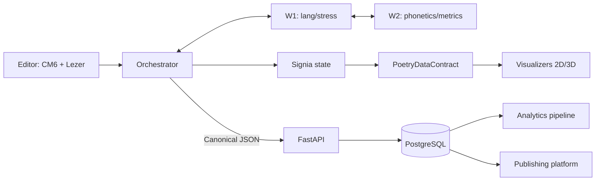

# Architecture

```
flowchart TB
    A>Raw Poem Input] --> ED

    subgraph UI ["1. Main Thread — Editor"]
        ED["CodeMirror 6 Editor
        ---
        text lives in CM6's internal Rope,
        we do NOT duplicate it in state —
        only annotations on top of the CM6 tree"]

        MP["Lezer Parser — MarkPoetry DSL
        ---
        incremental: only the changed line"]

        TR["CM6 Tree + Delta
        ---
        ChangeSet with stable token IDs
        and revision_id"]

        ED --> MP
        ED --> TR
    end

    subgraph STATE ["2. Main Thread — State"]
        MO["Orchestrator — Command Pattern
        ---
        single write point,
        compares revision_id, discard stale.
        Sends ONE postMessage to W1.
        Receives ONE consolidated payload
        (Pure TS Object + Transferable ArrayBuffers).
        No protobuf overhead inside Main Thread!"]

        ST["Signia LINE Atoms
        ---
        Map + Order Array (No cascading).
        LineAtom uses types aligned with .proto schema:
        lineId: string
        tokens: IToken[]
          text, lang,
          stressIdx, stressSource,
          isHeteronym, stressVariants[],
          ipa, syllables[]"]

        MO -->|"Single Write"| ST
        ST -.->|"Decorations:
        green=auto, blue=ml, yellow=heteronym
        underline=user override"| ED
    end

    TR --> MO
    MP -->|"MarkPoetry command"| MO
    UO>User Overrides] -->|"SetLang / SetStress / ResolveHeteronym"| MO
    MD>Metadata] --> MO

    ST <-->|"delta sync (IndexedDB API)"| DB[("IndexedDB")]

    subgraph WORKERS ["3. Background Workers — internal pipeline without main thread"]

        MC["MessageChannel
        ---
        Direct channel W1 → W2.
        W1 and W2 communicate via native JS objects
        without main thread involvement"]

        subgraph W1 ["Step 1 — Stress and Lang Worker"]
            LD["JS Lang Detector
            ---
            eld or tinyld"]
            WO["WASM Stress Orchestrator"]
            FST[("Rust FST Index
            ---
            stressIdx, isHeteronym, variants[]")]
            ML[("LightGBM ONNX
            ---
            OOV words")]

            LD -->|"Lang ISO"| WO
            FST --> WO
            ML --> WO
        end

        subgraph W2 ["Step 2 — Phonetics and Metrics Worker"]
            RB["Ring Buffer — initialized ONCE
            ---
            Fixed Int16Array and Uint32Array on Heap.
            IP writes via mutation. AN reads by reference.
            Zero allocations per character inside W2"]

            PA[("FlatBuffers Phonetic Atlas
            ---
            Static binary asset (.bin).
            Zero-copy memory-mapped reads.
            Same file used in Python/Rust/C/TS")]

            IP["IPA Engine
            ---
            Receives stress from W1 via MessageChannel,
            mutates Ring Buffer"]

            THROTTLE["Debounce Gate — 500ms
            ---
            For global analysis. Local IPA — 0ms"]

            AN["Patterns Analyzer
            ---
            Overlapping Sliding Window + Backtracking.
            Reads Ring Buffer. Generates C/F-contiguous
            matrices. Emits final results"]

            PA --> IP
            PA --> AN
            IP --> RB --> THROTTLE --> AN
        end

        W1 -->|"W1 result via MessageChannel"| MC
        MC --> IP

        AN -->|"ONE consolidated payload to MO:
        Pure JS Object (metadata/scalars)
        + Float32Array (Transferable Buffer for heavy matrices).
        revision_id in header"| MO
    end

    MO -->|"ONE postMessage:
    lineId + tokens + revision_id"| W1

    MT["Global Metrics Atom
    ---
    Signia computed atom,
    immutable snapshot.
    Matrices as ArrayBuffer"]

    AN --> MT

    ST --> VI
    MT --> VI
    DB -->|"Static Snapshot"| VI

    VI["PoetryDataContract
    (Protobuf Schema via Buf CLI)
    ---
    SINGLE SOURCE OF TRUTH
    Mapped to Canonical JSON
    for Network & Cloud DB layer"]

    subgraph VIS_2D ["4A. @poetry/visualizer-2d"]
        TH>UI Thresholds]

        D3["D3 SVG Engine — Interactive
        ---
        PoetryDataContract JSON → SVGElement.
        Single click listener (Event Delegation).
        DOM is NOT rebuilt on activation"]

        D3_SSR["SSR Template Renderer
        ---
        String template without D3 or DOM.
        Renders geometry and data-token-id
        attributes for seamless client hydration"]

        TH --> D3
        VI --> D3 -->|"live SVGElement"| VU
        VI --> D3_SSR -->|"SVG string"| SSR_OUT

        VU(["Vue 2D Grid Wrapper"])
        SSR_OUT(["SSR SVG Output"])
    end

    subgraph VIS_3D ["4B. @poetry/visualizer-3d — lazy"]
        TRES["TresJS + Three.js
        ---
        dynamic import() only on 3D click"]
        VI -.-> TRES --> CAN["WebGL Canvas"]
    end

    MO -->|"HTTP POST: Canonical JSON
    ---
    Serialized via protobuf-es (toJson).
    Contains: linesMap, contract_hash, metadata"| FA

    subgraph CLOUD ["5. Cloud — API and Database"]
        FA["FastAPI Server
        ---
        Validates incoming Canonical JSON
        via generated betterproto data classes.
        CRUD only, async/await.
        No database-side schema checks"]
        AUTH["JWT Auth — Google OAuth"]
        PG[("PostgreSQL
        ---
        Dumb & Ultra-Fast Persistence.
        No CHECK (jsonb_matches_schema) constraints.
        poems: id, user_id, contract_json, contract_hash...
        enriched_metrics: poem_id, metrics_json...")]
        FA <--> AUTH
        FA <--> PG
    end

    subgraph BATCH ["6. Offline Analytics Pipeline"]
        CR["Cron Daemon
        ---
        WHERE contract_hash != processed_hash"]
        PY["Python Analytics Core
        ---
        Parses contract_json using generated protobuf classes.
        Transforms features into NumPy C-contiguous arrays.
        ProcessPoolExecutor to bypass Python GIL"]
        UOW["Unit of Work — SINGLE COMMIT
        ---
        1. metrics.upsert(poem_id, data, expected_hash)
        2. poems.mark_as_processed(poem_id, new_hash)
        Atomic TRANSACTION (Rollback if OCC fails)"]
        CR --> PY
        PG -->|"PoemRepository.get_unprocessed()"| PY
        PY --> UOW --> PG
    end

    subgraph PLATFORM ["7. Publishing Platform — Nuxt 3"]
        PS["Nuxt 3 SSR
        ---
        Shared components with author-studio via monorepo.
        SSR for poem pages. Static generation for profiles"]
        READ>Public Reader View]
        PG --> PS
        SSR_OUT --> PS
        PS --> READ
        READ -.->|"Intersection Observer → Event Delegation"| D3
        READ -.->|"click 3D View → dynamic import"| TRES
    end
```

# Repository Structure (Polyglot Monorepo Layout)

```bash
poetry-platform-monorepo/
├── apps/
│   ├── author-studio/               # UI: 1. Main Thread — Editor (QUASAR APP)
│   │   ├── src/
│   │   │   ├── layouts/             # Quasar Layouts (MainLayout.vue with side panels and toolbars)
│   │   │   ├── pages/               # Quasar Pages (EditorPage.vue, ProfileSettings.vue)
│   │   │   ├── components/          # Studio-specific Q-components (heteronym dialogs, toolbars)
│   │   │   ├── css/                 # Global styles and UI customization (quasar.variables.scss)
│   │   │   ├── router/              # Vue Router configuration under Quasar's umbrella
│   │   │   ├── storage/
│   │   │   │   └── idb.ts           # IndexedDB: delta sync and static snapshot
│   │   │   ├── workers/             # Wrappers for background computations
│   │   │   │   ├── bootstrap.ts     # MessageChannel initialization and port passing (port1 -> W1, port2 -> W2)
│   │   │   │   ├── w1-stress.ts     # Native Worker for @poetry/stress-lang-core
│   │   │   │   └── w2-phonetics.ts  # Native Worker for @poetry/phonetics-core
│   │   │   └── App.vue              # Main root Vue 3 component
│   │   ├── quasar.config.ts         # Quasar configuration core (Bundler: Vite, Plugins, Chunk splitting)
│   │   └── package.json             # Dependencies: quasar, vue, signia + workspace packages
│   │
│   ├── publishing-platform/         # PLATFORM: 7. Publishing Platform (Nuxt 3)
│   │   ├── src/
│   │   │   ├── pages/               # Nuxt 3 SSR pages for poem and profile
│   │   │   └── components/          # Shared components with author-studio (via links)
│   │   └── package.json
│   │
│   └── api-server/                  # CLOUD: 5. Cloud — API and Database
│       ├── app/
│       │   ├── api/                 # FastAPI: CRUD only, stores contract_json
│       │   ├── core/
│       │   │   └── auth.py          # JWT Auth — Google OAuth
│       │   └── db/
│       │       └── postgres.py      # Asyncpg: poems and enriched_metrics tables
│       └── pyproject.toml
│
├── packages/
│   ├── data-contracts/              # STATE: PoetryDataContract (Single Source of Truth)
│   │   ├── schemas/
│   │   │   └── contract.proto       # Protobuf definitions for linesMap, metrics, OCC tokens
│   │   └── package.json
│   │
│   ├── editor-engine/               # UI & STATE: 1. Editor and 2. State
│   │   ├── src/
│   │   │   ├── cm6/                 # CodeMirror 6 Editor + ChangeSet/stable token IDs
│   │   │   ├── markup-dsl/          # Lezer Parser — MarkPoetry DSL (incremental)
│   │   │   ├── state/
│   │   │   │   ├── atoms.ts         # Signia: linesMap, lineOrder (no cascading), Global Metrics
│   │   │   │   └── decorations.ts   # Annotations: green, blue, yellow, underline
│   │   │   └── orchestrator/
│   │   │       └── command-bus.ts   # Command Pattern: Single Write, revision_id comparison
│   │   └── package.json
│   │
│   ├── stress-lang-core/            # WORKERS: W1 — Stress and Lang Worker
│   │   ├── src/
│   │   │   ├── detector/            # JS Lang Detector (eld/tinyld)
│   │   │   ├── wasm-orchestrator/   # WASM Stress Orchestrator
│   │   │   └── fallback/            # LightGBM ONNX (OOV words)
│   │   ├── rust-fst/                # Rust FST Index (stressIdx, isHeteronym, variants[])
│   │   └── package.json
│   │
│   ├── phonetics-core/              # WORKERS: W2 — Phonetics and Metrics Worker
│   │   ├── src/
│   │   │   ├── memory/
│   │   │   │   └── ring-buffer.ts   # Initialized ONCE: Int16Array/Uint32Array (zero allocations)
│   │   │   ├── engine/
│   │   │   │   └── ipa.ts           # IPA Engine (receives data via MessageChannel, writes by mutation)
│   │   │   ├── analyzer/
│   │   │   │   ├── patterns.ts      # Patterns Analyzer (reads by reference, C/F-contiguous)
│   │   │   │   └── debounce.ts      # Debounce Gate (500ms)
│   │   │   └── atlas/               # FlatBuffers Phonetic Alphabet (.fbs schemas & compiled .bin)
│   │   └── package.json
│   │
│   ├── visualizer-2d/               # VIS_2D: 4A. @poetry/visualizer-2d
│   │   ├── src/
│   │   │   ├── interactive/         # D3 SVG Engine (event delegation by data-token-id, no DOM rebuild)
│   │   │   └── ssr/                 # D3_SSR Template Renderer (SVG string without DOM for Nuxt)
│   │   └── package.json
│   │
│   ├── visualizer-3d/               # VIS_3D: 4B. @poetry/visualizer-3d
│   │   ├── src/                     # TresJS + Three.js (dynamic import, WebGL Canvas)
│   │   └── package.json
│   │
│   └── analytics-pipeline/          # BATCH: 6. Offline Analytics Pipeline
│       ├── src/
│       │   ├── daemon/
│       │   │   └── cron.py          # Cron Daemon (WHERE contract_hash != processed_hash)
│       │   ├── core/
│       │   │   └── numpy_calc.py    # Python Analytics Core (NumPy, ProcessPoolExecutor)
│       │   └── db/
│       │       └── uow.py           # Unit of Work — SINGLE COMMIT (metrics.upsert + mark_as_processed, OCC)
│       └── pyproject.toml
│
├── turbo.json
├── pnpm-workspace.yaml
└── package.json
```

### Internal dependency map (NPM Scopes)

Now all local packages use a clear `@poetry/` prefix:

1. **`apps/author-studio`** imports:
   - `"@poetry/editor-engine": "workspace:*"` (embeds the editor).
   - `"@poetry/visualizer-2d": "workspace:*"` (renders the interactive phoneme grid).
   - `"@poetry/visualizer-3d": "workspace:*"` (optional WebGL view).

2. **`apps/publishing-platform`** imports:
   - `"@poetry/visualizer-2d": "workspace:*"` (calls `ssr-render` for instant SVG generation on the server).
   - `"@poetry/visualizer-3d": "workspace:*"` (lazy-loaded via dynamic import on the client, only if the reader clicks "Enter 3D").

3. **`packages/editor-engine`** imports:
   - `"@poetry/phonetics-core": "workspace:*"` (for sending text to transcription and linting).

4. **All visualization packages** import:
   - `"@poetry/data-contracts": "workspace:*"` (guarantees structural compatibility of JSON text/metric snapshots).

### Build pipeline configuration (`turbo.json`)

This config tells Turborepo in which sequence to compile and test code. For example, we cannot build apps until Lezer grammar is compiled in the editor package.

```json
{
  "$schema": "https://turbo.build/schema.json",
  "tasks": {
    "compile:lezer": {
      "inputs": ["src/markup-dsl/*.grammar"],
      "outputs": ["src/markup-dsl/*.js"]
    },
    "build": {
      "dependsOn": ["compile:lezer", "^build"],
      "outputs": ["dist/**", ".quasar/**", "dist/spa/**"]
    },
    "test": {
      "dependsOn": ["build"],
      "inputs": ["src/**/*.test.ts", "src/**/*.spec.ts", "src/**/*.test.py"],
      "outputs": []
    },
    "dev": {
      "cache": false,
      "persistent": true
    },
    "lint": {},
    "typecheck": {},
    "format": {
      "cache": false
    }
  }
}
```

> **Note:** Tasks like `lint`, `typecheck`, and `format` are intentionally empty — Turborepo skips them for packages that don't define a corresponding script. There is no `generate:contracts` task yet; codegen for protobuf and FlatBuffers is not automated in the pipeline (see Open Questions below).

# Poetry Platform — System Architecture

This document describes the system's structure, the data-flow contracts
between its boundaries, and _why_ each technology was chosen over its
alternatives. It is a living reference, not a tutorial — see each
package's own README for setup and usage.

## Audience

Developers and contributors working across any package in this monorepo.
Sections are organized by boundary, so you can read just the section
relevant to the package you're touching.

## System overview



Each arrow above is one of the boundaries detailed in §1–§8, with its
own technology choice and rationale — this diagram is a map, not a
substitute for the sections below.

## Guiding principles

1. **The main thread never blocks.** Anything that can take measurable
   time (parsing, stress resolution, phonetic analysis) runs in a
   background worker.
2. **One write point per piece of state.** The Orchestrator is the only
   thing that writes to the Signia state tree. No component reaches in
   and mutates a line atom directly.
3. **Schema choice follows the boundary's actual shape, not a single
   house technology.** A static cross-language data asset, a live
   multi-app API contract, and an in-process object are three different
   problems — each gets the tool suited to it, not whatever tool is
   already in use elsewhere in the stack. See "Why not one schema
   technology for everything" below for the reasoning.
4. **Validate at the edge, trust internally.** Once data has crossed a
   typed boundary and been validated, downstream code does not
   re-validate it defensively.

## Why not one schema technology for everything

An earlier draft of this architecture tried to standardize on a single
contract technology (Protocol Buffers) for every boundary, including
in-process state and a static phoneme data file. That collapsed under
its own weight for two concrete reasons, kept here so the decision
doesn't get re-litigated package by package:

- **A static, read-heavy data asset (the phoneme feature vector set) is
  not an API.** It's compiled once and read many times, in four
  languages, with no live request/response. Protobuf requires a full
  parse to read any field; a zero-copy format avoids that cost entirely.
  This is a _file format_ problem, not a _message contract_ problem.
- **Not every in-process boundary is a serialization boundary.**
  Orchestrator → Signia, CM6 → Orchestrator — these live in the same JS
  process. Adding a schema/codegen layer here buys nothing; native
  TypeScript types are already enforced at compile time, and runtime
  serialization (encode/decode) would be pure overhead.

The result is three technologies, each scoped to the kind of boundary it
actually solves — not three technologies competing for the same job. The
full decision tree is in "Inter-module communication: the decision
framework" below.

---

## 1. Editor & main-thread state

**Packages:** `@poetry/editor-engine`

### CodeMirror 6 — the text source of truth

The poem's raw text lives entirely inside CM6's internal Rope data
structure. **We do not duplicate it into application state.** Everything
the rest of the system needs (tokens, stress, IPA) is layered on top as
annotations keyed by stable token IDs — never a second copy of the text
itself.

_Why:_ a Rope gives CM6 efficient incremental edits already; copying the
text into a second structure would mean keeping two sources of truth in
sync on every keystroke, which is exactly the kind of bug class (drift
between copies) this architecture is built to avoid.

### Lezer parser — MarkPoetry DSL

Parses incrementally: only the changed line is re-parsed, not the whole
document. Produces a `ChangeSet` with stable token IDs and a
monotonically increasing `revision_id`.

_Why incremental:_ full re-parse on every keystroke is the most direct
way to introduce input lag in a text editor; Lezer's incremental parsing
is built for exactly this case and CM6 already depends on it.

### Orchestrator — single write point

The Orchestrator is a Command Pattern dispatcher and the **only**
component permitted to write into Signia state. It:

- Compares incoming `revision_id` against the current revision and
  discards stale responses (a worker result computed against an older
  document state is simply dropped, never applied).
- Applies a fixed priority order: **user input > MarkPoetry command >
  automatic (worker) result.** A user's explicit stress override is
  never silently clobbered by a background recomputation that started
  before the override happened.
- Sends a single consolidated `postMessage` to W1 per update cycle, and
  receives a single consolidated payload back — not one message per
  field. Collapsing what would naturally be two round trips
  (lang/stress, then phonetics/metrics) into one cycle was a deliberate
  simplification; see the Workers section for why this is safe.
- Receives worker results as a **pure TS object for scalars/metadata,
  plus `Transferable` `ArrayBuffer`s for heavy matrices** — no protobuf
  parsing on the main thread. This boundary is in-process-adjacent
  (same browser tab, different thread) and the data volume (per-line
  token arrays, not whole-document blobs) doesn't justify a
  serialization format's overhead. See "Why not one schema technology"
  above.

_Why a single write point:_ with multiple writers, two async results
arriving out of order can produce a state that no single update actually
intended — the classic "last write wins, but which one was actually
last" bug. Funneling every write through one component that explicitly
orders inputs by revision and priority removes that entire bug class
structurally, rather than requiring every call site to remember to check
ordering itself.

### Signia state — Map + order array, not a linked list

```typescript
lineOrderAtom: atom<string[]>; // display order
linesMap: Map<string, Atom<LineAtomData>>; // O(1) lookup, isolated atoms
```

Each line is an independent Signia atom. Inserting a line via Enter is a
splice into `lineOrder` (O(1) for the realistic size of a poem, ~100
lines) plus one Map entry — **no cascading recomputation** of unrelated
lines, because Signia only tracks `lineOrder` reactively, not the
internal contents of every atom it references.

_Why not a linked list:_ a linked-list-of-lines representation makes
"insert at position N" an O(N) pointer-chase and, worse, means every
downstream reactive subscriber that touches "the lines" re-evaluates
when _any_ line changes, because the list identity itself changed. The
Map+array split means a single-line edit only invalidates that line's
atom and the (cheap) order array — reactive consumers watching a
_different_ line never re-run.

`IToken` fields (`stressIdx`, `stressSource`, `isHeteronym`,
`stressVariants`, `ipa`, `syllables`) are typed to align with the
`PoetryDataContract` protobuf schema (see §4), so the shape doesn't
silently drift between the in-process representation and the wire
contract — without paying protobuf's runtime cost on every local state
update.

### Decorations — visual feedback, not state

Signia pushes decoration updates back into CM6 reactively:
green = auto-resolved (dictionary), blue = ML-resolved (LightGBM),
yellow = heteronym (ambiguous), underline = user override. These are
pure rendering hints derived from state — CM6 never owns this data, it
only displays it.

### Persistence — IndexedDB delta sync

`ST <--> DB` syncs incrementally via the IndexedDB API.

**Open question — schema versioning.** The diagram shows delta sync but
doesn't yet define a migration path. If `LineAtomData`'s shape changes
between releases (a new `IToken` field, a renamed `stressSource` value),
existing IndexedDB records need an upgrade path. Recommendation: store a
`schemaVersion` integer alongside each synced record, and run an
explicit `onupgradeneeded` migration (IndexedDB's native versioning
hook) that transforms old-shape records to the current shape on first
read — rather than discovering malformed records at parse time months
from now. This is flagged as a blind spot below, not yet decided.

---

## 2. Background workers

**Packages:** `@poetry/editor-engine` (worker entrypoints)

The pipeline is two sequential workers, **W1 then W2**, communicating
directly with each other over a `MessageChannel` — the main thread is
not a relay between them. The Orchestrator sends one message in, and
receives one consolidated result out; what happens between W1 and W2 is
an internal pipeline detail the main thread doesn't need to mediate.

_Why W1 → W2 talk directly instead of routing through the main thread:_
routing W1's result back to the main thread and back out to W2 is two
extra structured-clone serialization hops for data that's just going to
be handed off again immediately. A direct `MessageChannel` collapses
that to zero extra hops on the main thread, which matters because the
main thread is the one thread where blocking has a user-visible cost —
W1 and W2 talking to each other doesn't.

### W1 — language and stress resolution

| Component                            | Role                                                                           |
| ------------------------------------ | ------------------------------------------------------------------------------ |
| JS Lang Detector (`eld` or `tinyld`) | Identifies ISO language code per token                                         |
| WASM Stress Orchestrator             | Coordinates dictionary + ML lookups                                            |
| Rust FST Index                       | Stress index, heteronym flag, variants — compiled from the Phonetic Atlas (§5) |
| LightGBM ONNX                        | Fallback model for out-of-vocabulary words                                     |

**Open question — W1 ↔ Rust FST binding mechanism.** The diagram shows
the FST index feeding into the WASM Stress Orchestrator but doesn't name
the binding tool. Recommendation: `wasm-bindgen`, generating
type-safe TS bindings directly from the Rust struct — this is an
in-process WASM call, not a serialization boundary in the protobuf/
FlatBuffers sense, so neither schema technology applies here; the
binding is solved one level below, at the FFI layer. This should be
made explicit in the W1 package README, since it's currently implicit
in the diagram rather than stated.

### W2 — phonetics and metrics

| Component             | Role                                                                                                                                                                |
| --------------------- | ------------------------------------------------------------------------------------------------------------------------------------------------------------------- |
| Ring Buffer           | Fixed `Int16Array`/`Uint32Array`, initialized once on the W2 heap. IPA Engine writes via mutation; Analyzer reads by reference. **Zero allocations per character.** |
| Phonetic Atlas        | Static FlatBuffers asset (§5), zero-copy memory-mapped reads                                                                                                        |
| IPA Engine            | Consumes stress from W1 via `MessageChannel`, mutates the Ring Buffer in place                                                                                      |
| Debounce Gate (500ms) | Throttles _global_ analysis recomputation; local IPA has no delay                                                                                                   |
| Patterns Analyzer     | Overlapping sliding window + backtracking (not a fixed non-overlapping window — see note below) over the Ring Buffer; emits `C`/`F`-contiguous matrices             |

_Why a pre-allocated Ring Buffer instead of allocating per keystroke:_ a
poem is typed character by character, and W2 runs on every keystroke for
local IPA. Allocating a new buffer per character would mean the GC runs
on the hottest path in the entire system. Initializing once and writing
by mutation moves the cost to startup, where it's free.

_A note on the analysis algorithm:_ poetic-pattern analysis (rhyme
detection, metrical scansion) genuinely needs overlapping windows and
backtracking to disambiguate — it is not analogous to a fixed-width,
non-overlapping scan. An earlier internal description of this component
used a biological "ribosome reads codons three at a time"
analogy to explain _memory layout_ (contiguous arrays beat scattered
objects), which is a valid point about cache locality — but the analogy
breaks if taken further, since a ribosome's reading frame is fixed and
non-overlapping, and this analyzer's is neither. Worth being precise
about here since it's easy to over-extend a teaching analogy into an
implementation spec.

### Output to Orchestrator

One consolidated payload: scalars and metadata as a **plain JS object**,
heavy matrices as **`Transferable` `Float32Array`** — zero-copy hand-off
into the main thread. `revision_id` travels in the payload header so the
Orchestrator can apply its staleness check (§1) before touching state.

---

## 3. Inter-module communication: the decision framework

This is the section to consult before adding _any_ new boundary —
a new package, a new app, a new pipeline step. The question to ask
first is not "which schema tool do we use," it's **what kind of
boundary is this**.

```
Does this data cross a process or application boundary?
│
├─ NO (same JS process — e.g. Orchestrator ↔ Signia, CM6 ↔ Orchestrator)
│   │
│   ├─ Large numeric buffer (matrix, ring buffer output)?
│   │     → Transferable ArrayBuffer. No schema tool — these are
│   │       already raw bytes; adding a schema layer would mean
│   │       parsing data you generated yourself one line up.
│   │
│   └─ Everything else (small objects, scalars, metadata)
│         → Native TS types, structured clone if it ever needs to
│           cross a thread. Compile-time type safety is already
│           enforced; runtime encode/decode buys nothing here.
│
└─ YES (crosses a process, a language, or an application boundary)
    │
    ├─ Is it a static, read-heavy, write-rarely data asset
    │  (compiled once, read by multiple languages, no live
    │  request/response — e.g. the phoneme feature vector set)?
    │     → FlatBuffers. See §5. This is a file-format problem,
    │       not an API problem — zero-copy reads matter more than
    │       schema evolution tooling.
    │
    └─ Is it a live contract, consumed by multiple independent
       applications that evolve on separate release schedules
       (e.g. the visualizer used by both author-studio and the
       publication platform, or Orchestrator ↔ FastAPI)?
          │
          ├─ YES → Protobuf via Buf CLI. See §4. The value here is
          │         specifically `buf breaking` — automated
          │         detection of contract changes that would break
          │         a consumer you don't control the release cycle
          │         of. This is the actual justification for taking
          │         on a codegen toolchain; "consistency" alone
          │         isn't enough reason to add one.
          │
          └─ NO, single internal consumer, low schema churn
                → Plain hand-written TS type + Pydantic model on
                  the Python side. A full codegen pipeline for a
                  boundary that changes rarely and has one consumer
                  is tooling overhead without a matching payoff.
```

### Why this isn't "use protobuf for everything that crosses a boundary"

An earlier version of this reasoning routed every cross-language
boundary to protobuf, on the theory that consistency alone justified
it. Two problems with that, kept here as a record of why the current
tree looks the way it does:

1. **It made the phoneme dataset (§5) worse, not better.** Protobuf
   requires parsing a full message to read any field. The phoneme set
   is read constantly and written essentially never — exactly the
   profile a zero-copy format is for. Using protobuf "for consistency"
   would mean to deliberately choosing the wrong cost profile for the
   single highest-frequency-read asset in the system.
2. **"Crosses a language boundary" and "needs a governed, versioned API
   contract" are not the same question.** A one-off internal script
   reading `contract_json` for an analytics report crosses from
   TS-authored data into Python, but has one consumer, written by the
   same team, that can be updated in the same PR as a schema change.
   The problem `buf breaking` solves — protecting a consumer you don't
   control — doesn't apply, so the tooling cost of the full pipeline
   buys nothing there.

The rule that actually holds up: **reach for protobuf when a contract
is genuinely consumed by parties that don't release together.** That's
a multi-app or multi-team boundary question, not a multi-language one.

---

## 4. `PoetryDataContract` — the governed multi-app contract

**Packages:** `packages/data-contracts` (schema source), generated
clients consumed by `editor-engine`, `visualizer-2d`, `visualizer-3d`,
`api-server`, `analytics-pipeline`.

**Technology: Protocol Buffers, compiled via the Buf CLI.**

### Why this boundary qualifies (per §3)

`PoetryDataContract` is read by the visualizer package, which is itself
embedded in **both** `author-studio` and the `publication-platform` —
two applications that do not share a release schedule. A future Electron
desktop app is also expected to embed modules that consume this
contract. This is precisely the "multiple independent applications,
separate release cycles" case from the decision tree: if the contract
shape changes for one consumer's needs, the others must not silently
break. `buf breaking` (Buf's automated breaking-change detector) is the
actual mechanism that makes this safe — it runs in CI and fails the
build if a proposed schema change would break any registered consumer.

### Why TypeScript codegen here is an accepted trade-off, not a gap

`protoc`'s officially distributed code generators target C++, C#, Dart,
Go, Java, Kotlin, Objective-C, Python, Ruby, and (proto3) PHP —
**TypeScript is not among them.** TS support comes from **Protobuf-ES**
(`@bufbuild/protobuf` + `@bufbuild/protoc-gen-es`), a separate toolchain
maintained by the Buf team rather than shipped in the core `protobuf`
repository.

This is a real, acknowledged trade-off, not a non-issue:

- Protobuf-ES is the most credible option in the JS/TS ecosystem — fully
  conformance-tested against the Protobuf spec, ESM-first, actively
  maintained, and the option the Buf team itself recommends for new
  projects.
- Buf CLI carries its own strong stability guarantee: no breaking
  changes within a major version, and no `v2.0` currently planned.
- It is still, structurally, a second toolchain layered on top of the
  one Google ships — there is no formal release-synchronization
  guarantee between `protoc` and Buf's plugin releases, only a track
  record of Buf proactively supporting major Protobuf language changes
  (e.g. Editions support) ahead of general availability.

**Given that the entire orchestration layer is TypeScript,** this is
worth re-evaluating if Buf's TS tooling ever shows signs of lagging a
`protoc` release in practice — but as of this writing there's no
concrete incident motivating a change, only the structural fact that
it's a separate toolchain.

### Wire format: Canonical JSON, not binary

Network traffic between Orchestrator and FastAPI uses protobuf's
**Canonical JSON mapping** (via `protobuf-es`'s `toJson()`/`fromJson()`
on the TS side, `betterproto`-generated classes on the Python side) —
not the binary wire format.

_Why JSON over binary here:_ this boundary is a classic request/response
CRUD pattern (save, publish, fetch), not a high-frequency binary
streaming path — that profile lives in W1↔W2 (§2), which doesn't cross
this boundary at all. Canonical JSON keeps the payload inspectable in
browser dev tools and via `curl` during debugging, while still being
generated from — and validated against — the single `.proto` schema, so
there's no manual field duplication between the TS and Python sides.

**RPC framework: plain REST, not Connect/gRPC.** Connect-ES (or gRPC-Web)
would add a binary-streaming-capable RPC layer on top of this. Nothing
in this boundary's traffic pattern needs streaming; it would be
adopting a heavier protocol than the workload justifies. Plain
HTTP/REST, with bodies generated from the same `.proto` schema, is the
right-sized choice.

### Database: validated at the API edge, not in PostgreSQL

`FastAPI` deserializes incoming Canonical JSON into a generated protobuf
message — this _is_ the runtime validation step (malformed input fails
to parse). The Repository layer then writes the already-validated
payload into PostgreSQL's `contract_json` JSONB column as-is.
**PostgreSQL has no `CHECK (jsonb_matches_schema(...))` constraint.**

_Why not validate again at the database:_ validation has already
happened once, at the API edge, against the same schema a
constraint would re-check. Re-validating identical JSON Schema rules on
every `INSERT`/`UPDATE` inside PostgreSQL adds parsing cost to the
hottest write path in the system for a guarantee the API layer already
provides — this is the "validate at the edge, trust internally"
principle from the top of this document applied concretely. The
database's job is fast, durable persistence, not a second enforcement
point for a contract already enforced upstream.

---

## 5. Phonetic Atlas — the cross-language data asset

**Packages:** consumed by `W2` (TS), `analytics-pipeline` (Python), the
Rust FST index (W1, via WASM).

**Technology: FlatBuffers**, compiled to a single static `.bin` asset
checked into the repository (or built as part of `proto:gen`/`fbs:gen`,
see Open Questions).

### Why FlatBuffers and not Protobuf (per §3)

The phoneme feature vector set (~150 entries, each with fields like
`sonority_scale`, `formant_f1`, `formant_f2`) is compiled once and read
constantly, by four different language runtimes, with no live
request/response cycle. This is a **file format** problem, not a
**message contract** problem:

- FlatBuffers supports **zero-copy reads** — a consumer can read a
  single field out of the buffer without parsing the whole structure
  first. Protobuf requires a full message parse before any field is
  accessible, which is the wrong cost profile for data read on every
  stress-resolution lookup.
- Official code generation covers C, C++, Rust, Python, and
  TypeScript/JS as first-class targets — no equivalent of the
  Protobuf-ES situation (§4) where one of this system's primary
  languages needs a separate, non-official toolchain.

### How FlatBuffers works — zero-copy serialization

FlatBuffers ([flatbuffers.dev](https://flatbuffers.dev/)) is a
**serialization protocol with parse-free access**. Unlike JSON or
Protobuf, where data must first be parsed into an object tree before any
field can be read, FlatBuffers lets you read individual fields **directly
from the raw byte array** — you only need to know their offset.

#### Cost comparison: JSON vs FlatBuffers

```
JSON / Protobuf:
  Bytes → Lexer → Parser → Object tree → AST →
  Heap allocations → Populate fields → Read a field

FlatBuffers:
  Bytes → Read at known offset → Done
```

Reading `voice` from phoneme "p" in JSON requires:

1. Tokenize the JSON string
2. Build a hash table of fields
3. Allocate objects on the heap
4. Look up `voice` in the hash table
5. Read the value

Reading `voi` from the same phoneme in FlatBuffers requires:

```
bb.readUint8(bb_pos + 8)   // one memory load — ~3 CPU instructions
```

No allocations, no parsing, no GC pressure.

#### Notional machine: how FlatBuffer memory layout works

A FlatBuffer is a **byte array with a fixed, precomputed field layout**.
When `flatc` compiles a `.fbs` schema, it calculates the byte offset of
every field and generates code that reads bytes at those known offsets.

For our `FeatureVector` (an inline struct, 24 bytes):

```
struct FeatureVector {
  syl:     ubyte;  // byte offset 0
  son:     ubyte;  // byte offset 1
  cons:    ubyte;  // byte offset 2
  ...
  voi:     ubyte;  // byte offset 8  ← `fv.voi()` = read byte at bb_pos+8
  ...
  hireg:   ubyte;  // byte offset 23
}
```

A struct is stored **inline** — not as a separate object, but embedded
directly inside the owning table. Its 24 bytes sit at a predictable
position. To read any field, the generated code performs **one
`readUint8`** at the struct's base address plus the field's offset.

#### How consumers know the data structure: codegen

FlatBuffers is **not a self-describing format** (unlike JSON, where field
names are stored in the data). Every consumer must have **generated code**
that knows the byte offsets. This code is produced once by the `flatc`
compiler from the `.fbs` schema — separately for each target language.

**One schema for all languages:**
```
phonetic_atlas.fbs  (IDL — Interface Definition Language)
```

`flatc` compiles it into native code for each language
(supported flags in flatc v25: `--ts`, `--python`, `--rust`, `--cpp`):

```
flatc --ts     → dist/ts/phonetic-atlas.ts       (classes + accessor methods)
flatc --python → dist/python/PhoneticAtlas.py     (classes + getters)
flatc --rust   → dist/rust/phonetic_atlas_generated.rs (struct + impl)
flatc --cpp    → dist/cpp/phonetic_atlas_generated.h   (header-only)
```

> **Note on C:** flatc v25 does not support a native `--c` output flag.
> If C bindings are required, wrap the C++ generated header with
> `extern "C"` functions — the struct layout is identical.

Each generated file contains:
- A class/struct for every `table` and `struct` in the schema
- Accessor methods like `.voi()`, `.Ipa()`, `.Phonemes(i)` — which
  internally execute `readUint8(bb_pos + N)` — a single arithmetic
  operation with no parsing.

> **Key insight:** `flatc` does not generate a _parser_. It generates an
> **offset declaration**. You don't "parse" a FlatBuffer — you open it
> as a `ByteBuffer` and read fields at known offsets.

#### Phonetic Atlas memory layout

```
FlatBuffer (.bin file, 304 KB)
├── [0..3]    root_table_offset → points to PhoneticAtlas root table
├── [4..7]    file_identifier "PHAT" (4 bytes)
├── ...
├── [XXXX]    PhoneticAtlas root table
│   ├── metadata (AtlasMetadata table)
│   │   ├── source_name: "Panphon"
│   │   ├── source_version: "0.22.2"
│   │   ├── content_hash: "e8e96..." (SHA-256)
│   │   ├── total_segments: 6367
│   │   ├── total_bases: 147
│   │   └── features: [FeatureDef] (24 entries)
│   └── phonemes (vector of uoffset_t references, 6367 × 4 bytes)
│       ├── ref[0] ──→ PhonemeEntry "a"
│       │   ├── ipa: string "a" (inline length prefix + UTF-8 bytes)
│       │   ├── is_base: bool (true)
│       │   └── features: FeatureVector (inline struct, 24 bytes)
│       │       ├── syl=1   (bb[offset + 0])
│       │       ├── son=1   (bb[offset + 1])
│       │       ├── cons=2  (bb[offset + 2])
│       │       ├── ...     (bb[offset + 3..22])
│       │       └── hireg=0 (bb[offset + 23])
│       ├── ref[1] ──→ PhonemeEntry "b"
│       │   └── features: (syl=2, son=2, cons=1, ...)
│       └── ... ref[2..6366] → remaining entries
```

The vector of PhonemeEntry stores **uoffset_t references** (4 bytes
each), not inline entries. `atlas.phonemes(15)` reads the 16th reference
at `vector_data_start + 15 × 4`, dereferences it to an absolute byte
offset in the buffer, and returns a type-safe wrapper at that position.

#### How consumers look up a phoneme: two-level access

The atlas uses **two layers**:

1. **FlatBuffer** (raw bytes) — stores 6367 entries as a vector of
   references. Searching by IPA symbol directly is O(n) because
   FlatBuffers has no built-in index.

2. **HashMap IPA → index** (built once in `load-atlas.ts` /
   `load_atlas.py`) — on load, we iterate all 6367 entries,
   NFC-normalize each IPA symbol, and build a `Map<ipa, position>`.
   This is a **one-time cost at worker startup** (~6367 key insertions
   spanning ~650 KB of heap).

Actual lookup is O(1):

```
atlas.get("p")
  → "p".normalize('NFC')          // avoid NFC/NFD ambiguity
  → Map["p"] → 15                  // hash table lookup
  → phonemes(15)                   // dereference vector ref[15]
  → fv.voi()                       // readUint8(bb_pos + 8) → 2
  → Return { ipa: "p", isBase: true, features: FeatureVector@offset }
```

The returned FeatureVector is a **lightweight wrapper** — an object
containing only `{ bb: ByteBuffer, bb_pos: number }`. Its creation is
~1 small allocation that is GC-friendly (young generation, collected
quickly).

### Consumption pattern

The same compiled `.bin` file is loaded differently by each runtime:

- **W2 (TypeScript)** — loaded via `fetch` + `ArrayBuffer` in a Web
  Worker, accessed via `PhoneticAtlasIndex.fromBuffer()`. The HashMap
  index is built once at worker init. Every keystroke reads feature
  vectors with zero allocations on the hot path.
- **Python analytics pipeline** — loaded once at process start via
  `mmap` (the OS pages in data on demand, never reading the entire
  file) and transformed into a C-contiguous NumPy array for vectorized
  operations (see §2's note on memory layout).
- **Rust FST index (W1)** — loaded at compile time via `include_bytes!`
  (the binary is embedded directly into the WASM blob — zero runtime
  file operations or HTTP requests). Rust's FlatBuffers bindings are
  first-class and officially maintained.

---

## 6. Offline analytics pipeline

**Packages:** `@poetry/analytics-pipeline`

A cron daemon selects unprocessed poems (`WHERE contract_hash !=
processed_hash`) and hands them to the Python analytics core, which:

1. Parses `contract_json` using the **generated protobuf classes**
   (§4) — the same schema the API edge validated against, so the
   pipeline gets type safety for free rather than re-deriving field
   shapes from raw JSON.
2. Transforms the parsed data into `C`-contiguous NumPy arrays —
   matching the memory-layout reasoning in §2 (sequential reads beat
   scattered Python objects for vectorized rhyme/metrics analysis).
3. Runs CPU-bound work in a `ProcessPoolExecutor` — necessary because
   Python's GIL means a single process can't use multiple cores for
   CPU-bound work no matter how the analysis code is structured.
   `asyncio`/`async def` in this codebase is for I/O-bound waiting
   (database calls), not a substitute for multiprocessing.

### Unit of Work — atomic commit with optimistic concurrency

```
1. metrics.upsert(poem_id, data, expected_hash)   # OCC check
2. poems.mark_as_processed(poem_id, new_hash)
```

Both steps commit in a single transaction; either both succeed or both
roll back. `expected_hash` implements optimistic concurrency control —
if the poem changed between being selected and being processed, the
upsert fails rather than silently overwriting newer data with metrics
computed against a stale version. No partial updates, no duplicate
processing of the same revision.

---

## 7. Publishing platform

**Packages:** `apps/publication-platform` (Nuxt 3), `apps/author-studio`

Public poem pages and author profiles are server-rendered via Nuxt 3
(SSR for poem pages, static generation for profile pages). The
publication platform and `author-studio` share UI components via the
monorepo's package structure.

**Open question — shared component contract.** "Shared via monorepo"
describes a _packaging_ mechanism (both apps import from the same
workspace package), not an _API_ contract. It doesn't by itself prevent
one app's update to a shared component from breaking the other app's
usage of it. Given that `visualizer-2d`/`visualizer-3d` are exactly the
kind of multi-app-consumed package the decision tree in §3 flags for
protobuf-grade contract discipline, the open question is whether shared
**UI components** (not just data contracts) need the same kind of
explicit versioning — e.g. treating breaking prop changes to a shared
component as a semver-major bump enforced by changesets, the way the
data contract is protected by `buf breaking`. Not yet decided; flagged
below.

### Reader-side hydration

The SSR-rendered SVG (from the D3 SSR Template Renderer, §1's sibling in
`visualizer-2d`) ships with `data-token-id` attributes on every
interactive element. On the client, an Intersection Observer triggers
event-delegation hydration — a single click listener on the root SVG,
not a full `data().join()` re-render. The DOM tree from SSR is never
rebuilt on activation, only made interactive in place. The 3D view
(`TresJS`/`Three.js`) is loaded via dynamic `import()` only when the
user actually clicks into it, keeping it out of the initial bundle for
readers who never open it.

---

## 8. Authentication

**Packages:** `apps/api-server`

JWT-based auth via Google OAuth, validated on every `FastAPI` request.

**Open question — auth boundary for non-network modules.** The
diagram shows JWT/OAuth living entirely inside the `FastAPI ↔ PostgreSQL`
boundary, which is correct for _that_ boundary, but doesn't yet state
how (or whether) modules with no network access of their own — W1, W2,
the visualizer when embedded in a context without its own auth session —
relate to an authenticated session that lives in the Orchestrator. The
likely answer is "they don't — only the Orchestrator ever holds a
session token, and workers/visualizers operate on already-fetched data,"
but this should be stated explicitly in `api-server`'s README rather
than left implicit, especially before the Electron app (which may have
a different session-persistence story, e.g. OS keychain vs. browser
storage) is designed.

---

## Open questions / blind spots

Consolidated from the open questions raised inline above — these are
the concrete gaps to close next, roughly in the order they'll likely
become blocking:

| #   | Gap                                                                                   | Section  | Suggested owner action                                                                                                                                                   |
| --- | ------------------------------------------------------------------------------------- | -------- | ------------------------------------------------------------------------------------------------------------------------------------------------------------------------ |
| 1   | IndexedDB schema versioning/migration path                                            | §1       | Define `schemaVersion` + `onupgradeneeded` strategy before the first `IToken` field change ships                                                                         |
| 2   | W1 ↔ Rust FST binding tool not named in docs                                          | §2       | Confirm `wasm-bindgen` and document it in the W1 package README                                                                                                          |
| 3   | Shared UI component versioning across author-studio/publication-platform              | §7       | Decide whether shared components need changeset-enforced semver discipline, analogous to `buf breaking` for data contracts                                               |
| 4   | Auth boundary for non-network modules (workers, embedded visualizer, future Electron) | §8       | State explicitly which components ever hold a session token; revisit before Electron app design starts                                                                   |
| 5   | `.fbs`/`.proto` codegen not yet in Turborepo pipeline                                 | this doc | Add `generate:contracts` and `generate:phonetic-atlas` tasks to turbo.json once the codegen toolchain is ready, including a Rust `prost` output target for the FST crate |

### A note on `turbo.json`

Code generation for protobuf (`PoetryDataContract`) and FlatBuffers
(Phonetic Atlas) is not yet represented in the Turborepo pipeline.
Currently, these artifacts are assumed to be pre-generated or built
manually. Two additions are needed when automation is introduced:

- A `generate:contracts` task that compiles the `.proto` schema to
  TypeScript (Protobuf-ES) and Python (betterproto), outputting to
  `packages/data-contracts/src/generated/` (and analogous paths for
  any future Rust `prost` target).
- A `generate:phonetic-atlas` task that compiles the `.fbs` schema
  to a static `.bin` asset, consumed by W2, the analytics-pipeline,
  and the Rust FST crate.
