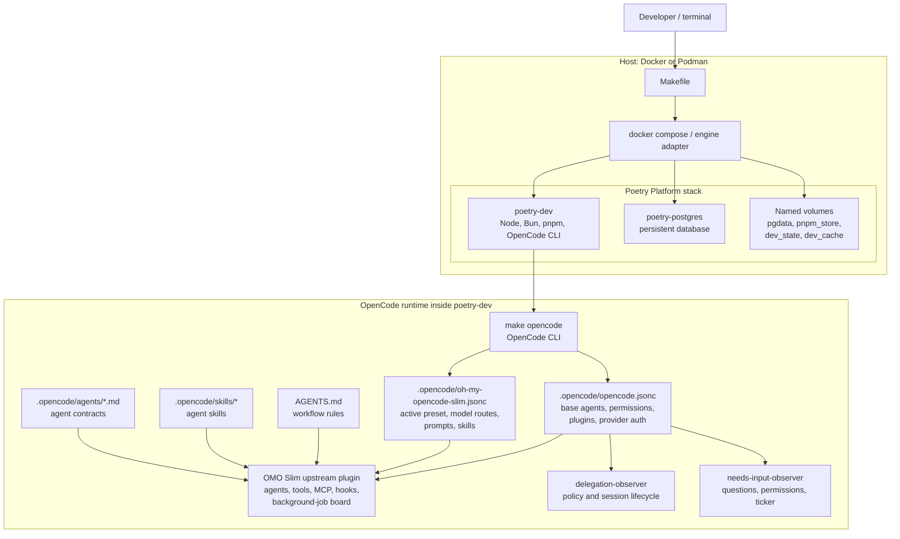
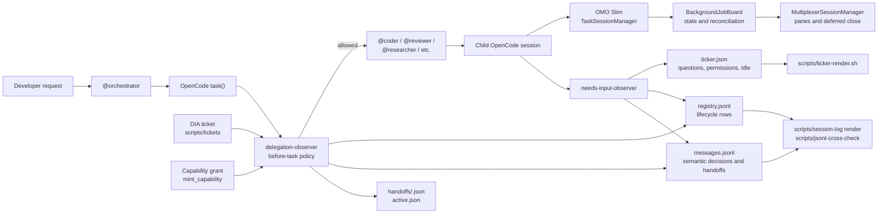
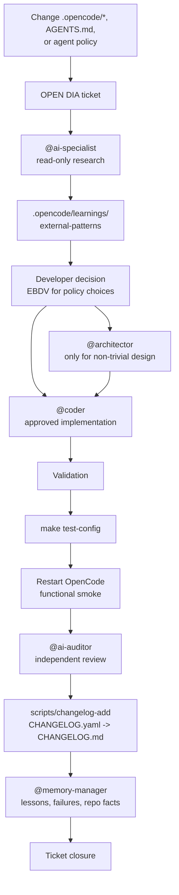
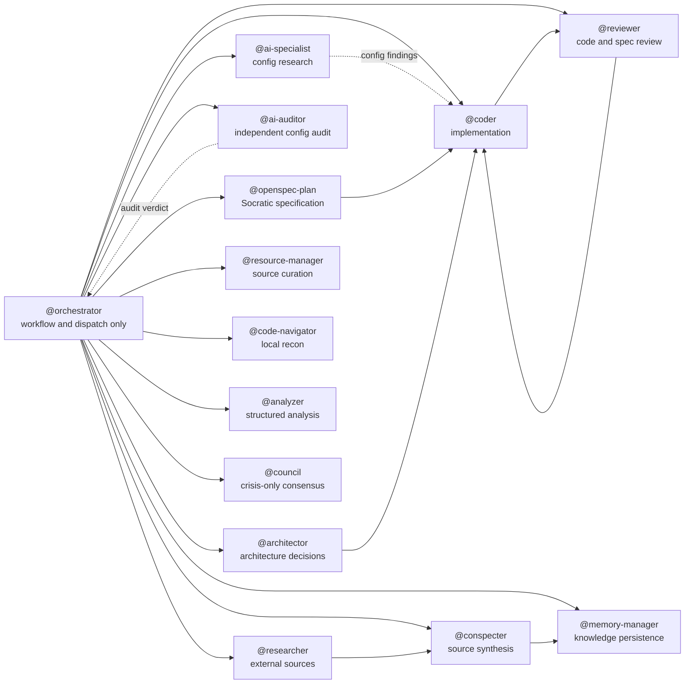

# OpenCode Infrastructure Map

> Updated: 2026-09-16
>
> Scope: the Poetry Platform development environment, OpenCode runtime, OMO Slim,
> project observer plugins, persistent session state, and verification gates.
> This is an operational map, not a replacement for `AGENTS.md` or the `.sdd/`
> architecture records.

## 1. Runtime topology

### What happens

- `make up` creates the development stack. `poetry-dev` is the working
  environment; Postgres and the named volumes preserve state across restarts.
- `make opencode` starts OpenCode inside `poetry-dev`, so the CLI sees the same
  tools, dependencies, repository files, and credentials as the development
  environment.
- `.opencode/opencode.jsonc` controls provider authentication, global
  permissions, and plugin loading. `oh-my-opencode-slim.jsonc` adds the active
  preset: agent model chains, prompts, skills, and routing policy.
- OMO Slim provides the generic runtime integration. The two project plugins
  provide local workflow enforcement and visibility.

## 2. Delegation and session lifecycle

### What happens

1. The orchestrator selects a specialist lane and delegates with `task()`.
2. `delegation-observer` validates the work: ticket correlation, capability
   exceptions, routing restrictions, resource conditions, and workflow rules.
3. If allowed, the child session starts. OMO Slim tracks the task and maintains
   its `BackgroundJobBoard` state; the multiplexer owns its terminal pane.
4. A terminal result is not treated as fully complete until it is reconciled.
   This avoids closing a pane or marking a lane done merely because an abort or
   incomplete return channel claimed that it ended.
5. The project observers write durable records. JSONL is the event history;
   Markdown views are derived from it and must not become alternate sources of
   truth.

### Persistent state ownership

| State                            | Primary writer                                   | Main readers                       | Purpose                                    |
| -------------------------------- | ------------------------------------------------ | ---------------------------------- | ------------------------------------------ |
| `registry.jsonl`                 | `delegation-observer` through registry library   | observer tools, validation scripts | lifecycle and delegation evidence          |
| `messages.jsonl`                 | `delegation-observer`; selected observer signals | session-log renderer, handoff flow | decisions, handoffs, semantic events       |
| `ticker.json`                    | `needs-input-observer`                           | ticker renderer, developer         | waiting questions, permissions, idle state |
| `handoffs/*.json`, `active.json` | handoff tool path                                | orchestrator at session start      | resumable session state                    |
| `memory-shelf.yaml`              | memory workflow                                  | validation and agents              | durable project knowledge index            |

## 3. OpenCode configuration-change workflow

### Why this is deliberately long

Configuration can change the behavior, permissions, models, and tools of every
future agent. The workflow separates research, developer authority,
implementation, runtime validation, and independent review so a model or prompt
change is not silently accepted as correct merely because JSONC parses.

## 4. Quality gates, hooks, and scripts

```mermaid
flowchart TB
  Edit["Agent or developer edit"]

  Format["delegation-observer\nedit-time Prettier\nnon-fatal"]
  PreCommit[".husky pre-commit\nscripts/verify-pre-commit.sh"]
  PrePush[".husky pre-push\nscripts/verify-pre-push.sh"]

  subgraph Make["Makefile gates"]
    TC["make test-config"]
    TS["make test-shell"]
    TI["make test-infra"]
    TP["make test-python"]
    TH["test-harness / plugin suites"]
  end

  subgraph ConfigChecks["test-config checks"]
    Jsonc["validate-opencode-config.sh\nJSONC and config"]
    Names["validate-agent-names.sh\n4-source name lockstep"]
    Output["validate-output-contracts.sh"]
    Review["validate-reviewer-sections.sh"]
    EBDV["validate-decision-variants.sh"]
    Handoff["validate-handoff.sh"]
    Shelf["validate-memory-shelf.sh"]
    Changelog["validate-changelog.sh"]
    Dia["validate-dia-mentions.sh"]
    Structure["validate-plugin-structure.sh"]
  end

  subgraph ShellChecks["test-shell checks"]
    Pins["check-pin-sync"]
    Host["check-host-jq / check-host-lsp"]
    Bats["Bats suites for scripts,\nworktrees, tickets, hooks"]
  end

  subgraph InfraChecks["test-infra checks"]
    Compose["Docker or Podman compose smoke"]
    Harness["Plugin behavioral harness"]
    Python["Python tests"]
  end

  Edit --> Format
  Format --> PreCommit
  PreCommit --> TC
  PreCommit --> TS
  PrePush --> TC
  PrePush --> TS
  PrePush --> TP

  TC --> Jsonc
  TC --> Names
  TC --> Output
  TC --> Review
  TC --> EBDV
  TC --> Handoff
  TC --> Shelf
  TC --> Changelog
  TC --> Dia
  TC --> Structure

  TS --> Pins
  TS --> Host
  TS --> Legacy
  TS --> Bats

  TI --> TS
  TI --> TH
  TI --> Compose
  TI --> Python
  TH --> Harness
```

### Gate responsibilities

| Command or hook        | Primary purpose                                                                                                                                  |
| ---------------------- | ------------------------------------------------------------------------------------------------------------------------------------------------ |
| `make test-config`     | Validates OpenCode JSONC, agent-name consistency, contracts, handoff structure, memory shelf, changelog, decision records, and plugin structure. |
| `make test-shell`      | Runs host and shell-script checks with Bats; includes pin and host-tool checks.                                                                  |
| `make test-infra`      | Runs the heavier integration path: shell gate, harness, compose smoke, and Python coverage.                                                      |
| `verify-pre-commit.sh` | Requires the development container and prevents commits that bypass the project gate.                                                            |
| `verify-pre-push.sh`   | Runs the selected fast gates before a push. It is not a substitute for the full infra path.                                                      |

## 5. Agent responsibilities

### Separation rules that matter

- The orchestrator controls flow; it is not an implementation or research lane.
- `@ai-specialist` researches configuration; `@ai-auditor` independently reviews
  it after implementation.
- RED test writing and GREEN implementation use different coder instances.
- Fix loops return to the same implementation session, preserving the context
  needed to repair a reviewed change.
- `@council` is not a general planner; it is restricted to defined crisis cases.

## 6. Operational reading order

When diagnosing an issue, use this order:

1. Check the active container and `make` gate that should prove the behavior.
2. Check the OpenCode config and active preset for declared intent.
3. Check the relevant observer state file and derived renderer output.
4. Check the corresponding plugin test or Bats test.
5. Check the DIA ticket, changelog, and memory entry for the decision history.

This avoids treating a prompt, a JSON file, a rendered Markdown view, or a
stale handoff as the source of truth when the durable lifecycle evidence says
otherwise.
