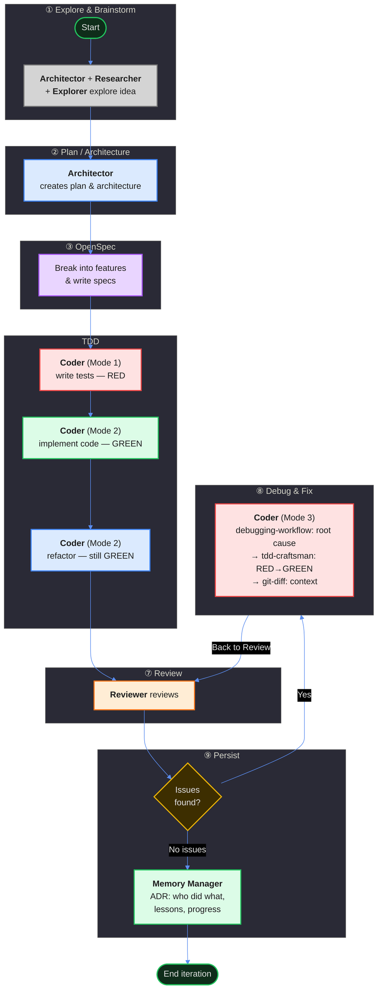

# Poetry Platform — Development Loop

## ① Explore & Brainstorm
**Architector** + **Researcher** + **Explorer** explore the idea with the user.

| Tool | Type | Purpose | Status | Architector Review |
|------|------|---------|--------|-------------------|
| `ponytail` | Skill | Question if task needs to exist (YAGNI) | ✅ ESSENTIAL | Єдиний YAGNI-інструмент. Найвища точка перехоплення — до будь-якого дизайну чи коду. Без нього перевірка "чи треба це взагалі?" відбувається занадто пізно (під час рефакторингу, якщо взагалі) |
| `openspec-explore` | Skill | Explore mode for thinking partner | ✅ ESSENTIAL | Вільний thinking partner, read-only. Заповнює прогалину між "є ідея" і "знаю що пропонувати". Read-only по дизайну — не дозволяє випадково зачепити код |
| `grill-with-docs` | Skill | Stress-test plan against domain model | ✅ ESSENTIAL | Socratic stress-test термінології проти доменної моделі. Краще за openspec-explore для глибини. Але потребує адаптації шляхів (.sdd/ замість CONTEXT.md) |
| `code-navigator` | Agent | Fast codebase recon | ✅ ESSENTIAL | Швидкий glob/grep/AST — stateless, нічого не пише. Але **потребує OMO-конфігу** — зараз немає моделі в пресеті |
| `codemap` | Skill | Map unfamiliar codebase | 🔶 Nice-to-have | Дорогий (спавнює fixer-агентів на кожну папку). Тільки коли кодова база незнайома. code-navigator робить легшу версію |
| `clonedeps` | Skill | Clone & inspect library internals | 🔶 Nice-to-have | Тільки коли треба зрозуміти internals бібліотеки. Фаза ① — найкращий час, але не за замовчуванням. Потребує мережі |
| `mermaid-diagramming` | Skill | Best practices for Mermaid diagrams | 🆕 MISSING | Фаза ② має його, але фаза ① — ні. А саме тут малюються перші діаграми системи |

| `researcher` | Agent | External docs & library research | 🔴 BROKEN | Orphan — немає OMO конфігу, промпту, навичок. @librarian (web_scout) вже має ці здібності |
| `explorer` | Agent | — | 🔴 BROKEN | В описі фази згадується, але немає промпту, немає AGENTS.md ролі |

## ② Plan / Architecture
**Architector** creates the plan and general architecture.

| Tool | Type | Purpose | Status | Architector Review |
|------|------|---------|--------|-------------------|
| `mermaid-diagramming` | Skill | Best practices for Mermaid diagrams | ✅ ESSENTIAL | Єдиний інструмент для візуалізації архітектури. C4, sequence, flowcharts. Diffable діаграми в markdown — жодна альтернатива так не вміє |
| `teaching` | Skill | Pedagogical explanation of concepts | ✅ ESSENTIAL | Пояснення WHY для нетривіальних ADR. Але **використовувати обережно** — тільки для складних tradeoff, не для кожної задачі. Правило: якщо можна пояснити в 3 реченнях — skip |
| `deepwork` | Skill | Heavy coding sessions, multi-phase | 🔶 Nice-to-have | Тільки для багатоденних архітектурних змін (розділення моноліту, нові bounded contexts). За замовчуванням — skip |
| 🆕 `council_session` | Tool | Multi-model consensus engine | 🆕 MISSING | Multi-model evaluation для складних tradeoff. Коли є 2+ підходи з різними компромісами — отримати думку кількох моделей до фінального рішення. Ризик: overuse → decision paralysis. Тільки для genuinely ≥2 viable approaches |
| 🆕 `grill-with-docs` | Skill | Stress-test against domain model | 🆕 MISSING | Перевірка нової .sdd/ документації проти існуючої доменної моделі. Gate для кожного нового .sdd/ документа |

## ③ OpenSpec
Break the idea into specific features. Write specs for each feature. Each feature is broken into concrete tasks.

| Tool | Type | Purpose | Status | Architector Review |
|------|------|---------|--------|-------------------|
| `openspec-explore` | Skill | Explore mode for ideas | ✅ ESSENTIAL | Read-only thinking partner перед створенням специфікації. Заповнює прогалину між "є ідея" і "знаю що пропонувати" |
| `openspec-propose` | Skill | Propose new change with artifacts | ✅ ESSENTIAL | Основний output-producing інструмент. Єдиний що створює повний набір артефактів (proposal → design → tasks). Але **конфлікт з practice-protected** — auto-генерує контент |
| `openspec-update-change` | Skill | Update existing change plan | ✅ ESSENTIAL | Bidirectional coherence checking між артефактами. Edits to later artifacts can revise earlier ones. User confirms each edit |
| `openspec-sync-specs` | Skill | Sync delta specs to main specs | ✅ ESSENTIAL | Міст між change-scoped specs та living specification base. Без нього specs залишаються ізольованими |
| `openspec-plan` | Agent | Socratic spec authoring guide | 🔶 Nice-to-have | Pure-analyst, read-only, без запису файлів. Корисний для інтерв'ю перед propose, але openspec-explore + openspec-propose покривають цю потребу |
| `openspec-archive-change` | Skill | Archive completed change | 🔶 Nice-to-have | Housekeeping, не spec creation. Належить до пост-реалізації. Виконує `mkdir -p` та `mv` |
| `opsx-explore` | Command | `/opsx:explore` | ✅ ESSENTIAL | Alias для openspec-explore |
| `opsx-propose` | Command | `/opsx:propose` | ✅ ESSENTIAL | Alias для openspec-propose |
| `opsx-archive` | Command | `/opsx:archive` | 🔶 Nice-to-have | Alias для openspec-archive-change |
| `opsx-sync` | Command | `/opsx:sync` | ✅ ESSENTIAL | Alias для openspec-sync-specs |
| `opsx-update` | Command | `/opsx:update` | ✅ ESSENTIAL | Alias для openspec-update-change |
| `writing-skills` | Skill | Create/verify skills | 🔶 Nice-to-have | Корисний для створення нових навичок OpenSpec, але не для spec authoring |
| 🆕 `/opsx-continue` | Command | Create missing artifacts | 🆕 MISSING (HIGH) | Два існуючих інструменти (update, apply) посилаються на нього, але він не існує. Broken workflow path — якщо change має proposal, але немає tasks, немає способу просунутись |
| 🆕 `openspec-review` | Skill | Pre-implementation spec review | 🆕 MISSING (MEDIUM) | @reviewer орієнтований на код. Spec review потребує інших критеріїв: testability, completeness, alignment з .sdd/ |
| 🆕 `openspec-validate` | Skill | Structural validation | 🆕 MISSING (LOW) | CLI `validate` існує, але обгортки для зручного виклику немає |

## TDD

### Red
**<b>Coder</b> (Mode 1)** writes tests. They must be **red** (failing).

| Tool | Type | Purpose | Status | Architector Review |
|------|------|---------|--------|-------------------|
| `tdd-craftsman` | Skill | Polyglot RED-GREEN-REFACTOR TDD | ✅ ESSENTIAL | Хребет фази. AAA структура, per-language naming, property-based testing, RED gate, ownership protocol (practice-protected per AGENTS.md §4). Єдиний інструмент що визначає disciplined test writing |
| `debugging-workflow` | Skill | Language-specific debugging tools | ✅ ESSENTIAL | Root cause analysis коли архітектор просить пофіксити тест-кейси (Red mode variant). 5-stage pipeline: reproduce → isolate → analyze. Для звичайного Red (написати нові тести) — тільки tdd-craftsman |

### Green
**Coder (Mode 2)** implements code. Tests become **green** (passing).

| Tool | Type | Purpose | Status | Architector Review |
|------|------|---------|--------|-------------------|
| `tdd-craftsman` | Skill | Polyglot RED-GREEN-REFACTOR TDD | ✅ ESSENTIAL | Визначає GREEN constraints: мінімальний код, без speculative features, verification gates (test → typecheck → lint → build → ASan). Ownership checkpoint: "one-line rationale comment" |
| `teaching` | Skill | Pedagogical explanation of patterns | 🔶 Nice-to-have | Якщо implementer не розуміє WHY. Але ownership checkpoint ("one-line rationale comment") вже покриває це — якщо не можеш написати одне речення, не розумієш достатньо |
| `playwright-browser` | Skill | Browser automation for E2E testing | 🔶 Nice-to-have | Тільки для browser-based features (React, CM6 extensions). Для Python/Rust/C++ packages — ні. Per skill itself: "For unit/integration tests, use tdd-craftsman instead" |

### Refactor
**Coder (Mode 2)** refactors code. Tests remain **green**.

| Tool | Type | Purpose | Status | Architector Review |
|------|------|---------|--------|-------------------|
| `ponytail` | Skill | Force laziest solution that works | ✅ ESSENTIAL | Ідеальна корекція: "чи треба це взагалі?" перед optimize. Творить здорову напругу між "optimize hot paths" (tdd-craftsman) і "can you just delete this?" (ponytail). Без нього coder може створити 5 нових helper functions замість видалення коду |
| `simplify` | Skill | Simplify code for clarity | ✅ ESSENTIAL | Найприродніший match — "clarity without changing behavior" ≈ "optimize without breaking tests". tdd-craftsman визначає ЩО оптимізувати, simplify визначає ЯК робити це без зламу |
| `debugging-workflow` | Skill | Language-specific debugging tools | 🔶 Nice-to-have | Safety net коли refactoring ламає тести. Більшість проблем ловиться простим read error + revert. tdd-craftsman вже має gate-failure routing |
| `tdd-craftsman` | Skill | Polyglot RED-GREEN-REFACTOR TDD | ✅ ESSENTIAL | Optimization priority order (allocation elimination → lazy computation → pre-compiled constants → quick-exit), language-specific tactics, verification gates, scientific code verification (property-based testing, benchmark regression, memory layout, statistical correctness) |

## ⑦ Review
**Reviewer** reviews the work done.

| Tool | Type | Purpose | Status | Architector Review |
|------|------|---------|--------|-------------------|
| `ponytail-review` | Skill | Code review for over-engineering | ✅ ESSENTIAL | Core функція Review. Lightweight, one-liner findings, complexity-focused. Complements correctness review. Специфічно designed для diff review (на відміну від ponytail-audit для whole-repo) |
| `reflect` | Skill | Review recent work patterns | ✅ ESSENTIAL | Для покращення самого процесу Review. Виявляє workflow-level issues (наприклад, "reviewer consistently misses type bugs"). Complementary до ponytail-review: one = code, other = process |
| `ponytail-audit` | Skill | Whole-repo audit for over-engineering | 🔶 Nice-to-have | Тільки для périodic whole-repo audit. Too heavy per-PR. ponytail-review для diffs, ponytail-audit для всього repo |
| `ponytail` | Skill | Force laziest solution that works | 🔶 Nice-to-have | Може запропонувати простіше рішення замість flagged. Але ризик override author intent. Використовувати обережно |
| `teaching` | Skill | Pedagogical feedback | 🔶 Nice-to-have | Pedagogical feedback для junior devs. Too verbose для senior. book-rag для верифікації, teaching для пояснення |
| `book-rag` | Skill | Grounded review via RAG | 🔶 Nice-to-have | Для верифікації чи pattern є anti-pattern. Requires textbooks loaded. Complementary до teaching |
| 🆕 Correctness/Security/Perf tools | Skill | Bug/security/perf detection | 🆕 MISSING (HIGH) | ponytail-review не перевіряє bugs, security vulnerabilities, performance issues. Review incomplete без них. Потрібні: correctness oracle, security scanner, perf profiler |

## ⑧ Debug and Fix
One arrow in ("Yes"), one arrow out ("Back to Review"):
- **Coder** uses Mode 3 (Bugfix): debugging-workflow for root cause → tdd-craftsman RED→GREEN → git-diff for context

| Tool | Type | Purpose | Status | Architector Review |
|------|------|---------|--------|-------------------|
| `tdd-craftsman` | Skill | Polyglot RED-GREEN-REFACTOR TDD | ✅ ESSENTIAL | Bugfix = RED→GREEN цикл. Coder → RED (fix/write failing tests) → GREEN (fix code). Skip REFACTOR unless Review explicitly flagged performance/readability |
| `debugging-workflow` | Skill | Language-specific debugging tools | ✅ ESSENTIAL | Root cause analysis (Mode 3). Structured hypothesis→evidence loop: reproduce → isolate → analyze → fix. Essential for non-trivial bugs, skip for trivial/pinpointed |
| `git-diff` | Skill | Inject Git status/diff context | ✅ ESSENTIAL | Бачити написані тести, план, специфікації перед fix. Кодер має знати що reviewer reviewed і що architect спланував |

## ⑨ Persist
If no issues — **Memory Manager** writes ADR: who did what, lessons, progress, blockers. End of iteration.

| Tool | Type | Purpose | Status | Architector Review |
|------|------|---------|--------|-------------------|
| 🆕 `git log` | — | Commit history context | ✅ ADDED | Додано в process memory-manager (крок 1) |
| 🆕 `.openspec/changes/` context | — | Planned vs. delivered comparison | ✅ ADDED | Додано в process memory-manager (крок 2) |
| `git-diff` | Skill | Inject Git status/diff context | ✅ ESSENTIAL | Контекст для порівняння planned vs delivered. Memory-manager бачить що фактично змінилось перед записом ADR |
| 🆕 `openspec-archive-change` | Skill | Archive completed change | 🔶 Nice-to-have | Natural end-of-iteration housekeeping. Optional step 7 в memory-manager process |

**Висновок:** memory-manager самодостатній — зовнішні інструменти не потрібні. Потрібно оновити його внутрішній process (додати git log, .openspec reading, optional archive step).

---

