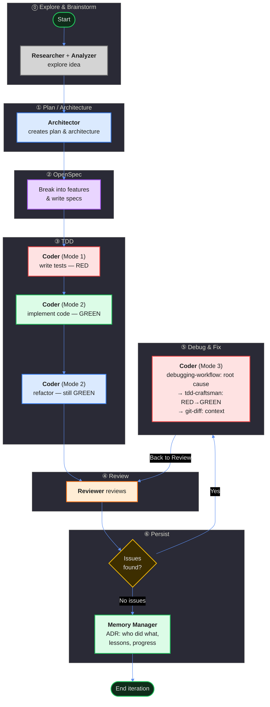

# Poetry Platform — Development Loop

## ⓪ Explore & Brainstorm
**Researcher** + **Analyzer** explore the idea with the user.

| # | Tool | Type | Purpose | Status |
|---|------|------|---------|--------|
| 1 | `ponytail` | Skill | YAGNI check — does this need to exist? | ✅ ESSENTIAL |
| 2 | `openspec-explore` | Skill | Thinking partner for ideas | ✅ ESSENTIAL |
| 3 | `grill-with-docs` | Skill | Stress-test against domain model | ✅ ESSENTIAL |
| 4 | `code-navigator` | Agent | Understand existing codebase | ✅ ESSENTIAL |
| 5 | `mermaid-diagramming` | Skill | Sketch system diagrams | ✅ ESSENTIAL |

**Removed:** codemap (too expensive), clonedeps (not for exploration), researcher/explorer (broken/replaced)

## ① Plan / Architecture
**Architector** creates the plan and general architecture.

| # | Tool | Type | Purpose | Status |
|---|------|------|---------|--------|
| 1 | `mermaid-diagramming` | Skill | Architecture diagrams (C4, sequence, flowcharts) | ✅ ESSENTIAL |
| 2 | `teaching` | Skill | Explain WHY in ADRs (skip if <3 sentences) | ✅ ESSENTIAL |
| 3 | 🆕 `council_session` | Tool | Multi-model consensus for complex tradeoffs | 🆕 MISSING |
| 4 | 🆕 `grill-with-docs` | Skill | Validate .sdd/ against domain model | 🆕 MISSING |

## ② OpenSpec
Break the idea into specific features. Write specs for each feature. Each feature is broken into concrete tasks.

| # | Tool | Type | Purpose | Status |
|---|------|------|---------|--------|
| 1 | `openspec-explore` | Skill | Explore ideas before spec creation | ✅ ESSENTIAL |
| 2 | `openspec-propose` | Skill | Create proposal → design → tasks | ✅ ESSENTIAL |
| 3 | `openspec-review` | Skill | Review spec: testability, completeness, .sdd/ alignment | ✅ ESSENTIAL |
| 4 | `openspec-update-change` | Skill | Fix spec issues found in review | ✅ ESSENTIAL |
| 5 | `openspec-validate` | Skill | Structural validation before TDD | ✅ ESSENTIAL |
| 6 | `openspec-sync-specs` | Skill | Sync delta specs → main specs | ✅ ESSENTIAL |

**Removed:** `openspec-plan` (redundant), `openspec-archive-change` (→ Phase ⑥), `opsx-*` aliases (redundant), `writing-skills` (not for spec auth).

## ③ TDD

### Red
**<b>Coder</b> (Mode 1)** writes tests. They must be **red** (failing).

| Tool | Type | Purpose | Status | Architector Review |
|------|------|---------|--------|-------------------|
| `tdd-craftsman` | Skill | Polyglot RED-GREEN-REFACTOR TDD | ✅ ESSENTIAL | Хребет фази. AAA структура, per-language naming, property-based testing, RED gate, ownership protocol (practice-protected per AGENTS.md §4). Єдиний інструмент що визначає disciplined test writing |
| `debugging-workflow` | Skill | Language-specific debugging tools | ✅ ESSENTIAL | Root cause analysis коли архітектор просить пофіксити тест-кейси (Red mode variant). 5-stage pipeline: reproduce → isolate → analyze. Для звичайного Red (написати нові тести) — тільки tdd-craftsman |

### Green
**Coder (Mode 2)** implements code. Tests become **green** (passing).

| Tool | Type | Purpose | Status | Architector Review |
|------|------|---------|--------|-------------------|
| `tdd-craftsman` | Skill | Polyglot RED-GREEN-REFACTOR TDD | ✅ ESSENTIAL | Визначає GREEN constraints: мінімальний код, без speculative features, verification gates (test → typecheck → lint → build → ASan). Ownership checkpoint: "one-line rationale comment" |
| `teaching` | Skill | Pedagogical explanation of patterns | 🔶 Nice-to-have | Якщо implementer не розуміє WHY. Але ownership checkpoint ("one-line rationale comment") вже покриває це — якщо не можеш написати одне речення, не розумієш достатньо |
| `playwright-browser` | Skill | Browser automation for E2E testing | 🔶 Nice-to-have | Тільки для browser-based features (React, CM6 extensions). Для Python/Rust/C++ packages — ні. Per skill itself: "For unit/integration tests, use tdd-craftsman instead" |

### Refactor
**Coder (Mode 2)** refactors code. Tests remain **green**.

| Tool | Type | Purpose | Status | Architector Review |
|------|------|---------|--------|-------------------|
| `ponytail` | Skill | Force laziest solution that works | ✅ ESSENTIAL | Ідеальна корекція: "чи треба це взагалі?" перед optimize. Творить здорову напругу між "optimize hot paths" (tdd-craftsman) і "can you just delete this?" (ponytail). Без нього coder може створити 5 нових helper functions замість видалення коду |
| `simplify` | Skill | Simplify code for clarity | ✅ ESSENTIAL | Найприродніший match — "clarity without changing behavior" ≈ "optimize without breaking tests". tdd-craftsman визначає ЩО оптимізувати, simplify визначає ЯК робити це без зламу |
| `debugging-workflow` | Skill | Language-specific debugging tools | 🔶 Nice-to-have | Safety net коли refactoring ламає тести. Більшість проблем ловиться простим read error + revert. tdd-craftsman вже має gate-failure routing |
| `tdd-craftsman` | Skill | Polyglot RED-GREEN-REFACTOR TDD | ✅ ESSENTIAL | Optimization priority order (allocation elimination → lazy computation → pre-compiled constants → quick-exit), language-specific tactics, verification gates, scientific code verification (property-based testing, benchmark regression, memory layout, statistical correctness) |

## ④ Review
**Reviewer** reviews the work done.

| Tool | Type | Purpose | Status | Architector Review |
|------|------|---------|--------|-------------------|
| `ponytail-review` | Skill | Code review for over-engineering | ✅ ESSENTIAL | Core функція Review. Lightweight, one-liner findings, complexity-focused. Complements correctness review. Специфічно designed для diff review (на відміну від ponytail-audit для whole-repo) |
| `reflect` | Skill | Review recent work patterns | ✅ ESSENTIAL | Для покращення самого процесу Review. Виявляє workflow-level issues (наприклад, "reviewer consistently misses type bugs"). Complementary до ponytail-review: one = code, other = process |
| `ponytail-audit` | Skill | Whole-repo audit for over-engineering | 🔶 Nice-to-have | Тільки для périodic whole-repo audit. Too heavy per-PR. ponytail-review для diffs, ponytail-audit для всього repo |
| `ponytail` | Skill | Force laziest solution that works | 🔶 Nice-to-have | Може запропонувати простіше рішення замість flagged. Але ризик override author intent. Використовувати обережно |
| `teaching` | Skill | Pedagogical feedback | 🔶 Nice-to-have | Pedagogical feedback для junior devs. Too verbose для senior. book-rag для верифікації, teaching для пояснення |
| `book-rag` | Skill | Grounded review via RAG | 🔶 Nice-to-have | Для верифікації чи pattern є anti-pattern. Requires textbooks loaded. Complementary до teaching |
| 🆕 Correctness/Security/Perf tools | Skill | Bug/security/perf detection | 🆕 MISSING (HIGH) | ponytail-review не перевіряє bugs, security vulnerabilities, performance issues. Review incomplete без них. Потрібні: correctness oracle, security scanner, perf profiler |

## ⑤ Debug and Fix
One arrow in ("Yes"), one arrow out ("Back to Review"):
- **Coder** uses Mode 3 (Bugfix): debugging-workflow for root cause → tdd-craftsman RED→GREEN → git-diff for context

| Tool | Type | Purpose | Status | Architector Review |
|------|------|---------|--------|-------------------|
| `tdd-craftsman` | Skill | Polyglot RED-GREEN-REFACTOR TDD | ✅ ESSENTIAL | Bugfix = RED→GREEN цикл. Coder → RED (fix/write failing tests) → GREEN (fix code). Skip REFACTOR unless Review explicitly flagged performance/readability |
| `debugging-workflow` | Skill | Language-specific debugging tools | ✅ ESSENTIAL | Root cause analysis (Mode 3). Structured hypothesis→evidence loop: reproduce → isolate → analyze → fix. Essential for non-trivial bugs, skip for trivial/pinpointed |
| `git-diff` | Skill | Inject Git status/diff context | ✅ ESSENTIAL | Бачити написані тести, план, специфікації перед fix. Кодер має знати що reviewer reviewed і що architect спланував |

## ⑥ Persist
If no issues — **Memory Manager** writes ADR: who did what, lessons, progress, blockers. End of iteration.

| Tool | Type | Purpose | Status | Architector Review |
|------|------|---------|--------|-------------------|
| 🆕 `git log` | — | Commit history context | ✅ ADDED | Додано в process memory-manager (крок 1) |
| 🆕 `.openspec/changes/` context | — | Planned vs. delivered comparison | ✅ ADDED | Додано в process memory-manager (крок 2) |
| `git-diff` | Skill | Inject Git status/diff context | ✅ ESSENTIAL | Контекст для порівняння planned vs delivered. Memory-manager бачить що фактично змінилось перед записом ADR |
| 🆕 `openspec-archive-change` | Skill | Archive completed change | 🔶 Nice-to-have | Natural end-of-iteration housekeeping. Optional step 7 в memory-manager process |

**Висновок:** memory-manager самодостатній — зовнішні інструменти не потрібні. Потрібно оновити його внутрішній process (додати git log, .openspec reading, optional archive step).

---

