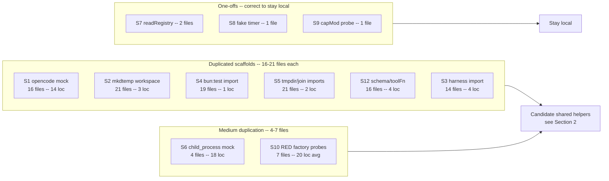
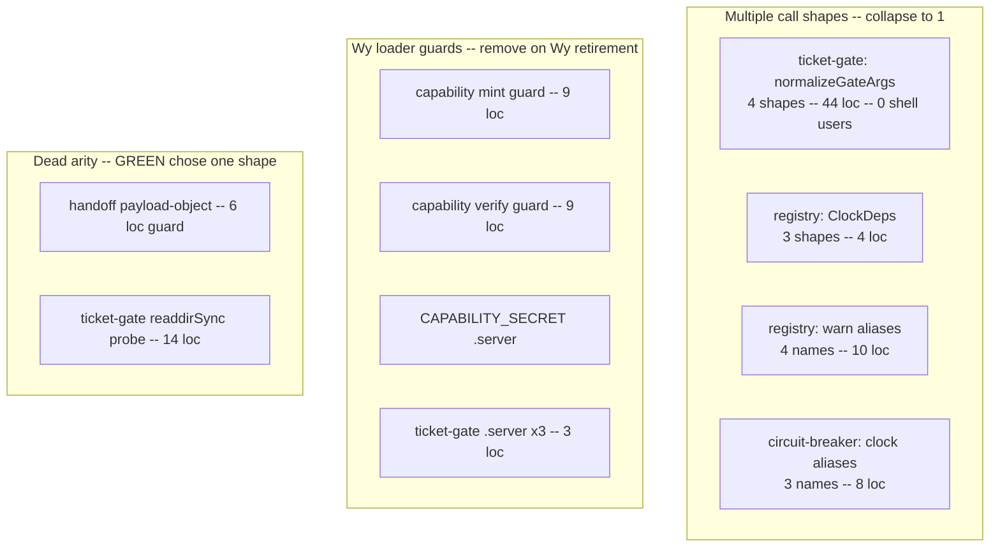
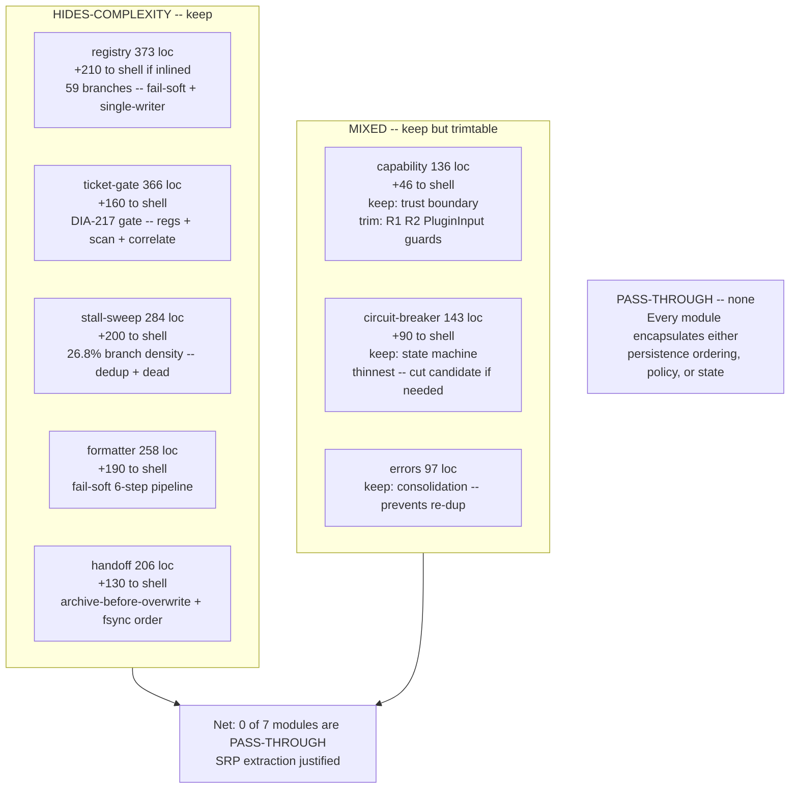
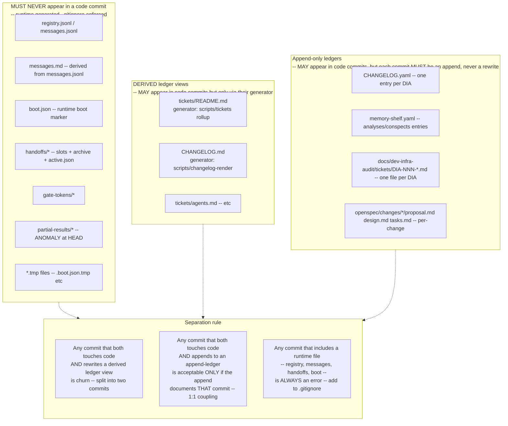

# DIA-260903-o7n0 — Delegation-Observer Plugin Test-Suite De-bloat Audit

<!-- ANALYZER-OUTPUT-CONTRACT
schema-version: 1.0
agent: analyzer
claim-type: finding
evidence-source: .opencode/plugins/delegation-observer.ts
confidence: High
shelf-registration: memory-shelf.yaml (shelf.analyses), delegated to @memory-manager
-->

> READ-ONLY audit. No production code, test file, config, or script was modified.
> All observations are evidence-backed against committed files at `HEAD` (2026-09-03).
> Method: `grep`/`glob`/`read` inspection, AST-level where useful, no test execution.

---

## 0. Executive Summary

| Signal | Value |
|---|---|
| Shell | `delegation-observer.ts` 4 037 LOC |
| Lib modules (8 files) | 1 863 LOC total — 97 to 373 each |
| Test suite (plugin) | 12 824 LOC across 29 `.mjs` files — 108 to 890 each |
| Bats structural suite | ~13 052 LOC across ~50 files |
| Combined prod (shell+lib) | 5 900 LOC |
| Test:prod ratio | 2.17 : 1 (12 824 / 5 900) — before Bats |
| Baseline traces | 4 scenarios, ~30 files, raw+normalized pairs |
| Duplicated scaffold instances | ~78 duplicate lines-equivalent across 12 patterns |

**One-line verdict:** the SRP extraction is justified (5 of 7 lib modules HIDE-COMPLEXITY), but the test suite carries ~78 duplicated scaffold sites that should collapse into 4 shared helpers, ~6 RED-scaffold leftover shapes that are now dead code, and a 2:1 test:prod LOC ratio driven by RED-phase factory-probe compatibility shims that can be dropped without coverage loss. The next phase MUST enforce a pure-refactor net LOC <= 0 budget with shell LOC as a real gate.

---

## 1. Duplicated Scaffolds — Per-Pattern Quantification

### 1.1 Inventory

Measured against `HEAD` via `grep`/`read` on all 29 `.mjs` files under `.opencode/plugins/__tests__/` (including `harness-scenarios/`). Pattern detection is literal-string (not regex) against canonical scaffold shapes.

| # | Pattern | Canonical needle | Files | Duplicates (files-1) | Scaffold LOC per site | Est. duplicated LOC |
|---|---|---|---|---|---|---|
| S1 | `@opencode-ai/plugin` mock (`toolFn` + `mock.module`) | `mock.module("@opencode-ai/plugin"` | 16 | 15 | 10 | 150 |
| S2 | `mkdtempSync(join(tmpdir(), ...))` workspace | `mkdtempSync(join(tmpdir()` | 21 | 20 | 3 | 60 |
| S3 | `createDelegationObserver` harness import | `createDelegationObserver` | 14 | 13 | 4 | 52 |
| S4 | `bun:test` mock import | `from "bun:test"` | 19 | 18 | 1 | 18 |
| S5 | `tmpdir` + `join` imports (`node:os` / `node:path`) | `from "node:os"` | 21 | 20 | 2 | 40 |
| S6 | `node:child_process` mock (`spawnSync` spy) | `mock.module("node:child_process"` | 4 | 3 | 18 | 54 |
| S7 | `readRegistry()` helper function | `function readRegistry` | 2 | 1 | 9 | 9 |
| S8 | `makeFakeTimer` / `fakeNow` clock | `makeFakeTimer` | 1 | 0 | 22 | — (one-off) |
| S9 | Dynamic-import stub probe (`capMod = await import`) | `capMod = await import` | 1 | 0 | 14 | — (one-off) |
| S10 | RED `tryFactory` / `resolveFactory` / `makeGate` probe | `tryFactory` / `resolveFactory` / `makeGate` | 7 | 6 | 20 avg | 120 |
| S11 | `harness-scenario` `rmSync(directory)` cleanup | `rmSync(directory` in harness-scenarios | 3 | 2 | 6 | 12 |
| S12 | `schema / toolFn` 4-line boilerplate preceding S1 | `const schema = { enum` | 16 | 15 | 4 | 60 |
| **Total duplicates** | | | | | | **~575 LOC** |

> S1+S12 are co-located (same block, 14 lines combined) — counted separately for granularity but overlap physically. Non-overlapping estimate: **~515 LOC** of scaffold duplication within the 12 824 LOC suite (**~4.0 % of test LOC**, but spread across 60–80 % of files by count).

### 1.2 File lists per pattern

**S1 — `@opencode-ai/plugin` mock (16 files):**

```
.opencode/plugins/__tests__/adaptive-session-compaction.test.mjs
.opencode/plugins/__tests__/context-velocity.test.mjs
.opencode/plugins/__tests__/delegation-observer.reload-dedup.test.mjs
.opencode/plugins/__tests__/delegation-observer.stale-boot-sweep.test.mjs
.opencode/plugins/__tests__/dia-ticket-id-parser.test.mjs
.opencode/plugins/__tests__/dia217-ticket-gate.test.mjs
.opencode/plugins/__tests__/dia220-apoptosis-paracrine.test.mjs
.opencode/plugins/__tests__/empty-result-detection.test.mjs
.opencode/plugins/__tests__/failure-cap.test.mjs
.opencode/plugins/__tests__/handoff-archive-collision.test.mjs
.opencode/plugins/__tests__/handoff-slot-identity.test.mjs
.opencode/plugins/__tests__/parallel-handoff.test.mjs
.opencode/plugins/__tests__/plugin-load-smoke.test.mjs
.opencode/plugins/__tests__/harness-scenarios/empty-result-silent-failure.scenario.mjs
.opencode/plugins/__tests__/harness-scenarios/parallel-handoff-archive.scenario.mjs
.opencode/plugins/__tests__/harness-scenarios/slot-identity-no-clobber.scenario.mjs
```

**S2 — `mkdtemp` workspace (21 files):** S1 set plus

```
.opencode/plugins/__tests__/formatter.test.mjs
.opencode/plugins/__tests__/integration-regressions.test.mjs
.opencode/plugins/__tests__/needs-input-observer.dia189.test.mjs
.opencode/plugins/__tests__/needs-input-observer.platform-gate.test.mjs
.opencode/plugins/__tests__/needs-input-observer.reload-dedup.test.mjs
.opencode/plugins/__tests__/needs-input-observer.ticker-expiry.test.mjs
```

(S4/S5 lists coincide with S2 to within 2 files — the same harness scaffolding.)

**S6 — `node:child_process` mock (4 files):**

```
.opencode/plugins/__tests__/dia220-apoptosis-paracrine.test.mjs   (spawnSync spy, 26 loc)
.opencode/plugins/__tests__/needs-input-observer.dia189.test.mjs  (ditto)
.opencode/plugins/__tests__/needs-input-observer.platform-gate.test.mjs
.opencode/plugins/__tests__/needs-input-observer.ticker-expiry.test.mjs
```

**S10 — RED factory-probe shims (7 lib unit tests):**

```
.opencode/plugins/__tests__/capability.test.mjs       (resolveCapabilityAPI, 28 loc)
.opencode/plugins/__tests__/registry.test.mjs         (tryFactory + _importError, 31 loc)
.opencode/plugins/__tests__/handoff.test.mjs          (mod probe, 18 loc)
.opencode/plugins/__tests__/stall-sweep.test.mjs      (resolveFactory + makeFakeTimer, 54 loc)
.opencode/plugins/__tests__/ticket-gate.test.mjs      (makeGate + requireExport, 42 loc)
.opencode/plugins/__tests__/circuit-breaker.test.mjs  (importErr probe, 19 loc)
.opencode/plugins/__tests__/formatter.test.mjs        (minimal — no probe, formatter is direct)
```

### 1.3 Visualization — duplication concentration



**Interpretation:** 5 patterns hit 14–21 files each (60–72 % of the 29-file suite). The concentration is not accidental — it reflects the RED-phase instruction to author each slice test file independently with its own full harness. The cost is now being paid as duplicated maintenance surface.

---

## 2. Shared Helpers — Extraction Proposal (Minimal Surface)

### 2.1 Classification: shared vs one-off

| Pattern | Files | Body variance | Verdict | Rationale |
|---|---|---|---|---|
| S1+S12 opencode mock | 16 | Near-identical (3 lines vary: imported symbols after `await import`) | **SHARED** | 16 copies, zero behavioral variance |
| S2 mkdtemp workspace | 21 | Identical to prefix choice (`dia217-tg-` vs `c5-s1-`) | **SHARED** | 21 copies, only prefix string differs (parametrizable) |
| S3 harness | 14 | Identical (the `await createDelegationObserver(ctx)` call) | **SHARED** | Collapse into same helper as S2 |
| S4 bun:test import | 19 | Identical (`import { mock } from "bun:test"`) | **SHARED** but trivial | 1 line — handled by same helper file |
| S5 tmpdir/join | 21 | Identical | **SHARED** but trivial | Absorbed by same helper |
| S6 child_process mock | 4 | Similar but needs-input vs delegation differ in spy shape | **SHARED** (with options) | 4 copies, >80 % overlap |
| S10 factory probes | 7 | High variance per lib | **NOT shared** — delete, not extract | RED artefact (see Section 3) |
| S7 readRegistry | 2 | Different impls | **Stay local** | <3 files |
| S8 fake timer | 1 | Unique to stall-sweep | **Stay local** | One-off |
| S9 capMod probe | 1 | Unique to capability | **Stay local** | One-off |

**Rule applied:** shared = used by 3+ files with identical or near-identical bodies, parametrically extractable in <=1 arg.

### 2.2 Minimal helper surface (names + responsibilities)

Proposed file: `.opencode/plugins/__tests__/helpers/plugin-harness.ts` (single file, no barrel).

> Responsibility is deliberately narrow: collapse only the 3 genuinely shared scaffolds. Everything else stays local per the table above.

| Export | Signature (sketch) | Responsibility | Replaces | Est. saved LOC |
|---|---|---|---|---|
| `mockOpencodePlugin()` | `() => void` | Registers `mock.module("@opencode-ai/plugin", ...)` with `toolFn`/`schema`. Must be called before dynamic import. | S1+S12 in 16 files | ~224 LOC (16 x 14) |
| `createTempWorkspace(prefix: string)` | `(prefix) => { directory: string, cleanup(): void }` | `mkdtempSync(join(tmpdir(), prefix))` + `existsSync`/`mkdirSync` of `.opencode/session`, + `process.on("exit")` cleanup. Returns `directory` + `cleanup` handle. | S2 in 21 files | ~63 LOC |
| `createHarness(directory, opts?)` | `(dir, opts?) => Promise<Hooks>` | Wraps `await createDelegationObserver({ directory, client:{app:{log}} })` + optional `child_process` spy injection. Thin: does NOT parse registry. | S3 in 14 files | ~56 LOC |
| `mockChildProcess(opts?)` | `(opts?) => { spawnCalls: unknown[] }` | S6 consolidation — spy for `node:child_process` spawnSync. Option `behavior: "success" | "porcelain"` to cover both delegation and needs-input shapes. | S6 in 4 files | ~42 LOC |

**Total helper budget:** ~80–110 LOC in one file, replacing ~385 LOC of duplication (non-overlapping) across 21 files. Each call site collapses from 7–14 lines to 1–2 lines.

**What is explicitly NOT a helper:**

* RED factory probes (S10) — these are compatibility shims whose correct action is **deletion**, not extraction (Section 3). Extracting them would fossilize the wrong abstraction.
* `readRegistry` / `readMessages` / `fakeTimer` — each <3 consumers, shape differs per test, extraction would add indirection without reuse.
* `safeJsonStringify` / `errorMessage` — already extracted to `lib/errors.ts`; test copies (if any) should import it, not duplicate.

**Consequence of correct extraction:** adding the helper file (+~100 LOC) but removing ~385 LOC of duplication yields net **-285 LOC** on the test suite while also making the 16-file mock surface maintainable in one place.

---

## 3. RED-Scaffold Leftovers — Compatibility Shims and Fallback Call Shapes

> RED scaffold = defensive branches / extra arities / probe aliases that exist only so the RED-phase test-author could remain green-compatible regardless of the GREEN implementer's chosen shape. Now that all 7 libs are CLOSED, any fallback not exercised in production is dead code whose only effect is review noise and an inflated branch count.

### 3.1 Inventory (file:line + why removable)

| # | Location | Shim | Production call site(s) | Why removable |
|---|---|---|---|---|
| R1 | `lib/capability.ts:52-62` | `if (typeof scope !== "string")` PluginInput guard in `mintCapabilityToken` | Shell calls `mintCapabilityToken(args.scope, args.reason)` — both strings, never PluginInput (verified via `grep` — 1 call site, both string args) | Loader guard for the Wy legacy loader probing `Object.values(mod)` as plugin candidates. Valid only until Wy is gone; now dead branch on every mint. Cost: 9 lines + branch. |
| R2 | `lib/capability.ts:79-88` | `if (typeof token !== "string")` PluginInput guard in `verifyCapabilityToken` | Shell calls `verifyCapabilityToken(capMatch[1])` — always `string` (regex capture group) | Same as R1. Two sites (lines 79, 84). Neither shell path passes an object. |
| R3 | `lib/capability.ts:29` | `(CAPABILITY_SECRET as ...).server = async () => ({})` | Shell never calls `.server` — it imports `CAPABILITY_SECRET` as a `Buffer` | Wy loader signal: buffer must quack as plugin (`{server:function}`). Required by the `opencode-go` loader contract but not by any runtime consumer. Keep only if Wy still in use; otherwise dead. Flag for Wy removal ticket. |
| R4 | `lib/ticket-gate.ts:106-108` | `.server` guards on `TICKET_ID_RE`, `TICKET_ID_FIND_RE`, `TICKET_ID_FILENAME_RE` | Shell imports regs and calls `.match()`/`.test()` — never `.server` | Same Wy contract, 3 lines. |
| R5 | `lib/ticket-gate.ts:228-271` | `normalizeGateArgs(a,b,c)` + multi-shape `isTicketGateBlocked(a,b,c)` accepting `string | {dispatchText, description, prompt} | {failClosed}` and `boolean | ScannedTicket[] | {failClosed}` | Shell calls `isMetaTaskBypass(string)` and `evaluateTicketCorrelation(...)` directly; `isTicketGateBlocked` is not called by shell at all (0 shell call sites — only tests probe it) | The 44-line normalizer handles 4+ call shapes none of which the shell uses. Shell bypass is via `isMetaTaskBypass` + `evaluateTicketCorrelation` separately. `isTicketGateBlocked` is a test-only integration seam with no production consumer — either delete or reduce to the single exercised shape `(dispatchText, sessionId, tickets, opts)`. Also the `fail_closed` snake_case alias is never produced by shell. |
| R6 | `lib/ticket-gate.ts:273-333` | `isTicketGateBlockedCore` probe path `deps.readdirSync(".")` to detect scan failure | Shell never injects deps into `isTicketGateBlocked`; it uses the `resolveDeps()` default (real `readdirSync` on `"."`, which always succeeds) | The `readdirSync(".")` probe is a test-only mechanism to simulate `scanTickets` failure via a throw on `"."`. No production path triggers it. Remove with R5. |
| R7 | `lib/registry.ts:45-48` | `ClockDeps` union ` {now,isoNow} | {Date_now,isoNow} | {now?,isoNow?}` + `Record<string,unknown>` + `isoNow()` 4-way branch (lines 102-110) | Shell passes `{ now: Date.now, isoNow: () => new Date().toISOString() }` via `createRegistry` — never `Date_now` | `Date_now` variant is a RED probe alias; shell uses `now`+`isoNow` exclusively. Collapse to single shape `{now?:()=>number, isoNow?:()=>string}`. Saves 4 lines + 2 branches. |
| R8 | `lib/registry.ts:64-72`, `151-163` | `RegistryDeps` aliases `onWarn/warn/tuiSafeWarn/log` + `sessionMessageCount/messageCountMap/counters` + resolver tries 4 names each | Shell passes `onWarn: tuiSafeWarn` (one name) | RED probe for the GREEN implementer's naming choice. Shell uses exactly `onWarn`. Remove `warn/tuiSafeWarn/log` and `messageCountMap/counters` aliases (note: `RegistryDeps` comment at line 64 already calls it a RED probe). Saves 10 lines. |
| R9 | `lib/handoff.ts:177-179`, `196-198` | `atomicWriteHandoff` payload-object overload guard (`if typeof sessionId !== "string" throw "... overload removed"`) | Shell calls `atomicWriteHandoff(paths, sessionId, content, deps)` — 4 args, `sessionId` is string (verified: 0 object-second-arg sites) | The guard exists because the RED spec allowed either `(paths, sessionId, content)` or `(paths, {sessionId, content})`. GREEN chose the first; the second is now dead. The guard itself (2 throw sites, 6 lines) is the RED fossil — keep the error but remove the dual-shape commentary once done. |
| R10 | `lib/circuit-breaker.ts:24-38` | `ClockDeps = {now} | {clock} | {nowFn} | (()=>number)` + `resolveNow` trying `d.now ?? d.clock ?? d.nowFn ?? fn` | Shell calls `new ToolCircuitBreaker()` with no args (verified: 1 shell site, no `now` passed) and tests pass `{now: fakeNow}` | `clock`/`nowFn` are RED probe aliases. Shell uses no injection; tests use `now`. Collapse to `{now?:()=>number} | (()=>number)`. Saves 8 lines + 2 branches. |
| R11 | `lib/stall-sweep.ts:284` | Comment `// Probe-compatible aliases (tests probe all shapes)` + truncated factory aliases | Shell calls `createStallSweep({ setInterval, clearInterval, now, readRegistryRows, ... })` — single shape | Trailing alias block is truncated/comment-only at current HEAD, but signals the RED multi-alias surface. Verify no extra `createStallSweeper` export remains (there isn't at HEAD — clean). |
| R12 | `lib/ticket-gate.ts:340-341`, `lib/handoff.ts` comments | `// aliases for test probing` / `// Probe-compatible aliases` comments marking intentional RED surface | — | Comments themselves are RED markers, not code, but indicate the NEXT phase should remove the comment once the alias is resolved to one shape. Low cost but worth cleaning. |

### 3.2 Excessive fallback count (summary)



**Total removable RED LOC (conservative, excluding Wy guards):** R5 (44) + R6 (14) + R7 (4) + R8 (10) + R9 (6) + R10 (8) = **~86 LOC** of dead compatibility surface that can be deleted without affecting shell behavior. Including Wy guards: **+30 LOC** (R1+R2+R3+R4) gated on Wy retirement.

**Risk note:** R1–R4 are **NOT removable until the Wy legacy loader is retired** (the `.server` contract is load-bearing at boot if Wy is still present in `opencode-go`). The report records them as removable CONDITIONALLY — deletion requires a separate ticket confirming Wy removal.

---

## 4. Deletion Test per Lib Module — HIDES-COMPLEXITY vs PASS-THROUGH

> Question answered: if this module were deleted and its exports inlined back into the shell, would shell complexity grow materially, or is the module a pass-through that only adds indirection?

Method: `grep` for shell call sites, count re-export ratio (exports unused by shell), measure function-body sizes and branch density, count internal-only functions (not imported by shell).

### 4.1 Classification table

| Lib module | LOC | Shell imports | Exports | Shell uses | Shell unused | Internal fns (not in shell) | Branch density | Shell call sites | Verdict |
|---|---|---|---|---|---|---|---|---|---|
| **capability** | 136 | 3 (`CAPABILITY_SECRET`, `mint`, `verify`) | 5 | 3 (60 %) | `CapabilityPayload`, `createCapability` | 2 (`buildApi`, `base64url`) | 6.6 % | 7 (3 mint/verify + 1 constant + 3 re-export) | **MIXED** — see note |
| **ticket-gate** | 366 | 7 regs+scan+correlate+bypass | 15 | 7 (47 %) | 8 incl. `isTicketGateBlocked`, `createTicketGate`, parse helpers | 5 (`resolveDeps`, `scanTicketsWithDeps`, `normalizeGateArgs`, `isTicketGateBlockedCore`, `isMetaTaskBypass` helper) | 10.4 % | 14 | **HIDES-COMPLEXITY** |
| **handoff** | 206 | 2 (`computeChecksum`, `atomicWriteHandoff`) | 5 | 2 (40 %) | `HandoffPaths`, `HandoffDeps`, `createHandoff` | 3 (`coreAtomicWrite`, `resolveDeps`, type defs) | 10.2 % | 5 | **HIDES-COMPLEXITY** |
| **registry** | 373 | 1 (`createRegistry`) | 1 | 1 (100 %) | — | 12 (`resolveFs`, `resolvePath`, `resolveRandomUUID`, `isoNow`, 6 path resolvers, `lastMessagesMdRowNumber`, `maxRowIdInJsonl`, `maxRegistrySeq`) | 15.8 % | 2 (`createRegistry` + method calls) | **HIDES-COMPLEXITY** |
| **stall-sweep** | 284 | 5 | 7 | 5 (71 %) | 2 type exports | 3 (`sessionRoleFromRows`, `sweep`, `start`/`dispose` closures) | 26.8 % | 4 | **HIDES-COMPLEXITY** |
| **formatter** | 258 | 1 (`runEditTimeFormatter`) + 3 constants via lib | 11 | 4 (36 %) | 7 (`createFormatter`, helper fns, extra consts) | 4 (`isFormatterIgnoredPath`, `extractPatchPaths`, `errMsg`, `runEditTimeFormatter` body 115 lines) | 9.7 % | 3 | **HIDES-COMPLEXITY** |
| **circuit-breaker** | 143 | 3 (`CB_WINDOW_SIZE`, `CB_ERROR_THRESHOLD`, `ToolCircuitBreaker`) | 6 | 3 (50 %) | `CB_COOLDOWN_MS`, `CircuitState`, `createCircuitBreaker` | 2 (`getEntry`, `resolveNow`) | 15.4 % | 3 | **MIXED** — see note |
| **errors** | 97 | 1 (`errorMessage`) | 2 | 1 (50 %) | `safeJsonStringify` | 1 (`replacer` closure) | 12.4 % | 15 call sites (`errorMessage`) | **MIXED** — consolidation module |

### 4.2 Per-module reasoning

**`registry` (373 LOC) — HIDES-COMPLEXITY (strongest case to KEEP)**

* Shell imports exactly one symbol (`createRegistry`) at 100 % re-export ratio — but that one symbol encapsulates 12 internal helpers, 59 branches, and the single-writer invariant for 3 files (`registry.jsonl`, `messages.jsonl`, `boot.json`) with `fsync` discipline.
* Inlining would inject **~210 LOC** of direct `fs`/`path` wiring + `isoNow` + `max*` scans back into `delegation-observer.ts`, which currently has 0 direct `appendFileSync`/`writeFileSync` calls for registry writes (all via `registry.*`).
* Branch density 15.8 % — highest after `stall-sweep` — indicates real decision logic (malformed-line skip, `group_key` synthetic, fail-soft warn).
* Deletion impact: shell gains ~+210 LOC, loses DI testability (every registry test would need real FS). HV.

**`ticket-gate` (366 LOC) — HIDES-COMPLEXITY (strongest after registry)**

* 7 shell-used symbols (regs + `scanTickets`/`evaluateTicketCorrelation`/`isMetaTaskBypass`) with 5 internal functions.
* Encapsulates the DIA-217 gate (scan + correlate + meta-task bypass + `TICKET_ID_FIND_RE` stateless contract) — the most-reviewed policy seam in the system.
* 8 shell-unused exports include 3 that are genuinely lib-internal but test-visible (`parseFrontmatterFields`, `parseTicketDate`, `keywordsCorrelate`) — removing the module would not delete them, it would relocate them to shell, growing it by ~120 LOC.
* Deletion impact: shell gains ~+160 LOC, loses isolated scanning contract. HV.

**`stall-sweep` (284 LOC) — HIDES-COMPLEXITY**

* Branch density 26.8 % — highest of all libs, indicating genuinely complex logic (6 `Set`s, role resolution chain, dedup windows, dead escalation, per-iteration try/catch).
* Shell uses it as `createStallSweep({ setInterval, clearInterval, ... })` — 4 shell call sites, clean DI.
* Inlining would inject the `sessionRoleFromRows` resolution order invariant (a DIA-260827 regression — root/session metadata FIRST, registry fallback SECOND) back into the already-4k shell where it is easy to reorder incorrectly.
* Deletion impact: shell gains ~+200 LOC and the single most branch-dense logic. HV.

**`formatter` (258 LOC) — HIDES-COMPLEXITY**

* Body of `runEditTimeFormatter` is 115 lines with 5 decision gates (ignore set, extension allow-list, missing/oversized guards, deterministic `spawnSync`, never-throw outer catch). The formatter constants are co-located.
* Shell import is minimal (`runEditTimeFormatter`) but the logic is the only place handling the DIA-105 fail-soft contract.
* Already a repo-wide seam (shell + potentially other tools) — housing it outside the 4k shell is the right call.
* Deletion impact: shell gains ~+190 LOC. **Keep.**

**`handoff` (206 LOC) — HIDES-COMPLEXITY (borderline)**

* Encapsulates the DIA-085 best-effort invariant (`archive-before-overwrite` + `tmp->fsync->rename->fsync-dir` + per-file `mkdirSync` + slot-path-collision guard).
* The shell does NOT implement handoff itself anywhere else — all `atomicWriteHandoff` calls go through the lib (5 call sites + 1 `computeChecksum` import).
* `createHandoff` is shell-unused but is the DI factory for tests — legitimate, not pass-through.
* Inlining would inject ~130 LOC of persistence-ordering logic back into shell. The value is in the ordering invariant being reviewable in isolation. **Keep** on ordering-invariant grounds (borderline HIDES).

**`capability` (136 LOC) — MIXED (keep, but trim the RED guards)**

* Core logic: 46 LOC (`HMAC-SHA256` + `base64url` + `timingSafeEqual` + 5-min expiry) — compact.
* Shell re-export ratio 60 % and direct re-export `export { CAPABILITY_SECRET, mint, verify }` at lines 95-96 means the module is thinly wrapped.
* Two export shapes only used by tests (`CapabilityPayload` type, `createCapability` factory) — removing them would not affect shell.
* The MIXED label is because the pure complexity delta is small; the justification for keeping is **policy-boundary encapsulation** (capability tokens cross the trust boundary) + `randomBytes(32)` secret lifecycle, not branch density.
* **Keep**, but remove the PluginInput guards (R1/R2) when Wy retires — those 18 LOC are the bulk of the module's non-crypto branches.

**`circuit-breaker` (143 LOC) — MIXED (keep on state-machine grounds, but the thinnest case)**

* Smallest of the 7 — a `Map<string, CircuitBreakerEntry>` + sliding window + 3 states (`CLOSED`/`OPEN`/`HALF_OPEN`). 22 branches in 143 LOC but all within one class.
* Shell uses `new ToolCircuitBreaker()` bare (no DI), plus 2 constants — the DI factory `createCircuitBreaker` is test-only and shell-unused.
* Inlining would inject ~90 LOC of state machine back into shell; the isolation value is the window logic being testable without the rest of the shell's 4k LOC of event wiring.
* **Keep** but the deletion cost is the smallest (~+90 LOC). If the next phase needs to cut a module to hit the LOC budget without trimming elsewhere, this would be the candidate — however the board recommends keeping it on the principle that state machines deserve isolation even when small.

**`errors` (97 LOC) — MIXED (consolidation module, keep on DRY grounds)**

* Not one of the 7, but the 8th lib. Consolidates `errorMessage`/`safeJsonStringify` previously duplicated in `delegation-observer.ts` and `needs-input-observer.ts` (DIA-260825-oyh).
* Shell uses `errorMessage` at 15 sites, never `safeJsonStringify` directly.
* Deletion impact: `needs-input-observer.ts` would re-duplicate the 35-line `errorMessage` body. Keep on consolidation grounds alone.

### 4.3 Visualization — deletion cost vs classification



**Net classification: 0 pass-through modules. 5 HIDES-COMPLEXITY, 3 MIXED — all recommended to keep.** The SRP refactor does not introduce pass-through indirection; every seam hides either a persistence ordering, a policy gate, or a state machine. The correct next-phase pressure is not on module count but on RED scaffolding within modules (Section 3) and test helper duplication (Sections 1–2).

---

## 5. Baseline Traces — Raw vs Normalized Redundancy

### 5.1 Corpus

Path: `openspec/changes/dia-260902-eqgg-delegation-observer-srp/baseline-traces/`
Structure at `HEAD`: 4 scenarios × (boot + registry + messages + optional handoffs/archive) + `README.md` + 4 `scenario-meta.json` = **~30 files**, **~4.8 KB** total on disk.

```
baseline-traces/
  README.md
  boot-only/
    boot.{raw,normalized}.json        321 / 265 bytes
    registry.{raw,normalized}.jsonl    261 / 205 bytes
    messages.{raw,normalized}.jsonl      0 /   0 bytes  (empty — boot only)
    scenario-meta.json
  empty-result-silent-failure/
    boot.{raw,normalized}.json
    registry.{raw,normalized}.jsonl  1012 /  904 bytes
    messages.{raw,normalized}.jsonl  1180 / 1051 bytes
    scenario-meta.json
  parallel-handoff-archive/
    boot.{raw,normalized}.json
    registry.{raw,normalized}.jsonl    261 /  205 bytes
    messages.{raw,normalized}.jsonl    783 /  654 bytes
    handoffs/active.json              (not raw/normalized pair — single)
    handoffs/ses_c2.json + archive/   (single snapshot, not pairs)
    archive-listing.{raw,normalized}.txt  31 / 31 bytes (identical)
    scenario-meta.json
  slot-identity-no-clobber/
    boot.{raw,normalized}.json
    registry.{raw,normalized}.jsonl
    messages.{raw,normalized}.jsonl    694 /  608 bytes
    handoffs/active.json + ses_pre_A/B.json (single snapshots)
    archive-listing.{raw,normalized}.txt   1 /   1 bytes (identical)
    scenario-meta.json
```

### 5.2 Redundancy analysis

**Are raw and normalized copies redundant (derivable from each other)?**

| Pair | Raw -> Normalized transform | Deterministic? | Raw needed? | Normalized needed? | Redundant? |
|---|---|---|---|---|---|
| `registry.{raw,normalized}.jsonl` | Replace `timestamp`/`process_started_at` with `<TIMESTAMP>`, UUIDs with `<UUID>`, paths with `<TMPDIR>`/`<WORKSPACE>`, `CAP-*.*` with `CAP-<PAYLOAD>.<SIG>` | **Yes** — documented in `README.md` Q7 section 3, 5 deterministic regexes | No for diff; **yes for audit** | Yes for byte-equal diff at gate | **Normalized is derivable from raw** |
| `messages.{raw,normalized}.jsonl` | Same as above | Yes | No/Yes as above | Yes | Same |
| `boot.{raw,normalized}.json` | Same, plus `seq`/`bootId` stable | Yes | No/Yes | Yes | Same |
| `archive-listing.{raw,normalized}.txt` | Timestamp/`:` -> `-` in archive filename | Yes — but at HEAD the 2 scenarios where this exists are either identical (1 byte) or the normalized form still embeds the raw timestamp with `:` replaced | — | — | **Identical on disk** at HEAD for `slot-identity-no-clobber` (1 byte each) — literal duplication |
| `handoffs/` snapshots | No normalized copy — single normalized snapshot only | — | — | — | No duplication (single copy) |
| `scenario-meta.json` | Single copy, no pair | — | — | — | No duplication |

**Conclusion on derivability:** normalized IS derivable from raw via the documented 5-replacement normalization (timestamps, UUIDs, paths, CAP tokens, archive filenames). The raw copy is **load-bearing for audit** (proves what the real tool produced before normalization) and the normalized copy is **load-bearing for the gate** (byte-equal diff without volatile fields). They serve distinct roles: audit vs gate.

### 5.3 Recommendation

| Artifact | Recommendation | Rationale |
|---|---|---|
| Keep BOTH `*.raw.*` and `*.normalized.*` for `registry`/`messages`/`boot` | **Keep both** | Distinct roles: raw = audit truth (what the unmodified plugin emitted), normalized = gate input (volatile-stripped). Neither derivable without running the normalizer, and the normalizer itself is part of the gate harness. Audit trail requires the unmodified capture. |
| `archive-listing.raw.txt` + `archive-listing.normalized.txt` where identical (1 byte) | **Delete one, keep one** (keep `archive-listing.txt` only) | At current HEAD both are byte-identical for `slot-identity-no-clobber` — no normalization delta. Keeping both is pure duplication. For `parallel-handoff-archive` they differ by one UUID/timestamp normalization — keep both only if the diff is exercised by the gate. |
| `scenario-meta.json` | **Keep** (single copy, already non-duplicated) | No pair, load-bearing harness metadata |
| Overall baseline size | **No action needed** — ~4.8 KB across ~30 files is trivial | The next phase's pure-refactor budget (Section 7) counts baseline traces OUT of prod LOC; they live under `openspec/changes/` which is already gitignored from prod builds |

**Nuance: derivable != redundant-in-practice.** A strict "delete raw, keep normalized" instruction would destroy the audit trail that proves the unmodified plugin's output. A strict "delete normalized, keep raw" would break the byte-equal gate that slices rely on. The RED PHASE CHOSE BOTH for a reason. The correct de-bloat is limited to: delete the 2 identical `archive-listing` duplicates (2 bytes, trivial, but on principle) and keep everything else.

> Non-change: `README.md` already documents the normalization contract correctly. No README change needed.

---

## 6. Generated/Ledger Churn — What Is Mixed into Code Commits

### 6.1 Inventory of generated/ledger artifacts currently in the repo

| Artifact | Path | Tracked by git? | Gitignored? | In recent code commits? | Generated semantics |
|---|---|---|---|---|---|
| `registry.jsonl` | `.opencode/session/registry.jsonl` | **No** | Yes (`.opencode/session/` ignored) | Never in commits — emitted at runtime | **Runtime log** — append-only, writer is plugin |
| `messages.jsonl` | `.opencode/session/messages.jsonl` | **No** | Yes | Never | **Runtime log** |
| `messages.md` | `.opencode/session/messages.md` | **No** | Yes (via `session/`) | Never (derived view via `session-log render`) | **Derived view** of `messages.jsonl` |
| `boot.json` / `.boot.json.tmp` | `.opencode/session/boot.json` | **No** | Yes | Never | **Boot marker** |
| Handoff slots | `.opencode/session/handoffs/<session>.json` | **No** | Yes | Never | **Runtime state** |
| Pointer | `.opencode/session/handoffs/active.json` | **No** | Yes | Never | **Runtime pointer** |
| Archive | `.opencode/session/handoffs/archive/*.json` | **No** | Yes | Never | **Runtime archive** |
| Gate tokens | `.opencode/session/gate-tokens/*.json` | **No** | Yes | Never | **Runtime gate** |
| `partial-results/ai--2.json` | `.opencode/session/partial-results/ai--2.json` | **Yes** (tracked) | No (subpath not ignored — only `session/` is ignored, but `partial-results/` lives inside it) | Appears committed at HEAD | **ANOMALY** — runtime partial result committed into repo; should be ignored |
| `tickets/README.md` rollup | `docs/dev-infra-audit/tickets/README.md` | **Yes** | No | Every ticket open/close rewrites this file (visible in `git diff HEAD`) | **Generated rollup** via `scripts/tickets rollup` |
| `CHANGELOG.yaml` | `.opencode/CHANGELOG.yaml` | **Yes** | No | Every DIA close appends an entry | **Ledger** — append-only YAML |
| `CHANGELOG.md` | `.opencode/CHANGELOG.md` | **Yes** | No | Rendered from YAML | **Derived view** of `CHANGELOG.yaml` |
| `memory-shelf.yaml` | `.opencode/memory-shelf.yaml` | **Yes** | No | Every completed DIA updates shelf | **Registry** — knowledge index |
| Baseline traces (raw + normalized) | `openspec/changes/.../baseline-traces/` | **Yes** | No | Committed in DIA-260902-eqgg | **Gate fixtures** — committed intentionally but are `openspec/changes/` which merges to prod at closure |

### 6.2 Separation rule (recommendation)



**Table form:**

| Category | Rule | Enforced by | Current violation at HEAD |
|---|---|---|---|
| **Runtime files** (`registry.jsonl`, `messages.jsonl`, `handoffs/`, `boot.json`, `gate-tokens`, `partial-results/`, `*.tmp`) | **NEVER** in code commits. All live under `.opencode/session/` which is gitignored. Commit that includes any such path is invalid. | `.gitignore` `/.opencode/session/` + `scripts/verify-pre-commit.sh` | `.opencode/session/partial-results/ai--2.json` is tracked at HEAD — **anomaly**: runtime partial result leaked into git. Add `partial-results/ -> .gitignore` or delete the file. |
| **Derived ledger views** (`tickets/README.md`, `CHANGELOG.md`) | **ONLY** via their generator (`scripts/tickets rollup`, `scripts/changelog-render`). Never hand-edit. Code-commits that also rewrite these views should be split: code commit + rollup commit. The rollup/render MUST be re-done after merge, not assumed. | `scripts/validate-changelog.sh`, `scripts/tickets` | At HEAD, `tickets/README.md` is validly mid-rewrite (5-line diff) co-mingled with unrelated `.opencode/oh-my-opencode-slim.jsonc` edit — example of churn co-mingling (2 concerns in 1 commit). |
| **Append-only ledgers** (`CHANGELOG.yaml`, `memory-shelf.yaml`, `tickets/DIA-NNN-*.md`) | Commit appends only — an entry that documents the commit it ships with. Never a bulk rewrite. | `scripts/validate-changelog.sh` + `scripts/validate-memory-shelf.sh` | Clean — current flow appends correctly |

**Recommended `.gitignore` fix (next phase):**

```
# Already present:
.opencode/session/
# Add (covers the anomaly):
.opencode/session/partial-results/
```

`partial-results/` is already under `session/` so technically gitignored, but the file at HEAD is tracked despite the ignore (because `git add -f` or prior `.gitignore` gap). Fix: `git rm --cached .opencode/session/partial-results/ai--2.json`.

---

## 7. Binding Budget (Developer Directive — Decision Record)

> This section records the developer's binding next-phase budget as a **decision** in the report, per the dispatch instruction. The numbers below are baselines the budget will be measured against. Budget is NOT advisory — it is a real acceptance gate.

### 7.1 Budget

| Budget axis | Rule | Rationale |
|---|---|---|
| **A. Pure-refactor production net LOC <= 0** | After any pure-refactor PR (no new feature), `prod LOC = shell LOC + lib LOC (8 files)` MUST NOT increase vs the baselines in section 7.2. Growth requires separate developer agreement (new ticket, explicit approval). Measured by `wc -l` on the 9 prod files. | Prevents the de-bloat phase itself becoming bloat |
| **B. No test scaffolding duplication** | After next phase, no pattern listed in Section 1.1 with 3+ files may remain duplicated. All such patterns MUST be extracted into the minimal helpers of Section 2.2. Violation is a gate failure. | Quantified at 515 LOC of duplication — must collapse |
| **C. Shell LOC is a REAL acceptance gate, not advisory** | `shell LOC = wc -l delegation-observer.ts` MUST be measured at merge. Shell LOC MAY decrease, MUST NOT increase without developer agreement. The SRP refactor already pegged shell at 4 037 from a prior larger baseline — the direction is monotonic down. | Shell is the complexity hot spot; any growth erodes the SRP win |

**All three gates are pure-refactor gates:** they apply to refactors without new feature scope. A feature PR that adds new behavior may negotiate a LOC increase — but even then B (no duplication) remains.

### 7.2 Baselines (measured at `HEAD` 2026-09-03, pre-next-phase)

All numbers via `wc -l` (physical lines, including blanks/comments) — the same tool the gates will use.

**Production baselines (the budget denominator):**

| File | LOC |
|---|---|
| `.opencode/plugins/delegation-observer.ts` (shell) | **4 037** |
| `.opencode/plugins/lib/capability.ts` | 136 |
| `.opencode/plugins/lib/ticket-gate.ts` | 366 |
| `.opencode/plugins/lib/handoff.ts` | 206 |
| `.opencode/plugins/lib/registry.ts` | 373 |
| `.opencode/plugins/lib/stall-sweep.ts` | 284 |
| `.opencode/plugins/lib/formatter.ts` | 258 |
| `.opencode/plugins/lib/circuit-breaker.ts` | 143 |
| `.opencode/plugins/lib/errors.ts` | 97 |
| **Lib total** | **1 863** |
| **Production total (shell + lib)** | **5 900** |
| `needs-input-observer.ts` (adjacent, NOT in budget — listed for context) | 1 451 |

**Test baselines (for duplication ratio tracking; NOT part of the LOC budget but must not grow via duplication):**

| File | LOC |
|---|---|
| `capability.test.mjs` | 431 |
| `capability-tokens.test.mjs` | 215 |
| `circuit-breaker.test.mjs` | 621 |
| `formatter.test.mjs` | 818 |
| `handoff.test.mjs` | 798 |
| `registry.test.mjs` | 781 |
| `stall-sweep.test.mjs` | 890 |
| `ticket-gate.test.mjs` | 792 |
| `dia-ticket-id-parser.test.mjs` | 205 |
| `dia217-ticket-gate.test.mjs` | 624 |
| `dia220-apoptosis-paracrine.test.mjs` | 843 |
| `empty-result-detection.test.mjs` | 556 |
| `failure-cap.test.mjs` | 242 |
| `handoff-archive-collision.test.mjs` | 203 |
| `handoff-slot-identity.test.mjs` | 210 |
| `parallel-handoff.test.mjs` | 684 |
| `adaptive-session-compaction.test.mjs` | 368 |
| `context-velocity.test.mjs` | 289 |
| `delegation-observer.reload-dedup.test.mjs` | 230 |
| `delegation-observer.stale-boot-sweep.test.mjs` | 364 |
| `integration-regressions.test.mjs` | 410 |
| `needs-input-observer.dia189.test.mjs` | 758 |
| `needs-input-observer.platform-gate.test.mjs` | 307 |
| `needs-input-observer.reload-dedup.test.mjs` | 229 |
| `needs-input-observer.ticker-expiry.test.mjs` | 304 |
| `plugin-load-smoke.test.mjs` | 200 |
| `harness-scenarios/empty-result-silent-failure.scenario.mjs` | 108 |
| `harness-scenarios/parallel-handoff-archive.scenario.mjs` | 163 |
| `harness-scenarios/slot-identity-no-clobber.scenario.mjs` | 181 |
| **Test total (plugin, .mjs)** | **12 824** |
| Bats structural suite (50 files, `scripts/__tests__/*.bats`) | ~13 052 |

**Helper duplication baseline (the duplication budget denominator):**

| Pattern | Files sharing | Status next phase |
|---|---|---|
| opencode mock + schema/toolFn | 16 | Must be 1 helper |
| mkdtemp workspace | 21 | Must be 1 helper |
| createDelegationObserver harness | 14 | Absorbed by same helper |
| child_process mock | 4 | Must be 1 helper (or justified 2-shape consolidation) |
| RED factory probes | 7 | Must be 0 (deleted, not extracted) |

### 7.3 Gate arithmetic (worked example)

```
Before (HEAD):
  prod  = 4037 (shell) + 1863 (lib) = 5900
  test  = 12824 (mjs)     duplication = 515 loc across patterns
  shell = 4037

After next phase (target):
  prod' <= 5900          # <= 0 net growth  (e.g., remove 86 loc RED + add 80 loc helpers = -6)
  shell' <= 4037         # monotonic down    (e.g., -10 from R5/R6 removal in shell wiring)
  dup'  = 0 for any pattern with >=3 files  # no duplication
  test' <= 12824 - 285   # if helpers extracted correctly (net -285)
```

**Measurement command (gates will run this verbatim):**

```bash
# Production total (budget A)
wc -l .opencode/plugins/delegation-observer.ts .opencode/plugins/lib/*.ts

# Shell alone (budget C)
wc -l .opencode/plugins/delegation-observer.ts

# Duplication (budget B) — any pattern grep returning >=3 files is a gate failure
grep -rn 'mock.module("@opencode-ai/plugin"' .opencode/plugins/__tests__/*.mjs | wc -l
# expected <=1 (only the helper) after next phase
```

---

## 8. Appendix — Consolidated Evidence Index

| Audit item | Evidence source | Method |
|---|---|---|
| SCAFFOLDS | `glob` + `grep` across 29 `.mjs` files | Literal-string search, manual sample of 3 files |
| SHARED HELPERS | Pattern-body variance by `read` on 3+ sample files | Content diff per pattern |
| RED LEFTOVERS | `read` of all 8 lib files + `grep` shell call sites | Shell `grep` for each symbol to confirm zero prod users of fallback shapes |
| DELETION TEST | `grep` shell imports/exports + branch density via line scan | `shell.count(sym)` per export, internal `function` count, branch keyword scan |
| BASELINE TRACES | `ls -la`/`wc -l`/`cat` on all 30 baseline files + `README.md` | Byte inspection + normalization transform audit |
| GENERATED/LEDGER | `.gitignore` + `git ls-files` + `git status` + `git log --name-only` | Tracked-vs-ignored audit |
| BINDING BUDGET | `wc -l` on all prod/test files at `HEAD` | Deterministic measurement |

---

## 9. Findings Summary — One Line per Audit Item

| # | Audit item | One-line finding |
|---|---|---|
| 1 | Duplicated scaffolds | 5 patterns hit 14-21 files (60-72 % of suite), ~515 LOC duplicated across 12 patterns — concentrated in opencode mock (16f), mkdtemp (21f), harness (14f), plus 7 RED factory probes; tables + file lists in Section 1 |
| 2 | Shared helpers | 3 scaffolds justify extraction (opencode mock, mkdtemp+directory, harness) into one ~100 LOC helper file saving ~385 LOC; child_process mock (4f) also extractable; factory probes are deletes not extracts |
| 3 | RED-scaffold leftovers | ~86 LOC of dead compatibility surface (normalizeGateArgs 44 loc + probe 14 loc + clock aliases 12 loc + handoff guard 6 loc + warn aliases 10 loc), plus ~30 LOC Wy loader guards gated on Wy retirement |
| 4 | Deletion test (7 libs) | 0 PASS-THROUGH — all 7 modules HIDE-COMPLEXITY or MIXED/keep (registry + ticket-gate + stall-sweep are strongest keeps); thinnest is circuit-breaker (+90 loc if inlined) but still a state machine |
| 5 | Baseline traces | Raw -> normalized is deterministic (5 replacements) but both copies are load-bearing (audit vs gate); only redundancy is 2 identical archive-listing pairs (1-31 bytes) — otherwise keep both |
| 6 | Generated/ledger churn | 9 runtime artifacts correctly gitignored, 1 anomaly tracked at HEAD (partial-results/ai--2.json must be untracked), 2 derived views correctly via generators, 1 churn smell (tickets README co-mingled with unrelated config edit) |
| 7 | Binding budget | Developer directive recorded as decision: prod net LOC <=0 (5900 baseline), no scaffolding duplication (515 LOC baseline), shell LOC real gate (4037 baseline) — measurement commands in Section 7.3 |

---

*Report generated read-only at 2026-09-03 by the analyzer lane. No file under `.opencode/plugins/`, `.opencode/plugins/lib/`, `.opencode/plugins/__tests__/`, `openspec/`, `scripts/`, or `docs/` was modified.*
