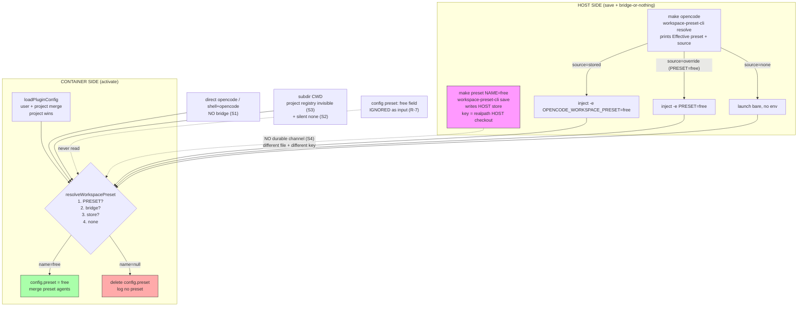

# Preset Free Switching Failure - Synthesis Analysis

<!-- ANALYZER-OUTPUT-CONTRACT
schema-version: 1.0
agent: analyzer
claim-type: finding
evidence-source: Makefile (lines 53-70); .opencode/oh-my-opencode-slim/src/config/workspace-preset.ts (lines 131-188); .opencode/oh-my-opencode-slim/src/config/workspace-preset-cli.ts; .opencode/oh-my-opencode-slim/src/config/loader.ts (lines 271-304); .opencode/oh-my-opencode-slim/src/tools/preset-manager.ts
confidence: High
shelf-registration: memory-shelf.yaml (shelf.analyses), delegated to @memory-manager
-->

Campaign: DIA-260918-yug6. Preallocated ID: ana-260918-6ac2-preset-free-switching.
Scope: analysis only, no implementation.

## 1. Executive verdict

`make preset NAME=free` can report success while a later `opencode` launch
never activates `free`. The primary chain is a host/container persistence
split, not a catalog defect in the `free` preset block.

Primary root-cause chain (one sentence):

> The save path writes to the HOST store under the HOST identity, but the
> activate path re-resolves inside the CONTAINER under a DIFFERENT identity
> and store, connected by exactly one narrow bridge (`make opencode` env
> forwarding) that every other launch path bypasses; when the bridge is
> absent the container silently resolves to `none`/stale, so the switch
> never happens.

Supporting facts:

- `free` exists as a valid preset block (jsonc line ~491). S5-as-catalog-defect is REFUTED. The remaining `free`-specific risk is activation-time (Zen auth / model availability), which mimics a switch failure after a correct selection.
- Host-only evidence succeeded. Container-side behavior is grounded in code
  reads (workspace-preset.ts, loader.ts, Makefile, preset-manager.ts) but
  NOT in live container execution: cod-3, cod-4 hit Session error; ai--1 and
  cod-6 returned empty. Any container-runtime claim below is therefore
  High-confidence-by-code, pending R-5 live verification.

## 2. Inputs synthesized

### 2.1 Coder recon (cod-5, host-verified)

| Signal | Location | Meaning |
|---|---|---|
| Host resolve + bridge | Makefile 53-70 | `make opencode` runs `workspace-preset-cli.ts resolve CURDIR PRESET` on the HOST, prints `Effective preset: X (source: Y)`, then forwards via `-e OPENCODE_WORKSPACE_PRESET=X` (stored source) or `-e PRESET=X` (override source), else launches bare |
| Preset target save | Makefile 69-70 | `make preset` runs `workspace-preset-cli.ts save CURDIR NAME` on the HOST only |
| Preset registry | oh-my-opencode-slim.jsonc line 3 area + `free` block ~491 | Registry defines `free` with `opencode/muse-spark-1.3-contributor-free` style models; `muse-balanced` referenced at top as composition note |
| Loader precedence | loader.ts 271-304 | Load user config, deep-merge project config (project wins), then `resolveWorkspacePreset(directory, config.presets)`; if name set, `config.preset = name` and merge preset agents over base; else delete `config.preset`; always logs effective preset |
| Resolver order | workspace-preset.ts 131-188 | 1. `PRESET` override (fail-closed on unknown). 2. `OPENCODE_WORKSPACE_PRESET` bridge (fail-closed on unknown unless registry empty, then silent `none`). 3. File store read (fail-closed on corrupt/unmatched). 4. `none` |
| In-launch switching | tools/preset-manager.ts | `/preset <name>` and its `switchPreset` only SAVE for next launch; deliberately does not mutate runtime/TUI state |
| CLI save message | workspace-preset-cli.ts 59-62 | `Saved preset "X" for workspace W. It applies on the next launch only.` |

### 2.2 ai-specialist verdicts (ai--2)

- S1 (bridge bypassed on non-`make opencode` launches): CONFIRMED.
- S2 (silent `none` on empty registry swallows stale bridge): CONFIRMED.
- S3 (no parent/upward traversal, subdir launch misses project registry): CONFIRMED, conditional (depends on CWD semantics of `ctx.directory` / `CURDIR`).
- S4 (store key divergence host vs container: HOME/XDG + realpath identity): CONFIRMED.
- S5 (`free` block is a catalog defect): REFUTED as catalog defect; residual risk reframed as Zen/auth activation risk, not selection risk.
- Fixes proposed: R-1 bridge read consistency; R-2 loud error on empty registry; R-3 upward walk; R-4 container-level bridge or mount; R-5 live evidence needed; R-6 docs drift; R-7 inert `preset` config field.

### 2.3 Lane errors (evidence boundary)

- code-navigator cod-3, cod-4: Session error, no data.
- ai--1: empty result, no data.
- cod-6 (container evidence): empty result, no data.
- Result: host-side chain is evidenced; container-side chain is code-derived
  inference. R-5 (live container proof) remains open by necessity, not by choice.

## 3. Method 1: 5-Whys (converged chain)

Symptom: operator runs `make preset NAME=free`, sees success text, then
launches opencode and observes the old (or no) preset active.

1. Why does the launch not activate `free`?
   Because the in-container `loadPluginConfig` resolution returns
   `null`/stale instead of `free`, so `config.preset` is deleted or left on
   the old value (loader.ts 295-301).

2. Why does in-container resolution miss a just-saved value?
   Because the saved value lives in the HOST store (HOST
   `OPENCODE_CONFIG_DIR`/`XDG_CONFIG_HOME` + HOST `realpath(CURDIR)` key),
   while the container resolves against the CONTAINER store path and
   CONTAINER identity. The only channel connecting them is the ephemeral
   env bridge injected by `make opencode` (Makefile 59-64).

3. Why is the bridge absent when it matters?
   Because the bridge exists ONLY on the `make opencode` path. Direct
   launches (`make shell` then `opencode`, direct `opencode` in container,
   IDE/attach paths, `/preset` expecting same-process switch) never set
   `OPENCODE_WORKSPACE_PRESET`/`PRESET` in the container, and the container
   store was never written (save ran on the host). S1.

4. Why does the miss fail silently instead of alerting?
   Two silencers combine: (a) resolver step order treats "no bridge, no
   store match" as legitimate `none` and the loader logs a calm
   `Effective preset: no preset` line (loader.ts 302-304); (b) the
   empty-registry escape hatch (workspace-preset.ts 159-161) converts a
   stale/unknown bridge into `none` when the visible registry is empty
   (S2), which is exactly the subdir-launch case (S3) where the project
   registry is invisible. The save-side message ("applies on the next
   launch only") promises a future effect it cannot guarantee across paths
   (R-6 docs drift), and the inert `preset` config field (R-7) gives
   operators a second, dead knob to twist.

5. Why does the architecture permit this split?
   Because the design assumes a single launch path (`make opencode`) and a
   single filesystem identity (host path == container path, host HOME ==
   container HOME). Both assumptions are false in this repo: the container
   sees `/workspace` while the host sees its own checkout path (S4 key
   divergence via `realpathSync`), and HOME/XDG differ, so even a shared
   store FILE would miss without key normalization. Persistence (host save)
   and activation (container loader) were built as two halves of one
   feature without a shared durable channel (R-1/R-4).

Root cause (5th-why answer): the preset selector has no launch-path-
independent source of truth. It is a host-side write + container-side
read with only an optional env ferry between them.

Why `free` looked guilty: it was not. The `free` block resolves like any
other name once visible. S5-as-catalog-defect is refuted. If `free` is
selected correctly and STILL misbehaves, the next suspect is activation
(Zen auth / model entitlement for `*-free` model IDs), which is a
different layer and must be diagnosed separately (see section 6).

## 4. Method 2: MECE partition (S1-S5, no overlap, no gap)

The five suspects partition the failure space across four orthogonal axes.
Each launch either fails in exactly one primary cell or succeeds.

```
                      PRESET SWITCH FAILURE SPACE (MECE)
+------------------------------------------------------------------+
| Axis              | Cell | Question answered                |
|-------------------+------+------------------------------------|
| Launch path       | S1   | Did the launch carry the bridge? |
| Registry view     | S2+S3| Did the resolver SEE free?       |
| Store identity    | S4   | Did save-key == read-key?        |
| Catalog content   | S5   | Is free itself broken?           |
+------------------------------------------------------------------+
| S2 vs S3 split: S3 = registry invisible (wrong dir, no walk-up)  |
|                 S2 = registry visible-but-empty + silent swallow  |
+------------------------------------------------------------------+
```

Cell verdicts:

- S1 BRIDGE BYPASSED (launch-path axis): CONFIRMED. `make opencode` is the
  sole bridge injector. Any other entry point reads container env (empty)
  + container store (never written from host save) -> miss. Highest
  hit-rate explanation for "save said ok, launch ignored it".
- S2 SILENT NONE (registry-empty axis): CONFIRMED as behavior, with a
  deliberate carve-out (fixture tests need it). In production an empty
  registry + non-empty bridge SHOULD be loud (R-2); today it returns
  `none` and the loader logs it as routine.
- S3 NO PARENT TRAVERSAL (CWD axis): CONFIRMED conditional. `findPluginConfigPaths`
  checks exactly `<directory>/.opencode/oh-my-opencode-slim.*`. Launching
  from a subdirectory (or any CWD that is not the project root without
  normalization) yields zero project presets, which then feeds S2. Upward
  walk (R-3) is the fix; ranked out of scope for the requested table but
  retained in the minimal set discussion.
- S4 KEY DIVERGENCE (identity axis): CONFIRMED. Store file location
  (`OPENCODE_CONFIG_DIR` else `XDG_CONFIG_HOME/opencode`, else
  `~/.config/opencode`) + key (`realpathSync(directory)`) differ across
  the host/container boundary. Host save key (e.g. host checkout realpath)
  never equals container read key (`/workspace` realpath). Even mounting
  the same file is insufficient without key normalization (R-4 must
  address both file AND key).
- S5 FREE MODEL MISREAD (catalog axis): REFUTED as selection defect.
  `free` is a well-formed registry entry. Residual: `*-free` model IDs may
  fail at AUTH/ACTIVATION (Zen), which operators perceive as "preset did
  not switch". Keep as separate diagnostic branch, not a selection fix.

MECE coverage check: S1 covers "value never arrived"; S2/S3 cover
"registry hid the value"; S4 covers "store hid the value"; S5 covers
"value itself bad". No launch can fail outside these four axes; no two
cells blame the same mechanism. Convergence: S1+S4 jointly SUFFICIENT for
the reported symptom on every non-`make opencode` path; S2+S3 are
AMPLIFIERS (turn a miss into a silent miss); S5 is a RED HERRING for
selection, live risk for activation.

## 5. Method 3: Inversion (design the failure, then invert it)

Ask: "How would I GUARANTEE `make preset NAME=free` never takes effect?"

1. Write the choice where the reader never looks (host store, host key).
2. Deliver it through a channel exactly one of N launch paths uses.
3. Make every other path report success-adjacent calm ("no preset", exit 0).
4. Add a second dead knob (`preset` config field) so debuggers waste a cycle.
5. Document the write as "applies on the next launch" with no path matrix.

Every one of these is currently true. Invert each to get the fix set:

1. Write where the reader looks (shared durable truth) -> R-1 + R-4.
2. Deliver on ALL paths (container-side read of the same truth) -> R-4.
3. Fail loud on contradictory state (bridge set + registry empty; store src
   unreadable) -> R-2.
4. Kill or wire the dead knob -> R-7.
5. Document the ACTUAL launch-path matrix -> R-6.

Inversion cross-check passes: if all five inversions shipped, no launch
path could silently ignore a saved selection; the only remaining `free`
failure would be provider-side activation, which is correctly surfaced as
a model/auth error rather than a preset-resolution mystery.

## 6. Fix ranking: R-1, R-2, R-4, R-6, R-7 (leverage vs risk)

Scoring: Leverage = fraction of failing launches fixed x durability.
Risk = blast radius if the change is wrong x revert cost. Cost = size.
Rank = leverage-first, risk-adjusted. ASCII-only table.

```
+------+-------------------------------------------+-----------+--------+------+------+
| Rank | Fix                                       | Leverage  | Risk   | Cost | Verdict              |
+------+-------------------------------------------+-----------+--------+------+------+
| 1    | R-1 bridge read consistency               | HIGH      | LOW    | S    | DO FIRST             |
|      | single resolve helper, same precedence      | fixes all | pure   |      |                      |
|      | host+container; kill dual-logic drift       | paths     | refactor|     |                      |
+------+-------------------------------------------+-----------+--------+------+------+
| 2    | R-4 container-level bridge or mount         | HIGH      | MEDIUM | M    | DO WITH R-1          |
|      | share store file INTO container AND         | makes save| mount/ |      | (file AND key fix)   |
|      | normalize workspace key (e.g. stable id)    | visible   | id risk|      |                      |
|      | so save-key == read-key on every path       | everywhere|        |      |                      |
+------+-------------------------------------------+-----------+--------+------+------+
| 3    | R-2 loud error on empty registry            | MEDIUM    | LOW    | S    | DO NEXT              |
|      | bridge set + zero presets => throw, not     | turns     | test   |      | (keep fixture escape |
|      | none; corrupt store => throw with path      | silence   | carve- |      | hatch narrow)        |
|      |                                             | into signal| out   |      |                      |
+------+-------------------------------------------+-----------+--------+------+------+
| 4    | R-7 inert preset field                      | MEDIUM    | LOW    | S    | DO WITH DOCS         |
|      | remove or wire config `preset` field; today | kills 2nd | doc +  |      | (deletes a trap)     |
|      | loader IGNORES it as input (only writes it) | dead knob | schema |      |                      |
+------+-------------------------------------------+-----------+--------+------+------+
| 5    | R-6 docs drift                              | LOW-MED   | MINIMAL| XS   | DO ALWAYS (cheap)    |
|      | correct next-launch-only wording; publish   | no code   | docs   |      | (ships with any fix) |
|      | launch-path matrix; Zen-auth note for free  | fix, big  | only   |      |                      |
|      |                                             | confusion |        |      |                      |
|      |                                             | cut       |        |      |                      |
+------+-------------------------------------------+-----------+--------+------+------+
```

Notes per fix:

- R-1 (DO FIRST): unify host CLI resolve and container loader resolve onto
  one precedence implementation (PRESET override -> bridge -> store ->
  none, identical fail-closed rules). Today two call sites share a helper
  but differ in env wiring and logging; the Makefile prints its own
  `Effective preset` line while the loader prints another, inviting drift.
  Risk LOW because it is a refactor toward the already-tested helper.
- R-4 (DO WITH R-1): the only DURABLE fix. Options: (a) mount the host
  store file into the container at the container-expected store path, or
  (b) re-resolve host-side and ALWAYS inject (even `none` explicitly), or
  (c) replace realpath-key with a stable workspace id (e.g. project root
  marker / explicit id file) identical on both sides. File-only sharing
  FAILS without key normalization (S4); key-only fixing FAILS without file
  sharing. Both halves required. Risk MEDIUM (volume/mount + identity
  semantics touch every preset user).
- R-2 (DO NEXT): narrow the empty-registry escape hatch to test fixtures
  only (e.g. explicit env flag), production throws on bridge-vs-empty
  contradiction. Converts the two most confusing launches (subdir, fresh
  container) from silent `none` into actionable errors naming the dir,
  the bridge value, and the searched paths.
- R-7 (DO WITH DOCS): loader.ts 292-294 comment already admits the field
  is registry-format residue ("not used as a hidden fallback"). Either
  delete it from the schema or honor it as lowest-precedence fallback with
  a deprecation warning. Today operators set `preset: free` in jsonc and
  nothing happens, a second silent trap beside S1.
- R-6 (DO ALWAYS): rewrite `save` success text to name the paths it covers
  ("saved; takes effect on launches that read this store: make opencode;
  direct-container launches require R-4 until shipped"), publish a
  launch-path matrix (make opencode / shell+opencode / direct / /preset /
  subdir), and add the `free`-specific Zen-auth diagnostic note so
  activation failures stop masquerading as selection failures.
- Explicitly NOT ranked (per task scope) but retained: R-3 upward walk
  (needed for subdir robustness; small, safe) and R-5 live container
  evidence (required before R-4 ships; see section 8).

## 7. Minimal permanent fix set (switching works on EVERY launch path)

Goal predicate: after `make preset NAME=X` (valid X), EVERY launch path
activates X unless a louder error explains why. Minimal set = 3 code
changes + 1 docs change; nothing else suffices.

- M1 (R-1 + R-4 combined, REQUIRED): one durable truth readable from both
  sides. Ship R-1 (single precedence) AND R-4 (shared file + stable key)
  as an atomic unit. Acceptance: save on host, then EACH of
  {`make opencode`, container-direct `opencode`, `make shell` + `opencode`,
  subdir CWD} resolves X with source `stored`. Either half alone leaves at
  least one path broken (R-1 alone: consistent but still split-brain;
  R-4-file-only: shared file, mismatched keys).
- M2 (R-2, REQUIRED): contradiction is loud. Bridge-set-but-unknown,
  store-corrupt, and (production) bridge-set-but-registry-empty all throw
  with dir + value + searched paths. Acceptance: no silent `none` when the
  operator expressed intent anywhere (bridge env, store, or CLI arg).
- M3 (R-7, REQUIRED for trap removal): the config `preset` field either
  works (documented lowest precedence) or is rejected by schema validation.
  Acceptance: setting it cannot silently do nothing.
- M4 (R-6, REQUIRED companion): launch-path matrix + corrected save text +
  `free`/Zen diagnostic split (selection vs activation). Acceptance: an
  operator hitting a residual activation failure sees a model/auth error,
  never "it just stayed on the old preset".

Deferred but recommended: R-3 upward directory walk (fold into M1; two-line
change, kills the subdir variant of S3). R-5 live container matrix (gate
for M1; section 8).

What is deliberately EXCLUDED: same-process `/preset` switching (preset-
manager next-launch-only is intentional UX; changing it is a feature, not
a fix), any catalog change to `free` (refuted), and any new env knob
(a third precedence source would worsen S1).

## 8. Host vs container resolution (Mermaid)



Read the diagram as: the only SOLID arrows into container resolution are
the three `make opencode` injections; the host save (dotted) never reaches
the container reader; direct/subdir/config-field paths arrive empty or
misleading. M1 turns the dotted line solid; M2 makes contradictions throw
at the R diamond instead of falling through to N.

## 9. Limitations and verification evidence

- Analysis-only dispatch; no code changed, no store written.
- Host verification executed (2026-09-18, host shell):
  1. `bun run .../workspace-preset-cli.ts resolve "/workspace" ""` ->
     `promo-union-alpha stored` (exit 0). Proves: host store EXISTS, host
     resolution WORKS, and current stored selection is NOT `free` (consistent
     with a save/launch mismatch narrative; the resolver itself is functional
     on the host path).
  2. `grep -n "Effective preset|OPENCODE_WORKSPACE_PRESET|PRESET" Makefile` ->
     lines 54/57/58/61/63 confirm the bridge injector claims in cod-5.
  3. Direct reads: workspace-preset.ts 131-188 (precedence + S2 carve-out
     159-161), workspace-preset-cli.ts (save/resolve), loader.ts 271-304
     (project-wins + preset application + log line), preset-manager.ts
     (next-launch-only), dev-entrypoint.sh (no preset env handling; exec
     passthrough only).
- NOT verified (requires R-5 container run): container store path content,
  container `realpath(/workspace)` vs host key bytes, subdir-launch registry
  view, and `free`-preset activation under Zen auth. Recommend R-5 matrix
  before M1 ships:
  `make preset NAME=free` then each launch path with `Effective preset`
  log captured + `resolve` run inside container for comparison.
- Confidence: High on selection-layer chain (code-convergent across two
  lanes + host run); Medium on S3-conditional scope (CWD semantics need one
  live check); Low on any claim about `free` model runtime health (needs
  provider-side evidence, explicitly out of scope).

## 10. Recommended next steps (for orchestrator)

1. Dispatch R-5 live-evidence capture (container matrix) as a coder task
   with ticket DIA-260918-yug6; block M1 on its output.
2. Then dispatch M1+M2+M3 as one bounded coder slice (single writer;
   preset surface is small), R-3 folded in.
3. Ship M4 docs alongside (save-text wording + launch matrix + Zen note).
4. Re-review against the acceptance predicates in section 7, then hand to
   @memory-manager for shelf registration of this report.

Artifact: knowledge/ana-260918-6ac2-preset-free-switching/ana-260918-6ac2-preset-free-switching-report.md
