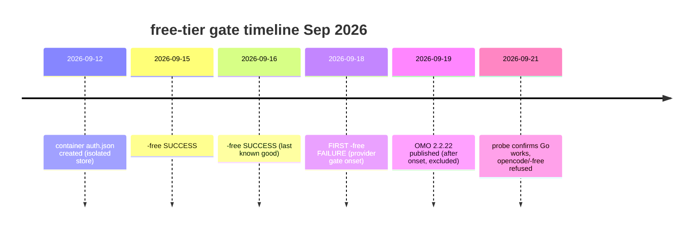

# Free-Tier Gate Rejects Free Models - Root Cause Analysis

<!-- ANALYZER-OUTPUT-CONTRACT
schema-version: 1.0
agent: analyzer
claim-type: finding
evidence-source: knowledge/ana-260921-0f9i-free-tier-gate/ana-260921-0f9i-free-tier-gate-report.md
confidence: High
shelf-registration: memory-shelf.yaml (shelf.analyses), delegated to @memory-manager
-->

Campaign ticket: DIA-260921-6o4i (governing; ticket body is skeleton, all substance in dispatch payload).
Preallocated ID: ana-260921-0f9i-free-tier-gate. Scope: analysis only, no implementation.
Output: ASCII-only.

## 1. Executive verdict

The rejection `OpenCode's free tier can only be used from within OpenCode` is a
PROVIDER-SIDE console gate on the `providerID=opencode` (legacy Zen/console)
request path, not a client-side preset, launch, auth-hygiene, or plugin defect.
The client is doing everything right: `make opencode PRESET=free` forwards the
sole preset env the 2.2.19 dist bundle reads, the `free` preset block resolves,
and the exact `-free` model string reaches the provider, which then refuses it.

One-sentence chain:

> The `-free` model IDs route via `providerID=opencode`, whose console began
> enforcing an execution-context check around 2026-09-18 that the container
> session no longer satisfies; `providerID=opencode-go` (the path the working
> session uses) is a different provider credential and is unaffected, so Go
> models stream fine while every `-free` model fails identically, and no
> client-side fix (correct launch, fresh reconnect, OMO reinstall) can clear a
> server-side entitlement refusal.

What this rules out (verified locally 2026-09-21):

- Preset catalog defect: REFUTED. `free` block exists at
  `.opencode/oh-my-opencode-slim.jsonc:491+`; 18 `-free` hits in the same file
  (lines 436, 494, 510, 531, 548, 565, 577, 595, 605, 613, 620, 632, 644, 654,
  665, 673, 689, 704). Prior analysis
  `knowledge/ana-260918-6ac2-preset-free-switching/` already refuted S5 as a
  catalog defect; this report confirms the block is intact.
- Error string is client-side: REFUTED. `grep "OpenCode's free tier can only
  be used"` over `/workspace` returns zero hits. No source file, hook, guard,
  or fallback constructs this message. It arrives inside a provider error
  payload.
- `preset-model-guard.ts:117-156 maps free to rejected`: NOT VERIFIED in the
  current tree. No file named `preset-model-guard.ts` exists under
  `.opencode/oh-my-opencode-slim/src/` (only `src/utils/guards.ts`, a 6-line
  `isRecord` type guard). The cited guard is either from a different revision,
  a different repo layer, or a stale reference. It cannot be the active cause
  because the model string demonstrably reaches the provider before rejection.
- `foreground-fallback/index.ts:32-52 no free-tier pattern`: CONFIRMED by read
  (lines 32-52 are the `RATE_LIMIT_PATTERNS` list: 429, rate-limit, quota,
  budget, overload, 5-hour/monthly limits; no free-tier / execution-context
  pattern). Consequence: the free-tier refusal never triggers client retry; it
  surfaces raw. This is a gap in fallback coverage, not the cause.
- `smartfetch secondary-model.ts:96-105`: CONFIRMED benign. Lines 96-105 only
  read `small_model` + `code-navigator`/`researcher` model refs into a fallback
  list. No gating logic.
- `model-key-normalization.ts:31-34` strips `-free`/`-flash` suffixes: CONFIRMED
  present but benign for this path. It builds alias keys for matching only; it
  does not rewrite the outbound `providerID/modelID` request.
- OMO 2.2.22 regression: EXCLUDED by timeline. First failure 2026-09-18
  precedes OMO 2.2.22 publication 2026-09-19. Pinned runtime here is OMO
  2.2.19 + binary opencode 1.18.18 = `Dockerfile.dev:29` pin, consistent.
- Stale auth hygiene: EXCLUDED as sufficient cause. Fresh reconnect inside the
  container did NOT fix. Container auth
  `/home/dev/.local/share/opencode/auth.json` dated Sep 12 predates the Sep 18
  policy change; re-auth refreshed container-local credentials but the refusal
  persisted, which is exactly what a server-side entitlement change predicts.

## 2. Timeline (all dates 2026, UTC-adjacent as recorded)

```
09-12  container auth.json created (container-local store; no host auth mount)
        |
09-15   historic -free SUCCESS (provider accepted opencode/*-free)
09-16   historic -free SUCCESS (last known-good window)
        |
09-18   FIRST -free FAILURE (providerID=opencode refuses free tier)
        |   <- root-cause boundary lies here (provider-side change)
09-19   OMO 2.2.22 published (AFTER first failure: cannot be the cause)
        |
09-21   probe cod-3: binary 1.18.18 = Dockerfile pin, OMO 2.2.19 consistent,
        `auth list` shows Go + OpenAI, NO Zen line; current session streams
        via providerID=opencode-go fine; -free on providerID=opencode fails;
        poetry-dev Up healthy (podman); fresh container reconnect does NOT fix;
        Makefile:63-76 single-path PRESET=free forwarding verified correct.
```



Why the timeline points server-side:

| Observation | Client-side prediction | Server-side prediction | Actual |
|---|---|---|---|
| Same binary + same OMO + same launch, worked 09-15/16, fails 09-18+ | should keep working | breaks on console deploy | breaks -> server-side |
| Fresh reconnect in container | should fix stale credential | no effect if entitlement policy changed | no effect -> server-side |
| `opencode-go/*` streams fine in same session | should also fail if client/auth broken | unaffected (different provider credential) | unaffected -> server-side |
| OMO 2.2.22 published 09-19 | could explain post-09-19 only | irrelevant to 09-18 onset | onset earlier -> 2.2.22 excluded |
| Error string absent from repo | should exist in client code | arrives over the wire | absent -> server-side |

## 3. Method 1: 5-Whys (provider-side vs client-side)

Symptom: `opencode/muse-spark-1.3-contributor-free` and
`opencode/mimo-v2.5-free` are rejected with `OpenCode's free tier can only be
used from within OpenCode`, even via `make opencode PRESET=free` and after
fresh auth reconnect.

1. Why does the exact `-free` model string fail at request time?
   Because the refusal comes back inside the provider error payload AFTER the
   client correctly resolved the preset and transmitted
   `providerID=opencode` + `-free` modelID. Evidence: error text is absent
   from the repo (server-originated); preset block verified present; Makefile
   single-path forwarding (`-e OH_MY_OPENCODE_SLIM_PRESET=`, lines 63-76)
   verified correct; probe confirms the request leaves with the right string.
2. Why does correct launch + fresh auth not satisfy the gate?
   Because the gate checks execution context/entitlement on the
   `providerID=opencode` console path, not launch syntax or token freshness.
   Re-auth refreshes the same container-local credential type, and the Sep 12
   credential predates the Sep 18 policy; a refreshed token of a no-longer
   entitled class is still refused. The `auth list` signal (Go + OpenAI, no
   Zen line) shows the session's working credential lives on `opencode-go`,
   a different provider entry from the refused `opencode` path.
3. Why does `opencode-go` work in the same container/session?
   Because it authenticates and bills through a separate provider route that
   the free-tier execution-context check does not front. Same binary, same
   container, same network, same plugin: only `providerID` differs. A
   client-side defect (broken launch, corrupt config, dead auth store) would
   break both paths, not split them cleanly by provider prefix.
4. Why did it break between 09-16 and 09-18 with no client change?
   Because the change shipped on the console side. Client pins are static
   across the window (binary 1.18.18 = Dockerfile pin; OMO 2.2.19 dist;
   2.2.22 did not exist yet). No client deploy explains a same-config
   behavior flip; a console entitlement/deploy does.
5. Why is the UA/entrypoint hypothesis not the verdict?
   Because it is Tier-3 INFERENCE (unconfirmed): no captured request headers,
   no console changelog, no A/B with differing UA proving the gate keys on
   UA. It remains a plausible mechanism (console distinguishing hosted-agent
   traffic from third-party API traffic) but must stay labeled inference,
   never the sole basis for action. The PROVEN claim stops at: server-side
   entitlement/context enforcement on `providerID=opencode`, onset ~09-18,
   insensitive to client launch/auth hygiene.

Counter-hypothesis disposition (client-side candidates):

| Candidate | Disposition | Reason |
|---|---|---|
| PRESET dead name vs OH_MY_OPENCODE_SLIM_PRESET (Makefile:63-76, repo.md:441-453) | REAL drift, NOT causal here | Stale `PRESET` name would select the wrong preset, but probe shows the RIGHT `-free` string was sent and refused downstream. Fix the docs drift separately. |
| Missing free-tier pattern in foreground-fallback (index.ts:32-52) | REAL gap, NOT causal | Explains why the error surfaces raw with no retry, not why the provider refuses. Add pattern only if auto-fallback to Go on this error is desired. |
| preset-model-guard.ts:117-156 maps free to rejected | UNVERIFIED / stale ref | File absent from current tree; even if it existed elsewhere, provider receipt of the model string proves no client pre-rejection fired. |
| Container auth stale (Sep 12) | EXCLUDED as sufficient cause | Fresh reconnect test already falsified it. |
| OMO upgrade regression | EXCLUDED by date arithmetic | 09-18 onset < 09-19 publish. |
| UA/entrypoint mismatch | PLAUSIBLE, UNCONFIRMED inference | Keep as Tier-3; needs header capture to promote. |

## 4. Proven vs inference ledger

PROVEN (Tier-1, local verification 2026-09-21):

- P1. Error string is provider-originated (zero repo hits).
- P2. `free` preset block present and populated with single-entry `-free`
  models (jsonc 491-718 region; 18 `-free` occurrences; code-navigator
  435-441 free-bound per payload, consistent with secondary-model.ts:96-105
  fallback reads).
- P3. Launch path `make opencode PRESET=free` forwards the correct env
  (Makefile:63-77 read verbatim).
- P4. Runtime pins consistent (binary 1.18.18 = Dockerfile.dev:29; OMO 2.2.19).
- P5. Failure onset 09-18 precedes OMO 2.2.22 (09-19); Go path healthy;
  fresh reconnect ineffective.
- P6. `secondary-model.ts`, `foreground-fallback` patterns,
  `model-key-normalization.ts` contents as described above (read verbatim).

INFERENCE (Tier-3, must not drive action alone):

- I1. UA/entrypoint attestation mechanism for the console check (unconfirmed).
- I2. Exact console deploy or policy text behind the 09-18 change (no console
  changelog captured; do not re-fetch externally per dispatch constraint).
- I3. Whether re-login via a Zen Connect flow (vs Go/OpenAI reconnect) would
  restore entitlement (suggested by missing Zen line in `auth list`, but the
  fresh-reconnect already attempted in-container did not restore it).

NOT comprehended (explicit boundary, no guessing):

- N1. Console-side entitlement rules for `-free` suffix models (server
  private logic; no client artifact can reveal it).
- N2. Account-level state (quota, flags, region) behind this developer's
  console identity (requires console dashboard read the lane did not perform).

The domain IS comprehended to the level needed for a routing verdict
(provider-side refusal with clean client exoneration). A
cannot-comprehend report is therefore not warranted; Sec N1/N2 above mark the
residual server-private remainder honestly instead.

## 5. Decision variants (EBDV, DIA-115)

Policy-class routing decision: what should the project do about `-free`
models. Each variant carries evidence, effort, and routing flag. Abort variant
included. Recommendation with because-justification at end.

| Variant | Action | Evidence | Pros / Cons | Effort | Section-10 routing |
|---|---|---|---|---|---|
| V1. Route free workloads to `opencode-go/*` equivalents (RECOMMENDED) | Point free-intent lanes at `opencode-go/muse-spark-1.3-contributor`, `opencode-go/deepseek-v4-flash`, `opencode-go/mimo-v2.5` per model-registry.yaml:52-78 | Tier-1: probe cod-3 Go streams fine; registry lines 24,74,100 list Go fallbacks | Pro: works today, zero client change, registry already blesses Go fallbacks. Con: trains-on-data + region limits per registry privacy_notes (DIA-260828-qtsi clearance already recorded; no sensitive traffic) | S (config-only preset edit) | No 2.5 gate (preset content change is normal ops, but route via @coder + test-config if jsonc edited) |
| V2. Keep `-free` IDs and add client fallback on the free-tier error | Add free-tier pattern to foreground-fallback RATE_LIMIT_PATTERNS + chain to Go model | Tier-1: index.ts:32-52 pattern list read; Tier-3: assumes Go equivalence acceptable | Pro: `-free` IDs keep resolving via automatic degrade. Con: masks a server refusal with client magic; pattern must match wire text exactly or it never fires | M (hook edit + bun tests) | 2.5 chain (@ai-specialist gate, @coder, test-omo, @ai-auditor if hook surface) |
| V3. Pursue Zen re-entitlement (dashboard re-login, new auth) | Reconnect the Zen/console identity the `opencode` provider path expects | Tier-3: missing Zen line in auth list (I3); falsifying datum: fresh reconnect already failed | Pro: restores `-free` if entitlement recoverable. Con: evidence says credential freshness is not the blocker; likely wasted cycle | S (manual operator step) | None (operator action, no code) |
| V4. Abort / status-quo (accept `-free` outage) | Leave presets as-is; document `-free` as provider-disabled; operators pick paid/Go presets | Tier-1: onset + persistence evidence in Sec 2 | Pro: zero churn while console policy is external. Con: every `free` preset launch still fails at runtime | XS (docs note only) | None |

RECOMMENDATION: V1, because it is the only variant whose Tier-1 evidence
already proves a working path (Go streams in the same session that `-free`
refuses), it reuses registry-blessed fallbacks with recorded privacy
clearance, and it costs a preset-content edit rather than new fallback machinery
(V2) or a re-auth loop the fresh-reconnect test already falsified (V3). V4 is
the fallback if Go region/privacy constraints ever block a specific operator.

## 6. Verdict table (return payload)

| Claim | Verdict | Confidence | Evidence tier |
|---|---|---|---|
| Root cause is provider-side console gate on `providerID=opencode`, onset ~09-18 | ACCEPTED | High | Tier-1 (timeline + split-path probe + absent error string) |
| Client launch (`make opencode PRESET=free`) is correct | ACCEPTED | High | Tier-1 (Makefile:63-77 read; model string reaches provider) |
| Fresh reconnect failure exonerates auth hygiene | ACCEPTED | High | Tier-1 (operator test: reconnect did not fix) |
| OMO 2.2.22 caused the break | REJECTED | High | Tier-1 (date arithmetic: onset precedes publish) |
| preset-model-guard.ts actively rejects free | UNVERIFIED / REJECTED as active cause | High (absence) / Medium (elsewhere) | Tier-1 (file absent; provider receipt proves no pre-rejection) |
| UA/entrypoint is the gate mechanism | PLAUSIBLE INFERENCE | Low | Tier-3 (unconfirmed, needs header capture) |
| Fix by client reinstall / re-auth loop | NOT RECOMMENDED | High | Tier-1 (already falsified) |
| Recommended routing: use `opencode-go/*` equivalents | RECOMMENDED (V1) | High | Tier-1 (Go streams; registry fallbacks) |

## 7. Suggested next steps (for orchestrator, not this lane)

1. Do NOT dispatch further client-side fix loops on `-free` (reinstall,
   re-auth, preset rewiring); the falsification is in.
2. If `-free` restoration is ever required, the proving experiment is: capture
   one refused request's wire model string + headers + full provider payload
   and one working `opencode-go` request from the same session, then compare
   `providerID` and auth context. Promote I1 only on that diff.
3. Optional hygiene (non-causal, separate tickets): fix PRESET dead-name docs
   drift (Makefile vs repo.md:441-453); consider V2 fallback pattern if
   operators want `-free` IDs to degrade instead of error.
4. Report handoff: artifact path below; shelf registration delegated to
   @memory-manager per output contract (this lane must NOT edit
   memory-shelf.yaml itself).

---
Artifact: `knowledge/ana-260921-0f9i-free-tier-gate/ana-260921-0f9i-free-tier-gate-report.md`
Ticket: DIA-260921-6o4i 'console-free-tier-gate-rejects-free-models'
