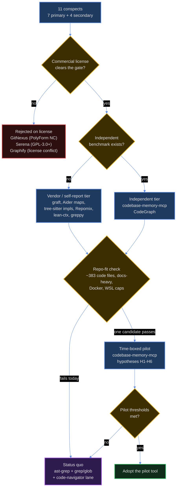
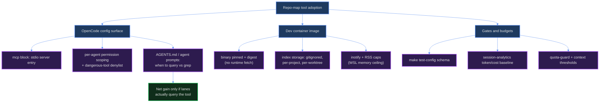

# Repo-Mapping and Code-Context Tooling Evaluation (DIA-260925-td9h)

<!-- ANALYZER-OUTPUT-CONTRACT
schema-version: 1.0
agent: analyzer-escalated
claim-type: evaluation
evidence-source: 11 archived conspects under knowledge/res-260925-* (7 primary + 4 secondary); repo measurements taken 2026-09-25
confidence: Medium
shelf-registration: memory-shelf.yaml (shelf.analyses), delegated to @memory-manager
-->

## 1. Scope and method

Decision under evaluation: whether to adopt repo-map / code-context tooling into
this repository's OpenCode-based multi-agent workflow (orchestrator delegates to
coder / reviewer / analyzer / architector lanes), with the stated goal of
cheaper, more reliable repo navigation for agents (token economy) on a large
repo, commercial-friendly licensing, and graceful privacy degradation (ZDR
preferred).

Inputs:

- PRIMARY SET (full dossiers): Graft; GitNexus; tree-sitter repo map + ast-grep;
  Aider Repo Map; codebase-memory-mcp; CodeGraph; Serena.
- SECONDARY SET (one-line verdicts): Graphify; lean-ctx; greppy; Repomix.

Ground rules applied:

1. Every claim traces to one of the archived conspects; no outside knowledge and
   no browsing.
2. Vendor-reported numbers and independently measured numbers are labelled
   separately everywhere.
3. Copyleft and non-commercial licenses are treated as hard blockers, not
   footnotes (per analyst instruction).
4. Where the conspects are silent on something material, it is reported as a gap
   and not filled with inference.

Evidence grading scheme (used in every dossier):

| Grade | Meaning |
| --- | --- |
| G1 independent benchmark | Third party, disclosed method, test repo named. |
| G2 single-case external | One adopter / third-party case study, or a peer-reviewed evaluation with a single baseline and no replication. |
| G3 vendor-only | Vendor-run benchmark, self-reported case study, or marketing number. |
| G4 none | No controlled numbers; qualitative reports and issue trackers only. |

Claim provenance tags used in line: [INDEPENDENT], [ACADEMIC], [ADOPTER-SELF],
[VENDOR], [COMMUNITY].

## 2. Repo-fit baseline (measured 2026-09-25)

The "large repo" premise deserves a correction before any tool is scored. The
tracked corpus is large in prose, not in code:

| Measure | Value | Why it decides |
| --- | --- | --- |
| Tracked files | 1,845 | Not large by file count for graph indexers. |
| Markdown files | 1,069 (58%) | The dominant navigation surface is prose/config, not code. |
| Markdown under .opencode/ + docs/ + openspec/ + knowledge/ | 1,058 | None of the seven primary tools indexes markdown; all are tree-sitter code tools. |
| Code files repo-wide (.ts 286, .mjs 46, .py 29, .rs 8, .vue 8, .js 6) | 383 | Small code surface. |
| First-party product code (packages/ + apps/ + scripts/) | 87 code files | Exactly the size band where CodeGraph's independent benchmark measured a cost regression (Hono, ~280 files, cost +6.8%). |
| Existing structural capability | native `ast_grep_search` / `ast_grep_replace`, `grep`, `glob`, `read`; a `@code-navigator` lane | Any repo-map tool must beat an existing structural-search baseline, not plain grep. |
| MCP surface | 2 remote MCP servers in `.opencode/opencode.jsonc` (`mcp` block) | A local stdio MCP server requires config, permission scoping, and per-request tool-description overhead. |
| Dev image | Debian 13-slim; Node 24, pnpm, uv, Python, Rust, rust-analyzer; digest-pinned provisioning | Node/Python installs are feasible; runtime network fetches conflict with the image's pinning posture. |
| Live project constraints | WSL memory/CPU cap exhaustion ticket open (DIA-207); background-service-free pattern (DIA-137); AGENTS.md edits are section-10 policy | Memory-heavy or service-installing tools carry outsized risk here. |

Implication: the expected benefit of a code-symbol graph is bounded by a small
code surface, while the 1,058 markdown files that agents actually navigate
remain outside every primary candidate's index. The two strongest evidence
points in the whole set therefore matter more than any vendor claim:

- CodeGraph's independent benchmark found cost +6.8% and 20-43% higher cost on
  narrow-scope questions at a code-surface size close to ours
  [INDEPENDENT, harrisonsec.com].
- codebase-memory-mcp's own peer-reviewed paper reports an answer-quality gap of
  83% vs 92% against a file-exploration baseline [ACADEMIC, arXiv 2603.27277].

## 3. Verdict summary (primary set)

| # | Tool | Verdict | Evidence grade (source) | Biggest blocker | Integration effort |
| --- | --- | --- | --- | --- | --- |
| 1 | Graft | defer | G3 vendor-only (trailhq README; no independent replication per Wavect) | Pre-1.0 v0.18.x; benchmark-sample controversy; OOM at ~2,900+ files; telemetry default-on | M |
| 2 | GitNexus | reject | G2 single-case external (Ilzam) + G3 vendor case study (Satapathy); headline claims rejected by Ry Walker research | PolyForm Noncommercial 1.0.0 - hard license blocker | L |
| 3 | tree-sitter repo map + ast-grep | complement-only | G2 academic single-baseline (Codebase-Memory arXiv) + G3 self-reports | Licenses of the strongest implementations unstated; 0-900 star projects; no head-to-head benchmark | M (assemble), S/0 (status quo ast-grep) |
| 4 | Aider Repo Map | defer | G4 none (no isolated benchmark; one community token comparison) | Not a standalone artifact; monorepo symbol-collision failure documented by MeetsMore | L (extract) / S (RepoMapper) |
| 5 | codebase-memory-mcp | pilot | G1 independent benchmark (Emre Cavunt) + G2 peer-reviewed paper | Operational instability: 13.4 GB RSS idle, open leak, TS-monorepo crash, 8/14 MCP tool discovery; 9-pt quality gap | S-M |
| 6 | CodeGraph | defer | G1 independent benchmark (harrisonsec.com) + G3 vendor 7-repo benchmark | Independent cost regression at our code size; telemetry default-on with unresolved opt-out issue; bus factor 1 (91%) | S-M |
| 7 | Serena | reject | G2 adopter self-published (ManoMano) + G3 self-reports; maintainers' benchmark not published | GPL-3.0-or-later since v2 - hard license blocker; also off-axis (no graph/impact/ranking) | M |

## 4. Tool dossiers

### 4.1 Graft (trailhq/Graft, formerly NanoNets/Graft)

- VERDICT: **defer** (revisit triggers at the end of this dossier).
- WHY: Architecturally the closest fit in the set - MIT, TypeScript,
  deterministic tree-sitter structural tier, optional LLM concept tier, MCP plus
  AGENTS.md delivery, regenerable gitignored graph cache. But every published
  benchmark is vendor-run: the 162-run controlled sweep (-42% tokens, -46% tool
  calls, equal correctness) and the 50-instance SWE-bench Verified run
  (54% -> 66%) carry a documented sample-growth controversy (9 -> 20 -> 36 -> 50
  instances, one update 16/16 and another 2/14) and no independent replication
  [VENDOR; Wavect states no third-party replication exists]. Wavect's own
  verdict is "credible mechanism, not procurement evidence".
- EVIDENCE GRADE: G3 vendor-only (trailhq README benchmarks; Wavect review and
  andrew.ooo review present no original benchmarks).
- HARD BLOCKERS: pre-1.0 (v0.18.x, 97 open issues, no tagged releases); benchmark
  validity contested; OOM on large monorepos at approximately 2,900+ files;
  telemetry on by default; `graft init` writes outside the repo (machine-wide
  `~/.codex/`); OpenCode is NOT among the installer targets (Claude Code,
  Cursor, Codex, Copilot, Gemini, Kiro, Windsurf, Grok, AdaL); concept tier sends
  file and symbol content to a chosen LLM provider (privacy); `.vue` files were
  unindexed until recently (this repo has 8); bus factor not documented in the
  conspect - gap.
- INTEGRATION COST: M. npm global install (Node 24 already in the image) or
  npx; the graph lives in a gitignored `graft/` directory with roughly 3 ms
  structural refresh; MCP wiring must be hand-written into the `.opencode`
  `mcp` block because OpenCode is not an installer target; AGENTS.md gets a
  marker-fenced section; telemetry must be disabled explicitly; no service
  required.
- REWORK REQUIRED: AGENTS.md is a section-10 policy document - an installer
  writing into it must be intercepted and curated by hand; `.opencode/opencode.jsonc`
  mcp entry plus per-agent permission scoping (orchestrator's tool surface is
  deliberately restricted today); Docker provisioning must pin the npm package
  (no runtime npx fetch, given the digest-pinned image posture); agent prompts
  need explicit graph-vs-grep rules, because OpenCode has no Claude-Code-style
  hooks and the tool will otherwise be ignored (the exact failure mode documented
  for Graphify and lean-ctx); token/cost baselines via `make session-analytics`.
- WATCH-OUTS: plausible-but-wrong LLM summaries reinforcing bad conclusions;
  staleness philosophy (a persistent graph caches yesterday's wrong mental
  model); non-standard MCP gateways failing silently; pre-1.0 upgrade churn
  requiring pinned versions and tested upgrade paths; index OOM if the code
  surface grows.
- REVISIT TRIGGERS: 1.0 release, independent benchmark replication, OOM fix,
  OpenCode in the installer target list, telemetry-off default.

### 4.2 GitNexus

- VERDICT: **reject** (license).
- WHY: The deepest graph capability in the set (16 MCP tools, 4 agent skills,
  KuzuDB property graph, ONNX embeddings, community detection, execution-flow
  tracing), and the Ilzam controlled comparison shows real savings on a
  mid-sized project (25% cheaper, 43% fewer tokens, 68% fewer tool calls, no
  quality loss) [G2 external single case]. None of that matters because the
  license is PolyForm Noncommercial 1.0.0: multiple sources flag it as
  prohibiting commercial use, and the LangWatch precedent (asked whether internal
  use counted; got no clear answer; switched to MIT CodeGraphContext) shows the
  practical cost of that ambiguity.
- EVIDENCE GRADE: G2 single-case external (Ilzam) plus G3 vendor case study
  (Satapathy: 88% fewer tool calls, 74% token savings); Ry Walker's independent
  research states the Satapathy headline claims were not established through
  reproducible primary evidence and omits them.
- HARD BLOCKERS: PolyForm NC 1.0.0 (hard); OOM risk over 10,000 files and
  overnight runs over 50,000; no real-time index updates (manual re-index; the
  v1.6.8 incremental path failed on Windows at ~4,670 files); bus factor 1;
  242-302 open issues; incomplete parsing for Vue, Swift, Rust, Kotlin, Go, Dart
  (this repo has both Rust and Vue); install friction (npm 11 can crash);
  cross-language semantic edges are outside the graph scope.
- INTEGRATION COST: L. Full pipeline (walk, tree-sitter parse, import/call
  resolution, community detection, embeddings, KuzuDB bulk load) into a local
  `.gitnexus/` directory; embedded MCP server; heaviest install and index of the
  set; manual OpenCode wiring.
- REWORK REQUIRED: none - rejected. If the license were ever dual-licensed
  commercially, it would need the full MCP + permission + Docker provisioning +
  memory-cap treatment.
- WATCH-OUTS: license-enforcement risk for a commercial project; re-index
  discipline; index staleness; resource cost in a WSL-capped container.

### 4.3 Tree-sitter repo map + ast-grep

- VERDICT: **complement-only**. Keep ast-grep as the structural-search layer;
  do not adopt a repo-map implementation from this set today.
- WHY: The repo-map pattern is sound and defined: walk respecting .gitignore ->
  tree-sitter parse -> extract definitions/references -> cross-file graph ->
  PageRank -> token-budgeted render. The strongest evidence in this family is
  the Codebase-Memory arXiv paper (quality 0.83 vs 0.92 baseline, 2.1x fewer tool
  calls, 10x fewer tokens, sub-1 ms queries, 31 repos) [ACADEMIC, single
  baseline]. But the strongest implementations (Codebase-Memory, repomap-mcp,
  skyhook, cymbal, dekko) have licenses unstated in the archived sources, and the
  license-clear ones are 0-star (Skeletree Apache-2.0, repo-map MCP MIT) or a
  900-star single-maintainer binary. There is no head-to-head benchmark of any
  two repo-map tools on the same repo [conspect gap 2]. ast-grep itself (MIT,
  16k stars, official MCP server, `outline` command) is already available as
  native tools here, so the marginal layer is the ranked cross-file map, not
  structural search.
- EVIDENCE GRADE: G2 academic single-baseline (Codebase-Memory arXiv 2603.27277)
  plus G3 self-reports (repo-map MCP 33% workflow tokens / 64% context; Cymbal
  40-100% fewer tokens; Dekko 3x-200x); no independent cross-tool comparison.
- HARD BLOCKERS: license unstated for most implementations (cannot clear the
  commercial gate); 0-star maintenance risk for the permissive ones; grammar
  version skew (tree-sitter has no coherent grammar versioning; nvim-treesitter
  was abandoned over maintenance burden); dynamic-language blind spots (PageRank
  "sharper on Python than React/JSX"; heavy metaprogramming defeats AST symbol
  extraction); monorepo cross-package dependency resolution is unaddressed by
  the Codebase-Memory paper; Aider's monorepo symbol collisions are documented.
- INTEGRATION COST: M if assembled from one implementation (choose index store,
  MCP or CLI+skill wiring, tree-sitter dependencies in the image); S/0 to keep
  status quo ast-grep.
- REWORK REQUIRED: none while complement-only. If a repo-map layer is added
  later: CLI+skill or MCP wiring with per-agent permission scoping,
  `make test-config` schema, gitignored index storage, prompt rules for
  graph-vs-grep, and token-budget accounting.
- WATCH-OUTS: query `.scm` files are tool-specific and need per-tool
  maintenance; name-based edge resolution produces spurious edges; map staleness
  on rapidly changing code (this repo is agent-edited daily); a map that agents
  ignore (0% adoption is documented for Graphify; ast-grep MCP was dropped in
  favor of skill+CLI in one reported integration, source not archived).

### 4.4 Aider Repo Map

- VERDICT: **defer**.
- WHY: This is the canonical pattern (tree-sitter + networkx graph + personalized
  PageRank + binary-search token fitting at 15% tolerance, with exact multiplier
  weights documented), Apache-2.0, and battle-tested inside Aider. But it is not
  a standalone artifact: the `RepoMap` class is tightly coupled to Aider's
  `main_model`, `io`, and coder infrastructure, there is no CLI entry point and
  no official MCP server. The documented failure modes are exactly this repo's
  shape: monorepo symbol collisions (MeetsMore: 10 symbols named `fetchRequest`
  treated as one; the map reduced to generic symbols), `.aiderignore` not
  honored on monorepos, soft-token-limit blowouts (Issue 752: 16,419 tokens
  against a 1,024 target), build freezes on large repos, and hallucinated APIs
  when dependencies are omitted. There is no isolated benchmark of repo-map
  effect on task success anywhere in the archived set.
- EVIDENCE GRADE: G4 none. One community token comparison (Stacklit discussion:
  ~1k tokens for Aider's map vs 50k-500k for full-dump tools on a ~10k-line
  repo) and qualitative issue reports; no controlled benchmark.
- HARD BLOCKERS: no adoptable artifact (internal class; no CLI; no official
  MCP); monorepo symbol-uniqueness assumption breaks in pnpm/Turborepo layouts;
  no isolated benchmark; standalone reimplementations are thin (RepoMapper: MIT,
  209 stars, but LLM-generated from Aider's class; agentmap: license unstated,
  TS/JS only, file-level import graph rather than a full reference graph).
- INTEGRATION COST: L to extract the class and replace dependency-injection
  points; S if depending on RepoMapper (Python/uv already in the image);
  no official MCP in either case.
- REWORK REQUIRED: extraction would need tree-sitter bindings, a PageRank graph
  library, a token counter, and a tag cache; plus MCP or CLI+skill wiring,
  permission scoping, and prompt rules. None of this is justified today.
- WATCH-OUTS: the soft token target can silently exceed budget; symbol
  collisions will be worse in a multi-package monorepo; omitted dependencies
  cause confidently wrong code (Issue 3603).

### 4.5 codebase-memory-mcp (DeusData)

- VERDICT: **pilot** (time-boxed, read-only, one lane; protocol in section 9).
- WHY: The only tool in the set with both a peer-reviewed evaluation and an
  independent hostile benchmark. The arXiv paper (31 repos, single
  file-exploration baseline) reports 83% answer quality vs 92%, 2.1x fewer tool
  calls, 10x fewer tokens, and matches or exceeds the baseline on 19 of 31
  languages for graph-native queries [ACADEMIC]. Emre Cavunt's independent
  benchmark measured 22x smaller response payloads than a disciplined grep
  baseline and roughly 500x less than naive full-file reads on two Google
  repositories, with ~10 ms query latency judged to hold in practice
  [INDEPENDENT]. MIT, 100% local, single static binary, no telemetry, OpenCode
  among auto-detected agents. The caveats are equally documented: a 9-point
  quality gap, and an issue tracker showing memory and locking failures.
- EVIDENCE GRADE: G1 independent (Cavunt, 2026-08-01) plus G2 peer-reviewed
  vendor-authored single-baseline paper (Vogel et al., arXiv 2603.27277).
- HARD BLOCKERS (as findings, not necessarily vetoes for a bounded pilot):
  single maintainer; 633 open issues; v0.11.0 across 15 npm versions; MCP
  `tools/list` exposes only 8 of the 14 documented tools (list_projects,
  index_status, detect_changes, delete_project, manage_adr, ingest_traces are
  invisible to spec-compliant discovery; detect_changes is described as
  high-value and undiscoverable) [INDEPENDENT]; `delete_project` fires with no
  confirmation; 13.4 GB RSS when idle (issue #49) plus an open memory leak
  (issue #46); SQLite lock contention hangs (issue #52); dump-phase crash on
  large TypeScript monorepos (issue #317); Windows search_code timeouts (#474);
  advertised indexing throughput not reproduced (measured ~25K LOC/s vs a
  README-implied ~19 min for the Linux kernel) [INDEPENDENT]; language count
  discrepancy unresolved (66 paper / 158 npm / 162 README); install fetches the
  platform binary from GitHub (not fully air-gapped).
- INTEGRATION COST: S-M. npm install (postinstall fetch) or manual binary;
  binary in `~/.local/bin`, index in `~/.cache`; stdio JSON-RPC MCP; installer
  claims to write AGENTS.md, skill files, and agent configs into detected agent
  directories; optional 3D graph UI on port 9749.
- REWORK REQUIRED: `.opencode/opencode.jsonc` mcp entry and per-agent permission
  scoping, with the dangerous tool class (`delete_project`) denylisted; bake the
  binary into `Dockerfile.dev` with a digest so no runtime fetch occurs;
  intercept the installer's AGENTS.md/skill writes and author them through the
  section-10 workflow instead; RSS cap and supervision given DIA-207; `make
  test-config` schema pass; token/cost baseline via `make session-analytics`;
  prompt rules telling lanes when to use the graph vs grep (sub-agent bypass is
  a documented failure mode for this class of tool).
- WATCH-OUTS: memory growth inside a WSL-capped container; the MCP
  tool-discovery defect quietly removing the best capability; the quality gap
  showing up on fuzzy/non-graph questions; 0.x churn and single-maintainer
  response capacity; index staleness after agent edit bursts.

### 4.6 CodeGraph (colbymchenry/codegraph)

- VERDICT: **defer**.
- WHY: MIT, actively released (v1.6.0), self-contained binaries, SQLite FTS5
  (no embeddings, no API keys), auto-sync via native filesystem events, and a
  documented non-interactive OpenCode installer path - the lowest-friction
  integration in the set. It is also one of only two tools with an independent
  benchmark, and the tool-call/latency/token directions reproduce (tool calls
  -55%, tokens -22.6%, latency -20.3% on Hono, ~280 TypeScript files)
  [INDEPENDENT]. But the same benchmark found cost +6.8% overall and narrow-scope
  questions 20-43% more expensive; the cost win appeared only on broad
  multi-file navigation (Q3: -80.1% tool calls, -28.9% cost). This repo's
  first-party code surface is ~87 files, so the independent evidence predicts a
  cost regression here, not a saving. There is also a reported v1.5.0
  context-occupancy regression (+49% context on a 2,300-file Go repo), and a
  Reddit testimonial of large legacy-repo savings ($4 -> $1.50 per session) that
  could not be archived [COMMUNITY, cited via andrew.ooo].
- EVIDENCE GRADE: G1 independent (harrisonsec.com Hono, 40 runs, strict MCP
  config, pre-warmed daemon, per-run verification) plus G3 vendor (README
  7-repo re-measure on Opus 4.8: 44% lower cost, 62% fewer tokens, 88% fewer
  tool calls).
- HARD BLOCKERS: bus factor 1 (~91% of non-bot commits from the creator); no
  dedicated Hacker News thread despite 72k+ stars (community depth does not match
  the star count); telemetry ON by default with a September 2026 unresolved
  discrepancy that switching it off preserves the machine identifier (issue
  #1869 open as of 2026-09-15); pre-1.0 churn (v1.6.0 still fixing WAL leaks and
  index drift); independent cost regression at our size band; per-project index
  with no multi-repo workspace (worktree-heavy flows multiply indexes); watcher
  can latch off under lock contention and serve a frozen index with a staleness
  banner; fuzzy-question blindness (no vector search).
- INTEGRATION COST: S-M. `codegraph install --yes --init` writes an
  `mcp.servers.codegraph` entry for OpenCode with `codemode` false, creates the
  index directory, and updates `.gitignore`; only `codegraph_explore` is exposed
  by default (additional tools are env-gated - keep them gated); inotify-based
  auto-sync needs working inotify on the container/bind mount; telemetry must be
  turned off and the opt-out noted as trust-sensitive.
- REWORK REQUIRED: MCP config and per-agent permission scoping; digest-pinned
  binary in the image (no runtime install); index storage policy (gitignore) and
  per-worktree index cost awareness; `make test-config`; prompt rules for
  graph-vs-grep and for avoiding sub-agent bypass; token/cost baseline and
  `make session-analytics` comparison; a decision on whether every parallel
  worktree pays a first-index cost.
- WATCH-OUTS: cost may rise on this small code surface despite fewer tool calls;
  telemetry trust issue; watcher latch-off serving stale data; index
  proliferation across worktrees; single-maintainer continuity risk.

### 4.7 Serena

- VERDICT: **reject** (license), with the SolidLSP library noted as a
  potentially separable MIT component.
- WHY: Serena wraps live language servers to give agents IDE-grade symbol
  operations, and the ManoMano case shows a genuine capability win: a Java
  multi-module payment service refactor succeeded with all 1,017 tests passing
  where vanilla Claude failed and Claude's built-in LSP gave up [ADOPTER-SELF].
  But since v2 the application is GPL-3.0-or-later with no dual-license or
  commercial exception - a hard blocker for this project per instructions. It is
  also off-axis for the navigation goal: the conspect states explicitly there is
  no call graph, no import graph, no blast radius, and no importance ranking. In
  the same ManoMano case, quick exploration cost 4x more and ran 60% slower with
  Serena.
- EVIDENCE GRADE: G2 adopter self-published single case (ManoMano, 381 classes,
  36,407 LOC) plus G3 self-reported token savings (38K -> 4K rename;
  ~70% on an Android/KMP project); no formal independent controlled benchmark -
  the maintainers stated in June 2026 that benchmarks were planned but no
  results were published in the archived set.
- HARD BLOCKERS: GPL-3.0-or-later since v2 (only v1.7.0 and earlier are MIT;
  SolidLSP is MIT-licensed and separately extractable); no
  graph/impact/ranking/blast-radius capability; install friction ("75% of the
  time it takes some finagling" per a community report); per-language LSP server
  installation required (clangd needs compile_commands.json, jdtls slow);
  language-server cold start of several minutes on fresh checkouts with empty
  results during warm-up; per-request tool-description overhead; full refactor
  coverage (move/inline/propagate-deletions) requires the paid JetBrains
  backend; REPL v2 is BETA; no Docker memory-footprint data - gap.
- INTEGRATION COST: M. `uv tool install -p 3.13 serena-agent` (uv present in
  image); per-language language servers (image already provisions rust-analyzer;
  TypeScript/Python servers would need adding); `.serena/` cache and memories
  directories with a commit-vs-gitignore policy; MCP listed for OpenCode.
- REWORK REQUIRED: none - rejected on license. If the license changed: per-lane
  MCP scoping, language-server provisioning in the image, `.serena` storage
  policy, and the exploration-regression caveat would all need handling.
- WATCH-OUTS: license contamination risk if distribution assumptions ever
  change; LSP cold starts inside a container; context overhead from tool
  descriptions; memories are plain markdown with no staleness verification
  against code.

## 5. Secondary set (one-line verdicts)

| Tool | Verdict | One line |
| --- | --- | --- |
| Graphify | exclude | License conflict unresolved (Apache-2.0 repo vs MIT website vs dual claim) fails the commercial gate, and independent community benchmarks document 0% agent adoption plus hairball/staleness failure modes - the wrong risk to take for a docs-heavy repo. |
| lean-ctx | exclude | Different axis (context compression, not navigation), and its proxy mode rewrites shell configs and installs an autostart service, which conflicts with the project's no-background-services pattern; also a security-adjacent shell-quoting defect (issue #1862). |
| greppy | exclude | 9 stars, 3 months old, 66 maintainer-filed issues, no independent discussion, benchmark paper not archived, and bundled model weights carry Gemma ToU restrictions - not enough maturity to justify a pilot slot. |
| Repomix | exclude (off-axis) | MIT and mature, but one-shot packing is the opposite of ongoing navigation; documented token-count inaccuracy (40k reported vs 55-65k actual) and 50k+ file context blowout; no OpenCode integration. |

## 6. Ranked comparison matrix

Rating key: 1-5, higher is better. License is a hard gate, not a rating. For
integration and maintenance the rating is inverted (5 = cheapest / lightest).
Weights reflect the developer's stated priorities (evidence and token benefit
dominate; operational factors follow). Scores are analyst judgments anchored in
the dossiers; a difference under 0.5 is inside one rating-step noise.

| Action rank | Tool | License gate | Evidence (30%) | Benefit here (25%) | Adoption risk (20%) | Integration ease (15%) | Maintenance ease (10%) | Score |
| --- | --- | --- | --- | --- | --- | --- | --- | --- |
| 1 | codebase-memory-mcp | PASS (MIT) | 5 | 3 | 2 | 3 | 2 | 3.30 |
| 2 | CodeGraph | PASS (MIT) | 4 | 3 | 3 | 4 | 3 | 3.45 |
| 3 | tree-sitter repo map + ast-grep | PASS with caveat (ast-grep MIT; strongest repo-map impls license-unstated) | 3 | 3 | 3 | 3 | 3 | 3.00 |
| 4 | Graft | PASS (MIT) | 2 | 2 | 2 | 3 | 2 | 2.15 |
| 5 | Aider Repo Map | PASS (Apache-2.0) | 1 | 2 | 2 | 2 | 3 | 1.80 |
| 6 | Serena | FAIL (GPL-3.0+) | 3 | 2 | 3 | 3 | 3 | 2.75 (gated to bottom) |
| 7 | GitNexus | FAIL (PolyForm NC) | 3 | 3 | 2 | 2 | 2 | 2.55 (gated to bottom) |

Score-rank note: CodeGraph has the highest composite (3.45), but action rank 1
goes to codebase-memory-mcp because the decision objective is token economy and
only codebase-memory-mcp has independent evidence pointing at that objective,
while CodeGraph's independent evidence (cost +6.8% at ~280 files) predicts the
negative outcome for this repo's code-surface size. The 0.15 composite gap is
within rating noise. License-gated tools are placed at the bottom regardless of
composite, per the hard-gate rule.

Axis definitions:

- Licensing fitness: pass only if commercial use is clearly permitted
  (MIT / Apache-2.0) AND the license is stated in the archived sources.
- Evidence quality: G1 > G2 > G3 > G4, with replication and hostile measurement
  breaking ties.
- Expected token/context benefit here: scaled to a ~383-code-file,
  docs-heavy monorepo, not to the vendor's demo repo.
- Adoption risk: bus factor, telemetry/privacy posture, failure-mode severity,
  and community depth.
- Integration ease: install path, runtime provisioning, OpenCode-specific
  support, and index/service footprint.
- Maintenance ease: release cadence stability, open-issue burden, upgrade
  churn, and version maturity.

## 7. Decision flow

Adoption rework surface (what any tool in this family touches if adopted):

## 8. Final recommendation (EBDV)

Recommendation: **adopt none**. The status-quo / abort variant is the
recommended course; the only sanctioned challenge to it is one time-boxed,
read-only pilot of codebase-memory-mcp, which the developer may authorize or
skip.

| Variant | What changes | Evidence | Pros | Cons | Effort | Section-10 routing |
| --- | --- | --- | --- | --- | --- | --- |
| V1 status quo (RECOMMENDED) | Nothing is added. Keep ast-grep + grep/glob + `@code-navigator` + data-reducer as the navigation stack. | Repo measurements (383 code files, 1,058 md); CodeGraph independent cost +6.8% at ~280 files; codebase-memory 83% vs 92% quality and instability reports. | Zero integration, maintenance, privacy, and budget risk; no docs-coverage gap introduced; permission surface stays tight; nothing to unlearn or uninstall. | Forgoes a possible 20-55% structural-navigation saving on code tasks; leaves the decision without repo-local data. | S (no work) | None (no config change). |
| V2 pilot codebase-memory-mcp (conditional) | One lane gets read-only MCP access, RSS-capped, diagnostics/telemetry off, time-boxed; hypotheses H1-H6 measured against a pre-recorded baseline. | G1 Cavunt independent benchmark (22x payload reduction vs disciplined grep) + G2 peer-reviewed paper. | The only candidate whose pilot could actually justify adoption; MIT and fully local; reversible; produces repo-specific evidence the whole set lacks. | Operational risk (RSS/lock/crash class), 9-pt quality gap, 8/14 MCP discovery defect; requires guardrails and measurement effort. | M | Yes. MCP block + permission scoping + AGENTS.md prompt guidance -> section 2.5 config workflow; evidence recorded in the ticket. |
| V3 adopt CodeGraph | OpenCode mcp entry + binary + watcher. | G1 independent benchmark (tokens -22.6%, calls -55%, cost +6.8%). | Lowest-friction integration; bounded worst-case exploration; active MIT project. | Independent evidence predicts no cost win at our code size; telemetry opt-out trust issue; bus factor 1; context-occupancy regression report. | M | Yes. |
| V4 adopt Graft | npm + MCP + AGENTS.md marker section. | G3 vendor-only with a documented sample-growth controversy. | AGENTS.md-native; regenerable gitignored graph; TS stack. | Pre-1.0; contested benchmarks; OOM; telemetry; no OpenCode installer target; plausible-wrong summaries. | M-L | Yes. |
| V5 adopt Serena or GitNexus | Excluded. | License findings. | n/a | GPL-3.0-or-later (Serena) and PolyForm NC (GitNexus) are hard blockers for a commercial project. | n/a | n/a |

Because:

1. The measured repo shape inverts the premise: the navigation problem is
   prose-heavy (1,058 markdown files) while every primary candidate indexes code
   only, and the code surface (~383 files, ~87 first-party) is below the size
   at which the only relevant independent benchmark saw cost savings.
2. The two best-evidenced candidates already carry decisive negatives for this
   environment: CodeGraph's independent cost regression at our size band, and
   codebase-memory-mcp's 9-point quality gap plus memory/locking instability in
   a container with an open WSL cap-exhaustion ticket.
3. Everything else is vendor-only (Graft), not procurable license-clean
   (tree-sitter implementations), not a standalone artifact (Aider), or
   license-blocked (GitNexus, Serena).
4. The project's own settled patterns point the same way: ast-grep already
   covers structural search; DIA-137 concluded status quo tools are correct
   absent a demonstrated problem; DIA-086 SCOPE GUARD forbids speculative
   adoption; and background-service or machine-wide-install tooling is outside
   the established container posture.

What would change this recommendation (revisit triggers):

- The code surface grows past roughly 1,000 first-party code files (CodeGraph
  and codebase-memory economics change with scale).
- codebase-memory-mcp reaches 1.0 with the MCP discovery defect fixed, the
  memory/lock issues closed, and an independent replication of the quality gap.
- Graft ships 1.0 with an independent benchmark, OpenCode in the installer,
  telemetry-off-by-default, and the OOM fixed.
- A license-clean, maintained Aider-pattern MCP (for example RepoMapper with
  independent validation) emerges.
- A documented, recurring navigation failure survives cheaper fixes (prompt
  rules, code-navigator lane usage, data-reducer).

## 9. Hypotheses worth testing (pilot protocol)

If the developer authorizes V2, the pilot must be cheap, bounded, and
falsifiable. Proposed protocol: one lane (`@code-navigator` is the natural
choice), read-only MCP access, telemetry and diagnostics off, RSS cap, one week
or N sessions, fixed question bank, and a pre-recorded baseline on the same
questions.

| ID | Hypothesis | Measure | Pass threshold | Kill criterion |
| --- | --- | --- | --- | --- |
| H1 | Token economy: graph-backed navigation cuts retrieval payloads. | Median input tokens attributable to navigation per solved question, tool, and baseline sessions; same model and temperature. | >= 30% reduction with answer completeness >= 90% of baseline (reviewer-graded). | < 15% reduction or completeness < 80% of baseline. |
| H2 | Quality ceiling survives fuzzy questions. | Completeness on non-graph-native questions (name unknown, text/config search). | >= 85% of baseline completeness. | < 70% (the arXiv 83% vs 92% warning is the prior). |
| H3 | Adoption happens without hooks. | Share of eligible questions where the lane actually calls the graph tool (from tool-call logs / registry.jsonl). | >= 60%. | < 40% -> the tool is unadopted overhead (Graphify 0% precedent). |
| H4 | Operational envelope holds. | Server RSS, index build time, lock hangs, crashes over the pilot window. | RSS <= 2 GB, index <= 5 min, zero hangs/crashes. | Any lock hang or crash, or RSS > 4 GB (DIA-207 context). |
| H5 | Freshness after edits. | Correctness on questions asked after a >= 20-file edit burst; staleness signal observed. | Correct within one re-index cycle. | Incorrect answers served from stale index. |
| H6 | Billed cost does not regress. | Session cost per solved task vs baseline (prompt-cache effects included). | Regression <= 10%. | Regression > 20% (CodeGraph cost-paradox prior). |

Harness and budget notes: baseline two sessions then pilot two sessions on the
same fixed question bank; `make session-analytics` and registry.jsonl for token
and cost accounting; `@reviewer` grades answers blind against ground truth;
question bank must include at least four graph-native and four non-graph-native
questions drawn from first-party code under packages/ and apps/. Guardrails:
dangerous MCP tools (`delete_project` class) denylisted at the permission
layer; installer must not write AGENTS.md or skills unattended; index storage
gitignored; no background service; no telemetry.

## 10. Evidence gaps (conspect silence, not filled)

1. No head-to-head benchmark of any two repo-map tools on the same repo
   (tree-sitter conspect gap 2).
2. No source measures any of these tools on a pnpm/Turborepo monorepo with
   markdown-heavy navigation; all evidence is external and mostly single-language
   repos.
3. No source measures multi-agent / concurrent-lane behavior (server sharing,
   per-lane scoping, worktree interaction) - this repo's actual usage pattern.
4. No independent benchmark exists for Graft, Aider's repo map, the tree-sitter
   implementations, greppy, or Repomix methodology.
5. No source reconciles codebase-memory-mcp's language count (66 / 158 / 162)
   or provides Docker memory data for Serena (conspect gap) or Graft.
6. No source evaluates markdown/docs navigation benefit for any primary tool;
   Graphify is the only docs-capable candidate and it is excluded on license and
   adoption evidence.
7. Bus factor is not documented for Graft in the conspect (only stars/commits),
   and the conspects give no upgrade/migration data for codebase-memory-mcp
   across its 15 versions.
8. No archived source reports the benchmark paper behind greppy's claims, so
   those numbers remain unverifiable.

## 11. Sources

Primary conspects (all read in full):

- knowledge/res-260925-ind7-graft/res-260925-ind7-graft-conspect.md
- knowledge/res-260925-k08j-gitnexus/res-260925-k08j-gitnexus-conspect.md
- knowledge/res-260925-o6uw-tree-sitter-repo-map-ast-grep/res-260925-o6uw-tree-sitter-repo-map-ast-grep-conspect.md
- knowledge/res-260925-53kk-aider-repo-map/res-260925-53kk-aider-repo-map-conspect.md
- knowledge/res-260925-70v6-codebase-memory-mcp/res-260925-70v6-codebase-memory-mcp-conspect.md
- knowledge/res-260925-sbtm-codegraph/res-260925-sbtm-codegraph-conspect.md
- knowledge/res-260925-oa4y-serena/res-260925-oa4y-serena-conspect.md

Secondary conspects:

- knowledge/res-260925-2t1l-graphify/res-260925-2t1l-graphify-conspect.md
- knowledge/res-260925-09iu-lean-ctx/res-260925-09iu-lean-ctx-conspect.md
- knowledge/res-260925-f9qs-greppy/res-260925-f9qs-greppy-conspect.md
- knowledge/res-260925-50gj-repomix/res-260925-50gj-repomix-conspect.md

Repo measurements (2026-09-25): `git ls-files` census, `.opencode/opencode.jsonc`
mcp block inspection, `Dockerfile.dev` provisioning inspection,
`scripts/tickets show DIA-260925-td9h`.

Governing ticket: DIA-260925-td9h "evaluate repo-mapping tools for adoption".
