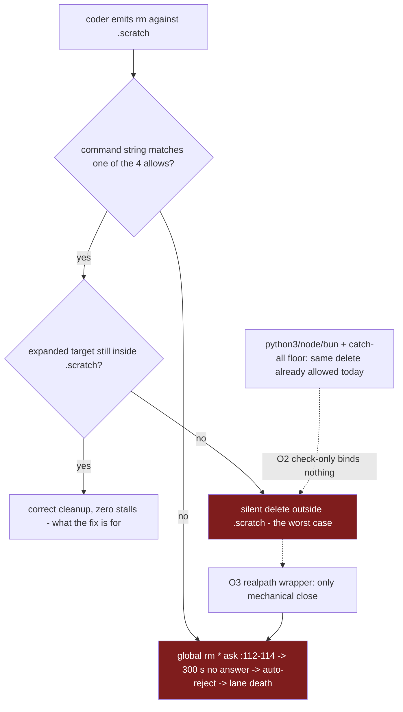

# Scratch Permission Model Safety: Are the Four Anchored Allows Enough?

<!-- ANALYZER-OUTPUT-CONTRACT
schema-version: 1.0
agent: analyzer
claim-type: recommendation
evidence-source: /workspace/.opencode/opencode.jsonc
confidence: High
shelf-registration: memory-shelf.yaml (shelf.analyses), delegated to @memory-manager
-->

Campaign ticket: DIA-260926-5vin. Ana ID: ana-260927-6bpp.
Question (policy-class, AGENTS.md sec.10 / DIA-115): is the four-rule
anchored-allow CAUSE B fix (commit f6c84a5) safe ENOUGH to rely on, or does
the project need an additional validating mechanism?

## Bottom line

The four rules are safe enough to rely on, because the coder lane's deletion
"protection" is already, and irreducibly, a convention rather than a boundary:
the global catch-all `"*": "allow"` (.opencode/opencode.jsonc:28) plus
`"python3 *"` (:355), `"node *"` (:351), `"bun *"` (:352) already let any coder
lane delete ANY path through one line of interpreter code. The anchored allows
(opencode.jsonc:404-407, mirrored :490-493) add no material attack surface on
top of that floor. A CHECK-ONLY helper (O2) adds ZERO mechanical protection.
A REAL validating wrapper (O3) is the only option that mechanically closes the
traversal hole, but it re-arms the exact stall-death bug it is meant to guard
against, so it fails its own cost model. Recommendation: keep O1, decline O2
and O3 (YAGNI), and if any spend is authorized, put it on the stall side (O4)
because asks, not deletes, are the proven killer
(.opencode/session/coder-lane-early-termination-synthesis.md:45-59).

## Method

Inversion (what would have to be true for the rules to be dangerous?) plus a
risk-floor comparison (what is the attack surface WITH the rules vs WITHOUT
them?). Applied MECE to five options; decision matrix per option; worst-case
falsification constructed and reachability-tested.

## Threat-model ground truth (why this is not a security boundary)

Established facts are used as given; these three are the load-bearing ones with
Tier-1 pointers:

1. Permission matching is against the COMMAND STRING, not the resolved path,
   and `*` crosses `/` (wildcard note .opencode/opencode.jsonc:181-185; merge +
   findLast semantics confirmed at :374-377 and
   .opencode/learnings/external-patterns/2026-09-27-permission-asks-unattended-gate.md:11-16).
   Consequence: the permission layer CANNOT express a normalized-path check.
   Any "validation" must therefore live at execution time (a wrapper), never in
   the rules themselves.
2. The floor: global `"*": "allow"` (opencode.jsonc:28) means any command that
   does not literally match an `ask`/`deny` pattern is pre-approved. For coder
   specifically, `python3 *` (:355) is allowed, so
   `python3 -c "import shutil; shutil.rmtree('/workspace/packages')"` passes the
   permission layer TODAY, with or without the four scratch rules. The audit's
   "MARGINAL" traversal verdict
   (.opencode/learnings/external-patterns/2026-09-27-cause-b-permission-ask-stall-gate.md:66-72,
   ticket UPDATE .opencode/../docs/dev-infra-audit/tickets/DIA-260926-5vin-...md:90-96)
   is consistent with this floor: the four allows grant the coder nothing it
   lacked.
3. The proven failure mode is the UNANSWERED ASK, not deletion: four-arm matrix
   (coder-lane-early-termination-synthesis.md:50-53): no-answer 300 s -> died
   (cod-8, 98-char empty envelope); human ALLOW -> survived; human REJECT ->
   survived; no-ask -> survived. Auto-reject path:
   .opencode/plugins/needs-input-observer.ts:316-323 (env-settable 300 s timer),
   :411-479 (SDK reject :436-439, audit row :452-458).

So the correct question is not "can a malicious agent escape the four rules"
(already moot at the python3 floor) but "can a CONFUSED, non-adversarial agent
emit a string that matches an allow yet deletes something valuable, and can any
option mechanically prevent that?"

## 1. Options (MECE)

- O1 Status quo: keep the four anchored allows exactly as landed (f6c84a5).
  No new mechanism. Residuals (iii) whole-dir `rm -rf .scratch` and (iv)
  worktree absolute paths still raise an ask (DIA-260927-vw0o, deferred by
  developer YAGNI, ticket :57-60).
- O2 O1 + a CHECK-ONLY helper: a script (riding `"scripts/*": "allow"` :356)
  that normalizes the candidate path, verifies it is under `.scratch/`, prints
  PASS/REFUSE, and deletes nothing. Agent may call it first; nothing forces it
  to.
- O3 Drop the four raw allows; route all scratch deletion through a PERFORMING
  wrapper that realpath-validates each argument, then rm. Zero new permission
  surface (scripts/* already allowed).
- O4 Keep the four rules; harden the STALL itself instead: shorter/env-tuned
  timer, surfaced ask (parent/orchestrator-visible), or fast auto-answer so no
  ask ever sits unanswered for 300 s. (Related upstream reframing: `--auto`
  auto-approves asks entirely, so these lanes ran unattended WITHOUT `--auto` —
  permission-asks-unattended-gate.md:33-36.)
- O5 Abort / do nothing further: accept everything, revisit only on a real
  incident.

## 2. Decision matrix

| Axis | O1 status quo | O2 + check-only helper | O3 performing wrapper | O4 stall-side hardening | O5 do nothing |
|---|---|---|---|---|---|
| Protection gained | baseline; none added | ZERO mechanical (allow path bypassable; python3 floor unchanged) | REAL: only option that normalizes before exec | none on deletion; protects lane LIFE for every ask class | none |
| Attack surface delta vs today | none (floor already admits any delete via python3 :355) | none | slightly narrower naive path; floor unchanged | none if timer/surfacing; WIDER if plugin auto-approves (fail-open moves string-match hole into plugin) | none |
| Auditability (deletion visible to permission layer?) | YES - every rm is evaluated; registry keeps the evaluated pattern (synthesis :73) | raw path still visible; helper check visible only if called | DEGRADED: layer sees only `scripts/...`; rm happens inside script - audit moves to script logs | same as O1; adds ask/reject rows visibility | YES |
| Effort | 0 (landed) | ~1 script + prompt mandate + tests | script + tests + rule deletion in 2 maps (lockstep) + mandate change across coder skill chain | env var = 0; surfacing/auto-answer = plugin edit + config gate | 0 |
| Blast radius if agent CONFUSED (not malicious) | traversal-shaped or var-expanded string silently deletes outside .scratch (low likelihood) | agent ignores helper, or calls it, gets REFUSE, then still executes raw rm anyway | agent emits raw rm out of habit -> ASK -> 300 s stall -> lane death: RE-ARMS the fixed bug | none | as O1, plus residuals (iii)/(iv) still kill unattended lanes |
| Failure mode | silent delete (edge) vs ask-stall (residuals) | identical to O1 | mostly ask-stall (regression), silent delete only if wrapper sloppy | visible fast failure replaces silent stall-death | as O1 |

## 3. The sharp logical question, answered plainly

If the four raw allows stay, does a CHECK-ONLY helper add ANY protective value?

MECHANICALLY: NO. The allow path remains directly executable — `rm -rf
/workspace/.scratch/../../x` passes the permission layer without ever invoking
the helper (string matching, opencode.jsonc:181-185 note; merge/findLast :374-377).
And even total helper compliance would not stop the same deletion via the
already-allowed `python3 -c "..."` (:355). A check that the subject can bypass
by not calling it is a linter, not a control.

PARTIAL VALUE, named exactly: (a) discoverability — one canonical cleanup
entry the prompt can point to; (b) accident reduction on the naive path IF the
agent happens to use it (a confused agent following the convention gets a
realpath check it would otherwise not run); (c) a future hook-point — if the
rules are ever tightened (flip conditions below), the same script flips
check->perform. None of these is enforcement. Say so to the developer:
O2 buys convention-tier comfort, zero assurance-tier protection.

## 4. Falsification: worst plausible command

Vector class: allow-matching string whose shell expansion escapes .scratch.

1. Variable indirection (most plausible for a confused agent):
   `for p in $(cat /workspace/.scratch/cleanup-list.txt); do rm -rf /workspace/.scratch/$p; done`
   The command string matches `"rm -rf /workspace/.scratch/*"` verbatim
   (pattern literal prefix + `*` matching `$p`). If a manifest entry contains
   `../../packages`, the shell expands to `/workspace/packages` and rm -rf
   silently destroys the source tree (container path; recoverable from git only
   for committed state).
2. One-token confusion slip (catastrophic, contrived):
   `rm -rf /workspace/.scratch/..` matches the same allow and resolves to
   `/workspace` itself.
3. Relative-anchor twin: `cd anywhere && rm -rf .scratch/../../secret` matches
   `"rm -rf .scratch/*"` (:405) relative to that cwd.

Reachability for a NON-adversarial agent: LOW but non-zero — requires unquoted
variable or `..` construction inside a path the agent already anchored on
`.scratch`. Empirically, every observed lane emitted clean literal paths
(cod-8: `rm -rf /workspace/.scratch/ordertest`, synthesis :73). Note a useful
fail-safe asymmetry [INFERENCE from the string-match premise]: the quoted form
`rm -rf "/workspace/.scratch/$p"` does NOT match the allow (quote breaks the
literal prefix), so it falls through to global `"rm *": ask` (:113) —
accidental quoting is safe; unquoted traversal is the hole.

SINGLE change that makes it unreachable: execution-time realpath validation —
i.e. O3, the performing wrapper. No permission-string rule, present or future,
can express path normalization (ground-truth 1 above). Full honesty though:
O3 closes the NAIVE path only; the python3 floor remains, so it removes a
low-probability accident class while reintroducing the proven fatal failure
mode (raw rm -> ask -> 300 s stall -> death) for every lane that forgets the
mandate. That is a bad trade against an unobserved incident.

## 5. Option trade-offs (compact view)

## 6. Verdict and recommendation

RECOMMENDED: O1 (keep the four anchored allows as-is). Because the four rules
add no attack surface over the pre-existing catch-all + interpreter floor, the
traversal edge is a marginal accident-class below the floor the project already
accepts, the independent audit rated f6c84a5 SOUND-with-conditions with those
conditions enacted (DIA-260926-5vin ticket :90-96), and every candidate
validation mechanism either enforces nothing (O2) or reintroduces the proven
lane-killer (O3). DECLINE O2 unless the developer wants the convention anyway —
then build it explicitly as a linter, documented as non-binding.
IF/WHEN any spend is authorized, direct it at O4 (stall-side) — the asks are
the killer; residuals (iii) whole-dir and (iv) worktree (DIA-260927-vw0o) are
still live stall-death sources for unattended runs and are better addressed
evidence-first: capture the real emitted form, then extend the anchored set or
adopt `--auto`-style handling.

RECOMMENDATION FLIPS when:
1. The floor rises: `python3 *` / `node *` / `bun *` or the global `"*"` catch-all
   (:28, :351-355) are tightened to ask/deny. Then the rm string-match hole
   becomes the ONLY remaining naive deletion path and O3 (wrapper with realpath
   checks) becomes the right call.
2. A registry row shows a real traversal-shaped or var-expanded scratch rm
   (evidence of an accident-class the audit judged "marginal" occurring).
3. Overnight/unattended lanes run without `--auto` and hit residuals (iii)/(iv)
   repeatedly — flips priority decisively to O4 / anchored-rule extension.
4. Scratch content ever becomes lane-private (residual ii: no ownership
   semantics). Cross-lane deletion is not a traversal problem but an ownership
   one; a permission string cannot express either, so that future need also
   routes to a wrapper (O3 re-enters by a different door).

## 7. Evidence register

- Tier-1: /workspace/.opencode/opencode.jsonc (:26, :28, :112-116, :181-185,
  :351-356, :374-377, :404-407, :490-493) — rules, floor, wildcard + merge notes.
- Tier-1: /workspace/.opencode/plugins/needs-input-observer.ts:316-323,
  :411-479, :436-439, :452-458 — timer + auto-reject + audit row.
- Tier-1: /workspace/.opencode/session/coder-lane-early-termination-synthesis.md:45-59, :73 — CAUSE B matrix + cod-8 command.
- Tier-1: /workspace/.opencode/learnings/external-patterns/2026-09-27-cause-b-permission-ask-stall-gate.md:46-64, :66-72, :110-119 — candidates + audit + outcome.
- Tier-1: /workspace/.opencode/learnings/external-patterns/2026-09-27-permission-asks-unattended-gate.md:11-24, :33-41 — merge/findLast, --auto reframe, plugin timer ownership.
- Tier-1: /workspace/docs/dev-infra-audit/tickets/DIA-260926-5vin-*.md:79-101 and DIA-260927-vw0o-*.md:41-60 — accepted outcome, deferred residual.
- Tier-2: https://opencode.ai/docs/permissions/ (fetched 2026-09-27 per both gate files).
- [INFERENCE] items: quoted-form fail-safe asymmetry; wrapper-log auditability
  shift in O3; confused-agent probability judgments on traversal emission.
