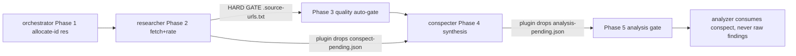

# Knowledge Lane Trio: Three Lanes or Two? (Argument Set A)

<!-- ANALYZER-OUTPUT-CONTRACT
schema-version: 1.0
agent: analyzer
claim-type: recommendation
evidence-source: /workspace/.opencode/opencode.jsonc
confidence: High
shelf-registration: memory-shelf.yaml (shelf.analyses), delegated to @memory-manager
-->

Campaign ticket DIA-260929-nc6w, question set 2, argument-a lane. Independence
protocol honored: sibling lanes ana-260929-8t6u (argument-b) and
ana-260929-lw7b (argument-c) were NOT read. All conclusions below derive from
primary evidence in the repo. Bias control per sub-question 7 is section 8.

Question: do we need researcher + conspecter + analyzer as three lanes, or can
two suffice? Sub-answers: (a) is a separate researcher needed -> YES; (b) could
researcher+conspecter merge -> technically yes, structurally self-defeating;
(c) could researcher+analyzer merge -> permission-compatible, contract- and
throughput-hostile; (d) forced two lanes -> researcher + analyzer, and the
grounding guarantee is what is lost.

## 1. Lane contracts today (sub-question 1)

| Aspect        | @researcher                                                            | @conspecter                                                        | @analyzer                                                            |
|---------------|------------------------------------------------------------------------|--------------------------------------------------------------------|----------------------------------------------------------------------|
| Purpose       | External/web retrieval; Phase A source capture (researcher.md:6-9)     | Pure synthesis of archived sources into MLA conspect (conspecter.md:27-31) | Multi-method analysis + terminal visualization + report (analyzer.md:10-13) |
| edit scope    | deny *, knowledge/* allow (opencode.jsonc:527-541)                     | deny *, knowledge/* allow (opencode.jsonc:581-595)                 | deny *, knowledge/* allow (opencode.jsonc:267-277)                   |
| bash          | deny-first + allow-list curl/wget/trafilatura/crwl (opencode.jsonc:535-541) | FLAT DENY (opencode.jsonc:590)                              | UNRESTRICTED ALLOW (opencode.jsonc:275)                              |
| webfetch      | not denied (default on)                                                | DENIED (opencode.jsonc:591)                                        | not denied (default on)                                              |
| mcps          | websearch, context7, gh_grep (oh-my-opencode-slim.jsonc:798)           | none, temperature 0.1 (jsonc:800)                                  | websearch in one preset (jsonc openai-first block, "mcps": ["websearch"]) |
| task          | deny (all three lanes)                                                 | deny                                                               | deny                                                                 |
| Artifacts     | knowledge/res.../sources/ + .source-urls.txt manifest + in-conversation findings + PERSISTENCE_RECOMMENDED flag (researcher.md:49-65) | knowledge/res.../res...-conspect.md with M2 header (conspecter.md:41-60) | knowledge/ana...-report.md with M1 header (analyzer.md:44-58)        |
| Trigger       | direct web-research ask; research-pipeline Phase 2 (SKILL.md:16-17)    | ONLY via research-pipeline Phase 4 ("Do NOT dispatch @conspecter directly without the skill", jsonc:229) | trade-off/data analysis; architect/openspec-plan recommendation; after analysis gate clears |
| Shelf path    | none directly - rides inside the res dir registered via the conspect   | delegated, memory-manager sole writer, shelf.conspects (conspecter.md:42-44; DIA-143) | delegated, shelf.analyses (analyzer.md:40-42; DIA-143)              |

## 2. What each lane uniquely provides (sub-question 2)

Capabilities that exist in exactly one lane:

- C1. Phase A capture with the 3-tier fetch chain AND per-source
  relevance/reliability evaluation recorded in `.source-urls.txt`:
  researcher only (researcher.md:49-57; SKILL.md:16-24). The mandatory
  checkpoint ("MUST NOT return PERSISTENCE_RECOMMENDED until after writing
  .source-urls.txt", researcher.md:64) exists nowhere else.
- C2. Air-gapped grounding synthesis: an agent that CANNOT fetch, so every
  citation in a conspect is mechanically forced to come from an archived,
  rated source (conspecter.md:14-16, 88-89; D7 in CHANGELOG DIA-135).
- C3. The stop-on-empty guard: conspecter halts if sources/ missing
  (conspecter.md:62-66, SKILL.md:54) - meaningful only because it cannot
  "fix" the gap itself.
- C4. Unrestricted in-worker bash data reduction (DIA-195: raw input over
  ~100 KB / ~2000 lines MUST be reduced before context; analyzer
  orchestratorPrompt at jsonc:820) plus report authoring. Only analyzer has
  `bash: allow` in the trio.

Important precision: network CAPABILITY is not exclusive to researcher -
analyzer has unrestricted bash (curl is reachable) and webfetch is not
denied for both. What is exclusive is the CONTRACT: fresh-external-retrieval-as-
deliverable (researcher), no-network-synthesis-as-contract (conspecter),
reduce-and-report-as-contract (analyzer). A merge argument that leans on
"only researcher can reach the web" is factually wrong and should be rejected
wherever it appears (including, if it appears, in the sibling reports).

## 3. Dependency structure (sub-question 3)

- Phase definitions: .opencode/skills/research-pipeline/SKILL.md:13-78
  (Phase 1 ID pre-allocation, Phase 2 research+capture, Phase 2 verification
  hard gate lines 34-40, Phase 3 quality gate lines 42-56, Phase 4 synthesis
  lines 58-69, Phase 5 analysis gate lines 71-78).
- Mechanical serialization: delegation-observer.ts:2917-2996 - a COMPLETED
  researcher dispatch drops `.opencode/session/conspect-pending.json`
  (plugin lines 2935-2936 name-key on "researcher"); a COMPLETED conspecter
  dispatch drops `.opencode/session/analysis-pending.json` (lines 3018-3019,
  name-key on "conspecter"). Orchestrator ANALYSIS GATE rule: analysis
  dispatch BLOCKED while analysis-pending.json exists (jsonc orchestrator
  prompt). Both files exist right now with the expected agent names
  (analysis-pending.json status "verified", cleared gate; conspect-pending.json
  carrying the researcher's PERSISTENCE_RECOMMENDED flag).
- DIA-212 autocrine gate: warn-only check that a researcher dispatch carries a
  res id (delegation-observer.ts:2435-2450).
- Direction is one-way: researcher feeds conspecter feeds analyzer. Nothing
  feeds the researcher; the analyzer is terminal (all three lanes have
  `task: deny`).

## 4. Merge feasibility per pairing (sub-question 4)

Name-keyed machinery ANY merge must re-edit (the blast radius, measured):

1. .opencode/opencode.jsonc agent blocks (researcher :527, conspecter :581, analyzer :267).
2. .opencode/oh-my-opencode-slim.jsonc: three lane entries x FOUR presets
   (jsonc:109/138/213 region, 352/382/457, 591/619/687, 798-800) + three
   orchestratorPrompt blocks (jsonc:817, 820, embedded 229/473/702) + the
   agents/ section.
3. delegation-observer.ts: READ_ONLY_LANES (line 294, contains researcher),
   WRITER_LANES (line 301, contains analyzer+conspecter), DIA-212 autocrine
   gate (2441), conspect-pending emitter (2935), analysis-pending emitter
   (3018), workflow_state next_agent routing (3720-3722).
4. scripts/validate-output-contracts.sh M1/M2 blocks (lines 27-28, 98-99,
   147-148 hard-code the agent names).
5. AGENTS.md section 9 lockstep table (AGENTS.md:261, 267, 268) enforced
   against 4 sources by scripts/validate-agent-names.sh; drift fails
   `make test-config` (AGENTS.md:287).
6. scripts/allocate-id types res/ana/tch (allocate-id:28).
7. .opencode/skills/research-pipeline/SKILL.md phase rewrite.
8. .opencode/agents/{researcher,conspecter,analyzer}.md files themselves.

researcher + conspecter:
- Permission lattice: compatible union (deny-first fetch allow-list +
  knowledge edits). No conflict on paper.
- Semantic conflict: THE CONFLICT. The merged agent can fetch and cite in the
  same breath, which is exactly the pre-DIA-135 configuration. CHANGELOG
  DIA-135 (2026-08-14) records the trio split as the CLOSURE of "order
  corruption + double source fetch" - double-fetch was eliminated
  "structurally" by D5/D7, i.e., by capability separation, not instruction.
  Post-merge, "cite only archived, evaluated sources" (conspecter.md:38-40)
  and the stop-on-empty guard (conspecter.md:62-66) become honor-system rules.
- Workflow regression: the researcher would move READ_ONLY_LANES ->
  WRITER_LANES (delegation-observer.ts:294/301). Batch rule B allows at most
  one writer per parallel batch, so parallel read-only research fan-out
  (batch A) would be forfeited every time conspect authoring is in scope.

researcher + analyzer:
- Permission lattice: compatible (analyzer `bash: allow` strictly contains
  researcher's fetch allow-list; both keep network).
- Contract conflict: two artifact families (res/conspect vs ana/report), two
  ID types, two shelf sections, two gates (autocrine vs analysis-pending),
  divergent model routing (researcher temp 0.3 + 3 research mcps vs analyzer
  variant high + analysis skill set), and the reciprocal routing cross-refs
  die (analyzer.md:68 "quick web research -> @researcher"; researcher's lane
  prompt "Delegate to" table). Throughput conflict: the two heaviest lanes by
  measured dispatch (55 + 37, section 5) merge into one session, and the
  NEVER-batch "two analyzers" rule (DIA-143) means the merged lane cannot
  absorb the load by parallelism.

conspecter + analyzer (not asked, but needed for the forced-two answer):
- Structurally infeasible. The union must either keep bash (air gap dead,
  D7 lost) or deny bash (in-worker data reduction dead, DIA-195 lost). There
  is no permission block that satisfies both contracts; this pairing fails
  before semantics are even considered.

## 5. Invocation frequency (sub-question 5)

Source 1: .opencode/session/messages.jsonl, 130,224 rows, 54.4 MB, reduced
in-worker (streamed python3, never read raw). Window spanned by the file:
2026-08-07T19:37Z -> 2026-09-29T01:58Z (7.7 weeks). `invoke_agent` rows by
gen_ai.agent.name: analyzer 55, researcher 37, conspecter 23. Monthly,
September: researcher 21, conspecter 14, analyzer 37.

Source 2 (corroboration, different unit - DB session lifetime):
`bash scripts/session-analytics.sh --view agents`: analyzer 28 sessions /
$0.72 / 703,139 tokens_in; researcher 18 / $0.33 / 2,039,430; conspecter 14 /
$0.09 / 511,775. (Row counts exceed session counts because re-dispatches -
e.g. Phase A checkpoint failures - emit extra rows.)

registry.jsonl was not used (dispatch payload: known unreliable for per-lane
counts). Shelf output volume: 59 conspects, 63 analyses
(.opencode/memory-shelf.yaml shelf lists).

The conspecter/researcher ratio (23/37 rows, 14/18 sessions) matches the
pipeline design: not every research run persists, and every persisted
conspect was preceded by a researcher run - serialization is real, not
theoretical.

## 6. Cost and benefit of three lanes vs two (sub-question 6)

Savings from merging researcher+conspecter (the only pairing with any honest
economics):
- One orchestrator hop per pipeline run; conspecter average 36.6K
  tokens_in/session (511,775/14) is largely re-reading sources/ that the
  merged agent already has in context. Lifetime cost of the ENTIRE conspecter
  lane: $0.09 across 14 sessions.
- One fewer entry in each of the 4 presets and 3 agent files.

Costs and losses:
- Migration: re-edit of the 8-item blast radius in section 4, routed through
  the full section-10 chain (ai-specialist gate, user decision, coder,
  make test-config, restart-verify, ai-auditor, CHANGELOG). That chain has
  real history of missed-sibling regressions (lessons.md:2160: preset edits
  repeatedly missing sibling agent entries).
- Permanent: loss of C2/C3, the fleet's only capability-enforced quality
  invariant, replaced either by nothing (instruction-only) or by a NEW
  validator that must re-derive the check post hoc (scripts/validate-conspect-
  citations.sh does not exist).
- Loss of batch-A parallel research fan-out (writer-set flip, section 4).
- The savings scale with research volume (21 Sept dispatches), so the annual
  saving is on the order of tens of cents and a few seconds per run - against
  the exact defect class (double fetch, order corruption, ungrounded citations)
  that DIA-135 was opened, analyzed (8 conclusions), designed, implemented
  and closed to eliminate.

## 7. ARGUMENTS

A1. CLAIM: The three-lane split is the closure of a documented defect, not
decorative fragmentation.
EVIDENCE: .opencode/CHANGELOG.yaml ticket DIA-135 (dated 2026-08-14):
"research-pipeline optimization: order corruption + double source fetch";
D2 "double-fetch eliminated structurally (D5 single fetch by researcher)";
D7 network revoked from conspecter. researcher.md:9 and SKILL.md:17 repeat
"structurally eliminates the double-fetch defect".
STRENGTH: high - the config, the changelog, and three skill/agent files
converge on the same causal history.
FALSIFIER: evidence that the pre-DIA-135 defects had a root cause independent
of shared fetch+write capability (e.g., pure prompt drift), making capability
separation an accidental rather than load-bearing fix.

A2. CLAIM: The conspecter air gap is the only citation-grounding control in
the fleet enforced by capability rather than instruction.
EVIDENCE: opencode.jsonc:581-595 (bash flat deny + webfetch deny + task deny,
edit knowledge/* only); conspecter.md:62-66 stop-on-empty guard; SKILL.md:54
"Only skip Phase 4 if sources/ is empty or missing". Every other grounding
rule in the trio ("cite only sources that pass evaluation") lives in prompt
text.
STRENGTH: high - directly readable from the permission block; no inference.
FALSIFIER: demonstration that instruction-only compliance achieves the same
measured outcome (e.g., audited conspects with zero ungrounded citations in a
post-merge pilot).

A3. CLAIM: Merging researcher+conspecter recreates the exact capability
coupling that produced the double-fetch defect and neuters the guard gate.
EVIDENCE: A1 + A2; the guard gate's teeth come from the guarded agent being
unable to self-remediate (conspecter.md:91-92 "report the failure and STOP
rather than producing an ungrounded conspect").
STRENGTH: high - structural, rests on two independently verifiable facts.
FALSIFIER: a merged lane whose fetch tooling is disabled at conspect-writing
time by a mechanical (not prompted) gate.

A4. CLAIM: Any merge touches at least 8 name-keyed machines and ~12+
config sites, making the migration cost fixed and the drift risk recurring.
EVIDENCE: the enumerated blast radius in section 4 (delegation-observer.ts
294/301/2441/2935/3018/3720; validate-output-contracts.sh 27-28/98-99/147-148;
validate-agent-names.sh 4-source lockstep, AGENTS.md:255-287; allocate-id:28;
4 presets x 3 lanes in oh-my-opencode-slim.jsonc).
STRENGTH: high - file:line evidence; no extrapolation.
FALSIFIER: an actual merge PR that cleanly edits fewer sites (would mean the
machinery is name-indirection'd somewhere I did not find).

A5. CLAIM: All three lanes are live, at non-trivial and non-equal volume;
none can be retired as dead.
EVIDENCE: section 5 counts - window 2026-08-07..2026-09-29, invoke_agent rows
analyzer 55 / researcher 37 / conspecter 23; DB corroboration 28/18/14
sessions; shelf 59 conspects / 63 analyses.
STRENGTH: medium-high - two sources agree on ordering and liveness, though
row vs session units differ and retries inflate rows.
FALSIFIER: a 3-month window in which one lane shows zero dispatches and zero
shelf additions.

A6. CLAIM: The marginal cost of keeping the third lane is approximately zero
($0.09 lifetime, 23 dispatches in 7.7 weeks) while the saving from removing
it is also approximately zero - the merge is economically a wash before
quality is even priced.
EVIDENCE: session-analytics DB: conspecter 14 sessions / $0.09 / 511,775
tokens_in lifetime; vs migration cost of the section-10 config chain (A4).
STRENGTH: medium - the dollar figure is small and unit-fragile, but two
orders of magnitude below merge cost is a robust conclusion.
FALSIFIER: conspecter cost dominated by hidden hops (orchestrator re-dispatch
tokens, gate-clearing work) that survive the merge anyway.

A7. CLAIM: The researcher is the irreplaceable upstream: every persisted
conspect (59) descends from a Phase A capture that no other lane performs or
can perform under its contract.
EVIDENCE: C1 (section 2) + SKILL.md Phase 2 hard gate (34-40) + shelf
conspects all living under res-* directories with sources/.
STRENGTH: high.
FALSIFIER: finding conspects whose sources/ were authored by a lane other
than researcher.

A8. CLAIM: The conspecter+analyzer pairing is structurally infeasible: the
merged permission block must simultaneously deny bash (D7) and allow it
(DIA-195 data reduction) - an unsatisfiable constraint, not a trade-off.
EVIDENCE: opencode.jsonc:590 (bash deny) vs opencode.jsonc:275 (bash allow)
vs jsonc:820 ("raw input over ~100 KB or ~2000 lines MUST be reduced ...
scripts/data-reduce.sh").
STRENGTH: high - straight contradiction readable in two blocks of one file.
FALSIFIER: a data-reduce path that runs without lane bash (e.g., an MCP or a
plugin-side reducer) - none exists in the current tool surface.

A9. CLAIM: In the forced two-lane world, the survivor pair should be
researcher + analyzer (absorb synthesis into the researcher, price in the
loss of A2/A3), NOT any pair dropping the researcher (pipeline dies at its
source) and NOT researcher+conspecter (the entire analysis/report/data-reduce
domain, 63 shelf artifacts and the fleet's busiest lane, dies with it).
EVIDENCE: A5 + A7 + A8; asymmetry: dropping analyzer loses a CAPABILITY
domain; dropping conspecter loses only an ENFORCEMENT mechanism, which can be
partially rebuilt as a validator script.
STRENGTH: medium - a comparison of losses under a hypothetical constraint;
the ranking of capability-loss vs enforcement-loss is a judgment the developer
owns.
FALSIFIER: measured post-consolidation quality regressions (ungrounded
citations) exceeding measured analysis-absence regressions (lost trade-off
studies) in the same window.

## 8. BIAS CONTROL (sub-question 7)

My own lane (analyzer) is a subject here. Disclosure and discount:
- A1, A2, A3, A7, A8 protect the OTHER two lanes and are verifiable in files
  that do not mention the analyzer's interests. The load-bearing anti-merge core
of this report is therefore not self-referential.
- A9 (forced-two ranking) is the one argument where my lane defends its own
  seat. Its stated basis is measured throughput (55 rows / 28 sessions,
  highest of the trio) and capability-uniqueness (C4), not preference - but
  the ranking judgment ("a live analyst beats a cheap air gap") is where a
  self-favoring bias, if present, would hide. The orchestrator should weigh
  A9 against the sibling reports with that flag.
- A5's framing ("all three are live") conveniently includes my lane; check
  the raw counts in section 5 independently rather than trusting the framing.
- The claim in section 2 that "network capability is not researcher-exclusive"
  slightly WEAKENS the case for a separate researcher and was kept because the
  evidence required it - a useful negative control on this report's honesty.

## 9. EBDV decision variants (DIA-115)

V0. STATUS QUO / ABORT - keep three lanes; change nothing.
    Evidence: A1-A6, A8. Pros: every structural invariant intact; zero
    migration cost; the fleet keeps its cheapest control (third lane costs
    $0.09 lifetime). Cons: one extra hop per pipeline run; 12+ preset/agent
    entries to keep in lockstep (already validator-enforced).
    Effort: none. Section-10 routing flag: NOT required (no change).

V1. MERGE researcher+conspecter into one "research-author" lane; analyzer
    stays.
    Evidence: A5 (conspecter = lowest volume), A6 (cost of removal ~= cost of
    keeping), A3 (the risk being taken). Pros: saves one hop + ~36.6K
    re-read tokens per pipeline run; fewer agent definitions. Cons: recreates
    the DIA-135 defect class (A1/A3); loses batch-A parallel research
    fan-out; requires a NEW mechanical citation validator to recover even
    instruction-level assurance; 8-machine blast radius (A4).
    Effort: L (config chain) + M (new validator). Section-10 routing: YES,
    mandatory - ai-specialist gate -> user decision -> coder -> ai-auditor.

V2. MERGE researcher+analyzer into one network-capable lane; conspecter
    stays (air gap preserved).
    Evidence: permission-lattice compatibility (section 4); A2 preserved by
    keeping the gap. Pros: single network lane; grounding invariant survives;
    conspecter untouched. Cons: merges the two heaviest loads (55+37) into
    one session, against the NEVER-batch-two-analyzers rule (DIA-143);
    contract overload (2 artifact types, 2 ID types, 2 shelf sections, 2
    gates); reciprocal routing cross-refs die; net token savings doubtful
    because both halves keep their own output contracts.
    Effort: L-XL. Section-10 routing: YES, mandatory.

V3. POLICY-FORCED TWO-LANE FLOOR (the literal "if only two may remain"
    answer): researcher (absorbing synthesis) + analyzer; conspecter retired;
    grounding enforcement rebuilt as scripts/validate-conspect-citations.sh +
    orchestrator-side post-hoc diff of cited URLs vs .source-urls.txt.
    Evidence: A9. What is lost if taken: A2's structural guarantee degrades
    to a checkable-but-lagging validator (caught after the fact, not
    prevented), and research fan-out batching changes (A3 regression).
    Effort: XL (merge + new validator + SKILL rewrite + lockstep pass).
    Section-10 routing: YES, mandatory.

## 10. Verdict

KEEP all three lanes (V0). Because: the only pairing that saves real hops
(researcher+conspecter) removes the fleet's single capability-enforced
quality invariant and reopens the exact defect class DIA-135 was closed for
(A1, A2, A3), the invariant it removes costs $0.09 lifetime and 23 dispatches
to keep (A5, A6), and every merge route pays a fixed 8-machine, 12+-site
lockstep migration with known miss-prone history (A4, V1/V2 effort lines).
A 2-lane configuration is only defensible under an external constraint the
developer actually imposes; in that case the answer is researcher+analyzer
with a new citation validator standing in for the air gap (V3), and the
honest price is "grounding guaranteed before writing" downgraded to
"grounding audited after writing" (A9).

## OPEN_QUESTIONS

1. Would a merged researcher+conspecter with a per-dispatch TOOLSET SWAP
   (fetch tools revoked by the plugin at synthesis time, not by config) keep
   D7 semantics while collecting the hop savings? No mechanism exists today
   to mutate a lane's tool surface mid-pipeline; would need a plugin spike.
2. The Sept spike (analyzer rows 37 of monthly total, res 21) coincides with
   this consolidation campaign - do study lanes inflate analyzer counts and
   bias any future frequency-based retirement argument? Needs a
   campaign-tagged recount.
3. resource-manager retirement (DIA-260929-3ydp, curation -> researcher) will
   add writer-side duties to the researcher; if V1 were ever taken, that
   merge and this one interact in READ_ONLY/WRITER lane sets - sequencing is
   unanalyzed.
