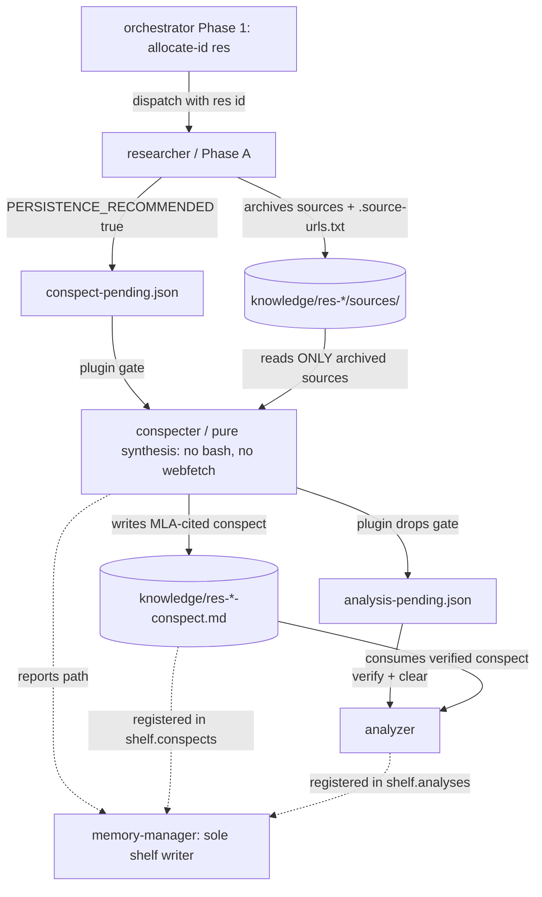

# ana-261006-58y2-researcher-conspecter-split - Do we need BOTH @researcher and @conspecter?

<!-- ANALYZER-OUTPUT-CONTRACT
schema-version: 1.0
agent: analyzer
claim-type: recommendation
evidence-source: .opencode/opencode.jsonc, .opencode/agents/researcher.md, .opencode/agents/conspecter.md, .opencode/plugins/delegation-observer.ts, .opencode/session/messages.jsonl
confidence: High
shelf-registration: memory-shelf.yaml (shelf.analyses), delegated to @memory-manager
-->

Campaign ticket DIA-260929-nc6w (agent-role consolidation study), Analysis B of 2.
Standalone analysis explicitly requested by the developer. Advisory output only;
the developer decides. No config or code was edited.

Independence note: this lane is independent of Analysis A. Prior role-consolidation
analyses under knowledge/ana-* were read ONLY as background and are reconciled
explicitly in section 7; no conclusion here is borrowed without its own primary
evidence. ASCII-only per DIA-079.

Data reduction (DIA-195): messages.jsonl is 54,592,924 bytes / 130,634 lines and
registry.jsonl is 864,399 bytes - both over threshold. They were reduced with jq
aggregation in a worker process; no raw log line entered context. registry.jsonl
carries no per-lane agent name on normal rows (only 1 literal "conspecter" string;
0 structured agent fields), so it is unusable for per-lane counts and is reported
only as a negative result.

---

## 0. Executive answer

**Keep both lanes. Do not merge @researcher and @conspecter, and do not move the
synthesis phase into @memory-manager or @analyzer.**

The split is real but NOT for the reason most often assumed. The DIA-135
"single-fetch ownership eliminates double-fetch" rationale does **not** require two
lanes - a single lane that fetches once and then synthesizes from its own local
`sources/` also eliminates double-fetch. The load-bearing reason is **capability
isolation around untrusted web text**: @conspecter is the only agent in the whole
config table that can write `knowledge/*` yet cannot reach the network or run shell
at all (`bash: deny`, `webfetch: deny`, `mcps: []`). That is the fleet's only
capability-enforced Archive-Before-Claim (citation-grounding) control and its only
prompt-injection air gap between scraped source bytes and network-exec capability.

Measured cost of keeping it: 23 dispatches and ~$0.09 (per session-analytics, prior
trio reports) over the whole recorded life of the lane; ~3/week. Measured cost of
merging: a section-10 migration across ~8 live enforcing surfaces plus re-keying a
name-hard-coded output-contract validator, in exchange for at most one saved
orchestrator hop per persisted research run - and, in every merge direction, the
dissolution of the air gap. The economics are a wash before quality is priced, and
the prior independent analyses (three trio reports + the conspecter/memory-manager
merge report) reached the same keep-separate verdict.

---

## 1. Division of labor: what each lane actually does

Ground truth = the permission blocks in `.opencode/opencode.jsonc`; the agent prompts
are intent and are checked against the config.

| Dimension | @researcher | @conspecter |
|---|---|---|
| Config block | opencode.jsonc:527-545 | opencode.jsonc:573-594 |
| edit | `*: deny`, `knowledge/*: allow`, `.opencode/oh-my-opencode-slim/knowledge/*: allow` | `*: deny`, `knowledge/*: allow` |
| bash | deny-first allow-list: `curl *`, `wget *`, `trafilatura *`, `crwl *` | FLAT `deny` |
| webfetch | not denied (default) | `deny` |
| task | `deny` | `deny` |
| MCPs | websearch, context7, gh_grep | none |
| temp | 0.3 (DIA-135 R2) | 0.1 (DIA-135 C3) |
| Phase | Phase A source capture: 3-tier fetch chain into `sources/`, D6 per-source relevance/reliability ratings in `.source-urls.txt`; returns findings + `PERSISTENCE_RECOMMENDED` | Pure synthesis: reads ONLY archived `sources/`, writes the MLA-cited conspect, reports path; no fetch |
| Artifact | `sources/*` + `sources/.source-urls.txt` (researcher.md:52-68) | `<id>-conspect.md` with M2 header (conspecter.md:33-60) |
| Shelf | none directly | delegated to @memory-manager (conspecter.md:42-44; DIA-143) |

### 1.1 Is the split load-bearing? Two candidate justifications, one survives

**(a) Double-fetch elimination - does NOT require two lanes.** `researcher.md:9` and
`research-pipeline/SKILL.md:17` both claim single-fetch ownership "structurally
eliminates the double-fetch defect". This is true of the D5 change (researcher owns
fetch) but is a property of **single-fetch ownership**, not of **two lanes**. A
merged researcher-that-also-writes-conspects fetches every URL once and then reads
its own local `sources/`; the pre-DIA-135 defect (a second trafilatura pass by a
separate conspecter) cannot recur. The sibling argument-C report already made this
honest counter (ana-260929-lw7b "A4 counter"), and I confirm it: **double-fetch is
not a reason to keep two lanes.**

**(b) Network-capable capture vs network-isolated synthesis - this DOES require a
separate synthesis lane.** The isolation buys three things the config makes
mechanical, not aspirational:

1. **Injection air gap.** @conspecter ingests bytes scraped from the public web.
   It has no shell and no network; a poisoned source can at worst cause one more
   artifact under `knowledge/`. If the lane that reads untrusted web text also held
   `curl/wget/crwl` bash (which @researcher does), injected instructions in scraped
   text gain an outbound network channel (SSRF/exfil) in the same instance. The
   project already tracks this threat class (`knowledge/ana001-prompt-injection-plugin-trust`).
   The researcher additionally now edits `.opencode/oh-my-opencode-slim/knowledge/*`
   (config-adjacent, absorbed from the retired curation lane per DIA-260929-3ydp),
   widening the blast radius further. This is [INFERENCE] on the merged-lane exploit
   path itself, but the capability union is ground truth in the config, not inference.
2. **Citation discipline enforced by capability.** "Cite ONLY sources that pass the
   researcher's evaluation" (conspecter.md:38-40) is backed by the fact that the
   conspecter **cannot** fetch a source it forgot to archive, and cannot "fix" a
   missing source by fetching (the stop-on-empty guard, conspecter.md:62-66,
   SKILL.md:54). Every other grounding rule in the fleet is prompt text.
3. **Independent retry / failure isolation.** The researcher can be re-dispatched
   on a fetch failure without re-running synthesis; the two failure domains are
   separate lanes with separate circuit-breaker EMA keys
   (`.opencode/session/adaptive-routing-state.json`).

The permission combination "writes knowledge/, cannot reach network, no shell" is
**unique to @conspecter in the entire agent table** (verified against
opencode.jsonc: all other knowledge writers - researcher, analyzer, memory-manager -
reach either the network or shell). That uniqueness is the capability owned by the
conspecter lane.

---

## 2. Value of the conspect artifact

What a conspect provides that raw `sources/` or a @memory-manager entry does NOT:

| Property | Raw sources/ | Conspect | @memory-manager entry |
|---|---|---|---|
| Condensed answer-oriented synthesis | no (unread pages) | yes | no (repo facts/lessons only) |
| MLA citations, claim-to-source tracing | no | yes | no |
| Source-evaluation gate (only rated sources cited; excluded listed with reason) | manifest only | enforced in body | no |
| Reproducibility (conspect + archived bytes + rated manifest co-located) | manifest alone | yes, whole `res-<id>-<topic>/` unit | no |
| Mechanical output contract | no | M2 header, validated by `scripts/validate-output-contracts.sh:129-171` | no |
| Durable shelf index | no | `shelf.conspects`, 59 entries | `shelf.analyses`/memory files, different section |

A `@memory-manager` knowledge entry persists **irrecoverable internal knowledge**
(ADRs, lessons, repo facts, loop failures, memory-manager.md) and is the shelf
**registrar**. It does not do source-grounded external synthesis and never reads
archived web bytes. So the conspect artifact and the conspecter's synthesis
capability are not redundant with memory-manager.

Precision: the artifact *type* (conspect) is not the exclusive property - any
knowledge-writing lane could in principle emit a Markdown file. What is exclusive is
the **air-gapped authorship capability** (section 1.1b) plus the M2 validator target
that hard-codes `agent: conspecter`.

---

## 3. Pipeline coupling: how many rules encode the handoff and the conspect-pending gate

Live enforcing surfaces (not prose mentions), with reference counts measured by grep
(literal-name matches per file):

| Surface | File:line | What it encodes | name refs (researcher/conspect) |
|---|---|---|---|
| Config blocks | opencode.jsonc:527-545, :573-594 | permissions + tool surface | 5 / 8 |
| OMO presets + prompts | oh-my-opencode-slim.jsonc:134-142, :198-215, :327-329 (x4 presets) | model/variant/temp + orchestratorPrompt | 12 / 10 |
| Plugin lane sets | delegation-observer.ts:294 (`researcher` in READ_ONLY_LANES), :301 (`conspecter` in WRITER_LANES) | batch safety | 14 / 15 |
| Autocrine gate | delegation-observer.ts:2435-2453 | researcher dispatch without res ID -> warn (DIA-212) | - |
| conspect-pending emitter | delegation-observer.ts:2917-2999 | completed researcher + PERSISTENCE_RECOMMENDED -> `conspect-pending.json` | - |
| analysis-pending emitter | delegation-observer.ts:3002-3051 | completed conspecter -> `analysis-pending.json` (DIA-260819-qibv) | - |
| ACTION_MAP routing | delegation-observer.ts:3719-3722 | `research` -> next_agent `researcher` | - |
| Orchestrator rules | orchestrator_append.md:49-59, :61-83, :186-188, :304, :398 | Research Dispatch Pre-Gate, Research Conspect Gate, batch sets, A6.2 serialization, bash-deny list | 15 / 10 |
| Pipeline skill | research-pipeline/SKILL.md (99 lines, Phases 1-5) | the whole pipeline contract | 16 / 20 |
| M2 validator | validate-output-contracts.sh:129-171 | hard-codes `agent: conspecter`, shelf.conspects | 0 / 18 |
| Gate clearing | scripts/pending-gate-clear:5-26, :83-116 | verifies sources/ + named conspect + shelf.conspects before clearing | - |
| ID allocation | scripts/allocate-id (`res` type) | Phase 1 pre-allocation | - |
| Tier table | practice-protected.md section 7 | artifact-producer classification | 1 / 1 |
| Name lockstep | AGENTS.md:267-268 + validate-agent-names.sh S1-S4 | drift fails `make test-config` | 1 / 1 |
| Shelf data | memory-shelf.yaml `shelf.conspects` | 59 registered conspects | 21 / 134 |

**Count:** ~8 live enforcing surfaces; the researcher->conspecter handoff is encoded
by **5 distinct rule blocks** in orchestrator_append.md (DIA-212 pre-gate, Research
Conspect Gate, A1 batch sets, A6.2 serialization, bash-deny lane list), **2
name-keyed plugin emitters** (conspect-pending, analysis-pending) plus **1 autocrine
gate** and **1 ACTION_MAP entry**, and **5 phases** in the pipeline skill. The
conspect-pending gate alone is enforced by 3 independent mechanisms: the plugin
file-drop (delegation-observer.ts:2917-2999), the orchestrator HARD GATE rule
(orchestrator_append.md:61-83), and the clear-time artifact verifier
(scripts/pending-gate-clear:83-116).

The gate machinery has a documented defect history - it was hardened by DIA-057,
DIA-058, DIA-212, DIA-232, DIA-260819-qibv, DIA-260928-f3c4. Any merge must re-edit
all of it in lockstep; the missed-sibling regression history is real
(.opencode/memory/lessons.md: preset edits repeatedly miss sibling agent entries).

---

## 4. Usage evidence

Source: `.opencode/session/messages.jsonl`, reduced with jq. Window:
2026-08-07T19:37:11Z .. 2026-10-06T17:06:24Z (60 days, ~8.6 weeks), 130,634 rows,
4,717 delegation rows. Counts are `event_type == "delegation"` rows by
`gen_ai.agent.name` (researcher and conspecter rows are 100% `resolution_status:
in-flight` outbound dispatches).

| Lane | delegations | last use | first use |
|---|---|---|---|
| coder | 1326 | 2026-10-06 | 2026-08-07 |
| memory-manager | 124 (122 in-flight) | 2026-10-06T15:13Z | 2026-08-12 |
| analyzer | 58 (55 in-flight) | 2026-10-06T17:06Z | 2026-08-10 |
| **researcher** | **37** | **2026-09-25T22:20Z** | 2026-08-11 |
| **conspecter** | **23** | **2026-09-25T22:32Z** | 2026-08-12 |

- conspecter/researcher continuation rate = 23/37 = **0.62**: roughly 62% of
  research runs persist through synthesis; the researcher is also used standalone
  (quick lookups, openspec-plan interviews), so conspecter is NOT a fixed companion.
- Both lanes are **dormant for the last 11 days** (since 2026-09-25) - they were
  last used in the DIA-260925-td9h repo-mapping research burst, consistent with the
  study window.
- memory-manager runs **5.4x** more often than conspecter (124 vs 23) - merging
  synthesis into memory-manager puts a synthesis prompt in front of ~5x as many
  dispatches that never need it (prompt dilution), echoing the prior
  conspecter/memory-manager report.

Existing conspect artifacts on disk:

| Metric | Count |
|---|---|
| `*-conspect.md` files under knowledge/ | 61 |
| registered in `shelf.conspects` | 59 |
| with a `knowledge/res*` path | 58 |
| `shelf.conspects` marked archived | 15 |
| res dirs containing a `sources/` dir | 25 |
| conspects with NO sibling `sources/` (pre-DIA-135 era) | 38 |
| sources/ dirs with NO conspect (orphaned) | 2 (`res-260917-6tnm-union-alpha-variants`, `res-260925-k27r-repo-mapping-alternatives`) |

The 38 conspects without paired sources are pre-D5/D7-era artifacts; the 2 orphaned
sources dirs are exactly the failure mode the research-pipeline "No orphaned sources"
guard (SKILL.md:82) exists to catch. Both facts show the split is enforced in
practice, not just on paper.

registry.jsonl: **negative result** - 1 literal "conspecter" string and 0 structured
per-agent fields; unusable for per-lane counts. Reported for completeness only.

---

## 5. Absorbability: each merge direction

### (a) Researcher authors the conspect itself (single lane, drop conspecter)

- **Permission-fit:** trivially satisfied - researcher already has `edit
  knowledge/*`, and it already fetches. No new permission needed.
- **Pros:** saves one dispatch hop + one pending-gate per persisted run (~3/week);
  one fewer agent file/preset entry; a single "write path" for the sources-conspect
  unit.
- **Cons (decisive):** the merged lane reads untrusted web bytes AND holds
  curl/wget/crwl network-exec capability in one instance - direct prompt-injection
  blast-radius escalation from artifact zone to network-exec zone. Citation
  grounding drops from capability-enforced to prompt-enforced. The M2 validator
  (`agent: conspecter`) and the analysis-pending emitter must be re-keyed. Failure
  isolation between fetch and synthesis is lost. Note this is exactly the pre-DIA-135
  shape that DIA-135 D5/D7 was designed away from.
- **Effort:** M-L (section-10 chain: opencode.jsonc, OMO 4 presets, agents/*.md,
  delegation-observer.ts x2 emitters, validate-output-contracts.sh, research-pipeline
  skill, AGENTS.md section 9, orchestrator_append.md; make test-config + restart-verify).
- **Verdict:** feasible but recreates the defect class the project paid to close.

### (b) Keep researcher for capture, move synthesis to @analyzer

- **Permission-fit:** analyzer has `bash: allow` (unrestricted, opencode.jsonc:275),
  `edit knowledge/*`, websearch MCP not denied. Permission-wise it is the **least**
  isolated lane.
- **Pros:** consolidation of two artifact-writing lanes; one fewer lane name.
- **Cons (structural):** a merged analyzer must simultaneously **deny** network (for
  grounded synthesis, D7) and **allow** bash (for DIA-195 in-worker data reduction at
  >100 KB / >2000 lines). No permission block satisfies both - this is a
  contradiction, not a trade-off (same finding as prior trio arguments A8 and A2).
  Additionally two artifact families (conspect vs report), two ID types (res vs ana),
  two shelf sections, and divergent profiles (variant high + 7 skills vs temp 0.1)
  collide.
- **Effort:** XL.
- **Verdict:** infeasible.

### (c) Move synthesis to @memory-manager

- **Permission-fit:** memory-manager has inherited `bash: "*": allow` (global
  baseline) and edits `.opencode/memory/*`, `memory-shelf.yaml*`,
  `.opencode/learnings/external-patterns/*` (opencode.jsonc:561-572).
- **Pros:** removes the conspect->registration handoff hop; shelf writer and
  synthesizer co-located.
- **Cons (decisive):** co-locates untrusted-source synthesis with shell access and
  writes to control-plane files the orchestrator reads back every session
  (`lessons.md`, `adr.md`) - injection blast radius from artifact zone to
  control-plane zone. Ordering conflict: memory-manager is the terminal lane
  ("Mandatory Final Step", orchestrator_append.md:159-165, A6.3:305) while the
  conspecter is mid-pipeline (A6.2:304), so a merged lane still needs TWO dispatches
  in any campaign using conspects - the saved hop is only the registration
  verification gate (which is a feature, not overhead). Prompt dilution across 124
  memory-manager dispatches.
- **Effort:** M (but spends effort to reverse a fixed security posture).
- **Verdict:** rejected - this is the same conclusion as the existing
  `ana-260929-lmhb-conspecter-memory-manager-merge` report (section 7).

### (d) Status quo - keep two lanes

- **Permission-fit:** n/a (no change).
- **Pros:** air gap intact; ordering rules stable; zero validator churn; independent
  registration verification kept; failure isolation kept.
- **Cons:** one extra pipeline hop (~3/week); two prompt surfaces; both lanes idle
  for the last 11 days (operational, not architectural).
- **Effort:** 0.
- **Verdict:** recommended.

### Merge-feasibility matrix

```
direction                        permission-fit   invariant kept            verdict
------------------------------------------------------------------------------------
(a) conspecter -> researcher     yes (no new)     air gap LOST             feasible/unwise
(b) synthesis -> analyzer        contradiction    D7 + data-reduce clash   infeasible
(c) synthesis -> memory-manager  yes (union)      air gap LOST + control   rejected
(d) status quo (two lanes)       n/a              air gap + gates kept     RECOMMENDED
```

---

## 6. Dependency topology



Legend: solid = data/serialization flow; dotted = registration handoff (DIA-143
sole-writer invariant). The air gap is the `S --> C` edge: synthesis reads bytes, not
the network, and the plugin gate makes the handoff sequential.

---

## 7. Reconciliation with prior analyses

The dispatch requires reconciling the prior conspecter+memory-manager merge analysis
and not contradicting it without evidence. I found four relevant prior artifacts:

| Prior artifact | Verdict | Reconciliation |
|---|---|---|
| `ana-260929-lmhb-conspecter-memory-manager-merge` (merge conspecter+memory-manager) | NO - keep separate | **I concur**, with independent evidence: same permission blocks; plus my new measure that memory-manager runs 124 vs conspecter 23 (5.4:1, section 4), and the A6.2-vs-A6.3 ordering conflict means the merge saves zero dispatches in campaigns that use conspects. |
| `ana-260929-23go` (trio argument A) | KEEP three; V1 merge researcher+conspecter recreates DIA-135 defect | **I concur on the verdict.** I refine the mechanism: the double-fetch half of A's A1/A3 does NOT require two lanes (section 1.1a); the injection-air-gap half (A2) is the durable reason. No contradiction - a refinement backed by the argument-C counter that A4 itself acknowledged. |
| `ana-260929-8t6u` (trio argument B) | KEEP three; V2 (researcher+conspecter) not recommended; forced-two = conspecter+analyzer | **I concur** on keeping both. Note B's A7 forced-two recommendation (keep conspecter, dissolve researcher) is self-flagged and differs from A's and C's; my analysis does not need to resolve that hypothetical because it does not arise under the recommendation. |
| `ana-260929-lw7b` (trio argument C) | Prefers status quo; A4 leans Option B (merge synthesis into researcher) if forced | **I concur on status quo.** I explicitly adopt C's honest counter (double-fetch avoidable in a merged lane) and show it strengthens, not weakens, the injection-isolation argument. |

No prior analysis concluded that the researcher/conspecter split should be merged.
All four converge on keep-separate. This analysis adds the sharper causal story:
**double-fetch = ownership property (mergeable); injection isolation = capability
property (not mergeable without a new mechanism).**

---

## 8. EBDV decision variants (DIA-115)

Every variant carries evidence; Tier-3 [INFERENCE] is labelled and never the sole
basis. All file:line pointers are Tier-1 committed repo evidence.

### Variant A - STATUS QUO: keep @researcher and @conspecter separate (RECOMMENDED)

- **Evidence (T1):** opencode.jsonc:527-545 (research: fetch allow-list) vs
  :573-594 (conspecter: bash/webfetch deny, knowledge-only edit); conspecter.md:14-20,
  62-66, 88-92; CHANGELOG DIA-135 CLOSED 2026-08-14 (D5/D7 decision); usage section 4
  (37/23 dispatches, $0.09 lifetime from prior session-analytics); three trio reports
  all keep-separate.
- **Pros:** only capability-enforced citation-grounding + injection air gap preserved;
  zero migration; gates/validators untouched; independent registration verification.
- **Cons:** one extra pipeline hop per persisted run (~3/week); two agent files and
  preset entries to keep in lockstep (already validator-enforced).
- **Effort:** 0.
- **Section-10 routing:** NO (no config/AGENTS change).

### Variant B - MERGE conspecter INTO researcher (drop conspecter, single lane)

- **Evidence (T1):** permission union is compatible (researcher already edits
  knowledge/* and fetches); the name-keyed delegation-observer entries must be re-keyed
  (delegation-observer.ts:2917-2999, :3002-3051); validate-output-contracts.sh:147
  hard-codes `agent: conspecter`; single-fetch ownership already enforced by D5.
- **Pros:** -1 dispatch + -1 gate per persisted run; one fewer lane in 4 presets and
  the section-9 table; unified res artifact unit.
- **Cons:** reads-untrusted-text lane gains shell/network exec in the same instance
  (injection escalation); grounding demotes from capability to prompt; M2 validator
  re-key; failure isolation lost; recreates the pre-DIA-135 lane shape.
- **Effort:** M-L (~8 live surfaces + full section-10 chain + restart-verify).
- **Section-10 routing:** YES.

### Variant C - MOVE synthesis to @memory-manager (drop conspecter)

- **Evidence (T1):** memory-manager block opencode.jsonc:561-572 (bash inherited
  allow, writes `.opencode/memory/*`); prior `ana-260929-lmhb` NO-verdict; ordering
  A6.2 vs A6.3 (orchestrator_append.md:304-305).
- **Pros:** removes the registration-handoff hop; single shelf writer.
- **Cons:** untrusted-source synthesis co-located with shell + control-plane writes;
  terminal-vs-mid-pipeline ordering conflict forces two dispatches anyway; prompt
  dilution across 5.4x more dispatches.
- **Effort:** M.
- **Section-10 routing:** YES.

### Variant D - MOVE synthesis to @analyzer (drop conspecter)

- **Evidence (T1):** analyzer block opencode.jsonc:267-277 (`bash: allow`,
  websearch MCP); DIA-195 data-reduction requirement (OMO analyzer prompt); prior
  trio arguments A8 and B/A2 call this pairing infeasible.
- **Pros:** one fewer artifact-writer lane.
- **Cons:** must simultaneously deny network (D7 grounding) and allow bash
  (data reduction) - unsatisfiable; two artifact families/ID types/shelf sections
  collide; destroys the air gap.
- **Effort:** XL.
- **Section-10 routing:** YES.

### Recommendation

**Variant A (status quo).** Because: the measured saving from any merge is at most
one orchestrator hop per persisted research run (~3/week) plus a `$0.09` lifetime
lane cost, while every merge direction dissolves the fleet's only capability-enforced
anti-hallucination/citation-grounding control and its only prompt-injection air gap
between untrusted scraped text and network/shell execution; the merge migration is a
fixed ~8-surface section-10 cost with a documented history of missed sibling
regressions; and all four prior independent analyses of these lanes reached the same
keep-separate verdict. The split's honest weakness - double-fetch elimination does
not require two lanes - does **not** favor a merge, because the single-fetch-owner
property is preserved by the current design and is not the invariant at stake.

If the developer nevertheless imposes a merge, Variant B (fold synthesis into
researcher) is the least-bad shape **only if** a new mechanical control replaces the
air gap (see open question 1); Variant D is infeasible; Variant C is rejected for the
same reasons as the prior `ana-260929-lmhb` report.

---

## 9. Open questions

1. **Can a runtime network-lock reproduce the D7 air gap inside one lane?** A plugin
   that revokes fetch/webfetch tools after Phase A completes, then permits synthesis,
   would preserve the isolation property while saving the hop. No such mechanism
   exists today; it would need a plugin spike plus a name-keyed tool-surface mutation.
   This is the one path that would make Variant B genuinely attractive.
2. **What is the real prompt-injection incident rate?** No recorded conspect failure
   shows cited-but-unarchived sources, so the air gap's empirical catch rate is
   unmeasured (same O2 as prior trio argument B). If it has never caught anything, its
   value is prospective, not demonstrated - but the asymmetry (cheap to keep, costly
   to lose) still favors keeping it.
3. **Why were both lanes dormant 2026-09-25 .. 2026-10-06?** The 11-day gap may be
   campaign activity, not lane decline. A time-bucketed recount over a >=1 quarter
   window would settle whether volume is falling.
4. **Post-3ydp interaction.** The resource-manager retirement (DIA-260929-3ydp) moved
   knowledge-source curation into @researcher, adding a config-adjacent write zone.
   This strengthens the injection-isolation case for keeping synthesis out of the
   researcher, and should be re-checked once that merge lands.

---

## FILES_READ

- .opencode/agents/researcher.md
- .opencode/agents/conspecter.md
- .opencode/skills/research-pipeline/SKILL.md
- .opencode/opencode.jsonc (researcher 527-545, conspecter 573-594, memory-manager 561-572)
- .opencode/oh-my-opencode-slim.jsonc (conspecter 134-142, researcher 198-215, agents prompts 327-329)
- .opencode/oh-my-opencode-slim/orchestrator_append.md
- .opencode/memory-shelf.yaml (shelf.conspects)
- .opencode/plugins/delegation-observer.ts (name-keyed surfaces)
- .opencode/practice-protected.md
- .opencode/session/messages.jsonl (jq-reduced), .opencode/session/registry.jsonl (negative result)
- .opencode/session/conspect-pending.json, .opencode/session/analysis-pending.json
- scripts/validate-output-contracts.sh, scripts/pending-gate-clear
- AGENTS.md (section 9 table)
- docs/dev-infra-audit/tickets/DIA-057, DIA-058, DIA-260819-qibv, DIA-232 (frontmatter/summaries)
- knowledge/ana-260929-lmhb-conspecter-memory-manager-merge
- knowledge/ana-260929-23go, 8t6u, lw7b (trio arguments A/B/C)
- knowledge/ (res-* conspect/sources inventory)

---

## RETURNABLE SUMMARY (for the orchestrator)

RESULT: Keep both @researcher and @conspecter. The split's load-bearing reason is
capability isolation around untrusted web text (conspecter is the only agent that
writes knowledge/* yet has bash deny + webfetch deny + no MCPs), not double-fetch
elimination (which a single-fetch owner already solves). Keeping the lane costs ~23
dispatches / $0.09 lifetime (~3/week); every merge direction dissolves the fleet's
only capability-enforced citation-grounding control and its prompt-injection air gap,
against a ~8-surface section-10 migration.

ARTIFACT:
knowledge/ana-261006-58y2-researcher-conspecter-split/ana-261006-58y2-researcher-conspecter-split-report.md

USAGE_EVIDENCE: messages.jsonl window 2026-08-07T19:37Z .. 2026-10-06T17:06Z
(130,634 rows, 4,717 delegation rows): researcher 37 (last 2026-09-25), conspecter 23
(last 2026-09-25), memory-manager 124, analyzer 58, coder 1326; continuation rate
23/37 = 0.62. Conspects: 61 files, 59 in shelf.conspects, 25 res dirs with sources/,
2 orphaned sources dirs. registry.jsonl unusable (1 literal conspecter, 0 structured
agent fields).

OPTIONS:
- A STATUS QUO: keep researcher + conspecter separate (recommended; effort 0; no section-10).
- B MERGE conspecter into researcher (permission-compatible; loses air gap; effort M-L; section-10 YES).
- C MOVE synthesis to memory-manager (terminal/mid-pipeline order conflict + control-plane injection risk; effort M; section-10 YES).
- D MOVE synthesis to analyzer (deny-network vs allow-bash contradiction, infeasible; effort XL; section-10 YES).

RECOMMENDATION: Variant A (status quo) - because the merge saves at most ~1 hop per
persisted run (~3/week) and a $0.09 lifetime lane, while dissolving the only
capability-enforced grounding/injection-isolation invariant in the fleet and paying a
fixed ~8-surface section-10 migration; all four prior independent analyses concur.

RECONCILED: ana-260929-lmhb (conspecter+memory-manager merge = NO, concur);
ana-260929-23go/8t6u/lw7b (trio = keep separate, concur; refines A's double-fetch
mechanism).
