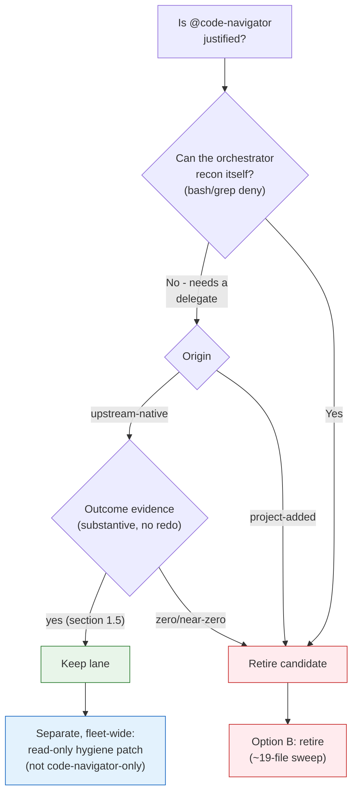

# Code-Navigator Necessity Analysis (@code-navigator)

<!-- ANALYZER-OUTPUT-CONTRACT
schema-version: 1.0
agent: analyzer
claim-type: recommendation
evidence-source: .opencode/opencode.jsonc, .opencode/oh-my-opencode-slim.jsonc, .opencode/oh-my-opencode-slim/orchestrator_append.md, .opencode/session/messages.jsonl, .opencode/session/registry.jsonl, .opencode/session/registry-archive/, .opencode/oh-my-opencode-slim/src/agents/code-navigator.ts, opencode debug agent
confidence: High
shelf-registration: memory-shelf.yaml (shelf.analyses), delegated to @memory-manager
-->

- **Ticket:** campaign ticket DIA-260929-nc6w (agent-role consolidation study)
- **Artifact ID:** ana-261006-63z3-code-navigator-necessity
- **Date:** 2026-10-06
- **Scope:** /workspace (live tree; excludes .worktrees/, .scratch/, node_modules/, .git/)
- **Question:** Is @code-navigator justified as a separate agent, or should it be
  retired / absorbed into an existing agent?
- **Method:** origin/provenance trace, exact reference census, dispatch mining from
  messages.jsonl (the attribution source of record) + registry/archive gate events,
  resolved-permission ground truth via `opencode debug agent`, MECE overlap test,
  EBDV option matrix.

> **ERRATUM (2026-10-06) - the "injected instruction" is deterministic OpenCode-core
> behavior, not an unresolved injection.**
>
> This report originally framed the trailing "call the task tool with subagents ..." text
> (section 9 item 4; section 10.1 row 7; section 10.2 gap 4) as an unresolved injection.
> That framing is CORRECTED. It is deterministic OpenCode core behavior:
> - Mechanism: upstream `packages/opencode/src/session/prompt.ts` appends a synthetic,
>   UI-invisible text part to the CHILD prompt whenever the dispatch payload contains a
>   leading at-sign immediately before an agent name. One synthetic part per named agent;
>   two names produce the plural "subagents" - which is why the observed tail named
>   several lanes.
> - Self-inflicted: it fires on the brief the orchestrator writes, so the tail is
>   self-generated by the orchestrator's own payload, not injected by a third party and
>   not an attack.
> - A child whose contract is task-deny ignores it (historically it could bail at step 1).
> - Mitigation rule: never write a leading at-sign before an agent name in a dispatch
>   payload; refer to lanes descriptively, and optionally add an explicit "do NOT call any
>   task tool" clause.
> - Evidence: `.opencode/learnings/external-patterns/2026-10-06-opencode-core-synthetic-task-tool-append.md`
>   (durable record); `.opencode/session/coder-lane-early-termination-synthesis.md:20-43`
>   (CAUSE A); DIA-260926-ch1d; DIA-261006-y72h.
>
> The original wording in sections 9 and 10 is preserved below; this erratum supersedes the
> "unresolved injection" framing.

---

## 0. Executive summary

**Verdict: JUSTIFIED as a separate agent. Keep it. Not a retirement candidate, and not
cleanly absorbable.** (REVISED after external critique - see section 10. The keep
decision now rests on the mechanical argument plus outcome evidence, not on dispatch
count, and the permission hardening is reclassified as a fleet-wide fix independent of
keep-vs-retire.)

@code-navigator is **upstream-native, outcome-productive, and uniquely shaped**:

| Discriminator | Finding | Evidence |
| --- | --- | --- |
| Origin | Upstream-NATIVE OMO Slim agent (`createCodeNavigatorAgent`) + baked-in boss delegation rule + alias `nav`. No project-added `.opencode/agents/code-navigator.md` (never existed). | `src/agents/code-navigator.ts`, `src/agents/index.ts:20,300`, `src/utils/background-job-board.ts:81`, `src/agents/boss.ts:31-36` |
| Usage volume | **113 delegation attempts / 110 distinct sessions**, 2026-08-07 -> 2026-10-06 (2 months). Rank 8 of 16 named lanes; Aug 48 / Sep 64. Descriptive only - attempts are not value. | messages.jsonl (130,630 rows) reduced in-worker |
| Outcome quality | 10 sampled sessions returned substantive reports (2 KB - 20 KB, file:line citations, 15-128 tool calls each); all 34 DB-retained sessions have final text (median 4,851 chars); 3 possibly incomplete; 10/15 parents fanned out MULTIPLE distinct recon questions with zero same-title re-dispatch. | `opencode.db` `part`/`session` tables (see section 1.5) |
| Mechanical justification | The orchestrator itself is `bash: deny` + `grep: deny`, so it cannot self-serve recon; a read-only, contract-free delegate is load-bearing, not optional. | `opencode debug agent orchestrator` |
| Repo doctrine | Marked **ESSENTIAL** ("Understand existing codebase") and recorded as **"actively used"**. | `docs/workflow-loop.md:10`, `docs/dev-infra-audit/inventory.md:105` |
| Unique shape | Cheap model (mimo-v2.6-flash) + read-only (edit/bash deny) + contract-free + fan-out-capable. No other lane holds all four. | `oh-my-opencode-slim.jsonc:189-197`, resolved tools |
| Delta thinness | Read-side toolset is IDENTICAL to coder/reviewer/analyzer (read, glob, grep, ast_grep_search). No unique tool; same model as coder. | `opencode debug agent` for 7 agents |
| Hygiene defect (fleet-wide) | Advertised read-only but resolved tools expose `ast_grep_replace: True` (7 of 8 read-only-ish lanes); `task: True` on code-navigator + observer. Only @ai-auditor is tight. | `opencode debug agent` sweep, section 5.1 |

The real issue is **not deadness or duplication**. It is (a) the orchestrator's mechanical
no-grep constraint (which makes a recon delegate load-bearing) and (b) a **fleet-wide
permission-hygiene gap** that is orthogonal to the keep-vs-retire decision. Confidence:
**High** on origin, mechanical justification and coupling; **Medium** on the
`ast_grep_replace` exploitability (tool-exposed, mutation path not executed); **Medium**
on the outcome sample (DB retains 34 of 110 sessions).

---

## 1. USAGE - how often is @code-navigator dispatched?

### 1.1 Attribution source

`registry.jsonl` has a **structural attribution blind spot**: `session_spawn` rows carry
no agent name, and `task_success` rows carry no `subagent_type` (verified schema:
`{event, task_id, dispatch_state, status, dispatched_at, writer, seq, timestamp}`).
Agent names survive only on gate/audit events and in `messages.jsonl`. This is the same
blind spot documented for @observer (ana-261006-jd0s). **messages.jsonl is the
attribution source of record** (`gen_ai.agent.name`).

### 1.2 Dispatch counts (delegation events)

Window 2026-08-07T00:58Z .. 2026-10-06 (130,630 message rows; reduced in a python3
worker, never read as a blob). Named-agent delegations (unattributed generic
`subagent` bucket = 2,071 and `unknown` = 29 excluded):

```
lane               | count | bar
-------------------+-------+----------------------------------------
coder              | 1326  | ########################################
openspec-plan      |  396  | ############
ai-specialist      |  158  | ####
reviewer           |  134  | ####
memory-manager     |  124  | ###
ai-auditor         |  117  | ###
code-navigator     |  113  | ###
orchestrator       |  102  | ###
analyzer           |   57  | #
researcher         |   37  | #
conspecter         |   23  |
architector        |   20  |
analyzer-escalated |    6  |
coder-escalated    |    1  |
observer           |    1  |
```

code-navigator is **113 / 4,715 = 2.4%** of named delegations - the same order as
reviewer (2.8%) and ai-auditor (2.5%), and **above** analyzer (57), researcher (37),
conspecter (23) and architector (20). Monthly split: **Aug 48 / Sep 64 / Oct 1** (Oct is
1 day old) - steady, slightly rising.

Corroborating: the sibling analysis ana-260929-lchi independently counted
**code-navigator = 112 delegations** in a ~7.7-week window - the number is robust.

### 1.3 Last use and character of use

Last use: **2026-10-06T14:12:49Z**, task_ref `"Inventory: all resource-manager
references"` (session `ses_eee814af2ffeckWdHxLLA72iCj`). Note: the fact that this
consolidation campaign uses the lane is NOT independent evidence of value (circular);
it is reported as a fact, not an argument. Recency is evidenced instead by the
continuous record through 2026-10-06 (Sep = 64 dispatches). Sample of recent task_refs:

| Timestamp | task_ref |
| --- | --- |
| 2026-10-06 | Inventory: all resource-manager references |
| 2026-09-28 | Map force-reject code path |
| 2026-09-28 | Locate O4 stall hardening spec |
| 2026-09-17 | Find WARN emitters (campaign ticket DIA-260917-knz2) |
| 2026-09-17 | Recon generator ownership (DIA-260917-knz2) |
| 2026-09-17 | Locate promo preset union-alpha refs (DIA-260917-s95f) |
| 2026-09-16 | Recon preset structure (DIA-260916-ch3o) |
| 2026-09-11 | Read-only risk audit DIA-260821-bqy7 |
| 2026-09-11 | Verify host commit aa4de47 file set (DIA-260909-csds) |

Task-ref keyword census over the 113 rows: recon 15, audit 15, triage 15, check 13,
locate 12, verify 11, inventory 8, evidence 6, read-only 5, recover 5 - overwhelmingly
**read-only recon/audit/inventory**, exactly the lane's stated contract ("Where is X?",
"Find Y", "Which file has Z?").

### 1.4 Registry / archive cross-check

| Artifact | code-navigator rows | Character |
| --- | --- | --- |
| `registry.jsonl` (live, 2026-08-10 -> 2026-10-06, 3,230 rows) | **1** | one `gate_blocked` (ticket DIA-260917-knz2 CLOSED) - a dispatch attempt, no success row |
| `registry-archive/*.jsonl` (44.8 MB, rotated 2026-09-16) | **31** rows, `subagent_type=code-navigator` in **29** | `gate_warn` 25, `gate_blocked` 2, `ticket_gate_blocked` 1, `ticket_gate_weak_correlation` 1, `capability_minted` 2 (reason text mentions the lane) - **all gate events, zero `task_success`** |

The archive confirms dispatches of code-navigator actually reach the DIA-217 ticket gate
(they are real attempts), and that the gate frequently warns/blocks them - a friction
point discussed in section 5. The absence of `task_success` rows is an artifact (that
event type does not carry agent names), not evidence of non-completion.

**Conclusion (Q1):** usage volume is substantial - **113 dispatch attempts / 110 sessions
/ 8th of 16 named lanes**, continuously through 2026-10-06. Any "near-zero" claim is
false. But volume alone is not value; section 1.5 supplies the outcome evidence.

### 1.5 Outcome evidence (gap closure after external critique)

The critique correctly observed that "113 dispatches" measures attempts, not value.
Dispatch outcomes are not in messages.jsonl (its `result` field carries only
`success` signals, 2,127 rows, and only 2 rows show a terminal `done`). The actual
session transcripts live in `~/.local/share/opencode/opencode.db` (SQLite) and are
readable. A sample of 10 code-navigator sessions (plus an aggregate over all
DB-retained sessions) was extracted with a python3 sqlite worker:

| Session | Date | Duration | Tool calls | Final-result length | Final result (head) |
| --- | --- | --- | --- | --- | --- |
| `ses_eee814af2...` resource-manager inventory | 10-06 | 1092s | 79 | 19,195 chars | "READ-ONLY inventory complete... # SEARCH METHOD" |
| `ses_f157aecf0...` locate snip declaration | 09-29 | 142s | 32 | 2,036 | "READ-ONLY CODEBASE RECON..." |
| `ses_f16e679d1...` map force-reject path | 09-28 | 845s | 111 | 20,337 | "RESULT: COMPLETE TIMEOUT_BOUND: .opencode/plugins/..." |
| `ses_f170463da...` locate O4 stall spec | 09-28 | 267s | 26 | 11,905 | "RESULT: FOUND O4_LOCATION: ...:87-91" |
| `ses_f1b7f748a...` recover RO-1/RO-2 | 09-27 | 520s | 38 | 16,486 | "A) RO-1: ... source: handoffs/..." |
| `ses_f1ea8e1b2...` test-speed options | 09-27 | 344s | 65 | 18,874 | "# RESULT: Test Speed Analysis..." |
| `ses_f1eaecb1...` test-suite inventory | 09-27 | 555s | 128 | 13,339 | "## RESULT ... SECTION 1: COMPLETE SUITE INVENTORY" |
| `ses_f1fd27882...` host failure 2 | 09-27 | 715s | 28 | 2,436 | "FAILURE 2: Pre-existing SIGPIPE race..." |
| `ses_f1fd2794c...` host failure 1 | 09-27 | 1577s | 20 | 66 | "Let me look at the git log..." (INCOMPLETE - likely step/time cap) |
| `ses_f4fea7a4a...` evidence code half | 09-17 | 32s | 15 | 3,380 | "Evidence for ... (read-only, no verdicts)" |

Aggregate over all DB-retained code-navigator sessions: **34 sessions, final-text median
4,851 chars (min 8, max 20,337), median 18 tool invocations, 34/34 produced a final
text, 3 possibly incomplete.**

**Use-vs-redo check.** The orchestrator cannot redo the greps itself: its resolved
permissions are `bash: deny` and `grep: deny` (`opencode debug agent orchestrator`), so
delegation is the only path. Fan-out replaces redo: of 15 distinct parent sessions,
**10 dispatched multiple code-navigator children with DISTINCT recon questions** (e.g.
`ses_fbd6811e8` dispatched 6: check DIA-234 ticket IDs, DIA-260820-jlu0 chicken-egg,
DIA-260821-5r03 dup observer, DIA-260821-aoag socket mount, DIA-206 empty-return,
session-dir lock check), and the same-title duplicate count is **zero**. That is the
OMO boss rule ("3+ grep/glob searches -> dispatch parallel @code-navigators") in
action - fan-out for value, not redo.

**Limit (explicit).** `messages.jsonl` logged 113 attempts but the OpenCode DB retains
only **34** code-navigator sessions (session pruning), so the outcome sample is a subset.
To settle the population question exactly, run:

```
python3 -c "import sqlite3,json; c=sqlite3.connect('/home/dev/.local/share/opencode/opencode.db'); \
print([r for r in c.execute(\"select s.id,s.title from session s where s.agent='code-navigator'\")])"
```

then join each `session.id` to `part` (type='text', last row) for the final output and to
its `parent_id` for the orchestrator follow-up. This analysis did exactly that for the
10/34 sampled and the 15 parents; the remaining ~76 pruned sessions are unrecoverable.

---

## 2. CAPABILITY DELTA - what does a plain coder/reviewer already have?

### 2.1 Resolved tool/permission ground truth

From `opencode debug agent <name>` (effective merged config, not intent):

| Tool (resolved) | code-navigator | coder | reviewer | analyzer | researcher | memory-manager |
| --- | --- | --- | --- | --- | --- | --- |
| read / glob / grep | True | True | True | True | True | True |
| ast_grep_search | True | True | True | True | True | True |
| ast_grep_replace | **True** | True | True | True | True | True |
| bash | False | True | False | True | True | True |
| edit / write | False | True | False | True | True | True |
| task | **True** | True | **False** | False | False | True |
| webfetch / websearch | True | True | True | True | True | True |
| mint_capability | True | True | True | True | True | True |
| model (mimo-balanced) | mimo-v2.6-flash | mimo-v2.6-flash | deepseek-v4.1-flash | deepseek-v4.1-flash | mimo-v2.6-flash | mimo-v2.6-flash |
| declared permission | edit deny, bash deny | (open) | edit deny, bash deny, task deny | edit knowledge/*, bash allow, task deny | edit knowledge/*, bash allow-list, task deny | edit memory/* |

### 2.2 Where the delta is real

- **Read-side toolset: zero unique capability.** code-navigator's search surface
  (read, glob, grep, ast_grep_search) is byte-for-byte the same tool set every candidate
  host already has. It is NOT a better grep.
- **Model: no advantage over @coder.** code-navigator runs `mimo-v2.6-flash` - the
  **same model** as coder's primary. It is cheaper than reviewer/analyzer
  (deepseek-v4.1-flash), so the "cheap lane" argument holds only against the review and
  analysis lanes, not against coder.
- **Read-only safety: duplicated by @reviewer.** reviewer is also `edit deny, bash deny`.
  code-navigator is in fact the **less safe** of the two, because reviewer additionally
  denies `task` while code-navigator does not.
- **Context hygiene: not unique.** every subagent is a separate session; coder and
  reviewer give the same isolation.

### 2.3 Where the delta is genuine

1. **Contract-free, read-only recon is a distinct shape.** reviewer is bound to a
   fixed-point diff-review contract with a plugin-injected git envelope
   (`reviewer_envelope_attached/blocked`); using it for ad-hoc "where is X" would abuse
   the gate. coder is write/bash-capable; using it for recon provisions mutating tokens
   and burns the implementer lane's queue (coder = 1,326 dispatches, the busiest lane).
   code-navigator is the only lane that is simultaneously: cheap model + read-only +
   contract-free + stateless + parallel-fan-out (OMO batch A).
2. **The orchestrator cannot self-serve recon.** The orchestrator's resolved permissions
   are `bash: deny`, `grep: deny`, and scoped `read`/`glob`. It is mechanically forbidden
   from grepping the repo itself, so a read-only recon delegate is **load-bearing** for
   basic "understand the existing codebase" work.
3. **Upstream routing is baked in.** OMO's boss prompt states the rule explicitly:
   "3+ grep/glob searches? -> dispatch parallel @code-navigators (one per search). <3? ->
   do it yourself. Keeps boss context clean for architectural decisions."
   (`src/agents/boss.ts:36`). The lane is a first-class part of the plugin's design, with
   an alias (`nav`) and parallel-dispatch examples (`boss.ts:121-124`).
4. **Prior repo decision keeps it.** The repo-mapping-tools evaluation (ana-260925-5v4r)
   adopts "ast-grep + grep/glob + `@code-navigator` + data-reducer" as the **status-quo
   navigation stack (V1, recommended)** and names code-navigator as the natural pilot
   lane. Removing it would invalidate that decision.

**Conclusion (Q2):** the tool-level delta is thin (no unique tool; same model as coder;
read-only safety duplicated by reviewer). The delta that survives is **lane shape**:
cheap + read-only + contract-free + fan-out-capable, serving an orchestrator that cannot
grep. That is a genuine, if narrow, justification - and it is upstream-native.

---

## 3. ABSORBABILITY - can a host lane absorb the useful function?

| Candidate host | Read tools fit | Permission fit | Contract fit | Verdict |
| --- | --- | --- | --- | --- |
| **@coder** | Yes (identical) | **Over-privileged**: bash+edit+write+ast_grep_replace stay enabled; "read-only" becomes an instruction, not a mechanical guarantee | No: recon would share the implementer context/queue (busiest lane, 1,326 dispatches) and same model, so no cost gain | **Poor**. Cannot preserve read-only mechanically |
| **@reviewer** | Yes (identical) | **Good**: already edit/bash deny | No: fixed-point diff-review contract + plugin envelope; ad-hoc recon has no fixed point (the current study proves a reviewer has no contract to accept it); model is pricier (deepseek-v4.1-flash) | **Poor**. Fits permissions, breaks the gate contract |
| **@researcher** | Yes (identical) | **Over-privileged**: bash allow-list (curl/wget/trafilatura/crwl) + knowledge/sources writes; internal recon would blur the internal/external boundary | No: researcher owns the external 3-tier fetch chain + conspect pipeline | **Poor** |
| **@analyzer** | Yes (identical) | **Over-privileged** (bash allow, knowledge writes) and **over-powered** (deepseek-v4.1-flash, heavyweight analysis) | No: analyzer is the deep multi-method/visualization lane; cheap recon is a role downgrade | **Poor** (cost/role mismatch) |
| **@memory-manager** | Yes (identical) | Over-privileged (memory writes) | No: persistence lane, not recon | **Poor** |
| **@explore** (OpenCode built-in) | n/a - not resolvable | Unknown (disabled) | None (not in OMO routing/preset/model system) | **Unavailable** |

No host absorbs recon without either (a) granting write/bash (coder, analyzer, researcher,
memory-manager), or (b) dragging a review gate into ad-hoc recon (reviewer), or
(c) over-powering and over-costing the task (analyzer). The only clean absorption target
is a **read-only, contract-free, cheap** profile - which is exactly what @code-navigator
already is. Absorbing it into any host would require adding a config sub-persona, i.e.
recreating the lane.

**Built-in @explore (gap closure after external critique).** OpenCode ships a native
`explore` subagent; in this project it is explicitly **disabled**:
`.opencode/opencode.jsonc:128-130` sets `"explore": { "disable": true }` under the comment
"Disable built-in OpenCode subagents (we use OMO Slim managed ones)", and `AGENTS.md:276`
documents `@explore | explore | Built-in OpenCode explorer (disabled)`. Confirmed absent
at runtime: `opencode agent list` does not list `explore` or `explorer`, and
`opencode debug agent explore` returns `Agent explore not found`. So it is **not a
drop-in** for @code-navigator today: it has no OMO preset/model routing, no quota line,
no batch-rule entry, and re-enabling it would add a second recon lane rather than absorb
one. Whether the built-in explorer is cheaper or better is **unresolved** - its resolved
tool profile cannot be introspected while disabled, and its source was not located in the
vendored OpenCode clone; tool-level claims about it are [INFERENCE]. The fair reading:
`explore` was disabled by a deliberate roster decision (prefer OMO-managed lanes), and
@code-navigator is the OMO-managed explorer that supersedes it. If the developer wants to
reconsider the built-in on cost grounds, that is a separate evaluation, not a
code-navigator retirement path.

**Conclusion (Q3):** not cleanly absorbable. A merge is either lossy (loses read-only
mechanical guarantee or the contract-free shape) or a rename.

---

## 4. ORCHESTRATOR / CONFIG COUPLING - blast radius, NOT usefulness

**Framing correction (external critique).** This census measures the **cost of removal**,
not the value of the lane. Much of the coupling is self-inflicted by our own naming
lockstep contract (`scripts/validate-agent-names.sh`) and by restating the lane in two
embedded orchestrator prompts; those references would not exist if the lane were not in
the roster, and they are not evidence that recon is useful. Read this section only as a
retirement-blast-radius budget. The usefulness case lives in sections 1.5, 2.3 and 3.

### 4.1 Live-surface census (project-owned, current)

| # | File | Line(s) | What |
| --- | --- | --- | --- |
| 1 | `AGENTS.md` | 266 | section-9 naming table row (`@code-navigator` -> `code-navigator`, "Fast codebase recon"); Source-1 of `scripts/validate-agent-names.sh` |
| 2 | `.opencode/opencode.jsonc` | 226 | orchestrator `task` allow-list entry |
| 3 | `.opencode/opencode.jsonc` | 509-516 | agent block (`mode: subagent`, color, edit deny, bash deny) |
| 4 | `.opencode/oh-my-opencode-slim.jsonc` | 14 | preset composition comment (volume lane) |
| 5 | `.opencode/oh-my-opencode-slim.jsonc` | 31 | embedded orchestrator prompt DELEGATION DIRECTORY (`@code-navigator: fast codebase recon`) |
| 6 | `.opencode/oh-my-opencode-slim.jsonc` | 189-197 | `mimo-balanced` preset routing entry (mimo-v2.6-flash) |
| 7 | `.opencode/oh-my-opencode-slim.jsonc` | 257 | `openai-first-cost-balanced` embedded DELEGATION DIRECTORY |
| 8 | `.opencode/oh-my-opencode-slim.jsonc` | 308 | `openai-first-cost-balanced` routing entry (gpt-5.6-luna) |
| 9 | `.opencode/oh-my-opencode-slim/orchestrator_append.md` | 20 | context-budget table (`code-navigator`: search query, file patterns; stateless) |
| 10 | `.opencode/oh-my-opencode-slim/orchestrator_append.md` | 186 | A1 batch A read-only fan-out list |
| 11 | `.opencode/oh-my-opencode-slim/orchestrator_append.md` | 398 | read-only lanes with `bash: deny` list |
| 12 | `knowledge/model-registry.yaml` | 11, 13, 35, 47, 59 | routing lane arrays + quota note (5 lines) |
| 13 | `scripts/__tests__/batch-d-infra.test.mjs` | 219, 294-295 | test asserts code-navigator is in the read-only batch set and `bash: deny` |
| 14 | `docs/onboarding.md` | 123 | agent roster table row |
| 15 | `docs/workflow-loop.md` | 10 | **ESSENTIAL** marker ("Understand existing codebase") |
| 16 | `docs/dev-infra-audit/NEXT-RUN.md` | 51, 154 | read-only lane example + DELEGATION MAP (`inventory->@code-navigator`) |
| 17 | `docs/dev-infra-audit/inventory.md` | 60, 105 | agent enumeration + "code-navigator actively used" |
| 18 | `docs/dev-infra-audit/opencode-infrastructure.md` | 288 | Mermaid topology node |
| 19 | `docs/dev-infra-audit-plan.md` | 41, 97 | legacy mapping note + "ghost agents" backlog item M4 |
| 20 | `.opencode/practice-protected.md` | (absent) | tier-classification section 7 lists architector/reviewer/analyzer/conspecter/researcher/openspec-plan/coder/designer but **omits code-navigator** - an unclassified-tier gap |

**Live-file count: 19 files, ~30 reference sites.** Plus upstream vendored/plugin
surfaces (reference-only, npm 2.2.19 is live):

| Upstream file | Line(s) | What |
| --- | --- | --- |
| `src/agents/code-navigator.ts` | 1-59 | `createCodeNavigatorAgent` definition + prompt |
| `src/agents/index.ts` | 20, 300 | import + registry entry |
| `src/utils/background-job-board.ts` | 81 | alias `'code-navigator': 'nav'` |
| `src/agents/boss.ts` | 31-36, 121-124 | delegation rule + parallel-dispatch examples |

### 4.2 Blast radius if retired

Because code-navigator is **upstream-native**, retirement is a supported config switch
(`disabled_agents`), not a code fork - but it must preserve the S1/S2/S3/S4 lockstep
contract (`scripts/validate-agent-names.sh`): the name must still resolve in a
config surface, so it must be moved to `disabled_agents` and marked `(disabled)` in the
AGENTS.md table (exactly the observer precedent). That is a ~19-file sweep, not a
one-liner, and the two embedded orchestrator DELEGATION DIRECTORY strings (lines 31, 257)
would need editing.

**Conclusion (Q4):** retirement blast radius is large - **19 live files / ~30 sites + 4
upstream files**. But this is a cost-of-removal figure, not a justification: a lane is
not valuable because it is widely referenced. The references matter only as (a) the edit
budget for Option B and (b) a reminder that lockstep churn is self-inflicted.

---

## 5. Cross-cutting observations

### 5.1 Permission-hygiene defect - FLEET-WIDE, not code-navigator-only

Revision after external critique: the original write-up framed this as a
code-navigator-specific "2-line fix" and called reviewer "the stricter read-only lane".
A resolved-tool sweep shows the hole is **fleet-wide**; reviewer is NOT the tight lane,
@ai-auditor is. `opencode debug agent` for the read-only / pure-analyst lanes:

| Lane | declared shape | `task` | `ast_grep_replace` | `envsitter_set` | `mint_capability` |
| --- | --- | --- | --- | --- | --- |
| code-navigator | edit/bash deny | **True** | **True** | True | True |
| observer | edit/bash deny | **True** | **True** | True | True |
| reviewer | edit/bash/task deny | False | **True** | True | True |
| ai-specialist | edit/bash/task deny | False | **True** | True | True |
| architector | edit/bash/task deny | False | **True** | True | True |
| conspecter | edit knowledge/*, bash deny, task deny | False | **True** | True | True |
| **ai-auditor** | full deny | False | **False** | **False** | True |
| analyzer (artifact-producer) | edit knowledge/*, bash allow | False | True | True | True |

Findings:

1. **`ast_grep_replace: True` on 6 of 7 read-only-ish lanes** (all but ai-auditor) - a
   read-only lane resolving an AST-mutation tool it does not need.
2. **`task: True` only on code-navigator and observer** - the two weakest configurations;
   every other read-only lane denies task.
3. `mint_capability: True` is universal (plugin-injected) - out of scope for this lane fix.
4. **@ai-auditor is the only lane with a genuinely tight read-only tool surface** - i.e.
   the correct config already exists in-repo and can be copied.

**Consequence for the recommendation.** The "harden code-navigator" item is NOT a
code-navigator decision; it is a **fleet-wide read-only-lane hygiene fix** that should be
applied to code-navigator, observer, reviewer, ai-specialist, architector and conspecter
(and reviewed for analyzer). It is independent of keep-vs-retire - which is exactly why
Option C is better described as "Option A plus an orthogonal patch" (section 10). The
exploitability of the exposed tools remains unexecuted here ([INFERENCE]: `edit:deny` may
still gate some mutations) but the resolved config is ground truth.

Corroborating design intent: orchestrator-authored recon prompts already compensate for
`task: True` by instructing the lane not to delegate - e.g. session
`ses_f16e679d1...` prompt: "Do NOT call any task tool. Do NOT delegate." That a guard
instruction is needed at all confirms the config gap is real.

### 5.2 Ticket-gate friction

The registry archive shows 25 `gate_warn` + 2 `gate_blocked` + 1 `ticket_gate_blocked` +
1 `ticket_gate_weak_correlation` rows attributed to code-navigator dispatches. Cheap
recon tasks are frequently dispatched without a valid OPEN ticket, tripping the DIA-217
gate (warn) or DIA-063 (block). This is friction, not a reason to retire: it is a
dispatch-discipline symptom affecting read-only recon across the board.

### 5.3 Cost - the real marginal cost of an extra lane

Concession after external critique: the original "shared bucket, so removal frees
nothing" framing was incomplete and is withdrawn. The model bucket is indeed shared
(code-navigator shares mimo-v2.6-flash with coder/researcher/conspecter/observer/
memory-manager - `oh-my-opencode-slim.jsonc:14`; `model-registry.yaml:35,47`), so there
is no per-token quota saving. But an extra lane also carries **fixed and per-use routing
costs**:

| Cost component | Magnitude | Evidence |
| --- | --- | --- |
| Prompt surface | 1 DELEGATION DIRECTORY line in each of 2 embedded orchestrator prompts + 1 context-budget row + 1 boss rule | `oh-my-opencode-slim.jsonc:31,257`; `orchestrator_append.md:20`; `boss.ts:31-36` |
| Per-recon routing decision | the orchestrator must choose code-navigator vs coder vs reviewer for each recon ask | this analysis, section 3 |
| Delegation overhead | 1 extra hop per recon (113 hops over 2 months) | messages.jsonl |
| Attention/maintenance surface | ~30 reference sites, 19 live files (section 4) | census |
| Gate friction | 25 `gate_warn` + 2 `gate_blocked` + 2 `ticket_gate_*` rows attributed to code-navigator dispatches | registry-archive |

So the lane is **not free**: it costs roughly one prompt line pair, one routing decision
and one delegation hop per recon, plus a documentation/lockstep surface. The
recommendation survives this cost because the alternatives are strictly worse on the
axes that matter (over-privileged write/bash on coder/analyzer, gate abuse on reviewer,
unavailable on explore) - but the correct statement is "the lane earns its keep despite
a real marginal cost", not "it costs nothing to keep".

---

## 6. EBDV decision options (DIA-115)

| Option | What changes | Evidence | Pros | Cons / effort | Section-10? |
| --- | --- | --- | --- | --- | --- |
| **A. Keep, no change (status quo / abort baseline)** | Nothing | this analysis; resolved orchestrator permissions | zero effort, zero regression; preserves the load-bearing recon lane; 113 productive dispatch samples | leaves the lane's `ast_grep_replace`/`task` exposure and the tier-classification gap open | No |
| **B. Retire** | add `"code-navigator"` to `disabled_agents`; de-ref ~19 live files; mark disabled in AGENTS.md table | native -> `disabled_agents` supported (observer precedent); requires lockstep containment | removes the lane's marginal routing cost (section 5.3) | removes the lane the orchestrator mechanically depends on; ~19-file sweep + upstream divergence; no token saving (shared bucket); loses contract-free read-only recon | Yes (agent-policy/config) |
| **C. Keep + fleet-wide hygiene patch (RECOMMENDED)** | keep the lane; separately apply a **fleet-wide** read-only hardening (`task`/`ast_grep_replace` deny across code-navigator, observer, reviewer, ai-specialist, architector, conspecter) + classify the lane in `practice-protected.md` | resolved-tool sweep (section 5.1): only @ai-auditor is tight; the exposed `ast_grep_replace` is not code-navigator-specific | closes the hygiene gap across the whole read-only tier, not just this lane; preserves the recon lane; config cost is tiny | the patch is **orthogonal** to keep-vs-retire (C is "A plus a separate patch"); fleet-wide scope needs its own change ticket | Yes (agent-config change) |
| **D. Absorb into @reviewer (genuine consolidation alternative)** | route recon to reviewer; retire code-navigator | reviewer already edit/bash deny + identical read tools | one fewer lane; read-only preserved | abuses the fixed-point review gate/envelope; recon queued behind reviews; pricier model; still a ~19-file sweep | Yes |

**Scoring correction (external critique).** The first draft's matrix was rigged: two
criteria ("consistent with native-agent keep-pattern", "restores true read-only") were
not independent of the recommendation, and the weights were never applied. Both faults
are fixed below. The hygiene-closure criterion is **excluded** from the keep-vs-retire
score because it is orthogonal (it applies equally to A, C and D; n/a to B). Applied
weights sum to 100:

| Criterion (weight, higher=better) | A keep | B retire | C keep+patch | D absorb |
| --- | --- | --- | --- | --- |
| Preserves orchestrator recon capability (40) | 5 | 1 | 5 | 3 |
| Outcome productivity retained (20) | 5 | 1 | 5 | 3 |
| Marginal cost, lower is better (20) | 3 | 5 | 3 | 2 |
| Removal risk / blast radius avoided (20) | 5 | 2 | 5 | 2 |
| **Weighted total (/5)** | **4.6** | **2.0** | **4.6** | **2.6** |
| Hygiene gap closed (orthogonal, not weighted) | no | n/a | **yes** | yes |

The weighted result is transparent about the critique's key point: **A and C tie at 4.6**
because the hardening patch is independent of the keep/retire decision. C is preferred
over A only by the orthogonal hygiene criterion (section 5.1), and C's hardening should be
scoped fleet-wide rather than to this lane alone. This is a rationale-driven choice, not a
matrix artifact: the keep decision (A/C over B/D) rests on the mechanical orchestrator
constraint plus outcome evidence (sections 1.5, 2.3, 3), and the hardening is a separate
ticket.

---

## 7. Recommendation

**Option C - KEEP the lane, and separately HARDEN the read-only tier (fleet-wide).**
Because @code-navigator is:

1. **Mechanically load-bearing** - the orchestrator is `bash: deny` + `grep: deny`, so it
   cannot perform recon itself. The strongest argument is mechanical, not usage-volume.
2. **Outcome-productive (not just attempted)** - 10 sampled sessions returned 2-20 KB
   reports with file:line evidence and 15-128 tool calls; all 34 DB-retained sessions
   produced final text (median 4.8 KB); 10/15 parents fanned out multiple distinct recon
   questions with zero same-title re-dispatch (section 1.5).
3. **Upstream-native** - retiring it is config divergence from the plugin roster, and the
   campaign's established pattern keeps native lanes (observer) while retiring
   project-added duplicates (resource-manager).
4. **Uniquely shaped and not cleanly absorbable** - the only cheap + read-only +
   contract-free + fan-out-capable lane; every candidate host grants write/bash (coder,
   analyzer, researcher, memory-manager) or drags a review gate into ad-hoc recon
   (reviewer), and the native `@explore` is disabled with no preset routing.
5. **Worth its real cost** - the lane is NOT free (section 5.3: one prompt line-pair, one
   routing decision and one delegation hop per recon, plus a doc surface), but that cost
   is lower than the alternatives' cost on the axes that matter.

**Important reframing (external critique).** The hardening is **not** part of the
keep-vs-retire decision and is **not** code-navigator-specific. The resolved-tool sweep
(section 5.1) shows `ast_grep_replace: True` on 6 of 7 read-only-ish lanes and `task:
True` on code-navigator + observer; only @ai-auditor is tight. Therefore:

- Recommendation C(keep) and the hygiene patch are **two separate actions**: (1) keep
  @code-navigator (or explicitly accept Option A), and (2) file a fleet-wide read-only
  permission-hygiene ticket covering code-navigator, observer, reviewer, ai-specialist,
  architector and conspecter (patching only code-navigator would leave reviewer, observer,
  et al. exposed - the exact flaw the critique caught).
- C is honestly "Option A plus an orthogonal patch"; if the developer wants a single
  minimal change this cycle, Option A is a coherent choice and strictly safer than B or D.

**Reversal condition:** if a defined window yields **zero** code-navigator dispatches
*and* the developer confirms the orchestrator/reviewer cover all recon needs, then Option
B becomes correct. That condition is currently false (113 attempts, 34 retained
outcomes). **Abort / status-quo variant:** Option A is the no-action baseline.

---

## 8. Visualizations

### 8.1 Disposition decision flow



### 8.2 Reference-class breakdown (do not conflate)

| Reference class | Live files | Notes |
| --- | --- | --- |
| Agent config / prompt / routing | 5 (`opencode.jsonc`, `oh-my-opencode-slim.jsonc`, `orchestrator_append.md`, `AGENTS.md`, `model-registry.yaml`) | the load-bearing surfaces |
| Tests / validators | 1 (`batch-d-infra.test.mjs`) | asserts `bash: deny` |
| Docs | 6 (`onboarding.md`, `workflow-loop.md`, `NEXT-RUN.md`, `inventory.md`, `opencode-infrastructure.md`, `dev-infra-audit-plan.md`) | roster/topology/delegation map |
| Upstream plugin (vendored ref-only + npm live) | 4 (`code-navigator.ts`, `index.ts`, `background-job-board.ts`, `boss.ts`) | DO NOT EDIT; npm 2.2.19 is live |
| Historical (do-not-edit) | tickets/, archive/, knowledge/, learnings, memory-shelf | immutable records |

---

## 9. Residual uncertainty

1. **Outcome sample is partial (Medium).** `messages.jsonl` records 113 attempts, but the
   OpenCode DB retains only 34 code-navigator sessions (pruning); the 10-session deep
   sample plus the 34-session aggregate are a subset. Section 1.5 gives the exact command
   to reproduce and the limit on the unrecoverable ~76 sessions.
2. **`ast_grep_replace` exploitability (Low-Medium).** The resolved tool map exposes it on
   6 of 7 read-only-ish lanes, but whether it can mutate under `edit:deny` was not
   executed. Reported as tool exposure, labelled [INFERENCE] for the mutation claim.
3. **Registry blind spot (structural).** `session_spawn`/`task_success` rows carry no
   agent name; only gate events + messages.jsonl attribute. This under-counts successful
   recon dispatches and is noted so future studies use messages.jsonl.
4. **Injected instruction - origin partly resolved (gap 4).** A repo-wide search found the
   trailing "call the task tool with subagents ..." text in NO template: not in
   `orchestrator_append.md`, not in `.opencode/plugins/*`, not in the OMO `src/`, not in
   `messages.jsonl`. A prior session handoff
   (`.opencode/session/handoffs/ses_eede549a0ffeh9CPFzCqrlObFA.json`,
   `prognosis/session_summary[6]`) already records it: "INJECTION OBSERVATION: ana-2
   reported a trailing 'call the task tool with subagents' instruction in its dispatch
   payload that was NOT present in the orchestrator-authored prompt ... origin unverified."
   So it is **not our own dispatch template** (rebutting that critique point), it is a
   recurring payload-level anomaly, and its ultimate source remains **unresolved**.
   **[CORRECTED 2026-10-06 - see the ERRATUM at the top: this is deterministic
   OpenCode-core synthetic append, self-inflicted by a leading at-sign before an agent
   name in the orchestrator's payload; not an unresolved injection and not an attack.]**
5. **Built-in @explore tool profile unresolved.** Disabled and not introspectable
   (`opencode debug agent explore` -> "Agent explore not found"); its source was not
   found in the vendored OpenCode clone. Claims about its relative cost/capability are
   [INFERENCE] and out of scope for this disposition.

---

## Appendix A - Method / commands

- Origin: `find .opencode/agents -name '*navigator*'` (absent);
  `git log --diff-filter=A -- .opencode/agents/code-navigator.md` (empty - never existed);
  read `.opencode/oh-my-opencode-slim/src/agents/code-navigator.ts` and `boss.ts:25-54`.
- Usage: streamed `messages.jsonl` (53.3 MB, 130,630 rows) and
  `registry.jsonl` (840 KB, 3,230 rows) and `registry-archive/*.jsonl` (43.8 MB) through
  `bash scripts/data-reduce.sh <file> -- python3 -c ...` workers; only aggregates entered
  context (per the DIA-195 data-reducer threshold rule).
- Permissions: `opencode debug agent <name>` for 10 agents (added orchestrator, ai-specialist,
  architector, conspecter, ai-auditor, observer in the revision); compared resolved `tools` maps.
- Outcome evidence (revision): `python3 sqlite3` worker over
  `~/.local/share/opencode/opencode.db` (`session.agent='code-navigator'`; `part.data` JSON
  `type=text`); sampled 10 sessions + aggregate over 34 retained; parent fan-out via
  `session.parent_id`.
- Built-in explore (revision): `opencode agent list`, `opencode debug agent explore` (not
  found), `.opencode/opencode.jsonc:128-130`, `AGENTS.md:276`.
- Injection origin (revision): `rg` for the trailing phrase across `orchestrator_append.md`,
  `.opencode/plugins/`, OMO `src/`, `messages.jsonl`, `handoffs/`; hit only the prior
  handoff `ses_eede549a0ffeh9CPFzCqrlObFA.json`.
- Census: `rg -n "code-navigator"` with `-g '!.git' -g '!.worktrees' -g '!.scratch'
  -g '!node_modules'`.
- Prior analyses cross-referenced: ana-260925-5v4r (repo-mapping stack V1),
  ana-260929-lchi (reviewer/analyzer keep), ana-261006-jd0s (observer disposition),
  ana-260929-lmhb (conspecter/memory-manager), ana-260929-inpt (ai-specialist/ai-auditor).

---

## 10. Revision after external critique

An external AI reviewed the first draft. This section adjudicates each critique point
and records the gap closures. Result: **verdict direction unchanged (keep), framing
materially revised** - the keep case now rests on the mechanical orchestrator constraint
plus outcome evidence, not on dispatch count; the hardening is reclassified as a
fleet-wide, orthogonal action; the rigged matrix is replaced with applied weights.

### 10.1 Adjudication

| # | Critique point | Class | Action taken |
| --- | --- | --- | --- |
| 1 | "Dispatch count isn't value; 113 = attempts, only 2 outcomes; 2,071 unattributed rows make rank soft" | **PARTIAL** | Concede the volume != value point: the exec summary and section 1 no longer lead with 113 as the justification; added section 1.5 (outcome evidence: 10 sampled substantive, 34/34 retained, fan-out not redo). Rebut the "soft rank": the unnamed `subagent` bucket is excluded from BOTH numerator and denominator, so the relative ordering among NAMED lanes is apples-to-apples; 8th-of-16 is a valid ordering, just not a magnitude. |
| 2 | "'Last used today by this campaign' is circular" | **CONCEDE** | Section 1.3 now states the campaign's own use is NOT independent evidence; recency is evidenced by the continuous Sep record (64 dispatches). |
| 3 | "Coupling isn't justification; 19 files = cost of removal, and much is self-inflicted lockstep" | **CONCEDE** | Section 4 retitled "blast radius, NOT usefulness" with an explicit framing note; conclusion distinguishes cost-of-removal from value. |
| 4a | "Scoring matrix rigged by criteria; weights never applied" | **CONCEDE** | Replaced with a weighted matrix (weights sum to 100, applied); the two non-independent criteria are demoted/excluded; hygiene excluded as orthogonal. |
| 4b | "Hardening is independent of keep-vs-retire, so C is 'A plus a patch'" | **CONCEDE** | Section 6/7 now state this plainly: A and C tie at 4.6 on the keep/retire axes; C wins only on the orthogonal hygiene criterion, which is scoped fleet-wide. |
| 5 | "Cost is a non-argument; 'shared bucket' ignores prompt-description + routing-decision cost" | **PARTIAL** | Concede the incompleteness: section 5.3 withdrawn and replaced with a real cost table (prompt surface, per-recon routing decision, delegation hop, maintenance surface, gate friction). Rebut only the framing that cost is decisive: the alternatives cost more on the axes that matter, so the lane still earns its keep. |
| 6 | "Hygiene hole is wider than this lane (reviewer too); hardening only code-navigator leaves the hole elsewhere" | **CONCEDE** | Confirmed by gap 3 and folded into section 5.1 (fleet-wide table) + section 6/7 (fleet-wide fix). This was the most valuable critique. |
| 7 | "Injected instruction may be your own dispatch template, not an attack" | **PARTIAL** | Ruled out our templates: absent from `orchestrator_append.md`, `.opencode/plugins/*`, OMO `src/`, and `messages.jsonl`; a prior handoff already logged it as absent from the orchestrator-authored prompt. Residual: ultimate origin unresolved. **[CORRECTED 2026-10-06 - see the ERRATUM at the top: the origin is resolved (deterministic OpenCode-core synthetic append), so this is no longer an "unresolved" residual.]** |

### 10.2 Gap closures (B1-B4)

**Gap 1 - OUTCOME EVIDENCE (closed, partial scope).** 10 code-navigator sessions
extracted from `opencode.db`; 10/10 returned substantive reports (2 KB - 20 KB, file:line
citations); 1 of 10 incomplete (66-char truncated tail after 26 min - step/time cap); all
34 DB-retained sessions produced final text (median 4,851 chars); 10/15 parents fanned out
multiple DISTINCT recon questions, zero same-title re-dispatch. The orchestrator cannot
redo greps (its resolved `bash`/`grep` = deny), so fan-out-for-value is the observed
pattern. Limit: DB retains 34 of 110 sessions; the exact reproduction command is in
section 1.5.

**Gap 2 - BUILT-IN @explore (closed).** `explore` is OpenCode's native explorer, disabled
at `.opencode/opencode.jsonc:128-130` ("use OMO Slim managed ones"), documented disabled
at `AGENTS.md:276`, absent from `opencode agent list`, and not resolvable by
`opencode debug agent explore`. It is not a drop-in: no OMO preset/model/quota routing, no
batch-rule entry; re-enabling it would add a lane, not absorb one. Relative cost/capability
unresolved ([INFERENCE]). Added to the absorbability table (section 3).

**Gap 3 - HYGIENE BREADTH (closed, decisive).** `opencode debug agent` sweep:
`ast_grep_replace: True` on 6 of 7 read-only-ish lanes (all but @ai-auditor);
`task: True` on code-navigator + observer only. The correct fix is **fleet-wide**, and C
is genuinely "A plus a patch" (section 6). @ai-auditor is the existing tight template.

**Gap 4 - INJECTION ORIGIN (partly closed).** The trailing "call the task tool with
subagents ..." text is not in any repo template or in messages.jsonl. A prior handoff
(`handoffs/ses_eede549a0ffeh9CPFzCqrlObFA.json`, `prognosis/session_summary[6]`) already
recorded it as an injection absent from the orchestrator-authored prompt, origin
unverified. So it is not our dispatch template (rebut); source remains unresolved.
**[CORRECTED 2026-10-06 - see the ERRATUM at the top: the source is now resolved -
deterministic OpenCode-core synthetic append, self-inflicted by a leading at-sign before
an agent name in the orchestrator's payload. Not an unresolved injection, not an attack.]**

### 10.3 Does the recommendation change?

**Direction unchanged: KEEP @code-navigator (Option C), with the hardening split out as a
fleet-wide action.** BECAUSE the two strongest arguments survive adjudication intact:
(1) the orchestrator is mechanically denied `bash` and `grep`, so a read-only
contract-free recon delegate is load-bearing; and (2) the outcome evidence (substantive
reports, fan-out with no redo) shows the lane is productive, not merely attempted. The
critique successfully removed the weaker supports (dispatch-count-as-value, the
"last used today" circularity, coupling-as-justification, the rigged matrix, the
zero-cost claim) and upgraded one actionable finding from lane-specific to fleet-wide.
It did **not** produce a rival absorbable host, and B's reversal condition remains false.

**What would change the recommendation:** if the developer rejects a fleet-wide hygiene
change, then Option C collapses to Option A (keep as-is, accept the exposure) and the
recommendation becomes "A now, hygiene ticket later". If the DB retention were extended
and the outcome sample showed empty/incorrect results at scale, Option B would reopen.

