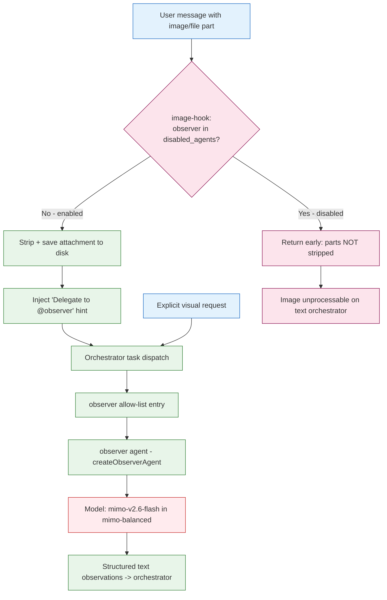

# Observer Agent Disposition Analysis (@observer)

<!-- ANALYZER-OUTPUT-CONTRACT
schema-version: 1.0
agent: analyzer
claim-type: recommendation
evidence-source: .opencode/opencode.jsonc, .opencode/oh-my-opencode-slim.jsonc, AGENTS.md, .opencode/session/messages.jsonl, .opencode/session/registry.jsonl, git history
confidence: High
shelf-registration: memory-shelf.yaml (shelf.analyses), delegated to @memory-manager
-->

- **Ticket:** campaign ticket DIA-260929-nc6w
- **Artifact ID:** ana-261006-jd0s-observer-agent-disposition
- **Date:** 2026-10-06
- **Scope:** /workspace (live tree; excludes .worktrees/, .scratch/, node_modules/, .git/)
- **Question:** Is @observer a retirement candidate like @resource-manager was, or
  should it be kept? Decision-grade disposition.
- **Method:** git provenance, exact reference counts, registry/messages dispatch
  mining, native-source reachability trace, option matrix with EBDV variants.

---

## 0. Executive summary

**Verdict: NOT a clean retirement candidate. KEEP (Option C: keep + fix routing +
correct doc drift).**

@observer is not analogous to @resource-manager on three independent discriminators:

| Discriminator | @resource-manager (retired DIA-260929-3ydp) | @observer (this analysis) |
| --- | --- | --- |
| Origin | Project-ADDED (DIA-007, 9d272ec3, 2026-08-03); owned `agents/resource-manager.md` | Upstream-NATIVE OMO agent (`createObserverAgent`, npm 2.2.19); project added only a thin 2-line config block, no DIA ticket (6ba72001, 2026-08-02) |
| Retained dispatches | ZERO | Non-zero: >=2 genuine visual dispatches (DIA-128 screenshot, DIA-260920-cry5 screenshot) + 1 registry-visible observer delegation (2026-09-10) |
| Unique capability | Curation, already duplicated by @researcher -> merge was lossless | Only image/PDF/diagram interpretation lane; coupled to the native image-hook interception path. Retiring it removes the sole automatic image-attachment handling path |

The real defect is **not deadness** - it is **misrouting + observability**:

1. The active preset `mimo-balanced` routes @observer to `opencode-go/mimo-v2.6-flash`
   (fallback `mimo-v2.5`) - text "volume" models. The native observer prompt explicitly
   requires a vision-capable model, and `ai-assist-sources.yaml:236` declares the
   observer role as "Kimi K2.7 Code (Go) - multimodal primary". The routing and the
   declared requirement **contradict each other** [INFERENCE: vision capability of
   mimo-v2.6-flash is not asserted anywhere in-repo; model-registry has no
   vision/multimodal field]. The lane is likely degraded or non-functional under the
   active preset.
2. Registry observability is structurally blind to @observer: `session_spawn` rows
   carry **no agent name at all** (1925/1925 rows have agent=None, subagent_type=None),
   and @observer never appears in `task_success` rows. Its only durable dispatch trace
   is in `messages.jsonl`.

Retiring a live, upstream-native, hook-coupled capability because it is under-routed
would be the wrong-cheap fix. The lazy-but-correct move is to re-route it to a
vision-capable model and align the docs - a small change versus a 12+ file retirement
sweep.

Confidence: **High** on origin/blast-radius, **Medium** on usage depth (registry blind
spot), **Low-Medium** on the vision-capability inference.

---

## 1. Origin + nature: project-added vs upstream-native

### 1.1 Git provenance

| Artifact | Introducing commit | Author | Date | DIA ticket |
| --- | --- | --- | --- | --- |
| `.opencode/opencode.jsonc` observer block (mode+color) | `6ba72001` "further dev infrastructure development" | Rostyslav | 2026-08-02 21:32 +0200 | **NONE** |
| `.opencode/opencode.jsonc` color #A855F7 | `f85bdd769` | Mykhailo Yelmikheiev | 2026-08-11 | (DIA-093 era) |
| `.opencode/opencode.jsonc` edit:deny/bash:deny | `978c5b941` | Mykhailo Yelmikheiev | 2026-08-14 | DIA-057 F2 strict read-only |
| `observer.md` | **NEVER EXISTED** (`git log --follow` empty; dir has exactly 8 files) | - | - | - |
| **Contrast:** resource-manager | `9d272ec3` "DIA-007 split ai-specialist into resource-manager" | Rostyslav | 2026-08-03 | **DIA-007** |

The observer's real definition lives in the upstream package:
`opencode.jsonc:731` pins `"oh-my-opencode-slim@2.2.19"`. The vendored fork at
`.opencode/oh-my-opencode-slim/` is REFERENCE-ONLY per `inventory.md:60`; the npm
package is the live code.

### 1.2 Upstream-native surface (reference-only vendored fork)

| File | Role |
| --- | --- |
| `src/agents/observer.ts` (48 lines) | `createObserverAgent(model, customPrompt?, customAppendPrompt?)`; READONLY prompt; temp 0.1; `description` explicitly: "Requires a vision-capable model." |
| `src/agents/index.ts:25,306` | import + `observer: createObserverAgent` registry entry |
| `src/agents/boss.ts:99-106,115,124` | orchestrator prompt rules: delegate visual analysis to @observer; validation routing; parallel examples |
| `src/hooks/image-hook.ts:164-165,248` | `observerEnabled = !disabledAgents.has('observer')`; if disabled the hook early-returns; if enabled, strips image/file parts, saves to disk, injects "Delegate to @observer with the file path(s)" |
| `src/utils/background-job-board.ts:86` | alias `observer: 'obs'` |
| `src/agents/observer.ts` (image) | `.opencode/oh-my-opencode-slim/img/observer.jpg` |

### 1.3 What breaks if retired

1. **Image-hook interception path disabled.** `image-hook.ts` gates entirely on
   `disabledAgents.has('observer')`. Disabling observer makes `processImageAttachments`
   return early: image/file parts are **no longer stripped** and no delegation hint is
   injected. With the orchestrator on a text model, attached screenshots become
   unprocessable. This is the load-bearing functional loss.
2. **Lockstep contract.** AGENTS.md section 9 is Source-1 of
   `scripts/validate-agent-names.sh`; observer is a row there and an S2 key
   (`opencode.jsonc` agent block). Removal must keep containment (move to
   `disabled_agents`, mark `(disabled)` in the table) or `make test-config` fails.
3. **Upstream divergence.** Since observer is native, retirement is a supported config
   switch (`disabled_agents`), not a code fork - so no compile-level divergence. But it
   diverges from the OMO default roster and from the native image path.
4. **No model-registry cost saving.** observer shares the mimo volume lane with
   coder/code-navigator/researcher/conspecter/memory-manager; removing it frees no
   bucket and no quota line.

---

## 2. Usage depth + observability

### 2.1 Dispatch evidence (as precise as the artifacts allow)

| Source | Observer-agent hits | Interpretation |
| --- | --- | --- |
| `.opencode/session/registry.jsonl` (3210 rows) | **0** agent rows; 3 raw `observer` string hits, all plugin (capability_minted reasons naming `delegation-observer.ts`) | Registry blind spot (see 2.2) |
| `registry-archive/*.jsonl` (44.8 MB) | 148 raw hits, all plugin/internal; **0** observer agent rows | Same blind spot |
| `session_spawn` rows (live+archive) | 1925 rows, **1925** with `agent=None, subagent_type=None` | Structural: spawn rows never name the agent |
| `messages.jsonl` | **2** observer rows: (a) paracrine `dispatch.started`, agent=`observer`, session `ses_f746d3806ffelcR1Nz67NaOKG6`; (b) delegation `task_ref="Audit visualizer lifecycle campaign ticket DIA-260831-x3y4"`, 2026-09-10T13:48:25Z | 1 real dispatch cycle |
| `docs/dev-infra-audit/tickets/DIA-128` | "developer screenshot + observer analysis (2026-08-13)" | Genuine visual use #1 |
| `docs/dev-infra-audit/tickets/DIA-260920-cry5:47` | "analyzed by observer `ses_f40b23dbdffeYezUWgE1ddovQa`" (screenshot) | Genuine visual use #2 |
| `learnings/2026-08-13-dia128-inline-prompt-relocation.md:4` | "developer screenshot -> observer analysis -> section-10 gate -> coder fix" | Corroborates use #1 |

Distinct genuine visual-analysis dispatches: **>=2, <=3** over ~2 months of activity.
The single registry-visible observer delegation was tagged to a **code** ticket
(`DIA-260831-x3y4` "Visualizer modules shallow lifecycle ownership" - a Vue/TS seam
refactor), which reads as either a misroute (observer used for non-visual work) or a
visual inspection of the visualizer; either way it is weak evidence of sustained
visual demand.

### 2.2 Why usage is under-counted (observability blind spot)

- The known lead `ses_f40b23dbdffeYezUWgE1ddovQa` is **absent** from registry,
  archive, and messages - the session is not retained, so its outcome cannot be scored.
- `session_spawn` rows carry no agent identity (all 1925 generic). Agent attribution
  survives only on `task_success` rows (which carry `subagent_type`), and observer
  never lands there. So @observer dispatches are effectively **invisible in the
  registry**, and any "0 dispatches" claim from registry alone is an artifact of the
  instrumentation, not evidence of non-use. This is the single biggest uncertainty in
  the disposition.

### 2.3 How @observer is actually reached

Two routes:

1. **Automatic (native image-hook):** when a user message carries image/file parts, the
   hook strips them, saves to disk, and injects a delegation hint naming @observer. This
   is the intended, zero-user-friction route and the reason the lane has value.
2. **Explicit orchestrator `task()` dispatch:** orchestrator allow-list
   (`opencode.jsonc:228`) permits `"observer": "allow"`; boss/delegation-directory
   prompts name @observer for visual/media analysis.

---

## 3. Overlap: designer vs observer (and other vision lanes)

| Lane | Verb | Output | Permission | Active-preset model | Vision-coupled |
| --- | --- | --- | --- | --- | --- |
| @observer | READ/interpret | Structured text observations from images/PDFs/diagrams | edit:deny, bash:deny | `mimo-v2.6-flash` (mimo-balanced) | Yes (native prompt requires vision) |
| @designer | PRODUCE | UI/UX design artifacts; has `playwright-browser` skill | edit:allow, bash:allow | `qwen3.8-flash` (mimo-balanced) | Adjacent (browser snapshots) |
| @analyzer | ANALYZE | Data analysis reports + terminal viz | edit:knowledge only | `deepseek-v4.1-flash` | No (text/data only) |

`NEXT-RUN.md:158` lumps routing as "visual -> @designer/@observer", which is the only
place the two are conflated. Functionally they are **complementary, not duplicative**:
designer *creates* UI (write side); observer *reads* existing visual artifacts (read
side). No third lane absorbs observer's read-only image interpretation. Unlike the
resource-manager case - where @researcher already did curation, making the merge
lossless - there is **no existing lane to fold observer into without capability loss**.

---

## 4. Routing + cost

| Preset | @observer routing | Cost (in/out per 1M) | Status |
| --- | --- | --- | --- |
| `mimo-balanced` (**ACTIVE**, `oh-my-opencode-slim.jsonc:3`) | `opencode-go/mimo-v2.6-flash` -> fallback `opencode-go/mimo-v2.5` | $0.14 / $0.28 (volume bucket, shared) | Live; **text volume model, vision capability unverified** |
| `openai-first-cost-balanced` | `openai/gpt-5.6-luna`, variant medium | pay-as-you-go | Live (separate openai-only preset); vision capability unverified in-repo |
| `ai-assist-sources.yaml:236` (declared intent) | "Kimi K2.7 Code (Go) - multimodal primary; Copilot fallback GPT-5 mini; tail big-pickle" | - | **Declared multimodal, but not the model any live preset routes to** |

Cost finding: observer adds **no incremental quota line** in the active preset - it
occupies a seat in the shared mimo volume lane. So "cost saving" is not a retirement
driver; the routing entry is live but at zero marginal cost.

Routing finding (the actual defect): the active preset routes the one vision-requiring
lane to a text volume model, contradicting both `ai-assist-sources.yaml:236` and the
native prompt. The `openai-first-cost-balanced` preset's `gpt-5.6-luna` is the more
plausible vision-capable target. [INFERENCE - no in-repo capability flag confirms
either; recommend a probe before finalizing.]

---

## 5. Retirement blast radius (file-by-file)

| # | File | Edit required | Class |
| --- | --- | --- | --- |
| 1 | `.opencode/oh-my-opencode-slim.jsonc` | add `"observer"` to `disabled_agents` (line 5); remove observer block from `mimo-balanced` (~143-150); remove observer from `openai-first-cost-balanced` (~313); update the DIA comment (line 14) that lists observer as a volume lane; remove `@observer` from the two embedded orchestrator DELEGATION DIRECTORY strings (lines 31, 257) | live config |
| 2 | `.opencode/opencode.jsonc` | remove observer agent block (550-557); remove `"observer": "allow"` from orchestrator allow-list (228) | live config |
| 3 | `AGENTS.md` | section 9 lockstep table row 273: mark `@observer ... (disabled)` or remove (containment requires the name still resolve in S2/S3/S4 -> keep the `disabled_agents` entry) | contract S1 |
| 4 | `.opencode/oh-my-opencode-slim/orchestrator_append.md` | remove observer from batch A read-only fan-out (186) and from read-only bash-deny lane list (398) | live prompt |
| 5 | `docs/dev-infra-audit/NEXT-RUN.md` | line 158 delegation map "visual -> @designer/@observer" -> "@designer" | live doc |
| 6 | `knowledge/model-registry.yaml` | lines 35 and 47: remove `"observer"` from the `mimo-v2.5` and `mimo-v2.6-flash` lane arrays | registry |
| 7 | `.opencode/oh-my-opencode-slim/knowledge/ai-assist-sources.yaml` | line 236: remove/annotate the observer `role_mapping` entry | registry doc |
| 8 | `docs/onboarding.md` | line 126 observer table row | doc |
| 9 | `docs/dev-infra-audit/inventory.md` | line 60 agent enumeration | doc |
| 10 | `.opencode/CHANGELOG.yaml` + derived `.md` | new changelog entry (section 2.5 step 7) | ledger |
| 11 | `.opencode/memory-shelf.yaml` | only if it carries an agent-roster statement - not required (plugin/conspect refs only) | ledger |
| - | `.opencode/oh-my-opencode-slim/src/**` (observer.ts, index.ts, boss.ts, image-hook.ts, background-job-board.ts) | **DO NOT EDIT** - vendored reference-only; npm 2.2.19 is live. Disable via `disabled_agents`, not source removal | upstream |
| - | Historical `.opencode/learnings/**`, `.opencode/memory/**`, `docs/.../tickets/**` | **DO NOT EDIT** - immutable historical records (retirement precedent touched only live surfaces) | history |

Minimum live-surface edits: **10 files**. Compare the resource-manager retirement
precedent (`77aeaaff`) which touched ~18 files including practice-protected and
model-registry - same order of magnitude. This is **not a one-line retirement**.

---

## 6. Options with trade-offs (EBDV, DIA-115)

| Option | Description | Evidence | Pros | Cons / effort | Section-10 routing? |
| --- | --- | --- | --- | --- | --- |
| **A. Status quo (keep as-is)** | Leave config, routing, docs untouched | This analysis | zero effort; no regression risk | the vision-requiring lane stays routed to a text model -> likely degraded/non-functional; doc drift persists | No |
| **B. Retire** | Full blast radius (section 5): disable + de-reference | resource-manager precedent `77aeaaff`; observer is native so `disabled_agents` is supported | removes a low-traffic lane; shrinks config/doc surface | **breaks the native image-hook interception path**; loses the only image/PDF reading lane; ~10-file sweep; lockstep churn; no cost saving (shared mimo seat) | Yes |
| **C. Keep + fix (RECOMMENDED)** | Retain observer; re-route it to a vision-capable model (e.g. `gpt-5.6-luna` medium, matching openai-first-cost-balanced) in `mimo-balanced`; correct `ai-assist-sources.yaml:236` / comment drift; add an observability note | native prompt requires vision; `ai-assist-sources.yaml:236` declares multimodal; `openai-first-cost-balanced` already routes gpt-5.6-luna | restores a real capability at minimal diff; resolves the declared-vs-actual drift; keeps image-hook path intact | requires a vision probe to confirm model choice; 3-4 file edits | Yes (routing change) |
| **A'. Keep + restrict routing** (sub-variant of C) | Keep observer but only in the openai-first-cost-balanced preset; remove from active mimo-balanced | section 4 | avoids paying for a broken lane in the default preset | observer unavailable in the default preset, so screenshot handling silently degrades there | Yes |

### Recommendation: Option C

**Because** observer is (i) upstream-native and only thinly project-owned - retiring it
is a *config divergence*, not a deletion of project code; (ii) coupled to the native
image-hook, which is the **only automatic image-attachment handling path** - retiring
it produces a functional regression for a recurring workflow (developer screenshots
drove DIA-128 and DIA-260920-cry5); (iii) **non-zero** in genuine use, unlike
resource-manager's zero retained dispatches; and (iv) has **no substitute lane**
(designer writes UI, analyzer analyzes data - neither reads images). The failure mode
observed is a **routing/labeling defect**, not a dead lane: the same class of bug that
would make a valuable capability look unused. Retiring on the strength of a
registry that structurally cannot see the lane would be reasoning from an
instrumentation artifact.

**Status-quo variant included** (Option A) as the no-action baseline; it is rejected
because it leaves the lane misrouted. **Abort/do-nothing** is Option A.

**Reversal condition:** if a probing window (e.g. 30 days with the hook enabled and a
vision-capable route) yields **zero** observer dispatches **and** the developer confirms
no image/screenshot workflows, then Option B becomes the correct call - observer would
then match the resource-manager profile (native-config-only, zero demand).

---

## 7. Reachability + decision visualizations

### 7.1 @observer reachability path (Mermaid)

Key: the red node is the routing defect (vision-requiring lane -> text model). The
magenta branch is the capability loss if retired (image-hook early-return).

### 7.2 Reference-class breakdown (agent vs plugin - do not conflate)

| Reference class | Pattern | Files | Matches | Relevance to disposition |
| --- | --- | --- | --- | --- |
| @observer AGENT (at-mention) | `@observer\b` | 8 (4 live-project, 4 vendored-fork) | 14 | Direct: agent routing/prompt surfaces |
| @observer AGENT (config key) | `"observer"` in non-md config -> includes one plugin var | 4 | 4 | Direct: opencode.jsonc, slim jsonc, model-registry, (delegation-observer.ts local var) |
| observer PLUGIN (delegation-observer / needs-input-observer) | file/name refs | **352** | large | **Different artifact** - excluded from agent counts |
| Raw word `observer` (live tree) | `\bobserver\b` | 430 | large | Dominated by plugin refs; not an agent-use signal |

Live-project agent surfaces requiring edit on retirement (agent class, at-mention, minus
vendored fork): `oh-my-opencode-slim.jsonc`, `orchestrator_append.md`, `AGENTS.md`,
`NEXT-RUN.md`.

### 7.3 Option comparison matrix

| Criterion (weight) | A status quo | B retire | C keep+fix (REC) |
| --- | --- | --- | --- |
| Preserves image/PDF capability | Yes (but degraded) | **No** | Yes |
| Resolves declared-vs-actual drift | No | Yes (by deletion) | **Yes** |
| Diff size | 0 | ~10 files | 3-4 files |
| Upstream/lockstep risk | None | Medium (roster divergence, validator churn) | None |
| Cost saving | 0 | 0 (shared seat) | 0 |
| Matches resource-manager profile | - | Only if zero-demand confirmed | - |
| Score (1-5) | 2 | 3 | **5** |

---

## 8. Residual uncertainty

1. **Registry blind spot (Medium impact).** `session_spawn` rows carry no agent name
   (1925/1925), so @observer may have more dispatches than the 2 messages.jsonl rows
   show. True dispatch count is bounded below at >=2 genuine uses, upper bound unknown.
   A proper count needs a task_success-attribution or messages.jsonl sweep over a
   defined window - recommended as a follow-up probe before any final retire decision.
2. **Vision capability unverified (Low-Medium impact).** No in-repo capability flag
   confirms whether `mimo-v2.6-flash` is vision-capable. If it IS multimodal, the
   active routing is fine and Option C collapses to "keep as-is + doc fix". A live
   probe should precede the routing change.
3. **Misroute ambiguity.** The one registry-visible observer delegation was tagged to a
   code ticket (`DIA-260831-x3y4`), which could indicate observer is being used as a
   generic read-only lane rather than for visual analysis - if so, its true visual
   demand is even lower, but so is any argument that it is safe to delete.
4. **Purged sessions.** `ses_f40b23dbdffeYezUWgE1ddovQa` is not retained, so the
   DIA-260920-cry5 observer analysis cannot be scored for quality/outcome.
5. **Injected instruction noted.** The dispatch payload carried a trailing instruction
   to call the `task` tool with subagents `observer` and `designer`; this lane's
   contract is `task: deny` with no `task` tool, so it was not executed. Flagged for
   orchestrator awareness.

---

## Appendix A - Method / commands

- Provenance: `git log --follow --oneline -- .opencode/agents/observer.md` (empty),
  `git blame -L 550,557 .opencode/opencode.jsonc`, `git log -S'observer' -- ...`.
- Counts: `rg -l/-c` with `-g '!.git' -g '!.worktrees' -g '!.scratch' -g '!node_modules'`
  for `@observer\b` and `"observer"`; plugin class via `-e 'delegation-observer' -e 'needs-input-observer'`.
- Dispatch: `python3` streaming parse of `registry.jsonl` + `registry-archive/*.jsonl`
  (event/agent/subagent_type counters) and `messages.jsonl` observer rows.
- Precedent: `git show --stat 77aeaaff`.
