# Post-Rebase Audit: omo-slim-changes

| Metadata     | Value                                                |
|--------------|------------------------------------------------------|
| Branch       | omo-slim-changes                                     |
| Base         | origin/omo-slim-changes @ 56cc42b                    |
| Head         | f87df23 (6 rebased commits: d026a52..f87df23)       |
| Audit date   | 2026-08-11                                           |
| Checks run   | 19                                                   |
| PASS         | 13                                                   |
| FAIL         | 3                                                    |
| WARN         | 3                                                    |

---

## Summary Table

```
 #  Check                          Severity  Status
---  ----------------------------  --------  ------
 1  No conflict markers           --        PASS
 2  JSONC validity                --        PASS
 3  JSON/YAML validity            HIGH      FAIL
 4  All agents present            MEDIUM    WARN
 5  openspec-plan agent block     --        PASS
 6  Permission tiers match        LOW       WARN
 7  No ghost agents               --        PASS
 8  Plugin ref                    --        PASS
 9  No dangling skill refs        HIGH      FAIL
10  No duplicate skills           LOW       WARN
11  delegation-observer compiles  --        PASS
12  OMO dist up-to-date           --        PASS
13  pnpm-lock.yaml                --        PASS
14  AGENTS.md consistency         --        PASS
15  validate-agent-names.sh       --        PASS
16  Git state                     --        PASS
17  No orphan files               --        PASS
18  analyzer.md tier              --        PASS
19  Memory shelf integrity        HIGH      FAIL
```

---

## Detailed Findings

### Check 1: No Conflict Markers -- PASS

Searched all tracked files for `<<<<<<<`, `=======` (line-start), `>>>>>>>`.

Only matches are legitimate ASCII separator lines in source comments (e.g.
`// ====...====` in test files and FlatBuffers schemas). Zero actual conflict
markers found.

- **Verdict:** Clean rebase, no unresolved conflicts.

---

### Check 2: JSONC Validity -- PASS

Validated with comment-stripping parser (handles `//` and `/* */` without
breaking URLs containing `//`):

| File                                | Status |
|-------------------------------------|--------|
| `.opencode/opencode.jsonc`          | OK     |
| `.opencode/oh-my-opencode-slim.jsonc` | OK   |

---

### Check 3: JSON/YAML Validity -- FAIL [HIGH]

| File                                              | Status |
|---------------------------------------------------|--------|
| `package.json`                                    | OK     |
| `.opencode/oh-my-opencode-slim/...schema.json`    | OK     |
| `.opencode/memory-shelf.yaml`                     | FAIL   |

**YAML parse error at line 154:**

```
expected <block end>, but found '-'
  in ".opencode/memory-shelf.yaml", line 154, column 5
```

**Root cause:** The "Post-Cherry-Pick Audit" entry at line 154 is indented
with 4 spaces (`    - name:`) instead of 2 spaces (`  - name:`). This makes
it a nested element inside the previous "Telemetry Re-Entrancy Audit" entry
instead of a sibling list item.

```
Line 141 [2sp]:   - name: Telemetry Re-Entrancy Audit    # correct: list item
Line 152 [4sp]:     path: ...                             # correct: field of item
Line 153 [4sp]:     created: 2026-08-08                   # correct: field of item
Line 154 [4sp]:     - name: "Post-Cherry-Pick Audit..."   # BUG: should be [2sp]
Line 155 [6sp]:       description: ...                    # cascading wrong indent
Line 156 [6sp]:       path: ...                           # cascading wrong indent
Line 157 [6sp]:       created: 2026-08-11                 # cascading wrong indent
```

**Impact:** The entire memory shelf is unparseable. Any tool or agent reading
memory-shelf.yaml will fail. The Post-Cherry-Pick Audit entry and everything
after it is structurally broken.

**Fix:** Dedent lines 154-157 by 2 spaces so the entry becomes a sibling of
the Telemetry entry (2-space indent for `- name:`, 4-space for fields).

---

### Check 4: All Agents Present -- WARN [MEDIUM]

#### 4a. opencode.jsonc agent block

All 18 active agents from AGENTS.md 9 are present. The 4 exempt agents
(oracle, fixer, explorer, librarian) are correctly absent from opencode.jsonc
and listed in OMO `disabled_agents`.

**No ghost agents.** Zero agents in opencode.jsonc that are not in AGENTS.md 9.

#### 4b. Preset coverage

Three presets: `opencode-go`, `cebula`, `free`. Each has 15 agent keys.

**Missing from ALL presets (not disabled):** `council`, `explore`, `general`

| Agent      | In opencode.jsonc | In disabled_agents | In any preset | Notes                          |
|------------|-------------------|--------------------| --------------|--------------------------------|
| council    | YES               | NO                 | NO            | Dispatched via task allow-list |
| explore    | YES               | NO                 | NO            | AGENTS.md says "disabled"      |
| general    | YES               | NO                 | NO            | AGENTS.md says "disabled"      |

**Analysis:**
- `council` is not a preset agent -- it is dispatched by the orchestrator
  via `task: {council: allow}`. Not being in presets may be intentional
  (council is spawned dynamically, not a persistent preset member). **LOW.**
- `explore` and `general` are documented as "Built-in OpenCode (disabled)"
  in AGENTS.md 9 but have **no `disabled: true` field** in opencode.jsonc
  and are **not in OMO disabled_agents**. They exist as empty agent blocks.
  This is inconsistent: they should either be disabled or removed from
  opencode.jsonc. **MEDIUM.**

**Recommended fix:** Add `explore` and `general` to `disabled_agents` in
oh-my-opencode-slim.jsonc, or add `disabled: true` to their opencode.jsonc
blocks, matching what AGENTS.md claims.

---

### Check 5: openspec-plan Agent Block -- PASS

```json
{
  "mode": "subagent",
  "model": "opencode-go/qwen3.7-plus",
  "permission": {
    "edit": { "*": "deny", "openspec/*": "allow" },
    "bash": { "openspec": "allow", "*": "deny" }
  }
}
```

All required fields verified:
- mode: subagent
- model: opencode-go/qwen3.7-plus
- edit: scoped deny/allow to openspec/*
- bash: scoped allow to openspec, deny rest
- Orchestrator task allow-list: `"openspec-plan": "allow"` -- confirmed

---

### Check 6: Permission Tiers Match practice-protected.md -- WARN [LOW]

Cross-referenced every tiered agent against practice-protected.md 6:

| Agent            | Expected Tier       | edit              | bash              | task     | Status |
|------------------|---------------------|-------------------|-------------------|----------|--------|
| architector      | pure-analyst        | deny              | deny              | deny     | OK     |
| ai-specialist    | pure-analyst        | deny              | curl/wget allow   | deny     | OK (*) |
| reviewer         | pure-analyst        | deny              | deny              | deny     | OK     |
| analyzer         | artifact-producer   | knowledge/*       | allow             | deny     | OK     |
| conspecter       | artifact-producer   | knowledge/*       | curl/wget/traf    | NOT SET  | WARN   |
| resource-manager | artifact-producer   | omo/knowledge/*   | curl/wget/traf    | allow    | OK (**) |
| openspec-plan    | artifact-producer   | openspec/*        | openspec allow    | NOT SET  | OK     |
| coder            | executor            | NOT SET           | snip deny         | NOT SET  | OK     |
| designer         | executor            | NOT SET           | NOT SET           | NOT SET  | OK     |

(*) ai-specialist bash curl/wget is explicitly allowed by practice-protected.md
note for read-only web research.

(**) resource-manager task:allow is explicitly allowed by practice-protected.md
note for dispatching researcher/conspecter.

**Issues:**
- `conspecter` has no explicit `task` field. analyzer (same tier) has
  `task: deny`. If the default is deny, functionally equivalent but
  inconsistent. **LOW** -- recommend adding `task: deny` for clarity.
- `coder`, `designer`, `openspec-plan` have no explicit `task` field.
  Same inconsistency. Low risk if default is deny.

---

### Check 7: No Ghost Agents -- PASS

Zero agents in opencode.jsonc that are not listed in AGENTS.md 9.

Councillor variants (councillor, councillor-claude-sonnet-4.5,
councillor-deepseek, councillor-gemini-3.1-pro, councillor-gpt-5.3-codex,
councillor-qwen3.7-plus) exist only in the orchestrator task allow-list,
not as agent blocks. These are internal-only and expected.

---

### Check 8: Plugin Ref -- PASS

Plugin array in opencode.jsonc:

```
1. envsitter-guard@0.0.4
2. @tarquinen/opencode-dcp@3.1.14
3. file:///workspace/.opencode/oh-my-opencode-slim     <-- local fork
4. file:///workspace/.opencode/plugins/delegation-observer.ts
```

Local fork reference confirmed. No npm registry reference for OMO.

---

### Check 9: No Dangling Skill Refs -- FAIL [HIGH]

**22 unique skill references** extracted from all 3 presets. Of these:

| Skill               | Referenced By (all 3 presets)         | SKILL.md exists? |
|---------------------|---------------------------------------|------------------|
| teaching            | architector, openspec-plan,           | NO               |
|                     | ai-specialist, ai-auditor, analyzer   |                  |
| mermaid-diagramming | architector, analyzer, researcher     | NO               |
| console-charting    | architector, analyzer                 | NO               |

All other 19 skill refs resolve to existing SKILL.md files.

**Note on `*` and `!openspec-propose`:** These are skill filter patterns
(wildcard include / negation exclude) in the orchestrator agent config,
not actual skill names. Not dangling refs.

**Impact:** When these agents are dispatched with these skill names, the
skill loader will fail to find the SKILL.md files. This could cause:
- Silent skill non-loading (if the loader tolerates missing skills)
- Agent dispatch failures (if the loader is strict)

**Recommended fix:** Either create the missing skill directories with
SKILL.md files, or remove the references from the presets.

---

### Check 10: No Duplicate Skills -- WARN [LOW]

| Skill                          | Location 1                              | Location 2                              | Identical? |
|--------------------------------|-----------------------------------------|-----------------------------------------|------------|
| finishing-a-development-branch | .opencode/oh-my-opencode-slim/src/skills/ | /app/.config/opencode/skills/           | YES        |

Same SKILL.md content (1514 bytes both). The `/app/` copy is from the
container image build; the `.opencode/` copy is from the repo. Not harmful
but redundant -- OpenCode may load either one.

**Recommended fix:** Remove the duplicate from one location. If the repo
copy is canonical, the image should not bake in a second copy.

---

### Check 11: delegation-observer.ts Compiles -- PASS

```
$ bun build delegation-observer.ts --outfile=/tmp/do-test.js
Bundled 79 modules in 37ms
  do-test.js  1.38 MB  (entry point)
```

Clean compile, no errors.

---

### Check 12: OMO Dist Up-to-Date -- PASS

| Artifact                   | mtime (unix)  | mtime (human)           |
|----------------------------|---------------|-------------------------|
| dist/index.js              | 1786453764    | 2026-08-11 13:09:24 UTC |
| Latest src/ file           | 1786452403    | 2026-08-11 ~12:46 UTC   |

dist/index.js is **1361 seconds (23 min) newer** than the latest source
file. Dist is up-to-date.

---

### Check 13: pnpm-lock.yaml -- PASS

- `typescript-eslint` references: 122 occurrences in lockfile
- `@8.67.0` version references: 28 occurrences
- Both `@typescript-eslint/eslint-plugin@8.67.0` and
  `@typescript-eslint/parser@8.67.0` are present as resolved entries.

---

### Check 14: AGENTS.md Internal Consistency -- PASS

| Workflow Path                              | Expected Agent     | Found? |
|--------------------------------------------|--------------------|--------|
| 2.2 Feature Spec interview gate            | @openspec-plan     | YES    |
| 2.3 Implementation                         | @coder             | YES    |
| 2.3 Review                                 | @reviewer          | YES    |
| 2.3 Persist                                | @memory-manager    | YES    |
| 2.5 Config change Gate                     | @ai-specialist     | YES    |
| 2.5 Config change Independent review (6)   | @ai-auditor        | YES    |
| 2.5 Review matrix dev-infra                | @reviewer          | YES    |
| 2.5 Review matrix opencode config           | @ai-auditor        | YES    |
| 3 Design Authority .sdd/ reference         | .sdd/              | YES    |
| 3 Design Authority .tss/ reference         | .tss/              | YES    |

2.5 correctly uses @ai-specialist for read-only Gate research and
@ai-auditor for the independent review step. Not swapped.

---

### Check 15: validate-agent-names.sh -- PASS

```
ok: orchestrator
ok: architector
... (22 total)
ok: librarian

22 passed, 0 failed, 0 warnings
```

---

### Check 16: Git State -- PASS

```
$ git rev-list --count origin/omo-slim-changes..HEAD
6
$ git rev-list --count HEAD..origin/omo-slim-changes
0
```

Branch is ahead by exactly 6 commits, zero behind. No divergence. Working
tree clean (no uncommitted changes).

Commits:
```
f87df23 fix: absolute path for delegation-observer plugin
73bae47 fix: openspec-plan edit scope + pnpm-lock.yaml regeneration
411a7d7 fix(analyzer): F3 -- pure-analyst to artifact-producer tier
f85bdd7 fix: T4 -- S2 permission blocks for unscoped agents
21b0097 fix: T6-T9 audit fixes + OMO rebase artifacts
d026a52 fix: dev env bring-up and plugin hygiene
```

---

### Check 17: No Orphan Files -- PASS

- No `.orig`, `.bak`, `.backup`, `MERGE_`, or `BACKUP_` files in tracked files.
- No untracked files in working tree.
- 20 knowledge/ directories on disk, 20 referenced in memory-shelf.yaml.
  Zero orphans in either direction.

---

### Check 18: analyzer.md Tier Declaration -- PASS

```yaml
---
description: Analysis reports and terminal visualization. Artifact-producer tier...
mode: subagent
---
```

Frontmatter declares artifact-producer tier. Body confirms:
- `edit: knowledge/* + .opencode/memory-shelf.yaml (allow), else deny`
- `bash: allow`
- `task: deny`

No phantom `token_*:deny` claim found. Clean.

---

### Check 19: Memory Shelf Integrity -- FAIL [HIGH]

**Two issues found:**

#### 19a. YAML parse error (same as Check 3)

Line 154 indentation bug breaks the entire file. See Check 3 for details.

#### 19b. Dangling path reference

```
[MISSING] openspec/changes/ai-self-improvement-auditor-and-cleanup/
```

This path is referenced in memory-shelf.yaml under `shelf.specs` but the
directory does not exist on disk. The openspec change was likely archived
or deleted without updating the shelf entry.

#### 19c. Multiline path artifacts

Two entries appear to be continuation-line artifacts from YAML folding:
```
[MISSING] \
[MISSING] scripts/__tests__/audit-agent-tool-coverage.bats.\
```

These are likely part of a multiline description that got misinterpreted
as a path due to YAML structure issues. They contribute to the parse error.

---

## Severity Summary

```
 HIGH   3 issues
  - memory-shelf.yaml YAML parse error (checks 3, 19)
  - 3 dangling skill refs: teaching, mermaid-diagramming, console-charting (check 9)
  - Dangling shelf path: ai-self-improvement-auditor-and-cleanup (check 19)

 MEDIUM 1 issue
  - explore/general in opencode.jsonc but not disabled anywhere (check 4)

 LOW    3 issues
  - finishing-a-development-branch duplicate across skill dirs (check 10)
  - conspecter missing explicit task: deny (check 6)
  - openspec-plan/conspecter missing explicit task field (check 6)
```

---

## Recommended Fix Priority

1. **[HIGH] Fix memory-shelf.yaml indentation** -- Dedent lines 154-157 by
   2 spaces. Remove or fix the dangling `ai-self-improvement-auditor-and-cleanup`
   path entry. Clean up multiline artifacts.

2. **[HIGH] Resolve dangling skill refs** -- Create SKILL.md files for
   `teaching`, `mermaid-diagramming`, and `console-charting`, OR remove
   them from all preset agent configs in oh-my-opencode-slim.jsonc.

3. **[MEDIUM] Disable explore/general** -- Add to `disabled_agents` in
   oh-my-opencode-slim.jsonc or add `disabled: true` in opencode.jsonc,
   matching AGENTS.md documentation.

4. **[LOW] Add explicit task: deny** -- To conspecter, openspec-plan, coder,
   designer blocks for consistency with analyzer.

5. **[LOW] Remove duplicate skill** -- Remove `finishing-a-development-branch`
   from either `/app/.config/opencode/skills/` or
   `.opencode/oh-my-opencode-slim/src/skills/`.

---

## Mermaid: Issue Dependency Graph

```mermaid
graph TD
    A[memory-shelf.yaml YAML error] --> B[Check 3: YAML validity FAIL]
    A --> C[Check 19: Shelf integrity FAIL]
    A --> D[All shelf consumers broken]
    
    E[3 missing skills] --> F[Check 9: Dangling refs FAIL]
    E --> G[Agent skill loading may fail]
    
    H[explore/general not disabled] --> I[Check 4: Agent presence WARN]
    H --> J[AGENTS.md says disabled but config disagrees]
    
    K[conspecter task field missing] --> L[Check 6: Tier consistency WARN]
    K --> M[Functionally OK if default is deny]
    
    N[Duplicate skill] --> O[Check 10: Duplicate WARN]
    N --> P[No functional impact]
    
    style A fill:#f44,stroke:#333,color:#fff
    style E fill:#f44,stroke:#333,color:#fff
    style H fill:#ff9,stroke:#333
    style K fill:#ff9,stroke:#333
    style N fill:#ff9,stroke:#333
```



---

## Conclusion

The rebase itself was clean (no conflict markers, git state correct, all 6
commits intact, validate-agent-names.sh passes 22/22). The three HIGH
severity issues are all pre-existing or introduced during the commit chain
rather than being rebase artifacts:

1. The memory-shelf YAML indentation bug was introduced in commit that added
   the Post-Cherry-Pick Audit entry (likely the cherry-pick audit commit).
2. The missing skills (teaching, mermaid-diagramming, console-charting) were
   referenced in presets before the rebase and remain unresolved.
3. The dangling shelf path is a stale reference from a deleted openspec change.

The branch is safe to push after fixing the HIGH issues. The MEDIUM and LOW
issues can be addressed in a follow-up commit.
