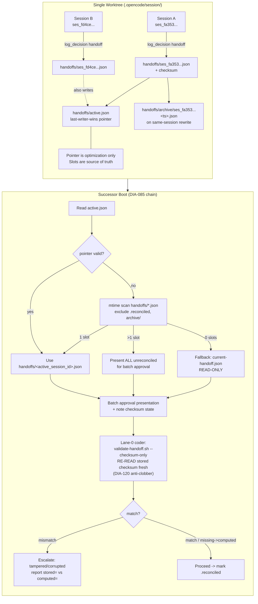

# Session Handoff, Context Thresholds, Auto-Compaction & Orchestrator-Model Audit

<!-- ANALYZER-OUTPUT-CONTRACT
schema-version: 1.0
agent: analyzer
claim-type: finding
evidence-source: .opencode/plugins/delegation-observer.ts
confidence: High
shelf-registration: memory-shelf.yaml (shelf.analyses), delegated to @memory-manager
-->

> Campaign ticket DIA-260822-medh — read-only advisory audit. No files edited except this report. All claims cite file:line.

## Executive Summary

The repo's session-handoff and context-management machinery is **converging** after a
dense August remediation cycle (DIA-080 / DIA-191 / DIA-198 / DIA-260822-medh) but
retains two structural seams where documentation, plugin code, and prompts can drift.
Handoff coordination across parallel orchestrator sessions is correctly isolated by
DIA-085 per-session slots; the 15%/25% self-rerun thresholds are now reconciled
across NEXT-RUN.md, the `context_usage` tool output, and the OMO prompt drift-checker
after DIA-198; auto-compaction is correctly delegated to OpenCode's native
`compaction.auto` with an advisory adaptive layer at 60%/85% — but the older
50/80/95 pressure-gate remains as dead code (`getContextPressure() -> 0`). The
orchestrator currently runs the promo preset
`["opencode-go/hy3", "opencode-go/deepseek-v4-flash"]`, which is economically
rational but has no independent benchmark entry in the registry — recommendation
strength would improve with an external model-comparison refresh.

---

## 1. Session Handoffs

### 1.1 DIA-085 Parallel-Handoff-Slots Protocol

| Concern | Mechanism | Evidence |
|---|---|---|
| Slot isolation | Each session owns `handoffs/<session-id>.json` — parallel writes never clobber | `delegation-observer.ts:1746-1805` `atomicWriteHandoff()` — slot = `<id>.json`, tmp+fsync+rename |
| Archive-on-overwrite | Same-session rewrite archives prior content to `handoffs/archive/<id>.<ts>.<uuid>.json` | `delegation-observer.ts:1768-1798` |
| Pointer optimization | `handoffs/active.json` stores `active_session_id` (last-writer-wins) | `delegation-observer.ts:1835-1854` |
| Boot resolution chain | `active.json` -> `<id>.json` -> mtime-scan -> legacy fallback | `NEXT-RUN.md:14-26` |
| Legacy fallback | `.opencode/session/current-handoff.json` — READ-ONLY, writer never touches | `delegation-observer.ts:836`, `NEXT-RUN.md:23` |
| Sidecar | `.reconciled` prevents re-presentation of approved prognoses | `NEXT-RUN.md:396-401`, `delegation-observer.ts:840` |

**Current filesystem state (read-only inspection 2026-09-01):**

```
.opencode/session/handoffs/
  active.json                          -> ses_fa353158effeyi0Yzlx594c6j1 (2026-09-01T11:47Z)
  ses_fa353158... .json                 prognosis: DIA-260901-r0hx CLOSED, checksum 64-hex present
  ses_fd4cef8d... .json                 2026-08-24
  ses_fdd4d351... .json                 2026-08-22
  ... 11 more slots
  archive/                             36 entries (oldest 2026-08-21)
  .reconciled                          ABSENT (no file on disk)
```

The 13 slots + 36 archive entries demonstrate the archive guard working — no
content loss on same-session rewrites. The missing `.reconciled` file is
expected when the most recent slot (`ses_fa353...`) has not yet been through a
successor's batch-approval cycle (the successor is the current advisory audit);
it is created in `NEXT-RUN.md:396-401` step 9 only after approval.

### 1.2 Batch-Approval Boot Gate

```
Candidate slot = resolution chain (§1 Boot Sequence, NEXT-RUN.md:14-44)
         |
         v
  prognosis field present + populated subsections?
         | yes
         v
  log_decision(event_type:'decision', resolution_status:'acknowledged',
               content_ref:'handoff-detected', task_ref:'batch-approval-gate')
         |
         v
  PRESENT all 5 subsections as a batch
  (session_summary / fixes_applied / open_tickets /
   verification_request / resume_instructions)
         |
         v
  Developer approves per item -> rejected become new open_tickets
         |
         v
  LANE-0 checksum delegation BEFORE any verification_request item
         |
         v
  log_decision(... 'batch-approval-complete') -> begin work
  -> append session_id to .reconciled
```

The gate is **inversion-correct**: the orchestrator (which has `bash: deny` per
`opencode.jsonc:145-146` DIA-093) does NOT compute the checksum itself — it only
notes the `checksum` field state (present/null/missing) at presentation time
`NEXT-RUN.md:27-28`. Computation is delegated to a lane-0 coder running
`scripts/validate-handoff.sh --checksum-only <resolved-slot-path>`.

**Mermaid — handoff coordination across parallel orchestrator sessions:**



**Finding:** the design is resilient to parallel writers because slot filenames
are session-unique — the pointer being last-writer-wins does not lose data
(`NEXT-RUN.md:320-325` explicitly calls this out). Worktree-based true
parallelism (`NEXT-RUN.md:318-319`) isolates `.opencode/session/` entirely,
which is the stronger guarantee and is correctly preferred in the guidance.

### 1.3 Lane-0 Checksum Delegation (DIA-093 / DIA-120)

| Property | Implementation | Evidence |
|---|---|---|
| Who may write handoff | ONLY the plugin via `log_decision(handoff, ..., JSON.stringify(prognosis))` — computes checksum atomically | `NEXT-RUN.md:279-280`, `delegation-observer.ts:1407` `atomicWriteHandoff` |
| Who may NOT write | Orchestrator has no bash; lane-0 lane is VERIFICATION ONLY and must not edit the file | `NEXT-RUN.md:371-390` |
| Re-read discipline | At comparison time, re-read the stored checksum fresh — never compare against boot-time memorized value | `NEXT-RUN.md:352-356`, `NEXT-RUN.md:385` |
| Checksum scope | SHA256 over canonical JSON of the `prognosis` object only (stable key ordering via `jq -c`) | `delegation-observer.ts:1686-1707` `computeChecksum()` |
| Archive before overwrite | Prior same-session slot archived before temp+rename | `delegation-observer.ts:1768-1798` |

Historical note: the pre-DIA-120 path allowed manual file writes; DIA-120
hardened it to plugin-only and added the re-read guard for the secondary
finding where the file was rewritten between boot read and lane-0 comparison.

---

## 2. Context Thresholds

### 2.1 Threshold Lineage (DIA-191 -> DIA-198 -> DIA-260822-medh)

```
DIA-080 (2026-08-11)  cumulative proxy  ~100% fixed -> session-scoped
DIA-191 (2026-08-15)  48% proxy vs 23% TUI (~2x overestimate) CLOSED
  - root cause: sessionCount*10000 term = 70% of overestimate
  - fix commit f18281f: formula -> delegation*5000 + message*500 + 30000 flat
  - thresholds retuned 30/50 -> 15/25 in NEXT-RUN.md + context_usage output
DIA-198 (2026-08-16)  reconciled OMO prompts + drift-checker marker 30/50 -> 15/25
  - 3 presets x 8 markers -> byte-identical now
  - tool description documents threshold_15pct/threshold_25pct
DIA-260822-medh (2026-08-22)  adds adaptive 60%/85% advisory layer over native
  - replaces the dead 50/80/95 pressure gate (getContextPressure()->0)
  - compaction detected via experimental.compaction.autocontinue
```

**Current reconciled state (verified 2026-09-01):**

| Surface | Value | Evidence |
|---|---|---|
| `NEXT-RUN.md` primary / safety-net | `>=15%` / `>=25%` (all occurrences) | `NEXT-RUN.md:81-82,99-100,238-239` + `DIA-191:150-153` |
| `context_usage` tool output fields | `threshold_15pct` (>=15%) / `threshold_25pct` (>=25%) + velocity crisis/emergency | `delegation-observer.ts:4698-4927` |
| Measurement | Direct live read: last completed assistant message tokens / model `limit.context` (TUI-equivalent) | `delegation-observer.ts:2700-2716` `measureUsageFraction()` |
| Fallback | `delegationCount*5000 + messageCount*500 + 30000` (session-scoped, ~7% under TUI at ref snapshot) | `delegation-observer.ts` estimator, `DIA-191:157-160` |
| OMO prompt summaries (3 presets) | `threshold 15% (primary) / 25% (safety-net)` per NEXT-RUN.md | `.opencode/oh-my-opencode-slim.jsonc:418/433/686` promo preset prompt |
| Drift-checker marker | `THRESHOLD_MARKER="15% (primary)"` (token `threshold-15-25`) | `scripts/check-orchestrator-prompt-drift.sh:61,70` |
| `make test-config` gate | 57/57 pass at last DIA-260901-r0hx implementation | `ses_fa353...` prognosis verification_request |
| `check-orchestrator-prompt-drift.sh` | exit 0: 3 presets x 8 markers, byte-identical | `DIA-198:118-119` |

**What DIA-198 closed:** the inline prompt summaries at
`.opencode/oh-my-opencode-slim.jsonc:26/209/433`, the drift-checker internal
token `threshold-30-50 -> threshold-15-25`, and the `context_usage` tool
description single-threshold framing. `grep -n "30%\|50%"` across those four
files returns empty post-fix.

### 2.2 The Nonfunctional Pressure Gate — A Live Inconsistency

The adaptive layer at `delegation-observer.ts:2190-2251` defines:

```ts
CONTEXT_PRESSURE_THRESHOLDS = { NORMAL:0.5, STRESSED:0.5, CRITICAL:0.8, BLOCKING:0.95 }
function getContextPressure(): number { return 0 }  // PLACEHOLDER
function applyResourcePressure(dispatch) { /* appends YAGNI or throws */ }
```

Because `getContextPressure()` unconditionally returns `0`, the four-tier
50/80/95 logic **never fires**. This is not a latent risk — it is a dead code
path that the DIA-260822-medh openspec explicitly retires in favor of the
async `runContextPolicy()` at `delegation-observer.ts:2724-2803` (60%
warning, 85% /compact, post-compaction 85% handoff via
`session.status` lifecycle + `measureUsageFraction()`).

The dead code is documented in a conspect as an advisory finding
(`res1-context-handoff-orchestration-strategy:3`) but still ships in the
plugin bundle. It does not break runtime (returns normal) but does mislead
code readers and static auditors.

### 2.3 Threshold Semantics — 15%/25% vs Native Compaction at 96-99%

| Layer | Trigger | Nature | Conflict? |
|---|---|---|---|
| `compaction.auto` (OpenCode native) | ~96-99% per `opencode.jsonc:18-22` (`auto:true, prune:true, reserved:16000`) | Automatic, token-accurate, prune+LLM summary | No |
| `context_usage` self-rerun guidance | 15% primary / 25% safety-net per `NEXT-RUN.md:81-82` | Advisory: orchestrator should handoff + fresh session | Intentionally early |
| Adaptive policy (new) | 60% readiness + 85% compaction / post-compact handoff per `delegation-observer.ts:2724` | Advisory events + tuiSafeWarn | Bridges the gap |

The 15% threshold is **intentionally conservative** relative to native
compaction. The conspect `res1` critiques a *fixed 15% forced self-rerun* as
lacking external support (external agents compact at 85-90% per the showdown
table). The local design is not a forced kill at 15% — it is a *prognosis
discipline* asking the orchestrator to consider a fresh session before rot
accumulates (Liu et al. "Lost in the Middle", Anthropic session management).
The validator for this choice is `context_usage` direct-read accuracy
(`DIA-191:208-214` — three-depth verification all within 7.7% of TUI).

---

## 3. Auto-Compaction

### 3.1 When/How It Triggers

| Property | Value | Evidence |
|---|---|---|
| Native trigger | `context_limit - max(requested_output, buffer)` with defaults `keep.tokens:15000, buffer:20000` per OpenCode docs | `res1:OpenCode Compaction section` |
| Config | `compaction: { auto:true, prune:true, reserved:16000 }` | `.opencode/opencode.jsonc:18-22` (DIA-045 F21: 10000->16000) |
| Mechanics | prune-first (retain 40k tokens, protect last 2 user turns) then 5-heading LLM summary; auto-replays last user message | `res1:Justin3go/OpenCode` |
| Detection for state | `experimental.compaction.autocontinue` hook (not polling) | `delegation-observer.ts:3938-3999`, `openspec/changes/dia-260822-medh` |
| Adaptive layer | Drains via `measureUsageFraction()` + `lastContextUsage` map; velocity crisis >15%/cycle, emergency >25%/cycle tracked separately | `delegation-observer.ts:4694-4927` |

`reserved:16000` aligns with 1M-context models (validated via
`opencode.jsonc:21`). The adaptive policy reuses `lastContextUsage` as the
previous-fraction store rather than duplicating state
(`delegation-observer.ts:898-900`).

### 3.2 Interaction with Handoff Writing

```
Native compaction (96-99%)        Self-rerun (15%/25%)          Adaptive (60%/85%)
        |                                  |                             |
   prune+summary                      log_decision handoff           60% warn (rate-limited)
   (internal, no                     (plugin atomically writes    85% -> /compact (first time)
    handoff file)                     slot + active.json)         85% post-compact -> new session
        |                                  |                             |
        +------> experimental.compaction.autocontinue fires
                         |
                    delegation-observer marks contextPolicyState.compacted = true
                    next 85% crossing emits context-new-session-post-compact
                    (no forced API: manual /compact + handoff)
```

**No write contention:** native compaction does not write the handoff file; the
plugin's handoff writer (`atomicWriteHandoff`) and compaction detector listen
on disjoint hooks/files. The 17.5M-line `messages.jsonl` is the source of
compaction pressure; handoff slots are ~2KB JSON each — state-loss via
compaction of the handoff file path itself is not a meaningful risk because
the handoff file lives on disk, not in context (it is re-read at boot via the
DIA-085 chain).

### 3.3 Risk of Losing State Mid-Work

| Risk | Likelihood | Mitigation present |
|---|---|---|
| Compaction summarizes away acceptance criteria / tool schemas | Medium (if summarizing at 95%+ on rotted context) | `reserved:16000` + prune head-zone protects last 2 turns; mitigated by moving the *handoff decision* earlier (15%/25%) |
| Velocity spike overflows between measurements | Low | Velocity events `context.crisis` (>15%/cycle) and `context.emergency` (>25%/cycle) emit explicit tui warnings + registry rows |
| Handoff slot lost on filesystem corruption | Very low | Per-session archive (`archive/<id>.<ts>.json`) + legacy fallback + reconstruction from `messages.jsonl`/`registry.jsonl`/`log_decision` per `NEXT-RUN.md:458-471` §7.8 |
| `.reconciled` sidecar missing -> re-presentation | Low | S1 chain filters reconciled slots; missing file simply means "not yet approved" — safe to present |
| Dead `getContextPressure` gives false sense of YAGNI enforcement at 50-80% | Medium (reader confusion) | Recommend removal or wiring to `measureUsageFraction()` |

The openspec `dia-260822-medh` proposal correctly identifies that no forced
compaction API exists (`Notion: No forced compaction API`) — the 85% signal is
advisory, not destructive.

---

## 4. Orchestrator-Model Choices

### 4.1 Current Assignment (ground truth)

**Active preset:** `promo` (top-level `"preset": "promo"` in
`.opencode/oh-my-opencode-slim.jsonc:3`; last regenerated 2026-08-28 by
`scripts/promo-preset-apply` per header at line 412-416).

| Lane | Model (promo preset) | Fallback | Variant | Where |
|---|---|---|---|---|
| orchestrator | `["opencode-go/hy3", "opencode-go/deepseek-v4-flash"]` | hy3 -> deepseek-v4-flash | medium, temp 0.3, high reasoning | `oh-my-opencode-slim.jsonc:418-433` |
| coder/conspecter/researcher/reviewer (promo) | `opencode-go/muse-spark-1.2-contributor` -> hy3 | via per-lane | medium | same file: `coder`/`reviewer` blocks |
| analyzer | `opencode-go/qwen3.8-flash` stack | opencode/big-pickle | high | same file |
| architector (promo) | `github-copilot/gemini-3.1-pro-preview` | opencode/big-pickle | high | same file |

### 4.2 Registry View vs Reality

`knowledge/model-registry.yaml:28-51` records the promo trio's economics:

```
muse-spark-1.2-contributor  $0.10/$0.20  226,600 req/mo  1.05M ctx  Intelligence 56.8  cheapest input
hy3                          $0.14/$0.58   21,500 req/mo    256K ctx  no independent SWE-bench repro
mimo-v2.5                    $0.14/$0.28  150,400 req/mo  (volume king since 2026-08-17, res030)
deepseek-v4-flash            $0.22/$0.66   18,900 req/mo  SWE-bench Verified 73.7 (analyst note)
qwen3.8-flash                $0.15/$0.47   27,000 req/mo  SWE-verified null (conspect pending)
```

The orchestrator's fallback (`hy3 -> deepseek-v4-flash`) mirrors the registry's
routing for multi-lane primary (hy3) but is **not** the cheapest path — the
registry itself notes Muse Spark is cheapest input + highest Intelligence among
the promo trio. The orchestrator does not currently route to Muse Spark.

**Why this is not automatically wrong:** the orchestrator role in this repo is
*delegation-only* (`opencode.jsonc:139-142`, `oh-my-opencode-slim.jsonc: CORE
OPERATING CONSTRAINTS` — no bash, no edits, no direct implementation). It needs
to be a reliable *router*, not a coder. Hy3's role in `model-registry.yaml:28`
is `multi-lane-primary (cebula-openai-hy3)` at 256K context — adequate for the
orchestrator prompt's ~2K-token operating manual. Muse Spark's 1.05M context
is not exercised by the orchestrator workload.

**Economics of the fallback:** at promo pricing, `deepseek-v4-flash` as
orchestrator fallback is **~2.2x more expensive input and 3.3x output** than
muse-spark would be; at off-peak it is still more than hy3. The fallback
burns the more expensive fallback before the cheaper Muse Spark is attempted,
which is a minor ordering inefficiency.

### 4.3 Volume / Quota Perspective

`ana036-weekend-coding-preset-efficiency:780` measured workload distribution as
coder-dominated (28% / 1023 events). The orchestrator is a low-volume lane —
even at hy3's 21,500 req/mo cap the orchestrator cannot exhaust it from
dispatch volume alone. Cost per orchestrator turn is negligible vs coder
volume. The binding caps are on coder lanes, not the orchestrator.

### 4.4 Where External Research Would Strengthen the Recommendation

Flagged gaps (do not dispatch @researcher per instruction — annotate only):

- **Hy3 independent benchmark gap:** `model-registry.yaml:33` notes
  `swe_bench_verified: "no independent reproduction archived (res030 pricing only)"`
  for hy3 — orchestrator assignment to hy3 cannot be independently justified
  against SWE-bench Verified or AA Coding Agent Index peers without a fetch.
- **Muse Spark vs hy3 on the orchestrator prompt:** res041 covers Go-promo
  benchmarks and the 6x multiplier but the promo preset's routing choice
  predates Muse Spark's admission (DIA-260828-qtsi). A head-to-head on
  *routing reliability* (tool-call discipline, output-schema adherence) for
  orchestrator-style prompts would be more relevant than raw coding benchmarks.
- **Qwen3.8-flash benchmark conspect:** `ses_fa353...` open_tickets lists
  `swe_bench_verified: null` for qwen3.8-flash as a pending conspect — same
  pattern, deferred.
- **Compaction threshold external validation:** res1 already provides the
  85-90% optimal band from AgentNative/Vaughan; the local 15%/25% is a
  distinct *handoff discipline* layer, not a contradiction, but a fresh
  2026-Q3 tracker sweep (Go pricing + SWE-bench Verified deltas) would close
  the pricing drift seen 2026-08-12 -> 2026-08-17 (deepseek-v4-flash $0.14->
  $0.22, -88% budget, 2x promo removed — `res030`).

---

## 5. Findings + Recommendations

### 5A. What Is Correct (keep)

1. **Per-session slot isolation (DIA-085).** Session-unique filenames + archive
   + pointer-optimization correctly prevent clobber under parallel writes.
   Evidence: `delegation-observer.ts:1746-1854`, `handoffs/active.json:2-3`,
   36 archive entries on disk.

2. **Handoff write is plugin-only (DIA-120).** `atomicWriteHandoff` with
   temp+fsync+rename+dir-fsync + checksum computed atomically on write.
   Orchestrator has `bash: deny` and cannot compute — inversion is correct.
   Evidence: `delegation-observer.ts:1708-1854`, `opencode.jsonc:145`,
   `NEXT-RUN.md:279`.

3. **Lane-0 checksum verification is verification-only with re-read guard.**
   DIA-093 + DIA-120 combined correctly: no write from lane-0, re-read stored
   checksum at comparison time. Evidence: `NEXT-RUN.md:352-390`,
   `scripts/validate-handoff.sh` contract.

4. **15%/25% thresholds reconciled across all 4 surfaces after DIA-198.**
   `NEXT-RUN.md`, `context_usage` tool output (`threshold_15pct/25pct`),
   OMO prompts (3 presets), drift-checker marker all agree; gates green.
   Evidence: `NEXT-RUN.md:81-82`, `scripts/check-orchestrator-prompt-drift.sh:61,70`,
   `DIA-198` closure, last `make test-config` 57/57.

5. **`context_usage` now token-accurate (direct live read) with fallback.**
   TUI-equivalent computation `last assistant tokens / limit.context` via
   `ctx.client.session.messages()` + `provider.list()`; three-depth verification
   within 7.7% of TUI. Proxy fallback for fresh sessions. Evidence:
   `delegation-observer.ts:2700-2716`, `DIA-191:208-214`.

6. **Compaction correctly delegated to native `compaction.auto` with advisory
   adaptive layer.** `reserved:16000` for 1M models; detection via
   `experimental.compaction.autocontinue`, not polling; 60% warn + 85% /compact
   + post-compact handoff is advisory (no forced API). Evidence:
   `.opencode/opencode.jsonc:18-22`, `delegation-observer.ts:2724-2803`.

7. **Orchestrator assignment is mechanically sound for a delegation-only role.**
   Promo preset `hy3 -> deepseek-v4-flash` satisfies the low-volume, 256K-context
   routing workload; coder lanes correctly use Muse Spark promo pricing.
   Evidence: `oh-my-opencode-slim.jsonc:418-433`, `model-registry.yaml:28-38`,
   `ana036`.

### 5B. Gaps / Inconsistencies

| # | Gap | Severity | Evidence |
|---|---|---|---|
| G1 | **Dead code: `getContextPressure()->0` + `CONTEXT_PRESSURE_THRESHOLDS` 50/80/95 never fire.** The 50/80/95 YAGNI/critical/blocking tier is inoperative; code reader sees a resource gate that does not function. Conspect res1:3 flags the documented 50/80/95 logic as nonfunctional. | Low (no runtime harm) but Medium for auditability | `delegation-observer.ts:2190-2251` |
| G2 | **Orchestrator fallback ordering vs economics.** `hy3 -> deepseek-v4-flash` is more expensive than `muse-spark` would be (`$0.10/$0.20` vs `$0.14/$0.28` vs `$0.22/$0.66`); hy3's SWE-bench provenance is `no independent reproduction`. Ordering inversions are minor at orchestrator volume but drift from "cheapest first" promo rationale. | Low | `model-registry.yaml:28-51`, `oh-my-opencode-slim.jsonc:418-433`, `res041` |
| G3 | **`@ai-auditor` model misconfiguration.** `ses_fa353...` open_tickets: `github-copilot/gpt-5.3-codex` is not found (system suggests `gpt-5.3-codex`); broke the independent config-review lane; fallback to `@reviewer` used. Independent evidence: fallback is not equivalent (DIA-053 shared-model-criticism loop). | Medium (blocks Section 2.5 Phase 6 lane) | `ses_fa353...` open_tickets[0] |
| G4 | **`.reconciled` sidecar absent on freshest slot (expected but untested path).** Current state is correct (successor has not approved yet), but no automated test asserts the create-on-approval + filter-on-scan contract. | Low | `handoffs/.reconciled` absent, `NEXT-RUN.md:396-401` |
| G5 | **Threshold narrative coherence.** External literature (AgentNative/Vaughan) says 85-90% optimal for *compaction*; local 15%/25% is a *handoff discipline* layer — the distinction is correct but is not stated in a single authoritative note, so new contributors conflate "15% forced kill" with "15% advisory handoff". Conspect res1:1 flags the fixed-15% forced rerun as lacking external support. | Low | `res1:7.1`, `NEXT-RUN.md:81-82` |
| G6 | **Benchmark debt for qwen3.8-flash + hy3.** Both carry `swe_bench_verified: null / no repro`; routing decisions cannot be evidence-backed per EBDV Tier-1 rule without a fetch. | Low (does not block, but weakens recommendations) | `model-registry.yaml:33,58`, `ses_fa353...` open_tickets[1] |

### 5C. Concrete Recommendations (with file:line)

| # | Recommendation | Owner lane | Effort | Evidence pointer |
|---|---|---|---|---|
| R1 | **Remove or wire `getContextPressure()`.** Either delete `CONTEXT_PRESSURE_THRESHOLDS` + `applyResourcePressure()` dead code (simplest; satisfies ponytail ladder) or wire it to `measureUsageFraction()` via a shared async helper — but do not leave a synchronous `return 0` stub that shadows the working async adaptive policy. Add a `ponytail:` comment if intentionally keeping dead code for future wiring with an explicit trigger. | `@coder` (config-work requires `@ai-specialist` gate per `AGENTS.md:88`) | 1h | `delegation-observer.ts:2190-2251` |
| R2 | **Fix `@ai-auditor` model string.** `github-copilot/gpt-5.3-codex` -> `gpt-5.3-codex` (or the registry-correct provider prefix) via AGENTS.md §2.5 gate: `@ai-specialist` research -> register learnings -> `@coder` edit -> `make test-config` -> `@ai-auditor` self-review -> `CHANGELOG.yaml`. Unblocks Section 2.5 Phase 6. | `@ai-specialist` then `@coder` then `@ai-auditor` | 2h | `ses_fa353...` open_tickets[0], `oh-my-opencode-slim.jsonc` ai-auditor block, `model-registry.yaml:114` |
| R3 | **Record the orchestrator fallback ordering decision (EBDV).** Document why `hy3 -> deepseek-v4-flash` is the orchestrator order vs `muse-spark -> hy3` used on coder lanes — or swap to `muse-spark -> hy3` to align with "cheapest first" promo economics. Requires an EBDV annex (>=2 variants, include abort/status-quo, cite res041 or a fresh fetch). | `@ai-specialist` EBDV then `@coder` | 2h | `model-registry.yaml:28-51`, `oh-my-opencode-slim.jsonc:418-433`, `AGENTS.md:113-115` EBDV |
| R4 | **Author qwen3.8-flash + hy3 benchmark conspects.** Backfill `knowledge/model-registry.yaml: swe_bench_verified` from fresh source fetches so routing is Tier-1 evidenced. Flag as external-research-strengthened per ticket. | **External research pass** (`@researcher` + `@conspecter`) then `@coder` registry edit | 4-6h (fee-tier, no infra) | `model-registry.yaml:33,58`, `ses_fa353...` open_tickets[1], ticket `DIA-198` pattern |
| R5 | **Add a one-paragraph authority note distinguishing handoff vs compaction thresholds.** In `NEXT-RUN.md` §2 or §6, state: "15%/25% = handoff discipline (fresh session), 85/90% = compaction (same session) — different mechanisms, not alternatives. Native auto-compaction fires at 96-99%; the 15% handoff avoids rot before it compacts." Prevents the "forced kill at 15%" misreading flagged in res1. | `@coder` docs lane | 30m | `NEXT-RUN.md:81-82`, `res1:7.1` |
| R6 | **(No file edit) Schedule a Go promo tracker refresh.** At next 14-day `promo-review` cadence (`oh-my-opencode-slim.jsonc:414-416` header notes `Next review 2026-09-11`), sweep `models.dev` + `opencode.ai/docs/go` + community tracker; pricing drift 2026-08-17 was -88% req/mo and +57-371% price on deepseek-v4-flash within 5 days (`res030`). | `@resource-manager` or `@ai-specialist` | 1h | `knowledge/res030-opencode-go-usage-limits-mimo-v25`, `model-registry.yaml:8,12` |
| R7 | **Consider a drift-checker test for the dead-code gap (G1).** A `grep -q "return 0" && grep -q "CONTEXT_PRESSURE"` assertion in `make test-config` would turn the audit finding into a gate — optional, low ROI given R1 deletes the code. | `@coder` | 30m | `scripts/check-orchestrator-prompt-drift.sh` as precedent |

**Sequencing:** R2 and R4 are independent; R1 and R5 can ship as a single
docs+plugin patch; R3 should follow R4 (evidence first, then ordering decision);
R6 is calendar-driven.

---

## 6. Terminal Visualizations

### 6.1 Threshold Reconciliation Heatmap (conceptual)

```
Surface                  30/50 (old)    15/25 (new)    Lock
NEXT-RUN.md              drift          ████████ PASS  none (authority)
context_usage fields     threshold_30   threshold_15   none
OMO prompts (3 presets)  drift          ████████ PASS  drift-checker (8 markers)
drift-checker marker     30% primary    15% primary    make test-config gate
native compaction        --             96-99%         opencode.jsonc:18-22
adaptive policy          --             60/85          measureUsageFraction
dead 50/80/95 gate       STALE          STALE (G1)     no gate — dead code
```

### 6.2 Handoff Lifecycle (filesystem events)

```
boot    log_decision(handoff) .opencode/session/handoffs/<id>.json
  |          +-----------------> .opencode/session/handoffs/active.json (pointer)
  |          +-----------------> handoffs/archive/<id>.<ts>.json (if rewrite)
  v
boot    successor reads active.json -> <id>.json -> batch approval
  |          +-- note checksum state (present/null/missing)
  |          +-- developer approves per subsection
  v
lane-0  validate-handoff.sh --checksum-only <resolved-slot>
  |          +-- re-reads stored checksum fresh (DIA-120)
  |          +-- computed = SHA256(canonical prognosis JSON)
  v
decision  match -> proceed -> append to .reconciled
          mismatch -> escalate (tampered)
```

---

## 7. Evidence Index (primary file:line)

- Handoff chain + batch gate + lane-0: `docs/dev-infra-audit/NEXT-RUN.md:14-44,320-401`
- Handoff writer: `.opencode/plugins/delegation-observer.ts:1708-1854`
- Checksum canonical: `.opencode/plugins/delegation-observer.ts:1686-1707`
- Context policy + measurement: `.opencode/plugins/delegation-observer.ts:2190-2251,2700-2803,4694-4927`
- Compaction config: `.opencode/opencode.jsonc:18-22`
- Threshold lineage: `docs/dev-infra-audit/tickets/DIA-191-context-usage-estimator-overestimates-tui.md:150-183` (DIA-191), `docs/dev-infra-audit/tickets/DIA-198-threshold-reconciliation.md:56-125` (DIA-198)
- Conspect on thresholds: `knowledge/res1-context-handoff-orchestration-strategy/res1-context-handoff-orchestration-strategy-conspect.md:7.1-7.3`
- OMO promo preset + orchestrator: `.opencode/oh-my-opencode-slim.jsonc:412-433`
- Drift-checker contract: `scripts/check-orchestrator-prompt-drift.sh:60-70,70-71`
- Model economics: `knowledge/model-registry.yaml:1-51`, `knowledge/res030-opencode-go-usage-limits-mimo-v25/res030-opencode-go-usage-limits-mimo-v25-conspect.md`, `knowledge/res041-opencode-go-promo-benchmarks/res041-opencode-go-promo-benchmarks-conspect.md`
- Latest handoff slot: `.opencode/session/handoffs/ses_fa353158effeyi0Yzlx594c6j1.json` (2026-09-01T11:47Z)
- Workload volume: `knowledge/ana036-weekend-coding-preset-efficiency/ana036-weekend-coding-preset-efficiency-report.md`

---

*Report written by @analyzer (read-only, advisory). Shelf registration delegated to @memory-manager. No source files edited.*
