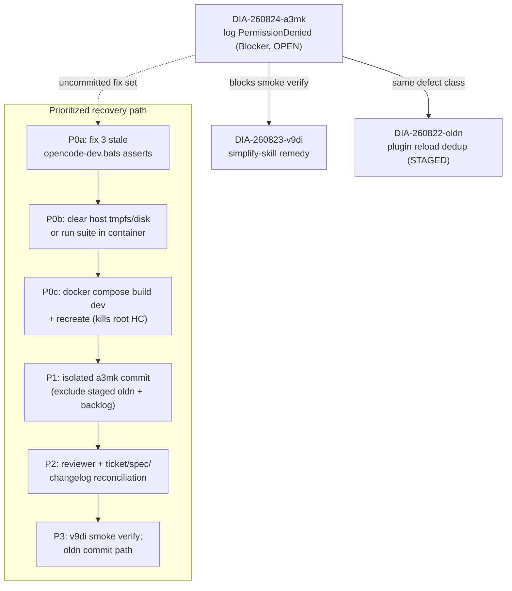

# ana001 - Current-State Delivery Audit (DIA-260824-a3mk)

<!-- ANALYZER-OUTPUT-CONTRACT
schema-version: 1.0
agent: analyzer
claim-type: finding
evidence-source: git index/log, docker inspect, live container probes, scripts/tickets, .opencode/session/partial-results/ses_fcb6fbb68ffe2qsEiBEOkddS9b.json, .opencode/session/handoffs/ses_fd4cef8d0ffe6kFwu8DpeMdBFj.json
confidence: High
shelf-registration: memory-shelf.yaml (shelf.analyses), delegated to @memory-manager
-->

Date: 2026-08-24. Scope: full current-state delivery audit for DIA-260824-a3mk
("make opencode fails: PermissionDenied opening
/home/dev/.local/share/opencode/log/opencode.log") plus repo-wide delivery state.
All secret values withheld; only shapes/emptiness reported.

Evidence legend: **[E]** = directly verified by this audit (command output
reproducible); **[C]** = lane/handoff claim, not independently re-verified;
**[U]** = uncertain / could not verify.

---

## 1. Executive Summary

The DIA-260824-a3mk fix (self-healing root->dev privilege drop for OpenCode
launch) is **implemented and behaviorally working against the running
container [E]**, but it is **entirely uncommitted [E]**, its regression tests
are **partially stale (3 failing bats assertions) [E]**, the ticket and OpenSpec
checklists are **not updated to match reality [E]**, and the commit lane
**failed twice (truncated) plus once (empty result), with the final
rebuild/verify/commit dispatch cancelled [E - partial-results file]**. A fresh
host-side blocker appeared during this audit: the **host bats suite aborts with
ENOSPC on a 512M tmpfs /tmp at test 299/524 [E]**. The running image is an
**intermediate build** (has gosu + self-heal entrypoint, but old root-running
healthcheck inherited into the container config) - a final rebuild is still
required [E].

## 2. Work-State Matrix

| Work item | State | Evidence |
|---|---|---|
| a3mk source fix (Dockerfile.dev USER removal + gosu + HEALTHCHECK-as-dev; dev-entrypoint.sh chown+gosu drop; Makefile --user dev; scripts/opencode-dev entrypoint routing; scripts/dev-stack.sh --user dev) | **Uncommitted (working tree)** | [E] `git status`, `git diff` inspected line-by-line |
| New tests: opencode-launch-routing.bats, compose-overrides.bats WSL merge-presence, opencode-dev.bats | Untracked files; routing+compose-overrides pass, opencode-dev has 3 stale failures | [E] bats runs: 1/1 ok, 16/16 ok, 3 failures listed in §5 |
| Staged: `.opencode/plugins/delegation-observer.ts` (+278/-68, DIA-260822-oldn reload dedup) | **Staged, unrelated to a3mk** | [E] `git diff --cached --stat`; diff header cites DIA-260822-oldn |
| Broader uncommitted backlog | 104 dirty paths: ~30 modified (CHANGELOG.yaml/md, memory/, learnings/, tickets README, tools/opencode-docker, AGENTS.md, openspec tasks) + ~40 untracked tickets/openspec changes/knowledge dirs | [E] `git status --porcelain` count |
| a3mk behavioral fix | **Verified live**: entrypoint-as-root launch -> chown -> uid 1000 -> `opencode --version` = 1.18.18, exit 0, no PermissionDenied; log file dev:dev | [E] `docker compose exec` probes on poetry-dev |
| Rebuilt-image compose recreate + fresh-volume acceptance | **Not done**; last dispatch cancelled before starting | [E] handoff prognosis; [C] partial-results text |
| Isolated a3mk commit | **Not done**; commit-lane attempt returned empty result; no a3mk commit in any branch (`git log --all --grep a3mk` empty) | [E] |
| Ticket DIA-260824-a3mk ledger state | OPEN; all Verification checkboxes unchecked despite lane re-verify claims in ticket Fix/Re-verify sections | [E] `scripts/tickets show`; ticket file |
| OpenSpec change dia-260824-opencode-log-permission-fix | All tasks.md checkboxes unchecked though most items are implemented | [E] file read |
| Committed work (branch DIA-260822-medh-red) | 482 commits ahead of main; recent: secrets ownership preflight, medh RED compaction tests, HMAC capability auth, C5 docker-skip, TODOWRITE fixtures | [E] `git log` |
| Ticket ledger totals | 220 tickets: 131 CLOSED, 43 OPEN, 27 VERIFIED, 12 DONE, 2 IMPLEMENTED, 1 each FIXED/DEFERRED/MONITOR; 0 BLOCKED/DISPATCHED | [E] `scripts/tickets stats` |

## 3. Lane Errors (explicit surface)

Source: `.opencode/session/partial-results/ses_fcb6fbb68ffe2qsEiBEOkddS9b.json`
[E], corroborated by active handoff `ses_fd4cef8d0ffe6kFwu8DpeMdBFj.json` [E].

| # | Error | Detail |
|---|---|---|
| 1 | Truncated coder report #1 | Reported rebuilt image loaded; compose recreate failed (Docker could not mkdir /workspace/secrets); standalone fresh-image run started. Truncated before evidence. |
| 2 | Truncated coder report #2 | Asserted full rebuilt-image behavioral proof + project shell suite pass, then truncated before evidence. Claims unusable as verification. |
| 3 | Empty commit report | Isolated DIA-260824-a3mk commit attempt returned an **empty result**; commit state was unknown until this audit confirmed no a3mk commit exists anywhere [E]. |
| 4 | Cancelled dispatch | Final rebuild/verify/commit coder dispatch was **cancelled before starting**; no coder running at audit time. |

An independent coder verifier did return a complete read-only verification
(source + self-heal logic pass) [C]; my live probe independently confirms the
behavioral claim [E].

## 4. Demo / Container State

| Item | State | Evidence |
|---|---|---|
| poetry-dev | Up ~3h+, image sha d4a9629 built 16:34 today; restart=unless-stopped; healthcheck "healthy" (5x exit 0) | [E] `docker inspect` |
| poetry-postgres | Up 7h, postgres:16-alpine | [E] |
| Image contents vs working tree | Image HAS gosu + self-heal entrypoint but uses `chown -R 1000:1000` / `gosu 1000:1000`; working tree now says `dev:dev` / `gosu dev` -> intermediate build, drift confirmed | [E] entrypoint read inside image vs `git diff` |
| Container healthcheck config | Old string `opencode --version` (no gosu), running as root every 30s. Log file currently still dev:dev so no observed re-owning yet, but this is exactly the root-cause class the ticket fixes; Dockerfile HEALTHCHECK-as-dev change is NOT effective until rebuild/recreate | [E] `docker inspect .State.Health`, image HC=null (compose/image lineage) |
| Secrets wiring | Entrypoint logs `[skip] ... file empty or zero-byte, not wiring` for anthropic_api_key, context7_api_key, github_token, exa_api_key (openai not observed skipped). No values exposed. If API-dependent work is expected, empty secret files are a functional gap | [E] launch stderr |
| App demo (author-studio :9000 etc.) | Not probed beyond port mappings existing (3000/8000/9000 published); no evidence turbo dev is running | [U] |

## 5. Test / Verification Artifacts

| Suite | Result | Evidence |
|---|---|---|
| opencode-launch-routing.bats (static root-launcher guard) | 1/1 pass | [E] direct bats run |
| compose-overrides.bats (WSL merge-presence, podman/rootless merges) | 16/16 pass | [E] |
| opencode-dev.bats | **3 FAIL**: "default action: runs 'up -d dev' then 'exec dev bash'", "mode --run-opencode dispatches 'exec dev opencode'", "mode --test dispatches 'exec dev make test-infra'" - assertions expect pre-fix command strings while scripts/opencode-dev now routes through dev-entrypoint/--user dev | [E] failure output + script/test diff |
| Full host suite via bats-wrapper | **Aborts at 299/524** with `printf: write error: No space left on device` (bats vendor internals); /tmp is a 512M tmpfs; / at 98% (11G free). Host shell-test gate currently unreliable | [E] |
| bash -n syntax checks, openspec validate | Pass per ticket Re-verify section | [C] (not re-run; low risk) |
| In-container behavioral acceptance | Pass (see §4) | [E] |

## 6. Blockers and Risks

### Technical blockers

| ID | Blocker | Impact | Class |
|---|---|---|---|
| B1 | 3 stale opencode-dev.bats assertions vs updated launcher routing | Cannot honestly commit "tests pass" for a3mk; merge gate fails | Regression (fix-introduced test debt) [E] |
| B2 | Host ENOSPC on tmpfs /tmp aborts bats at 299/524; / at 98% | `make test-shell` (host gate) cannot complete; verification evidence unobtainable host-side | Environmental [E] |
| B3 | Running container uses intermediate image; old root-running healthcheck active | Root-opencode-runs-per-30s risk persists until rebuild+recreate; HEALTHCHECK-as-dev defense not live | Deployment gap [E] |
| B4 | Commit lane repeatedly failed (2 truncated, 1 empty, 1 cancelled) | a3mk fix remains exposed in working tree; risk of accidental mixing with staged oldn work or backlog | Process [E] |

### Process risks / gaps

- **Index hygiene:** DIA-260822-oldn plugin change sits STAGED while ~103 other
  dirty paths surround it; one careless `git add .`/`git commit -a` would fuse
  three unrelated workstreams (oldn, a3mk, backlog) into one commit [E].
- **Ledger drift:** ticket checkboxes and OpenSpec tasks.md do not reflect
  implemented reality; CHANGELOG has no a3mk entry (uncommitted 1c3e/8kpc
  entries exist) [E].
- **Secrets emptiness:** multiple zero-byte secret files -> downstream API
  features silently unwired (entrypoint does warn, not silent) [E].
- **Branch naming:** work sits on `DIA-260822-medh-red` (a RED-test branch for
  an unrelated ticket), 482 commits ahead of main; main fully merged in [E].

## 7. Dependency / Blocker Diagram



Compact blocker chain:

```
B2 (host ENOSPC) ──┐
B1 (stale tests) ──┼──> honest green suite ──> B3 (rebuild/recreate)
                                                │
B4 (failed commit lanes) ───────────────────────┴──> isolated a3mk commit
                                                          │
                                                          v
                                              a3mk CLOSED ──> v9di unblocked
```

## 8. Duplicate / Stale / Deprecated Work Worth Stopping

| Item | Why stop/clean | Evidence |
|---|---|---|
| Stray `Readme.txt` + `readme2.txt` at repo root | Accidental opencode-config JSONC dumps; pure junk | [E] content read |
| Legacy `tools/opencode-docker` dual-container tooling | Superseded by unified-runtime plan; retirement already ticketed (DIA-260824-8k62) - keep retired-only-after-acceptance per ticket, stop investing further | [E] ticket exists, OPEN |
| Two git stashes on `omo-slim-changes` ("ai_setup_analisys", "last") | Likely stale; review then drop | [E] `git stash list` |
| ~40 untracked knowledge/ana*/res* dirs + tickets | Delivered-but-unversioned analysis artifacts; batch-commit or they rot outside git | [E] status |
| Intermediate image builds (two tags of same id, 7.26GB x2) | Rebuild will orphan the intermediate; prune after final build | [E] `docker images` |
| Pre-fix command strings inside opencode-dev.bats | Delete/update, do not "fix" the script back to match tests | [E] |

## 9. Prioritized Recovery Plan

| Prio | Action | Gate/exit criterion |
|---|---|---|
| **P0a** | Update the 3 stale assertions in `scripts/__tests__/opencode-dev.bats` to the new entrypoint-routed command strings (same instance that wrote them, per DIA-175 same-session rule if resuming) | 3 tests green [E-verifiable] |
| **P0b** | Free host tmpfs/disk (prune docker build cache, clear /tmp) or run the shell suite inside the dev container | Full bats suite completes 524/524 |
| **P0c** | `docker compose build dev && docker compose up -d` (recreate) so USER-removal + gosu HEALTHCHECK take effect; then fresh-volume acceptance per ticket Verification section | `docker exec poetry-dev ps` shows entrypoint PID1 as root dropping to dev; container HC = gosu form; `make opencode` starts clean |
| **P1** | Isolated commit of ONLY the a3mk set: Dockerfile.dev, dev-entrypoint.sh, Makefile, scripts/opencode-dev, scripts/dev-stack.sh, 3 new bats files, docker-compose.wsl.yml touch if any. Preserve staged delegation-observer.ts untouched (use explicit paths, never `-a`) | `git log` shows single a3mk commit; `git diff --cached` afterwards still shows oldn change |
| **P2** | Reconcile ledgers: tick a3mk ticket Verification boxes + status, tick OpenSpec tasks.md items, append CHANGELOG.yaml entry, `scripts/tickets rollup` | validate-changelog + test-config pass |
| **P3** | Dispatch @reviewer on the commit; then resume oldn commit path; then run v9di config smoke verification (now unblocked) | Re-review cycle 1/2 clean |
| **P4** | Cleanup: delete Readme.txt/readme2.txt, triage stashes, batch-commit knowledge/tickets backlog, prune intermediate images | `git status` shrinks; disk <90% |

Explicit abort/status-quo variant: do nothing further; the fix works live
today [E] but stays uncommitted and unprotected - one careless commit or
volume wipe loses it. Not recommended.

Recommendation (because): P0a-P1 are small, mechanical, and convert the only
verified-working deliverable out of its fragile uncommitted state; everything
else (v9di, oldn, unified-runtime) queues behind it.

## 10. Claim-vs-Evidence Register

| Claim in circulation | Audit verdict |
|---|---|
| "Rebuilt image verified behaviorally" (truncated coder report) | Partially true: RUNNING container passes live behavioral probe [E], but image is an intermediate build lacking the gosu HEALTHCHECK; "full rebuilt-image proof" claim unverifiable [U] |
| "Project shell suite passes" (truncated coder report) | Not reproducible host-side: suite aborts 299/524 ENOSPC [E]; targeted new suites pass except 3 stale tests [E] |
| "Commit attempted" | Confirmed NO a3mk commit exists on any ref [E]; empty-result report accurate |
| "Independent verifier: source + self-heal logic pass" | Consistent with my direct reads and live probe [E] |
| "compose recreate failed: cannot mkdir /workspace/secrets" | Plausible [C]; secrets dir is bind-mounted read-only per compose design; not re-triggered during audit [U] |
