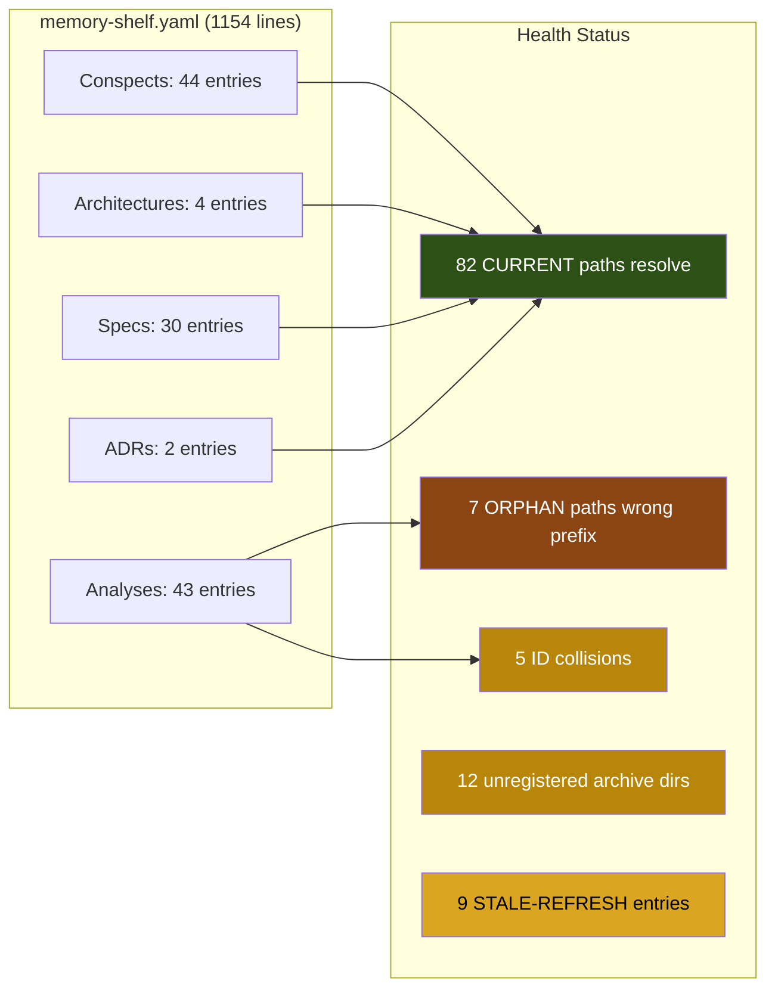

# Memory Shelf Staleness Audit (ana001)

<!-- ANALYZER-OUTPUT-CONTRACT
schema-version: 1.0
agent: analyzer
claim-type: finding
evidence-source: DIA-260826-7qmt
confidence: High
shelf-registration: memory-shelf.yaml (shelf.analyses), delegated to @memory-manager
-->

**Campaign ticket:** DIA-260826-7qmt
**Date:** 2026-08-28
**Scope:** memory-shelf.yaml, .opencode/memory/{adr,lessons,repo,failures}.md, all referenced knowledge/ artifacts
**Method:** Exhaustive path-existence check + content cross-reference against current repo state

---

## Executive Summary

The memory shelf is **structurally sound** (all 44 conspect paths resolve, all 4 .sdd/ architecture files exist, all 34 openspec/changes/ dirs exist) but carries **significant hygiene debt**: 7 orphan shelf entries (path mismatches), 12 unregistered archive directories, 5 ID collisions, and multiple stale-content entries with supersession notes that have not been cleaned up. No data loss was found -- all "missing" report files exist in `knowledge/archive/` but the shelf points to the non-archive path.

**Counts:**

| Classification     | Count |
|--------------------|-------|
| CURRENT            | 82    |
| STALE-REFRESH      | 9     |
| STALE-DELETE       | 0     |
| ORPHAN (path fix)  | 7     |
| Unregistered dirs  | 12    |
| ID collisions      | 5     |

---

## 1. Shelf Entry Path Verification

### 1.1 Conspects (shelf.conspects) -- 44 entries

**All 44 conspect paths resolve to existing files.** No orphans in the conspect section.

### 1.2 Analyses (shelf.analyses) -- 43 entries

**7 ORPHAN entries** -- shelf path points to `knowledge/<dir>/<file>.md` but the actual file lives at `knowledge/archive/<dir>/<file>.md`:

| # | Shelf entry | Shelf path (wrong) | Actual path |
|---|-------------|---------------------|-------------|
| 1 | ana010-artifacts-folder-audit | `knowledge/ana010-.../` | `knowledge/archive/ana010-.../` |
| 2 | ana012-scientific-workflow-proposal | `knowledge/ana012-.../` | `knowledge/archive/ana012-.../` |
| 3 | ana013-dia097-105-triage | `knowledge/ana013-.../` | `knowledge/archive/ana013-.../` |
| 4 | ana015-recursion-fork-bomb | `knowledge/ana015-.../` | `knowledge/archive/ana015-.../` |
| 5 | ana018-research-lane-optimization | `knowledge/ana018-.../` | `knowledge/archive/ana018-.../` |
| 6 | ana019-post-cherry-pick-audit | `knowledge/ana019-.../` | `knowledge/archive/ana019-.../` |
| 7 | ana020-post-rebase-audit | `knowledge/ana020-.../` | `knowledge/archive/ana020-.../` |

**Root cause:** These entries were archived (moved to `knowledge/archive/`) but their shelf paths were not updated to include the `archive/` prefix.

### 1.3 Architectures (shelf.architectures) -- 4 entries

**All 4 .sdd/ architecture files exist.** No orphans.

### 1.4 Specs (shelf.specs) -- 30 entries

**All 30 openspec/changes/ directories exist.** No orphans.

### 1.5 ADRs (shelf.adrs) -- 2 entries

Both point to `.opencode/memory/adr.md` which exists (1856 lines). CURRENT.

---

## 2. ID Collisions

Multiple directories share the same knowledge ID prefix, creating ambiguity:

| ID | Directories (count) | Locations |
|----|---------------------|-----------|
| ana001 | 3 | `knowledge/ana001-current-state-delivery-audit/`, `knowledge/ana001-ponytail-repo-over-engineering-audit/`, `knowledge/ana001-repo-overengineering-audit/` |
| ana015 | 2 | `knowledge/ana015-workflow-adherence-audit/`, `knowledge/archive/ana015-recursion-fork-bomb/` |
| ana016 | 2 | `knowledge/ana016-agent-instruction-audit/`, `knowledge/ana016-stop-point-stall-analysis/` |
| ana017 | 2 | `knowledge/ana017-hook-test-coverage/`, `knowledge/ana017-spec-workflow-reference/` |
| res026 | 2 | `knowledge/res026-orchestrator-session-records-json-db/`, `knowledge/res026-ticket-navigation/` |
| res029 | 2 | `knowledge/res029-model-fallback-semantics/`, `knowledge/res029-dcp-removal-evaluation/` |

**Note:** The ana001 triple collision is the most severe -- the pre-allocated ID for THIS audit (`ana001-memory-shelf-staleness`) is a FOURTH use of the ana001 prefix. The ID allocator has no uniqueness enforcement at write time (confirmed by lessons.md L20260812-003 / DIA-178 hygiene audit).

---

## 3. Unregistered Archive Directories

12 directories exist in `knowledge/archive/` with report files but NO shelf registration:

| # | Directory | Type |
|---|-----------|------|
| 1 | `ana01-dia-mention-format` | Legacy pre-ID analysis |
| 2 | `ana01-orchestrator-bugs` | Legacy pre-ID analysis |
| 3 | `ana023-ticket-backlog-priority-plan` | Analysis (ID collision with ana023 container overlap) |
| 4 | `ana025-context-usage-calibration` | Analysis (ID collision with ana025 container consolidation) |
| 5 | `ana025-harness-research-conspect` | Analysis (ID collision) |
| 6 | `ana026-agentic-flow-failures` | Analysis (ID collision with ana026 artifact format) |
| 7 | `ana026-opencode-setup-audit` | Analysis (ID collision) |
| 8 | `ana027-dia-221-experimental-summary` | Analysis (ID collision with ana027 ticket nav) |
| 9 | `ana028-further-hardening-workflows` | Analysis |
| 10 | `ana029-workflow-hardening-next-steps` | Analysis |
| 11 | `res026-ticket-navigation` | Conspect (ID collision with res026 JSON-DB) |
| 12 | `res029-dcp-removal-evaluation` | Conspect (ID collision with res029 model fallback) |

**Classification:** ana01-* entries are legacy pre-ID-convention. The rest are ID-collision artifacts from parallel sessions that claimed the same numeric slot.

---

## 4. Stale Content (STALE-REFRESH)

Entries that are still structurally valid but contain claims superseded by later work:

| # | Entry | Staleness | Reason | Action |
|---|-------|-----------|--------|--------|
| 1 | `res013` (model pricing) | STALE-REFRESH | Pricing data superseded by `res030` (2026-08-17): Flash price rose 57-371%, monthly budget collapsed 88%, 2x promo removed. Shelf description already notes the delta. | Add `[SUPERSEDED by res030]` tag to shelf description |
| 2 | `res021` (agent presets) | STALE-REFRESH | Temperature/reasoning presets based on pre-res030 pricing. Developer declined recommendations 2026-08-12 but the pricing context has since changed. | Add `[PRICING OUTDATED see res030]` note |
| 3 | `adr.md` DIA-055 (token-tool deny) | STALE-REFRESH | Has explicit SUPERSEDED note (2026-08-26) but entry body still present. Retained for history. | Acceptable as-is (supersession noted) |
| 4 | `repo.md` token-tool deny fact | STALE-REFRESH | Has explicit SUPERSEDED note (2026-08-26). | Acceptable as-is |
| 5 | `lessons.md` L20260810-001 (empty-return) | STALE-REFRESH | References "re-route to code-executor" fallback that is now UNSAFE post-DIA-175 (RED/GREEN separation). The correction at line 294-295 notes this but the original lesson text is unchanged. | Add explicit `[UNSAFE post-DIA-175]` marker to original text |
| 6 | `lessons.md` DIA-174 "same sessions reused for GREEN" | STALE-REFRESH | SUPERSEDED by DIA-175 strict instance separation. Supersession note exists at line 816-819 but original text unchanged. | Acceptable as-is (supersession noted inline) |
| 7 | `lessons.md` "Verify against deployed npm dist" | STALE-REFRESH | Still valid but OMO has since upgraded to 2.2.15 (repo.md). The lesson references 2.2.8 specifically. | Generalize version references |
| 8 | `failures.md` F-1/F-3 "NOT yet live" | STALE-REFRESH | DIA-085 handoff slots are now ACTIVATED (repo.md line 166-172). Resolution notes exist at lines 310 and 319 but the original text still says "NOT yet live". | Acceptable as-is (resolution notes present) |
| 9 | `lessons.md` "Copilot drain visibility" | STALE-REFRESH | References cebula preset as the Copilot-credit surface. Post-res030, the cebula preset model assignments changed (mimo-v2.5 swap). | Add `[PRESET CHANGED see res030]` note |

---

## 5. Memory Files Assessment

### 5.1 adr.md (1856 lines)

- **20 ADRs** covering memory strategy, dev-infra, audit methodology, Context7, orchestrator model, agent naming, plugins-as-hooks, token-tool deny (superseded), interim-guard pattern, gate-script re-entrancy, git worktrees, hermetic sandbox, git-sync binary DB, needs-input ticker, escalated-lane steps, dual-runtime precedence, batch-D shared seams, overnight permissions, overnight subset-testing, capability authorization.
- **Staleness:** 1 explicit supersession (DIA-055). All others CURRENT.
- **Verdict:** CURRENT with noted supersession.

### 5.2 lessons.md (2155 lines)

- **~80+ lesson entries** spanning 2026-08-01 through 2026-08-25.
- **Staleness:** 3 entries with explicit supersession notes (L20260810-001, DIA-174 same-session, L20260810-002 correction). 1 entry (L20260810-001) has an unsafe recommendation that needs a marker.
- **Verdict:** STALE-REFRESH (the L20260810-001 unsafe-fallback needs marking).

### 5.3 repo.md (340 lines)

- **~30 entries** covering navigational pointers, runtime facts, config state.
- **Staleness:** 1 explicit supersession (token-tool deny). All others CURRENT.
- **Verdict:** CURRENT.

### 5.4 failures.md (421 lines)

- **~25 failure entries** spanning 2026-08-03 through 2026-08-27.
- **Staleness:** 2 entries with resolution notes (F-1, F-3) that still say "NOT yet live" in original text. All others CURRENT.
- **Verdict:** CURRENT (resolution notes adequate).

### 5.5 Ancillary memory files (not in shelf)

| File | Lines | Status |
|------|-------|--------|
| `lessons-c-20260809-residual-closure.md` | 5 | Near-empty (header only). ORPHAN candidate for deletion. |
| `audit-2026-08-02.md` | 23 | Unreferenced audit artifact. Not in shelf. |
| `incident-2026-08-09.md` | 14 | Unreferenced incident log. Not in shelf. |

---

## 6. Unregistered Knowledge Directories

Directories in `knowledge/` (non-archive) not referenced by any shelf entry:

| Directory | Content | Recommendation |
|-----------|---------|----------------|
| `context7-docs/` | Context7 library documentation (fetched by pipeline) | Intentionally unregistered (output of context7-docs-pipeline, not a conspect/analysis). CURRENT. |
| `test-dia126-archival/` | Test artifacts from DIA-126 archival verification | Transient test output. STALE-DELETE candidate. |
| `model-registry.yaml` | Model routing registry (res023 design) | Not in shelf but referenced by res023. Register or add note. |

---

## 7. Prioritized Findings Table

| Priority | ID | Type | Classification | Reason | Recommended Action |
|----------|----|------|----------------|--------|--------------------|
| P0 | Shelf-01 | ORPHAN x7 | ORPHAN | 7 analysis shelf entries point to `knowledge/` but files are in `knowledge/archive/` | Fix shelf paths: prepend `archive/` to the 7 paths |
| P0 | ID-01 | ana001 x4 | COLLISION | ana001 used 4 times (3 existing + this audit) | This audit should use a unique name; long-term enforce ID uniqueness at write time |
| P1 | ID-02 | 5 collisions | COLLISION | ana015/016/017, res026/029 each have 2 dirs | Disambiguate: rename or merge colliding entries |
| P1 | Unreg-01 | 12 dirs | UNREGISTERED | 12 archive dirs have reports but no shelf entry | Register or delete (ana01-* legacy can be deleted; others need evaluation) |
| P2 | Stale-01 | res013 | STALE-REFRESH | Pricing data superseded by res030 | Add `[SUPERSEDED by res030]` tag |
| P2 | Stale-02 | lessons.md L20260810-001 | STALE-REFRESH | "Re-route to code-executor" fallback is UNSAFE post-DIA-175 | Add `[UNSAFE post-DIA-175]` marker |
| P2 | Stale-03 | res021 | STALE-REFRESH | Preset recommendations based on outdated pricing | Add `[PRICING OUTDATED see res030]` |
| P3 | Stale-04 | lessons.md (9 entries) | STALE-REFRESH | Version-specific references (OMO 2.2.8, cebula preset) | Generalize or annotate |
| P3 | Ancillary | 3 files | ORPHAN | lessons-c (near-empty), audit, incident not in shelf | Delete lessons-c; evaluate audit/incident for registration |
| P3 | test-dia126 | dir | STALE-DELETE | Transient test output dir in knowledge/ | Delete after verifying no references |

---

## 8. Mermaid Diagram: Shelf Health Overview

---

## 9. Recommendations

### Immediate (P0, <1h)

1. **Fix 7 orphan shelf paths** -- prepend `archive/` to the 7 analysis paths that were archived without shelf update.
2. **Rename this audit** -- the pre-allocated `ana001` collides with 3 existing dirs. Use a unique name.

### Short-term (P1, <4h)

3. **Resolve ID collisions** -- for each of the 5 collision pairs, decide which dir keeps the ID and which gets renumbered.
4. **Register or delete 12 unregistered archive dirs** -- ana01-* legacy can be deleted; the rest need shelf entries or explicit archive-and-forget.

### Medium-term (P2, <2h)

5. **Add supersession markers** to res013, res021, and lessons.md L20260810-001.
6. **Delete near-empty ancillary files** (lessons-c-20260809-residual-closure.md, test-dia126-archival/).

### Process Improvement

7. **Enforce ID uniqueness at write time** -- the shelf-registration lane (memory-manager) must scan existing IDs before assigning. This is already documented as a lesson (L20260812-003 / DIA-178) but not mechanically enforced.
8. **Add a `make test-shelf` target** that verifies every shelf path resolves to an existing file (prevents future orphan accumulation).

---

## 10. Audit Limitations

- **Content freshness of conspects:** This audit verified path existence and checked for explicit supersession markers. It did NOT re-read every conspect's claims against current code/config. Conspects like res014 (escalation routing), res023 (dispatch registry), and res030 (pricing) contain model pricing and benchmark data that changes frequently and may have drifted beyond what their own supersession notes capture.
- **tests not run:** `make test-config` / `make test-shell` were not executed (audit env lacks Docker). Shelf structural validation was filesystem-only.
- **No modifications made:** This audit is read-only. No shelf, memory, or knowledge files were modified.
