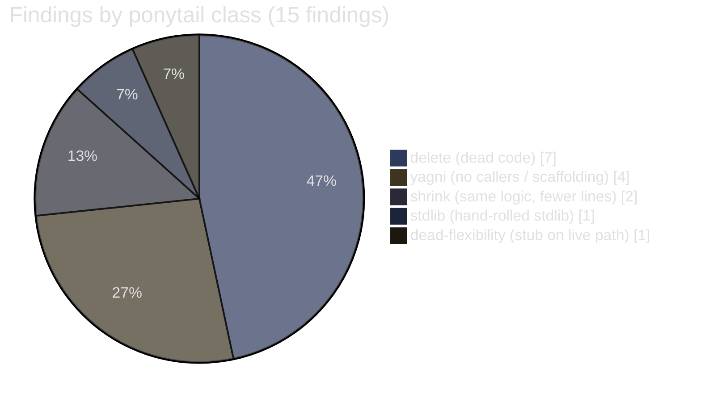
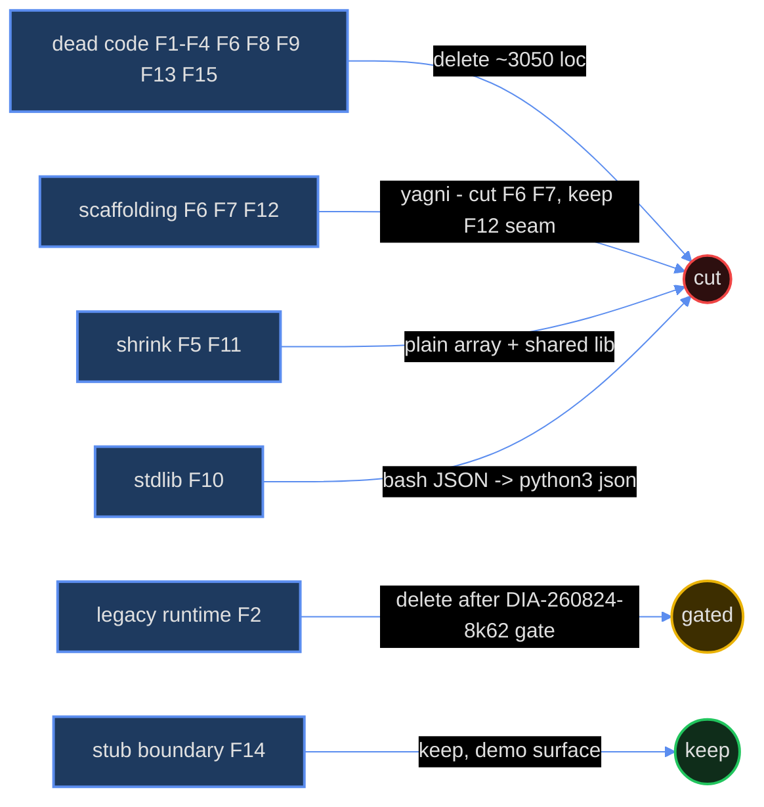

<!-- ANALYZER-OUTPUT-CONTRACT
schema-version: 1.0
agent: analyzer-escalated
claim-type: finding
evidence-source: /workspace whole-tree scan (git ls-files + grep caller verification, 2026-08-27)
confidence: High
shelf-registration: memory-shelf.yaml (shelf.analyses), delegated to @memory-manager
-->

# ana001 - Whole-Repo Ponytail Over-Engineering Audit (escalated lane, FULL intensity)

Campaign ticket DIA-260827-15xv. Read-only audit; no fixes applied.

Prior art: an earlier audit (DIA-260825-wprb, `knowledge/ana001-repo-overengineering-audit/`)
found ~671 removable lines; most fixes merged (DIA-260822-medh-red). This report
audits the CURRENT tree and only lists findings that still exist today.

## 1. Scope scanned

| Area | Files | LOC (src, excl. tests) |
|---|---|---|
| packages/phonetics-core | 20 | 3,157 |
| packages/editor-engine | 13 | 1,564 |
| apps/author-studio | 37 | 1,493 |
| scripts/ (shell + mjs) | 49 | 7,085 |
| .opencode/plugins (2 observers + lib) | 4 | 6,385 |
| .opencode/scripts (python + sh) | 9 | 3,684 |
| apps/api-server | 4 | 66 |
| packages/analytics-pipeline | 5 | 73 |
| packages/data-contracts | 3 | 81 |
| packages/visualizer-2d / -3d | 3 | 129 |
| tools/opencode-docker | 11 | ~750 (+ Dockerfile, config) |

Skipped per rules: node_modules, .venv, dist, .turbo, __pycache__, lockfiles,
vendored `.opencode/oh-my-opencode-slim/` (REFERENCE-ONLY tree), generated
flatc bindings counted as data (but flagged as dead below), `.worktrees/*`
(separate checkouts), `docs/`, `knowledge/` prose.

Every finding was verified by grepping for callers/importers across all
non-vendored source before inclusion. No speculative findings.

## 2. Methodology

Ponytail ladder applied per finding, first rung that holds:

1. YAGNI - does this need to exist at all? (zero consumers, speculative need)
2. reuse - does an identical helper already exist in this repo?
3. stdlib - does the standard library ship it?
4. native - does the platform/runtime ship it?
5. installed dep - does an already-installed dependency do it?
6. one line - can the same logic be one line?
7. minimum code - only then keep the current form.

Tag classes: `delete:` (dead code / unused flexibility), `yagni:` (one
implementation, no callers, config nobody sets), `shrink:` (same logic, fewer
lines), `stdlib:` (hand-rolled thing the stdlib ships), `dead-flexibility:`
(placeholder stubs on live paths).

## 3. Ranked findings (biggest cut first)

### F1. delete+yagni: the entire phonetic-atlas loader chain has zero consumers (~2,500 lines + 312 KB duplicate binary)

- `packages/phonetics-core/src/atlas/load-atlas.ts` (339 lines): `PhoneticAtlasIndex` class. Importer scan: ZERO outside phonetics-core. Docstring claims W2 consumes it; W2 is `apps/author-studio/src/workers/w2-phonetics.ts` = `export {};`.
- `packages/phonetics-core/src/atlas/load-atlas.test.ts` (348 lines): tests a module nothing imports.
- `packages/phonetics-core/src/atlas/load_atlas.py` (316 lines): docstring claims analytics-pipeline imports it. It does not (`packages/analytics-pipeline/src/core/numpy_calc.py` is a 3-line docstring).
- `packages/phonetics-core/src/atlas/generated/*.ts` (7 files, 889 lines): consumed only by the dead loader.
- `packages/phonetics-core/scripts/generated/python/*.py` (7 files, 600 lines): consumed only by the dead Python loader's fallback import.
- `packages/phonetics-core/scripts/codegen.js`: generates TS + Python + Rust + C++ targets. Rust = "W1 FST index" (W1 is `export {}`), C++ = "future ultra-low-latency modules" (explicitly future), Python = no consumer. Only TS is checked in, and only the dead loader reads it.
- `packages/phonetics-core/dist/phonetic_atlas.bin` (312 KB) byte-duplicates `src/atlas/phonetic_atlas.bin` (312 KB); both git-tracked.

**Cut:** delete the two loader modules + both generated-binding trees + codegen.js + the duplicate dist binary.
**Keep:** `phonetic_atlas.fbs`, `generate_phonetic_atlas.py`, one `.bin` - the architecture.md §5 declared data asset. Regenerate bindings from `flatc --ts` when W1/W2 actually land (later can scaffold for itself).
**Caveat:** the schema seam itself is architecture-declared; this finding cuts only the unconsumed wrapper/binding layer around it.

### F2. delete (pending gate): tools/opencode-docker is a second full dev runtime (~750 lines + Dockerfile + launcher + config + Makefile gates)

- `tools/opencode-docker/` (11 files): Dockerfile (226), bin/opencode-docker (275), bootstrap.py (97), collect-runtime-deps.sh (107), Makefile (45), config/opencode.json, README, TODO, AGENTS.
- Duplicates the Dockerfile.dev + dev-entrypoint.sh runtime for a legacy dual-container model.
- `scripts/check-opencode-docker.sh` (82) + `scripts/__tests__/opencode-docker.bats` + 2 Makefile targets exist only to guard this subproject.
- ana035 (unified-dev-runtime analysis) already recommends deleting it; retirement ticket DIA-260824-8k62 'retire legacy tools/opencode-docker only after unified-runtime acceptance' is OPEN, blocked by 5 unified-runtime tickets.

**Cut:** delete when the DIA-260824-8k62 gate closes; remove the Makefile `test-opencode-docker` target, check-opencode-docker.sh, opencode-docker.bats, and the check-pin-sync Dockerfile parity leg in the same change.
**Replacement:** Dockerfile.dev + dev-entrypoint.sh (the unified runtime).

### F3. yagni: CommandBus exists to run a no-op command

- `packages/editor-engine/src/view/opusDecorator.ts:36-40`: the ONLY producer of commands pushes `{ id: 'reformat', priority: 'user', execute: () => {} }` - an empty function.
- `packages/editor-engine/src/orchestrator/command-bus.ts` (41 lines): priority queue, timestamp sort, async flush loop - all to execute nothing.

**Cut:** delete the no-op push AND `command-bus.ts` (and its export in `src/index.ts:2`); Orchestrator drops the `commands` field until a real command exists.
**Replacement:** nothing. When a real async command pipeline is needed, a `Promise` queue is ~10 lines.

### F4. delete: tokenizer defines 85 lines of PUNCTUATION tables and a token type it never produces

- `packages/editor-engine/src/tokenizer/tokenizer.ts:33-101`: `PUNCTUATION` maps (eng/pol/ukr, ~85 lines) are never read by `tokenize()` - the regex handles punctuation generically.
- `tokenizer.ts:1`: `TokenType` includes `'typographical'`; no code path ever emits it.
- Verified: no importer of `PUNCTUATION` or `'typographical'` anywhere in the repo.

**Cut:** delete the PUNCTUATION object and the `'typographical'` member.
**Replacement:** nothing (TOKEN_RE already covers punctuation).

### F5. shrink: opusFormattingFilter inline-segment micro-optimization (~45 lines for an allocation nobody can measure)

- `packages/editor-engine/src/view/opusFormattingFilter.ts:235-286`: first segment stored in 3 separate vars + lazy array alloc + backfill, ~30 lines of machinery + ~15 lines of comments, to avoid ONE array allocation per keystroke in a CodeMirror transaction filter (CM6 allocates orders of magnitude more per transaction).
- `opusFormattingFilter.ts:205-224`: `computeNewCursor` duplicates its loop body in a `changes.length === 1` special case.
- The `change(from, to, insert)` helper (line 26-28) wraps an object literal - rename the intent, not the allocation.

**Cut:** plain `const changes = []; changes.push(replacement ?? ...)` loop; one cursor-compute loop; inline object literals. Saves ~45 lines and 2 code paths.
**Replacement:** `array.push` (the 99.9% keystroke path allocates one tiny array - the documented optimization is invisible in any profiler).

### F6. yagni: three empty worker placeholder modules

- `apps/author-studio/src/workers/bootstrap.ts`, `w1-stress.ts`, `w2-phonetics.ts`: each exactly `export {};`.
- No vite/quasar/tsconfig reference, no importer anywhere.

**Cut:** delete all three files (and the workers/ dir).
**Replacement:** nothing. W1/W2 scaffolding can create its own files when the workers land.

### F7. yagni: full vue-i18n stack localizes nothing

- 2 dependencies (`vue-i18n` prod + `@intlify/unplugin-vue-i18n` dev) + `src/boot/i18n.ts` (27 lines) + `src/i18n/index.ts` + `src/i18n/en-US/index.ts` exist to serve ONE Quasar-example message ('Action failed' / 'Action was successful').
- Verified: ZERO `$t(` usages in any .vue/.ts file.

**Cut:** delete the i18n boot, src/i18n/, and both deps (and the unplugin entry in quasar.config if present).
**Replacement:** nothing. Re-add vue-i18n when a second locale (or a real translated string) exists - the platform domain will justify it then.

### F8. delete: Quasar starter demo residue on the landing page (~100 lines + asset)

- `apps/author-studio/src/components/ExampleComponent.vue` (37) + `components/models.ts` (8, Todo/Meta demo types) render the Quasar starter's demo todo list on IndexPage.
- `apps/author-studio/src/pages/IndexPage.vue:10-25`: demo `todos`/`meta` refs.
- `apps/author-studio/src/components/EssentialLink.vue` (27): imported by nothing.
- `apps/author-studio/src/assets/quasar-logo-vertical.svg`: referenced by nothing.
- (Note: `stores/example-store.ts` is NOT re-flagged - developer KEPT it in the DIA-260825-wprb disposition.)

**Cut:** delete ExampleComponent, models.ts, EssentialLink.vue, the logo asset; strip the demo content from IndexPage.
**Replacement:** nothing - the real editor/visualizer split already lives in MainLayout.vue.

### F9. delete: Orchestrator dead API + debug logging + debug global

- `packages/editor-engine/src/orchestrator/Orchestrator.ts:24-41`: `acceptWorkerResult`, `insertLine`, `removeLine` - zero callers outside the class.
- `Orchestrator.ts:15-19`: `handleDocumentUpdate` console.logs the full update + token array on every doc change; contains a commented-out line.
- `packages/editor-engine/src/view/OpusEditorView.ts:79-82`: `(window as any).__edotorView = this.view` - debug global with a typo'd name, "for debugging and tests" (no test reads it).
- `packages/editor-engine/src/index.ts`: exports `CommandBus`, `OpusState`, `LineAtom`, `LineAtomValue`, `LineDecoration`, `DecorationType` - the app imports only `Orchestrator` + `OpusEditorView`.

**Cut:** delete the three dead methods, the two console.logs, the window global; trim index.ts to the two consumed exports.
**Replacement:** nothing (state access goes through Orchestrator when a feature needs it).

### F10. stdlib+shrink: hand-rolled JSON emission in bash (scripts/tickets)

- `scripts/tickets`: `list_json_escape` + temp-file sort-join + string-concat JSON assembly across `list`/`show`/`search`/`stats`/`frontier --json` (~90 lines, lines ~1044-1235, 1323-1560). Bash-3 constraints force the mktemp + O(n^2) re-join dance.
- python3 is already a declared dependency of `scripts/data-reduce.sh` and available on host + container.

**Cut:** replace the --json branches with a single `python3 -c` pass (read frontmatter, emit `json.dumps`). ~90 lines -> ~25, and the entire class of hand-rolled JSON-escaping bugs disappears.
**Replacement:** `python3` + stdlib `json`.

### F11. shrink: byte-identical container guards duplicated across two host scripts

- `is_in_dev_container()` + `container_running()` are BYTE-IDENTICAL in `scripts/verify-pre-commit.sh` and `scripts/verify-pre-push.sh` (verified with diff).
- `fm_field()` duplicated in `scripts/tickets:204-232` and `scripts/validate-grilling-gate.sh`.
- `fail()` defined 6x across scripts, `usage()` 5x (each 2-5 lines).

**Cut:** extract `scripts/lib/guard.sh` (container probes + fail/usage + fm_field) and source it from the 2-3 consumers; leave the 2-line `fail()` copies alone where sourcing would hurt standalone use.
**Replacement:** one sourced shared lib (~30 lines saved net, one place to fix).

### F12. yagni (low): api-server is a docstring-only placeholder app

- `apps/api-server/app/core/auth.py` + `app/db/postgres.py`: 3-line docstrings each ("JWT Auth - Google OAuth", "Asyncpg: tables poems & enriched_metrics"). The app exists as pyproject.toml + uv.lock + 2 import-pinning tests.
- Architecture-declared app seam; the import-pinning tests guard a real past bug (PEP 420 bootstrap).

**Cut (candidate):** collapse to a README + keep the seam note, or accept as deliberate. **Recommendation:** keep for now - it pins a real regression - but do not grow it until auth/db land. Flagged for completeness, lowest priority.

### F13. yagni (low): analytics-pipeline src is docstring-only

- `packages/analytics-pipeline/src/core/numpy_calc.py`, `src/db/uow.py`, `src/daemon/cron.py`: 3 lines each (docstring only). pyproject.toml + uv.lock exist for 9 lines of docstrings.
- Same placeholder class as F12; the pyproject declares numpy/asyncpg deps that nothing imports.

**Cut:** delete the three modules (or the whole src/) until real analytics land; keep pyproject only if the deps are needed by a real module.
**Replacement:** nothing.

### F14. dead-flexibility (low): visualizer stubs ship placeholder art

- `packages/visualizer-2d/src/ssr/index.ts`: hardcodes ONE svg circle+cross; `src/interactive/index.ts`: d3 draws a static circle, `update() {}` is an empty stub ("will re-draw on data change"); `packages/visualizer-3d/src/index.ts`: mounts an empty THREE scene.
- Live-imported by VisualizerContainer.vue - the app renders placeholder art as its right-hand pane.

**Cut:** not a delete - mark as demo surface: either wire `update()` to real state or label the pane "placeholder". No code removal recommended until the real visualizer lands.
**Replacement:** deferred; the seam (component boundary) is correct, only the internals are stubs.

### F15. delete (trivial): untracked debris directories

- `apps/publishing-platform/` and `packages/stress-lang-core/` were deleted from git in DIA-260825-aapj but remain on disk as stale dirs holding leftover `node_modules/` (12 KB / 4 KB).
- `opencode-snip/` is an empty dir referenced by nothing.

**Cut:** `rm -rf` the three dirs.
**Replacement:** nothing.

## 4. Distribution of findings

## 5. Summary counts

| Class | Count | Est. lines removable |
|---|---|---|
| delete (dead code / dead flexibility) | 7 | ~2,980 + 312 KB bin + 2 deps |
| yagni (scaffolding / zero callers) | 4 | ~30 + 2 deps |
| shrink | 2 | ~75 |
| stdlib | 1 | ~65 (bash JSON -> python3 json) |
| dead-flexibility (stub, keep boundary) | 1 | 0 (informational) |

- Net removable now: ~3,150 lines + 312 KB duplicate binary + 2 npm deps (F1, F3-F11, F13, F15).
- Pending gate (not removable yet): ~900 lines (F2 opencode-docker, blocked on DIA-260824-8k62).
- Total incl. gate: ~4,000 lines, 2 deps, 312 KB binary.
- Keep-verdicts: F12 (declared seam + regression guard), F14 (component boundary correct), `@poetry/data-contracts` (developer KEPT in DIA-260825-wprb), `stores/example-store.ts` (developer KEPT), `scripts/context7-docs.mjs` (documented dependency-free tradeoff, prior audit).

## 6. Top 5 highest-impact deletions

1. **F1 - atlas loader chain (~2,500 lines + 312 KB dup binary).** The single largest block of unconsumed speculative infrastructure; removing it deletes 3 tested-but-dead code paths and a byte-duplicated binary while keeping the architecture-declared schema+binary asset.
2. **F2 - tools/opencode-docker (~900 lines incl. guards/bats).** Second full Docker runtime duplicating the unified one; already has a retirement ticket (DIA-260824-8k62) - executing it removes a whole Dockerfile maintenance surface (pin-sync parity checks included).
3. **F10 - bash hand-rolled JSON in scripts/tickets (~65 lines net).** Removes a whole bug class (hand-rolled JSON escaping) from the most-used CLI in the project; python3 is already a declared dependency elsewhere in scripts/.
4. **F7 - i18n stack (2 deps + 4 files).** Pure dependency-surface reduction (install, lockfile, unplugin) for zero localized strings - the classic YAGNI cut.
5. **F3 - CommandBus + no-op push (45 lines).** Smallest cut with the highest signal: the repo's only async-command architecture exists solely to execute an empty function; deleting it removes the false pattern future code would have copied.
