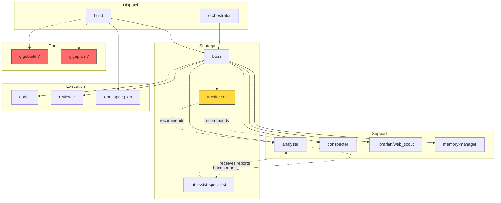

# ana002 — Agent Alignment Audit

**Date:** 2026-07-17
**Method:** MECE inventory + systems thinking (layer interaction analysis)
**Scope:** All agent definitions across OMO Slim, native OpenCode, project config, and AGENTS.md

---

## 1. Agent Inventory Matrix

### 1.1 Cross-File Presence Map

| Agent Key | OMO Presets | OMO Agents Section | opencode.json | opencode.jsonc | AGENTS.md | Status |
|---|---|---|---|---|---|---|
| `orchestrator` | ✅ (all 3 presets) | ❌ | ❌ | ❌ | ❌ | OMO-only dispatch |
| `boss` | ✅ | ❌ | ✅ (mode:all) | ❌ | implicit | Dual-defined |
| `architector` | ❌ | ✅ (orchPrompt only) | ✅ (mode:all) | ❌ | ✅ referenced | **No model in presets** |
| `coder` | ✅ | ✅ (empty {}) | ✅ (mode:subagent) | ❌ | ✅ referenced | OK |
| `code-navigator` | ❌ | ❌ | ✅ (mode:subagent) | ❌ | ✅ referenced | **No OMO config** |
| `researcher` | ❌ | ❌ | ✅ (mode:subagent) | ❌ | ❌ | **Orphan — no workflow role** |
| `designer` | ✅ | ❌ | ✅ (mode:subagent) | ❌ | ❌ | Defined but unused in workflow |
| `observer` | ✅ | ❌ | ✅ (mode:subagent) | ❌ | ❌ | Defined but unused in workflow |
| `explorer` | ✅ | ✅ (empty {}) | ❌ | ❌ (disabled: `explore`) | ❌ | Name mismatch with disabled `explore` |
| `librarian` | ✅ | ✅ (displayName: web_scout) | ❌ | ❌ | ✅ as `@web_scout` | **Identity split** |
| `conspecter` | ✅ | ✅ (orchPrompt) | ❌ | ❌ | ❌ | OMO-only, no AGENTS.md mention |
| `analyzer` | ✅ | ✅ (prompt + orchPrompt) | ❌ | ✅ (council perm) | ✅ referenced | Dual prompt, permission conflict |
| `openspec-plan` | ✅ | ✅ (orchPrompt) | ❌ | ✅ (in build task perm) | ✅ referenced | OK |
| `ai-assist-specialist` | ✅ | ✅ (prompt + orchPrompt) | ❌ | ❌ | ✅ as `@ai_assist_specialist` | **Naming mismatch** |
| `reviewer` | ✅ | ✅ (orchPrompt) | ✅ (mode:all) | ❌ | ❌ | Dual-defined |
| `memory-manager` | ✅ | ✅ (orchPrompt) | ❌ | ❌ | ✅ referenced | OK |
| `build` | ❌ | ❌ | ❌ | ✅ (primary) | ❌ | **Project-only, no OMO** |
| `plan` | ❌ | ❌ | ❌ | ✅ (primary) | ❌ | **Project-only, no OMO** |
| `gigabuild` | ❌ | ❌ | ❌ | ✅ (in build task perm) | ❌ | **Ghost — referenced, never defined** |
| `gigaplan` | ❌ | ❌ | ❌ | ✅ (in build/plan task perm) | ❌ | **Ghost — referenced, never defined** |
| `council` | ❌ | ❌ | ❌ | ✅ (permissions) | ❌ | System agent, OK |
| `councillor` | ❌ | ❌ | ❌ | ✅ (permissions) | ❌ | System agent, OK |

### 1.2 Naming Inconsistencies

| Issue | Detail | Severity |
|---|---|---|
| `librarian` vs `web_scout` | OMO key is `librarian`, displayName is `web_scout`, AGENTS.md references `@web_scout`. The dispatch name and the config key diverge. | 🔴 High |
| `ai-assist-specialist` vs `ai_assist_specialist` | Config uses hyphens, AGENTS.md uses underscores. OrchestratorPrompt header says `@ai_assist_specialist`. | 🟡 Medium |
| `explore` vs `explorer` | opencode.jsonc disables `explore` (built-in), OMO defines `explorer` (custom). Different names, potentially confusing. | 🟡 Medium |

---

## 2. Workflow Chain Ownership Analysis

### 2.1 AGENTS.md Prescribed Chain

```
Architecture (RARE)          Specification              Implementation
@architector ──────────→ @openspec-plan ──────────→ @coder
     │                        │                        │
     │ .sdd/<mod>/            │ .openspec/changes/     │ code changes
     │ architecture.md        │ proposal.md            │
     │                        │ design.md              │
     │                        │ tasks.md               │
     ▼                        ▼                        ▼
  [design authority]     [practice-protected]     [post-flight: build/lint/test]
```

### 2.2 Actual Dispatch Paths (from config files)

```
User request
     │
     ├──→ opencode.jsonc: "build" (default_agent, primary)
     │         │
     │         ├──→ task: boss (allow)
     │         ├──→ task: openspec-plan (allow)
     │         ├──→ task: gigabuild (allow) ← GHOST
     │         └──→ task: gigaplan (allow)  ← GHOST
     │
     ├──→ opencode.jsonc: "plan" (primary, read-only)
     │         │
     │         └──→ task: gigaplan (allow) ← GHOST
     │
     └──→ OMO Slim: "orchestrator" (preset: cebula)
               │
               ├──→ dispatches: boss, coder, explorer, designer,
               │    observer, openspec-plan, ai-assist-specialist,
               │    reviewer, conspecter, analyzer, memory-manager
               │
               └──→ boss dispatches: architector, conspecter, analyzer,
                    coder, reviewer, etc.
```

### 2.3 Ownership Gaps

| Workflow Step | AGENTS.md Owner | Actual Dispatcher | Gap |
|---|---|---|---|
| Architecture audit | @architector | boss (via OMO orchestrator) | ✅ Aligned |
| Spec authoring | @openspec-plan | build agent OR boss | ⚠️ Two entry points |
| Implementation | @coder | boss OR build agent | ⚠️ Two entry points |
| Code review | @reviewer | boss | ✅ Aligned |
| Telemetry analysis | @analyzer | @ai_assist_specialist request | ✅ Aligned |
| Knowledge persistence | @memory-manager | boss (post-task) | ✅ Aligned |
| Web research | @web_scout (=librarian) | boss | ⚠️ Name mismatch in dispatch |

---

## 3. Ghost and Orphan Agents

### 3.1 Ghost Agents (Referenced but Never Defined)

| Agent | Where Referenced | Impact |
|---|---|---|
| `gigabuild` | opencode.jsonc line 53 (`build.permission.task.gigabuild: "allow"`) | Permission granted to a non-existent agent. No-op or error at dispatch time. |
| `gigaplan` | opencode.jsonc lines 54, 69 (`build` and `plan` task permissions) | Same — permission for a phantom agent. |

### 3.2 Orphan Agents (Defined but No Workflow Role)

| Agent | Where Defined | Issue |
|---|---|---|
| `researcher` | opencode.json line 48-50 (mode: subagent) | Not in AGENTS.md, not in OMO presets. Has a color but no purpose. |
| `designer` | OMO presets + opencode.json | Has model config but no AGENTS.md workflow role. Used ad-hoc? |
| `explorer` | OMO presets + agents section | No AGENTS.md role. Overlaps with `code-navigator`? |
| `conspecter` | OMO presets + agents section | No AGENTS.md mention. Used only via architector recommendation. |

---

## 4. Context Budget Assessment

### 4.1 Skills and MCP Allocation by Role

| Agent | Skills Count | MCPs | Model Tier | Assessment |
|---|---|---|---|---|
| orchestrator | `*` (all) | `*` minus context7 | high/max | ✅ Dispatch needs full toolkit |
| boss | 5 (teaching, simplify, book-rag, mermaid, console-charting) | 0 | high/max | ✅ Strategic role, no live tools needed |
| coder | 3 (simplify, playwright-browser, debugging-workflow) | 0 | medium | ✅ Implementation-focused |
| analyzer | 5 (teaching, book-rag, mermaid, console-charting, debugging-workflow) | websearch | high | ✅ Analysis + visualization |
| openspec-plan | 1 (teaching) | 0 | high | ✅ Read-only Socratic mode |
| reviewer | 2 (teaching, playwright-browser) | 0 | medium | ✅ Review diversity (different model family) |
| librarian/web_scout | 0 | 3 (websearch, context7, gh_grep) | low | ✅ Research tools, minimal skills |
| conspecter | 0 | websearch | low | ✅ Source capture is mechanical |
| memory-manager | 0 | 0 | low | ✅ Persistence is mechanical |
| ai-assist-specialist | 1 (teaching) | websearch | high | ✅ Research + web access |
| architector | 0 (in presets) | 0 | **UNSET** | 🔴 **No model assigned** |
| observer | 0 | 0 | low/medium | ✅ Vision-only role |

### 4.2 Budget Concerns

1. **`architector` has no model in any preset.** It's defined in the OMO agents section with an orchestratorPrompt but has no entry in `presets.cebula`, `presets.opencode-go`, or `presets.free`. When boss dispatches @architector, it falls back to... undefined behavior or default model.

2. **`orchestrator` gets `skills: ["*"]`** — this means every skill is loaded into the orchestrator's context. For a dispatch-only role, this is potentially wasteful. The orchestrator doesn't write code, review, or analyze — it routes. Consider restricting to dispatch-relevant skills only.

3. **Three presets with near-identical structure** (`opencode-go`, `cebula`, `free`) means any agent config change must be replicated three times. The `analyzer` config is identical across all three presets — pure duplication.

---

## 5. OrchestratorPrompt Quality

### 5.1 Coverage

| Agent | Has orchestratorPrompt | Has prompt | Quality |
|---|---|---|---|
| architector | ✅ | ❌ | ⚠️ Truncated at 2000 chars — full content unknown |
| conspecter | ✅ | ❌ | ✅ Clear two-phase workflow with guard gate |
| analyzer | ✅ | ✅ | ⚠️ **Dual prompt** — which takes precedence? |
| openspec-plan | ✅ | ❌ | ✅ Clear Socratic workflow, practice-protected |
| ai-assist-specialist | ✅ | ✅ | ⚠️ **Dual prompt** — which takes precedence? |
| reviewer | ✅ | ❌ | ✅ Structured checklist, severity system |
| memory-manager | ✅ | ❌ | ✅ Clear core rule and delegation criteria |
| coder | ❌ | ✅ (in preset) | ✅ Implementation-focused with escalation rule |
| librarian | ❌ | ❌ | ⚠️ No prompt at all — runs on model defaults |
| explorer | ❌ | ❌ | ⚠️ No prompt at all |
| observer | ❌ | ❌ | ⚠️ No prompt at all (vision-only, may be OK) |

### 5.2 Dual-Prompt Conflict

`analyzer` and `ai-assist-specialist` both have a `prompt` field (in the OMO agents section) AND an `orchestratorPrompt` field. These serve different purposes:
- `prompt` = injected into the agent's system message
- `orchestratorPrompt` = shown to the orchestrator/boss for dispatch decisions

But the `prompt` for `analyzer` is 2000+ chars of detailed instructions, while the `orchestratorPrompt` is a summary. If both are loaded, the agent gets conflicting levels of detail. If only one is loaded, which one?

---

## 6. Layer Conflicts and Redundancies

### 6.1 Conflict Matrix

| Conflict | Layer A | Layer B | Nature | Severity |
|---|---|---|---|---|
| **Dispatch authority** | opencode.jsonc: `build` is `default_agent` | OMO Slim: `orchestrator` dispatches | Two dispatch systems compete | 🔴 High |
| **Analyzer ↔ council** | opencode.jsonc: `analyzer` can dispatch `council` | OMO orchestratorPrompt: "Analyzer never calls @council directly" | Direct contradiction | 🔴 High |
| **Architector permissions** | opencode.json: `edit: deny, bash: deny, task: deny` | OMO orchestratorPrompt: "architect recommends @conspecter; boss dispatches it" | Permission denies what prompt describes | 🟡 Medium |
| **Agent naming** | opencode.jsonc: disables `explore` | OMO: defines `explorer` | Different names, same concept | 🟡 Medium |
| **Spec entry point** | AGENTS.md: boss → @openspec-plan | opencode.jsonc: `build` can dispatch `openspec-plan` directly | Bypasses boss routing | 🟡 Medium |
| **Model duplication** | `cebula` preset | `opencode-go` preset | Near-identical configs, different models | 🟡 Medium (maintenance) |

### 6.2 The Dual-Dispatch Problem

The system has **two parallel dispatch hierarchies** that can conflict:

```
Hierarchy 1 (opencode.jsonc):
  User → build (default_agent) → boss / openspec-plan / gigabuild / gigaplan

Hierarchy 2 (OMO Slim):
  User → orchestrator → boss → coder / reviewer / architector / etc.
```

When a user starts a session, `default_agent: "build"` activates. But OMO Slim's orchestrator also activates. If the user types a request:
- Does `build` handle it directly?
- Does `orchestrator` intercept and route?
- Can `build` dispatch `boss`, which is also dispatched by `orchestrator`?

This is not documented anywhere. The two hierarchies coexist without a clear precedence rule.

---

## 7. Systems Thinking: Agent Ecosystem Health

### 7.1 Agent Role Clarity (MECE Classification)

```
┌─────────────────────────────────────────────────────────┐
│                  DISPATCH LAYER                          │
│  orchestrator (OMO)    build (jsonc)    plan (jsonc)    │
│  ─────────────────────────────────────────────────────── │
│  PROBLEM: Two dispatch systems, unclear precedence       │
└──────────────┬──────────────────────────────────────────┘
               │
┌──────────────▼──────────────────────────────────────────┐
│                  STRATEGY LAYER                          │
│  boss          architector          ai-assist-specialist │
│  ─────────────────────────────────────────────────────── │
│  boss: well-defined. architector: no model.              │
│  ai-assist-specialist: naming mismatch.                  │
└──────────────┬──────────────────────────────────────────┘
               │
┌──────────────▼──────────────────────────────────────────┐
│                  EXECUTION LAYER                         │
│  coder       reviewer       openspec-plan    designer    │
│  ─────────────────────────────────────────────────────── │
│  coder/reviewer: well-defined.                           │
│  openspec-plan: clear practice-protection.               │
│  designer: no workflow role in AGENTS.md.                │
└──────────────┬──────────────────────────────────────────┘
               │
┌──────────────▼──────────────────────────────────────────┐
│                  SUPPORT LAYER                           │
│  analyzer    conspecter    librarian    memory-manager   │
│  explorer    observer                                    │
│  ─────────────────────────────────────────────────────── │
│  analyzer: dual-prompt conflict.                         │
│  librarian: identity split (web_scout).                  │
│  explorer/observer: no workflow role.                    │
│  gigabuild/gigaplan: GHOSTS.                             │
└─────────────────────────────────────────────────────────┘
```

### 7.2 Dependency Graph (Who Needs Whom)



---

## 8. Findings Summary

### Critical (🔴)

| # | Finding | Impact |
|---|---|---|
| C1 | **Dual dispatch hierarchy** — `build` (opencode.jsonc) and `orchestrator` (OMO Slim) both claim dispatch authority with no precedence rule | Agents may receive conflicting instructions or double-dispatch |
| C2 | **`gigabuild` and `gigaplan` are ghost agents** — permissions granted in opencode.jsonc but never defined | Dead permissions, potential dispatch errors |
| C3 | **`architector` has no model in any preset** — defined in agents section and opencode.json but missing from all 3 OMO presets | Dispatch will fail or use undefined default |
| C4 | **Analyzer ↔ council permission contradiction** — opencode.jsonc grants `council` dispatch to analyzer, OMO orchestratorPrompt explicitly forbids it | Conflicting instructions cause unpredictable behavior |

### Major (🟡)

| # | Finding | Impact |
|---|---|---|
| M1 | **`librarian`/`web_scout` identity split** — config key is `librarian`, displayName is `web_scout`, AGENTS.md references `@web_scout` | Dispatch confusion — which name to use? |
| M2 | **`ai-assist-specialist` naming mismatch** — hyphens in config, underscores in AGENTS.md | Documentation doesn't match implementation |
| M3 | **Dual prompts on `analyzer` and `ai-assist-specialist`** — both `prompt` and `orchestratorPrompt` defined, precedence unclear | Agent may receive conflicting instructions |
| M4 | **`researcher` is an orphan** — defined in opencode.json with mode/color but no workflow role, no OMO config, no AGENTS.md mention | Dead configuration |
| M5 | **Three near-identical presets** — `opencode-go`, `cebula`, `free` duplicate agent structure, any change must be triplied | Maintenance burden, drift risk |

### Minor (🟢)

| # | Finding | Impact |
|---|---|---|
| m1 | `designer`, `explorer`, `observer` have no AGENTS.md workflow role | Not harmful but adds cognitive load |
| m2 | `explore` (disabled) vs `explorer` (active) naming similarity | Confusing when reading config |
| m3 | `orchestrator` gets `skills: ["*"]` — all skills loaded for a dispatch-only role | Unnecessary context consumption |
| m4 | `librarian` has no prompt at all — runs on model defaults only | May produce inconsistent output |

---

## 9. Recommended Actions (Priority Order)

1. **Resolve dual dispatch** — Decide: is `build` the user-facing primary agent that delegates to OMO's `orchestrator`? Or does `orchestrator` own all dispatch? Document the precedence rule in AGENTS.md.

2. **Define or remove ghosts** — Either define `gigabuild`/`gigaplan` as agents, or remove their permission entries from opencode.jsonc.

3. **Add `architector` to presets** — Give it a model assignment in all 3 presets (or at minimum in `cebula`, the active preset).

4. **Fix analyzer ↔ council contradiction** — Remove `council: "allow"` from analyzer's opencode.jsonc permissions, OR update the orchestratorPrompt to allow it. Pick one.

5. **Unify `librarian`/`web_scout`** — Either rename the config key to `web_scout` or update AGENTS.md to reference `@librarian`. One name, one key.

6. **Resolve dual prompts** — For `analyzer` and `ai-assist-specialist`, decide: is `prompt` or `orchestratorPrompt` the authoritative instruction set? Remove the redundant one, or explicitly document which takes precedence.

7. **Remove or assign `researcher`** — Either give it a workflow role in AGENTS.md or remove it from opencode.json.

---

## Appendix: Raw Agent Count

| Layer | Count |
|---|---|
| OMO Slim presets (cebula) | 13 agents |
| OMO Slim agents section | 10 agents |
| opencode.json (native) | 8 agents |
| opencode.jsonc (project) | 8 agents (incl. 2 disabled) |
| AGENTS.md references | 10 agents |
| **Union (unique agents across all files)** | **20** |
| **Ghosts (referenced, never defined)** | **2** |
| **Orphans (defined, never referenced in workflow)** | **4** |
