# Tests Ponytail Audit — Over-Engineering & Quality Audit

<!-- ANALYZER-OUTPUT-CONTRACT
schema-version: 1.0
agent: analyzer
claim-type: finding
evidence-source: session ana003-tests-ponytail-audit (read-only audit of /workspace test surface)
confidence: High
shelf-registration: memory-shelf.yaml (shelf.analyses), delegated to @memory-manager
-->

## 0. Executive Summary

The test suite is **well-disciplined in the shell layer** (22 bats files, 180+ tests, hermetic FAKE-mock pattern, every script under test has a corresponding .bats file) but **hollow in the application layer** (Python/TS packages ship scaffold-only tests; the flagship Quasar app declares `test: exit 0`; four workspace packages have zero tests). The shell layer over-indexes on wiring-regression assertions (Makefile greps, literal-string presence checks) and repeats the same C1-stable-word pattern six times. The application layer under-indexes on behavior tests because there is no behavior to test yet — which is fine, but the docstring-pin tests in the Python layer have outlived their purpose and should be deleted.

**Net assessment:** the suite is *safe* (no flaky tests, no network, no real credentials, hermetic by design) but *unbalanced* — ~80% of test mass guards dev-infra scripts; ~20% guards the actual product. That ratio is appropriate for a pre-MVP repo wiring its scaffolding, but it means the moment real application code lands, the suite will be missing the tests that matter.

## 1. Test Surface Inventory

```
Test surface by layer (excluding vendor/bats-core):
===================================================
Layer                 Files   Tests   Lines   Wired into Makefile?
-----------------------------------------------------------------
Python pytest               2       6     120   make test-python (in test-infra)
TS vitest                   2      74    1104   pnpm test (via turbo)
Shell bats                 22     180    4468   make test-shell
Standalone shell probes     3      13     602   make test-config / test-infra
Docker smoke                1      ~30     320   make test-infra
-----------------------------------------------------------------
TOTAL                      30     303    6614   --

Wired into Makefile: 29/30 files
Orphaned (not in Makefile/CI): 0
  (note: turbo.json "test" task runs pnpm test per package; author-studio's
   pnpm test is `exit 0`, so turbo counts it as a pass — see GAP-1)
```

## 2. Test Suite Structure Visualization

```mermaid
%%{init: {'theme': 'base', 'themeVariables': {'darkMode': true, 'background': '#1e1e2e', 'primaryColor': '#2d3a5c', 'primaryTextColor': '#e0e0e0', 'primaryBorderColor': '#5b8def', 'lineColor': '#5b8def', 'secondaryColor': '#3d3520', 'tertiaryColor': '#2a2a36', 'signalColor': '#5b8def', 'signalTextColor': '#e0e0e0', 'labelTextColor': '#e0e0e0', 'noteTextColor': '#e0e0e0', 'noteBkgColor': '#3d3520', 'actorLineColor': '#5b8def', 'actorBorderColor': '#5b8def', 'actorBkg': '#2d3a5c', 'actorTextColor': '#e0e0e0'}}}%%
flowchart TB
    classDef process fill:#1e3a5f,stroke:#5b8def,color:#e0e0e0,stroke-width:2px
    classDef decision fill:#3d2e00,stroke:#eab308,color:#e0e0e0,stroke-width:2px
    classDef store fill:#2d1b4e,stroke:#a855f7,color:#e0e0e0,stroke-width:2px
    classDef boundary fill:#1e1e2e,stroke:#64748b,color:#94a3b8,stroke-dasharray:5 5
    classDef success fill:#0f2d1a,stroke:#22c55e,color:#e0e0e0,stroke-width:2px
    classDef danger fill:#2d0f0f,stroke:#ef4444,color:#e0e0e0,stroke-width:2px
    classDef warn fill:#3d2e00,stroke:#f59e0b,color:#e0e0e0,stroke-width:2px

    Makefile[make test-* targets]:::process
    subgraph app[Application Tests — 20% of mass]
        direction TB
        py_auth[test_auth.py · 2 tests · scaffold]:::warn
        py_smoke[test_smoke.py · 4 tests · scaffold]:::warn
        ts_atlas[load-atlas.test.ts · 14 tests · real]:::success
        ts_opus[opusFormattingFilter.test.ts · 60 tests · real]:::success
        author[author-studio test=exit 0]:::danger
        publishing[publishing-platform · no tests]:::danger
        pkg_4[4 more workspace pkgs · no tests]:::danger
    end
    subgraph infra[Infra Tests — 80% of mass]
        direction TB
        bats[22 .bats files · 180 tests]:::success
        smoke[test-docker-smoke.sh · 30 probes]:::success
        interview[test-interview-enforcement.sh · 5]:::success
        ticket[test-ticket-gate.sh · 4]:::success
    end
    Makefile -->|test-python| py_auth
    Makefile -->|test-python| py_smoke
    Makefile -->|turbo test| ts_atlas
    Makefile -->|turbo test| ts_opus
    Makefile -->|turbo test| author
    Makefile -->|turbo test| publishing
    Makefile -->|turbo test| pkg_4
    Makefile -->|test-shell| bats
    Makefile -->|test-infra| smoke
    Makefile -->|test-config| interview
    Makefile -->|test-config| ticket
```



```
┌─ How to read this diagram ──────────────────────────┐
│ Title: Test-mass distribution across Makefile gates │
│ Nodes: each test target or test file                │
│ Colors: green = real tests, amber = scaffold-only,  │
│         red = exit-0 placeholder / absent           │
│ How to read: 80% of the test surface guards the     │
│ dev-infra scripts (left); only 2 TS files and 2     │
│ tiny pytest files guard the actual product. The     │
│ author-studio app and 4 workspace packages have     │
│ zero test coverage.                                 │
└─────────────────────────────────────────────────────┘
```

## 3. Findings Summary Table

| # | Dimension        | Count | Severity |
|---|------------------|-------|----------|
| 1 | ERRORS           |     3 | High     |
| 2 | REPETITION       |     6 | Medium   |
| 3 | GAPS             |     9 | High     |
| 4 | EXTRA CODE       |     4 | Medium   |
| 5 | DANGEROUS SPOTS  |     4 | Medium   |
| 6 | SMELLS           |     6 | Low      |
| 7 | PONYTAIL         |     5 | Medium   |
|   | **TOTAL**        | **37**|          |

## 4. Findings List

### 4.1 ERRORS — broken tests, incorrect assertions, green walls

**ERR-1 · `apps/author-studio/package.json:13` — test script is `echo "No test specified" && exit 0`**
- **What is wrong:** `turbo test` counts this as a successful test pass for the flagship app. Every `pnpm test` / `pnpm verify:js-tests` run reports green for `author-studio` regardless of the package's actual state.
- **Why it matters:** masks the absence of tests with a fake pass; when a real test is eventually added, the `exit 0` placeholder must be remembered and removed. Worse: the CI "all tests pass" signal is already compromised.
- **Concrete fix:** change to a test that actually fails loudly — `"test": "echo 'author-studio: tests not implemented' && exit 1"` OR integrate vitest like the other packages. The `exit 0` should not be an option.

**ERR-2 · `apps/api-server/tests/test_auth.py:27-30` — docstring-pin test asserts scaffold language**
- **What is wrong:** `test_docstring_declares_jwt_and_oauth_contract` asserts the module docstring contains "jwt" and "oauth". If a developer rewords the docstring (e.g., adds context), this test fails even though no behavior changed. The test pins PROSE, not behavior.
- **Why it matters:** it trains developers to treat tests as noise. A test that fails on docstring edits teaches the team that "tests can break for no real reason."
- **Concrete fix:** delete the test. The `test_module_is_importable_from_package_path` import test is the useful one; keep it.

**ERR-3 · `packages/analytics-pipeline/tests/test_smoke.py:40-51` — three docstring-pin tests**
- **What is wrong:** `test_numpy_calc_docstring_declares_analytics_core_contract`, `test_cron_docstring_declares_daemon_contract`, `test_uow_docstring_declares_single_commit_contract` all pin prose. Same failure mode as ERR-2.
- **Why it matters:** identical anti-pattern; three tests that will flake on doc edits forever.
- **Concrete fix:** delete all three. Keep `test_modules_import_from_namespace_package_path` (the useful one). Net: -3 tests, +0 risk.

### 4.2 REPETITION — duplicated code

**REP-1 · `apps/api-server/tests/conftest.py` ≡ `packages/analytics-pipeline/tests/conftest.py`**
- Both are 17-19 lines of `sys.path.insert(0, Path(__file__).parents[1])`. The only difference is the constant name.
- **Fix:** extract into `packages/test-helpers/conftest_snippet.py` or inline into each pyproject.toml via `pythonpath = ["."]` (pytest 7+).

**REP-2 · `scripts/__tests__/verify-pre-commit.bats:17-36` ≡ `verify-pre-push.bats:16-36`**
- IDENTICAL `setup()` blocks: fake hostname, POETRY_COMMANDS_DIR wiring. 20 lines duplicated.
- **Fix:** move to `test-helper.bash` as `setup_hermetic_host_context`.

**REP-3 · `scripts/__tests__/check-host-jq.bats:22-32` + `check-host-lsp.bats:32-52` + `eval-lite.bats:39-50` — duplicated `mock_docker` patterns**
- Three different "fake docker" factories. test-helper.bash already has one `mock_docker`. These should extend it, not rewrite it.
- **Fix:** add `mock_docker_down` and `mock_docker_compose_ps` helpers to `test-helper.bash`; delete local copies.

**REP-4 · `scripts/__tests__/check-pin-sync.bats` — 4 identical ok-line assertion blocks**
- Tests T1, T8, T9, T10 each repeat 5 assertions: four `ok:` lines + `summary: 4 ok, 0 fail`. Copy-paste with parameter values changed.
- **Fix:** extract `assert_four_ok` helper at top of file.

**REP-5 · `scripts/__tests__/validate-skills.bats` — C1 stable-word pattern repeated 6 times**
- `assert_output_contains "passed"; assert_output_contains "failed"; assert_output_contains "warnings"` appears in lines 108-110, 240-241, 259-260, 359-361, 374-376, with identical C1 comments.
- **Fix:** one `assert_summary_words` helper in-file.

**REP-6 · `packages/editor-engine/src/view/opusFormattingFilter.test.ts:523-675` — 12 near-identical punctuation tests**
- `allows single comma/colon/semicolon/hyphen/english-apostrophe/ukr-apostrophe` and `blocks double ...` are the same test body with one character swapped.
- **Fix:** `it.each([",", ":", ";", "-", "'", "'"])("allows single %s", (ch) => {...})`. Net: 12 tests -> 2 parameterized.

### 4.3 GAPS — untested critical paths

**GAP-1 · `apps/author-studio/` — zero tests; `test: exit 0` green-walls it (see ERR-1)**
- Flagship Quasar app integrating 6 workspace packages. Workers, Pinia stores, router, boot files — all untested.
- **Priority:** HIGH. This is where the product lives.

**GAP-2 · `packages/data-contracts/` — zero tests**
- Protobuf schema package. Canonical JSON serialization, version negotiation — all untested. Data-contract bugs are cross-language; they must be caught here.
- **Priority:** HIGH.

**GAP-3 · `apps/api-server/app/` — zero behavior tests**
- Only test is the scaffold import test (ERR-2). When FastAPI routes / SQLAlchemy models / JWT logic land, there will be no tests to extend.
- **Priority:** MEDIUM (until real code lands).

**GAP-4 · `packages/stress-lang-core/`, `packages/visualizer-2d/`, `packages/visualizer-3d/` — zero tests**
- Three workspace packages with no tests. WASM stress logic and D3/TresJS visualizers are untested.
- **Priority:** MEDIUM.

**GAP-5 · `packages/analytics-pipeline/src/` — zero behavior tests**
- Same scaffold-only pattern as api-server (ERR-3).
- **Priority:** MEDIUM.

**GAP-6 · No cross-package integration tests**
- author-studio integrates 6 packages via workers + MessageChannel. No test exercises the integration seam.
- **Priority:** HIGH (architecture.md §4 explicitly says worker boundaries are thin wrappers — verify they stay thin).

**GAP-7 · No `docker-compose.yml` validation in test-config**
- YAML syntax, service definitions, and secret mounts are only exercised by `test-docker-smoke.sh` (requires Docker). A malformed compose file slips through test-shell and test-config.
- **Fix:** add `docker compose config --quiet` to test-config.

**GAP-8 · No test for `scripts/test-docker-smoke.sh` itself**
- The smoke test has no self-test. If it regresses (e.g., a probe's grep pattern drifts), no gate catches it.
- **Priority:** LOW (it's exercised on every `make test-infra`).

**GAP-9 · No `.devcontainer/` configuration tests**
- devcontainer.json, postCreateCommand, features — validated only by `make test-infra` (slow, needs Docker).
- **Priority:** LOW.

### 4.4 EXTRA CODE — dead / speculative / placeholder

**EXT-1 · `scripts/__tests__/bats-wrapper.sh:20-46` — hand-maintained `bash -n` list**
- 25-entry list of scripts to syntax-check. Adding a new script requires remembering to update this list.
- **Fix:** `find scripts -maxdepth 1 -name '*.sh' -print0 | xargs -0 -n1 bash -n` + explicit exclusion list. Auto-discovery > manual list.

**EXT-2 · `apps/api-server/tests/test_auth.py` docstring test (ERR-2) — dead test**
- See ERR-2.

**EXT-3 · `packages/analytics-pipeline/tests/test_smoke.py` docstring tests (ERR-3) — dead tests**
- See ERR-3.

**EXT-4 · `packages/phonetics-core/src/atlas/load-atlas.test.ts:286-293` — deterministic-hash test**
- `content hash is deterministic across atlas loads` loads the same buffer twice and asserts the hash is the same. This proves `fromBuffer` is pure, which it trivially is. No failure mode exercises anything.
- **Fix:** delete. Net: -8 lines, +0 coverage.

### 4.5 DANGEROUS SPOTS

**DNG-1 · `scripts/test-docker-smoke.sh:57-60` — `cleanup()` runs `docker compose down` on EXIT**
- The comment documents this but the trap is unconditional. A developer running `make test-infra` while their stack is up will LOSE their running stack.
- **Mitigation:** already documented, but consider a `--keep-stack` flag or a pre-flight check for running services.

**DNG-2 · `scripts/test-docker-smoke.sh:296-318` — background `pnpm dev` probe**
- Starts `pnpm dev` in background, polls for HTTP 200, then `kill + wait`. If the container is in a bad state, the dev server could leak beyond the `timeout 180`.
- **Mitigation:** `timeout 180` bounds the blast radius; acceptable.

**DNG-3 · `scripts/__tests__/worktrees.bats:218-231` — 20-second fake sleep in T13**
- `FAKE_LS_REMOTE_SLEEP=20` with a 12-second outer timeout. If the internal `timeout 5` regresses, the test waits 12s then fails. The 20s fake is more aggressive than needed.
- **Fix:** reduce to `FAKE_LS_REMOTE_SLEEP=8` — still well above the 5s internal timeout, but the outer test finishes in ~6s instead of ~12s on regression.

**DNG-4 · `scripts/__tests__/dev-entrypoint.bats` — unshare namespace**
- Uses `unshare -r -m`. Skip logic is in `require_unshare` but if that skip regresses, failures are cryptic.
- **Mitigation:** `require_unshare` is called at the top of each relevant test; acceptable.
- **Credentials check:** no real secrets in tests; fake secrets like `sk-123`, `openai-key`, `gh-token` are used. **OK.**

### 4.6 SMELLS — over-engineering, assertion-free tests, always-pass

**SML-1 · `packages/phonetics-core/src/atlas/load-atlas.test.ts:276-277` — async re-import inside test**
- `const { readFileSync } = await import('node:fs');` re-imports a module already imported at line 16. The dynamic import is unnecessary.
- **Fix:** use the top-level import.

**SML-2 · `packages/editor-engine/src/view/opusFormattingFilter.test.ts` — 745 lines for a formatting filter**
- One filter, 60+ tests. The test file is larger than most source files in the repo. Many tests assert trivial variations.
- **Smell:** test-to-source ratio is ~10:1. Not inherently wrong for a complex filter, but the duplication (REP-6) suggests over-test.

**SML-3 · `scripts/__tests__/validate-agent-names.bats:365-380` + `:382-397` — two tests with identical shape**
- `declared name absent from §9 exits 1` and `§9 name unresolved in all sources exits 1` have the same structure (build tree, run, assert exit 1 + FAIL line + "N passed, 1 failed, 0 warnings").
- **Fix:** parameterize.

**SML-4 · `scripts/__tests__/validate-skills.bats` — 532 lines**
- 22 tests, many testing the same failure-mode shape with different fixture content. The M4-fixture setup (lines 37-38, 82-95) is itself a fixture-factory for a fixture.

**SML-5 · `scripts/__tests__/audit-agent-tool-coverage.bats:426-454` — T6 Makefile integration test**
- Manually re-runs the audit recipe lines instead of invoking `make test-config`. This duplicates the Makefile wiring and can drift.
- **Fix:** invoke `make test-config` directly (already runs in test-config). Or accept the duplication as hermeticity insurance (documented trade-off).

**SML-6 · `turbo.json:21-25` — `test` task depends on `build`**
- Every package's test waits for build, but author-studio has no real tests and its build is heavy (Quasar). Net: CI spends ~30s building author-studio to run a no-op test.
- **Fix:** remove the `dependsOn: ["build"]` for packages with no real build output, or exclude author-studio from `turbo test`.

### 4.7 PONYTAIL findings — what to DELETE, SIMPLIFY, or replace

**`delete:`** `apps/api-server/tests/test_auth.py:27-30` (docstring test). `packages/analytics-pipeline/tests/test_smoke.py:40-51` (3 docstring tests). Net: -4 tests, +0 real coverage, -1 source of test flake on doc edits.

**`delete:`** `packages/phonetics-core/src/atlas/load-atlas.test.ts:286-293` (deterministic-hash test). Net: -8 lines.

**`stdlib:`** The 6 assertion helpers in `test-helper.bash` (`assert_status`, `assert_output_contains`, `assert_output_not_contains`, `assert_file_exists`, `assert_file_not_exists`, `assert_file_contains`) duplicate what `bats-assert` + `bats-file` ship. The comment on line 22-23 says "kept local; no bats-assert dependency" — but the project already vendors bats-core (bats-wrapper.sh:59-68); adding `bats-assert` as a second vendor is lighter than maintaining 6 helpers.

**`yagni:`** `scripts/__tests__/bats-wrapper.sh:20-46` — hand-maintained `bash -n` list of 25 scripts. Replace with `find scripts -maxdepth 1 -name '*.sh' -print0 | xargs -0 -n1 bash -n`. Auto-discovery is the lazy solution.

**`shrink:`** `packages/editor-engine/src/view/opusFormattingFilter.test.ts:523-675` — 12 near-identical punctuation tests -> 2 parameterized `it.each` blocks. Net: ~150 lines -> ~30 lines. Same coverage.

```
┌─ How to read this table ─────────────────────────────────┐
│ Title: Ponytail-tagged findings summary                  │
│ Tags: delete = cut, stdlib = use the platform,           │
│       yagni = doesn't need to exist, shrink = same       │
│       behavior fewer lines                               │
│ Net: -172 lines, -4 meaningless tests, +0 real coverage  │
│ lost. Tests become shorter, less duplicate, no less      │
│ safe.                                                    │
└──────────────────────────────────────────────────────────┘
```

## 5. Top-10 Action List (ranked by severity + leverage)

| Rank | Action                                                                                              | Impact                          |
|------|-----------------------------------------------------------------------------------------------------|---------------------------------|
| 1    | **ERR-1:** flip `author-studio/package.json` test script from `exit 0` to a loud failure OR add vitest | stops green-walling the flagship app |
| 2    | **GAP-1 + GAP-2:** add vitest to `apps/author-studio` and `packages/data-contracts` (protobuf schema) | closes the two highest-risk coverage gaps |
| 3    | **ERR-2 + ERR-3:** delete the 4 docstring-pin tests in `apps/api-server` and `packages/analytics-pipeline` | removes flake-on-doc-edit tests |
| 4    | **REP-6:** parameterize the 12 punctuation tests in `opusFormattingFilter.test.ts`                    | -120 lines, same coverage       |
| 5    | **REP-1 + REP-2 + REP-3:** consolidate duplicated setup/mock helpers into `test-helper.bash` + a pytest-pythonpath tweak | -60 lines of duplicated test setup |
| 6    | **GAP-7:** add `docker compose config --quiet` to `test-config`                                      | catches compose YAML regressions without Docker |
| 7    | **EXT-1:** replace the 25-entry `bash -n` list with `find scripts -name '*.sh' \| xargs bash -n`      | auto-discovery > manual list    |
| 8    | **EXT-4 + SML-1:** delete the deterministic-hash test and the async re-import in `load-atlas.test.ts` | -10 lines of dead tests         |
| 9    | **REP-4 + REP-5 + SML-3:** extract `assert_four_ok` / `assert_summary_words` / parameterize the agent-names tests | -60 lines of copy-paste |
| 10   | **SML-6:** drop the `dependsOn: ["build"]` for author-studio in `turbo.json` OR exclude it from `turbo test` | saves ~30s CI time per run |

## 6. Coverage Gap Analysis — What Is NOT Tested

```
Coverage by code area (test mass vs. product mass):
====================================================
Area                              Product mass    Test mass     Balance
----------------------------------------------------------------------
apps/api-server (FastAPI)              medium         tiny       UNDER
apps/author-studio (Quasar)             large         ZERO       CRITICAL
apps/publishing-platform                small         ZERO       UNDER
packages/data-contracts (protobuf)      small         ZERO       CRITICAL
packages/editor-engine                  medium        heavy      BALANCED
packages/phonetics-core                 medium        heavy      BALANCED
packages/stress-lang-core               small         ZERO       UNDER
packages/visualizer-2d                  small         ZERO       UNDER
packages/visualizer-3d                  small         ZERO       UNDER
packages/analytics-pipeline             small         tiny       UNDER
Dev-infra scripts (scripts/*)           large         heavy      OVER
OpenCode config (.opencode/*)           medium        heavy      BALANCED
----------------------------------------------------------------------
```

```
┌─ How to read this table ─────────────────────────────────┐
│ Title: test mass vs product mass per area                │
│ Balance: BALANCED = test mass matches product mass,      │
│          UNDER = product outstrips tests, CRITICAL =     │
│          zero tests for a critical surface, OVER =       │
│          tests outstrip product (appropriate for         │
│          pre-MVP infra).                                 │
│ Key takeaway: the two CRITICAL gaps are author-studio    │
│ (the flagship app) and data-contracts (cross-language    │
│ protobuf schema). Fix these first.                       │
└──────────────────────────────────────────────────────────┘
```

**Urgent gaps:**

1. **author-studio + data-contracts** (CRITICAL) — zero tests for the flagship app and the cross-language data-contract package. Any bug in protobuf serialization or worker boundary slips through.
2. **apps/api-server behavior** (UNDER) — the moment FastAPI routes land, tests need to exist. The current import-only tests do not provide a base to extend.
3. **Visualizer / stress packages** (UNDER) — untested but lower priority because they are consumed by author-studio, whose tests will exercise them transitively once written.
4. **Cross-package integration** (GAP-6) — no test spans the worker boundary. architecture.md §4 says worker wrappers must be thin; no test verifies they stay thin.

## 7. What the suite does well

Not everything is a finding. Credit where credit is due:

- **Hermeticity by design.** Every bats test uses FAKE-mock seam or isolated temp trees under `$BATS_TEST_TMPDIR`. Real docker, real mise, real node_modules, real secrets are NEVER touched. The `mock_docker` pattern is a model other projects should copy.
- **Exit-code contracts are documented and tested.** Each validator script declares its 0/1/2 contract, and the tests assert all three branches.
- **No flaky patterns.** No `sleep` in assertions, no network calls, no time-dependent logic. The one `sleep 0.2` in `dev-entrypoint.bats:68` is bounded and acceptable.
- **No credentials in tests.** All fake secrets use obviously-fake values (`sk-123`, `openai-key`, `gh-token`).
- **Wiring regression guards.** The suite has explicit tests for "Makefile references validator X" — these catch the exact class of bug where a new validator is added but not wired into the gate.
- **The ponytail ladder is mostly honored in tests.** The shell tests use stdlib bash tools (grep, awk, sed, jq) rather than pulling in test frameworks. No over-abstraction.

## 8. Methodology notes

- Read every test file (not grep-matched). Findings cite line numbers from actual reads.
- Excluded: `scripts/__tests__/vendor/bats-core/` (third-party test runner, not project code).
- Excluded: `__pycache__` dirs (already gitignored per `.gitignore:19`).
- Did not run the test suite (the Docker daemon is not available in this environment; Python tests require the dev container per `make test-python`). Findings are code-level, not runtime.
- Followed the ponytail ladder at each finding: does the test need to exist? Is there a stdlib/already-in-codebase equivalent? Is this the smallest test that still fails when behavior breaks?

---

**Artifact path:** `knowledge/ana003-tests-ponytail-audit/ana003-tests-ponytail-audit-report.md`
**Shelf registration:** delegated to @memory-manager (shelf.analyses).
