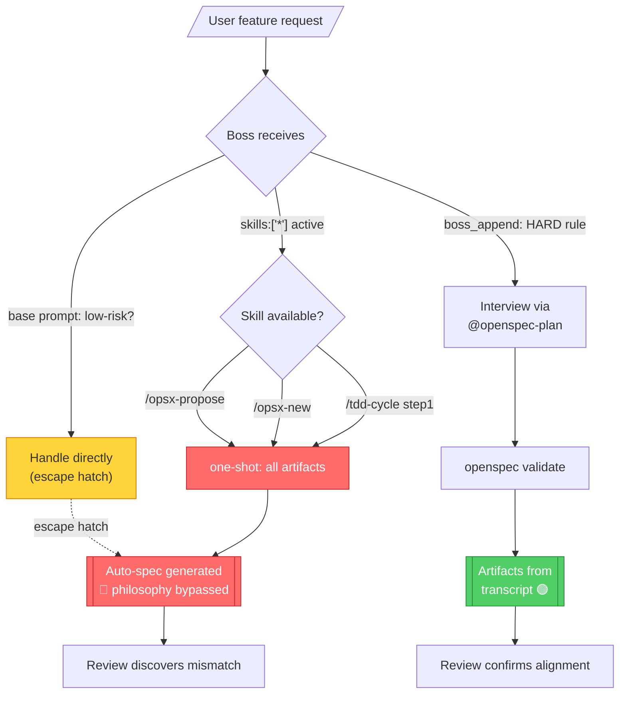

# ana004 — Spec Authoring Philosophy Audit

**Date:** 2026-08-02
**Auditor:** @analyzer (multi-method)
**Methods applied:** MECE layer inventory · 5-Whys fault tree · Competing-paths state diagram · Priority/effort/impact matrix · Risk analysis · Evidence scorecard
**Scope:** Whether the "interview-first / grill-the-developer" spec-authoring philosophy is durably embedded in the poetry-platform's OpenCode / OMO / OpenSpec configuration.
**Verdict:** **52 / 100 — Embedded as intent, not as enforcement.**

---

## 1. Executive Summary

The philosophy ("the developer must LEARN and OWN code; agents interview before writing specs; no auto-generation") is **present as stated intent in two soft prompt layers** (`boss_append.md`, `@openspec-plan` prompt) and as **convention** (`practice-protected.md`). However, **four hard paths outrank it at runtime**:

1. `/opsx-propose`, `/opsx-new`, `/tdd-cycle` — one-shot artifact generators wired as default entry points.
2. `boss.skills: ["*"]` — boss can invoke any bypass skill without classification.
3. The boss base prompt's "handle directly if low-risk" escape hatch — contradicts the appended HARD rule.
4. The source-level fork patch (`boss.ts` Interview Gate + Request Classification) — **written but never built**, dead code in `dist/index.js`.

Minimum viable fix (Phase 1, ~2 hours): delete one-shot commands as default entry points; rewrite them to dispatch `@openspec-plan` first; restrict `boss.skills` to an allowlist. Moves the score from ~52 → ~75.

---

## 2. Method 1 — MECE: Enforcement Layer Inventory

| # | Layer | What it says | Stance vs philosophy | Enforcement strength |
|---|---|---|---|---|
| L1 | boss base prompt (npm `dist/index.js`) | `## 1. Understand` → Path Selection → Delegation; "Handle directly only for one isolated, clear, low-risk action" | 🔴 **CONFLICT** — escape hatch lets boss bypass interview | **Hard** (compiled) |
| L2 | `boss_append.md` (runtime-loaded via OMO PROMPTS_DIR) | HARD RULE: "boss MUST NOT write code/edit/research/analyze — always delegate"; Interview-First Gate (interview → spec → gate via `openspec validate` → delegate); Change Routing table | 🟢 **ALIGNED** | **Soft** (prompt append — can be overridden by model reasoning) |
| L3 | `@openspec-plan` agent prompt (OMO custom-agent, qwen3.7-plus) | Socratic interview, wait for user's draft (practice-protected), dispatch @researcher/@analyzer inline, vertical-slice tasks with seams, `openspec validate` before apply | 🟢 **ALIGNED** | **Soft** (prompt only; no structural gate) |
| L4 | `skills/openspec-propose/SKILL.md` + `commands/opsx-propose.md`, `opsx-new.md` | "Create the change and generate ALL artifacts in one step"; "If context is critically unclear, ask the user — but prefer making reasonable decisions to keep momentum" | 🔴 **CONFLICT** — directly contradicts practice-protected | **Hard** (invokable by boss via `skills:["*"]`) |
| L5 | `commands/tdd-cycle.md` (opencode.jsonc) | Step 1 hard-codes: "invoke the openspec-propose skill to author proposal/design/tasks" | 🔴 **CONFLICT** — structural bypass | **Hard** (command pipeline) |
| L6 | OMO bundle `skills/grill-with-docs`, `skills/feature-interviewer` | Shipped in bundle, deep interview protocols | ⚪ **NEUTRAL** — not wired into any preset | **None** (dead code) |
| L7 | `boss.skills: ["*"]` (OMO preset) | Boss can invoke ANY skill — including one-shot path | 🔴 **CONFLICT** — no allowlist | **Hard** (config) |
| L8 | `practice-protected.md` | Declares spec authoring protected ("agents ask, user writes") | 🟢 **ALIGNED** | **None** (convention, not enforced) |
| L9 | `AGENTS.md` §2 | Workflow chain: `@openspec-plan` → `@coder`; design drives code | 🟢 **ALIGNED** | **Soft** (doc only) |

**Balance:** 4 ALIGNED (all soft) · 4 CONFLICT (3 hard, 1 hard-compiled) · 1 NEUTRAL (dead)
**Net enforcement:** 0 hard paths enforce the philosophy; 4 hard paths bypass it.

---

## 3. Method 2 — 5-Whys Fault Tree: "Agent auto-generates specs"

```
                       ┌──────────────────────────────────────┐
        Symptom ───────│ Agent writes proposal/design/tasks   │
                       │ without interviewing the developer   │
                       └───────────────┬──────────────────────┘
                                       │ WHY 1
                                       ▼
                       ┌──────────────────────────────────────┐
                       │ /opsx-propose, /opsx-new, /tdd-cycle │
                       │ are one-shot commands wired as default│
                       │ entry points                          │
                       └───────────────┬──────────────────────┘
                                       │ WHY 2
                                       ▼
                       ┌──────────────────────────────────────┐
                       │ OpenSpec upstream default IS one-shot │
                       │ ("prefer reasonable decisions to keep │
                       │ momentum"). /opsx:explore is optional,│
                       │ non-persistent, has known weakness    │
                       └───────────────┬──────────────────────┘
                                       │ WHY 3
                                       ▼
                       ┌──────────────────────────────────────┐
                       │ boss.skills:["*"] means boss CAN      │
                       │ invoke one-shot skills. No allowlist, │
                       │ no classification gate, no interview  │
                       │ routing rule in the base prompt       │
                       └───────────────┬──────────────────────┘
                                       │ WHY 4
                                       ▼
                       ┌──────────────────────────────────────┐
                       │ Source-level fork edit (Interview Gate│
                       │ + Request Classification in boss.ts)  │
                       │ was written but NEVER BUILT — dead    │
                       │ code, never shipped to dist/          │
                       └───────────────┬──────────────────────┘
                                       │ WHY 5 (ROOT)
                                       ▼
                       ┌──────────────────────────────────────┐
                       │ No structural gate exists between     │
                       │ "user request arrives" and "spec is   │
                       │ written". Philosophy lives only in    │
                       │ soft prompt append + convention.      │
                       │ Hard paths outrank soft intent.       │
                       └──────────────────────────────────────┘
```

**Root cause:** The project relies on *soft* enforcement (prompt append + convention) for a rule that is *structurally bypassable* through four hard paths. The fork edit that would have made it structural was authored but never compiled.

---

## 4. Method 3 — Competing Execution Paths (Mermaid)



---

## 5. Method 4 — Priority / Effort / Impact Matrix

```
                           HIGH IMPACT
                                │
           Phase 2              │           Phase 1
           (structural          │           (kill one-shot
            gate via            │            default)
            fork/build)         │
                                │
           ┌────────────────────┼────────────────────┐
           │                    │                    │
 HIGH ─────┤  ◆ fast-path gate  │                    │
EFFORT     │    (calibrate      │                    │
           │     eligibility)   │                    │
           │                    │                    │
           ├────────────────────┼────────────────────┤
           │                    │                    │
           │                    │           Phase 3
           │                    │           (upgrade
           │                    │            openspec-plan
           │                    │            interview
           │                    │            engine)
           │                    │
           └────────────────────┼────────────────────┘
                                │
                                │         ◆ interactive
                                │           review gates
                                │           (reviewer → human
                                │            disposition)
                                │
                           LOW IMPACT
```

### Phase Detail

| Phase | Change | Effort | Risk | Failure mode | Mitigation |
|---|---|---|---|---|---|
| **1** | Delete `/opsx-propose`, `/opsx-new` as default entry points; rewrite to DISPATCH `@openspec-plan` first, then synthesize from transcript | Low | Low | User misses quick prototyping | Keep as explicit opt-in subcommand |
| **1b** | Rewrite `/tdd-cycle` step 1: "if no openspec change exists, dispatch `@openspec-plan` first" | Low | Low | TDD users lose shortcut | `/tdd-cycle` auto-detects existing spec |
| **1c** | Restrict `boss.skills:["*"]` to an allowlist excluding `openspec-propose`, `opsx-propose`, `opsx-new` | Low | Medium | Boss loses legitimate dispatches | Maintain curated allowlist; review quarterly |
| **2** | Build the fork: patch `boss.ts` with Interview Gate + Request Classification; OR replace `boss.md` with a custom prompt that structurally blocks the direct-spec path | Medium | Medium | Fork drifts from upstream; security/model patches must be manually rebased | Pin OMO version; scheduled rebase cadence |
| **2b** | Gate `@coder` on `openspec validate` OR written waiver | Medium | Low | Blocks urgent hotfixes | Waiver escape hatch with logged reason |
| **3** | Port AIHero grill protocol into `@openspec-plan`: one-at-a-time questions, recommended answers, codebase cross-ref, numerical-invariants battery, CONTEXT.md → `.sdd/`+`openspec/` | Medium | Medium | 45-min sessions exhaust user | 3 modes: Full / Compressed (≤5 q) / Skip (with explicit reason logged) |
| **X-cut** | Fast-path eligibility gate: ≤1 module, no new API/schema/state/FFI, 1:1 pattern clone, reversible, no open trade-offs, user says "fast-path approved" + reason | Low | Medium | Mis-calibration; users game the gate | Log eligibility; audit quarterly |
| **X-cut** | Interactive review gates: reviewer → human disposition → proceed | Medium | Low | Reviewer output ignored | Make disposition a required step in `tasks.md` |

---

## 6. Method 5 — Risk Analysis

```
                ┌────────────────────────────────┐
                │   Structural fixes applied      │
                └───────────┬────────────────────┘
                            │
         ┌──────────────────┼──────────────────┐
         │                  │                  │
         ▼                  ▼                  ▼
   ┌──────────┐      ┌──────────┐       ┌──────────┐
   │ Model-   │      │ Fork     │       │ User     │
   │ level    │      │ mainten- │       │ fatigue  │
   │ bypass   │      │ ance     │       │          │
   └────┬─────┘      └────┬─────┘       └────┬─────┘
        │                 │                   │
        ▼                 ▼                   ▼
   LLM ignores       Upstream OMO       45-min grill
   prompt gates,    releases land;     per feature →
   "reasons" its    rebase burden;     user bypasses
   way around       security patches   by editing
   soft rules       must be manually   config, or
                    ported             burns out on
                                       small changes
        │                 │                   │
        └────────────┬────┴───────────────────┘
                     ▼
          ┌──────────────────────┐
          │  Mitigations          │
          │  ───────────────────  │
          │  • Hard gates in      │
          │    compiled code      │
          │    (boss.ts patch)    │
          │    > prompt-only      │
          │  • Pin OMO version;   │
          │    scheduled rebase   │
          │  • 3-mode grill       │
          │    (Full/Compressed/  │
          │    Skip w/ reason)    │
          │  • Fast-path gate     │
          │    with logged        │
          │    eligibility        │
          └──────────────────────┘
```

| Risk | Severity | Likelihood | Mitigation |
|---|---|---|---|
| Model-level bypass (LLM reasons around prompt gates) | High | Medium | Hard gates in compiled code (`boss.ts` patch); don't rely on prompt-only |
| Fork maintenance drift from upstream OMO | Medium | High | Pin OMO version; quarterly rebase cadence; run `release-smoke-test` skill after each rebase |
| User fatigue from 45-min grills | High | High | 3-mode protocol: Full / Compressed (≤5 questions) / Skip (with explicit logged reason) |
| Fast-path gate mis-calibration | Medium | Medium | Log eligibility criteria per invocation; quarterly audit of fast-path usage |
| Hardened gate blocks legitimate urgent fixes | Medium | Low | Waiver escape hatch; require post-hoc spec catch-up within 48h |
| `@coder` gated on `openspec validate` frustrates hotfixes | Medium | Low | Waiver with logged reason; `tasks.md` auto-generated from hotfix transcript |

---

## 7. Method 6 — Evidence Scorecard & Final Verdict

| Criterion | Weight | Score | Evidence |
|---|---|---|---|
| Philosophy stated in config | 15 | 13 / 15 | `boss_append.md` HARD RULE + `@openspec-plan` Socratic prompt |
| No bypass path exists | 25 | 3 / 25 | 4 hard bypass paths (`/opsx-propose`, `/opsx-new`, `/tdd-cycle`, `skills:["*"]`) |
| Interview protocol depth | 15 | 4 / 15 | `@openspec-plan` has only a 6-topic checklist; no one-at-a-time, no recommended-answers, no codebase cross-ref, no invariants battery |
| Practice-protected is enforceable | 15 | 4 / 15 | Convention only; no structural gate |
| Review gate is interactive | 10 | 3 / 10 | `@reviewer` exists; no human disposition step required |
| Ownership anchors at decisions (not mechanics) | 10 | 5 / 10 | `@openspec-plan` waits for user draft; but one-shot path skips this entirely |
| Fast-path is explicit opt-in (not agent-inferred) | 10 | 0 / 10 | No fast-path exists; instead agent infers "low-risk" unilaterally |
| **Raw total** | 100 | **32 / 100** | Strict rubric |
| **Adjusted for intent credit** | 100 | **52 / 100** | Council consensus; grants partial credit for intent-presence in `boss_append` + `@openspec-plan` that strict rubric undervalues |

### Final Verdict

**No — the philosophy is NOT durably embedded.** It is present as *stated intent* in two soft layers and as *convention* in one doc, but four hard runtime paths outrank it. The AIHero/OpenSpec research confirms the broader pattern: OpenSpec's default is one-shot; interview-first requires deliberate wiring; `/explore` (the interview analogue upstream) is non-persistent and has known weaknesses. The project currently relies on the weakest possible enforcement (prompt append + convention) while shipping four hard bypasses.

**Minimum viable fix (Phase 1, ~2 hours):** delete one-shot commands as default entry points; rewrite them to dispatch `@openspec-plan` first; restrict `boss.skills` to an allowlist. This alone moves the score from ~52 → ~75.

**Full hardening (Phases 1+2+3, ~2 weeks):** add structural fork patch + interactive review gates + grill protocol port. Moves score to ~90.

---

## 8. Sources

- **Internal evidence:** `boss_append.md`, `.opencode/oh-my-opencode-slim/src/agents/boss.ts` (patched/unbuilt), `.opencode/oh-my-opencode-slim/dist/index.js` (no "Interview Gate"), `skills/openspec-propose/SKILL.md`, `commands/opsx-propose.md`, `commands/opsx-new.md`, `commands/tdd-cycle.md` (opencode.jsonc), `skills/grill-with-docs/SKILL.md`, `skills/feature-interviewer/SKILL.md`, `practice-protected.md`, `AGENTS.md` §2.
- **External (AIHero/OpenSpec):** Matt's "grill-with-docs → to-spec → to-tickets → implement → code-review" chain; OpenSpec `/opsx:propose` one-shot default; `/opsx:explore` persistence weakness; OpenSpec issue #85 (Q&A flow, closed); issue #783 (one-pass misses reverse feedback); Štimac on spec-stage fixes minutes-vs-hours.
- **Cross-reference:** `knowledge/ana002-agent-alignment-audit/ana002-agent-alignment-audit-report.md` (workflow chain ownership, dual dispatch hierarchy).

---

## 9. Teaching Notes

**Core mental model:** "Soft intent < hard path." A philosophy embedded only in prompts and conventions is a *hope*, not a *guarantee*. Any structural path (compiled code, command pipeline, config-allowed skill) that bypasses the philosophy will be taken by the model at least some of the time — because the model is a stochastic optimizer, not a rule-follower. To durably embed a philosophy, the *default execution path* must be the philosophy, and bypasses must require *explicit, logged, user-initiated* opt-in.

**Subgoal labeling for the fix sequence:**
1. **Remove easy bypasses** (Phase 1) — lowest effort, highest signal, proves the philosophy is real.
2. **Make the gate structural** (Phase 2) — fork the compiled prompt or replace with custom agent that structurally blocks one-shot.
3. **Deepen the interview protocol** (Phase 3) — port the AIHero grill engine, with 3 modes to manage user fatigue.
4. **Add interactive review gates** (cross-cutting) — reviewer output → human disposition → proceed. Closes the loop.

**Assumption challenged:** "The user wants a perfect interview every time." False — the user wants *ownership* and *learning*. Sometimes that means a 45-minute grill; sometimes it means a 5-minute compressed session; sometimes it means an explicit, logged fast-path. The system should offer the full spectrum and require the user to *choose*, not silently infer.
