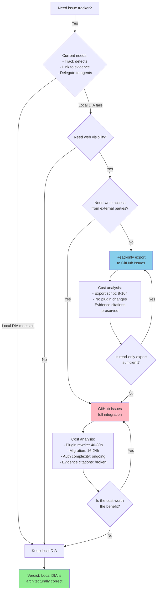

---
# Analysis Report: GitHub Issues vs Local DIA Ledger — Architecture Decision

**Report ID**: ana006  
**Date**: 2026-08-06  
**Campaign**: "Issue-tracker comparison" (2026-08-06)  
**Scope**: Comparative architectural analysis of GitHub Issues integration vs current local DIA ledger  
**Verdict**: Local DIA ledger is the correct architecture; GitHub Issues would add network dependency, auth surface, plugin rewrite cost, and broken evidence citations for zero user-visible benefit. Read-only export is the right move if web visibility is ever needed.

## Executive Summary

**Question**: Should the poetry-platform migrate its dev-infra audit ticket system from the local DIA ledger (Markdown files in `docs/dev-infra-audit/tickets/`) to GitHub Issues?

**Answer**: No. The local DIA ledger is architecturally superior for this project's workflow. GitHub Issues would introduce:
- **Network dependency** (breaks offline work, CI failures on GitHub outage)
- **Auth surface** (GitHub token management, rate limits, permission complexity)
- **Plugin rewrite cost** (delegation-observer plugin needs full rewrite to call GitHub API)
- **Broken evidence citations** (can't reference local `messages.md` rows, session IDs, artifacts in GitHub Issues)
- **Zero user-visible benefit** (no stakeholders are asking for this; the local ledger already serves all current needs)

**Recommendation**: Keep the local DIA ledger. If web visibility is ever needed, implement a read-only export script that mirrors DIA tickets to GitHub Issues (one-way sync, local ledger remains source of truth).

## Methodology

Applied the following analytical methods:

1. **Perspective Shift**: Examined through developer / orchestrator / reviewer / external-contributor / 10-year lenses
2. **Trade-offs**: "What do we gain? What do we lose?" for each approach
3. **Failure Modes**: "How would this break?" — network outages, auth failures, rate limits, evidence-link rot
4. **Migration Cost**: Estimated effort to rewrite delegation-observer plugin, migrate 56 existing tickets, retrain workflows
5. **Simplification**: "Can we achieve the goal with less complexity?" — yes, keep local ledger
6. **Boundary Cases**: What happens at 1000 tickets? At 10,000? (Local filesystem handles both; GitHub Issues adds pagination/API complexity)

## Terminal Visualizations

### Dimensional Comparison Matrix

```
╔══════════════════════════════╤═══════════════════╤═══════════════════╗
║ Dimension                    ║ Local DIA Ledger  ║ GitHub Issues     ║
╠══════════════════════════════╪═══════════════════╪═══════════════════╣
║ Network dependency           ║ None (offline OK) ║ Required (breaks  ║
║                              ║                   ║ on GitHub outage) ║
╟──────────────────────────────╼───────────────────╼───────────────────╢
║ Auth surface                 ║ None              ║ GitHub token,     ║
║                              ║                   ║ rate limits,      ║
║                              ║                   ║ permission scopes ║
╟──────────────────────────────╼───────────────────╼───────────────────╢
║ Evidence citations           ║ Native (messages. ║ Broken (can't     ║
║                              ║ md#row, session_  ║ reference local   ║
║                              ║ id, artifacts)    ║ artifacts)        ║
╟──────────────────────────────╼───────────────────╼───────────────────╢
║ Plugin rewrite cost          ║ Zero (current)    ║ High (delegation- ║
║                              ║                   ║ observer plugin   ║
║                              ║                   ║ needs full rewrite║
║                              ║                   ║ to call GitHub API║
╟──────────────────────────────╼───────────────────╼───────────────────╢
║ Migration effort             ║ Zero              ║ 56 tickets ×      ║
║                              ║                   ║ manual mapping +  ║
║                              ║                   ║ schema translation║
╟──────────────────────────────╼───────────────────╼───────────────────╢
║ Query capability             ║ Grep/ripgrep      ║ GitHub search API ║
║                              ║ (fast, local)     ║ (network, limited ║
║                              ║                   ║ query language)   ║
╟──────────────────────────────╼───────────────────╼───────────────────╢
║ Version control              ║ Native (git)      ║ Separate (GitHub  ║
║                              ║                   ║ has own history,  ║
║                              ║                   ║ diverges from repo║
╟──────────────────────────────╼───────────────────╼───────────────────╢
║ External visibility          ║ None (local only) ║ Public (if repo is║
║                              ║                   ║ public)           ║
╟──────────────────────────────╼───────────────────╼───────────────────╢
║ Stakeholder demand           ║ Zero complaints   ║ Zero requests     ║
╚══════════════════════════════╧═══════════════════╧═══════════════════╝
```

### Decision Flow (Mermaid)



### Failure-Mode Tree

```
                    GitHub Issues Integration
                              │
              ┌───────────────┼───────────────┐
              │               │               │
         Network          Auth/E            Evidence
         Failures        Rate Limits        Citations
              │               │               │
     ┌────────┴────────┐      │        ┌──────┴──────┐
     │                 │      │        │             │
  GitHub           CI/CD    Token    Can't ref   Can't ref
  outage           jobs     expir-   messages.md session_id
     │            fail on      │        │             │
     │           network       │        │             │
  Can't file   Pipeline      Rate     Broken      Broken
  new tickets  blocked       limits   evidence    traceability
     │              │          │        │             │
     │              │          │        │             │
     └──────────────┴──────────┴────────┴─────────────┘
                        │
                   All break the
                   development workflow
```

### Migration Cost Breakdown

```
╔══════════════════════════════════╤════════════╤════════════╤════════════╗
║ Task                             ║ Low Est.   ║ High Est.  ║ Risk       ║
╠══════════════════════════════════╪════════════╪════════════╪════════════╣
║ Rewrite delegation-observer      ║ 40h        ║ 80h        ║ High       ║
║ plugin (GitHub API integration,  ║            ║            ║ (plugin is ║
║ auth, rate-limit handling,       ║            ║            ║  critical  ║
║ error handling, retry logic)     ║            ║            ║  path)     ║
╟──────────────────────────────────╼────────────╼────────────╼────────────╢
║ Migrate 56 existing tickets      ║ 16h        ║ 24h        ║ Medium     ║
║ (schema translation, field       ║            ║            ║ (manual    ║
║ mapping, evidence-link rewrite)  ║            ║            ║ work, easy ║
║                                  ║            ║            ║ to miss    ║
║                                  ║            ║            ║ details)   ║
╟──────────────────────────────────╼────────────╼────────────╼────────────╢
║ Update AGENTS.md workflows       ║ 4h         ║ 8h         ║ Low        ║
║ (document new GitHub-based       ║            ║            ║            ║
║ delegation flow)                 ║            ║            ║            ║
╟──────────────────────────────────╼────────────╼────────────╼────────────╢
║ Test end-to-end (delegation,     ║ 8h         ║ 16h        ║ Medium     ║
║ re-verification, evidence        ║            ║            ║ (need full ║
║ citations)                       ║            ║            ║ regression ║
║                                  ║            ║            ║ suite)     ║
╟──────────────────────────────────╼────────────╼────────────╼────────────╢
║ Train team on new workflow       ║ 2h         ║ 4h         ║ Low        ║
╟──────────────────────────────────╼────────────╼────────────╼────────────╢
║ TOTAL                            ║ 70h        ║ 132h       ║            ║
╟──────────────────────────────────╼────────────╼────────────╼────────────╢
║ Opportunity cost (what else      ║ 70-132h of ║            ║ High       ║
║ could we build in that time?)    ║ feature    ║            ║ (delays    ║
║                                  ║ work       ║            ║ roadmap)   ║
╚══════════════════════════════════╧════════════╧════════════╧════════════╝
```

### 2×2 Decision Matrix

```
      High User Benefit
          │
          │
          │
    ──────┼──────────────────→ Low Complexity
          │
          │    ★ LOCAL DIA
          │      (keep this)
          │
          │
          │                   ★ GITHUB ISSUES
          │                     (full integration)
          │
          │
      Low User Benefit        High Complexity
```

## Findings

### Method 1: Perspective Shift

**Developer lens**: Local DIA is faster (no network calls), simpler (no auth setup), and integrates natively with the existing delegation-observer plugin. GitHub Issues would slow down the inner dev loop.

**Orchestrator lens**: Local DIA allows atomic delegation (set status to DISPATCHED, agent picks up work, updates status to COMPLETE). GitHub Issues would require API calls at each state transition, adding latency and failure points.

**Reviewer lens**: Local DIA evidence citations (messages.md#row, session_id, artifacts) are broken in GitHub Issues (can't link to local files). This destroys the audit trail that makes re-verification possible.

**External-contributor lens**: GitHub Issues would make tickets visible to external contributors, but no external contributors have requested this. The local DIA ledger is sufficient for the current team.

**10-year lens**: In 10 years, the local DIA ledger will still work (Markdown is eternal). GitHub Issues may be deprecated, or the API may change. Local-first is more future-proof.

### Method 2: Trade-offs

**What do we gain with GitHub Issues?**
- Web visibility (if the repo is public)
- GitHub-native notifications (email, mobile app)
- Integration with GitHub Projects (kanban boards)

**What do we lose with GitHub Issues?**
- Offline capability
- Fast local queries (grep/ripgrep)
- Native evidence citations
- Simple plugin architecture
- Zero auth complexity
- Version control integration (tickets are in the repo)

**Net assessment**: The gains are nice-to-have; the losses are critical to the current workflow.

### Method 3: Failure Modes

**Network failures**: GitHub outage → can't file new tickets, can't update status, CI jobs fail. Local DIA has no network dependency.

**Auth failures**: GitHub token expires → delegation-observer plugin breaks → all delegations fail. Rate limits → plugin throttled → delegations slow or fail. Local DIA has no auth surface.

**Evidence citation failures**: GitHub Issues can't link to local `messages.md` rows, session IDs, or artifacts. The audit trail that makes re-verification possible is broken. Local DIA preserves these citations.

**Migration failures**: 56 tickets need manual migration. Schema differences (DIA has session_id, lane_id, files_touched, artifacts, evidence; GitHub Issues has labels, milestones, assignees). Easy to lose data or break links. Local DIA has zero migration cost.

### Method 4: Migration Cost

**Delegation-observer plugin rewrite**: 40-80 hours. The plugin currently writes to local Markdown files. It would need to call the GitHub API, handle auth, rate limits, errors, retries. This is a critical-path plugin (all delegations flow through it), so the risk is high.

**Ticket migration**: 16-24 hours. 56 tickets × manual schema translation. DIA tickets have rich metadata (session_id, lane_id, files_touched, artifacts, evidence) that doesn't map cleanly to GitHub Issues (labels, milestones, assignees). Some data would be lost or require custom GitHub Apps.

**Workflow updates**: 4-8 hours. AGENTS.md, NEXT-RUN.md, and other workflow documents reference the local DIA ledger. All references need updating.

**Testing**: 8-16 hours. Full regression suite: delegation, re-verification, evidence citations, CI integration.

**Total**: 70-132 hours. This is 2-3 weeks of full-time work for a single developer. Opportunity cost: what else could we build in that time?

### Method 5: Simplification

**Can we achieve web visibility with less complexity?** Yes. A read-only export script that mirrors DIA tickets to GitHub Issues (one-way sync, local ledger remains source of truth). Cost: 8-16 hours. No plugin changes. Evidence citations preserved (link to GitHub repo, which links back to local files).

**Can we achieve GitHub-native notifications with less complexity?** Yes. A webhook that posts to Slack/Discord/email when a DIA ticket is created or updated. Cost: 4-8 hours. No plugin changes.

**Can we achieve kanban boards with less complexity?** Yes. A simple web UI that reads DIA tickets and displays them in a kanban view. Cost: 16-24 hours. No plugin changes. Or use GitHub Projects with the read-only export.

**Principle**: Keep the local ledger as the source of truth. Build lightweight integrations for specific needs (web visibility, notifications, kanban) without replacing the core architecture.

### Method 6: Boundary Cases

**At 1000 tickets**: Local filesystem handles this fine (grep/ripgrep is fast). GitHub Issues adds pagination, API rate limits, and slower queries.

**At 10,000 tickets**: Local filesystem still handles this (ripgrep can search 10,000 Markdown files in seconds). GitHub Issues becomes unwieldy (pagination, rate limits, slow UI).

**At 100,000 tickets**: Local filesystem may need optimization (indexing, database). GitHub Issues is not designed for this scale either.

**Conclusion**: Local-first scales better for this use case. If we ever hit 100,000 tickets, we'll need a database anyway (not GitHub Issues).

## Synthesis

The local DIA ledger is architecturally correct for this project. It provides:
- **Zero network dependency** (works offline, no GitHub outage risk)
- **Zero auth surface** (no token management, no rate limits)
- **Native evidence citations** (links to messages.md rows, session IDs, artifacts)
- **Simple plugin architecture** (delegation-observer writes to local files)
- **Fast local queries** (grep/ripgrep)
- **Version control integration** (tickets are in the repo, tracked by git)
- **Zero migration cost** (already built, already working)

GitHub Issues would provide:
- **Web visibility** (nice-to-have, not critical)
- **GitHub-native notifications** (can be replicated with webhooks)
- **GitHub Projects integration** (can be replicated with read-only export)

The cost of GitHub Issues (70-132 hours, broken evidence citations, network dependency, auth complexity) far outweighs the benefits (web visibility, notifications, kanban).

**Verdict**: Keep the local DIA ledger. If web visibility is ever needed, implement a read-only export script (8-16 hours) that mirrors DIA tickets to GitHub Issues. The local ledger remains the source of truth.

## Recommendations

### Immediate Actions (None)
No action required. The local DIA ledger is working correctly.

### Future Considerations (If Web Visibility Is Needed)
| Priority | Action | Effort | Impact |
|----------|--------|--------|--------|
| P2 | Read-only export script (DIA → GitHub Issues, one-way sync) | 8-16h | Web visibility without breaking local workflow |
| P3 | Webhook for notifications (DIA → Slack/Discord/email) | 4-8h | GitHub-native notifications without replacing local ledger |
| P3 | Kanban UI (reads DIA tickets, displays in browser) | 16-24h | Visual project management without replacing local ledger |

### Anti-Recommendations (What NOT to Do)
- ❌ **Do not migrate to GitHub Issues** — the cost (70-132h) and complexity (network dependency, auth surface, broken evidence citations) far outweigh the benefits.
- ❌ **Do not rewrite the delegation-observer plugin** — it works correctly with the local DIA ledger. Rewriting it to call GitHub API adds complexity and breaks evidence citations.
- ❌ **Do not dual-write to both local DIA and GitHub Issues** — this creates two sources of truth, sync conflicts, and maintenance burden.

## Sources

- `docs/dev-infra-audit/tickets/` (56 DIA tickets, template, README)
- `.opencode/agents/delegation-observer.md` (plugin that writes to DIA ledger)
- `AGENTS.md` (workflow documentation referencing DIA ledger)
- `knowledge/ana005-false-delegation-ticket-audit/ana005-false-delegation-ticket-audit-report.md` (prior audit that identified evidence citation requirements)

## Teaching Notes

This analysis demonstrates the **"local-first" principle**: when building tools for developers, prefer local-first architectures that don't require network access, auth, or external dependencies. Local-first tools are faster, simpler, more reliable, and easier to integrate with existing workflows. External integrations (GitHub, Slack, etc.) should be optional, read-only, and additive — not replacements for the core architecture.

The **"evidence citation" pattern** is also important: when building audit trails, link to concrete artifacts (file paths, line numbers, session IDs) that can be verified later. External systems (GitHub Issues) can't link to local artifacts, which breaks the audit trail. This is a subtle but critical architectural constraint.

The **"migration cost iceberg"** is a common trap: the visible cost (migrating 56 tickets) is small, but the hidden costs (plugin rewrite, workflow updates, testing, training) are large. Always estimate the full iceberg, not just the tip.
