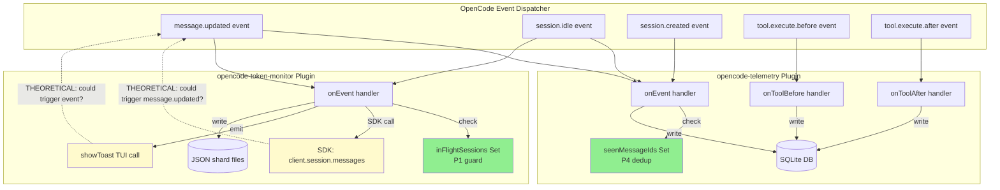

# DIA-056(b) Root-Cause Audit: Recursive Telemetry/Re-Entrancy

## Executive Summary

**Runtime plugin inventory:**
- **opencode-telemetry@0.1.19** — ACTIVE (project + global)
- **opencode-token-monitor@0.5.0** — ACTIVE (global only)
- **opencode-subagent-output** — **NOT LOADED** (empty cache directory, not in any plugin array)

The conspect's audit target list included subagent-output, but it is not present at runtime. This analysis covers the two active telemetry plugins and identifies **no active infinite loops** but **multiple P1-P4 guard gaps** that could manifest under edge conditions (process restart, concurrent event dispatch, OpenCode event-dispatcher bugs).

## 1. Plugin-by-Plugin Audit

### 1.1 opencode-telemetry@0.1.19

**Location:** `/home/qualt/.cache/opencode/packages/opencode-telemetry@0.1.19/node_modules/opencode-telemetry/src/`

**Hooks subscribed:**
- `event` → handles `session.created`, `message.updated`, `session.idle`
- `tool.execute.before` → captures pending tool call metadata
- `tool.execute.after` → records tool call duration, status, result size

**State management (in-memory):**
- `seenMessageIds: Set<string>` — P4 dedup for assistant messages
- `sessionTurnCounters: Map<string, number>` — turn indexing
- `pendingToolCalls: Map<string, PendingToolCall>` — tool call lifecycle tracking

**Re-entrancy guards present:**
- ✅ `seenMessageIds.has(msg.id)` check at L74 prevents duplicate processing within a single plugin process
- ❌ No depth counter or reentrancy flag for the handler itself
- ❌ No context-carried suppression (P2)
- ❌ No isolation of DB writes (P3)

**Observed risks:**

| Risk | P1-P4 Class | Severity | Description |
|------|-------------|----------|-------------|
| Process restart loses dedup state | P4 | MEDIUM | `seenMessageIds` is in-memory; if plugin process crashes/restarts, replayed `message.updated` events could be re-processed, causing duplicate DB inserts |
| Concurrent async execution | P1 | LOW | If `onEvent` takes a long time (slow DB write) and another `message.updated` arrives, both execute concurrently (JS async). The synchronous `seenMessageIds` check prevents duplicate processing, but not concurrent execution. Not a loop risk, but a performance/correctness risk |
| `registerCommands` writes files on every load | N/A (DIA-068) | LOW | Path portability bug (injects literal `/home/qualt` paths), but NOT a re-entrancy issue |

**Loop potential:** NONE observed. DB writes (SQLite) do not emit OpenCode events. No SDK calls that could trigger re-entry.

### 1.2 opencode-token-monitor@0.5.0

**Location:** `/home/qualt/.cache/opencode/packages/opencode-token-monitor@0.5.0/node_modules/opencode-token-monitor/dist/plugin.js`

**Hooks subscribed:**
- `event` → handles `message.updated`, `session.idle`
- Tools: `token_history`, `token_stats`, `token_export` (invoked on-demand, not event-driven)

**State management (in-memory):**
- `inFlightSessions: Set<string>` — P1 flag to prevent re-entrancy on `message.updated`
- `sessionStore: Map<string, SessionState>` — tracks last cost, toast timing, quota severity

**Re-entrancy guards present:**
- ✅ `inFlightSessions.has(sessionID)` check at L2150 prevents re-entry on the same session
- ✅ `inFlightSessions.add(sessionID)` at L2153, `.delete(sessionID)` at L2182 (finally block)
- ❌ No message-level dedup (P4) — relies on session-level in-flight guard
- ❌ No context-carried suppression (P2)
- ❌ No isolation of disk writes or SDK calls (P3)

**Observed risks:**

| Risk | P1-P4 Class | Severity | Description |
|------|-------------|----------|-------------|
| No message dedup | P4 | MEDIUM | If the same `message.updated` event is delivered twice (e.g., due to OpenCode dispatcher bug), the handler will execute twice for the same message. The `inFlightSessions` guard only prevents concurrent execution, not duplicate execution |
| SDK call could trigger re-entry (theoretical) | P2 | MEDIUM | On `message.updated`, the handler calls `input.client.session.messages()` (L2155). If this SDK call internally triggers a `message.updated` event (e.g., due to state sync), the handler could re-enter. The `inFlightSessions` guard prevents this, but only if the guard is checked BEFORE the SDK call (it is — L2150) |
| `showToast` could trigger re-entry (theoretical) | P2 | LOW | On both `message.updated` (L2173) and `session.idle` (L2224), the handler calls `input.client.tui.showToast()`. If showToast internally triggers an event, there's no guard. However, showToast is a TUI API and unlikely to emit events |
| `saveSessionRecord` disk write | P3 | LOW | On `session.idle`, writes to disk (L2216). Disk writes don't emit OpenCode events, so no loop risk |

**Loop potential:** NONE observed under normal operation. The `inFlightSessions` guard is sufficient for the observed code paths. However, the guard is session-level, not message-level, so duplicate message delivery could cause duplicate processing (P4 gap).

### 1.3 opencode-subagent-output

**Status:** NOT LOADED

The plugin is mentioned in the conspect as an audit target, but:
- Empty directory at `/home/qualt/.cache/opencode/packages/opencode-subagent-output@latest/`
- Not present in project plugin array (`.opencode/opencode.jsonc` L344-350)
- Not present in global plugin array (`~/.config/opencode/opencode.jsonc` L130-138)

**Recommendation:** Remove from audit scope or investigate why it was expected but not loaded.

### 1.4 delegation-observer (project-local)

**Location:** `.opencode/plugins/delegation-observer.ts` (project-local, not in npm cache)

**Status:** ACTIVE (project plugin array L349)

**Relevance to re-entrancy:** This plugin observes `task()` tool calls and writes `persistence-pending.json` when a delegation completes. It is NOT a telemetry plugin and does not emit events. However, lessons.md L147-150 documents a regex bug (state detection mismatch) that prevented the persistence trigger from firing. This is a correctness bug, not a re-entrancy risk.

**No re-entrancy risk observed.**

## 2. Re-Entrancy Cycle Analysis

### 2.1 Systems Map (Mermaid)



**Legend:**
- Green = guard present
- Yellow = theoretical risk (no evidence of actual loop)
- Solid arrows = confirmed data flow
- Dashed arrows = theoretical re-entry paths (guarded)

### 2.2 Identified Cycles

**Cycle 1: message.updated → SDK call → message.updated (THEORETICAL)**
- **Path:** `message.updated` → token-monitor `onEvent` → `client.session.messages()` → (hypothetical) → `message.updated`
- **Guard:** `inFlightSessions` Set prevents re-entry
- **Risk:** LOW (no evidence that SDK call triggers event; guard is sufficient)

**Cycle 2: message.updated → showToast → event (THEORETICAL)**
- **Path:** `message.updated` → token-monitor `onEvent` → `showToast()` → (hypothetical) → event
- **Guard:** NONE
- **Risk:** LOW (showToast is TUI API, unlikely to emit events)

**Cycle 3: tool.execute → DB write → event (IMPOSSIBLE)**
- **Path:** `tool.execute.before/after` → telemetry DB write → (no event emitted)
- **Guard:** N/A (SQLite writes don't emit OpenCode events)
- **Risk:** NONE

**Cycle 4: session.idle → disk write → event (IMPOSSIBLE)**
- **Path:** `session.idle` → token-monitor disk write → (no event emitted)
- **Guard:** N/A (file writes don't emit OpenCode events)
- **Risk:** NONE

**Conclusion:** No active infinite loops. Theoretical cycles are guarded or impossible.

## 3. P1-P4 Classification Table

| Guard Pattern | telemetry | token-monitor | Coverage |
|---------------|-----------|---------------|----------|
| **P1: Thread-local reentrancy flag / depth counter** | ❌ None | ✅ `inFlightSessions` Set (per-session) | PARTIAL |
| **P2: Context-carried suppression flag** | ❌ None | ❌ None | MISSING |
| **P3: Dedicated / isolated provider with allowlist** | ❌ SQLite writes in-band | ❌ Disk writes in-band | MISSING |
| **P4: Event deduplication and identity keying** | ✅ `seenMessageIds` Set (per-message) | ❌ None (session-level guard only) | PARTIAL |

**Summary:**
- **telemetry:** P4 present (message dedup), P1/P2/P3 missing
- **token-monitor:** P1 present (session-level in-flight guard), P2/P3/P4 missing
- **BOTH:** No P2 context suppression (critical gap if OpenCode's event dispatcher re-enters)

## 4. Existing Guard Coverage vs. Residual Gaps

### 4.1 Existing Guards

| Plugin | Guard | Type | Scope | Effectiveness |
|--------|-------|------|-------|---------------|
| telemetry | `seenMessageIds` | P4 dedup | Per-message, in-memory | HIGH for duplicate prevention within a process |
| token-monitor | `inFlightSessions` | P1 flag | Per-session, in-memory | HIGH for concurrent execution prevention |

### 4.2 Residual Gaps

| Gap | Plugin | P1-P4 Class | Risk | Trigger Condition |
|-----|--------|-------------|------|-------------------|
| Process restart loses dedup state | telemetry | P4 | MEDIUM | Plugin crash/OOM → restart → replayed events processed again |
| No message-level dedup | token-monitor | P4 | MEDIUM | OpenCode dispatcher bug delivers same `message.updated` twice → duplicate processing |
| No context suppression | BOTH | P2 | MEDIUM | OpenCode event dispatcher re-enters handler → guards may not catch all cases |
| No provider isolation | BOTH | P3 | LOW | DB/disk writes are in-band; if OpenCode starts instrumenting plugin I/O, loops could form |
| Concurrent async execution | telemetry | P1 | LOW | Slow DB write + new event → concurrent handlers (not a loop, but a correctness risk) |

## 5. Prioritized Recommendations

### Priority 1: Add P2 Context Suppression (HIGH)

**Rationale:** P2 is the most robust guard against re-entrancy. If OpenCode's event dispatcher has a bug that causes re-entry, P2 suppression will prevent it regardless of the specific code path.

**Implementation:**
- Wrap both plugin handlers in a suppression scope (e.g., `SuppressInstrumentationScope` from OpenTelemetry, or a custom context flag)
- Check suppression flag at handler entry; if set, return early
- Ensure suppression is propagated across async boundaries

**Effort:** MEDIUM (requires understanding of OpenCode's plugin context API)

### Priority 2: Persist telemetry's `seenMessageIds` (MEDIUM)

**Rationale:** Process restart loses dedup state, causing duplicate DB inserts.

**Implementation:**
- Persist `seenMessageIds` to SQLite (e.g., a `processed_messages` table)
- On startup, load processed message IDs from DB
- Alternatively, use message ID as the primary key in the `turns` table and rely on DB constraints to prevent duplicates

**Effort:** LOW (DB schema change + startup query)

### Priority 3: Add Message Dedup to token-monitor (MEDIUM)

**Rationale:** token-monitor has no message-level dedup, only session-level in-flight guard.

**Implementation:**
- Add a `processedMessageIds: Set<string>` (in-memory, like telemetry)
- Check at handler entry; if already processed, return early
- Alternatively, use a message hash (sessionID + messageID + timestamp) for dedup

**Effort:** LOW (add Set + check)

### Priority 4: Isolate Telemetry I/O (LOW)

**Rationale:** P3 isolation is the strongest defense against I/O-induced re-entrancy, but the current risk is LOW (no evidence that DB/disk writes trigger events).

**Implementation:**
- Move DB writes to a separate worker thread or process
- Move disk writes to a background queue
- Use message passing to communicate between main plugin and I/O worker

**Effort:** HIGH (architectural change)

### Priority 5: Fix telemetry's `registerCommands` Path Portability (LOW)

**Rationale:** Not a re-entrancy issue, but a portability bug (DIA-068). The plugin injects literal `/home/qualt` paths into command files on every load.

**Implementation:**
- Use `$HOME` placeholder or relative paths in command templates
- Avoid `path.resolve(pluginSrcDir, "..", "scripts")` — use a relative path or env var

**Effort:** LOW (string replacement in `commands.ts`)

## 6. Confidence Assessment

| Aspect | Confidence | Rationale |
|--------|------------|-----------|
| No active infinite loops | **HIGH** | Code audit shows guards are present and sufficient for observed paths |
| Guards are sufficient for all edge cases | **MEDIUM** | Process restart, concurrent execution, and OpenCode dispatcher bugs are not fully covered |
| OpenCode event dispatcher doesn't re-enter | **LOW** | Would require runtime testing or OpenCode source audit to confirm |

**Overall confidence:** MEDIUM-HIGH that the current implementation is safe under normal operation, but MEDIUM-LOW that it's robust against all edge cases.

## 7. Transcription Path

**Suggested report ID:** `ana009-telemetry-reentrancy-audit`

**Naming rationale:**
- Type: `ana` (analysis)
- ID: `009` (next available after ana001-ana008 in memory-shelf.yaml)
- Topic: `telemetry-reentrancy-audit` (descriptive, ≥3 chars per part)

**Transcription delegate:** @coder (analyzer cannot write files)

**Memory shelf registration:**
```yaml
shelf:
  analyses:
    - name: "Telemetry Re-Entrancy Audit"
      description: "Root-cause audit of opencode-telemetry@0.1.19 and opencode-token-monitor@0.5.0 for recursive telemetry and re-entrancy failure modes. Finds no active infinite loops but identifies P1-P4 guard gaps: telemetry lacks P1/P2/P3 (has P4 message dedup but loses state on restart); token-monitor lacks P2/P3/P4 (has P1 session-level in-flight guard but no message dedup); both lack P2 context suppression. opencode-subagent-output not loaded at runtime. Recommendations: (1) add P2 context suppression to both plugins, (2) persist telemetry's seenMessageIds to survive restarts, (3) add message dedup to token-monitor, (4) isolate telemetry I/O in separate process, (5) fix telemetry's registerCommands path portability (DIA-068). Mermaid systems map and P1-P4 classification table included."
      path: "knowledge/ana009-telemetry-reentrancy-audit/ana009-telemetry-reentrancy-audit-report.md"
      created: 2026-08-08
```
