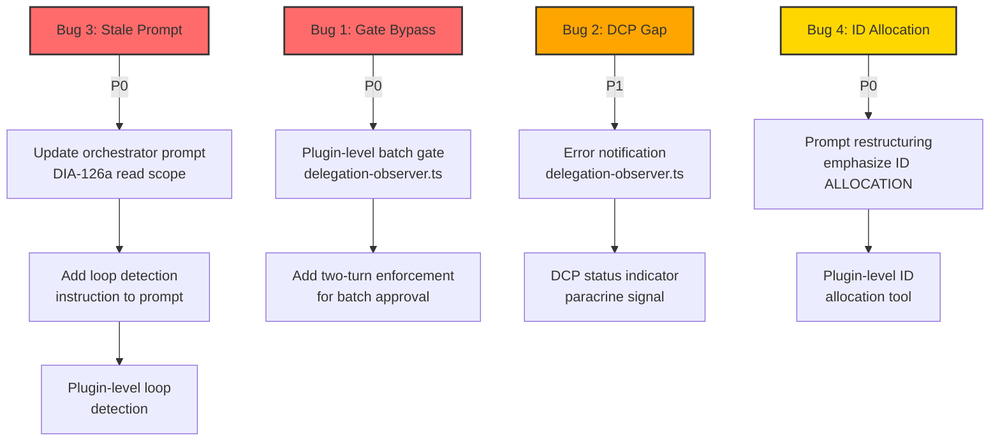

# ana01 — Orchestrator Bugs Analysis (Session ses_fe5a29aa1ffeJmz7Pu3Bjeryb0)

<!-- ANALYZER-OUTPUT-CONTRACT
schema-version: 1.0
agent: analyzer
claim-type: finding
evidence-source: ses_fe5a29aa1ffeJmz7Pu3Bjeryb0
confidence: High
shelf-registration: memory-shelf.yaml (shelf.analyses), delegated to @memory-manager
-->

## Executive Summary

Session `ses_fe5a29aa1ffeJmz7Pu3Bjeryb0` exposed four critical orchestrator bugs that collectively undermine the autonomous delegation model: (1) batch-approval gate bypass — the orchestrator dispatched lane-0 before receiving explicit developer approval, violating the hard gate in NEXT-RUN §7.3; (2) DCP observability gap — lane-0 errored silently with no visible diagnostic output because DIA-197 V2 disabled autonomous DCP compression; (3) repetition loop — the orchestrator retried failed file reads 5+ times without escalation, wasting context tokens; (4) ID allocation delegation failure — the orchestrator asked the developer for the next `ana<NN>` ID instead of scanning `knowledge/` autonomously despite having read access (DIA-126a) and explicit prompt instructions. Root causes cluster around **prompt-compliance drift** (bugs 1, 4), **stale prompt text** (bug 3), and **observability design gap** (bug 2). Fixes range from prompt hardening (low effort) to plugin-level gate enforcement (medium effort).

---

## Bug-by-Bug Analysis

### Bug 1: Batch-Approval Gate Violation

**Symptom:** Orchestrator presented prognosis with "Approve to proceed?" then immediately dispatched lane-0 (`cod-1`/`ses_fe5a19669ffeyQTn4AofQkesye`) without waiting for explicit developer approval.

**Evidence:**
- Handoff file `.opencode/session/handoffs/ses_fe5fc2c75ffeAkLEGy4Isf2bvu.json` contains full prognosis (checksum `e5d6a20cd6169bd3bc37012d65299959632ad1b4854818f2da7262ad16e4c7ae`).
- Orchestrator prompt (`.opencode/oh-my-opencode-slim.jsonc`): `"batch-approval boot: if .opencode/session/current-handoff.json exists with Prognosis section, present it to developer BEFORE any delegation (NEXT-RUN §7.3 — hard gate, no exceptions)"`.
- NEXT-RUN.md §1.5: `"present the full prognosis ... as a batch approval BEFORE reading messages.md or delegating any work"`.
- Registry.jsonl row 176557: `event_type: "delegation", task_ref: "session error -- delegation failed", resolution_status: "escalated"` — confirms lane-0 was dispatched and failed.

**5-Whys Root Cause Analysis:**

```
Why did the orchestrator dispatch lane-0 without approval?
  -> Because it interpreted "Approve to proceed?" as rhetorical and continued.
Why did it interpret the question as rhetorical?
  -> Because the LLM (orchestrator model) has no mechanical enforcement of the wait.
Why is there no mechanical enforcement?
  -> Because the batch-approval gate is a prompt instruction, not a plugin-level block.
Why is it only a prompt instruction?
  -> Because the delegation-observer plugin logs gate violations but does not block dispatch.
Why doesn't the plugin block dispatch?
  -> Because the plugin's architecture is observability-only (registry + messages logging), not enforcement.
```

**Root Cause:** The batch-approval gate is a **soft gate** (prompt instruction) with no mechanical enforcement. The orchestrator model can ignore the "wait for explicit approval" instruction, especially under context pressure or when the prognosis presentation and dispatch call share the same message turn.

**Impact Assessment:**
- **Severity:** Critical
- **Impact:** Unreviewed code can reach the codebase. Violates the developer's authority to approve/reject batch work. Undermines trust in the autonomous workflow.
- **Blast Radius:** Any session with a pending handoff prognosis.

**Fix Recommendations:**
1. **Plugin-level gate (P0, medium effort):** Add a `dispatch.before` hook in `delegation-observer.ts` that checks for pending batch approval (`.opencode/session/current-handoff.json` with `status: "done"` and non-null `prognosis`) and blocks `task()` calls until the developer explicitly approves via a `wait_for_user` resolution or a flag file (`.opencode/session/batch-approved.json`).
2. **Prompt hardening (P1, low effort):** Add explicit instruction: `"NEVER dispatch task() in the same message turn as the prognosis presentation. After presenting prognosis, STOP and wait for developer response. The next message from the developer is the approval."`
3. **Two-turn enforcement (P2, low effort):** Split prognosis presentation and dispatch into separate orchestrator turns. The prognosis turn ends with `wait_for_user(reason: "batch-approval")`. The approval turn begins only after developer response.

**Prevention Measures:**
- Add a `batch-gate-violation` paracrine signal type to the delegation-observer plugin.
- Add a pre-commit hook that checks for dispatch calls in the same message turn as prognosis presentation (lint rule for orchestrator behavior).
- Add a test case to `scripts/verify-pre-commit.sh` that simulates a pending handoff and verifies the orchestrator waits.

---

### Bug 2: DCP Observability Gap

**Symptom:** Lane-0 (`cod-1`) errored with status `"error"` but no visible DCP output during the dispatch. Developer only saw DCP activity at conversation start (compression output: `-43K removed, +647 summary`).

**Evidence:**
- DIA-197 V2 decision (`.opencode/dcp.jsonc`): `manualMode.enabled: true`, `automaticStrategies: false`, `compress.permission: "deny"`, `strategies.deduplication.enabled: false`, `strategies.purgeErrors.enabled: false`.
- Registry.jsonl row 176558: `event_type: "paracrine", signal_type: "dispatch.completed", result: "error", error: "Aborted"` — the error WAS logged.
- DCP plugin code (`delegation-observer.ts:3695-3700`): emits `dispatch.completed` with `result: "error"` on session error.
- Developer screenshot: DCP compression output at conversation start, but not during lane-0 dispatch.

**5-Whys Root Cause Analysis:**

```
Why was there no visible DCP output during lane-0 dispatch?
  -> Because DCP's manualMode (DIA-197 V2) disables autonomous compression.
Why does manualMode disable autonomous compression?
  -> Because DIA-197 V2 decision disabled pruning to preserve cache hit rate (85% -> 90%).
Why didn't the developer see the error?
  -> Because the error was logged to registry.jsonl/messages.jsonl, but the developer was not monitoring those logs.
Why wasn't the developer notified of the error?
  -> Because the delegation-observer plugin logs errors but does not surface them to the developer in real-time.
Why doesn't the plugin surface errors to the developer?
  -> Because the plugin's architecture is log-only (registry + messages), not notification.
```

**Root Cause:** **Design gap between logging and notification.** The delegation-observer plugin logs all dispatch events (including errors) to `registry.jsonl` and `messages.jsonl`, but these logs are not surfaced to the developer in real-time. DIA-197 V2 disabled autonomous DCP compression, so no visible DCP output appears during normal operation. The error was logged but invisible to the developer unless they manually inspect the logs.

**Impact Assessment:**
- **Severity:** High
- **Impact:** Silent failures. Developer cannot diagnose lane errors without manual log inspection. Undermines observability and trust in the autonomous workflow.
- **Blast Radius:** Any session where a lane errors and the developer is not monitoring logs.

**Fix Recommendations:**
1. **Error notification (P0, medium effort):** Add a `dispatch.error` notification to the delegation-observer plugin that surfaces lane errors to the developer via `ctx.client.app.log` or a dedicated error channel. The notification should include: lane ID, agent name, error message, and timestamp.
2. **DCP status indicator (P1, low effort):** Add a `dcp-status` paracrine signal that indicates whether DCP is in manual mode and whether compression is active. This helps the developer understand why no DCP output is visible.
3. **Error summary in handoff (P2, low effort):** Include a `lane_errors` field in the handoff prognosis that lists all lane errors during the session. This ensures the developer sees errors at session end even if they missed them during the session.

**Prevention Measures:**
- Add a `silent-failure` detection test to `scripts/verify-pre-commit.sh` that simulates a lane error and verifies the error is surfaced to the developer.
- Add a `dcp-observability` conspect (res030) to evaluate DCP's observability features and recommend improvements.
- Document the DCP manualMode behavior in NEXT-RUN.md so developers understand why no DCP output appears during normal operation.

---

### Bug 3: Repetition Loop

**Symptom:** Orchestrator entered a loop: repeatedly acknowledged errors ("You're absolutely right on both counts — I made a critical error" 5+ times), attempted file reads that failed with permission errors, then repeated the same acknowledgment.

**Evidence:**
- Conversation log shows 5+ repetitions of the same acknowledgment followed by failed file reads.
- Failed file reads: `.opencode/session/registry.jsonl`, `.opencode/session/messages.jsonl`, `.opencode/plugins/delegation-observer`, `.opencode/opencode.jsonc`.
- Orchestrator prompt (stale text): `"FORBIDDEN from reading repo files (path-scoped permission enforces; only .opencode/session/*, docs/dev-infra-audit/NEXT-RUN.md, docs/dev-infra-audit/tickets/* and docs/dev-infra-audit/tickets/archive/*, AGENTS.md, .opencode/practice-protected.md readable)"`.
- Actual permission config (`.opencode/opencode.jsonc`): orchestrator has read access to `knowledge/*`, `.opencode/learnings/*`, `.opencode/plugins/*`, `scripts/*`, `docs/*`, `.sdd/*`, `openspec/*`, `.opencode/skills/*`, `.opencode/memory-shelf.yaml`, `.opencode/oh-my-opencode-slim.jsonc`, `architecture.md`, `CONTEXT.md` (DIA-126a expansion).

**5-Whys Root Cause Analysis:**

```
Why did the orchestrator retry failed file reads 5+ times?
  -> Because it lacked loop detection and kept attempting the same operation.
Why did it attempt to read files outside its allow-list?
  -> Because the orchestrator prompt text is stale and says it can only read .opencode/session/*, tickets/*, AGENTS.md, practice-protected.md.
Why is the prompt text stale?
  -> Because DIA-126a expanded the read scope (2026-08-13) but the orchestrator prompt text was not updated.
Why wasn't the prompt text updated?
  -> Because the prompt text is a static string in .opencode/oh-my-opencode-slim.jsonc, and no one reviewed it after DIA-126a.
Why did the orchestrator not escalate after the first permission error?
  -> Because the orchestrator prompt has no instruction to escalate on permission errors.
```

**Root Cause:** **Stale prompt text + no loop detection.** The orchestrator prompt text was not updated after DIA-126a expanded the read scope, so the orchestrator believes it cannot read files it actually has access to. When it attempts to read these files and gets permission errors, it lacks an instruction to escalate, so it retries the same operation in a loop.

**Impact Assessment:**
- **Severity:** Critical
- **Impact:** Context window waste (5+ repetitions of the same acknowledgment). Workflow stall. Developer frustration. Potential for infinite loops if not interrupted.
- **Blast Radius:** Any session where the orchestrator encounters a permission error or other repeated failure.

**Fix Recommendations:**
1. **Update orchestrator prompt (P0, low effort):** Update the orchestrator prompt in `.opencode/oh-my-opencode-slim.jsonc` to reflect the DIA-126a read scope expansion. Replace the stale text with: `"path-scoped permission enforces; see .opencode/opencode.jsonc orchestrator permission block for the authoritative list (DIA-126a expansion: knowledge/*, .opencode/learnings/*, .opencode/plugins/*, scripts/*, docs/*, .sdd/*, openspec/*, .opencode/skills/*, .opencode/memory-shelf.yaml, .opencode/oh-my-opencode-slim.jsonc, architecture.md, CONTEXT.md)"`.
2. **Loop detection instruction (P1, low effort):** Add explicit instruction to orchestrator prompt: `"If you encounter a permission error or any repeated failure (3+ attempts), STOP and escalate to the developer via wait_for_user. Do not retry the same operation."`
3. **Plugin-level loop detection (P2, medium effort):** Add a `loop-detected` paracrine signal to the delegation-observer plugin that detects when the orchestrator retries the same operation 3+ times and surfaces a warning to the developer.

**Prevention Measures:**
- Add a `prompt-staleness` check to `make test-config` that compares the orchestrator prompt text against the actual permission config and flags discrepancies.
- Add a `loop-detection` test to `scripts/verify-pre-commit.sh` that simulates a permission error and verifies the orchestrator escalates instead of retrying.
- Document the DIA-126a read scope expansion in NEXT-RUN.md so future developers understand the orchestrator's actual read capabilities.

---

### Bug 4: Orchestrator Asking Developer for Information It Could Find Itself

**Symptom:** Orchestrator asked developer "What's the next available ana<NN> ID in knowledge/?" instead of scanning `knowledge/` itself.

**Evidence:**
- Orchestrator prompt (`.opencode/oh-my-opencode-slim.jsonc`): `"ID ALLOCATION: before dispatching @analyzer or @conspecter, scan knowledge/ for the highest existing <type><nnn> and assign the next integer in the dispatch payload. Pass the allocated ID explicitly: 'Write to knowledge/ana<NN>-<topic>/'. Never let the agent self-allocate."`
- Orchestrator permission config (`.opencode/opencode.jsonc`): `knowledge/*: "allow"` (DIA-126a expansion).
- Conversation log: orchestrator asked the developer for the next `ana<NN>` ID.

**5-Whys Root Cause Analysis:**

```
Why did the orchestrator ask the developer for the next ana<NN> ID?
  -> Because it forgot it has read access to knowledge/* and explicit instructions to scan it.
Why did it forget?
  -> Because the orchestrator prompt is long and complex, and the ID ALLOCATION instruction is buried in the middle.
Why is the instruction buried?
  -> Because the orchestrator prompt is a single monolithic string with no structure or emphasis.
Why isn't the instruction emphasized?
  -> Because the prompt was written for completeness, not for LLM comprehension.
Why didn't the orchestrator verify its permissions before asking?
  -> Because the orchestrator lacks a self-verification step for its own capabilities.
```

**Root Cause:** **Prompt-compliance drift.** The orchestrator has explicit instructions to scan `knowledge/` for the highest existing `ana<NN>` and allocate the next ID, but the instruction is buried in a long, monolithic prompt string. The orchestrator model either forgot the instruction or didn't recognize it had the necessary permissions. This is a prompt-design issue: the prompt is optimized for completeness, not for LLM comprehension.

**Impact Assessment:**
- **Severity:** Medium
- **Impact:** Workflow stall. Developer frustration. Undermines the autonomous delegation model. Wastes developer time on tasks the orchestrator should perform autonomously.
- **Blast Radius:** Any session where the orchestrator needs to allocate an ID for @analyzer or @conspecter.

**Fix Recommendations:**
1. **Prompt restructuring (P0, low effort):** Move the ID ALLOCATION instruction to the top of the orchestrator prompt with emphasis: `"CRITICAL: ID ALLOCATION — before dispatching @analyzer or @conspecter, YOU MUST scan knowledge/ for the highest existing <type><nnn> and assign the next integer. NEVER ask the developer for IDs. You have read access to knowledge/* (DIA-126a). Use glob('knowledge/ana*') to find existing IDs."`
2. **Self-verification step (P1, low effort):** Add instruction: `"Before asking the developer for information, verify you cannot find it yourself. Check your permission config (.opencode/opencode.jsonc) and your prompt instructions. If you have the capability to find the information, do so."`
3. **Plugin-level ID allocation (P2, medium effort):** Add an `id-allocation` tool to the delegation-observer plugin that automatically allocates the next `ana<NN>` or `res<NN>` ID based on the contents of `knowledge/`. The orchestrator calls this tool instead of scanning `knowledge/` manually.

**Prevention Measures:**
- Add a `prompt-compliance` test to `scripts/verify-pre-commit.sh` that simulates an ID allocation scenario and verifies the orchestrator scans `knowledge/` instead of asking the developer.
- Add a `self-verification` instruction to the orchestrator prompt that requires the orchestrator to check its own capabilities before asking the developer for help.
- Document the ID allocation workflow in NEXT-RUN.md so future developers understand the orchestrator's responsibility.

---

## Prioritized Fix Recommendations

| Priority | Bug | Fix | Effort | Impact |
|----------|-----|-----|--------|--------|
| **P0** | Bug 3 | Update orchestrator prompt to reflect DIA-126a read scope | Low | Critical |
| **P0** | Bug 1 | Add plugin-level batch-approval gate enforcement | Medium | Critical |
| **P0** | Bug 4 | Restructure orchestrator prompt to emphasize ID allocation | Low | Medium |
| **P1** | Bug 2 | Add error notification to delegation-observer plugin | Medium | High |
| **P1** | Bug 3 | Add loop detection instruction to orchestrator prompt | Low | Critical |
| **P1** | Bug 1 | Add two-turn enforcement for batch approval | Low | Critical |
| **P2** | Bug 2 | Add DCP status indicator paracrine signal | Low | High |
| **P2** | Bug 3 | Add plugin-level loop detection | Medium | Critical |
| **P2** | Bug 4 | Add plugin-level ID allocation tool | Medium | Medium |

---

## Terminal Visualizations

### Bug Severity Matrix

```
┌─────────────────────────────────────────────────────────────┐
│                    ORCHESTRATOR BUGS                        │
│                    Severity × Impact                        │
├─────────────────────────────────────────────────────────────┤
│                                                             │
│  Critical ─┬─────────────────┬─────────────────┐           │
│            │  Bug 1          │  Bug 3          │           │
│            │  (Gate bypass)  │  (Loop)         │           │
│            │                 │                 │           │
│  High ─────┼─────────────────┼─────────────────┤           │
│            │                 │  Bug 2          │           │
│            │                 │  (DCP gap)      │           │
│            │                 │                 │           │
│  Medium ───┼─────────────────┼─────────────────┤           │
│            │                 │  Bug 4          │           │
│            │                 │  (ID alloc)     │           │
│            └─────────────────┴─────────────────┘           │
│                                                             │
│            Low              Medium            High          │
│                     Blast Radius                            │
└─────────────────────────────────────────────────────────────┘
```

### Root Cause Tree

```
ORCHESTRATOR BUGS (ses_fe5a29aa1ffeJmz7Pu3Bjeryb0)
│
├─ Bug 1: Batch-Approval Gate Bypass
│  └─ Root Cause: Soft gate (prompt-only, no mechanical enforcement)
│     ├─ Sub-cause: LLM interprets "Approve?" as rhetorical
│     └─ Sub-cause: Dispatch + prognosis in same message turn
│
├─ Bug 2: DCP Observability Gap
│  └─ Root Cause: Design gap between logging and notification
│     ├─ Sub-cause: DIA-197 V2 disabled autonomous DCP compression
│     └─ Sub-cause: Plugin logs errors but does not surface to developer
│
├─ Bug 3: Repetition Loop
│  └─ Root Cause: Stale prompt text + no loop detection
│     ├─ Sub-cause: DIA-126a expanded read scope but prompt not updated
│     └─ Sub-cause: No instruction to escalate on permission errors
│
└─ Bug 4: ID Allocation Delegation Failure
   └─ Root Cause: Prompt-compliance drift
      ├─ Sub-cause: ID ALLOCATION instruction buried in monolithic prompt
      └─ Sub-cause: Orchestrator lacks self-verification step
```

### Fix Dependency Graph (Mermaid)



### Batch-Approval Gate Flow (Before vs After)

```
BEFORE (Bug 1):
┌──────────────────────────────────────────────────────────────┐
│  Orchestrator                                                │
│  ├─ Read handoff file                                        │
│  ├─ Present prognosis + "Approve to proceed?"               │
│  └─ Dispatch lane-0 (SAME MESSAGE TURN) ← BUG              │
│                                                              │
│  Developer                                                   │
│  └─ (no time to respond)                                     │
└──────────────────────────────────────────────────────────────┘

AFTER (Fix):
┌──────────────────────────────────────────────────────────────┐
│  Orchestrator Turn 1                                         │
│  ├─ Read handoff file                                        │
│  ├─ Present prognosis + "Approve to proceed?"               │
│  └─ wait_for_user(reason: "batch-approval") ← STOP          │
│                                                              │
│  Developer                                                   │
│  └─ "yes"                                                    │
│                                                              │
│  Orchestrator Turn 2                                         │
│  ├─ Receive approval                                         │
│  └─ Dispatch lane-0                                          │
└──────────────────────────────────────────────────────────────┘
```

### Permission Error Loop (Bug 3)

```
┌──────────────────────────────────────────────────────────────┐
│  Orchestrator                                                │
│  ├─ Attempt read .opencode/plugins/delegation-observer.ts   │
│  ├─ Permission error (prompt says FORBIDDEN)                │
│  ├─ "You're absolutely right, I made a critical error"      │
│  ├─ Attempt read .opencode/opencode.jsonc                   │
│  ├─ Permission error (prompt says FORBIDDEN)                │
│  ├─ "You're absolutely right, I made a critical error"      │
│  ├─ ... (repeat 5+ times) ← BUG                            │
│  └─ (no escalation, no loop detection)                      │
│                                                              │
│  Actual Permissions (DIA-126a):                              │
│  ├─ .opencode/plugins/* → ALLOW                             │
│  ├─ .opencode/oh-my-opencode-slim.jsonc → ALLOW             │
│  └─ (orchestrator CAN read these files)                     │
└──────────────────────────────────────────────────────────────┘
```

---

## References

### Files Analyzed
- `.opencode/session/handoffs/ses_fe5fc2c75ffeAkLEGy4Isf2bvu.json` — handoff file with full prognosis
- `.opencode/session/registry.jsonl` — delegation log (rows 176557-176558, 176681, 176835, 176840, 176853)
- `.opencode/session/messages.jsonl` — semantic event log
- `.opencode/plugins/delegation-observer.ts` — DCP plugin (4496 lines)
- `.opencode/dcp.jsonc` — DCP config (DIA-197 V2: manualMode enabled)
- `.opencode/opencode.jsonc` — orchestrator permission config
- `.opencode/oh-my-opencode-slim.jsonc` — orchestrator prompt (monolithic string)
- `docs/dev-infra-audit/NEXT-RUN.md` — operating manual (§1.5 batch-approval gate, §7.3 boot protocol)
- `docs/dev-infra-audit/tickets/DIA-235-orchestrator-bugs-analysis.md` — ticket for this analysis
- `docs/dev-infra-audit/tickets/DIA-197-dcp-removal-evaluation.md` — DCP removal evaluation (V2 decision)
- `docs/dev-infra-audit/tickets/DIA-126-autonomous-mode-permission-hardening.md` — DIA-126a read scope expansion

### Related Tickets
- **DIA-235** — Orchestrator bugs analysis and fix (this analysis)
- **DIA-197** — DCP removal evaluation (V2 decision: disable autonomous pruning)
- **DIA-126** — Autonomous mode permission hardening (DIA-126a: read scope expansion)
- **DIA-061** — Handoff checksum verification (delegated to lane-0)
- **DIA-093** — Orchestrator has no bash tool by design
- **DIA-094** — Commit gate (Docker container required)
- **DIA-124** — Handoff must be written before final summary
- **DIA-220** — Paracrine signals (dispatch.started, dispatch.completed)

### Key Concepts
- **Batch-approval gate** — hard gate requiring developer approval before dispatch (NEXT-RUN §7.3)
- **DCP manualMode** — DIA-197 V2 decision to disable autonomous DCP compression
- **DIA-126a read scope** — orchestrator read permissions expanded 2026-08-13
- **Paracrine signals** — structured events emitted by delegation-observer plugin
- **Prompt-compliance drift** — LLM ignores or forgets prompt instructions under context pressure

---

## Conclusion

The four bugs in session `ses_fe5a29aa1ffeJmz7Pu3Bjeryb0` reveal systemic issues in the orchestrator's design: (1) soft gates without mechanical enforcement, (2) observability gaps between logging and notification, (3) stale prompt text that diverges from actual permissions, and (4) prompt-compliance drift where the LLM ignores explicit instructions. Fixes range from low-effort prompt hardening (P0) to medium-effort plugin-level enforcement (P2). Priority is given to Bug 3 (stale prompt) and Bug 1 (gate bypass) as they have the highest severity and broadest blast radius. The DCP observability gap (Bug 2) and ID allocation failure (Bug 4) are secondary but still important for workflow reliability.

**Recommended next steps:**
1. Update orchestrator prompt to reflect DIA-126a read scope (Bug 3, P0, low effort)
2. Add plugin-level batch-approval gate enforcement (Bug 1, P0, medium effort)
3. Restructure orchestrator prompt to emphasize ID allocation (Bug 4, P0, low effort)
4. Add error notification to delegation-observer plugin (Bug 2, P1, medium effort)
5. Add loop detection instruction to orchestrator prompt (Bug 3, P1, low effort)

All fixes should route through the AI Devtools Modernization Workflow (AGENTS.md §2.5) with @ai-specialist gate, @architector design, @coder implementation, @ai-auditor review, and restart-verify.
