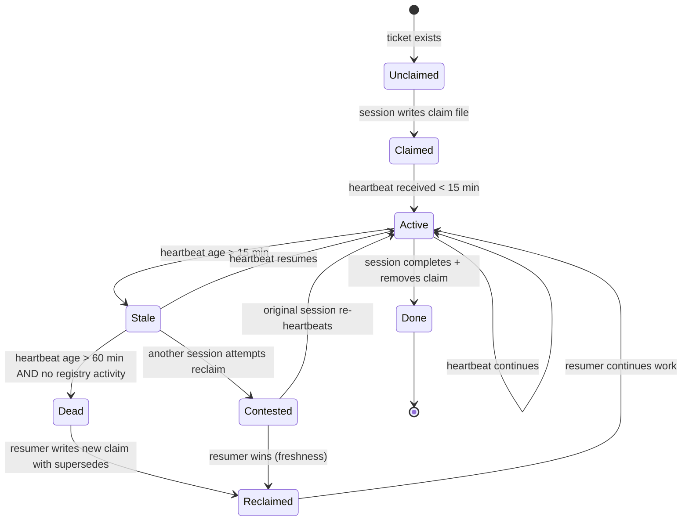
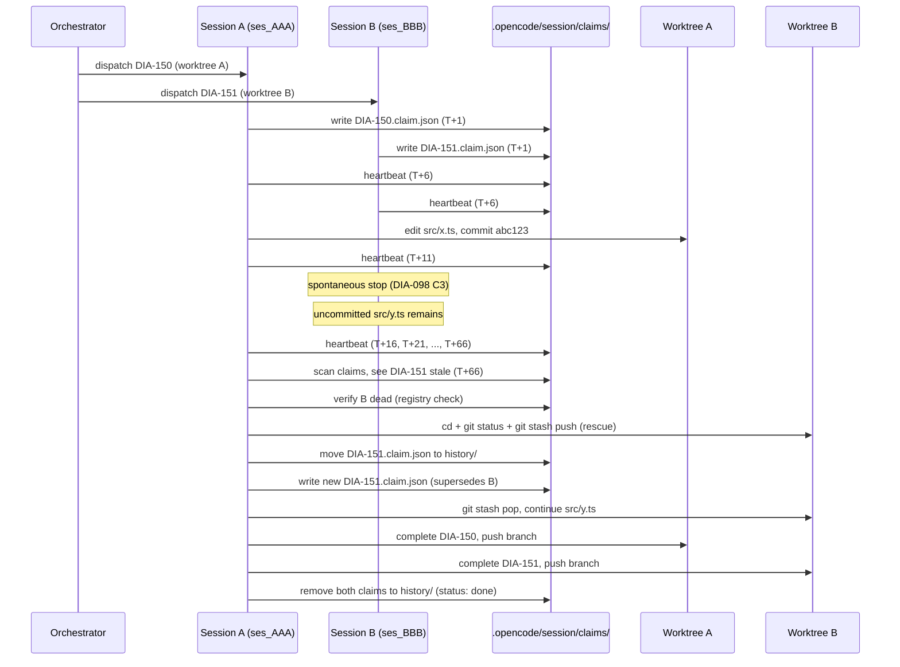

# ana011 - Parallel Orchestrator Sessions Coordination Model (DIA-085)

**Status:** analysis-complete
**Date:** 2026-08-11
**Ticket:** DIA-085 (OPEN, Medium, docs area)
**Cross-references:** DIA-073 (CLOSED, adopted worktrees-only), DIA-098 (OPEN,
recovery strategy), DIA-100 (OPEN, worktrees implementation), DIA-086 (SCOPE
GUARD precedent - solo-developer system), DIA-061 (checksum gate).

---

## Executive Summary

DIA-073 closed with a decisive ruling: **parallel sessions use worktrees**
(separate checkouts, separate `.opencode/session/` dirs, zero handoff
coordination needed for the hot path). DIA-085 extends that model with the
second-order question: when two sessions ARE running in parallel (each in
its own worktree), how do they coordinate shared state - task ledger,
ticket status, handoff files, and ownership - without colliding?

The answer, grounded in existing tooling, is a **file-based claim + heartbeat
protocol** layered on top of DIA-073's worktree isolation. No new daemon, no
shared database, no lock server. The claim/heartbeat files live in the MAIN
repo's `.opencode/session/` (NOT the worktree), because that directory is the
single rendezvous point both sessions can see. Worktrees give each session
its own private workspace; the main repo gives them a shared mailbox.

SCOPE GUARD (per DIA-086 precedent): this is a solo-developer system. The
protocol must be cheap to implement, cheap to run, and never block a human
waiting at the terminal. Anything that requires a lock server, supervisor
process, or distributed consensus is REJECTED as overhead-disproportionate.
The entire do-now model fits in ~4 shell commands and 2 JSON files.

---

## 1. State Sharing: What is Shared vs Private

```
+-----------------------------+-------------------------------------------+
| State                       | Sharing rule                              |
+-----------------------------+-------------------------------------------+
| Task ledger (tickets/*.md)  | SHARED (main repo, version-controlled)    |
| Handoff files               | PER-WORKTREE (DIA-073 ruling)             |
| current-handoff.json        | PER-WORKTREE (DIA-073 ruling)             |
| messages.jsonl              | PER-WORKTREE (per-session log)            |
| registry.jsonl              | SHARED (main repo, single writer model)   |
| Session logs                | PER-WORKTREE (each worktree has own)      |
| Claim/heartbeat files       | SHARED (main repo rendezvous)             |
| Worktree-local artifacts    | PER-WORKTREE (feature branch only)        |
| Git branches                | PER-WORKTREE (one branch per worktree)    |
| Gate tokens                 | PER-WORKTREE (per-session gate state)     |
+-----------------------------+-------------------------------------------+
```

The invariant: **git-tracked state is shared by merge; runtime state is
shared by rendezvous file; per-session state stays in the worktree.**

---

## 2. Task Ownership: Claim + Heartbeat Model

### Claim File Location

```
.opencode/session/claims/<ticket-id>.claim.json
```

Example: `.opencode/session/claims/DIA-085.claim.json`

Directory `.opencode/session/claims/` is gitignored (extends the existing
`.opencode/session/` ignore rule at `.gitignore:79`).

### Claim File Schema

```json
{
  "ticket_id": "DIA-085",
  "session_id": "ses_0133de7fdffeKc3ClhE6fqFy0X",
  "worktree_path": ".slim/worktrees/dia-085-analysis",
  "branch": "feature/dia-085-parallel-coord",
  "claimed_at": "2026-08-11T14:22:00Z",
  "last_heartbeat": "2026-08-11T14:52:00Z",
  "status": "active",
  "task_summary": "analyze parallel sessions coordination model",
  "files_touched": [
    "knowledge/ana011-parallel-sessions-coordination/ana011-...-report.md"
  ],
  "depends_on": ["DIA-073", "DIA-098", "DIA-100"]
}
```

### Heartbeat Interval

- **Write interval:** every 5 minutes of active progress, OR at every
  meaningful milestone (file written, lane dispatched, test passed).
- **Read cadence:** a session checking another's claim reads the heartbeat
  timestamp to judge freshness.
- **Rationale:** 5 minutes is the sweet spot - long enough that a human
  typing a paragraph doesn't trigger spurious expiry, short enough that
  a genuinely-dead session is detected within 10-15 minutes (2-3 missed
  beats).

### Expiry Rules

- **Claim considered STALE** if `last_heartbeat` is > 15 minutes old AND
  the session_id is no longer present in the active OpenCode session list
  (verifiable via `opencode session list` or by absence of recent
  registry.jsonl rows from that session_id).
- **Claim considered DEAD** if `last_heartbeat` is > 60 minutes old with
  no registry activity - regardless of session list state (covers the
  case where the session is technically alive but the agent is wedged,
  per DIA-098 failure classes).
- **On expiry:** a resuming session may RECLAIM the ticket by writing a
  new claim file with `supersedes: <old-session-id>` and `reason:
  heartbeat-expired`. The old claim file is renamed (not deleted) to
  `.opencode/session/claims/history/<ticket-id>.<old-session-id>.claim.json`
  for forensic audit.

### Atomic Write

Claims are written atomically via write-to-temp + `rename(2)`. This
prevents a reader from seeing a half-written claim. The rename is
atomic on all POSIX filesystems (including the Docker volume).

---

## 3. Conflict Avoidance / Detection

### Conflict Categories

| Category                  | Detection signal                               | Severity |
|---------------------------|------------------------------------------------|----------|
| Same task claimed twice   | Two claim files with same ticket_id            | HARD     |
| Same file edited          | Overlap in `files_touched` across active claims| HARD     |
| Overlapping artifact write| Two sessions writing same knowledge/ana* path  | MEDIUM   |
| Stale heartbeat           | `last_heartbeat` > 15 min without registry row | SOFT     |
| Handoff clobber           | Two sessions writing same `current-handoff.json| HARD     |
| Branch collision          | Two worktrees on same branch name              | HARD     |

### Detection Method

**Pre-claim scan.** Before writing a claim, a session reads all existing
`.opencode/session/claims/*.claim.json` files and checks:

1. Does any active claim reference the same ticket_id?
   - YES and heartbeat fresh: CONFLICT - back off or negotiate.
   - YES but heartbeat stale: RECLAIM candidate.
   - NO: safe to claim.
2. Does any active claim reference overlapping `files_touched`?
   - YES: file-level conflict, pick different files or coordinate.
3. Does any active claim reference the same branch name?
   - YES: branch collision, pick different name.

### Surfacing Path

- **HARD conflicts:** logged to `messages.jsonl` as `log_decision` event
  with `event_type: 'conflict'` and `resolution_status: 'in-flight'`. The
  orchestrator surfaces this to the developer at the next interaction
  (banner in the TUI, or explicit prompt for disposition).
- **SOFT conflicts (stale heartbeat):** logged as `resolution_status:
  'acknowledged'`; no developer prompt, automatic reclaim allowed after
  the 60-minute DEAD threshold.
- **Blocked task:** a ticket in claim-conflict has its registry.jsonl
  status set to `CONTESTED` until resolved.

### Resolution Rule

- **Explicit assignment wins.** If the orchestrator (boss session) has
  explicitly assigned the task to a session (via dispatch payload), that
  assignment overrides any stale claim.
- **Claim order wins among peers.** First atomic claim file write wins.
- **Freshness wins on reclaim.** A session with fresh heartbeat can
  displace a stale claim without developer intervention.

---

## 4. Unfinished-Work Handoff

When a session yields partial work (explicit handoff, crash, or stop),
the handoff semantics depend on WHERE the work lives:

### In-worktree work (feature branch)

- Commits are preserved on the feature branch.
- Uncommitted changes are STASHED (`git stash push -u -m "session-<id>-yield"`).
- The yielding session writes a handoff file in its worktree's
  `.opencode/session/current-handoff.json` describing:
  - What was completed (commits on the branch).
  - What is in-flight (stashed or uncommitted).
  - What remains.
- The resuming session checks out the worktree, applies the stash, and
  continues.

### In-main-repo work (shared artifacts like knowledge/)

- The yielding session MUST commit its partial artifact before yielding.
- The commit message includes `[yield:<session-id>]` for traceability.
- The resuming session pulls the main branch (or merges the feature
  branch) to pick up the committed artifact.
- If the yielding session cannot commit (broken state), the handoff file
  MUST include a `recovery_path` pointing to the raw files (worktree
  path + stash ref) so the resumer can reconstruct.

### Ownership transfer

- The yielding session renames its claim file to the history path (as
  in section 2) with `superseded_by: <resuming-session-id>` if known,
  or `status: yielded` if unknown.
- The resuming session writes a new claim with `supersedes: <old-id>`.

---

## 5. Task-Status Reconciliation

When two sessions report status for overlapping work (e.g., both wrote
to registry.jsonl for the same ticket across different time windows),
reconciliation follows a simple rule:

**Last-write-wins on the REGISTRY, with audit trail in history.**

- `registry.jsonl` is append-only (NDJSON). Both sessions can append
  freely; later rows supersede earlier rows for the same ticket_id by
  timestamp ordering.
- The ticket file (`docs/dev-infra-audit/tickets/DIA-*.md`) is the
  canonical source of truth for status. Only ONE session should edit
  the ticket file at a time (enforced by the claim file).
- If a resuming session finds the ticket file in a state that doesn't
  match its view (e.g., the dead session updated the status field just
  before dying), the resuming session reads `messages.jsonl` and the
  dead session's handoff file to reconstruct the actual state, then
  updates the ticket file to match reality.

**No merge algorithm.** The human developer is the final arbiter if
both sessions produced materially-different status updates for the
same ticket. The protocol surfaces the divergence via the HARD
conflict path; the developer disposes.

---

## 6. Context Reconstruction (Resuming Session)

A resuming session needs the following to rebuild working context:

```
1. SESSION LOG
   - Its own messages.jsonl (per-worktree, always available)
   - Optionally: the dead session's messages.jsonl (for the work it's
     picking up) - located via the dead session's worktree path

2. CLAIM / HEARTBEAT
   - Its own previous claim file (if resuming after its own pause)
   - OR: a STALE claim file from the dead session (which it supersedes)
   - Located at .opencode/session/claims/<ticket-id>.claim.json

3. HANDOFF FILE
   - The dead session's .opencode/session/current-handoff.json
     (in the dead session's worktree)
   - Contains: session_summary, fixes_applied, open_tickets,
     verification_request, resume_instructions

4. ARTIFACTS
   - Git commits on the dead session's feature branch
     (git log --oneline <branch>)
   - Uncommitted work in the dead session's stash
     (git stash list | grep "session-<id>")
   - Knowledge artifacts in knowledge/ (committed to main)

5. REGISTRY STATE
   - registry.jsonl rows for the ticket_id (grep for it)
   - To see what the dead session claimed to have done

6. TICKET FILE
   - docs/dev-infra-audit/tickets/DIA-<id>.md
   - Canonical current status

7. DESIGN CONSTRAINTS
   - .sdd/, .tss/, openspec/ artifacts relevant to the ticket
```

The resuming session's boot sequence:
1. Read its own previous claim (if any) OR scan claims for stale.
2. Read the dead session's handoff.
3. Read the ticket file.
4. Check out the dead session's worktree (or create a new one on the
   same branch).
5. Apply stash if needed.
6. Read relevant registry.jsonl rows.
7. Write its own claim (superseding the dead session's).
8. Begin work.

---

## 7. Inter-Session Communication

### Chosen Mechanism: File-Based Rendezvous

The ONLY inter-session communication channel is the **main-repo
`.opencode/session/` directory** as a shared mailbox:

- **Claims mailbox:** `.opencode/session/claims/` - claim/heartbeat
  files.
- **Handoff files:** each session's worktree has its own
  `.opencode/session/current-handoff.json` (per DIA-073 worktrees-only
  ruling). Cross-session handoff reading is done by path: the resuming
  session knows the dead session's worktree path from the claim file.
- **Registry:** `.opencode/session/registry.jsonl` - append-only event
  log, both sessions write, readers use timestamp ordering.

### Rejected Alternatives

- **Shared memory / IPC sockets:** requires a daemon (overhead).
- **Database (SQLite):** requires schema, migrations, a writer lock.
- **HTTP API server:** requires a long-running process (overhead).
- **Git commit as message:** too slow, pollutes history, not atomic for
  high-frequency signals like heartbeats.
- **Native OpenCode `session.prompt({path:{id}})`:** useful for recall
  but not for live coordination (session may be dead).

### Why File-Based Wins Here

1. Zero new processes (aligns with SCOPE GUARD).
2. Atomic on POSIX (rename).
3. Human-readable and greppable (debugging without tooling).
4. Survives crashes (filesystem is durable).
5. Works across worktrees (main repo is the rendezvous).
6. Already aligned with DIA-073's adopted model.

---

## 8. Task Ownership Determination

Priority order (highest to lowest):

1. **Explicit orchestrator assignment.** The boss session's dispatch
   payload names a session_id as owner. This overrides any claim file.
2. **Fresh claim file.** A claim file with heartbeat < 15 min old.
3. **First atomic claim.** Among peers with no orchestrator assignment,
   the first claim file written wins (determined by `claimed_at`).
4. **Reclaim by freshness.** A stale claim (> 15 min) may be
   superseded by any session that verifies the original session is
   truly dead (no registry activity > 60 min).

### Dispute Resolution

- If two sessions both claim the same ticket within 1 minute (within
  claim-write jitter), the session whose `claimed_at` is earlier wins.
- If the orchestrator is available, it arbitrates by explicit
  re-assignment.
- If the orchestrator is NOT available (both are peer sessions), the
  dispute is logged as a HARD conflict and surfaces to the human
  developer at the next interaction.

---

## 9. Unexpected Stop (Cross-Reference DIA-098)

DIA-098 enumerates the failure classes that cause a session to stop
spontaneously:

| Failure class                 | DIA-098 ref | Recovery implication         |
|-------------------------------|-------------|------------------------------|
| context_usage threshold hit   | C1          | Partial work may exist       |
| Idle-turn semantic event      | C2          | Work likely complete         |
| Step-budget exhaustion        | C3          | Truncated mid-task           |
| Empty-first-response          | C4          | No work started              |
| Permission-denied silent halt | C5          | Work stopped at gate         |
| wait_for_user misuse          | C6          | Stuck waiting forever        |

### What Happens on Unexpected Stop

1. The session stops writing heartbeats.
2. After 15 minutes: its claim is STALE (detectable by any other
   session or by the human).
3. After 60 minutes: its claim is DEAD (auto-reclaimable).
4. The in-worktree state is PRESERVED:
   - Commits on the feature branch survive.
   - Uncommitted changes survive in the worktree's working directory
     (NOT stashed, because the session crashed before it could stash).
   - The worktree's `.opencode/session/current-handoff.json` may or
     may not exist (depending on whether the session reached a
     milestone before dying).
5. The main-repo claim file is LEFT INTACT (with stale heartbeat).
   A resuming session detects staleness via the heartbeat age.

### Can Another Session Safely Resume?

YES, with the following safety checks:

- **Verify the dead session is truly dead** (no registry activity
  > 60 min) - prevents the race where a slow session is still alive
  and a reclaimer steps on its work.
- **Read the dead session's handoff file** (if it exists) to
  understand what was in-flight.
- **Inspect the feature branch** (`git log`) to see what was committed.
- **Inspect the working directory** for uncommitted changes that the
  dead session did not get to commit.
- **Stash uncommitted changes** before doing anything else
  (`git stash push -u -m "rescue-<dead-session-id>"`).
- **Write a new claim** superseding the dead session's.
- **Begin recovery** from the stashed state + committed branch.

The rescue is safe because:
- Git is durable (nothing is lost).
- The claim file is append/replace, so supersession is clean.
- The worktree's filesystem is untouched until the resumer acts.

---

## 10. Resume-After-Stop Procedure

### Step-by-step for the resuming session

```
STEP 1 - BOOT CONTEXT
  a. Read own previous claim (if resuming own work).
  b. Read .opencode/session/claims/*.claim.json - list all claims.
  c. For each claim, check last_heartbeat freshness.
  d. Identify STALE claims (heartbeat > 15 min).
  e. Identify DEAD claims (heartbeat > 60 min).

STEP 2 - LIVENESS VERIFICATION (for any DEAD claim being considered
         for reclaim)
  a. grep registry.jsonl for the dead session_id.
  b. Find the most recent row timestamp for that session_id.
  c. If most-recent timestamp is > 60 min ago -> confirm dead.
  d. If NOT -> the session is alive but slow; DO NOT reclaim. Wait
     or escalate to human.

STEP 3 - DEAD SESSION ARTIFACT INSPECTION
  a. Read the dead session's worktree path (from its claim file).
  b. Check that worktree exists.
  c. cd to the worktree. Run `git status` + `git log --oneline -20`.
  d. Run `git stash list` - look for a yield-stash from the dead
     session.
  e. Read the dead session's .opencode/session/current-handoff.json
     (if present) to understand intent.
  f. Read the dead session's messages.jsonl (last ~100 lines) for
     additional context.

STEP 4 - STALE-CLAIM HANDLING
  a. Move the dead session's claim file:
       mv .opencode/session/claims/<ticket>.claim.json \
          .opencode/session/claims/history/<ticket>.<dead-session-id>.claim.json
  b. Edit the moved file to add:
       "superseded_by": "<my-session-id>",
       "superseded_at": "<now>",
       "reason": "heartbeat-expired"
  c. This preserves forensic audit trail.

STEP 5 - WORKTREE PREPARATION
  a. If reusing the dead session's worktree:
       cd <worktree-path>
       git stash push -u -m "rescue-<dead-session-id>-<timestamp>"
         # Only if there are uncommitted changes
       git log --oneline  # note the last commit
  b. If creating a new worktree on the same branch:
       git worktree add .slim/worktrees/<slug> <branch>
  c. Verify the worktree is clean (no half-written files from the
     dead session that conflict with intended work).

STEP 6 - CLAIM WRITE
  a. Write new claim file:
       .opencode/session/claims/<ticket-id>.claim.json
     with:
       session_id: <my-session-id>
       supersedes: <dead-session-id>
       reason: "heartbeat-expired" or "explicit-resume"
       claimed_at: <now>
       last_heartbeat: <now>
       ... (other fields per section 2)
  b. Atomic write (write-to-temp + rename).

STEP 7 - CONTEXT RECONSTRUCTION
  a. Read the ticket file for current canonical status.
  b. Read the dead session's handoff for resume_instructions.
  c. Read registry.jsonl rows for the ticket_id to see what the
     dead session reported.
  d. Read relevant .sdd/, .tss/, openspec/ artifacts.
  e. Reconcile: is the ticket's stated status consistent with the
     branch's commit log? If not, UPDATE the ticket file based on
     the commit log (source of truth for what was actually done).

STEP 8 - HEARTBEAT LOOP START
  a. Begin work.
  b. Update last_heartbeat every 5 minutes (or on every milestone).
  c. Update files_touched as work progresses.
  d. On meaningful completion: commit + update ticket file + write
     handoff.

STEP 9 - DISPUTE ESCALATION (if needed)
  a. If liveness verification is ambiguous (e.g., dead session's
     last registry row is 45 min ago - between STALE and DEAD),
     DO NOT reclaim.
  b. Log a SOFT conflict via log_decision.
  c. Wait for human disposition, OR wait 15 more minutes for the
     DEAD threshold.
```

---

## Worked Example

### Setup

- Main repo at `/home/qualt/Projects/poetry-platform/`
- Session A: `ses_AAA...`, assigned DIA-150 (implement feature X)
- Session B: `ses_BBB...`, assigned DIA-151 (implement feature Y)

### Timeline

```
T+0    Orchestrator dispatches:
         Session A -> worktree .slim/worktrees/dia-150-feat-x
                      branch feature/dia-150-feat-x
         Session B -> worktree .slim/worktrees/dia-151-feat-y
                      branch feature/dia-151-feat-y

T+1    Session A writes claim:
         .opencode/session/claims/DIA-150.claim.json
         { session_id: "ses_AAA...", claimed_at: T+1,
           worktree_path: ".slim/worktrees/dia-150-feat-x",
           branch: "feature/dia-150-feat-x",
           last_heartbeat: T+1, files_touched: [] }

T+1    Session B writes claim:
         .opencode/session/claims/DIA-151.claim.json
         (similar)

T+6    Session A heartbeat (edited src/x.ts):
         last_heartbeat: T+6
         files_touched: ["src/x.ts"]

T+6    Session B heartbeat:
         last_heartbeat: T+6

T+11   Session A heartbeat (committed abc123):
         last_heartbeat: T+11

T+11   Session B HEARTBEAT STOPS (spontaneous stop, DIA-098 class C3).
         No crash recovery - the session just stops.
         Last heartbeat: T+6.
         Uncommitted changes in src/y.ts remain in worktree.
         No handoff file written (session died mid-milestone).

T+16   Session A heartbeat (continues own work, unaffected).

T+21   Session A heartbeat.
         Now notices: DIA-151.claim.json heartbeat is T+6 (15 min stale).
         Reads registry.jsonl for ses_BBB...: last row at T+6.
         -> Claim is STALE. Does NOT reclaim yet (not DEAD).

T+26   Session A heartbeat.
         DIA-151 heartbeat still T+6 (20 min stale).
         registry.jsonl for ses_BBB...: last row at T+6 (20 min old).
         -> Claim still STALE, not DEAD (need 60 min).
         Session A continues own work.

T+66   Session A heartbeat.
         DIA-151 heartbeat still T+6 (60 min stale).
         registry.jsonl for ses_BBB...: last row at T+6 (60 min old).
         -> Claim is now DEAD.
         Session A notifies human (or orchestrator) via log_decision:
           log_decision(event_type='conflict',
                        ticket_id='DIA-151',
                        resolution_status='pending-owner',
                        prognosis='Session B appears dead; reclaiming
                                   DIA-151. Will inspect worktree.')

T+67   Session A executes reclaim procedure:
         1. cd .slim/worktrees/dia-151-feat-y
         2. git status -> uncommitted src/y.ts
         3. git stash push -u -m "rescue-ses_BBB-T+67"
         4. git log --oneline -> last commit is xyz789 (earlier work)
         5. Move claim to history:
              mv .opencode/session/claims/DIA-151.claim.json \
                 .opencode/session/claims/history/DIA-151.ses_BBB.claim.json
         6. Write new claim:
              .opencode/session/claims/DIA-151.claim.json
              { session_id: "ses_AAA...",
                supersedes: "ses_BBB...",
                reason: "heartbeat-expired",
                claimed_at: T+67,
                last_heartbeat: T+67 }

T+68   Session A pops stash to resume Session B's work:
         git stash pop  # src/y.ts restored
         Reads xyz789 commit + src/y.ts changes + any messages from
           Session B's messages.jsonl.
         Continues DIA-151 implementation.

T+73   Session A heartbeat on DIA-151.
         files_touched: ["src/x.ts", "src/y.ts"]
         (Both files now in Session A's touched set; no conflict
          because Session B is dead.)

T+120  Session A completes DIA-150:
         Commit on feature/dia-150-feat-x
         Push branch
         Write handoff in Session A's worktree
         Remove DIA-150.claim.json (move to history with status: done)

T+130  Session A completes DIA-151:
         Commit on feature/dia-151-feat-y
         Push branch
         Write handoff in Session A's worktree
         Remove DIA-151.claim.json (move to history with status: done)
```

### What we observe in this example

- **No collision:** Session A and B never touched each other's files
  because they worked in separate worktrees (DIA-073 invariant holds).
- **Staleness detected in 15 min, reclaim at 60 min** (the protocol's
  two-threshold design avoids premature reclaim).
- **Forensic trail preserved:** Session B's claim is in history with
  `superseded_by` annotation; Session A's claim records `supersedes`.
- **Uncommitted work rescued:** Session B's uncommitted `src/y.ts`
  survived via `git stash push` at reclaim time.
- **No human needed** (unless the human wanted to be notified at
  reclaim time via the log_decision event).

---

## Recommendation Split

### DO NOW with Current Tooling

These require NO new infrastructure, only conventions + small scripts:

| # | Action                                                  | Effort |
|---|---------------------------------------------------------|--------|
| 1 | `.opencode/session/claims/` directory convention        | 1h     |
| 2 | Extend `.gitignore` to cover claims/ + claims/history/  | 5m     |
| 3 | Shell helper `scripts/claim-ticket.sh <ticket> <sess>`  | 2h     |
| 4 | Shell helper `scripts/heartbeat.sh <ticket> <sess>`     | 1h     |
| 5 | Shell helper `scripts/list-claims.sh` (with staleness)  | 1h     |
| 6 | Shell helper `scripts/reclaim-ticket.sh <ticket> <old>`| 2h     |
| 7 | Update NEXT-RUN.md with parallel-session boot sequence  | 2h     |
| 8 | Update DIA-100 tasks to include claim/heartbeat wiring  | 1h     |
| 9 | Add claim-check as first step in @coder dispatch prompt | 1h     |
|10 | Test the protocol with a two-session smoke test         | 3h     |

**Total: ~14 hours of focused work, zero new dependencies.**

All helpers are pure bash reading/writing JSON. They use `jq` (already
available in the dev container) for JSON manipulation and `rename(2)`
via `mv` for atomic writes. No daemon, no database, no new service.

### REQUIRES NEW INFRASTRUCTURE (DEFER / REJECT)

These are rejected for a solo-developer system as overhead-disproportionate:

| Idea                        | Why rejected                                |
|-----------------------------|---------------------------------------------|
| Lock server (e.g., etcd)    | New process, new dependency, overkill       |
| Shared SQLite task DB       | Writer lock complexity, migration overhead  |
| Supervisor process          | Another daemon to babysit                   |
| Distributed consensus       | Solo dev has no peers to consensus with     |
| WebSocket coordination bus  | Long-running process, network surface       |
| Filesystem inotify watcher  | Race-prone, daemon required                 |
| Database-backed ledger      | Schema + migrations; registry.jsonl already |
|                             | serves as append-only ledger                |

### If Future Scale Demands It

If the system ever grows beyond solo-developer (e.g., multiple humans
or many concurrent AI sessions becoming the norm), the upgrade path is:

1. **registry.jsonl -> SQLite** (drop-in, same schema, ACID writes).
2. **File-based claims -> SQLite claim table** (atomic transactions).
3. **Heartbeat -> SQLite timestamp** (indexed, queryable).
4. **Supervisor -> optional background process** (only if session
   count > 5 concurrent).

This upgrade path is NON-BLOCKING: the file-based protocol works at
any scale up to ~10 concurrent sessions before performance of `ls` +
`jq` becomes a concern.

---

## SCOPE GUARD Analysis (DIA-086 Precedent)

Per DIA-086's explicit scope guard: "this is a solo-developer system,
not a research lab." The recommendations in this analysis are weighted
toward what is cheap and actually gets used. Specific overhead flags:

### Flags where protocol could become disproportionate

1. **Heartbeat every 5 minutes is a discipline, not a mechanism.** If
   the agent forgets to heartbeat (and it will, sometimes), the stale
   detection is delayed. Mitigation: the 60-minute DEAD threshold is
   forgiving. Do NOT tighten it.

2. **Claim file writes are extra tool calls.** Each claim/heartbeat
   is a bash invocation + file write. At scale (>5 concurrent
   sessions), this adds up. Mitigation: batch claim writes with task
   completion (one write per milestone, not per step).

3. **Forensic history can accumulate.** `claims/history/` will grow
   indefinitely. Mitigation: simple `find claims/history -mtime +30
   -delete` cron-equivalent in the cleanup script.

4. **Human notification at reclaim time.** The protocol can run fully
   automatically (dead claim -> auto-reclaim). For a solo developer,
   this is FINE. The log_decision event in messages.jsonl provides
   the audit trail; the human can review at leisure. DO NOT add
   synchronous developer-approval gates for reclaim - that defeats
   the purpose of parallel sessions.

5. **The protocol does NOT solve DIA-098.** DIA-098's failure classes
   are orthogonal: they cause the stop that triggers reclaim. The
   claim/heartbeat protocol handles the AFTERMATH, not the PREVENTION.
   Prevention belongs in DIA-098's scope.

### What this analysis is NOT

- Not a distributed-systems design.
- Not a multi-user collaboration protocol.
- Not a prevention mechanism for session stops (DIA-098 owns that).
- Not a replacement for worktrees (DIA-073/100 own that).

It is a **minimal coordination layer on top of worktree isolation**
that handles the specific case where two sessions need to share
knowledge of "who is doing what" without colliding.

---

## Mermaid Diagram: Protocol State Machine



---

## Mermaid Diagram: Two-Session Lifecycle (Worked Example)



---

## Acceptance Checklist vs Ticket Deliverables

| Deliverable                                         | Section | Status      |
|-----------------------------------------------------|---------|-------------|
| Concrete ownership/locking model (claim + heartbeat)| 2       | COMPLETE    |
| Claim file location                                 | 2       | COMPLETE    |
| Heartbeat interval                                  | 2       | COMPLETE    |
| Expiry rules                                        | 2       | COMPLETE    |
| Conflict-detection mechanism definition             | 3       | COMPLETE    |
| Resume-after-stop procedure (cross-ref DIA-098)     | 9, 10   | COMPLETE    |
| Worked example end-to-end                           | above   | COMPLETE    |
| Do-now vs new-infrastructure split                  | above   | COMPLETE    |
| SCOPE GUARD flag on overhead-disproportionate parts | above   | COMPLETE    |

---

## Open Questions / Future Work

1. **Heartbeat automation.** Currently a discipline (the agent must
   remember to heartbeat). Could be automated via a plugin hook on
   every N tool calls. Defer to DIA-100's implementation phase.

2. **Claim expiration policy tuning.** The 15/60 minute thresholds
   are initial values. Should be tuned based on real session lengths
   after DIA-100 implementation.

3. **Multi-ticket claim batching.** A session working on 3 tickets
   writes 3 claim files. At scale, this is fine (<10 files), but a
   batched claim file (`claims/<session-id>.claims.json`) could be
   cleaner. Defer.

4. **Cross-worktree artifact dependencies.** If Session A's work
   depends on Session B's committed artifact (e.g., A imports a
   module B is writing), the current model requires B to commit +
   push before A can see it. This is fine for git; worth documenting
   as a constraint.

5. **Integration with DIA-098's eventual auto-resume.** If DIA-098
   implements auto-resume (session detects its own stalled state and
   restarts), the claim file should be updated (not replaced) on
   auto-resume. Defer to DIA-098.

---

## References

- DIA-073 (CLOSED): handoff parallel coordination. Adopted worktrees-only.
- DIA-098 (OPEN): spontaneous session stops. Failure classes C1-C6.
- DIA-100 (OPEN): worktrees implementation.
- DIA-061: checksum gate (detects clobbering, does not recover).
- DIA-086: SCOPE GUARD precedent for solo-developer overhead flag.
- `~/.config/opencode/skills/worktrees/SKILL.md`: worktrees orchestration
  protocol (the isolation substrate this protocol builds on).
- `.opencode/session/registry.jsonl`: existing append-only event log
  (the substrate for liveness verification).
- `.opencode/session/current-handoff.json`: existing single-writer
  handoff (per-worktree under DIA-073 ruling).
- NEXT-RUN.md (referenced; not physically present in repo at time of
  analysis - likely in `.opencode/` or regenerated at boot).
