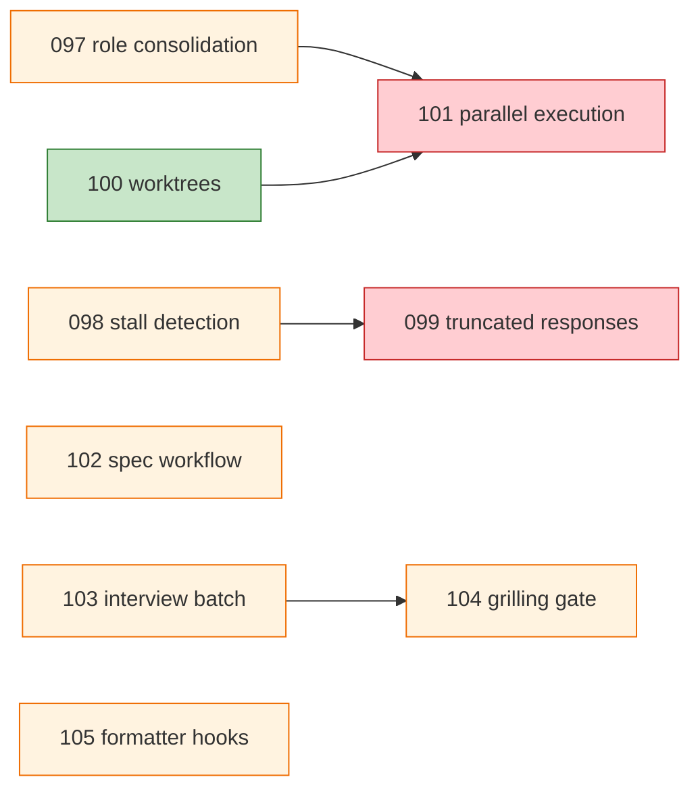

# ana013 - DIA-097..DIA-105 Triage (Parallel Dev Infra Batch)

<!-- ANALYZER-OUTPUT-CONTRACT
schema-version: 1.0
agent: analyzer
claim-type: finding
evidence-source: docs/dev-infra-audit/tickets/DIA-097..DIA-105
confidence: High
shelf-registration: .opencode/memory-shelf.yaml (shelf.analyses)
-->

> **Purpose.** Structured triage of 9 OPEN tickets from the 2026-08-11 parallel
> dev-infra batch. Classification into AUTONOMOUS-FIXABLE / DECISION-NEEDED /
> DEFER, effort/impact ranking, interdependency map, and deferred-decisions
> ledger. **REPORT ONLY** -- no implementation, no config edits.
>
> ASCII-only output per DIA-079.

---

## 1. Ticket Ledger Snapshot

Source: `docs/dev-infra-audit/tickets/README.md` (lines 59-67) + individual
ticket files. All 9 tickets are OPEN, created 2026-08-11, area split between
`opencode-config` (6), `dev-infra` (1), `docs` (2).

| Ticket | Severity | Area            | blocked_by     | Root cause already noted            |
| ------ | -------- | --------------- | -------------- | ----------------------------------- |
| 097    | Major    | opencode-config | --             | Orchestrator role framing scattered |
| 098    | Major    | opencode-config | --             | Multiple stop failure classes       |
| 099    | Major    | opencode-config | 098            | No preserve/resume for truncation   |
| 100    | Medium   | dev-infra       | 096 (CLOSED)   | Adopted model (2026-08-09), no impl |
| 101    | Medium   | opencode-config | 097, 100       | No parallelization rules            |
| 102    | Medium   | docs            | 084 (CLOSED)   | ana004 scored 52/100 enforcement    |
| 103    | Medium   | opencode-config | --             | No mechanical enforcement           |
| 104    | Medium   | docs            | 103            | Practice-protected zone needs gates |
| 105    | Medium   | opencode-config | --             | No edit-time formatter hook         |

Note: DIA-096 and DIA-084 are in CLOSED status -- their `blocked_by` edges
are resolved, so they do not block forward progress for 100/102.

---

## 2. Classification Table

Criteria applied:

- **AUTONOMOUS-FIXABLE** = no new config surface requiring developer decision,
  no open architectural trade-off, failure reversible, implementing lane can
  execute without practice-protected-zone involvement.
- **DECISION-NEEDED** = requires developer decision (config policy, design
  trade-off, practice-protected zone authoring, or Section-10 AI-tooling
  change).
- **DEFER** = blocked by another ticket in this set OR low priority / needs
  more research first.

| Ticket | Class              | Implementing lane / Decision required            | Effort | Impact   |
| ------ | ------------------ | ------------------------------------------------ | ------ | -------- |
| 097    | DECISION-NEEDED    | Developer decides delegation boundaries + automation candidates; @ai-specialist Phase 1 gate (Section 10); @coder implements across 3 presets | L      | High     |
| 098    | DECISION-NEEDED    | Developer decides auto-resume vs manual-nudge policy + detection thresholds; @analyzer drafts taxonomy, @coder implements | L      | High     |
| 099    | DEFER              | Blocker: DIA-098 (explicit `blocked_by`). Preservation strategy (persistence-pending.json vs registry flag) is also architectural | L      | High     |
| 100    | AUTONOMOUS-FIXABLE | @coder (dev-infra, not Section 10). Worktrees skill exists; developer decision on squash-merge was made 2026-08-09. Lifecycle scripts + branch convention + merge workflow | M      | Med-High |
| 101    | DEFER              | Blockers: DIA-097 + DIA-100 (both in this set). Re-split validation needs the rules from 097 and isolation from 100 | M      | Medium   |
| 102    | DECISION-NEEDED    | Developer decides lifecycle states, naming, commit policy, obsolete handling, agent discovery. Builds on ana004 + res001 | M      | Medium   |
| 103    | DECISION-NEEDED    | Developer chooses enforcement mechanism (openspec-validate check vs practice-protected gate vs prompt-level rule). Section 10 surface | S-M    | Medium   |
| 104    | DECISION-NEEDED    | Practice-protected zone: developer writes trigger conditions, stages, exit criteria, exceptions. Agent guides. Builds on ana004 | S      | Med-High |
| 105    | DECISION-NEEDED    | Developer chooses hook location (delegation-observer `tool.execute.after` vs native OpenCode config hooks) + host vs container execution. Section 10 surface | S-M    | Medium   |

### 2.1 Classification distribution

| Class              | Count | Tickets             |
| ------------------ | ----- | ------------------- |
| AUTONOMOUS-FIXABLE | 1     | 100                 |
| DECISION-NEEDED    | 6     | 097, 098, 102, 103, 104, 105 |
| DEFER              | 2     | 099, 101            |

Observation: only 1 of 9 is purely autonomous. 6 require at least one
developer decision. 2 are structurally blocked by the other 7. This batch is
decision-heavy, not implementation-heavy.

---

## 3. Effort/Impact Ranking (all 9)

| Rank | Ticket | Class   | Effort | Impact   | Notes                                          |
| ---- | ------ | ------- | ------ | -------- | ---------------------------------------------- |
| 1    | 100    | AUTO    | M      | Med-High | Only autonomous ticket; unblocks 101           |
| 2    | 105    | DEC     | S-M    | Medium   | Bounded; clear precedent (delegation-observer) |
| 3    | 104    | DEC     | S      | Med-High | Builds on ana004; practice-protected integrity |
| 4    | 103    | DEC     | S-M    | Medium   | Interview integrity; gates 104                 |
| 5    | 102    | DEC     | M      | Medium   | Multi-policy; builds on ana004 + res001        |
| 6    | 098    | DEC     | L      | High     | Stall detection; prerequisite for 099          |
| 7    | 097    | DEC     | L      | High     | Orchestrator role; prerequisite for 101        |
| 8    | 099    | DEFER   | L      | High     | Blocked on 098; resume mechanism design        |
| 9    | 101    | DEFER   | M      | Medium   | Blocked on 097 + 100                           |

---

## 4. Recommended Execution Order

### 4.1 Autonomous-fixable subset

| Step | Ticket | Lane   | Rationale                                             |
| ---- | ------ | ------ | ----------------------------------------------------- |
| A1   | 100    | @coder | Only pure autonomous ticket. Unblocks 101. Scripts + docs, no Section 10 routing (dev-infra area) |

### 4.2 Near-autonomous subset (low-friction decisions, bounded scope)

| Step | Ticket | Action                                                  |
| ---- | ------ | ------------------------------------------------------- |
| N1   | 104    | Agent drafts trigger/stage/exit/exception tables from ana004 findings; developer reviews + writes substance (practice-protected zone). S effort. |
| N2   | 105    | @ai-specialist Phase 1 research (plugin hook vs native hook); developer chooses in Phase 2; @coder implements. Precedent is clear. |
| N3   | 103    | @analyzer gap analysis on openspec-plan + domain-grilling protocol; developer chooses enforcement mechanism. |

### 4.3 Decision-heavy subset

| Step | Ticket | Decision required                                         |
| ---- | ------ | --------------------------------------------------------- |
| D1   | 098    | Auto-resume vs manual nudge; detection thresholds; taxonomy from session evidence |
| D2   | 097    | Delegation boundaries, automation-candidate list, preset consolidation |
| D3   | 102    | Spec lifecycle states, naming, commit policy, agent discovery pattern |

### 4.4 Deferred (revisit after prerequisites land)

| Ticket | Unblocks when                                |
| ------ | -------------------------------------------- |
| 099    | DIA-098 complete (classifier + detection)    |
| 101    | DIA-097 + DIA-100 complete                   |

### 4.5 Dependency graph (Mermaid)

---

## 5. Interdependency Map

| From   | To     | Edge type            | Consequence if out-of-order                      |
| ------ | ------ | -------------------- | ------------------------------------------------ |
| 098    | 099    | Hard block           | 099 classifier cannot exist without 098 taxonomy |
| 097    | 101    | Hard block           | 101 needs delegation rules from 097              |
| 100    | 101    | Hard block           | 101 needs worktree isolation from 100            |
| 103    | 104    | Soft coupling        | 104 gate is meaningful only if 103 enforces completeness |
| 097    | 111*   | Soft coupling        | 111 (model escalation, outside batch) interacts with role consolidation (delegation targets) |
| 100    | 073*   | Reuses               | 073 (CLOSED) chose worktrees-only model; 100 implements it |
| 102    | ana004 | Uses findings        | ana004 scored 52/100; 102 must address bypass paths |
| 104    | ana004 | Uses findings        | ana004 bypass-path analysis feeds 104 trigger conditions |
| 105    | 094*   | Must not replace     | 094 commit gate stays; 105 supplements only      |
| 103    | openspec-plan protocol | Touches | Any enforcement mechanism alters the openspec-plan interview flow |

*Outside the 097-105 batch but referenced by tickets inside.

### 5.1 Risk: coupled decisions

The 097 + 101 + 100 triangle is the highest-risk cluster. DIA-097 (role
consolidation) defines delegation rules; DIA-101 (parallel execution) consumes
those rules; DIA-100 (worktrees) provides the isolation substrate. If 097's
delegation rules change after 101 is drafted, 101 must be re-split. **Sequence
097 -> 100 -> 101 strictly** within the decision-heavy subset.

---

## 6. Decisions Deferred to Developer

The report surfaces the following developer decisions. The orchestrator must
NOT decide these autonomously.

| # | Ticket | Decision                                                                 | Practice-protected? |
| - | ------ | ------------------------------------------------------------------------ | ------------------- |
| 1 | 097    | Delegation boundaries: which task types stay with orchestrator vs delegate | No                  |
| 2 | 097    | Automation-candidate list: which recurring patterns get scripts            | No                  |
| 3 | 097    | Preset consolidation strategy (3 presets - unify or keep distinct?)        | No                  |
| 4 | 098    | Auto-resume vs manual-nudge policy for stalled agents                      | No                  |
| 5 | 098    | Detection signal thresholds (duration? message-count plateau?)             | No                  |
| 6 | 099    | Preservation strategy (persistence-pending.json vs registry flag)          | No                  |
| 7 | 099    | Resume-prompt template design                                              | No                  |
| 8 | 102    | Spec lifecycle states (proposed/implemented/obsolete + transition rules)   | No                  |
| 9 | 102    | Commit policy (specs with impl vs separate commit)                         | No                  |
| 10 | 102    | Obsolete-spec handling (archive vs delete vs mark-stale)                   | No                  |
| 11 | 102    | Agent discovery pattern (openspec query vs file-path convention)           | No                  |
| 12 | 103    | Enforcement mechanism (validate check vs practice-protected gate vs prompt rule) | No            |
| 13 | 104    | Trigger conditions for "significant change"                                | Yes (developer writes) |
| 14 | 104    | Stages + exit criteria for the grilling gate                               | Yes (developer writes) |
| 15 | 104    | Exception criteria (trivial changes that skip the gate)                    | Yes (developer writes) |
| 16 | 105    | Hook location: delegation-observer `tool.execute.after` vs native OpenCode config hooks | No       |
| 17 | 105    | Host vs container execution for the formatter                              | No                  |

**17 deferred decisions total. 3 are practice-protected (developer writes
substance; agent guides). 14 are policy decisions routed through Section 10
(@ai-specialist Phase 1 -> developer Phase 2 -> @coder Phase 4).**

---

## 7. Methodology Notes

- **Classification criteria.** Applied the three-bucket test from the brief:
  (1) no new config surface requiring developer decision, (2) no open
  architectural trade-off, (3) failure reversible. Tickets passing all three
  are AUTONOMOUS; tickets failing any one are DECISION-NEEDED; tickets with
  hard `blocked_by` edges inside the batch are DEFER.
- **Section 10 gate.** Six of the nine tickets are in area `opencode-config`.
  Per project AGENTS.md Section 10, any edit to AI tooling files must route
  through @ai-specialist -> developer review -> @coder. This gate is itself a
  classification driver: even bounded tickets in this area (e.g., 105) become
  DECISION-NEEDED because the hook-location choice is a Section 10 decision.
- **Practice-protected zone.** DIA-104 is explicitly practice-protected: the
  developer writes the grilling gate substance. The agent can draft, guide,
  and ask questions, but the substance is developer-authored.
- **Pre-existing knowledge.** ana004 (spec-authoring-philosophy audit) and
  res001 (openspec/sdd reconciliation) already contain groundwork for 102 and
  104. The conspects should be read before drafting to avoid re-deriving
  findings.
- **ASCII-only protocol (DIA-079).** All content in this report uses ASCII
  characters. No em-dashes, smart quotes, or non-ASCII punctuation.

---

## 8. Summary for the Orchestrator

- **1 autonomous ticket** (100) -- execute now via @coder.
- **6 decision-needed tickets** -- surface decisions to developer via
  Section 10 gate; do NOT auto-decide.
- **2 deferred tickets** (099, 101) -- unblock only after prerequisites.
- **Highest-ROI near-autonomous work**: 104 (practice-protected, builds on
  ana004, S effort, Med-High impact) and 105 (bounded, clear precedent, S-M
  effort).
- **Highest-risk cluster**: 097 -> 100 -> 101 triangle. Sequence strictly.
- **17 deferred decisions** listed in Section 6. Present to developer in
  batches by ticket, not all at once.

End of report.
