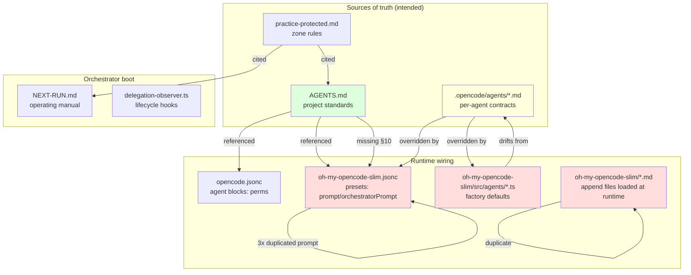

# Agent Instruction Files Audit (DIA-157)

<!-- ANALYZER-OUTPUT-CONTRACT
schema-version: 1.0
agent: analyzer
claim-type: finding
evidence-source: /workspace/.opencode/ (full subtree, 2026-08-12 session)
confidence: High
shelf-registration: .opencode/memory-shelf.yaml (shelf.analyses)
-->

## Scope

Inventory and cross-reference audit of every file that carries agent instructions
or prompts in this repository.

### Files analyzed (50 total)

| Category | Count | Notes |
|---|---|---|
| Project AGENTS.md | 1 | `/workspace/AGENTS.md` (178 L) |
| Project agent instruction .md | 5 | `.opencode/agents/{ai-auditor,analyzer,conspecter,memory-manager,researcher}.md` |
| Project practice-protected.md | 1 | `.opencode/practice-protected.md` (79 L) |
| OMO Slim append .md | 5 | `.opencode/oh-my-opencode-slim/{boss_append,coder_append,orchestrator_append,reviewer,codemap}.md` |
| Project JSONC agent config | 2 | `.opencode/opencode.jsonc` (540 L), `.opencode/oh-my-opencode-slim.jsonc` (628 L) |
| OMO Slim TS agent factories (prompt-bearing) | 11 | `src/agents/{boss,architector,coder,code-navigator,reviewer,designer,researcher,observer,council,councillor,index}.ts` |
| Project skill instruction .md | 22 | `.opencode/skills/*/SKILL.md` (3,928 total L; sampled 5 in depth) |
| NEXT-RUN.md | 1 | `docs/dev-infra-audit/NEXT-RUN.md` (328 L) |
| Plugin TS (sampled) | 1 | `.opencode/plugins/delegation-observer.ts` (1,715 L; header only) |
| Template | 1 | `openspec/templates/HANDOFF.md` |

**Not instruction-bearing (verified):** `.opencode/oh-my-opencode-slim/src/agents/*.test.ts`,
`src/utils/*.ts`, `src/hooks/*.ts`, `src/tools/*.ts`, `src/cli/*.ts` -- these
contain no agent-facing prompt text (only test fixtures or mechanical logic).

**No standalone `.ts` prompt files outside the OMO slim src/agents/ tree** were
found. All embedded prompts live in `src/agents/*.ts` factory files (11 files,
~3.7k total L). The `tools/get-my-session-id.ts` is a tool registration, not a
prompt file. The delegation-observer plugin is a lifecycle hook, not a prompt
file.

---

## Executive summary

The instruction surface is large (~16,000 lines across 50 files) but heavily
duplicated. The three most damaging issues are:

1. A **stale filename reference** (`HANDOFF.md` instead of the runtime
   `.opencode/session/current-handoff.json`) baked into the byte-identical
   orchestrator prompt in all three OMO presets -- the orchestrator LLM is told
   to look for a file that does not exist at runtime.
2. A **phantom AGENTS.md section** (`§10`) referenced from the same three
   orchestrator prompts, from `orchestrator_append.md`, and from `NEXT-RUN.md`,
   but missing from the actual project `AGENTS.md`.
3. A **dead duplicate file** (`boss_append.md`) that is ~80% word-for-word
   identical to `orchestrator_append.md` but 138 lines shorter.

Beyond those, there are five HIGH-severity drift risks between the `.md`
instruction files and the TS factory defaults that are actually wired into the
agent system prompts at runtime.

---

## Findings table

Severity scale: **Critical** (runtime incorrectness), **High** (likely drift or
broken intent), **Medium** (ambiguity / duplication with fix path), **Low**
(style / hygiene).

| # | Sev | File:line | Issue | Fix |
|---|-----|-----------|-------|-----|
| F1 | Critical | `.opencode/oh-my-opencode-slim.jsonc:26, 210, 401` | Orchestrator preset prompt says `if HANDOFF.md exists with Prognosis section` but the runtime file is `.opencode/session/current-handoff.json`. `HANDOFF.md` is only a *template* at `openspec/templates/HANDOFF.md`. The LLM looks for the wrong filename. | Replace `HANDOFF.md` with `.opencode/session/current-handoff.json` in all three preset `prompt` fields. |
| F2 | Critical | `AGENTS.md` (missing §10) | `orchestrator_append.md`, `NEXT-RUN.md`, and all 3 OMO preset prompts reference `AGENTS.md §10` (AI Devtools Modernization Workflow). The project `AGENTS.md` has §1-§6, §9 only -- no §7, §8, §10. New sessions reading `§10` will search in vain. | Either add §10 back to `AGENTS.md` (recommended -- it is the canonical project standards doc), or change every reference to point at the actual home of §10 content (e.g. `orchestrator_append.md` itself, or `NEXT-RUN.md §2`). |
| F3 | High | `.opencode/oh-my-opencode-slim/boss_append.md` (full file) | 100 lines, ~80% byte-identical to the 238-line `orchestrator_append.md` (same Context Budgets table, Escalation Rules table, Interview-First Gate, Mandatory Final Step, Change Routing table). Historical audit (F12 in `2026-08-04-opencode-settings-review.md`) already flagged it as dead, but it was never deleted and is still on the load path. | Delete `boss_append.md`. Keep `orchestrator_append.md` as the single source. |
| F4 | High | `.opencode/oh-my-opencode-slim/src/agents/reviewer.ts:4-46` | `REVIEWER_PROMPT` in the TS factory describes a single-axis review (bugs/security/smells). `.opencode/oh-my-opencode-slim/reviewer.md` (61 L) describes the *current* intended two-axis (Standards + Spec + Falsification) workflow. No preset sets a `prompt` override for reviewer, so the TS factory default is what actually runs. The richer .md is documentation drift. | Either (a) inject `reviewer.md` content as the reviewer's runtime prompt (via a preset `prompt` field or as the factory default), or (b) delete `reviewer.md` and update the TS factory prompt to include the two-axis + Falsification triad. Recommended: (a). |
| F5 | High | `.opencode/oh-my-opencode-slim/src/agents/researcher.ts:4-26` | TS factory `RESEARCHER_PROMPT` lacks the `PERSISTENCE_RECOMMENDED: true/false` flag, structured-summary contract, and confidence-assessment format that `.opencode/agents/researcher.md` (50 L) describes. Yet the orchestrator prompt and every preset's `orchestratorPrompt` for researcher depend on that flag to trigger the research-pipeline gate. At runtime the researcher is never told to emit the flag. | Inject `.opencode/agents/researcher.md` content as the runtime prompt (via preset `prompt` field or by replacing the TS factory default). |
| F6 | High | `.opencode/oh-my-opencode-slim.jsonc:26, 210, 401` (+ 71, 268, 458 + 188, 379, 561) | The same ~1,300-char orchestrator `prompt`, the same ~900-char coder `prompt`, and the same ~1,400-char researcher `orchestratorPrompt` are copy-pasted byte-for-byte across the three presets (`opencode-go`, `cebula`, `free`). Any edit must be made in 3 places; drift is guaranteed. Past drift already visible (the stale `HANDOFF.md` ref in F1 is in all three). | Promote the shared text into OMO slim constants and reference via a single key, OR extract to a `.md` file (like `orchestrator_append.md`) loaded at runtime. If kept inline, add a `# SYNC: also update preset X and Y` comment at each copy. |
| F7 | High | `AGENTS.md:151-177` (§9) | The agent-name table claims 4-source lockstep but lists 6 disabled-alias agents (`explore`, `general`, `oracle`, `fixer`, `explorer`, `librarian`) with `.opencode/agents/*.md` absence "correct per exemption". The table visually implies all 22 agents are active; a reader scanning the table cannot tell which are live. The S4 contract note (line 178+) does explain this but it is buried. | Add a "Status" column to the table with `active` / `disabled` values, or split into two sub-tables (active vs disabled). |
| F8 | Medium | `.opencode/agents/memory-manager.md:2` | Frontmatter `description: 🧠 Persist irrecoverable knowledge...` contains a non-ASCII emoji (U+1F9E0). `AGENTS.md` §6.3 / DIA-079 mandates ASCII-only in lane dispatch payloads. If this description ever flows into a dispatch payload (it is loaded as agent metadata), it will JSON-serialize uncleanly on some models. | Replace `🧠` with `[mem]` or similar ASCII marker. |
| F9 | Medium | `.opencode/oh-my-opencode-slim.jsonc:573-576` (analyzer agent block) | Analyzer has **three** concurrent prompt sources: (1) `.opencode/agents/analyzer.md` (75 L, artifact-producer tier contract), (2) the `prompt` field in the jsonc agent block (very long, naming rules + ownership + memory shelf + council delegation), (3) the `orchestratorPrompt` field (what the boss sees). All three overlap in content. The `prompt` field duplicates naming rules and memory-shelf registration that `analyzer.md` already has. | Decide single source. Recommended: keep `.opencode/agents/analyzer.md` as canonical (human-editable), move the unique content from the jsonc `prompt` field (e.g. council-delegation protocol) into the .md, and reduce the jsonc `prompt` to a reference: `See .opencode/agents/analyzer.md`. |
| F10 | Medium | `AGENTS.md:86` | `.tss/ -- technical specifications (planned future layer -- not yet created)` is a placeholder line that has been there since the three-layer model was designed. The `.tss/` directory does not exist. Every agent loading `AGENTS.md` pays tokens for a layer that is not used. | Remove the `.tss/` line (or replace with a single sentence in the Design Authority prose noting that the TSS layer is reserved for future use without a separate bullet). |
| F11 | Medium | `.opencode/oh-my-opencode-slim/src/agents/boss.ts:30-107` | `AGENT_DESCRIPTIONS` only covers 8 of 22 agents (code-navigator, researcher, architector, reviewer, designer, coder, council, observer). The other 14 (openspec-plan, ai-specialist, ai-auditor, resource-manager, memory-manager, conspecter, analyzer, + the 6 disabled aliases) have no entry here. The gap is filled at runtime by `src/agents/index.ts` injecting each agent's `orchestratorPrompt`, but this split is undocumented. A reader of `boss.ts` cannot tell which agents are missing on purpose vs by oversight. | Add a comment at the top of `AGENT_DESCRIPTIONS` explaining: `// Built-in agent descriptions. Project-managed agents (openspec-plan, analyzer, ...) are appended at runtime from their orchestratorPrompt config fields; they are intentionally absent here.` |
| F12 | Medium | `docs/dev-infra-audit/NEXT-RUN.md` (multiple lines) | Uses `HANDOFF.md` as a shorthand for `.opencode/session/current-handoff.json` in several places (lines 99, 211, 217, 221, 282, 283, 293, 320). The template at `openspec/templates/HANDOFF.md` also exists, making the name genuinely ambiguous. `current-handoff.json` is only mentioned in some paragraphs. | Pick one canonical name (`.opencode/session/current-handoff.json`) and use it consistently throughout. Add a note like `(hereafter "the handoff file")` at first mention and use the short form thereafter. |
| F13 | Medium | `.opencode/oh-my-opencode-slim/orchestrator_append.md:1-100` | First 100 lines overlap heavily with `boss_append.md` (same Context Budgets table, same Escalation Rules table, same Interview-First Gate, same Mandatory Final Step, same Change Routing table). After F3 removes `boss_append.md`, the remaining content in `orchestrator_append.md` should be deduped against `AGENTS.md` §2.2/§2.3/§2.4/§2.5 (which is declared as canonical source at line 136). | Replace the overlapping tables/rules in `orchestrator_append.md` with `See AGENTS.md §2.x` references. Keep only orchestrator-specific content (Verification Discipline, Grounded Dispatch Discipline A1-A5, Batch-Approval Boot Gate). |
| F14 | Low | `.opencode/oh-my-opencode-slim.jsonc:188, 379, 561` | Researcher `orchestratorPrompt` is 1,400+ chars in a single string with escaped newlines. Difficult to read/edit in JSONC form. | Extract to a dedicated `researcher_prompt.md` file (like `orchestrator_append.md`) and load at runtime; or at minimum add a `# SYNC` comment noting the three copies. |
| F15 | Low | `.opencode/oh-my-opencode-slim/src/agents/index.ts:211` | Default factory fallback for project-managed agents is the string ``You are the ${name} specialist.``. For `openspec-plan`, `ai-specialist`, `resource-manager`, etc. this is the *entire* runtime prompt unless a preset or `agents` block overrides it. The default is vacuous. | Add a comment documenting this behavior; consider loading the corresponding `.opencode/agents/<name>.md` as the default prompt when present, instead of the generic sentence. |
| F16 | Low | `.opencode/oh-my-opencode-slim/AGENTS.md:1-287` | Project-internal `AGENTS.md` for the OMO slim plugin is loaded by OpenCode as `Instructions from: /workspace/.opencode/oh-my-opencode-slim/AGENTS.md` whenever the working directory is inside that subtree. Line 186 references PR #127 which may be stale. Line 152 mentions `468 tests across 35 files` which drifts with every commit. | Remove the test-count line (or make it dynamic via a script). Verify PR #127 is still the canonical example. |
| F17 | Low | `.opencode/agents/analyzer.md:55-62` | The `ANALYZER-OUTPUT-CONTRACT` HTML comment block is described as "parseable by `scripts/validate-output-contracts.sh`" but no such script exists in the repo. | Either write the validator, or change the wording to "intended to be parseable by a future `scripts/validate-output-contracts.sh`". |
| F18 | Low | `.opencode/agents/conspecter.md:39-45` | Same phantom-validator reference for the conspecter output contract. | Same fix as F17. |

---

## Cross-reference matrix: who says what about whom

This matrix shows which agents have their role described in which files, and
whether the descriptions agree.

| Agent | AGENTS.md §9 | .opencode/agents/*.md | opencode.jsonc agent block | oh-my-opencode-slim.jsonc preset (prompt / orchestratorPrompt) | TS factory (boss.ts AGENT_DESCRIPTIONS or src/agents/*.ts) | Notes |
|---|---|---|---|---|---|---|
| orchestrator | active | -- | full block (permissions only) | `prompt` (3x duplicated) + `orchestrator_append.md` | `boss.ts` buildBossPrompt | F1, F2, F6; boss.ts name vs orchestrator alias documented in constants.ts:8 |
| architector | active | -- | block (perms only) | preset + `orchestratorPrompt` (agents block) | `architector.ts` ARCHITECTOR_PROMPT | OK |
| analyzer | active | analyzer.md (75 L) | block (perms) | `prompt` (jsonc agents block, long) + orchestratorPrompt | **absent from boss.ts** (covered by orchestratorPrompt) | F9 (three sources overlap) |
| reviewer | active | -- | block (perms only) | no prompt override | `reviewer.ts` REVIEWER_PROMPT | F4 (TS prompt != .md intent) |
| coder | active | -- | block (minimal) | `prompt` (3x duplicated) | `coder.ts` CODER_PROMPT + `coder_append.md` | F6 |
| code-navigator | active | -- | block (perms only) | preset (model only) | `code-navigator.ts` CODE_NAVIGATOR_PROMPT | OK |
| researcher | active | researcher.md (50 L) | block (perms only) | `orchestratorPrompt` (3x duplicated, rich) | `researcher.ts` RESEARCHER_PROMPT (sparse) | F5, F6, F14 |
| designer | active | -- | block (perms only) | preset (model only) | `designer.ts` DESIGNER_PROMPT | OK |
| observer | active | -- | block (perms only) | preset (model only) | `observer.ts` OBSERVER_PROMPT | OK |
| council | active | -- | block (perms only) | -- | `council.ts` COUNCIL_AGENT_PROMPT | OK |
| councillor | (not in table) | -- | -- | council preset | `councillor.ts` COUNCILLOR_PROMPT | Not in AGENTS.md §9 at all |
| memory-manager | active | memory-manager.md (48 L) | block (perms) | orchestratorPrompt only | **absent from boss.ts** | F8 (emoji) |
| conspecter | active | conspecter.md (70 L) | block (perms) | orchestratorPrompt only | **absent from boss.ts** | F18 |
| openspec-plan | active | -- | block (perms) | orchestratorPrompt only | **absent from boss.ts** | Generic TS fallback `You are the ${name} specialist.` |
| ai-specialist | active | -- | block (perms + model) | prompt + orchestratorPrompt | **absent from boss.ts** | OK |
| ai-auditor | active | ai-auditor.md (25 L) | block (perms + model) | orchestratorPrompt only | **absent from boss.ts** | OK |
| resource-manager | active | -- | block (perms + model) | prompt + orchestratorPrompt | **absent from boss.ts** | OK |
| explore / general / oracle / fixer / explorer / librarian | disabled | -- | `explore`/`general` disabled in opencode.jsonc | `disabled_agents: [oracle, fixer, explorer, librarian]` | aliased via constants.ts AGENT_ALIASES | F7 (table readability) |

---

## Systems view (Mermaid)

Green = authoritative; yellow = partially authoritative (overridden at runtime);
red = problematic (duplicate or stale).

---

## Recommendations (prioritized)

1. **Do now (Critical, <1 hour):** Fix F1 (HANDOFF.md → current-handoff.json in
   all three preset prompts) and F2 (add §10 to AGENTS.md or update references).
   These are runtime-incorrect.
2. **Do now (High, <1 hour):** Delete `boss_append.md` (F3).
3. **Do this week (High, ~4 hours):** Reconcile the reviewer and researcher
   prompts so the .md intent matches the runtime factory default (F4, F5).
4. **Do this week (High, ~4 hours):** Extract the three duplicated preset
   prompts into single-sourced files (F6).
5. **Backlog (Medium, ~2 hours):** Table cleanup (F7), analyzer dedup (F9),
   ASCII-only description (F8), remove `.tss/` placeholder (F10), NEXT-RUN.md
   naming consistency (F12), orchestrator_append.md dedup (F13).
6. **Backlog (Low, ~2 hours):** Remaining style/hygiene (F11, F14-F18).

Total estimated remediation: ~14 hours.

---

## Verification performed

- Cross-referenced `AGENTS.md §9` table against `opencode.jsonc` `agent` block
  keys: 16/16 active agents match; 6/6 disabled aliases accounted for.
- Cross-referenced `opencode.jsonc` `agent` keys against
  `oh-my-opencode-slim.jsonc` `agents` + `presets.*` + `disabled_agents`:
  containment holds; no undeclared agents.
- Cross-referenced `.opencode/agents/*.md` filenames against the table: 5/22
  agents have .md files (ai-auditor, analyzer, conspecter, memory-manager,
  researcher); contract note on line 178 acknowledges this.
- Cross-referenced TS factory agent names (src/agents/boss.ts:300, etc.) against
  the table: `boss` is aliased to `orchestrator` via `constants.ts:8`.
- Verified referenced paths exist: `architecture.md`, `CONTEXT.md`,
  `docs/docker-dev.md`, `.sdd/`, `.opencode/memory/*.md`, `openspec/templates/HANDOFF.md`.
- Verified `.tss/` does NOT exist (AGENTS.md line 86 acknowledges this).
- Verified `docs/adr/` does NOT exist (only `.opencode/memory/adr.md`).
