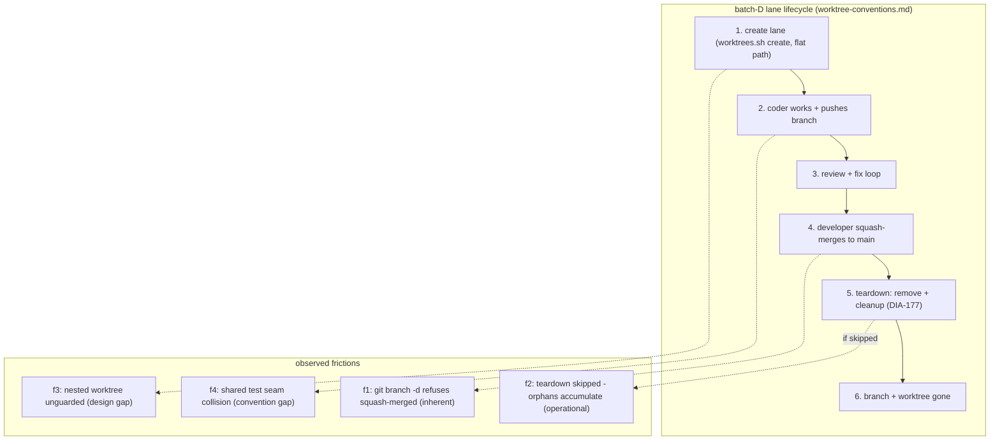

# ana022 - Worktree / Branch / Merge Mechanism Analysis (DIA-180)

<!-- ANALYZER-OUTPUT-CONTRACT
schema-version: 1.0
agent: analyzer
claim-type: finding
evidence-source: docs/dev-infra-audit/tickets/DIA-180-worktree-branch-merge-mechanism-analysis.md; live repo state 2026-08-14 (git worktree list, git branch, .worktrees/ scan)
confidence: High
shelf-registration: memory-shelf.yaml (shelf.analyses), delegated to @memory-manager
-->

Auditor: @analyzer (DIA-180)
Date: 2026-08-14
Scope: mechanism review of the parallel-worktree model (DIA-100 / DIA-172 /
DIA-174 / DIA-177 / DIA-179) against the five known frictions from lived
experience. Codex/ClaudeCode client-parity is a SEPARATE lane (code-navigator)
and is NOT covered here. Transport (friction 5, DIA-153) is out of scope per
dispatch; noted only as resolved.

Governing documents read: docs/dev-infra-audit/worktree-conventions.md,
scripts/worktrees.sh, tickets DIA-100 / DIA-132 / DIA-137 / DIA-153 / DIA-172 /
DIA-174 / DIA-177 / DIA-179 / DIA-180, openspec/changes/test-suite-audit-fixes/
design.md, openspec/changes/worktree-branch-cleanup/design.md,
.opencode/memory/lessons.md, .opencode/memory/adr.md, and the live repo state
(worktree list, branch list, .worktrees/ filesystem scan).

---

## 1. Executive summary

The mechanism is fundamentally sound: squash-merge keeps main linear
(conventions doc lines 99-110), `cleanup` (DIA-177) is the correct answer to
the squash-merge / `git branch -d` refusal, and batch D at 5 slices worked with
zero cross-slice file-ownership violations (lessons.md DIA-179 section). The
five frictions resolve to one inherent git limitation, one accepted-by-design
operational gap, and three genuine tooling gaps that are cheap to close:

1. Friction 1 (branch -d refuses squash-merged): INHERENT git limitation,
   already mitigated by `cleanup` (worktrees.sh:411-515). Residual risk is
   operational: nothing mechanically forces the teardown dispatch to run.
2. Friction 2 (worktree accumulation): DESIGN GAP in `cleanup` - it can only
   see candidates with a live `feature/*` branch (worktrees.sh:576). The live
   repo state (13 orphaned dirs, zero branches, zero registration metadata) is
   invisible to every existing tool. Highest-value fix.
3. Friction 3 (nested worktree): DESIGN GAP - `create` derives its target
   root from the script's own checkout (worktrees.sh:58-60), so invoking it
   inside a worktree nests by construction; no guard exists. The nested
   selfcheck worktree is still on disk and referenced nowhere in tests or docs.
4. Friction 4 (shared test seam): CONVENTION GAP - already fixed at the ADR
   level (adr.md:724), but the rule is not woven into the spec-authoring
   template, so the next batch-D spec can repeat the DIA-179 collision.
5. Friction 5 (push): RESOLVED (DIA-153/DIA-173). Not analyzed.

ana021 findings F-1 (pre-push gate ordering) and F-2 (turbo test default)
verified INTACT after the rebase/push - evidence in O-1/O-2.

---

## 2. Live repo state (2026-08-14, HEAD 3faa8b7 on omo-slim-changes)

| Item | Observed | Tool that can clean it |
| --- | --- | --- |
| Registered worktrees (`git worktree list`) | 1 (the main checkout) | n/a |
| Orphaned worktree dirs under `.worktrees/` | 12 (`feature-dia132-*` x5, `dia133-*` x2, `dia134-*` x4, `dia135-rules`) | NONE (see M-2) |
| Nested worktree dir | 1 (`.worktrees/feature-dia134-shim/.worktrees/feature-dia134-shim-selfcheck`) | NONE (see M-3) |
| `feature/*` branches | 0 (all deleted) | n/a |
| Worktree admin metadata (`.git/worktrees/`) | absent entirely | n/a |
| `git worktree prune --dry-run` | no-op (rc 0) | - |

Consequence: the 13 dirs are pure filesystem orphans. Their `.git` files point
at `/workspace/.git/worktrees/<name>` which no longer exists, `git worktree
list` does not see them, `git worktree prune` has nothing to prune, and
`worktrees.sh cleanup` iterates only `refs/heads/feature/` (worktrees.sh:576)
which is empty. Manual `rm -rf .worktrees` is today's only remedy. This is the
worst-case state for the current tooling, reached exactly by the friction-2
path (merges happened, teardown never ran, branches later deleted).

---

## 3. MECHANISM findings

### M-1 [Medium] Friction 1 - squash-merge refuses `git branch -d` (inherent git limitation, mitigated; operational residual)

- **Classification:** inherent git limitation + operational gap. NOT a design
  gap - the fix exists.
- **Evidence:**
  - Conventions doc:148 documents the exact failure: `git branch -d feature/...`
    fails for a squash-merged branch ("not an ancestor"). Friction 1 was
    anticipated in the design docs.
  - The mitigation is fully implemented: `cleanup` two-pass merge check
    (worktrees.sh:411-424: is-ancestor fast path; tree-subset squash parity via
    `branch_tree_in_main` at worktrees.sh:223-233) and internal `-D` deletion at
    worktrees.sh:510 with the deliberate-`-D` rationale at worktrees.sh:501-505.
  - The residual gap is operational: lessons.md:882-884 records that the
    post-merge Teardown dispatch was "NEVER actually executed" after DIA-172 and
    DIA-174. The DIA-177 design accepted this (worktree-branch-cleanup
    design.md:211-213, D7: invocation "via the existing orchestrator-dispatched
    Teardown lane") and explicitly rejected cron/auto-scheduling
    (design.md:46-53). Enforcement is orchestrator discipline only.
- **Why it matters:** every future batch-D run re-creates the accumulation
  unless the teardown step runs; the script cannot help a dispatcher that does
  not invoke it.
- **Options:**
  - (a) Post-push hook on main (`.husky/post-push`) running
    `worktrees.sh cleanup --dry-run` and printing a warning when stale
    branches/worktrees exist. Pros: fires exactly when the developer pushes the
    squash commit, which is the moment main actually contains the content.
    Cons: dry-run is advisory only; auto-run with default window 0 would delete
    branches at push time (surprising for a developer mid-rollback).
  - (b) `make worktree-gc` target + a documented pre-merge checklist line.
    Pros: zero hook risk, explicit developer control. Cons: still manual.
  - (c) A `git alias squash-merge` encapsulating
    `merge --squash + commit + cleanup` so teardown is one command. Pros:
    closes the loop mechanically for the common path. Cons: new alias surface,
    deviates from the documented 5-step worked example.
  - (d) Status quo: keep the documented Teardown dispatch, accept the residual
    discipline risk (it already failed twice).
- **Recommendation:** (b) + a dry-run (a) is the lazy-but-complete middle:
  `make worktree-gc` (runs `remove` leftovers + `cleanup` + `prune`) as the
  documented post-merge step, plus the dry-run post-push warning as a safety
  net. Effort: M (Makefile target S; post-push hook M with tests).
  Do NOT change the merge strategy (see M-1a).

### M-1a [Low] Regular-merge alternative for feature branches - rejected

- **Classification:** considered option (c) from the dispatch: squash-merge vs
  regular-merge.
- **Evidence:** conventions doc:101-110 records the original rationale:
  parallel lanes produce many small WIP commits; squash keeps main linear and
  revertable; rebase-merge would need lane force-push (denied, DIA-096).
- **Analysis:** regular-merge (a merge commit per lane) would make `git branch
  -d` work (the branch becomes an ancestor), eliminating friction 1's git-level
  trigger. It would also preserve per-lane history on main. Costs: main history
  gains merge commits and every lane's noisy WIP commits; the single-revert-unit
  property of a squash commit is lost; the DIA-096 rationale (only the developer
  pushes main, so preserved lane history has no lane-facing benefit) still
  holds.
- **Recommendation:** keep squash-merge. The cleanup machinery (M-1) already
  neutralizes the only real downside of squash. A merge-commit change would fix
  a symptom the tooling already handles, at the cost of main-history quality.
  Effort: none.

### M-2 [High] Friction 2 - worktree accumulation: orphaned dirs are invisible to every tool

- **Classification:** DESIGN GAP in `cleanup` (candidate enumeration is
  branch-driven, not directory-driven) + the known operational gap.
- **Evidence:**
  - worktrees.sh:576: `git for-each-ref --format='%(refname:short)'
    refs/heads/feature/` - the scan has zero candidates when all branches are
    already deleted (the exact live state in section 2).
  - worktrees.sh:487-498 (row 6) handles a leftover dir only when the branch
    still exists; T27 (worktrees.bats:599) tests exactly that case. The
    no-branch orphaned-dir case is untested and unhandled.
  - Live state: 12 orphaned dirs + 1 nested dir (section 2).
- **Why it matters:** `.worktrees/` is git-ignored, so orphans never surface in
  `git status`; they grow silently every batch and are visible only via `ls`.
  13 exist today. Nothing short of manual `rm -rf` removes them.
- **Options:**
  - (a) Add an orphaned-dir sweep phase to `cleanup`: after the branch scan,
    iterate `$WORKTREES_DIR/*` and classify each dir as (i) registered worktree
    (has an entry in `git worktree list --porcelain`), (ii) leftover for a
    still-existing branch (current row 6), or (iii) fully orphaned (`.git` file
    whose gitdir is missing AND no matching feature/* branch). Report (iii)
    under `--dry-run`, remove under the same safety gates (never force; skip if
    the dir contains a registered nested worktree).
    Pros: closes the exact gap; reuses existing two-pass machinery and
    fail-safe discipline. Cons: needs care to never touch the main checkout or
    a registered worktree (mirror the T11 main-checkout guard).
  - (b) `git worktree prune` integration - rejected: prune removes admin
    metadata, not directories; in this state there is no metadata to prune.
  - (c) Status quo manual `rm -rf` - rejected: recurring manual step.
- **Recommendation:** (a), effort M (script change + 3-4 new bats cases
  T30-T33: orphaned-dir deleted, orphaned-dir dry-run listed, orphaned-dir
  skipped when it contains a registered nested worktree, main-checkout never
  touched). This is the single highest-value fix in this report.

### M-3 [Medium] Friction 3 - nested worktrees: no create-time guard, path root is script-relative

- **Classification:** DESIGN GAP (guard missing; path resolution is not
  main-root-anchored). Removal-order constraint is inherited from git.
- **Evidence:**
  - worktrees.sh:58-60: `ROOT` derives from `BASH_SOURCE` (the script's own
    checkout) and `WORKTREES_DIR=$ROOT/.worktrees`. Running the script from
    inside a worktree therefore nests by construction: a nested lane would land
    at `.worktrees/feature-dia134-shim/.worktrees/...`.
  - Nested dir live on disk:
    `.worktrees/feature-dia134-shim/.worktrees/feature-dia134-shim-selfcheck`
    (its `.git` points at `/workspace/.git/worktrees/feature-dia134-shim-selfcheck`,
    also gone).
  - Nothing references the nested case: grep for `feature-dia134-shim-selfcheck`
    across worktrees.bats and worktree-conventions.md returns nothing (the
    ana021 report also excluded `.worktrees/` from its inventory).
  - `git worktree remove` of the outer worktree fails while a registered nested
    worktree exists inside it (git requires innermost-first), so a nested lane
    can block teardown of its parent.
- **Why it matters:** nested creation is unguarded and undocumented; when it
  happens, teardown ordering surprises a lane that expects `remove` to just
  work.
- **Options:**
  - (a) Create-time guard: refuse `create` when the current checkout is not the
    main worktree (detect via `git worktree list --porcelain` first entry, or
    refuse when `git rev-parse --show-toplevel` != the main root). Pros: one
    check at the top of `cmd_create`. Cons: blocks a legitimate-but-weird
    "lane creates sub-lane" pattern nobody wants anyway.
  - (b) Anchor `WORKTREES_DIR` to the MAIN checkout root regardless of where
    the script runs: `MAIN_ROOT="$(git worktree list --porcelain | head -1 |
    awk '{print $2}')"` (first `worktree ` line) and `WORKTREES_DIR=$MAIN_ROOT/
    .worktrees`. Pros: nested-invocation still lands flat under `.worktrees/`.
    Cons: changes path resolution semantics; needs bats coverage.
  - (c) Remove-time check: `remove` lists any registered worktrees whose path
    is a subdirectory of the target and fails with "remove nested worktrees
    first (innermost-first)". Pros: converts a confusing git error into an
    actionable message. Cons: additional porcelain parsing (see D-1).
- **Recommendation:** (a) + (c), effort S-M. (b) is optional hardening; do (a)
  first (guard is cheaper than re-anchoring) and (c) so the ordering error is
  self-explaining. Document innermost-first in the conventions doc regardless.

### M-4 [Medium] Friction 4 - shared test seam not declared in slice-ownership

- **Classification:** CONVENTION GAP - the ADR already exists; the spec
  template has not absorbed it.
- **Evidence:**
  - adr.md:724-776 "Batch-D shared tracked test seams must be declared in the
    spec slice-ownership table" (accepted 2026-08-14) records the exact rule:
    any tracked file a slice MODIFIES must be in its owned-files set; shared
    seams need single-owner OR declared conflict + planned merge order.
  - DIA-179 design.md Ownership table (lines 265-277) has a "Disjointness
    check" that covers source files only; the seam collision
    (`scripts/__tests__/batch-d-infra.test.mjs`, slices B and C both appended)
    was discovered at merge time (DIA-179 ticket, merge phase: conflict on
    merge 2, resolved manually keeping both describe blocks).
  - lessons.md:912-921 repeats the rule as an actionable lesson; the current
    file carries the aftermath: S4 (slice C) and S5 (slice B) blocks sit side
    by side in batch-d-infra.test.mjs, 49 tests total.
- **Why it matters:** the ADR and the lesson live in memory files; the
  openspec-plan spec-authoring flow (which generates the Ownership table) has
  no checklist item for shared tracked test seams, so the next multi-slice
  change can silently repeat the collision.
- **Options:**
  - (a) Fold the ADR rule into the OpenSpec design.md template's Ownership
    section (a mandatory "shared tracked seams" audit line: name every tracked
    file slices append to; for each, assign single owner OR declare the
    conflict + serialized merge order). Pros: fixes at the point of origin.
    Cons: template change goes through openspec-plan (practice-protected flow;
    needs developer approval).
  - (b) Mechanical validator: a script that greps a design.md Ownership table
    for tracked files appearing in multiple owned-files lists and warns.
    Pros: catches it pre-dispatch without human memory. Cons: new validator +
    wiring; the ADR rule also covers "declared conflict" which a mechanical
    check cannot distinguish from an accidental overlap - risk of false
    positives.
  - (c) Status quo: rely on the ADR + lessons. Rejected: memory files are not
    read at spec-authoring time (the DIA-179 collision proves it).
- **Recommendation:** (a) first (S effort, the ADR wording is ready to paste),
    (b) as optional follow-up if the team wants a gate. Effort: S.

### M-5 [n/a] Friction 5 - push mechanism

- **Classification:** resolved, out of scope per dispatch. DIA-153 (SSH +
  GIT_SSH_COMMAND IdentityAgent + known_hosts) and DIA-173 closed; live pushes
  from the lane succeeded this session (HEAD 3faa8b7 pushed). No analysis.

---

## 4. DRY findings

### D-1 [Low] Three near-identical porcelain parsers in worktrees.sh

- **Evidence:**
  - `resolve_worktree_path` (worktrees.sh:131-155): porcelain parse, match by
    path OR branch.
  - `worktree_branch_at` (worktrees.sh:162-180): porcelain parse, match by
    path.
  - `worktree_path_for_branch` (worktrees.sh:188-209): porcelain parse, match
    by branch.
  All three implement the same `worktree\ *` / `branch\ *` case loop with the
  same empty-line-reset pattern. M-3 (c) would add a fourth if not unified
  first.
- **Why it matters:** the porcelain format is a stable contract, but three
  hand-rolled parsers mean a format change or a new field (e.g. `detached`,
  `prunable`) must be found and updated three times; the M-3(c) nested-check
  would copy it a fourth time.
- **Recommendation:** extract one helper `worktree_pairs()` that echoes
  `path<TAB>branch` lines and let the three callers filter. Bash-3-compatible
  (printf loop, no arrays). Effort: S, with the existing bats suite as the
  safety net.

### D-2 [Low] Cleanup policy prose restated in four places

- **Evidence:** the rollback-window / 0-day-default / dirty-skip policy appears
  in (1) worktree-conventions.md:82-87 and 192-207 (authoritative), (2)
  worktrees.sh header lines 25-32, (3) worktree-branch-cleanup design.md D1-D7,
  (4) lessons.md:874-897. The header restates the policy rather than pointing
  at the doc.
- **Why it matters:** the doc layering is intentional (conventions doc is the
  authoritative operational layer, script header self-documents the CLI), so
  this is minor; the risk is drift when the policy changes (e.g. if the default
  window ever changes, four places must agree).
- **Recommendation:** keep the script header terse (usage-level contract,
  exit codes, flag precedence) and replace the policy paragraphs with a one-line
  pointer to worktree-conventions.md "Cleanup policy". Effort: S.

### D-3 [Clean] Dual-record of the test-seam rule is intentional

- **Evidence:** adr.md:724 (decision record) + lessons.md:912 (actionable
  lesson) both carry the shared-seam rule.
- **Assessment:** correct per the memory-model convention (ADR = decision +
  rationale, lessons = irrecoverable process insight). No action.

---

## 5. OBSERVATIONS

### O-1 [Verified] ana021 F-1 (pre-push gate ordering) INTACT after rebase/push

`scripts/verify-pre-push.sh:98-103` runs the fast gates first and the slow
bats suite LAST, exactly per the F-1 fix:
`verify:format` (98), `verify:js` (99), `verify:js-tests` (100), `make
test-config` (101), `verify:python` (102), `make test-shell` (103). The
comment block at lines 86-96 cites F-1/DIA-179 and the fast-to-fail rationale.
INTACT. (File paths verified against HEAD 3faa8b7; working tree clean.)

### O-2 [Verified] ana021 F-2 (turbo test default) INTACT after rebase/push

`turbo.json:21-28`: base `test` task has `"dependsOn": []` with the comment
"DIA-179 F-2: base test no longer depends on build, so new packages get fast
tests by default". INTACT. (Verified against HEAD 3faa8b7.)

### O-3 [Risk] Friction 1 was documented before it was experienced

worktree-conventions.md:148 shows the worked example already containing the
failing `git branch -d` line ("fails: not an ancestor") with the `cleanup`
answer below it. The failure mode was known; the failure was execution of the
documented teardown step, not documentation. Any fix must therefore target
enforcement (M-1 options), not docs.

### O-4 [Known-accepted] No auto-scheduling by design

worktree-branch-cleanup design.md:46-53 explicitly makes cron/CI triggering a
non-goal, and design.md:211-213 records that the Teardown step "was never
actually executed after the DIA-172/DIA-174 batches". The team has accepted an
operational-discipline dependency; M-1(b)/(a) closes it without a scheduler.

### O-5 [Low] Non-feature branches correctly out of scope

`further-dev-infrastructure-development` exists locally and on origin.
`cleanup` hard-filters `refs/heads/feature/` (worktrees.sh:576, design doc
non-goal: non-feature branches). Correct per policy; noted so nobody files a
false "cleanup missed a branch" report.

### O-6 [Informational] Squash-parity check has a documented revert edge

`branch_tree_in_main` (worktrees.sh:223-233) classifies a branch as merged when
every branch-tracked file exists in main with identical content; a branch that
reverts its own changes before merge is indistinguishable from merged. Accepted
trade-off, documented in design.md:281-285. The consequence is at most a
premature branch deletion of an empty-of-delta branch, never data loss (the
content is by definition identical to main).

### O-7 [Process] ana022 ID verified free

`knowledge/` listing ends at ana021; ana022 is the next free ID and was used
per the preallocation instruction.

---

## 6. Batch-D lifecycle with friction markers

---

## 7. Recommendations summary (prioritized)

| ID | Finding | Severity | Effort | Recommendation |
| --- | --- | --- | --- | --- |
| R-1 | M-2 cleanup cannot see orphaned dirs | High | M | Add orphaned-dir sweep phase to `cleanup` (report/delete, never force, skip nested-registered), bats T30-T33 |
| R-2 | M-3 nested worktree unguarded | Medium | S-M | Create-time guard (refuse non-main checkout) + remove-time innermost-first message; document ordering |
| R-3 | M-4 test-seam rule not in spec template | Medium | S | Fold adr.md:724 rule into the OpenSpec design.md Ownership template (single-owner OR declared conflict + merge order) |
| R-4 | M-1 teardown enforcement | Medium | M | `make worktree-gc` + dry-run post-push warning; keep squash-merge (M-1a rejected) |
| R-5 | D-1 porcelain parsers x3 | Low | S | Extract one `worktree_pairs()` helper (bash-3 safe), reuse in all three callers |
| R-6 | D-2 policy prose drift | Low | S | Trim script header policy paragraphs to a pointer at worktree-conventions.md |

Deferred (do NOT do): cron/auto-scheduled cleanup (design.md non-goal;
M-1(b) covers the real need), regular-merge switch (M-1a rejected),
`git worktree prune`-based cleanup (does not remove dirs).

---

## 8. Artifact info

- Report: knowledge/ana022-worktree-mechanism-analysis/ana022-worktree-mechanism-analysis-report.md
- ID: ana022 (verified next free in knowledge/)
- Shelf registration: NOT performed by this lane (delegated to @memory-manager
  per output contract).
- Related knowledge: ana021-test-suite-audit (F-1/F-2 cross-check), res022 /
  tickets DIA-100 / DIA-172 / DIA-174 / DIA-177 / DIA-179.
