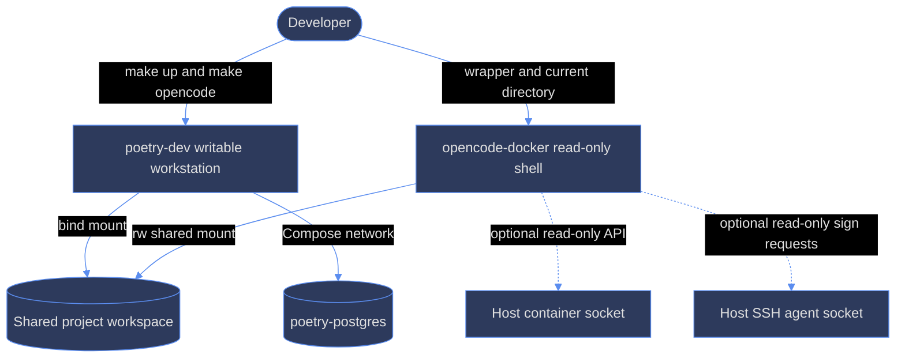

# ana023 - Container functionality and overlap analysis

## Scope and method

This report compares the two application-facing images only:

1. `poetry-dev`, built by `Dockerfile.dev` and started as Compose service `dev`.
2. `opencode-docker`, built by `tools/opencode-docker/Dockerfile` and started by
   `tools/opencode-docker/bin/opencode-docker`.

The analysis uses MECE categories: runtime/toolchain, OpenCode, browser and
automation, project execution, configuration and state, security and identity,
secrets, and lifecycle. Evidence is tied to repository paths and line ranges.

## Executive findings

The images duplicate most of the interactive developer toolchain, but they
serve different trust and lifecycle boundaries. `poetry-dev` is a writable,
long-lived application workstation that runs the project. `opencode-docker` is
a disposable, read-only OpenCode shell that reaches the project and host
container engine through mounts. Consolidation is therefore not recommended as
a single image. The better target is shared version metadata and a small common
installer/build component, while retaining separate runtime policies.

## 1. MECE inventory

### A. Base OS and process model

| Capability | poetry-dev | opencode-docker | Evidence |
|---|---|---|---|
| Base OS | Debian 13 slim, digest pinned | Debian 13 slim, same digest in both builder and final stages | `Dockerfile.dev:19`; `tools/opencode-docker/Dockerfile:1,129` |
| Runtime mutability | Writable image/runtime; needed for installs, WASM builds, caches | Read-only rootfs; `/tmp` is an executable tmpfs | `Dockerfile.dev:15-17`; `tools/opencode-docker/bin/opencode-docker:205-212` |
| PID 1 / startup | `tini` -> `dev-entrypoint.sh` | Python `bootstrap.py` entrypoint | `Dockerfile.dev:349-351`; `tools/opencode-docker/Dockerfile:222-227` |
| Default work directory | `/workspace` | `/app`, then wrapper passes `/workspace` as OpenCode target | `Dockerfile.dev:307`; `tools/opencode-docker/Dockerfile:159-166`; `bin/opencode-docker:225-226` |
| Resource controls | Compose does not set CPU or memory limits | 4 GB and 4 CPU defaults, 1 GB shared memory | `docker-compose.yml:28-76`; `bin/opencode-docker:65-67,205-214` |

### B. Toolchain and packages

| Tool or package | poetry-dev | opencode-docker | Evidence |
|---|---|---|---|
| Node and npm | Node 24.18.0 direct binary, npm included | Node 24.18.0 direct binary, npm included | `Dockerfile.dev:23,123-135`; `tools/opencode-docker/Dockerfile:5,32-42` |
| pnpm and bun | Global npm packages, pinned | Global npm packages, pinned | `Dockerfile.dev:31-32,156-166`; `tools/opencode-docker/Dockerfile:7-8,51` |
| mise | 2026.8.0, checksum verified | 2026.8.0, checksum verified | `Dockerfile.dev:177-197`; `tools/opencode-docker/Dockerfile:53-68` |
| uv and Python | Debian Python, pip, venv, uv 0.11.29 | Debian Python, pip, venv, uv 0.11.29 | `Dockerfile.dev:64-66,199-206`; `tools/opencode-docker/Dockerfile:21-23,78-86` |
| snip | Standalone binary 0.22.0 | Standalone binary 0.22.0 | `Dockerfile.dev:33,168-175`; `tools/opencode-docker/Dockerfile:9,70-76` |
| OpenSpec | Global npm package 1.7.0 | Global npm package 1.7.0 | `Dockerfile.dev:35,160-166`; `tools/opencode-docker/Dockerfile:11,51` |
| DCP | Global npm package 3.1.14 | Global npm package 3.1.14 | `Dockerfile.dev:34,160-162`; `tools/opencode-docker/Dockerfile:10,51` |
| Git and shell utilities | git, curl, wget, ripgrep, jq, make, dbus and more | git, curl, wget, ripgrep, jq, dbus; `openssh-client` explicit | `Dockerfile.dev:59-74`; `tools/opencode-docker/Dockerfile:15-30` |
| Docker client | Docker CLI 29.7.2 and Compose plugin 5.4.0 via apt | Docker CLI 29.7.2 and Compose v2.39.1 static bundle | `Dockerfile.dev:76-106`; `tools/opencode-docker/Dockerfile:179-220` |
| Rust and WASM | Rust 1.83.0, wasm target, separate rust-analyzer 1.97.1 | Not installed | `Dockerfile.dev:225-262`; `tools/opencode-docker/Dockerfile:95-108` |
| Language servers | TypeScript LS, TypeScript, Pyright, YAML LS, rust-analyzer | Not installed | `Dockerfile.dev:41-54,156-166,250-262` |
| trafilatura | System-installed 2.2.0 | Not installed | `Dockerfile.dev:208-223` |
| Browser packages | Playwright and crawl4ai; Chromium and system deps | Playwright and crawl4ai; Chromium and system deps | `Dockerfile.dev:264-283`; `tools/opencode-docker/Dockerfile:134-177` |
| SSH client | Not explicitly installed in Dockerfile.dev | Installed explicitly | `tools/opencode-docker/Dockerfile:15-30`; absence from `Dockerfile.dev:59-74` |

### C. OpenCode and plugin configuration

| Item | poetry-dev | opencode-docker | Evidence |
|---|---|---|---|
| OpenCode version | 1.18.18 direct, checksum verified | Dockerfile ARG remains 1.18.4 and uses installer script | `Dockerfile.dev:27,137-154`; `tools/opencode-docker/Dockerfile:6,44-49` |
| OMO version | 2.2.14 cache baked into `/home/dev/.cache/opencode` | Config declares OMO 2.2.14; image Dockerfile does not bake the OMO package | `Dockerfile.dev:30,324-340`; `tools/opencode-docker/config/opencode.json:24-29` |
| Other plugins | DCP is baked; project config supplies other plugins at runtime | Config declares OMO, envsitter, telemetry, DCP | `Dockerfile.dev:160-162`; `tools/opencode-docker/config/opencode.json:24-29` |
| Config directory | `/home/dev/.config/opencode` | `/app/.config/opencode`, mounted from host config | `Dockerfile.dev:288-290,302`; `tools/opencode-docker/Dockerfile:162-164`; `bin/opencode-docker:216-219` |
| Startup behavior | Loads secrets, starts Xvfb, execs requested command | Loads secrets, starts Xvfb, initializes OpenSpec if absent, execs OpenCode | `dev-entrypoint.sh:8-60`; `bootstrap.py:29-93` |

DIA-188 explains why the versions differ: the project moved `poetry-dev` to
OpenCode 1.18.18 and baked OMO 2.2.14, while the opencode-docker Dockerfile
still records 1.18.4 and uses the old installer pattern (`DIA-188:70-81,168-184`).
The checked-in opencode-docker config does declare OMO, but declaration is not
the same as an offline package cache.

### D. Volumes, mounts, and state

| State or mount | poetry-dev | opencode-docker | Evidence |
|---|---|---|---|
| Project source | Bind mount `.:/workspace:z` | Bind mount selected workspace to `/workspace:rw,z` | `docker-compose.yml:44-50`; `bin/opencode-docker:199-205,225` |
| Dependencies | Named `pnpm_store` mounted at `/workspace/node_modules` | No dependency volume; workspace dependencies are supplied by selected project | `docker-compose.yml:48`; `bin/opencode-docker:216-225` |
| OpenCode state | Named `dev_state` at `/home/dev/.local/share`; named `dev_cache` at `/home/dev/.cache` | Host `~/.opencode-docker/.local/{share,state}` and `.cache` | `docker-compose.yml:49-50`; `bin/opencode-docker:45-49,216-219` |
| OpenCode config | Image directory, not a Compose mount | Host config mounted read/write; copied from repo unless update flag changes behavior | `Dockerfile.dev:288-303`; `bin/opencode-docker:98-105,218` |
| Secrets mount | Compose secrets at `/run/secrets`, read-only | Host secrets directory at `/run/secrets`, read-only | `docker-compose.yml:64-69,105-115`; `bin/opencode-docker:220` |
| Docker socket | No socket; Docker client is client-side for Compose config/gates | First available Podman/Docker socket mounted read-only | `docker-compose.yml:44-70`; `bin/opencode-docker:131-158,223` |
| SSH agent | No SSH agent mount | Host agent socket mounted read-only at `/tmp/ssh-agent.sock` | `tools/opencode-docker/AGENTS.md` section; `bin/opencode-docker:160-197,224` |
| Git config | System and per-user safe.directory baked; profile files baked | Host `.gitconfig` copied into persistent dir and mounted read-only | `Dockerfile.dev:318-344`; `bin/opencode-docker:113-118`; `DIA-185:88-98` |

### E. User, environment, and security

| Concern | poetry-dev | opencode-docker | Evidence |
|---|---|---|---|
| UID/GID | Image creates `dev`, default 1000:1000; Compose currently overrides service user to root `0:0` | Build-time UID/GID and runtime `--userns=keep-id`; final image switches to that user | `Dockerfile.dev:21-22,285-295,342`; `docker-compose.yml:29-31`; `bin/opencode-docker:205-211`; `tools/opencode-docker/Dockerfile:222` |
| HOME and XDG | `/home/dev` and `/home/dev/.config`, `.local`, `.state`, `.cache` | `/app` with matching XDG subdirectories | `Dockerfile.dev:297-305`; `tools/opencode-docker/Dockerfile:161-169` |
| Display | `DISPLAY=:99.0`; entrypoint starts Xvfb with `-ac -noreset` | `DISPLAY=:99.0`; bootstrap starts Xvfb and waits for X socket | `Dockerfile.dev:303,349-351`; `dev-entrypoint.sh:42-54`; `tools/opencode-docker/Dockerfile:161`; `bootstrap.py:51-67` |
| Secrets variables | Only five whitelisted files; empty files skipped | Five whitelisted names in bootstrap; files are read and exported, including empty values | `dev-entrypoint.sh:8-39`; `bootstrap.py:10-48`; `secrets/README.md:28-46` |
| Capabilities | Standard writable development posture | All capabilities dropped, no-new-privileges, read-only rootfs, label disabled for socket access | `Dockerfile.dev:15-17`; `bin/opencode-docker:205-214`; `DIA-145:74-82` |
| Network role | Compose network with Postgres dependency and exposed app ports | No Compose service; wrapper gives OpenCode access to selected workspace and host sockets | `docker-compose.yml:37-78,102-125`; `bin/opencode-docker:205-226` |

## 2. Functional overlap matrix

Legend: `B` means both, `D` means poetry-dev only, `O` means opencode-docker
only. ``B`` does not imply identical implementation or identical security.

| Capability | Classification | Evidence and qualification |
|---|---|---|
| Debian 13 base and Python 3 | B | Same base digest; Python packages in both Dockerfiles (`Dockerfile.dev:19,64-66`; `tools/opencode-docker/Dockerfile:1,21-23`) |
| Node 24.18.0, npm, pnpm 10.33.0, bun 1.3.14 | B | Duplicate ARGs and install blocks (`Dockerfile.dev:23,31-32,123-166`; `tools/opencode-docker/Dockerfile:5,7-8,32-51`) |
| mise 2026.8.0 | B | Same version and checksum pattern (`Dockerfile.dev:177-197`; `tools/opencode-docker/Dockerfile:53-68`) |
| uv 0.11.29, OpenSpec 1.7.0, DCP 3.1.14, snip 0.22.0 | B | Duplicate pins/install paths (`Dockerfile.dev:33-36,156-175,199-206`; `tools/opencode-docker/Dockerfile:9-11,51,70-86`) |
| git, curl/wget, ripgrep, jq, Xvfb, clipboard tools | B | Overlapping apt package sets (`Dockerfile.dev:59-74`; `tools/opencode-docker/Dockerfile:15-30`) |
| Docker CLI and Compose | B | Both added for different gates: dev client-side validation, isolated image host-socket delegation (`DIA-152:56-69`; `DIA-145:59-69`) |
| OpenCode CLI | B, but drifted | Both run OpenCode; versions and supply chains differ (`Dockerfile.dev:137-154`; `tools/opencode-docker/Dockerfile:44-49`) |
| OMO 2.2.14 | B in intended function, not in delivery | Dev image caches package; isolated config declares package but Dockerfile does not cache it (`Dockerfile.dev:324-340`; `tools/opencode-docker/config/opencode.json:24-29`) |
| Playwright Chromium and crawl4ai | B | Both install Python packages and Chromium; dev uses `install-deps`, isolated image installs runtime apt libraries (`Dockerfile.dev:264-283`; `tools/opencode-docker/Dockerfile:134-177`) |
| Browser display at `:99` | B | Both set DISPLAY and start Xvfb (`dev-entrypoint.sh:42-54`; `bootstrap.py:51-67`) |
| Project workspace at `/workspace` | B | Both expose the project path, but dev uses repo root and isolated uses selected current directory (`docker-compose.yml:44-50`; `bin/opencode-docker:51-57,225`) |
| File-based API secrets | B, with semantic mismatch | Same five names, but empty-file behavior differs (`dev-entrypoint.sh:15-39`; `bootstrap.py:16-48`; `secrets/README.md:40-46`) |
| Writable dependency and build environment | D | Dev intentionally supports `pnpm install`, WASM, and caches (`Dockerfile.dev:15-17`; `docs/docker-dev.md:80-91`) |
| Rust 1.83, wasm32 target, rust-analyzer | D | Only Dockerfile.dev provisions Rust and LSP (`Dockerfile.dev:225-262`) |
| TypeScript/Python/YAML language servers and trafilatura | D | Only Dockerfile.dev provisions them (`Dockerfile.dev:41-54,156-166,208-223`) |
| Postgres network and application ports | D | Compose-only role (`docker-compose.yml:37-43,70-103`; `docs/docker-dev.md:43-52`) |
| Host container engine API | O | Wrapper detects and mounts socket; dev has no socket (`bin/opencode-docker:131-158,205-224`; `DIA-152:56-59`) |
| Host SSH signing for git push | O | Wrapper forwards agent; DIA-173 explicitly says poetry-dev does not need it (`bin/opencode-docker:160-197`; `DIA-173:61-62`) |
| Read-only rootfs and dropped capabilities | O | Wrapper runtime policy (`bin/opencode-docker:205-214`; `tools/opencode-docker/README.md:86-96`) |
| OpenSpec auto-initialization | O | `bootstrap.py:init_openspec` (`bootstrap.py:69-87`) |

## 3. Visualizations

### 3.1 Boundary and data flow



### 3.2 Capability count visualization

The matrix has 21 analyzed capability rows: 12 shared rows, 5 dev-only rows,
and 4 isolated-only rows. The count is a classification aid, not a measure of
image size or security.

```text
Shared         [############] 12
poetry-dev     [#####     ]  5
opencode-only  [####      ]  4
```

```text
+---------------------------------------------------------------+
| How to read this chart                                       |
| Title: Functional classification count                       |
| X-axis: Capability rows, one hash per row                    |
| Y-axis: Classification                                      |
| Legend: Shared, poetry-dev only, opencode-docker only       |
| How to read: Most rows are duplicated tool functions, while  |
| the unique rows encode different runtime responsibilities.   |
+---------------------------------------------------------------+
```

## 4. Drift and duplication risks

### 4.1 High risk: OpenCode version parity is already broken

`Dockerfile.dev` pins 1.18.18 and uses a verified release binary, while
`tools/opencode-docker/Dockerfile` pins 1.18.4 and verifies an install script
instead (`Dockerfile.dev:27,137-154`; `tools/opencode-docker/Dockerfile:6,44-49`).
DIA-188 identifies the old isolated image version as below OMO 2.2.14's stated
compatibility floor (`DIA-188:70-81`). This can produce different plugin loading,
TUI behavior, and protocol behavior for the same repository.

### 4.2 High risk: duplicated Node and pnpm sources are not automatically synced

`.mise.toml` explicitly says the Node and pnpm versions have no automated sync
with either Dockerfile and require edits in both (`.mise.toml:1-8`). The current
values happen to agree, but the process permits silent drift across three
sources: `.mise.toml`, `Dockerfile.dev`, and `tools/opencode-docker/Dockerfile`.

### 4.3 High risk: two Docker Compose implementations can drift

`poetry-dev` installs Docker packages from the Docker apt repository and pins
Compose 5.4.0 (`Dockerfile.dev:97-106`). The isolated image extracts Docker CLI
29.7.2 and Compose v2.39.1 static assets (`tools/opencode-docker/Dockerfile:179-218`).
The same nominal capability has different packaging and Compose versions. A
Compose-file feature accepted in one can fail in the other.

### 4.4 Medium risk: duplicate browser stack with different dependency closure

Both images install Playwright and crawl4ai, but the dev image runs
`playwright install-deps chromium`, while the isolated final stage declares a
hand-selected runtime library list and only runs `playwright install chromium`
(`Dockerfile.dev:274-283`; `tools/opencode-docker/Dockerfile:134-177`). Browser
launch behavior can diverge when Chromium or Debian dependencies change.

### 4.5 Medium risk: secrets behavior is not equivalent

The dev entrypoint skips zero-byte files, as required by the secrets contract
(`dev-entrypoint.sh:29-39`; `secrets/README.md:28-46`). `bootstrap.py` reads every
allowed file and exports its contents without an empty-value check
(`bootstrap.py:29-48`). A fresh isolated runtime can therefore expose an empty
variable where dev intentionally leaves the variable unset. The two whitelists
also have to be kept synchronized independently (`dev-entrypoint.sh:10-14`;
`bootstrap.py:12-22`).

### 4.6 Medium risk: duplicated install logic has already diverged in security

The dev image verifies the OpenCode binary directly (`Dockerfile.dev:137-154`),
whereas the isolated image verifies the mutable install script then executes it
(`tools/opencode-docker/Dockerfile:44-49`). DIA-188 records the direct binary
change as the correction for the old pattern (`DIA-188:168-178`). Unless the
isolated image is updated, security posture and reproducibility differ.

### 4.7 Low risk: user and Git behavior are intentionally different but easy to misread

Compose sets `dev` to root even though the image creates user `dev`
(`docker-compose.yml:29-31`; `Dockerfile.dev:285-295`). The isolated image uses
keep-id and a non-root runtime (`bin/opencode-docker:205-211`;
`tools/opencode-docker/Dockerfile:222`). Git safe.directory is baked in dev,
while isolated runs with a copied host gitconfig (`Dockerfile.dev:318-344`;
`bin/opencode-docker:113-118`). These are not interchangeable user semantics.

## 5. Consolidation assessment

### What can be shared safely

- Version variables for Node, pnpm, bun, mise, uv, snip, DCP, and OpenSpec.
- Common checksum/install fragments for the duplicated CLI tools.
- A test that compares Dockerfile pins with `.mise.toml` and checks OpenCode/OMO
  compatibility.
- A shared capability manifest used to detect accidental duplication or drift.

### What should remain separate

- Writable dev workstation versus read-only isolated shell.
- Rust, LSP, trafilatura, project dependency volume, Postgres network, and app
  ports, which belong to `poetry-dev`.
- Host socket and SSH-agent forwarding, resource limits, and `label=disable`,
  which belong to the wrapper-launched isolated shell.
- Different startup responsibilities: Compose service orchestration versus
  OpenCode-only bootstrap.

### Recommendation

Do not consolidate the two images into one image. Keep two runtime images, but
consolidate version sources and shared installer logic first; then enforce parity
for Node/pnpm/mise and OpenCode/OMO with a config test. This preserves the
security boundary and avoids copying dev-only Rust/LSP/build weight into the
interactive isolation image.

## Evidence index

- `Dockerfile.dev:19-54,59-74,76-106,123-223,225-283,285-354`
- `docker-compose.yml:28-125`
- `dev-entrypoint.sh:8-60`
- `tools/opencode-docker/Dockerfile:1-30,32-127,129-227`
- `tools/opencode-docker/bin/opencode-docker:15-226`
- `tools/opencode-docker/bootstrap.py:10-97`
- `tools/opencode-docker/config/opencode.json:1-30`
- `tools/opencode-docker/Makefile:3-41`
- `.mise.toml:1-12`
- `secrets/README.md:1-74`
- `docs/docker-dev.md:1-95`
- `DIA-145-opencode-docker-host-socket-access.md:36-110`
- `DIA-152-install-docker-cli-poetry-dev-image.md:39-107`
- `DIA-173-ssh-agent-forward-opencode-docker.md:38-106`
- `DIA-185-bake-safe-directory-into-dockerfile-dev.md:43-137`
- `DIA-188-omo-slim-project-self-sufficiency.md:64-234`
