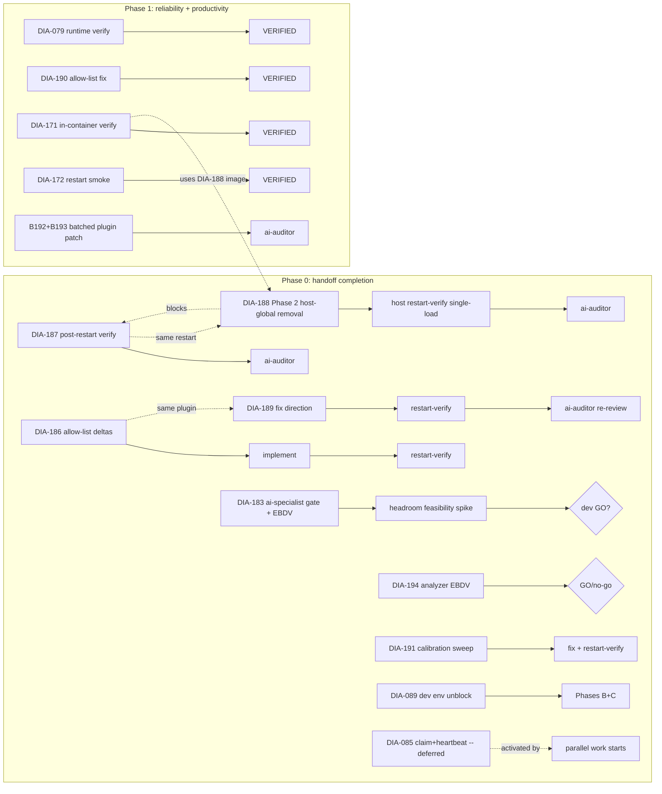

# ana023: Ticket Backlog Priority Plan

<!-- ANALYZER-OUTPUT-CONTRACT
schema-version: 1.0
agent: analyzer
claim-type: recommendation
evidence-source: docs/dev-infra-audit/tickets/README.md + 22 individual DIA ticket files (DIA-077/079/085/089/100/155/156/171/172/180/181/183/186/187/188/189/190/191/192/193/194 + README status summary)
confidence: High
shelf-registration: memory-shelf.yaml (shelf.analyses), delegated to @memory-manager
-->

## Session context (verified facts)

Verified by the orchestrator this session (trust as ground truth):

- **Batch-approval gate DONE + lane-0 checksum MATCH** -- handoff
  `ses_ffd538953ffeHi5JxeN4RF1aAp` is clean.
- **Push of omo-slim-changes to origin SUCCEEDED** -- origin + local at
  `80a148b`, in sync.
- **DIA-156 sqlite query layer VERIFIED working live** -- 44004 registry +
  42865 messages rows imported, filtered queries OK (supersedes the
  DIA-134 /workspace host-path pre-existing failure noted in the ticket).
- **DIA-188 container VERIFIED on the NEW baked image** -- `dead1864b2ec`,
  opencode 1.18.18 + OMO 2.2.14, healthy. Phase 1 self-sufficiency
  restart-verify PASSED in-container; only Phase 2 (host-global OMO
  removal) remains.
- **DIA-189 runtime failure ROOT-CAUSED** -- guard predicate mismatch:
  `isDefaultLabel` checks `"opencode "` prefix but runtime 1.18.18
  defaults are `"New session - <ISO>"` / `"Terminal N"`; rename never
  fires. Three fix-direction options exist (broaden predicate /
  rename-if-not-suffixed / fix harness DEFAULT_TITLE). Routes through
  AGENTS.md 2.5.

Ledger reconciliation (handoff listed 7 OPEN items vs README shows 9 OPEN):
the missing two are **DIA-187** (OMO 2.2.14 update) and **DIA-188** (OMO
self-sufficiency) -- both were filed by **parallel sibling-lane sessions**
during the batch-approval campaign and were absent from the handoff's
`open_tickets` snapshot because it was taken before the sibling lanes
flushed. They are real OPEN work and are included in this plan.

## Phase 0 - Handoff completion items

These are the developer's explicit first-priority items. The handoff
completion set is the 9 OPEN tickets, ordered by remaining effort and
blocker class.

| ID + slug | Status | Remaining work | Blocker | Effort | Routing |
|---|---|---|---|---|---|
| DIA-189 terminal-session-identity | OPEN (Major) | (a) Developer disposition on fix-direction (3 options: broaden predicate / rename-if-not-suffixed / fix harness DEFAULT_TITLE); (b) coder fix lane; (c) restart-verify distinct PTY labels + Cyrillic toast; (d) ai-auditor re-review | Developer decision (fix direction) | M (1-2 days) | AGENTS.md 2.5 |
| DIA-186 overnight-permission-prompt-gaps | OPEN | (a) ai-specialist audit findings ingested; (b) developer disposition on allow-list deltas; (c) coder implementation; (d) restart-verify overnight-worktree lane silent on permissions; (e) ai-auditor | Developer decision (allow-list deltas) | M (1 day) | AGENTS.md 2.5 |
| DIA-194 artifact-format-substrate-analysis | OPEN | (a) @analyzer lane produces ana023-equivalent EBDV matrix for CHANGELOG-first conversion; (b) B1-B7 verification checklist; (c) go/no-go decision; (d) if GO, spawn follow-up conversion ticket | Analyzer dispatch; developer go/no-go | S (half-day analysis) | Analyzer lane, then AGENTS.md 2.5 if GO |
| DIA-188 omo-self-sufficiency | OPEN | (a) Phase 2 -- remove host-global OMO entries (~/.config/opencode/opencode.jsonc + tui.json); (b) host restart-verify single-load from project alone; (c) Windows-native config pin (/mnt/c/...) separate follow-up (Q8); (d) ai-auditor + registration | Developer go-ahead for Phase 2 | S (half-day) | AGENTS.md 2.5 Phase 5/6/7 |
| DIA-187 omo-slim-2-2-14-update | OPEN | (a) Post-restart re-verify (panel shows 2.2.14, task_result registered, bg-job recovery); (b) ai-auditor independent review; (c) CHANGELOG + learnings registration | Restart OpenCode on host | S (half-day) | AGENTS.md 2.5 Phase 5/6/7 |
| DIA-183 ponytail-headroom-context-compression | OPEN | (a) @ai-specialist gate (web-fresh); (b) EBDV (>=2 variants + abort); (c) headroom feasibility spike (proxy intercept + cached-read cost delta); (d) developer decision; (e) coder if GO; (f) ai-auditor | Developer decision after EBDV | L (2-3 days) | AGENTS.md 2.5 |
| DIA-085 handoff-parallel-orchestrator-sessions | OPEN | Claim+heartbeat protocol (ana011 follow-up) -- explicitly deferred-build; activate only when a parallel-session work actually starts. Current parallel-handoff-slots (Option B) already IMPLEMENTED; only the ana011 claim+heartbeat layer remains. | No parallel work active right now | S-M (deferred; 1 day when activated) | OpenSpec change when activated |
| DIA-091 -> DIA-089 book-rag-skill-openwebui | OPEN | Phases B/C blocked on developer env setup: (1) start OpenWebUI server; (2) set OPENWEBUI_URL/OPENWEBUI_API_KEY/OPENWEBUI_DATA_DIR; (3) lane-owned follow-ups (fix SKILL.md stale API-key claim, refresh KB cache, reconcile memory-shelf drift) | Developer env setup (server start + 3 env vars) | M (after unblock) | Section 10 if config touches |
| DIA-191 context-usage-estimator-overestimates | OPEN | (a) Calibration sweep at 3+ depths (fresh/mid/deep); (b) document divergence shape (linear vs depth-dependent); (c) choose fix: weight registry by token cost, read `opencode db`/`opencode stats` (DIA-182 data source), or apply correction factor; (d) implement; (e) restart-verify | Analyzer dispatch, then developer decision | M (1 day) | AGENTS.md 2.5 if plugin estimator changes |

## Phase 1+ - Prioritized backlog

Ordering principle: **impact on productivity and reliability**, not ticket
number. Each entry cites why it matters (impact axis), estimated effort,
dependencies, and routing.

| Rank | ID + slug | Status | Impact axis | Effort | Dependencies | Routing |
|---|---|---|---|---|---|---|
| 1 | DIA-079 handoff-write-json-parse-error | MONITOR (Major) | **Reliability** -- boot-gate (DIA-061) silent-failure class; fix (parsePrognosis helper b005277) is in but runtime verification still pending. If the fallback has NEVER been exercised live since merge, the defect may still bite the next session boundary. | S (1 restart + 1 log_decision) | Live handoff write in a booted session | Restart-verify checklist (7 items in ticket); flip MONITOR -> VERIFIED |
| 2 | DIA-190 conspecter-shelf-edit-permission | VERIFIED (Major) | **Reliability** -- contract vs permission drift: @conspecter is told to register in memory-shelf.yaml but edit:deny blocks it. Forces @memory-manager dispatch on every conspect (token cost + latency). | S-M (1 of: (a) expand conspecter allow to memory-shelf.yaml, or (b) remove contract claim, or (c) keep delegation and document) | AGENTS.md 2.5 decision | AGENTS.md 2.5 |
| 3 | DIA-171 docker-cli-poetry-dev-image | IMPLEMENTED (Major) | **Productivity** -- pre-push hook requires docker CLI in container. Image is rebuilt (DIA-188 baked image dead1864b2ec); verify in-container `docker compose config --quiet` now passes. | S (1 verify in container) | DIA-188 image swap | In-container verify; flip IMPLEMENTED -> VERIFIED |
| 4 | DIA-172 parallel-coders-batch-d-expansion | IMPLEMENTED (Medium) | **Productivity** -- batch D parallel coders + batch A architector are coded but restart smoke is pending. Until smoke passes, the rules are not operational. | S (restart + batch-D functional smoke) | OpenCode restart | Restart smoke; flip IMPLEMENTED -> VERIFIED |
| 5 | DIA-100 git-worktrees-parallel-dev | FIXED (Medium) | **Productivity** -- worktree lifecycle is implemented but items (a)-(e) require active workflow adoption. Until adopted, scripts exist but aren't exercised end-to-end. | M (adoption-driven) | Parallel-session work starting (links to DIA-085 activation) | Workflow adoption |
| 6 | DIA-192 prognosis-parse-fallback-notification | VERIFIED (Medium) | **Productivity** -- spurious high-severity TUI notification when parse fallback fires. Noise desensitizes developer to real alerts. | S (severity downgrade in plugin) | None | Plugin patch + ai-auditor |
| 7 | DIA-193 handoff-writer-skip-notification | VERIFIED (Low) | **Productivity** -- benign skip surfaced as alarming notification. Same noise class as DIA-192. | S (severity downgrade or silence) | None (batch with DIA-192) | Plugin patch + ai-auditor |
| 8 | DIA-077 job-board-stale-objective | DEFERRED (Low) | **Productivity** -- cosmetic/monitoring confusion in OMO background job board. In-memory only, resets on restart. | M (upstream OMO patch or fork) | OMO upstream cooperation or fork decision | Revisit on OMO update cycle |

## New-ticket candidates

### Candidate A: Harness improvement with RLM data-reduction + more

Developer hint (this dispatch): "improve harness, add RLM and something
else". Cross-referenced against closed tickets:

- **DIA-181 (data-reducer skill + RLM, CLOSED 2026-08-14)** -- the RLM
  skill + `scripts/data-reduce.sh` are ALREADY landed and closed. The
  skill is registered in `.opencode/skills/data-reducer/SKILL.md` and
  listed in the system prompt's `available_skills`. **No open follow-up
  ticket exists for harness-side integration of RLM.**
- **DIA-155 (chokidar file-watching harness, CLOSED 2026-08-15)** --
  status-quo adopted; conditional-design knowledge preserved in
  learnings. The chokidar harness application is CLOSED, with the
  learnings entry documenting when it would earn its place.

**Proposal: NEW ticket "harness RLM integration + bun/node unification"**
scope (one ticket, 3 slices):

1. **Slice 1 -- RLM data-reduction wired into the test/plugin harness**:
   the `.opencode/plugins/__tests__/parallel-handoff.test.mjs` and
   `needs-input-observer.dia189.test.mjs` are bun harnesses; the
   `batch-d-infra.test.mjs` is a node harness; the DIA-189 follow-up
   introduced a third harness flavor. Unify under one runner (bun or
   node) so `make test-config` can wire them all host-side (DIA-085
   wiring decision was "manual in-container, precedent = DIA-189
   harness"). Add a data-reducer step to each harness so big fixture
   outputs are compressed before assertion (apply the RLM pattern from
   DIA-181 to test assertions).
2. **Slice 2 -- RLM in the analyzer/conspecter workflow**: codify the
   threshold at which analyzer/conspecter lanes MUST invoke the
   data-reducer skill before reading source data. Currently advisory
   (skill-level); candidate for a plugin-level guard (warn when an
   agent reads >100 KB raw).
3. **Slice 3 -- Harness observability**: emit a savings-line per test
   run (input KB -> result KB -> % saved) so the RLM value is
   measurable, not asserted.

Route: dev-infra + AGENTS.md 2.5 (if plugin guard added in Slice 2).
Effort: M (1-2 days). Recommend opening as DIA-195.

### Candidate B: Windows-native config pin

Referenced in DIA-188 Q8: `/mnt/c/Users/qualt/.config/opencode/opencode.jsonc`
+ `tui.json` carry a bare `oh-my-opencode-slim` entry (no version pin).
Live-but-dormant (last activity mid-July); unpinned entry = drift hazard
if the developer ever boots opencode from Windows again. Low priority
since the path is currently dormant. Effort: S (15 min). Recommend
opening as DIA-196 only if the developer confirms Windows opencode is
still a target surface.

## Dependency graph + serialization

Key serialization notes:

- **DIA-187 and DIA-188 share the same restart** -- combine into one host
  restart-verify pass. DIA-188 Phase 2 (host-global OMO removal) should
  happen AFTER DIA-187's restart-verify confirms 2.2.14 is running,
  because DIA-187 still relies on the host-global pin as its safety net
  during its own verification.
- **DIA-189 fix MUST precede its ai-auditor re-review** -- the re-review
  is on the fixed code, not the broken code.
- **DIA-194 EBDV MUST precede any CHANGELOG conversion** -- the analysis
  recommends only; conversion spawns a follow-up ticket after developer
  approval.
- **DIA-186 and DIA-189 are both plugin changes** -- they SHOULD be
  batched into the same coder lane if possible (same file
  `needs-input-observer.ts` + permission surfaces). If not, serialize
  with DIA-186 first (it has no runtime-failure component, unlike
  DIA-189 which already has a broken rename path).
- **DIA-079 is the cheapest reliability win** -- it only requires one
  restart + one log_decision with a prognosis string containing the word
  "computed" or "Session" to exercise the parsePrognosis fallback.

## RECOMMENDED EXECUTION ORDER (numbered)

Order reflects: (1) handoff-completion items first, within that ordered
by blocker-class then impact; (2) then Phase 1+ by reliability before
productivity; (3) combining items that share a restart or a coder lane.

1. **DIA-189 fix-direction disposition + coder fix** -- Major/OPEN,
   runtime-broken rename path; root cause known, fix direction needs
   developer pick. Highest-priority because it blocks terminal-identity
   observability for every session going forward.
2. **DIA-187 + DIA-188 combined restart-verify** -- one host restart,
   verify BOTH OMO 2.2.14 panel + single-load from project config.
   DIA-188 Phase 2 (host-global removal) happens in this same pass if
   the combined verify passes.
3. **DIA-189 restart-verify + ai-auditor re-review** -- after the fix
   from step 1, restart and confirm distinct PTY labels + Cyrillic
   toast; then dispatch ai-auditor.
4. **DIA-186 allow-list delta implementation** -- coder lane with the
   ai-specialist findings already dispatched. Combine in the same coder
   lane as the DIA-189 follow-up work if file overlap allows.
5. **DIA-194 analyzer EBDV** -- dispatch @analyzer (this lane's sibling
   work) for the CHANGELOG-first EBDV matrix. Produces ana024 or
   similar; go/no-go decision follows.
6. **DIA-183 ai-specialist gate + headroom feasibility spike** -- starts
   the section-10 chain. Long pole because of the proxy-intercept spike;
   can run in parallel with DIA-194 since different lanes (ai-specialist
   vs analyzer).
7. **DIA-191 context_usage calibration sweep** -- analyzer/conspecter
   lane work; can run in parallel with DIA-183. Produces evidence for
   the fix-direction decision.
8. **DIA-079 runtime verification** -- cheap reliability win; one
   restart + one targeted log_decision. Should be done in the SAME
   restart as step 3 if timing allows.
9. **DIA-190 conspecter-permission fix** -- section-10 chain; small
   allow-list expansion or contract correction. Combine with DIA-192 +
   DIA-193 plugin noise reductions (all touch the same plugin surface).
10. **DIA-192 + DIA-193 batched plugin noise reduction** -- single
    coder lane, single ai-auditor review, single restart.
11. **DIA-171 + DIA-172 in-container / restart smoke** -- verify the
    IMPLEMENTED work on the new baked image (DIA-188 image swap is the
    precondition; satisfied by step 2).
12. **DIA-089 dev env unblock (developer action)** -- start OpenWebUI,
    set 3 env vars; lane-owned follow-ups run after.
13. **DIA-085 activation (only when parallel work starts)** -- no
    action until a parallel-session campaign kicks off. Leave OPEN.
14. **DIA-077 (DEFERRED)** -- revisit only on the next OMO update cycle
    or if the stale display ever causes a mis-dispatch.
15. **New-ticket candidate A: harness RLM integration (proposed
    DIA-195)** -- file after Phase 0 is closed; improves the test/plugin
    harness with RLM data-reduction + bun/node unification.
16. **New-ticket candidate B: Windows-native config pin (proposed
    DIA-196)** -- file only if Windows opencode is still a target
    surface.

## Open questions for the developer

1. **DIA-189 fix direction** (pick one):
   - (a) **Broaden predicate** -- `isDefaultLabel` accepts `"New session - "`,
     `"Terminal "`, and legacy `"opencode "` prefixes. Most permissive; risks
     renaming user-set titles that happen to match.
   - (b) **Rename-if-not-suffixed** -- only rename panes whose current title
     does NOT already end with `[xxxxxx]`. Safer; requires tracking what
     "already renamed" looks like.
   - (c) **Fix harness DEFAULT_TITLE** -- change the test harness constant to
     match the new 1.18.18 default (`"New session - <ISO>"`). Minimal code
     change but brittle to future OpenCode renames.
   - Recommendation: **(b) rename-if-not-suffixed** -- it is robust to
     upstream default changes and does not risk clobbering user-set titles.
2. **DIA-194 go/no-go on CHANGELOG -> YAML ledger** -- the analysis will
   produce the EBDV matrix, but the developer has to approve the
   conversion itself (not automatic from analysis). Early signal: does
   the developer want a YAML-structured ledger with derived MD views,
   or is the current MD sufficient?
3. **DIA-183 headroom proxy-intercept risk** -- Go subscription bills
   cached reads separately; compression that busts prompt-cache
   prefixes could cost MORE than it saves. Developer tolerance for the
   feasibility spike's time cost (est. 1 day) vs the status quo?
4. **DIA-089 OpenWebUI env setup** -- when will the developer start the
   server and set OPENWEBUI_URL / OPENWEBUI_API_KEY /
   OPENWEBUI_DATA_DIR? Until then, Phases B/C are stalled.
5. **DIA-190 resolution direction**:
   - (a) Expand conspecter allow to `memory-shelf.yaml` (honors contract).
   - (b) Remove contract claim from conspecter (delegates to @memory-manager
     permanently).
   - (c) Hybrid: conspecter writes to a staging path, @memory-manager
     merges into shelf.
   - Recommendation: **(a)** is smallest change, but consider whether
     the original contract assertion was correct.
6. **DIA-188 Phase 2 + Windows-native pin** -- is the Windows opencode
   install (`/mnt/c/Users/qualt/.config/opencode/`) still an active
   target surface? If dormant, leave it alone; if active, pin to 2.2.14.
7. **New-ticket candidate A (harness RLM integration)** -- does the
   developer want this as DIA-195, or is it premature until Phase 0 is
   closed?
