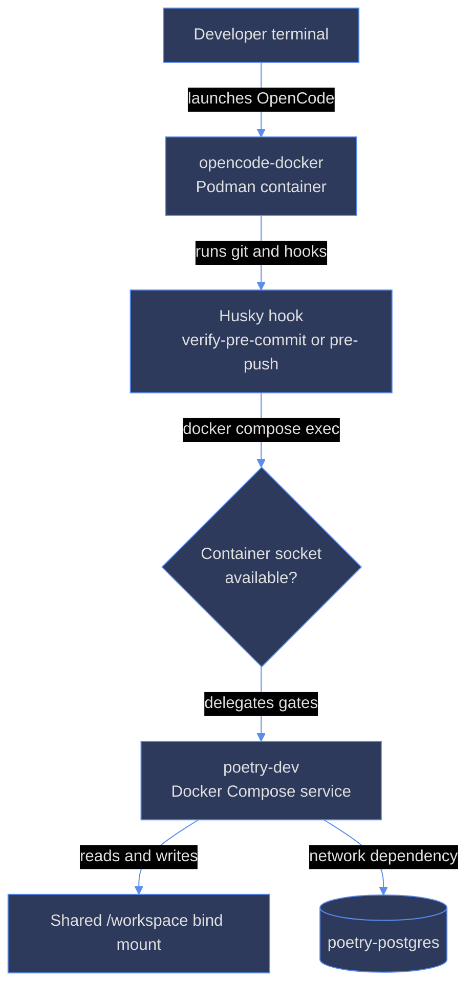

# ana024 - Two-container dev infrastructure friction analysis

## Executive finding

The split is operationally viable, but it makes the interactive OpenCode
container a privileged client of the separate dev workstation container. The
workspace is shared, while execution, tooling, credentials, labels, sockets,
and lifecycle are split. This creates a long dependency chain for a simple
commit: host -> opencode-docker -> host container socket -> poetry-dev ->
workspace. The strongest friction is not runtime latency; it is recovery and
configuration coordination when any link is stale or unavailable.

## Architecture and critical path



The hook is deliberately asymmetric: pre-commit hard-fails when `dev` is not
running (scripts/verify-pre-commit.sh:55-66), while pre-push warns and passes
when it is down (scripts/verify-pre-push.sh:76-84). That protects commits more
strongly, but makes the developer experience inconsistent.

## Ranked friction findings

### Critical - socket and security-label chain

The OpenCode container needs a Docker CLI, a discovered Podman or Docker
socket, the correct `DOCKER_HOST`, compatible compose project naming, and a
SELinux policy workaround. DIA-145 records the full saga: `:z` relabeling
changed the socket type but still denied `connectto`; `chcon` was policy-denied;
the accepted fix was `--security-opt=label=disable` and changing the shared
workspace from `:Z` to `:z` (DIA-145:74-82). The wrapper implements the socket
probe and warns without it (tools/opencode-docker/bin/opencode-docker:131-158),
then disables SELinux confinement (same file:205-225).

Impact: a missing socket makes OpenCode usable but makes the commit hook fail;
a bad `:Z` mount can lock poetry-dev out of the shared workspace. The socket
also grants container-management rights; rootless Podman limits that to the
user's containers, but rootful Docker would be host-root-equivalent
(DIA-145:46-46; tools/opencode-docker/bin/opencode-docker:137-143).

### High - hard dependency on a live, correctly named poetry-dev

From the OpenCode container, `verify-pre-commit.sh` calls `docker compose ps`
and `docker compose exec -T dev`; the latter runs `npx lint-staged` in
poetry-dev (scripts/verify-pre-commit.sh:28-41). Pre-push delegates six gates,
including `make test-config` and `make test-shell` (scripts/verify-pre-push.sh:
86-103). A stopped, unhealthy, or stale poetry-dev therefore blocks commits or
silently skips pushes. DIA-094 documents the real outcome: Docker Desktop WSL
integration was down, no socket existed, and a commit used `--no-verify`
(DIA-094:100-126). The hard-fail policy was retained by directive
(DIA-094:135-140).

The compose `name: poetry-platform` is itself a cross-container repair: without
it, compose sees `/workspace` inside the container and derives `workspace`, so
the inner `ps` cannot see the host-launched project (docker-compose.yml:20-26).

### High - duplicated images and version drift

The Docker CLI is intentionally installed in both images. DIA-152 exists because
poetry-dev needed client-only compose validation (DIA-152:39-59); DIA-145/164
exists because opencode-docker needed socket-backed delegation
(DIA-145:36-46). The current Dockerfiles pin Docker CLI 29.7.2 in both, but
package form and compose versions differ: poetry-dev uses apt with compose
5.4.0 (Dockerfile.dev:76-106), while opencode-docker uses static Docker CLI
29.7.2 and compose v2.39.1 (tools/opencode-docker/Dockerfile:179-220).
That is two independent supply-chain/build paths for one logical capability.

OpenCode itself also drifts: Dockerfile.dev is 1.18.18 (Dockerfile.dev:23-30),
while tools/opencode-docker/Dockerfile still defaults to 1.18.4
(tools/opencode-docker/Dockerfile:3-11). DIA-188 explicitly identified the
old dev image and missing declarations as a self-sufficiency problem
(DIA-188:70-105); its Phase 1 updates the project and dev image but leaves
restart verification pending (DIA-188:203-230). A rebuild of one image does
not update the other.

### High - SSH forwarding adds a second host-socket lifecycle

SSH push works only from opencode-docker, not poetry-dev. The wrapper probes
three host agent locations and mounts one socket read-only
(tools/opencode-docker/bin/opencode-docker:160-187). The agent must be running,
unlocked, and loaded; hardware-key and gnome-keyring failures are documented
(tools/opencode-docker/AGENTS.md, SSH agent section; DIA-173:40-76). A missing
agent is warn-and-continue at launch, but the eventual git failure occurs later
as `Permission denied (publickey)`. The read-only rootfs also requires a custom
`GIT_SSH_COMMAND` and temporary known_hosts path (wrapper:188-197).

### Medium - environment gaps are discovered at gate time

DIA-145/164 could verify the socket and pre-commit path, but explicitly could
not claim full in-container readiness: `make test-config && make test-shell`
exited 2 because rust-analyzer was 1.83.0 instead of 1.97.1 and the global
skills directory was absent under `/home/dev` (DIA-145:100-108). This is a
particularly costly split defect: the image reports success for some checks,
the hook executes in another container, and only the delegated full gate
reveals the gap.

### Medium - resource and lifecycle overhead

The OpenCode container reserves 4 GB memory, 4 CPUs, and 1 GB shared memory
(tools/opencode-docker/bin/opencode-docker:65-67,205-214). It also carries a
second Node/Python/OpenCode/toolchain image and persistent state mounts, while
poetry-dev carries the full browser, Rust, Python, and JS workstation
(Dockerfile.dev:1-17; docs/docker-dev.md:80-91). The dev stack adds PostgreSQL
as another process boundary (docker-compose.yml:28-76,80-103). The overhead is
acceptable for isolation, but cold rebuilds, relaunches, and duplicated caches
consume disk, memory, and operator time.

### Low - ephemeral configuration and ownership repair

DIA-185 found container git ownership failures in temp HOME test cases; the
runtime `/etc/gitconfig` repair disappeared on recreation (DIA-185:43-64,
68-82). The durable system-level bake fixed it (DIA-185:88-108), but it
illustrates the general rule: state changed with `docker exec` is not a fix
unless it is also reflected in the image. Image rebuild plus container recreate
is therefore part of recovery, not an optional cleanup step.

## Burden quantification

### Ticket count

Within the requested evidence set there are 8 tickets. Seven are directly
container or image/split related: DIA-094, DIA-145, DIA-152, DIA-164, DIA-173,
DIA-185, and DIA-188. DIA-164 is a superseded duplicate of DIA-145, so these
represent 6 unique incident threads. DIA-200 is adjacent rather than directly
container-specific: it records that SSH/known_hosts work became smooth after
DIA-153/DIA-173 (DIA-200:42-66).

This is a conservative count of the supplied set, not a claim that the entire
ticket ledger contains only seven container-related tickets. DIA-094, DIA-145,
DIA-152, and DIA-173 alone show four separate operational seams: availability,
socket access, client installation, and SSH transport.

### Configuration surfaces

There are 3 primary OpenCode configuration surfaces for the split:

1. `.opencode/opencode.jsonc` (project config; plugin array at
   .opencode/opencode.jsonc:584-599).
2. `tools/opencode-docker/config/opencode.json` (runtime config;
   tools/opencode-docker/config/opencode.json:24-29).
3. `Dockerfile.dev` baked OpenCode/plugin versions and cache
   (Dockerfile.dev:23-30,324-340).

The project also has `.opencode/tui.json`, and the second image has its own
Dockerfile and wrapper. Counting all version/config loci rather than only the
three named by the task gives at least 6 maintained loci: the three above,
`.opencode/tui.json`, `tools/opencode-docker/Dockerfile`, and
`tools/opencode-docker/bin/opencode-docker`. DIA-188's scope confirms the
cross-file synchronization requirement (DIA-188:94-105).

### Maintenance cost estimate

Estimated incremental cost attributable to the split, per ticket:

| Work type | Typical effort | Why the split adds it |
|---|---:|---|
| Simple documentation or pin change | 0.5-1.5 h | Check both images and both launch modes |
| Image/tooling change | 2-4 h | Edit two Dockerfiles, rebuild, recreate, verify |
| Hook/socket/SELinux change | 4-8 h | Reproduce host plus nested container path and labels |
| Cross-container gate failure | 2-6 h | Diagnose which layer failed, then rerun delegated gates |
| Recovery after stale/down image | 0.5-2 h | Bring up, rebuild, relaunch OpenCode, resume session |

Across the 6 unique direct incident threads in the supplied set, a reasonable
blended estimate is 3-5 engineer-hours per ticket, or roughly 18-30 hours of
split-specific maintenance. DIA-145 is near the high end because it required
socket discovery, compose naming, SELinux diagnosis, rebuild, relaunch, and
workspace-label restoration; DIA-185 is near the low end because it was one
image-level persistence defect. These are engineering-time estimates, not
measured issue logs.

## Failure modes and recovery cost

| Failure | Immediate symptom | Recovery | Cost |
|---|---|---|---|
| poetry-dev down | pre-commit exits 1; pre-push warns and passes | `make up`, health check, rerun | Medium |
| host Docker/Podman unavailable | wrapper cannot mount socket; inner hooks fail | start daemon/socket, relaunch OpenCode | Medium |
| socket stale or wrong UID | `docker compose` permission/API errors | restart user Podman/socket, relaunch | Medium-High |
| SELinux label mismatch | permission denied or poetry-dev cannot read workspace | restore shared label, use accepted label policy, relaunch | High |
| image rebuilt but not recreated | old versions/config remain live | `docker compose up -d` / recreate and verify | Medium |
| OpenCode image stale | version/plugin mismatch or missing OMO | rebuild opencode-docker, relaunch, resume handoff | Medium-High |
| SSH agent absent/unloaded | later git push fails publickey | start/unlock agent, load key, relaunch | Low-Medium |
| delegated environment gap | test-config/test-shell fails only in poetry-dev | align image contents and rebuild | Medium-High |

The key recovery multiplier is relaunch: the wrapper documentation states that
a rebuild is required and the current OpenCode session ends on relaunch
(tools/opencode-docker/README.md:98-104). Thus a fix can require both ordinary
container recovery and session resumption.

## Operational conclusion

The two-container split buys isolation and a hardened OpenCode runtime, but it
is not a transparent workstation boundary. It should be treated as a coupled
release unit: pin versions together, validate both configs, rebuild both images
when shared tooling changes, and make the socket/SELinux/SSH pre-flight visible
before starting a coding session. The highest-value simplification would be to
reduce duplicate toolchain ownership; until that is acceptable, a single
cross-image verification command is the minimum compensating control.

## Terminal summary visualization

```text
Direct unique incident threads in requested set
DIA-094  ####  availability and hard-fail hook
DIA-145  ####  socket and SELinux
DIA-152  ###   Docker CLI in poetry-dev
DIA-173  ###   SSH agent forwarding
DIA-185  ##    image-persistent git config
DIA-188  ####  config and OpenCode version drift
```

```text
How to read this chart
Title: Relative split-specific investigation burden
X-axis: # symbols, qualitative effort only
Y-axis: Requested ticket thread
Legend: Each # is one relative burden unit
How to read: DIA-145 and DIA-188 span the most independent surfaces.
The chart is directional, not logged engineer-hours.
```
