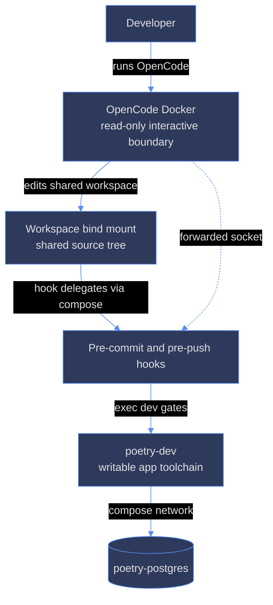

# ana025 - Container consolidation options

## Decision summary

The two containers are not currently redundant in role. `poetry-dev` is a
writable, compose-managed application workstation attached to PostgreSQL.
`opencode-docker` is a disposable, read-only, keep-id interactive security
boundary with SSH-agent and host-container-socket forwarding. The best near-term
decision is **Variant C: keep both runtime roles, but remove duplicated
configuration and toolchain surfaces**.

This is not a recommendation to preserve accidental duplication. It is a
recommendation to consolidate the contract, not the security and lifecycle
boundaries. A one-container design is feasible, but it changes the security
model, compose topology, hook execution model, and writable-volume model at the
same time.

## Evidence and constraints

| Evidence | Decision implication |
| --- | --- |
| `docs/docker-dev.md:3-5,80-95`, `docker-compose.yml:28-78` | `poetry-dev` is deliberately the writable workstation and is on `poetry-net` with `poetry-postgres`. |
| `Dockerfile.dev:15-17`, `docker-compose.yml:44-50` | App development needs writes for dependencies, WASM, caches, and dev servers; `node_modules` is a named volume. |
| `tools/opencode-docker/Dockerfile:129-177`, `bin/opencode-docker:205-226` | OpenCode Docker is deliberately read-only, capability-dropped, resource-limited, keep-id, and writable only through selected mounts. |
| `bin/opencode-docker:131-158`, DIA-145/DIA-164 | Hook delegation requires a Docker/Podman socket and accepted SELinux `label=disable` tradeoff. The socket is a material host-container privilege. |
| `bin/opencode-docker:160-197`, DIA-173 | SSH agent forwarding is intentionally isolated to OpenCode Docker; keys never enter the container. |
| `scripts/verify-pre-commit.sh:24-40`, `scripts/verify-pre-push.sh:36-62` | Hooks identify `poetry-dev` by hostname and delegate from the host or OpenCode Docker into the dev service. A merge must rewrite this seam, not just Dockerfiles. |
| DIA-152 | Docker CLI/Compose was added to `poetry-dev` for client-side `make test-config`; this is a real duplicate, but it does not require a daemon or socket. |
| DIA-188 | OpenCode/OMO versions and project-level declarations are already being made self-sufficient; this is the natural source-of-truth consolidation seam. |
| DIA-185 | Container-specific git behavior has required durable image-level handling. A merge changes ownership, HOME, and safe-directory assumptions. |
| `architecture.md` and `.sdd/dev-infra/architecture.md` | The governing architecture favors explicit seams and physical isolation; no current SDD authorizes collapsing these boundaries. |

## Current flow

## EBDV variants

### Variant 0 - status quo: keep two containers

**Change description:** No topology change. Continue using `opencode-docker`
for interactive OpenCode and `poetry-dev` for app development and delegated
hooks. Maintain the current project name, shared `:z` workspace, and Postgres
network.

**Pros:** Lowest risk; existing hook behavior is verified (DIA-145/DIA-164).
The read-only OpenCode boundary and SSH-agent model remain intact (DIA-173).
Postgres reachability and the named `pnpm_store` volume are unchanged. Rollback
is immediate because there is nothing to migrate.

**Cons:** Two image builds and two maintenance surfaces. Docker CLI/Compose and
some Node/Python/browser tooling are duplicated. `Dockerfile.dev` has OpenCode
1.18.18 while `tools/opencode-docker/Dockerfile` still declares 1.18.4 at line
6, an observed version-drift hazard. There are two config locations even though
DIA-188 is reducing their semantic difference.

**Effort:** 0-2 days for documentation and pin checks; ongoing maintenance
cost remains.

**Risks:** Drift is the primary risk. No new hook, secret, SELinux, volume, or
Postgres migration risk.

**Routing flag:** `dev-infra`. No section-10 policy change is required unless
OpenCode configuration ownership is changed.

### Variant A - merge into OpenCode Docker

**Change description:** Retire `poetry-dev`. Turn the OpenCode Docker image and
wrapper into the sole workstation: add the full Node/Python/uv/Rust/mise,
Playwright/crawl4ai, make, lint, test, and app-server toolchain; make the
container a compose service on `poetry-net`; mount secrets; expose app ports;
provide writable dependency/cache volumes; and run hooks locally in that same
container rather than delegating to `dev`.

**Pros:** One image, one interactive environment, one OpenCode runtime, and no
cross-container hook delegation. It removes the current `poetry-dev` hostname
seam and can eliminate the duplicate Docker client in the app image. App and
OpenCode see identical versions and HOME/config state.

**Cons:** This is not a simple merge. The target must give up the current
read-only rootfs or add many writable mounts, and it combines a high-value
host-container socket with the complete build toolchain. `bin/opencode-docker`
currently assumes a disposable `/app` plus `/workspace`, while the app needs
the compose-managed volumes at `/home/dev` and `/workspace/node_modules`.
The wrapper's SSH and socket mounts, `--security-opt label=disable`, and
workspace `:z` behavior must be reconciled with compose SELinux labels. The
service must join `poetry-net` to reach `postgres:5432`; merely running the
current wrapper cannot reach the compose service by its current network model.

Hooks need a new execution contract: `is_in_dev_container` and
`docker compose exec -T dev` become wrong, and pre-commit must avoid recursive
container invocation. Secrets move from two file-loading conventions into one.
The current `pnpm_store` volume and node_modules behavior must be preserved or
dependency installs become slow and host-dirty. Failure of the single
container now disables both OpenCode and app development.

**Effort:** 8-15 engineering days, including an OpenSpec/design update,
prototype image, hook rewrite, SELinux testing, volume migration, and full
rebuild/restart verification. This estimate excludes unexpected browser or
Rust image-size work.

**Risks:** High. Main risks are hook recursion, secrets exposure, SELinux
relabeling, socket privilege amplification, lost `node_modules` state, and
Postgres network reachability. The rollback plan must keep the old compose
service and image usable until acceptance is complete.

**Routing flag:** `dev-infra` plus `section-10: yes` if the change modifies
`.opencode/*`, agent/config policy, or the OpenCode trust boundary. This should
be treated as a cross-boundary, hard-to-reverse design decision.

### Variant B - merge into poetry-dev

**Change description:** Retire the OpenCode Docker wrapper and run OpenCode
inside `poetry-dev` through `make opencode`. Move its interactive persistence,
OpenCode config, secrets, SSH-agent access, and (if hooks still need it) the
host container socket into the compose service.

**Pros:** Lowest implementation complexity of the two one-container choices.
The app toolchain, Postgres network, `pnpm_store`, and hook target already live
there. `Makefile:46-47` already exposes the intended command. It avoids adding
the heavy app toolchain to the smaller OpenCode image and removes the
`docker compose exec dev` delegation hop.

**Cons:** It weakens the security posture of `poetry-dev`: the current service
is writable, runs as `0:0` in compose (`docker-compose.yml:29-31`), and is not
the read-only keep-id boundary used for interactive OpenCode. Adding the host
socket and SSH-agent to it gives the app workstation both container-management
and git-signing capabilities. OpenCode sessions and caches need a stable
interactive HOME without corrupting `/home/dev` or root-owned files. The
current entrypoint loads project secrets into the environment, while the
OpenCode wrapper mounts its own secret tree; these semantics must be made
consistent. The service already exposes broad app tooling and ports, so a
compromise has a larger blast radius.

**Effort:** 5-10 engineering days. Most work is compose security/user changes,
SSH/socket forwarding, persistence layout, config migration, and hook
recursion tests.

**Risks:** Medium-high. Highest are root/user ownership regressions, SSH agent
and socket exposure, secret lifetime in an interactive shell, SELinux labels,
and loss of the current disposable-session isolation. Postgres and
`node_modules` are comparatively low risk because their existing compose
paths remain.

**Routing flag:** `dev-infra` plus `section-10: yes` because OpenCode's runtime
trust boundary and config ownership change. Requires an explicit security and
rollback decision before implementation.

### Variant C - hybrid split with one source of truth

**Change description:** Keep `opencode-docker` as the interactive security
boundary and `poetry-dev` as the heavy, compose-managed app workstation. Remove
duplicate responsibilities: define versions and project plugin declarations
once, generate or validate the two image inputs from those pins, retain only
the Docker client in `poetry-dev` because `make test-config` needs it, and keep
socket/SSH forwarding only in OpenCode Docker. Make hooks use one explicit
delegation interface and document that OpenCode Docker is the caller and
`poetry-dev` is the gate executor.

**Pros:** Preserves the strongest properties of each container. OpenCode keeps
read-only rootfs, dropped capabilities, keep-id, SSH-agent-only key access, and
the already-verified socket workaround. App development keeps writable
volumes, Postgres network access, browser tooling, Rust builds, and stable
compose lifecycle. The duplicate config/version problem is addressed without
moving secrets or node_modules. Rollback is a pin/config revert, not a data
and network migration.

**Cons:** It does not reduce runtime container count. Image builds still exist,
and the shared workspace plus delegated hooks remain an operational seam. A
generated config or pin-sync mechanism needs maintenance and must not create a
second hidden source of truth. The Docker client remains in both images if
OpenCode Docker needs it for socket delegation, though its versions can be
validated from one pin.

**Effort:** 2-5 engineering days for a small, bounded pass; 5-8 days if the
team adds generated Dockerfile fragments and integration tests. DIA-188 already
provides much of the config ownership direction.

**Risks:** Low-medium. The main residual risks are hook contract drift,
workspace SELinux labeling, and version-generation mistakes. Existing risks
remain visible and independently testable. No new secret, Postgres, or
node_modules migration is needed.

**Routing flag:** `dev-infra`. `section-10: yes` only for edits to OpenCode
config/agent policy; the container and hook changes themselves remain ordinary
dev-infra work.

## Comparison

| Variant | Runtime containers | Effort | Security boundary | Hook risk | Migration/data risk | Recommendation |
| --- | ---: | --- | --- | --- | --- | --- |
| 0 status quo | 2 | 0-2 days | strongest existing | low | low | Abort/retain if no capacity |
| A OpenCode Docker only | 1 | 8-15 days | materially changed | high | high | Reject for now |
| B poetry-dev only | 1 | 5-10 days | materially weakened | medium-high | medium | Reject for now |
| C hybrid, deduplicated | 2 | 2-5 days | preserves both | low-medium | low | **Recommend** |

## Recommendation

Adopt **Variant C**. We do not need two copies of the toolchain contract, but we
do need two execution boundaries today because the workloads have incompatible
requirements: OpenCode Docker is intentionally disposable and hardened, while
`poetry-dev` is intentionally writable, volume-backed, and network-attached to
Postgres. Merging now would trade visible duplication for a larger, less
testable blast radius involving hooks, secrets, SELinux, SSH signing, and
dependency volumes. C captures most of the maintainability benefit with a
small reversible change and leaves a future one-container experiment possible
after measurements prove the security and lifecycle tradeoff is acceptable.

## Migration roadmap for Variant C

1. **Inventory and pin:** designate the project/config and `.mise.toml` pins as
   the source of truth; compare both Dockerfiles and both OpenCode config files.
   Extend `check-pin-sync.sh` rather than adding a new bespoke validator.
2. **Consolidate config:** finish DIA-188 restart verification, then remove
   accidental host-global dependence. Keep project `.opencode` declarations
   authoritative and make `tools/opencode-docker/config/opencode.json` a
   checked, derived-compatible consumer.
3. **Make the hook seam explicit:** add one small shared execution contract for
   `verify-pre-commit.sh` and `verify-pre-push.sh`; test host, OpenCode Docker,
   and poetry-dev contexts, including recursion and container-down behavior.
4. **Remove only safe duplication:** retain Docker CLI/Compose in both images
   where each gate genuinely needs it, but remove unused app packages from
   OpenCode Docker and unused OpenCode/OMO installation/config from poetry-dev
   only after runtime verification. Do not move SSH or host socket mounts into
   poetry-dev.
5. **Acceptance and rollback:** run `make test-config`, `make test-shell`,
   `make test-infra`, a real pre-commit and pre-push, `docker compose ps`,
   Postgres connectivity, a pnpm install using the named volume, browser smoke,
   and an SSH push from OpenCode Docker. Preserve the prior images and configs
   until all checks pass.

## Decision record

- Selected: Variant C - hybrid split with deduplicated contracts.
- Because: it removes the low-value duplication while preserving the
  intentionally different writable/networked app boundary and hardened
  interactive OpenCode boundary.
- Abort/status quo: Variant 0 remains the safe fallback if the pin/config and
  hook consolidation cannot be completed with passing evidence.
- Not selected: Variants A and B require security-boundary changes larger than
  the stated consolidation benefit and have no current architecture document
  authorizing them.
