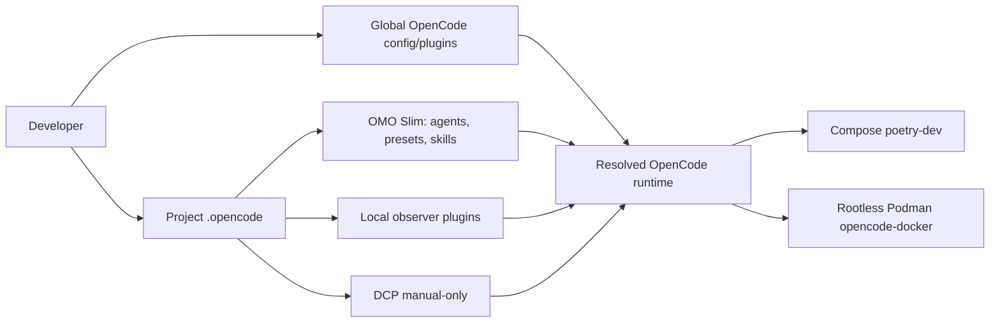
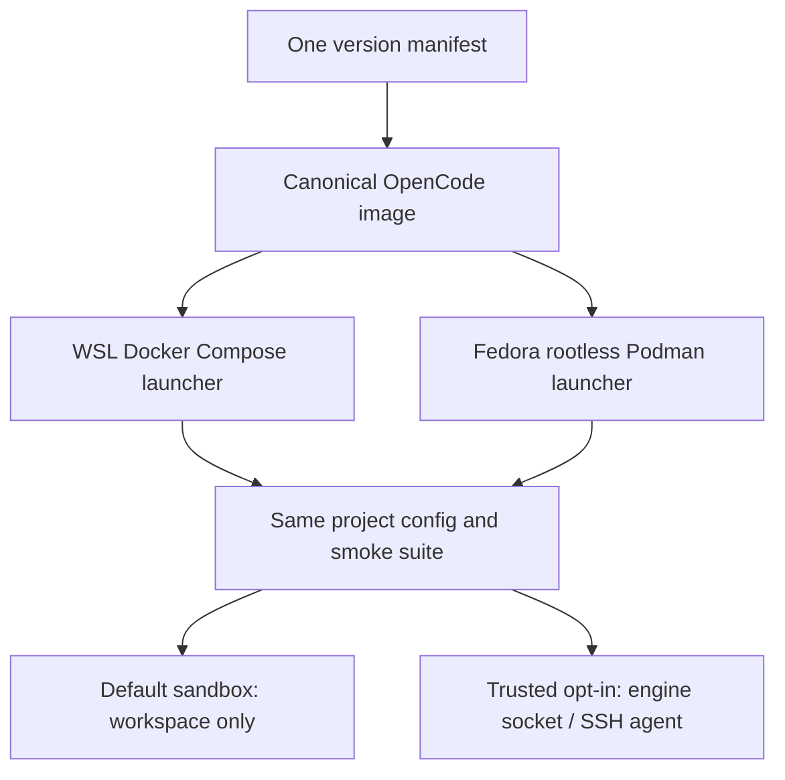

# Аудит OpenCode workflow та контейнерного середовища

<!-- ANALYZER-OUTPUT-CONTRACT
schema-version: 1.0
agent: analyzer
claim-type: finding
evidence-source: .opencode/opencode.jsonc; .opencode/oh-my-opencode-slim.jsonc; tools/opencode-docker/
confidence: High
shelf-registration: memory-shelf.yaml (shelf.analyses), delegated to @memory-manager
-->

Дата аудиту: 2026-08-19  
Статус: конструктивний технічний звіт, без змін конфігурації

## Висновок

Система вже сильна там, де правила механічно перевіряються: ticket gate,
контракти артефактів, permission tiers, validator-и конфігурації, тестування
shell-скриптів, handoff і session telemetry. Найбільша проблема не у відсутності
ще одного агента чи плагіна. Це надлишок шарів конфігурації та дублювання двох
runtime-образів, через який частина важливих правил або не виконується, або не
перевіряється в тому ж середовищі, де реально працює OpenCode.

Рекомендований напрямок: **один канонічний контейнерний runtime і один
канонічний project-config, але два thin launchers** (Docker Compose для WSL та
rootless Podman для Fedora). Не змушуйте всіх користуватися одним engine; уніфікуйте
образ, версії, конфігураційний контракт і перевірки.

Headroom зараз не варто вмикати і він не є заміною DCP. Власний spike DIA-183
виміряв руйнування cache-prefix у headroom 0.35.0 на вашому opencode-go proxy.
DCP уже безпечно переведений у manual-only режим, тому він майже не створює
витрат під час звичайних сесій. Спершу приберіть runtime-дублювання плагінів,
виправте не-hermetic gates і уніфікуйте образи; лише потім повторюйте benchmark
іншої версії Headroom.

## Межі та метод

Перевірено project config, OMO Slim presets, локальні agent/skill/command
інструкції, DCP, observer plugins, Docker Compose runtime, `tools/opencode-docker`,
Dockerfiles, Makefile, статичні validator-и, ticket/learnings/memory evidence та
поточну документацію OpenCode, Docker, Podman і Headroom. Не аналізувалися
`node_modules`, старі `.worktrees` та секрети.

Команди дали такі факти:

| Перевірка | Результат |
|---|---|
| 14 окремих config/contract validators | PASS |
| `scripts/check-opencode-docker.sh` | PASS |
| `scripts/check-pin-sync.sh` | PASS, Node 24.18.0 і pnpm 10.33.0 узгоджені |
| `node scripts/__tests__/batch-d-infra.test.mjs` | PASS, 56 tests |
| `make test-config` | FAIL: дубль local/global skill `simplify` |
| `make test-shell` | FAIL: host не має pinned `rust-analyzer`; ще 3 LSP відсутні як WARN |
| `opencode debug config` | показує дубльовані observer plugins і змішані global/project plugin sources |

## Карта фактичної системи

Головний ризик цієї карти - декілька джерел істини зливаються в один runtime.
OpenCode прямо зазначає, що config файли **merge**, а не замінюють один одного;
project config, `.opencode` directory і custom/global config мають різний порядок
пріоритету. [OpenCode Config](https://dev.opencode.ai/docs/config)

## Що вже зроблено добре

1. **Контрольні шви глибокі.** `delegation-observer` концентрує ticket linkage,
   lifecycle, handoff, A1 batch diagnostics і format-on-edit в одному Module.
   Це дає хорошу locality: замість того, щоб розмазувати стан між agents.
2. **Найнебезпечніші дії обмежені.** Orchestrator не має bash/edit для коду;
   artifact producers мають path-scoped edit; reviewer/auditor read-only.
3. **Workflow має справжні, а не лише декларативні gate-и.** Валідація agent names,
   output contracts, handoff, ticket gate, memory shelf і changelog є ціннішою за
   ще більший prompt.
4. **Модельна стратегія раціональна.** Поточний `cebula` розділяє дешевий масовий
   Mimo V2.5, Qwen3.7 Plus для analysis/review/spec, Copilot для незалежності
   auditor/architect, а Kimi K3 і GPT-5.6 Luna лишає для виняткової ескалації.
   Це хороше використання Go та Copilot квот.
5. **DCP уже знешкоджений за замовчуванням.** `.opencode/dcp.jsonc` вимикає
   autonomous pruning, dedup/purge і model-driven compression. Це відповідає
   DIA-197 V2 і зберігає `/dcp` як manual escape hatch.

## Пріоритетні знахідки

| Пріоритет | Знахідка | Доказ | Рекомендована дія |
|---|---|---|---|
| P0 | Контейнер не є повною sandbox-межею, коли передано engine socket і SSH agent | `tools/opencode-docker/bin/opencode-docker` монтує Podman/Docker socket та SSH socket, вимикає SELinux label; Docker попереджає, що controller daemon може монтувати host filesystem | Зробити socket opt-in `--with-engine`; базовий режим без socket/SSH. Gate/commit запускати у окремому trusted режимі |
| P0 | Runtime дублює observer plugins | `opencode debug config` показує `delegation-observer.ts` і `needs-input-observer.ts` двічі; один resolved path містить `.opencode/.opencode/` | Залишити рівно один спосіб завантаження: directory auto-discovery **або** `plugin` array. Додати runtime smoke test на unique plugin origins |
| P1 | `make test-config` не відтворюваний з чистого host environment | `validate-skills.sh` падає на byte-identical global/project `simplify` | Визначити project skill canonical. Перевіряти лише project tree або запускати duplicate-policy у герметичному container, не проти персонального `$HOME` |
| P1 | `make test-shell` суперечить власній документації | LSP описані як optional для host editors, але target hard-fail через absent `rust-analyzer` | Розділити `test-shell` (hermetic scripts) і `check-host-editor`; не блокувати CI/інфра-тест необов'язковим editor tooling |
| P1 | Два образи мають різний runtime contract | `Dockerfile.dev` OpenCode 1.18.18, `tools/opencode-docker/Dockerfile` 1.18.4; набори plugins/config також відрізняються | Один base image/lock manifest і contract test, що порівнює OpenCode/OMO/plugin versions та resolved plugin set |
| P1 | Автоматична перевірка не виявляє runtime merge defects | Усі окремі validators PASS, але `debug config` виявив дублікати | Додати `make test-runtime-config`: `opencode debug config` у clean HOME, assert unique plugins, існуючі file URLs, очікуваний default agent/preset |
| P2 | Практично захищені рішення слабше за механічні gate-и | попередній ana015: лише 19.1% review dispatch мають pending-owner, architecture lane не викликався | Механізувати `pending-owner` для non-mechanical review findings та документувати reason для spec fast-path |
| P2 | Навчальні інструкції завеликі для always-loaded routing | AGENTS.md ~20 KB; `tdd-craftsman` 477 lines; `playwright-browser` 469 lines | Зберегти короткі `SKILL.md` як router, винести рідкісні правила у references, завантажувати прогресивно |
| P2 | OpenCode V2 documentation має іншу schema compaction | current runtime використовує 1.18 config `reserved`; V2 docs описують `keep.tokens` + `buffer` | Не мігрувати всліпу. Завести compatibility spike та upgrade matrix перед OpenCode V2 |
| P3 | Незакриті security TODO у portable runtime | `tools/opencode-docker/TODO.md`: selective secret env, custom seccomp/AppArmor, build secrets | Закрити після P0: мінімальна capability/mount matrix і тест, що секрет не потрапляє в process env без потреби |

### Чому P0 справді P0

Read-only rootfs, non-root user та dropped capabilities корисні, але daemon socket
є іншим seam: API виконується engine-ом на host. Docker документує, що користувач
з доступом до daemon може створити контейнер з монтуванням `/` host filesystem;
це треба розглядати як потужний host capability, а не як звичайний файл mount.
[Docker Engine security](https://docs.docker.com/engine/security/). Rootless Podman
зменшує blast radius до прав вашого host user, але не перетворює socket на
workspace-only permission. [Podman remote](https://docs.podman.io/en/latest/markdown/podman-remote.1.html)

Це не означає, що socket треба заборонити назавжди. Він потрібен для частини
pre-commit/Compose workflows. Правильний interface: default sandbox не має
socket/SSH-agent, а explicit trusted launcher додає саме ті capabilities, які
потрібні для commit/infra tasks.

## Моделі, reasoning і presets

### Оцінка поточного `cebula`

| Lane | Поточний вибір | Оцінка |
|---|---|---|
| Orchestrator | Mimo V2.5, high reasoning/thinking | Доречно: складна координація, але доступ до коду механічно відрізаний |
| Coder | Mimo V2.5, medium | Розумна ціна для bounded slices; підвищення reasoning робити лише за failure signal |
| Spec/analysis/review | Qwen3.7 Plus, high | Добре відповідає задачам синтезу, критики та long-form reasoning |
| Architect | Gemini 3.1 Pro -> fallback | Добре для незалежності, але lane треба реально активувати при architecture trigger |
| AI auditor | GPT-5.3 Codex -> Gemini fallback | Сильна незалежна вісь review; не витрачати на routine code review |
| Escalation | Kimi K3 / GPT-5.6 Luna | Правильно як quota-guarded, one-shot exception |
| Cheap lanes | Mimo low | Доречно для navigation, memory, research triage; якість треба вимірювати через eval-lite |

Не рекомендую зараз масово міняти моделі. Найбільший ROI дає не інша модель, а
чистий resolved config, менший prompt payload, benchmark routing на ваших 20
eval-lite tasks і вимірювання cache-hit/cost per lane. Для кожної зміни routing
порівнюйте success rate, retries, input/cached/output tokens, wall time та
кількість human interventions; не лише ціну одного request.

## DCP проти Headroom

### Поточний стан

- DCP 3.1.14 лишається завантаженим, але autonomous mutation вимкнений.
  DIA-197 записує, що DCP змінює outbound messages і сам проєкт виміряв
  приблизно 85% cache hit з DCP проти 90% без нього.
- Headroom був перевірений у DIA-183. Spike тричі зафіксував дрейф frozen prefix
  у cache mode на opencode-go proxy; passthrough був стабільним. Оцінка net cost
  була негативною через великий cache-miss multiplier.
- Поточний Headroom upstream уже рекламує `wrap opencode`, lossless retrieval і
  live-zone compression, але це vendor claim, не доказ сумісності з вашим
  gateway. [Headroom README](https://github.com/headroomlabs-ai/headroom)
- CacheAligner upstream тепер заявлений як detector-only, тобто не ремонтує
  prefix сам; він корисний лише як вимірювач після окремого compatibility test.
  [Cache optimization](https://github.com/headroomlabs-ai/headroom/blob/main/docs/content/docs/cache-optimization.mdx)

### Рішення

**Зараз: залишити DCP manual-only, Headroom OFF.** Не замінювати один plugin
іншим. Native OpenCode auto compaction + prune вже є вашим базовим механізмом;
офіційна документація підтверджує `auto`, `prune` і reserve semantics для поточної
лінійки config. [OpenCode compaction config](https://dev.opencode.ai/docs/config)

Повернутися до Headroom можна лише за всіма умовами:

1. нова версія має changelog/fix, релевантний саме replay/frozen-prefix defect;
2. isolated Docker/WSL test проходить мінімум 30 control/proxy turns;
3. hashes frozen prefix та provider cache metrics однакові на warm turns;
4. порівняння показує позитивний net cost **і** не гіршу task quality;
5. інтеграція не змінює production config до user-approved EBDV і ai-auditor.

DCP повністю прибирати доцільно лише після restart-verify DIA-197 та після того,
як ви вирішите, чи потрібен ручний `/dcp`. Його patch release 3.1.15 існує, але
оновлення не має сенсу без окремої перевірки changelog і regression benchmark.

## Чи потрібні два Docker-контейнери?

### Варіанти

| Варіант | Переваги | Недоліки | Рішення |
|---|---|---|---|
| A. Залишити два незалежні образи | Немає міграції зараз | Version/plugin/config drift вже виник; кожен fix треба дублювати | Не рекомендую |
| B. Один Docker-only runtime для всіх | Найменше drift, одна CI матриця | Примусити Fedora користуватись Docker, втратити ваш rootless Podman security/ergonomics | Не рекомендую |
| C. Один base image + один runtime contract, Docker Compose launcher для WSL і Podman launcher для Fedora | Одна supply chain, одна версія OpenCode/OMO/plugins, збережені platform-native engine та ізоляція | Потрібна контрольована міграція й contract tests | **Рекомендую** |
| D. Залишити WSL host OpenCode без контейнера | Найменший short-term friction для колеги | Не дає однакового toolchain/isolation, дрейф неминучий | Лише тимчасовий fallback |

Windows/WSL не є причиною уникати контейнера. Docker і Microsoft прямо
рекомендують Docker Desktop з WSL2 backend, а source tree варто зберігати у Linux
filesystem WSL (`~/projects`), не в `/mnt/c`, заради I/O та file-watch events.
[Docker WSL best practices](https://docs.docker.com/desktop/features/wsl/best-practices/),
[Microsoft Dev Containers on Windows](https://learn.microsoft.com/en-us/windows/dev-environment/docker/dev-containers).

### Цільова форма

Контейнери потрібні, але **не два незалежні implementation-и контейнера**. Залиште
`tools/opencode-docker` як Fedora launcher/security profile, а Compose як WSL
launcher/dev services. Винесіть з обох Dockerfiles спільний base або хоча б
один `versions.env`/lock manifest. Launcher-и мають відрізнятися тільки engine,
SELinux labels, uid mapping та mount syntax.

## План виправлень

### Фаза 1 - прибрати runtime ambiguity (P0/P1)

1. Створити DIA ticket на resolved-plugin uniqueness. Визначити один loader для
   `delegation-observer` і `needs-input-observer`; додати regression test через
   clean `HOME` + `opencode debug config`.
2. Розділити `test-shell` від host editor readiness. `check-host-editor` має
   лишитися explicit developer command; CI/config gate має бути hermetic.
3. Уточнити security profiles: normal (no daemon/SSH socket), commit/infra
   (explicit mounts), read-only audit. Документувати capability matrix.

### Фаза 2 - один контейнерний продукт (P1)

4. Специфікувати `runtime contract`: OpenCode, OMO, DCP, Ponytail, OpenSpec,
   Node/pnpm/bun/uv versions; expected plugins; enabled MCPs; smoke commands.
5. Побудувати base image один раз; Compose і Podman використовують той самий tag
   або digest. Підтримати Docker Desktop WSL2 та rootless Podman як два runners.
6. Додати CI matrix: `docker build/run` і `podman build/run` (якщо CI має
   підтримку), обидва виконують `opencode --version`, `debug config` і compact
   smoke suite.

### Фаза 3 - зменшити cognitive/context overhead (P2)

7. Скоротити always-loaded prompts. В AGENTS.md лишити незмінні hard rules,
   а деталі перенести до task-specific skills/references. Не дублювати long
   orchestrator prompt тричі між presets: генерація або checksum test.
8. Перетворити practice-protected review disposition та spec fast-path reason
   на машинно спостережувані поля в telemetry.
9. Перед major OpenCode update запускати compatibility matrix. V2 compaction
   schema не можна змішувати з 1.18 config без експерименту.

## Міра успіху через 30 днів

- `make test-config` і `make test-shell` green у чистому runner без персональних
  skills/LSP;
- `opencode debug config` має один origin на кожен observer plugin і жодного
  file URL з повторним `.opencode`;
- WSL і Fedora показують однакові OpenCode/OMO/plugin versions та smoke result;
- normal sandbox не має engine/SSH sockets;
- 95%+ non-mechanical review findings мають explicit owner disposition;
- dashboard показує cache-hit, token/cost і retry rate до/після змін;
- Headroom лишається off, поки compatibility benchmark не доведе протилежне.

## Обмеження

Звіт не є penetration test і не стверджує, що socket вже був експлуатований.
P0 - оцінка capability дизайну за фактичними mount options та офіційною моделлю
безпеки engine. Результати історичного workflow audit (ana015) використовуються
як індикатор, а не як повний журнал усіх розмов. До зміни `.opencode/*` слід
застосувати ваш section-2.5 workflow: ai-specialist research, user decision,
design, implementation, restart smoke test та ai-auditor review.
