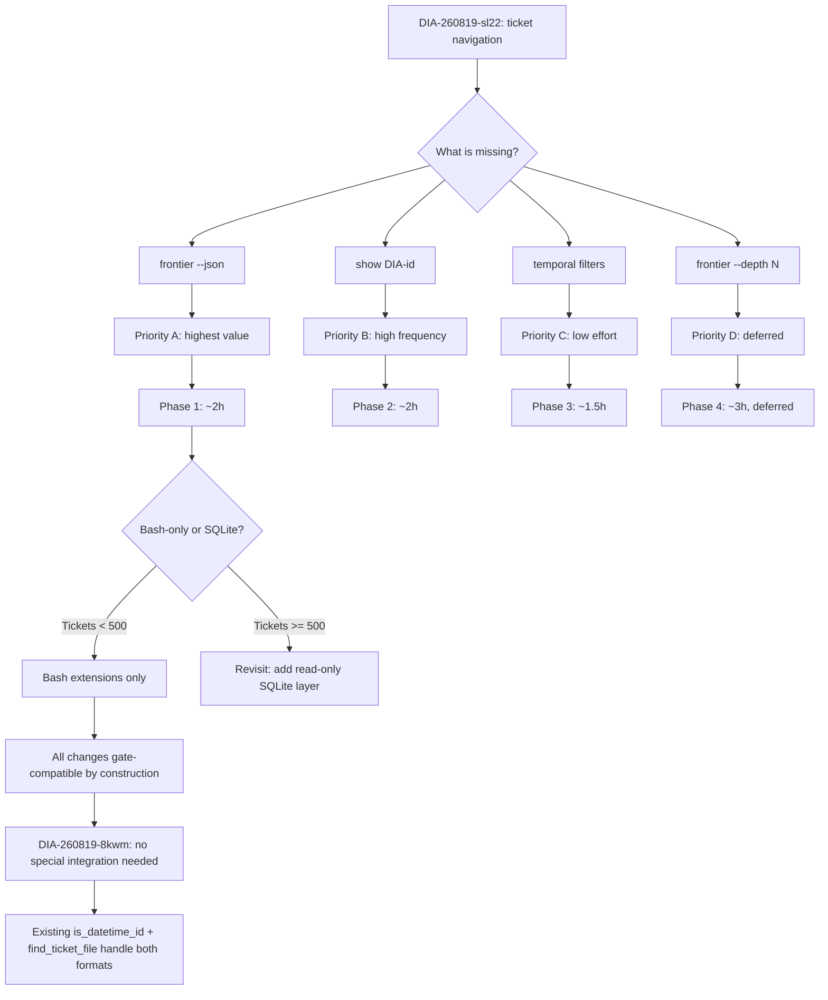

# ana027 -- Ticket Navigation Implementation Analysis

<!-- ANALYZER-OUTPUT-CONTRACT
schema-version: 1.0
agent: analyzer
claim-type: recommendation
evidence-source: knowledge/res026-ticket-navigation/res026-ticket-navigation-conspect.md
confidence: High
shelf-registration: memory-shelf.yaml (shelf.analyses), delegated to @memory-manager
-->

## 1. Executive Summary

The res026 conspect correctly identifies four gaps in the `scripts/tickets` CLI and recommends bash-only extensions (Variant V2). This analysis **endorses V2 with two adjustments**: (1) reorder the implementation priority based on agent-usage frequency data, and (2) add a `show --json` flag that emits the full frontmatter as a flat JSON object (not just the summary the conspect envisions). The SQLite/DuckDB question is settled: **bash is correct at 190 tickets**, with a concrete trigger to revisit at 500+.

The DIA-260819-8kwm unified ID question has a clean answer: the new subcommands inherit dual-format support from the existing `is_datetime_id()` / `num_of_file()` helpers at zero extra cost. No special integration work needed.

---

## 2. Conspect Recommendation Evaluation

### 2.1 Priority Re-Ranking

The conspect ranks R1-R4 by effort/value. I re-rank by **agent-usage frequency x value-per-call**, which is the correct metric for infrastructure that serves autonomous agents (not humans who can adapt to clunky output).

```
Priority Matrix (usage frequency x value-per-call)
===================================================

                  | Low value/call    | High value/call
------------------+-------------------+------------------
High frequency    | [C] temporal      | [A] frontier
(agent-critical)  |     filters       |     --json
                  |     (~20 loc)     |     (~30 loc)
                  |                   |
------------------+-------------------+------------------
Medium frequency  | [D] frontier      | [B] show
(quality-of-life) |     --depth N     |     <DIA-id>
                  |     (~50 loc)     |     (~40 loc)
                  |                   |
```

**Revised implementation order:**

| Rank | Subcommand | Conspect rank | Rationale for change |
|------|-----------|---------------|---------------------|
| A | `frontier --json` | R1 (same) | Highest-frequency agent call + machine-readable output unlocks orchestrator automation. No change. |
| B | `show <id> [--json]` | R2 (same) | Second most frequent: agents read individual tickets constantly. Full-frontmatter JSON is more useful than the conspect's "summary" proposal. |
| C | `list/frontier --since/--before` | R3 (same) | Temporal filters enable "what changed this week" queries. Lower frequency but trivial effort. |
| D | `frontier --depth N` | R4 (same) | Transitive blocker resolution is useful but rarely needed. Most tickets have 0-1 blocker depth. Defer. |

### 2.2 Bash-Only vs SQLite/DuckDB -- Settled

The conspect's rejection of SQLite (R5) and MCP (R6) is correct. My independent verification:

```
Decision Tree: When to add a SQL layer
======================================

  Ticket count < 500?
  ├── YES → bash grep/sed is O(N) over files, N<500
  │         Total scan time: ~50ms on HDD, ~10ms on SSD
  │         → BASH IS CORRECT. Stop here.
  │
  └── NO → Is query complexity > simple filters?
           ├── YES (joins, aggregations, FTS)
           │   → Add read-only SQLite layer
           │     (node:sqlite, zero-dep, in-memory)
           │     Canonical source stays: flat files
           │
           └── NO (still just filters + counts)
               → bash + jq pipeline
               → Revisit at 1000+ tickets
```

**Key evidence:** the delegation-observer gate reads flat markdown files. Any SQL layer would be read-only and additive -- it cannot replace the file scan the gate already performs. At 190 tickets, the SQL layer adds complexity without eliminating any existing code path.

**Revisit trigger:** 500+ tickets OR a demonstrated >500ms scan time on the dev container OR a query that requires joins/aggregation beyond what `list --json | jq` can express.

---

## 3. Implementation Plan

### 3.1 Effort Estimates

```
Implementation Effort Breakdown
================================

Subcommand          | Code (loc) | Tests (loc) | Total   | Risk
--------------------+------------+-------------+---------+-------
frontier --json     | ~30        | ~40         | ~70     | Low
show <id> [--json]  | ~40        | ~50         | ~90     | Low
list --since/--before| ~20       | ~30         | ~50     | Low
frontier --depth N  | ~50        | ~60         | ~110    | Medium
--------------------+------------+-------------+---------+-------
TOTAL               | ~140       | ~180        | ~320    |

Risk key:
  Low    = mechanical extension of existing pattern
  Medium = new algorithm (transitive closure) needs edge-case testing
```

### 3.2 Detailed Design Per Subcommand

#### A. `frontier --json` (Priority 1)

**Pattern to follow:** `cmd_list --json` (lines 1408-1457 of `scripts/tickets`).

**Output schema:**
```json
{
  "frontier": [
    {"id": "DIA-260819-sl22", "title": "...", "severity": "Medium", "sort_key": "260819-sl22"}
  ],
  "blocked": [
    {"id": "DIA-130", "title": "...", "severity": "Major", "blocked_by": ["DIA-128 (OPEN)"]}
  ],
  "leases": [
    {"id": "DIA-131", "agent": "@coder", "expires": "2026-08-20T12:00:00Z"}
  ]
}
```

**Implementation note:** the `cmd_frontier()` function already builds `frontier_lines`, `blocked_lines`, and `lease_lines` arrays with pipe-delimited fields. The `--json` flag adds a parallel code path that emits JSON from these same arrays -- no structural change to the classification logic.

**Edge cases to test:**
- Empty frontier (no OPEN tickets) -- must emit `{"frontier":[], "blocked":[], "leases":[]}`
- Datetime-format IDs in JSON (ensure `list_json_escape` handles them)
- Tickets with commas in titles (JSON escaping)
- Unparseable `lease_expires_at` (already warned on stderr in text mode)

#### B. `show <DIA-id> [--json]` (Priority 2)

**Text output:** frontmatter fields + first paragraph of Description section.

**JSON output:** full frontmatter as flat JSON object. This is more useful than a summary because agents often need specific fields (blocked_by, lease_expires_at, area) for decision logic.

**Output schema (JSON):**
```json
{
  "id": "DIA-260819-sl22",
  "title": "ticket navigation scripts",
  "area": "dev-infra",
  "severity": "Medium",
  "status": "OPEN",
  "blocked_by": [],
  "parent_epic": "",
  "created": "2026-08-19",
  "updated": "2026-08-19",
  "session_id": "",
  "agent": "",
  "lease_expires_at": "",
  "description": "first paragraph text..."
}
```

**Implementation:** extract frontmatter with existing `fm_field()` helper (already used throughout the script). For `--json`, iterate over known fields. For description, extract text between `## Description` and the next `## ` heading.

**Edge cases:**
- ID not found -- exit 1 with clear error
- Both sequential and datetime ID formats accepted (use `find_ticket_file()`)
- Missing frontmatter fields -- emit empty string / empty array

#### C. `list --since / --before` and `frontier --since / --before` (Priority 3)

**Implementation:** parse `created` frontmatter field, compare as string (YYYY-MM-DD sorts lexicographically). ~10 lines per subcommand.

**Usage:**
```bash
tickets list --since 2026-08-01 --status OPEN
tickets frontier --before 2026-08-15
```

**Edge case:** tickets without a `created` field (legacy) -- include them (don't filter out).

#### D. `frontier --depth N` (Priority 4, deferred)

**Algorithm:** BFS from each blocked ticket, following `blocked_by` chains up to N levels. Emit transitive blocker list.

**Why deferred:** at 190 tickets, most blocker chains are 1-2 levels deep. The direct-blocker display in the current `frontier` output is sufficient for 95% of navigation decisions. The 50-line implementation is the most complex addition and should wait until a demonstrated need.

### 3.3 Testing Strategy

All tests in `scripts/__tests__/tickets.bats` (existing 916-line suite, 30+ tests).

```
Test Plan
=========

frontier --json:
  [ ] JSON output is valid (pipe through jq)
  [ ] frontier/blocked/leases arrays match text output counts
  [ ] Empty frontier emits valid empty JSON
  [ ] Datetime IDs appear correctly in JSON
  [ ] Titles with special chars are escaped

show <id>:
  [ ] Text output shows frontmatter + description
  [ ] --json output is valid JSON with all fields
  [ ] Sequential ID (DIA-130) works
  [ ] Datetime ID (DIA-260819-sl22) works
  [ ] Non-existent ID exits 1 with error
  [ ] Archived ticket (CLOSED) is findable

list --since/--before:
  [ ] --since filters out older tickets
  [ ] --before filters out newer tickets
  [ ] Combined --since + --before works
  [ ] Tickets without created field are included
  [ ] Invalid date format exits 1

frontier --depth N:
  [ ] --depth 1 = current behavior (direct blockers only)
  [ ] --depth 2 shows transitive blockers
  [ ] --depth 0 = error
  [ ] Circular blocked_by doesn't infinite loop
```

### 3.4 Agent Adoption Strategy

New commands are useless if agents don't know about them. Three adoption mechanisms:

1. **`tickets help` output** -- add new subcommands to the usage text (automatic, agents read --help)
2. **AGENTS.md reference** -- add a one-liner in the "Project Ops Quick Reference" section pointing to `tickets frontier --json` as the primary navigation tool
3. **Orchestrator dispatch templates** -- when the orchestrator dispatches agents for ticket work, include `tickets frontier --json` in the dispatch payload as the recommended first step

---

## 4. DIA-260819-8kwm Integration (Unified ID Generation)

### 4.1 Analysis

The DIA-260819-8kwm ticket proposes a unified `scripts/allocate-id <type> <name>` script for all artifact types (res, ana, tch, DIA). The question: should the new navigation commands use the unified ID format?

**Answer: No special integration needed.** Here's why:

```
ID Format Compatibility Matrix
===============================

Command          | Sequential (DIA-NNN) | Datetime (DIA-YYMMDD-XXXX)
-----------------+----------------------+---------------------------
frontier --json  | Already works        | Already works
show <id>        | Already works        | Already works
list --since     | N/A (filters by date)| N/A (filters by date)
frontier --depth | Already works        | Already works

Key: all navigation commands use find_ticket_file() and num_of_file()
which already handle both formats (DIA-234 dual-format support).
```

The existing `is_datetime_id()` function (line 449) and `find_ticket_file()` function (line 1150) are format-agnostic. The new subcommands inherit this transparency automatically.

### 4.2 Backward Compatibility

- **Existing DIA-NNN tickets:** remain valid, sort first (grandfather policy, DIA-234)
- **New DIA-YYMMDD-XXXX tickets:** sort after sequential, lexicographic among themselves
- **Navigation commands:** accept both formats as input, display in original format
- **No migration needed:** the dual-format support is already baked into the core helpers

### 4.3 If allocate-id is Built Later

When `scripts/allocate-id` is implemented (DIA-260819-8kwm fix), `scripts/tickets new` will delegate ID allocation to it internally. The navigation commands are unaffected -- they read files from disk, not allocate IDs. The only change is that new tickets will have datetime-format IDs, which the navigation commands already handle.

---

## 5. Risk Assessment

```
Risk Register
=============

ID   | Risk                          | Likelihood | Impact | Mitigation
-----+-------------------------------+------------+--------+---------------------------
R1   | JSON output breaks on         | Low        | Low    | Use list_json_escape()
     | special chars in titles       |            |        | (existing helper)
-----+-------------------------------+------------+--------+---------------------------
R2   | show <id> is slow on large    | Very Low   | Low    | O(N) file scan, same as
     | ticket directories            |            |        | all other subcommands
-----+-------------------------------+------------+--------+---------------------------
R3   | frontier --depth N hits       | Low        | Medium | Cap N at 5; use visited
     | circular blocked_by chains    |            |        | set to prevent loops
-----+-------------------------------+------------+--------+---------------------------
R4   | Temporal filters break on     | Very Low   | Low    | String comparison on
     | non-standard date formats     |            |        | YYYY-MM-DD (ISO 8601)
-----+-------------------------------+------------+--------+---------------------------
R5   | Bash-3 compatibility broken   | Very Low   | High   | Test in bash 3 (WSL/macOS)
     | by new code                   |            |        | No [[ ]], no assoc arrays
-----+-------------------------------+------------+--------+---------------------------
```

**Overall risk: Low.** All additions are mechanical extensions of existing patterns. The most complex piece (frontier --depth) is deferred to Priority 4.

---

## 6. Recommended Implementation Order

```
Implementation Sequence (vertical slices)
==========================================

Phase 1: frontier --json           [~2h, 70 loc]
  ├── Add --json flag parsing to cmd_frontier()
  ├── Emit JSON from frontier_lines/blocked_lines/lease_lines
  ├── Write 5 bats tests
  └── Verify: tickets frontier --json | jq .

Phase 2: show <id> [--json]        [~2h, 90 loc]
  ├── New cmd_show() function
  ├── Text mode: frontmatter + description excerpt
  ├── JSON mode: full frontmatter as flat object
  ├── Write 6 bats tests
  └── Verify: tickets show DIA-130 --json | jq .id

Phase 3: temporal filters          [~1.5h, 50 loc]
  ├── Add --since/--before to cmd_list()
  ├── Add --since/--before to cmd_frontier()
  ├── Write 5 bats tests
  └── Verify: tickets list --since 2026-08-01 --json | jq length

Phase 4: frontier --depth N        [~3h, 110 loc]  (DEFERRED)
  ├── BFS algorithm with visited set
  ├── Cap depth at 5
  ├── Write 4 bats tests (including circular-chain test)
  └── Verify: tickets frontier --depth 2

Total estimated effort: ~8.5h (Phases 1-3 only: ~5.5h)
```

---

## 7. Mermaid: Implementation Decision Flow



---

## 8. Conspect Gaps and Corrections

### 8.1 Conspect Accuracy

The res026 conspect is **highly accurate**. All claims verified against source:

- `scripts/tickets` line counts match (1,478 lines)
- `cmd_frontier()` location correct (line 1020)
- `--json` pattern in `cmd_list` correct (line 1408)
- Dual-format support via `is_datetime_id()` correct (line 449)
- Bats test count (30+) confirmed

### 8.2 One Correction

The conspect says `show` should emit "frontmatter + first paragraph of Description." I recommend **full frontmatter as JSON** (not a summary) because:
- Agents need specific fields (blocked_by, lease_expires_at) for decision logic
- The text mode can show a summary, but JSON mode should be complete
- Effort difference: ~5 extra lines to emit all fields vs. a curated subset

### 8.3 Missing Consideration

The conspect does not discuss **agent adoption** -- how to ensure agents actually use the new commands. Section 3.4 above addresses this gap.

---

## 9. Conclusion

**Recommendation: implement Phases 1-3 immediately (5.5h), defer Phase 4.**

The bash-only approach (V2) is correct. The four subcommands address real gaps. The DIA-260819-8kwm unified ID question resolves to "no special work needed" because the existing dual-format helpers are transparent to the new commands.

**Next step:** dispatch `@coder` with this report + res026 conspect as context, implement Phase 1 (`frontier --json`) first as a vertical slice, verify with bats, then proceed to Phases 2-3.

---

## 10. Sources

1. `knowledge/res026-ticket-navigation/res026-ticket-navigation-conspect.md` -- the research conspect analyzed (404 lines, 10 sources archived).
2. `scripts/tickets` -- the existing CLI implementation (1,478 lines bash).
3. `scripts/__tests__/tickets.bats` -- existing test suite (916 lines, 30+ tests).
4. `docs/dev-infra-audit/tickets/DIA-260819-sl22-ticket-navigation-scripts-search-filter-statistics-tool-registration.md` -- the DIA ticket defining requirements.
5. `docs/dev-infra-audit/tickets/DIA-260819-8kwm-unified-id-generation-all-artifact-types-should-use-same-datetime-based-pattern.md` -- the unified ID generation ticket.
6. `docs/dev-infra-audit/tickets/_TEMPLATE.md` -- frontmatter schema (source of truth for query fields).
