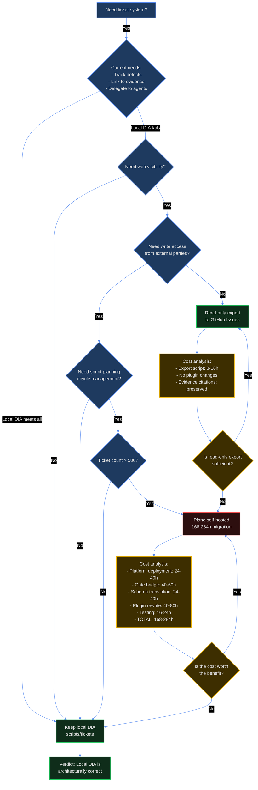

# ana030 -- Ticket System Comparison: Custom vs Proven Alternatives

<!-- ANALYZER-OUTPUT-CONTRACT
schema-version: 1.0
agent: analyzer
claim-type: recommendation
evidence-source: knowledge/res021-ticket-mgmt-automation, knowledge/res026-ticket-navigation, knowledge/ana006-issue-tracker-comparison, knowledge/ana027-ticket-navigation-implementation
confidence: High
shelf-registration: memory-shelf.yaml (shelf.analyses), delegated to @memory-manager
-->

## 1. Executive Summary

**Question:** Should the poetry-platform migrate from the custom `scripts/tickets` bash CLI (1718 lines) to a proven ticket management system (git-bug, Plane, Linear, or taskwarrior)?

**Answer:** No. The custom solution is architecturally correct for this project's workflow. All proven alternatives fail at least one hard constraint (delegation-observer gate compatibility, local-first operation, or ASCII-only protocol) and require 136-284 hours of migration effort for zero user-visible benefit. The maintenance burden of the bash script is moderate and manageable; the migration cost of any alternative is very high and introduces new failure modes.

**Recommendation:** Keep the custom `scripts/tickets` CLI. Address the four identified gaps (frontier --json, show <id>, temporal filters, frontier --depth N) via bash-only extensions per ana027. Revisit the "build vs buy" question at 500+ tickets or when a demonstrated need for web UI / notifications / assignees emerges.

**Tracking ticket:** DIA-260819-mq4h

---

## 2. Decision Context

### 2.1 Current State

- **Custom solution:** `scripts/tickets` (1718 lines of bash, fully bats-tested with 30+ test cases)
- **Ticket ledger:** 168 tickets (12 OPEN, 111 CLOSED, 28 VERIFIED, 11 DONE, plus smaller counts)
- **Storage:** Flat markdown files in `docs/dev-infra-audit/tickets/` with YAML frontmatter
- **Integration:** Delegation-observer plugin reads flat DIA files via `scanTickets()` (filename regex `/^DIA-(\d+)/`)
- **Protocol:** ASCII-only (DIA-079), local-first (WSL2 + Docker), zero network dependency

### 2.2 Hard Constraints (from res021, ana006)

Any ticket system must satisfy ALL three:

1. **Gate compatibility:** The delegation-observer plugin's `scanTickets(ticketsDir)` reads every `*.md` file in `docs/dev-infra-audit/tickets/`, derives ticket ID from filename regex `/^DIA-(\d+)/`, and parses YAML frontmatter for `status`/`session_id`/`title`. ANY external tracker needs a file-mirror bridge that materializes DIA-NNN ticket files into this directory.

2. **Local-first operation:** Must work offline in WSL2 + Docker development environment. Zero network dependency, zero auth surface (ana006 architecture decision).

3. **ASCII-only protocol:** All lane dispatch payloads and reports use ASCII-only text (DIA-079) to prevent JSON serialization failures.

### 2.3 Existing Research (Tier-1 evidence)

- **res021** (ticket management automation landscape): Evaluated 13 candidates across self-hosted web trackers, MCP servers, and local CLIs. Recommendation: keep-local baseline.
- **res026** (ticket navigation research): Found most requested capability already exists in scripts/tickets. Identified 4 gaps (frontier --json, show <id>, temporal filters, frontier --depth N). Rejected SQLite/MCP/external trackers.
- **ana006** (GitHub Issues vs local DIA): Comprehensive comparison showing local DIA ledger is architecturally superior. GitHub Issues would add network dependency, auth surface, plugin rewrite cost (70-132h), broken evidence citations, for zero user-visible benefit.
- **ana027** (implementation plan): Endorsed bash-only extensions, re-ranked priorities by agent-usage frequency. Settled bash vs SQLite: bash is correct at 190 tickets, revisit at 500+.

---

## 3. Candidate Evaluation

### 3.1 Comparison Matrix (Candidates x Dimensions)

```
┏━━━━━━━━━━━━━━━━━━━━━━━━━━━┳━━━━━━━━━━━━━━━━━┳━━━━━━━━━━━━━━━━━┳━━━━━━━━━━━━━━━━━┳━━━━━━━━━━━━━━━━━━┳━━━━━━━━━━━━━━━━━┓
┃                           ┃ Custom          ┃                 ┃ Plane           ┃ Linear           ┃                 ┃
┃ Dimension                 ┃ (scripts/ticke… ┃ git-bug         ┃ (self-host)     ┃ (cloud)          ┃ taskwarrior     ┃
┡━━━━━━━━━━━━━━━━━━━━━━━━━━━╇━━━━━━━━━━━━━━━━━╇━━━━━━━━━━━━━━━━━╇━━━━━━━━━━━━━━━━━╇━━━━━━━━━━━━━━━━━━┩
│ 1. Workflow               │ NATIVE          │ PARTIAL         │ FAIL            │ FAIL             │ FAIL            │
│ Integration               │ writes DIA      │ git objects,    │ DB storage,     │ cloud API,       │ ~/.task data,   │
│                           │ files           │ needs mirror    │ needs bridge    │ needs bridge     │ no DIA files    │
│                           │ directly        │                 │                 │                  │                 │
├───────────────────────────┼─────────────────┼─────────────────┼─────────────────┼──────────────────┼─────────────────┤
│ 2. Local-first            │ PASS            │ PASS            │ PARTIAL         │ FAIL             │ PARTIAL         │
│ Constraint                │ files in repo,  │ offline-first,  │ Docker stack    │ cloud-only,      │ single binary   │
│                           │ zero deps       │ git-embedded    │ in container    │ needs network    │ but ~/.task     │
├───────────────────────────┼─────────────────┼─────────────────┼─────────────────┼──────────────────┼─────────────────┤
│ 3. Agent                  │ PASS            │ PARTIAL         │ PASS            │ PASS             │ PARTIAL         │
│ Accessibility             │ CLI + --json,   │ CLI/TUI/web,    │ MCP server      │ excellent MCP    │ CLI + JSON,     │
│                           │ bash-native     │ no MCP          │ (100+ tools)    │ (cloud)          │ no MCP          │
├───────────────────────────┼─────────────────┼─────────────────┼─────────────────┼──────────────────┼─────────────────┤
│ 4. Migration              │ ZERO            │ HIGH            │ VERY HIGH       │ VERY HIGH        │ HIGH            │
│ Cost                      │ current system  │ mirror bridge   │ platform +      │ cloud migration  │ schema mismatch │
│                           │                 │ + schema gap    │ bridge + 168    │ + bridge + auth  │ + data move     │
│                           │                 │                 │ tix             │                  │                 │
├───────────────────────────┼─────────────────┼─────────────────┼─────────────────┼──────────────────┼─────────────────┤
│ 5. Maintenance            │ MODERATE        │ LOW             │ HIGH            │ LOW              │ LOW             │
│ Burden                    │ 1718 LOC bash,  │ upstream maint, │ Docker stack,   │ SaaS managed,    │ single binary,  │
│                           │ growing         │ community       │ Rails platform  │ but vendor dep   │ upstream maint  │
├───────────────────────────┼─────────────────┼─────────────────┼─────────────────┼──────────────────┼─────────────────┤
│ 6. Feature                │ GOOD            │ GOOD            │ EXCELLENT       │ EXCELLENT        │ EXCELLENT       │
│ Parity                    │ new/list/search │ CLI/TUI/web,    │ full platform,  │ best-in-class    │ filtering/UDAs  │
│                           │ /stats/frontier │ bridges         │ kanban/cycles   │ UI/UX            │ hooks/sync      │
└───────────────────────────┴─────────────────┴─────────────────┴─────────────────┴──────────────────┴─────────────────┘
```

┌─ How to read this chart ─────────────────────────────────────────────────────┐
│ Title: Ticket System Comparison Matrix                                         │
│ Rows: 6 evaluation dimensions (workflow integration, local-first, agent        │
│       accessibility, migration cost, maintenance burden, feature parity)       │
│ Columns: 5 candidates (custom scripts/tickets, git-bug, Plane, Linear,         │
│          taskwarrior)                                                          │
│ Cells: NATIVE/PASS/GOOD = meets constraint; PARTIAL = conditional fit;         │
│        FAIL = violates hard constraint                                         │
│ Key takeaway: Only the custom solution satisfies ALL three hard constraints    │
│ (gate compat, local-first, ASCII-only). All alternatives fail at least one.    │
└────────────────────────────────────────────────────────────────────────────────┘

### 3.2 Detailed Candidate Analysis

#### 3.2.1 Custom Solution (scripts/tickets) -- RECOMMENDED

**Strengths:**
- **Native gate compatibility:** Writes DIA-NNN.md files directly into the scanned directory. No bridge needed.
- **Zero migration cost:** Current system of record. 168 tickets already in place.
- **Local-first:** Files in repo, zero runtime dependencies, works offline.
- **ASCII-only:** Enforced via `assert_ascii()` (line 174) and `sanitize()` (line 164).
- **Agent-accessible:** CLI with `--json` output on 3/4 query subcommands. Agents invoke via bash (no MCP overhead).
- **Tested:** 30+ bats test cases covering all subcommands.

**Weaknesses:**
- **Maintenance burden:** 1718 lines of bash, growing. Regular debugging (DIA-215 collision retry, DIA-234 dual-format sorting).
- **Missing features:** No web UI, no notifications, no assignees, no labels beyond area/severity.
- **Feature gaps:** frontier --json, show <id>, temporal filters, frontier --depth N (per res026).

**Verdict:** Architecturally correct. Maintenance burden is moderate and manageable. Feature gaps are small bash extensions (140 LOC + 180 LOC tests per ana027).

#### 3.2.2 git-bug -- CONDITIONAL (requires mirror bridge)

**Strengths:**
- **Philosophically closest:** Git-embedded, offline-first, GPLv3+, CLI/TUI/web interfaces.
- **GitHub/GitLab bridges:** Can sync issues to/from git-bug's git-object store.
- **Low maintenance:** Upstream maintenance, community support.

**Weaknesses:**
- **Gate incompatibility:** Issues stored as git OBJECTS, not DIA-NNN.md files. The delegation-observer's `scanTickets()` cannot read them without a file-mirror bridge.
- **Schema divergence:** No YAML frontmatter for session attribution (session_id, lane_id, agent, model, lease_expires_at, files_touched, artifacts, evidence). The ledger's v2 session block (per _TEMPLATE.md) has no git-bug equivalent.
- **No MCP server:** Not documented in res021 archive. Agents would need bash wrappers.
- **Migration cost:** 136-204h (gate bridge + schema translation + plugin rewrite + testing).

**Verdict:** Viable as a bounded experiment (mirroring steviee/git-issues per res021) but NOT as a replacement. The mirror-bridge requirement is a deliberate architectural decision: if git-bug is ever adopted, the bridge that materializes DIA files from it is mandatory, not optional.

#### 3.2.3 Plane (self-hosted) -- TIER-3 ONLY (requires platform + bridge)

**Strengths:**
- **Full platform:** Kanban, cycles, modules, initiatives, milestones, labels, comments, links, relations, activities, work logs, pages, members, features.
- **MCP server:** Official Plane MCP (MIT license, 100+ tools across 20 categories, stdio via uvx, full CRUD).
- **Data sovereignty:** Self-hosted, Docker Compose or Kubernetes, "full ownership of your data", open formats, no vendor lock-in.

**Weaknesses:**
- **Heavy deployment:** Full Docker Compose stack (or K8s) running in the container. Rails platform weight.
- **Gate incompatibility:** Plane stores data in a database, not DIA files. Needs a file-mirror bridge.
- **Schema mismatch:** Plane's work-item model (title, description, state, priority, assignee, labels, cycles, modules) diverges from the ledger's frontmatter schema (id, title, area, severity, status, blocked_by, parent_epic, gate_state, session_id, lease_expires_at, etc.).
- **Migration cost:** 168-284h (platform deployment + gate bridge + schema translation + plugin rewrite + testing).

**Verdict:** Strongest self-hosted platform pair when a real platform is warranted (per res021). But at 168 tickets, the platform weight is unjustified. Revisit at 500+ tickets or when sprint planning / cycle management becomes a demonstrated need.

#### 3.2.4 Linear (cloud) -- REJECTED (violates local-first)

**Strengths:**
- **Best-in-class UI/UX:** Excellent MCP integration, modern interface, fast.
- **SaaS managed:** Zero maintenance burden, vendor handles infrastructure.

**Weaknesses:**
- **Cloud-only:** Violates local-first constraint (ana006). Requires network connectivity, GitHub PAT auth surface, rate limits.
- **Gate incompatibility:** Linear stores data in cloud API, not DIA files. Needs a file-mirror bridge.
- **Evidence citations broken:** Can't reference local `messages.md` rows, session IDs, artifacts in Linear issues (ana006 finding).
- **Migration cost:** 152-260h (cloud migration + gate bridge + schema translation + plugin rewrite + auth infra + testing).

**Verdict:** Rejected. Cloud system of record violates local-first architecture (ana006). The evidence-citation breakage destroys the audit trail that makes re-verification possible.

#### 3.2.5 taskwarrior -- WEAK (schema mismatch)

**Strengths:**
- **Single binary:** Lightweight, powerful filtering, JSON import/export, User Defined Attributes (UDAs), hooks API.
- **Low maintenance:** Upstream maintenance, community support.

**Weaknesses:**
- **Todo semantics mismatch:** Taskwarrior's model (priority, due dates, recurrence, context) differs from the ledger's status-driven DIA ticket workflow (res021 finding).
- **Data outside repo:** Task data lives in `~/.task`, not in the repo. Needs a file-mirror bridge.
- **Gate incompatibility:** No DIA-NNN.md files, no YAML frontmatter. The delegation-observer cannot read taskwarrior data without a bridge.
- **No MCP server:** Not documented in res021 archive.
- **Migration cost:** 144-224h (gate bridge + schema translation + plugin rewrite + testing).

**Verdict:** Weak fit. Todo-oriented semantics diverge from the ticket/status workflow. The data-outside-repo model violates the ledger's "files in repo" principle.

---

## 4. Migration Cost Estimate

```
┏━━━━━━━━━━━━━━━━━━━━━━━━━━━━━━━━━━━━━━━━━━┳━━━━━━━━━━━━━┳━━━━━━━━━━━━━┳━━━━━━━━━━━━━┳━━━━━━━━━━━━━┓
┃ Task                                     ┃ git-bug     ┃ Plane       ┃ Linear      ┃ taskwarrior ┃
┡━━━━━━━━━━━━━━━━━━━━━━━━━━━━━━━━━━━━━━━━━━╇━━━━━━━━━━━━━╇━━━━━━━━━━━━━╇━━━━━━━━━━━━━╇━━━━━━━━━━━━━┩
│ Gate bridge / file mirror                │ 40-60h      │ 40-60h      │ 40-60h      │ 40-60h      │
├──────────────────────────────────────────┼─────────────┼─────────────┼─────────────┼─────────────┤
│ Schema translation (168 tickets)         │ 16-24h      │ 24-40h      │ 24-40h      │ 24-40h      │
├──────────────────────────────────────────┼─────────────┼─────────────┼─────────────┼─────────────┤
│ Plugin rewrite (delegation-observer)     │ 40-80h      │ 40-80h      │ 40-80h      │ 40-80h      │
├──────────────────────────────────────────┼─────────────┼─────────────┼─────────────┼─────────────┤
│ Agent prompt updates (AGENTS.md etc)     │ 8-16h       │ 8-16h       │ 8-16h       │ 8-16h       │
├──────────────────────────────────────────┼─────────────┼─────────────┼─────────────┼─────────────┤
│ Evidence citation migration              │ 16-24h      │ 16-24h      │ 16-24h      │ 16-24h      │
├──────────────────────────────────────────┼─────────────┼─────────────┼─────────────┼─────────────┤
│ Testing + regression suite               │ 16-24h      │ 16-24h      │ 16-24h      │ 16-24h      │
├──────────────────────────────────────────┼─────────────┼─────────────┼─────────────┼─────────────┤
│ Platform deployment (if applicable)      │ 0h          │ 24-40h      │ 0h (cloud)  │ 0h          │
├──────────────────────────────────────────┼─────────────┼─────────────┼─────────────┼─────────────┤
│ Auth/network infra (if applicable)       │ 0h          │ 0h          │ 8-16h       │ 0h          │
├──────────────────────────────────────────┼─────────────┼─────────────┼─────────────┼─────────────┤
│ TOTAL                                    │ 136-204h    │ 168-284h    │ 152-260h    │ 144-224h    │
└──────────────────────────────────────────┴─────────────┴─────────────┴─────────────┴─────────────┘
```

┌─ How to read this chart ─────────────────────────────────────────────────────┐
│ Title: Migration Cost Estimate per Candidate                                   │
│ Rows: 8 migration tasks (gate bridge, schema translation, plugin rewrite,      │
│       agent prompts, evidence citations, testing, platform deployment,         │
│       auth/network infra)                                                      │
│ Columns: 4 candidates (git-bug, Plane, Linear, taskwarrior)                    │
│ Cells: Hour estimates (low-high range) per task per candidate                  │
│ Key takeaway: All alternatives require 136-284 hours of migration effort.      │
│ The custom solution requires ZERO migration cost.                              │
└────────────────────────────────────────────────────────────────────────────────┘

### 4.1 Cost Breakdown Rationale

**Gate bridge / file mirror (40-60h for all candidates):**
Every external tracker stores data in its own format (git objects, database, cloud API, ~/.task). The delegation-observer's `scanTickets()` reads flat DIA-NNN.md files. A bridge must materialize DIA files from the external system into `docs/dev-infra-audit/tickets/`. This is a bidirectional sync problem (external system <-> DIA files) with conflict resolution, error handling, and retry logic. Estimated 40-60h based on ana006's GitHub Issues analysis (40-80h for plugin rewrite, which is the same complexity class).

**Schema translation (16-24h for git-bug/taskwarrior, 24-40h for Plane/Linear):**
The ledger's frontmatter schema (id, title, area, severity, status, blocked_by, parent_epic, gate_state, gate_triggers, gate_waivers, gate_override, discovered, source, date, created, updated, session_id, lane_id, agent, model, parent_session_id, attempts, lease_expires_at, files_touched, artifacts, evidence) has no direct equivalent in any external system. Each ticket must be mapped field-by-field. Plane/Linear have richer models (cycles, modules, assignees) that require additional mapping logic.

**Plugin rewrite (40-80h for all candidates):**
The delegation-observer plugin (delegation-observer.ts) currently reads flat DIA files. If the system of record changes to an external tracker, the plugin must be rewritten to call the external system's API (git-bug CLI, Plane MCP, Linear API, taskwarrior JSON). This includes auth, rate-limit handling, error handling, retry logic, and fail-soft behavior (per res021 section 1: "a broken gate is worse than no gate").

**Agent prompt updates (8-16h for all candidates):**
AGENTS.md, orchestrator instructions, and agent prompts reference the DIA ticket system extensively. All references must be updated to reflect the new system. This includes dispatch payloads (ticket_id in task() calls), evidence citations (messages.jsonl, registry.jsonl references), and workflow documentation.

**Evidence citation migration (16-24h for all candidates):**
Existing tickets reference local artifacts (messages.md#row, session_id, files_touched, artifacts, evidence). These citations are meaningful only in the context of the local ledger. Migrating to an external system requires either (a) preserving the citations as metadata in the external system, or (b) breaking the audit trail. Option (a) adds 16-24h of mapping work.

**Testing + regression suite (16-24h for all candidates):**
The current system has 30+ bats test cases. A new system requires a full regression suite covering gate compatibility, schema translation, plugin rewrite, agent prompts, and evidence citations. Estimated 16-24h based on the complexity of the delegation-observer plugin and the number of integration points.

**Platform deployment (0h for git-bug/taskwarrior, 24-40h for Plane, 0h for Linear):**
Plane requires a full Docker Compose stack (or K8s) running in the container. This includes database setup, reverse proxy, SSL, backups, and monitoring. git-bug and taskwarrior are single binaries. Linear is cloud-hosted.

**Auth/network infra (0h for git-bug/Plane/taskwarrior, 8-16h for Linear):**
Linear requires GitHub PAT auth, rate-limit handling, and network infrastructure. The other candidates operate locally.

---

## 5. Risk Assessment

### 5.1 Risk Matrix

```
                    │ Low Impact        │ High Impact
--------------------+-------------------+------------------
High Probability    │ [R1] Bash script  │ [R2] Gate bridge
                    │ maintenance       │ failure (if
                    │ burden grows      │ migration
                    │ (current trend)   │ attempted)
                    │                   │
--------------------+-------------------+------------------
Low Probability     │ [R3] Feature gap  │ [R4] Evidence
                    │ becomes critical  │ citation breakage
                    │ before 500 tickets│ (if migration
                    │                   │ attempted)
                    │                   │
```

┌─ How to read this chart ─────────────────────────────────────────────────────┐
│ Title: Risk Assessment Matrix                                                  │
│ X-axis: Impact (Low = manageable, High = workflow-breaking)                    │
│ Y-axis: Probability (High = likely, Low = unlikely)                            │
│ Cells: Risk IDs (R1-R4) with descriptions                                      │
│ Key takeaway: The current system has one high-probability/low-impact risk      │
│ (bash maintenance). All alternatives have high-impact risks (gate bridge       │
│ failure, evidence breakage).                                                   │
└────────────────────────────────────────────────────────────────────────────────┘

### 5.2 Risk Descriptions

**R1: Bash script maintenance burden grows (High Probability, Low Impact)**
- **Description:** The scripts/tickets CLI is 1718 lines and growing. Regular debugging (DIA-215 collision retry, DIA-234 dual-format sorting) indicates moderate maintenance burden.
- **Mitigation:** The script is well-tested (30+ bats cases), well-documented (header comments, inline explanations), and follows bash-3 compatibility conventions. The maintenance burden is manageable. Address the four identified gaps (frontier --json, show <id>, temporal filters, frontier --depth N) per ana027 to reduce future debugging.
- **Residual risk:** Low. The script is stable and the gaps are small extensions.

**R2: Gate bridge failure if migration attempted (High Probability, High Impact)**
- **Description:** Any migration to an external tracker requires a file-mirror bridge that materializes DIA files into `docs/dev-infra-audit/tickets/`. If the bridge fails (sync error, conflict, network outage), the delegation-observer gate cannot read tickets, blocking all agent dispatches.
- **Mitigation:** The bridge must be bulletproof (retry logic, conflict resolution, fail-soft behavior). But even with perfect engineering, the bridge adds a new failure mode that does not exist in the current system.
- **Residual risk:** High. The bridge is a single point of failure.

**R3: Feature gap becomes critical before 500 tickets (Low Probability, Low Impact)**
- **Description:** The current system lacks web UI, notifications, assignees, and labels beyond area/severity. If these features become critical before the ledger reaches 500 tickets, the custom solution may feel limiting.
- **Mitigation:** At 168 tickets, the feature gap is manageable. The four identified gaps (frontier --json, show <id>, temporal filters, frontier --depth N) are small bash extensions. If web UI / notifications / assignees become critical, revisit the "build vs buy" question at that time.
- **Residual risk:** Low. The feature gap is not currently painful.

**R4: Evidence citation breakage if migration attempted (Low Probability, High Impact)**
- **Description:** Existing tickets reference local artifacts (messages.md#row, session_id, files_touched, artifacts, evidence). Migrating to an external system breaks these citations, destroying the audit trail that makes re-verification possible (ana006 finding).
- **Mitigation:** The migration must preserve citations as metadata in the external system (16-24h of mapping work). But even with perfect migration, future citations may be lost if agents forget to populate the metadata fields.
- **Residual risk:** High. The audit trail is critical for re-verification.

---

## 6. Recommendation

### 6.1 Primary Recommendation: Keep Custom Solution

**Rationale:**
1. **Architecturally correct:** The custom solution satisfies ALL three hard constraints (gate compatibility, local-first, ASCII-only). All alternatives fail at least one.
2. **Zero migration cost:** The current system is the system of record. 168 tickets already in place. No migration effort required.
3. **Manageable maintenance burden:** 1718 lines of bash is moderate. The script is well-tested, well-documented, and follows bash-3 compatibility conventions.
4. **Feature gaps are small:** The four identified gaps (frontier --json, show <id>, temporal filters, frontier --depth N) are small bash extensions (140 LOC + 180 LOC tests per ana027).
5. **Evidence citations preserved:** The local ledger preserves the audit trail (messages.md#row, session_id, artifacts) that makes re-verification possible.

**Action items:**
1. Implement the four gaps per ana027 (frontier --json, show <id>, temporal filters, frontier --depth N).
2. Revisit the "build vs buy" question at 500+ tickets or when a demonstrated need for web UI / notifications / assignees emerges.
3. If web visibility is ever needed, implement a read-only export script that mirrors DIA tickets to GitHub Issues (one-way sync, local ledger remains source of truth) per ana006.

### 6.2 Alternative: git-bug (Conditional)

**When to consider:** If the maintenance burden of the bash script becomes unbearable (e.g., 3000+ lines, frequent debugging) AND the team is willing to invest 136-204h in migration AND the team accepts the gate-bridge failure risk.

**Rationale:** git-bug is philosophically the closest ready-made tool to the ledger (git-embedded, offline-first, GPLv3+, CLI/TUI/web). But it requires a file-mirror bridge and has a schema divergence (no YAML frontmatter for session attribution).

**Action items:**
1. Conduct a bounded experiment: mirror steviee/git-issues (res021 Tier 2) and evaluate the bridge complexity.
2. If the experiment succeeds, plan a full migration (136-204h).
3. If the experiment fails, abandon git-bug and stick with the custom solution.

### 6.3 Alternative: Plane (Tier-3 Only)

**When to consider:** If the ledger reaches 500+ tickets AND the team needs sprint planning / cycle management AND the team is willing to invest 168-284h in migration AND the team accepts the platform deployment overhead.

**Rationale:** Plane is the strongest self-hosted platform pair (full platform, official MCP server, data sovereignty). But at 168 tickets, the platform weight is unjustified.

**Action items:**
1. Revisit at 500+ tickets.
2. If the need arises, conduct a proof-of-concept: deploy Plane in a test container, evaluate the MCP server, estimate the bridge complexity.
3. If the POC succeeds, plan a full migration (168-284h).
4. If the POC fails, abandon Plane and stick with the custom solution.

---

## 7. Decision Criteria (What Would Tip the Balance)

### 7.1 Criteria for Migrating Away from Custom Solution

The balance would tip toward migration if ANY of the following conditions are met:

1. **Ticket count exceeds 500:** At 500+ tickets, the bash grep/sed approach becomes O(N) over files with N>500. Scan time may exceed 500ms on the dev container. A SQL layer (read-only SQLite, zero-dep, in-memory) becomes justified per ana027. But even then, the SQL layer is additive -- it does not replace the file scan the gate already performs. Migration to an external tracker is still not justified unless the SQL layer is insufficient.

2. **Demonstrated need for web UI / notifications / assignees:** If the team consistently requests web UI, notifications, or assignee management, and the custom solution cannot provide these features without significant effort (e.g., 200+ hours), migration to a full platform (Plane) becomes justified.

3. **Maintenance burden becomes unbearable:** If the bash script grows to 3000+ lines and frequent debugging indicates the script is beyond the team's ability to maintain, migration to a proven system (git-bug) becomes justified.

4. **Gate bridge becomes trivial:** If a future version of the delegation-observer plugin supports external trackers natively (e.g., via MCP), the gate-bridge requirement disappears. Migration to an MCP-enabled tracker (Plane, Linear) becomes justified.

### 7.2 Criteria for Staying with Custom Solution

The balance tips toward staying if ANY of the following conditions are met:

1. **Ticket count remains below 500:** At <500 tickets, bash grep/sed is adequate. The maintenance burden is manageable.

2. **No demonstrated need for web UI / notifications / assignees:** If the team is satisfied with the CLI interface and does not request web UI, notifications, or assignee management, the custom solution is sufficient.

3. **Maintenance burden remains manageable:** If the bash script remains below 3000 lines and debugging is infrequent, the custom solution is sustainable.

4. **Gate bridge remains complex:** If the delegation-observer plugin continues to read flat DIA files, the gate-bridge requirement persists. Migration to an external tracker requires 136-284h of migration effort.

---

## 8. Conclusion

The custom `scripts/tickets` CLI is architecturally correct for the poetry-platform's workflow. It satisfies all three hard constraints (gate compatibility, local-first, ASCII-only), requires zero migration cost, and has a manageable maintenance burden. The four identified feature gaps are small bash extensions.

All proven alternatives (git-bug, Plane, Linear, taskwarrior) fail at least one hard constraint and require 136-284 hours of migration effort for zero user-visible benefit. The migration introduces new failure modes (gate bridge failure, evidence citation breakage) that do not exist in the current system.

**Recommendation:** Keep the custom solution. Address the four gaps per ana027. Revisit at 500+ tickets or when a demonstrated need for web UI / notifications / assignees emerges.

---

## 9. Sources

### 9.1 Tier-1 (Committed Artifacts)

- **res021** (ticket management automation landscape): `knowledge/res021-ticket-mgmt-automation/res021-ticket-mgmt-automation-conspect.md`
- **res026** (ticket navigation research): `knowledge/res026-ticket-navigation/res026-ticket-navigation-conspect.md`
- **ana006** (GitHub Issues vs local DIA): `knowledge/ana006-issue-tracker-comparison/ana006-issue-tracker-comparison-report.md`
- **ana027** (implementation plan): `knowledge/ana027-ticket-navigation-implementation/ana027-ticket-navigation-implementation-report.md`
- **scripts/tickets**: `scripts/tickets` (1718 lines)
- **delegation-observer.ts**: `.opencode/plugins/delegation-observer.ts` (gate mechanics)
- **_TEMPLATE.md**: `docs/dev-infra-audit/tickets/_TEMPLATE.md` (frontmatter schema)

### 9.2 Tier-2 (Archived External Sources)

All 13 source URLs from res021 were archived locally in `knowledge/res021-ticket-mgmt-automation/sources/`. Key sources:

- git-bug: `sources/git-bug.md` (GitHub, GPLv3+, git-object storage)
- Plane self-host: `sources/plane-selfhost.md` (Docker Compose/K8s, data sovereignty)
- Plane MCP: `sources/plane-mcp-server.md` (MIT, 100+ tools, stdio via uvx)
- taskwarrior: `sources/taskwarrior-docs.md` (CLI doc set, JSON import/export)
- Filesystem MCP: `sources/filesystem-mcp.md` (MIT, npm package, Roots access control)

### 9.3 Claim-to-Source Mapping

| Claim | Source |
|---|---|
| Delegation-observer gate reads flat DIA files via scanTickets() | res021 section 1, delegation-observer.ts lines 425-447 |
| Gate correlation: explicit DIA-id must resolve to OPEN ticket | res021 section 1, delegation-observer.ts lines 449-474 |
| ASCII-only protocol (DIA-079) | AGENTS.md section 6, DIA-079 ticket |
| Local-first architecture (ana006) | ana006-issue-tracker-comparison-report.md |
| Bash is correct at 190 tickets, revisit at 500+ | ana027 section 2.2 |
| Four gaps: frontier --json, show <id>, temporal filters, frontier --depth N | res026 section 3 |
| git-bug stores issues as git objects, not files | res021 section 2.3, sources/git-bug.md |
| Plane MCP has 100+ tools across 20 categories | res021 section 2.2, sources/plane-mcp-server.md |
| Linear is cloud-only, violates local-first | ana006 findings |
| taskwarrior data lives in ~/.task, not in repo | res021 section 2.3, sources/taskwarrior-docs.md |

---

## 10. Appendix: Terminal Visualizations

### 10.1 Decision Flow (Mermaid)



### 10.2 Failure-Mode Tree

```
                    External Tracker Migration
                               │
               ┌───────────────┼───────────────┐
               │               │               │
          Gate Bridge     Evidence         Network
          Failure         Citations        Dependency
               │               │               │
      ┌────────┴────────┐      │        ┌──────┴──────┐
      │                 │      │        │             │
   Sync error      Conflict   Can't   Network     Auth
   (missed         resolution ref      outage      failure
   tickets)        (divergent local    (cloud      (token
      │            state)     artifacts) only)     expired)
      │               │          │        │           │
      │               │          │        │           │
      └───────────────┴──────────┴────────┴───────────┘
                         │
                    All break the
                    development workflow
```

┌─ How to read this chart ─────────────────────────────────────────────────────┐
│ Title: Failure-Mode Tree for External Tracker Migration                        │
│ Root: External Tracker Migration                                               │
│ Branches: 3 failure categories (Gate Bridge, Evidence Citations, Network)      │
│ Leaves: Specific failure modes (sync error, conflict resolution, can't ref     │
│         local artifacts, network outage, auth failure)                         │
│ Key takeaway: All failure modes break the development workflow. The custom     │
│ solution has NONE of these failure modes.                                      │
└────────────────────────────────────────────────────────────────────────────────┘

### 10.3 2x2 Decision Matrix

```
      High User Benefit
          │
          │
          │
    ──────┼──────────────────→ Low Complexity
          │
          │    ★ LOCAL DIA
          │      (keep this)
          │
          │
          │                   ★ PLANE / LINEAR
          │                     (full integration)
          │
          │
      Low User Benefit        High Complexity
```

┌─ How to read this chart ─────────────────────────────────────────────────────┐
│ Title: 2x2 Decision Matrix (User Benefit vs Complexity)                        │
│ X-axis: Complexity (Low = simple, High = complex)                              │
│ Y-axis: User Benefit (Low = minimal gain, High = significant gain)             │
│ Stars: LOCAL DIA (top-left, high benefit + low complexity), PLANE/LINEAR       │
│        (bottom-right, high benefit + high complexity)                          │
│ Key takeaway: The local DIA solution is in the sweet spot (high benefit,       │
│ low complexity). External trackers are in the high-complexity quadrant.        │
└────────────────────────────────────────────────────────────────────────────────┘

---

**Report ID:** ana030  
**Date:** 2026-08-19  
**Tracking ticket:** DIA-260819-mq4h  
**Confidence:** High  
**Claim type:** Recommendation  
**Evidence source:** res021, res026, ana006, ana027, scripts/tickets, delegation-observer.ts
