# ana035 - Unified dev-runtime gap and migration analysis

<!-- ANALYZER-OUTPUT-CONTRACT
schema-version: 1.0
agent: analyzer
claim-type: finding
evidence-source: /workspace (Dockerfile.dev, tools/opencode-docker/Dockerfile, docker-compose*.yml, dev-entrypoint.sh, tools/opencode-docker/bin/opencode-docker, tools/opencode-docker/bootstrap.py, scripts/opencode-dev, scripts/verify-pre-commit.sh, scripts/verify-pre-push.sh, openspec/changes/dia-260821-x5nj-unified-docker-dev-runtime/, .husky/pre-commit, .husky/pre-push, docs/docker-dev.md, knowledge/ana023, knowledge/ana024, knowledge/ana025)
confidence: High
shelf-registration: memory-shelf.yaml (shelf.analyses), delegated to @memory-manager
-->

## 1. Executive summary

The project currently operates **two divergent Docker runtimes** that overlap
on toolchain but diverge on trust, lifecycle, and host-integration seams:

| Runtime | Image | Role | Trust posture |
|---|---|---|---|
| `poetry-dev` | `Dockerfile.dev` (root) | Writable app workstation + OpenCode host | Non-root `dev` UID 1000, writable rootfs, compose-managed, attached to `poetry-postgres` |
| `opencode-docker` | `tools/opencode-docker/Dockerfile` | Disposable OpenCode shell | Read-only rootfs, `--cap-drop ALL`, `--userns=keep-id`, SSH-agent + container-socket forwarding |

The goal of DIA-260821-x5nj is to collapse these into **one OpenCode dev
container** that is the sole workspace for: OpenCode, preset/auth/key loading,
git commit and push, project tools/tests, and Fedora + WSL Ubuntu/Debian
adapters. This report inventories the factual current state, identifies the
capability gaps and root causes, maps the migration dependency graph, and
produces a prioritized vertical-slice ticket plan.

**Key finding:** the two runtimes are not accidentally duplicated; they are
architecturally split along a trust/lifecycle boundary (ana023, ana025).
Unification is feasible but requires rewriting **four seams** (hook delegation,
secret loading, SSH agent forwarding, engine-specific UID mapping) rather than
merging Dockerfiles. The existing OpenSpec change (dia-260821-x5nj) already
specifies the target state; this analysis identifies the **unaddressed gaps**
that the current tasks.md does not cover.

---

## 2. Factual current-state inventory

### 2.1 Dockerfile comparison

| Aspect | `Dockerfile.dev` (poetry-dev) | `tools/opencode-docker/Dockerfile` |
|---|---|---|
| Lines | 355 | 226 |
| Base image | `debian:13-slim@sha256:4e401d...` | same digest |
| OpenCode version | `1.18.18` (ARG) | `1.18.4` (ARG) -- **DRIFT** |
| OpenCode install | Direct binary + SHA256 verify | `curl\|sh` installer + SHA256 of script (stale pin `fc3c1b2...`) |
| Node | 24.18.0 (pinned binary + SHA256) | 24.18.0 (pinned binary, no SHA256) |
| pnpm | 10.33.0 | 10.33.0 |
| bun | 1.3.14 | 1.3.14 |
| OpenSpec | 1.7.0 | 1.7.0 |
| snip | 0.22.0 | 0.22.0 |
| mise | 2026.8.0 | 2026.8.0 |
| uv | 0.11.29 | 0.11.29 |
| Rust toolchain | Yes (1.83.0 + rust-analyzer 1.97.1) | **No** |
| Language servers | TS 5.3.0, Pyright 1.1.411, YAML 1.24.0, rust-analyzer | **No** |
| OMO plugin cache | Pre-populated (2.2.14) | **No** |
| trafilatura | 2.2.0 (uv pip --system) | **No** |
| Playwright + crawl4ai | Yes (chromium, install-deps) | Yes (chromium only) |
| tini (PID 1 init) | Yes (0.19.0, SHA256) | **No** |
| Docker CLI | apt-repo install (29.7.2 + compose 5.4.0) | Static bundles (29.7.2 + compose 2.39.1) |
| SSH client | **No** (no openssh-client) | Yes (openssh-client) |
| Entrypoint | `dev-entrypoint.sh` (bash, gosu drop) | `bootstrap.py` (Python, exec opencode) |
| USER directive | Removed (DIA-260824-a3mk); entrypoint starts root, drops via gosu | `USER ${USER_UID}:${USER_GID}` at line 221 |
| Read-only support | No (intentional) | Yes (`--read-only --tmpfs /tmp:exec`) |
| Multi-stage build | No (single-stage) | Yes (builder-tools -> collector -> final) |
| Healthcheck | `gosu dev opencode --version` | `opencode --version` |
| `--cap-drop ALL` | **No** | Yes |
| `--security-opt no-new-privileges` | **No** | Yes |
| `--shm-size=1g` | **No** (not in compose) | Yes (in wrapper) |
| `--memory/--cpus` limits | **No** | Yes (4g / 4) |

### 2.2 Compose topology

```
docker-compose.yml              (base: dev + postgres, poetry-net)
docker-compose.podman.yml       (userns_mode: keep-id + label=disable)
docker-compose.rootless-docker.yml (user: "0:0")
docker-compose.wsl.yml          (empty overlay, memory tuning commented)
docker-compose.fedora.yml       (identical to podman.yml -- REDUNDANT)
```

**Finding:** `docker-compose.fedora.yml` and `docker-compose.podman.yml` are
byte-identical in content (both set `userns_mode: keep-id` + `label=disable`).
This is a leftover from the earlier OS-based override design that was
superseded by the engine-based design (proposal.md Alternatives #1). It is
dead configuration that should be removed in cleanup.

### 2.3 Entrypoint comparison

| Aspect | `dev-entrypoint.sh` | `bootstrap.py` |
|---|---|---|
| Language | bash | Python 3 |
| Secret loading | Whitelist loop, `/run/secrets/*` -> env | Same whitelist, Python Path.iterdir |
| Xvfb | Yes (`:99 -ac -noreset`) | Yes (`:99`, no `-ac -noreset`) |
| Privilege drop | gosu -> runuser -> su fallback | N/A (USER directive) |
| OpenSpec init | **No** | Yes (`openspec init --tools opencode`) |
| Default command | `bash` | `opencode` (exec) |
| State-dir repair | Yes (DIA-260824-a3mk chown) | **No** |

### 2.4 Launch wrappers

| Wrapper | Location | Invocation |
|---|---|---|
| `opencode-dev` | `scripts/opencode-dev` | Engine+OS auto-detect, compose override selection, `up -d dev` + `exec` |
| `opencode-docker` | `tools/opencode-docker/bin/opencode-docker` | Podman-only, `podman run` with full flag set, SSH/socket forwarding |
| `make opencode` | `Makefile:48` | `docker compose exec -it --user root dev /usr/local/bin/dev-entrypoint.sh opencode` |
| `make shell` | `Makefile:45` | `docker compose exec --user dev dev bash` |

### 2.5 Hook delegation model (current host-delegated commit evidence)

The pre-commit and pre-push hooks run **on the host** (invoked by husky from
the host's git process) and delegate into the dev container:

```
Host git commit
  -> .husky/pre-commit
  -> scripts/verify-pre-commit.sh
     -> is_in_dev_container? (hostname == "poetry-dev")
        -> YES: run npx lint-staged directly
        -> NO: container_running?
           -> YES: docker compose exec -T dev bash -lc "npx lint-staged"
           -> NO: exit 1 (HARD FAIL, DIA-094)
```

**Evidence of host-delegated model:**
- `scripts/verify-pre-commit.sh:24-26` -- `is_in_dev_container()` checks hostname
- `scripts/verify-pre-commit.sh:28-30` -- `container_running()` uses `docker compose ps`
- `scripts/verify-pre-commit.sh:34-42` -- `run_workspace()` branches on context
- `scripts/verify-pre-push.sh:36-62` -- identical pattern
- `.husky/pre-commit:6` -- `bash scripts/verify-pre-commit.sh` (host-side invocation)

**Root cause of host delegation:** the hooks were written before the
opencode-docker container existed as a first-class workspace. The poetry-dev
container was the only workspace, so hooks had to run on the host and delegate
in. When opencode-docker was added, it inherited the same hook files (shared
workspace bind mount) and the same delegation pattern -- but opencode-docker
already has the docker CLI + socket mount to run `docker compose exec` itself,
creating a **nested delegation** (opencode-docker -> host docker socket ->
poetry-dev container).

### 2.6 OpenSpec artifacts (dia-260821-x5nj)

| Artifact | Status | Content |
|---|---|---|
| `proposal.md` | Complete | Option A chosen (engine-specific overrides), 10 acceptance criteria, retirement threshold |
| `design.md` | Complete | 6 seams, test strategy, migration plan (4 phases), 8 risks |
| `tasks.md` | Complete | 9 slices, 38 tasks, blocking edges, critical path |
| `specs/` | Present | Delta specs directory |

**Implementation status:** tasks.md shows all 38 tasks as unchecked (`[ ]`).
The compose override files (`docker-compose.podman.yml`,
`docker-compose.rootless-docker.yml`, `docker-compose.wsl.yml`) and
`scripts/opencode-dev` **already exist** in the repo, indicating partial
implementation outside the formal task tracking.

---

## 3. Capability gap matrix

The matrix below identifies capabilities the unified container must have,
where each capability currently lives, and what is missing.

```
+----+-------------------------------+----------------+------------------+------------------+
| #  | Capability                    | poetry-dev     | opencode-docker  | Unified gap      |
+----+-------------------------------+----------------+------------------+------------------+
| C1 | OpenCode CLI + OMO plugins    | YES (1.18.18)  | YES (1.18.4)     | Version pin      |
|    |                               |                |                  | unification      |
+----+-------------------------------+----------------+------------------+------------------+
| C2 | Preset/auth/key loading       | YES            | YES              | Secret loading   |
|    |                               | (entrypoint)   | (bootstrap.py)   | seam merge       |
+----+-------------------------------+----------------+------------------+------------------+
| C3 | Git commit (in-container)     | NO (host-      | NO (host-        | NEW: direct      |
|    |                               | delegated)     | delegated)       | git commit       |
+----+-------------------------------+----------------+------------------+------------------+
| C4 | Git push (SSH agent)          | NO             | YES (wrapper)    | Integrate SSH    |
|    |                               |                |                  | forwarding into  |
|    |                               |                |                  | compose/entrypt  |
+----+-------------------------------+----------------+------------------+------------------+
| C5 | Project tools/tests           | YES (full)     | PARTIAL (no      | Bring full       |
|    |                               |                | Rust/LS/trafil)  | toolchain from   |
|    |                               |                |                  | Dockerfile.dev   |
+----+-------------------------------+----------------+------------------+------------------+
| C6 | Fedora adapter (Podman +      | PARTIAL        | YES (keep-id +   | Compose override |
|    | SELinux keep-id)              | (override      | label=disable)   | already exists;  |
|    |                               | exists)        |                  | validate merge   |
+----+-------------------------------+----------------+------------------+------------------+
| C7 | WSL Ubuntu/Debian adapter     | PARTIAL        | PARTIAL          | Compose overlay  |
|    |                               | (wsl.yml       | (no WSL-specific | exists but empty;|
|    |                               | empty)         | logic)           | needs 9P/WSL2    |
|    |                               |                |                  | tuning           |
+----+-------------------------------+----------------+------------------+------------------+
| C8 | Rootless Docker adapter       | PARTIAL        | NO               | Compose override |
|    | (user: "0:0")                 | (override      |                  | already exists;  |
|    |                               | exists)        |                  | validate merge   |
+----+-------------------------------+----------------+------------------+------------------+
| C9 | Read-only rootfs + cap-drop   | NO             | YES              | DEFERRED         |
|    | ALL                           | (intentional)  |                  | (design.md       |
|    |                               |                |                  | explicitly       |
|    |                               |                |                  | defers this)     |
+----+-------------------------------+----------------+------------------+------------------+
| C10| Container socket forwarding   | NO             | YES (wrapper)    | Integrate socket |
|    | (for hook delegation)         |                |                  | probe into       |
|    |                               |                |                  | compose/launcher |
+----+-------------------------------+----------------+------------------+------------------+
| C11| Chromium shared memory        | NO             | YES (--shm-      | Add shm_size to  |
|    |                               |                | size=1g)         | compose base or  |
|    |                               |                |                  | launcher         |
+----+-------------------------------+----------------+------------------+------------------+
| C12| Postgres network attachment   | YES            | NO               | Keep in unified  |
|    | (poetry-net)                  |                |                  | (already in base)|
+----+-------------------------------+----------------+------------------+------------------+
| C13| App dev servers (turbo/pnpm)  | YES            | NO               | Keep in unified  |
|    |                               |                |                  | (already in base)|
+----+-------------------------------+----------------+------------------+------------------+
| C14| PID 1 init (tini)             | YES            | NO               | Keep tini in     |
|    |                               |                |                  | unified          |
+----+-------------------------------+----------------+------------------+------------------+
| C15| Serve mode (remote access)    | NO             | YES (-S flag)    | Decide: integrate|
|    |                               |                |                  | or drop          |
+----+-------------------------------+----------------+------------------+------------------+
```

### 3.1 Critical gaps (not covered by current tasks.md)

| Gap | Description | Evidence |
|---|---|---|
| **G1: Direct in-container git commit** | Neither runtime currently commits from inside the container. Hooks run on host and delegate in. The unified goal requires the container to be the sole workspace for git commit AND push. This requires: (a) git identity config inside container, (b) safe.directory already set (DIA-185, done), (c) hook execution model change -- hooks must run INSIDE the container, not delegate from host. | `scripts/verify-pre-commit.sh:24-42`, `.husky/pre-commit:6` |
| **G2: Hook execution model inversion** | Current model: host runs hook -> delegates into container. Target model: container runs hook directly (no delegation needed because the container IS the workspace). This is a **fundamental architectural change** not addressed in tasks.md. | `scripts/verify-pre-commit.sh`, `scripts/verify-pre-push.sh` |
| **G3: Entrypoint unification deferred** | `dev-entrypoint.sh` vs `bootstrap.py` -- two different init strategies. tasks.md explicitly defers this, but the unified container needs ONE entrypoint. | design.md "Deferred Scope" #3 |
| **G4: OpenCode version drift** | 1.18.18 vs 1.18.4. The unified container must pin ONE version. Dockerfile.dev is the source of truth (1.18.18). | `Dockerfile.dev:27`, `tools/opencode-docker/Dockerfile:6` |
| **G5: SSH client missing from Dockerfile.dev** | `Dockerfile.dev` does not install `openssh-client`. SSH agent forwarding requires the `ssh` binary. | `Dockerfile.dev:58-74` (apt packages, no openssh-client) |
| **G6: `docker-compose.fedora.yml` dead file** | Byte-identical to `docker-compose.podman.yml`. Not referenced by `scripts/opencode-dev`. Should be removed. | `docker-compose.fedora.yml`, `docker-compose.podman.yml` |
| **G7: Serve mode not in unified plan** | `opencode-docker` supports `-S/--serve` for remote access (Android app over Tailscale). tasks.md does not address this capability. | `tools/opencode-docker/bin/opencode-docker:205-225` |
| **G8: Resource limits not in unified plan** | `opencode-docker` enforces `--memory=4g --cpus=4`. `docker-compose.yml` has no resource limits on `dev`. | `docker-compose.yml:28-77`, `bin/opencode-docker:241-242` |

---

## 4. Root-cause analysis (5-Whys)

### 4.1 Why are there two runtimes?

1. **Why?** The project needed an OpenCode isolation boundary with stronger security than the app dev workstation.
2. **Why?** The app dev workstation (`poetry-dev`) is writable, attached to postgres, and runs app servers -- too broad a trust surface for OpenCode's plugin model.
3. **Why?** OpenCode plugins can execute arbitrary code; isolating OpenCode in a read-only, capability-dropped container limits blast radius.
4. **Why?** The security model was designed incrementally: `poetry-dev` came first (app workstation), then `opencode-docker` was added as a security-hardened OpenCode shell.
5. **Root cause:** **Incremental security evolution without a unification plan.** The two runtimes serve different trust levels but duplicate 80% of the toolchain.

### 4.2 Why do hooks delegate from host into container?

1. **Why?** Husky invokes hooks from the host's git process.
2. **Why?** The hooks need to run lint-staged / pnpm / make, which live in the container.
3. **Why?** The container has the toolchain; the host does not (by design).
4. **Why?** The project enforces "all dev work happens in the container" (DIA-094).
5. **Root cause:** **Husky's host-side invocation model conflicts with the container-only toolchain policy.** The delegation bridge (`docker compose exec`) is the seam that makes this work, but it creates a dependency on the container being running and adds latency.

### 4.3 Why does the unified goal require direct in-container commit?

1. **Why?** The goal is "one container that is the sole workspace for git commit and push."
2. **Why?** If the container is the sole workspace, there should be no host-side git process delegating into it.
3. **Why?** Host delegation creates a split-brain: the host's git sees the workspace via bind mount, but the container's git sees it via the same mount. Two git processes can conflict.
4. **Why?** The current model works because only ONE git process runs at a time (host delegates, container executes). But this is fragile: if the host's git and the container's git both try to write `.git/index.lock`, one fails.
5. **Root cause:** **The unified goal requires the container to own the git process end-to-end, eliminating the host-delegation seam.** This is the architectural inversion that tasks.md does not address.

---

## 5. Migration dependency graph

```mermaid
%%{init: {'theme': 'base', 'themeVariables': {'darkMode': true, 'background': '#1e1e2e', 'primaryColor': '#2d3a5c', 'primaryTextColor': '#e0e0e0', 'primaryBorderColor': '#5b8def', 'lineColor': '#5b8def', 'labelTextColor': '#e0e0e0', 'signalColor': '#5b8def', 'signalTextColor': '#e0e0e0'}}}%%
flowchart TB
    subgraph Phase1[Phase 1: Foundation]
        T1_1[T1.1: scripts/opencode-dev]
        T2_1[T2.1: docker-compose.podman.yml]
        T2_2[T2.2: docker-compose.rootless-docker.yml]
        T2_3[T2.3: docker-compose.wsl.yml]
        T7_0a[T7.0a: check-secrets-ownership.sh]
    end

    subgraph Phase2[Phase 2: SSH + Chromium]
        T1_2[T1.2: --ssh-agent flag]
        T1_3[T1.3: Dockerfile.dev SSH client]
        T3_1[T3.1: --shm-size=1g]
        T1_4[T1.4: bats tests for SSH]
    end

    subgraph Phase3[Phase 3: Command modes]
        T4_1[T4.1: --run-opencode]
        T4_2[T4.2: --test]
        T4_3[T4.3: bats tests for modes]
    end

    subgraph Phase4[Phase 4: PATH + docs]
        T5_1[T5.1: PATH exposure]
        T5_2[T5.2: AGENTS.md update]
        T5_3[T5.3: docs/docker-dev.md update]
    end

    subgraph Phase5[Phase 5: Contract tests]
        T6_1[T6.1: unified-container-contract.bats]
        T6_2[T6.2: engine-override-uid.bats]
        T6_3[T6.3: wire into test-infra]
    end

    subgraph Phase6[Phase 6: Preflight + keep-id verify]
        T7_0b[T7.0b: preflight integration]
        T7_0c[T7.0c: preflight bats]
        T7_0d[T7.0d: keep-id-recreation-verify.bats]
        T7_0e[T7.0e: wire into test-infra]
    end

    subgraph Phase7[Phase 7: Acceptance]
        T7_1[T7.1: Fedora gates]
        T7_2[T7.2: WSL gates]
        T7_3[T7.3: SSH push Fedora]
        T7_4[T7.4: SSH push WSL]
        T7_5[T7.5: Chromium Fedora]
        T7_6[T7.6: Chromium WSL]
        T7_7[T7.7: version identical]
    end

    subgraph Phase8[Phase 8: Retirement]
        T8_1[T8.1: collect evidence]
        T8_2[T8.2: 7-day countdown]
        T8_3[T8.3: reviewer audit]
        T8_4[T8.4: ai-auditor audit]
        T8_5[T8.5: developer confirmations]
        T8_6[T8.6: retire tools/opencode-docker]
    end

    T1_1 --> T1_2
    T1_1 --> T1_3
    T1_2 --> T2_1
    T1_2 --> T2_2
    T1_2 --> T2_3
    T1_2 --> T7_0a
    T1_2 --> T3_1
    T1_2 --> T1_4
    T3_1 --> T4_1
    T3_1 --> T4_2
    T4_1 --> T4_3
    T4_2 --> T4_3
    T4_3 --> T5_1
    T5_1 --> T5_2
    T5_1 --> T5_3
    T5_1 --> T6_1
    T2_1 --> T6_1
    T2_2 --> T6_1
    T6_1 --> T6_3
    T6_2 --> T6_3
    T6_3 --> T7_1
    T7_0a --> T7_0b
    T7_0b --> T7_1
    T7_1 --> T7_2
    T7_1 --> T7_3
    T7_1 --> T7_5
    T7_2 --> T7_4
    T7_2 --> T7_6
    T7_3 --> T7_7
    T7_4 --> T7_7
    T7_5 --> T7_7
    T7_6 --> T7_7
    T7_7 --> T8_1
    T8_1 --> T8_2
    T8_2 --> T8_3
    T8_3 --> T8_4
    T8_4 --> T8_5
    T8_5 --> T8_6

    style Phase1 fill:#2d3a5c,stroke:#5b8def
    style Phase2 fill:#2d3a5c,stroke:#5b8def
    style Phase3 fill:#2d3a5c,stroke:#5b8def
    style Phase4 fill:#2d3a5c,stroke:#5b8def
    style Phase5 fill:#2d3a5c,stroke:#5b8def
    style Phase6 fill:#2d3a5c,stroke:#5b8def
    style Phase7 fill:#2d3a5c,stroke:#5b8def
    style Phase8 fill:#2d3a5c,stroke:#5b8def
```



**Critical path:** T1.1 -> T1.2 -> T1.4 -> T3.1 -> T4.1 -> T4.3 -> T5.1 -> T6.1 -> T6.3 -> T7.1 -> T7.2 -> T7.4 -> T7.6 -> T7.7 -> T8.1 -> T8.2 -> T8.3 -> T8.4 -> T8.5 -> T8.6

**Parallel opportunities:**
- T1.2, T1.3, T1.5 after T1.1
- T2.1, T2.2, T2.3 after T1.1
- T4.1, T4.2 after T3.1+T3.2+T3.3
- T6.1, T6.2 after T5.1+T2.1+T2.2
- T7.3, T7.5 after T7.1
- T7.4, T7.6 after T7.2

---

## 6. Security boundaries

### 6.1 SSH agent forwarding

**Current model (opencode-docker):**
- Host SSH agent socket forwarded read-only into container at `/tmp/ssh-agent.sock`
- Keys NEVER leave the host; only sign-requests go through the socket
- `GIT_SSH_COMMAND` set unconditionally with `IdentityAgent=/tmp/ssh-agent.sock`
- `UserKnownHostsFile=/tmp/known_hosts` (writable tmpfs, TOFU trust model)
- Probe order: `$SSH_AUTH_SOCK` -> `${XDG_RUNTIME_DIR}/keyring/ssh` -> `${XDG_RUNTIME_DIR}/gcr/ssh`

**Target model (unified):**
- Same socket-forwarding mechanism, but integrated into `scripts/opencode-dev` and `docker-compose.yml` (or launcher)
- Compose does not support dynamic socket mounting; the launcher (`opencode-dev`) must add the mount via `docker compose exec -e SSH_AUTH_SOCK=... -v $sock:/tmp/ssh-agent.sock:ro`
- **Gap:** compose override files cannot express conditional socket mounts; the launcher must handle this.

**Security boundary:** the socket is mounted `:ro`, so the container cannot modify the host agent state. The container can only request sign-ops. This is the same trust model as DIA-121 (docker socket forwarding) and DIA-173 (SSH agent forwarding).

### 6.2 API secrets

**Current model (both runtimes):**
- Secrets live in `secrets/` (git-ignored) on host
- Compose mounts them read-only at `/run/secrets`
- Entrypoint loads whitelisted names into env (`ALLOWED_SECRETS` list)
- Whitelist must stay in sync: `dev-entrypoint.sh`, `bootstrap.py`, `scripts/dev-secrets-profile.sh`

**Target model (unified):**
- Same compose-based secret mounting
- Single entrypoint (after G3 is resolved) with one whitelist
- **Gap:** if entrypoints are not unified (G3), the whitelist can drift.

**Security boundary:** secrets are file-based, not env-based, so they do not leak via `docker inspect` or process listings. The whitelist prevents unknown secrets from being loaded.

### 6.3 Docker socket

**Current model (opencode-docker):**
- Host container socket (Podman or Docker) mounted read-only at `/var/run/docker.sock`
- Allows container to run `docker compose` commands (for hook delegation)
- Rootless Podman socket = user's own containers only, NOT host root
- SELinux: `--security-opt label=disable` required on Fedora (connectto denial workaround)

**Target model (unified):**
- `Dockerfile.dev` already has Docker CLI (apt-repo install)
- If the unified container needs to delegate hooks (G2 not resolved), it needs the socket
- If hooks run directly in the unified container (G2 resolved), the socket is NOT needed
- **Decision point:** does the unified container need the socket?
  - If YES: add socket probe to `opencode-dev` launcher (same as opencode-docker)
  - If NO: remove Docker CLI from unified image (saves ~90MB)

**Security boundary:** the socket grants container-management rights. With rootless Podman, this is the user's own containers. With rootful Docker, this is host-root-equivalent. The unified container should only mount the socket if absolutely necessary.

### 6.4 Git identity and safe.directory

**Current model:**
- `Dockerfile.dev:321` sets `git config --system --add safe.directory /workspace`
- `Dockerfile.dev:345` sets `git config --global --add safe.directory /workspace`
- Git identity (user.name, user.email) is NOT set in the container; it comes from the host's `~/.gitconfig` (if mounted) or must be set manually

**Target model (unified):**
- safe.directory already set (DIA-185)
- Git identity: the unified container must have a git identity config strategy
  - Option A: mount host's `~/.gitconfig` read-only (opencode-docker does this)
  - Option B: set git identity via env vars (`GIT_AUTHOR_NAME`, etc.)
  - Option C: document that developers must set git config in the container

**Gap:** tasks.md does not address git identity configuration.

---

## 7. Legacy cleanup inventory

When the unified container is validated and the 7-day retirement threshold is met, the following artifacts should be removed or updated:

| Artifact | Action | Evidence |
|---|---|---|
| `tools/opencode-docker/` (entire directory) | DELETE | proposal.md T8.6 |
| `docker-compose.fedora.yml` | DELETE (dead file, byte-identical to podman.yml) | `docker-compose.fedora.yml`, `docker-compose.podman.yml` |
| `tools/opencode-docker/Dockerfile` | DELETE (superseded by Dockerfile.dev) | design.md Phase 4 |
| `tools/opencode-docker/bootstrap.py` | DELETE (superseded by dev-entrypoint.sh) | design.md "Deferred Scope" #3 |
| `tools/opencode-docker/bin/opencode-docker` | DELETE (superseded by scripts/opencode-dev) | proposal.md T8.6 |
| `Makefile` target `test-opencode-docker` | REMOVE (tests the deleted subproject) | `Makefile:92-93` |
| `Makefile` target `check-pin-sync` | UPDATE (remove tools/opencode-docker/Dockerfile from comparison) | `Makefile:72-73`, `scripts/check-pin-sync.sh` |
| `scripts/check-opencode-docker.sh` | DELETE (tests the deleted subproject) | `Makefile:93` |
| `docs/docker-dev.md` | UPDATE (remove references to opencode-docker, document opencode-dev) | proposal.md T5.3 |
| `AGENTS.md` §6 | UPDATE (replace `make opencode` with `opencode-dev`) | proposal.md T5.2 |
| `knowledge/ana023`, `ana024`, `ana025` | ARCHIVE (historical analyses, no longer actionable) | N/A |

---

## 8. Verification plan

### 8.1 Mock-based unit tests (no container required)

| Test file | Coverage |
|---|---|
| `scripts/__tests__/opencode-dev.bats` | Engine detection, OS detection, override selection, flag parsing, container-already-running skip |
| `scripts/__tests__/check-secrets-ownership.bats` | Preflight logic, diagnostic output, no-chown-recursive safeguard |

### 8.2 Contract tests (real container required)

| Test file | Coverage |
|---|---|
| `scripts/__tests__/unified-container-contract.bats` | Identical `opencode --version` for both engine overrides |
| `scripts/__tests__/engine-override-uid.bats` | UID/GID mapping contract (Podman keep-id vs Docker user 0:0) |
| `scripts/__tests__/keep-id-recreation-verify.bats` | Secret mountpoints, git index write, secret readability |

### 8.3 Real acceptance verification (Fedora + WSL)

| Check | Platform | Evidence |
|---|---|---|
| `make test-infra` passes | Fedora + WSL | Exit code 0 |
| `make test-config` passes | Fedora + WSL | Exit code 0 |
| `make test-shell` passes | Fedora + WSL | Exit code 0 |
| Pre-commit hook delegation works | Fedora + WSL | Commit succeeds |
| Pre-push hook delegation works | Fedora + WSL | Push succeeds |
| SSH agent forwarding works (`git push`) | Fedora + WSL | Push to SSH remote succeeds |
| Chromium launches without shm errors | Fedora + WSL | Playwright test passes |
| `opencode --version` identical | Fedora + WSL | Diff shows no difference |
| Bind mounts writable | Fedora + WSL | `touch /workspace/test` succeeds |
| Secrets readable | Fedora + WSL | `cat /run/secrets/anthropic_api_key` succeeds |
| Preflight refusal works | Fedora + WSL | Unsafe ownership causes exit 1 |

### 8.4 Gate wiring

- Contract tests + UID tests + preflight tests + keep-id tests -> `make test-infra`
- Mock tests -> `make test-shell` (auto-discovered by bats wrapper)

---

## 9. Rollback plan

### 9.1 Immediate rollback (before retirement threshold)

1. `git revert` the implementation commit(s)
2. Remove `docker-compose.podman.yml`, `docker-compose.rootless-docker.yml`, `docker-compose.wsl.yml`
3. Remove `scripts/opencode-dev`
4. `tools/opencode-docker/` remains unchanged and functional (not deleted until T8.6)

### 9.2 Rollback triggers

- Any gate failure on either platform (Fedora or WSL)
- SSH push failure
- Chromium launch failure
- Version mismatch detected
- Developer request

### 9.3 No `--legacy` wrapper

The developer explicitly rejected a `--legacy` flag (proposal.md). Use `tools/opencode-docker/bin/opencode-docker` directly for rollback.

---

## 10. Prioritized vertical-slice ticket recommendations

The current tasks.md has 38 tasks across 9 slices. This analysis recommends **re-prioritizing** to address the unaddressed gaps (G1-G8) earlier.

### 10.1 Recommended slice order

| Priority | Slice | Rationale |
|---|---|---|
| **P0** | Slice 0 (NEW): Hook execution model inversion (G2) | This is the architectural core of the unified goal. Without it, the container is not the "sole workspace" for git commit. |
| **P1** | Slice 1: SSH agent forwarding | Enables git push from the container; critical for the "sole workspace" goal. |
| **P2** | Slice 2: Engine-specific UID/GID mapping | Enables Fedora + WSL support; already partially implemented (compose overrides exist). |
| **P3** | Slice 3: Chromium shared memory | Small change, enables browser automation. |
| **P4** | Slice 5: PATH exposure + docs | Makes `opencode-dev` discoverable. |
| **P5** | Slice 4: Command modes (--run-opencode, --test) | Convenience features, not blocking. |
| **P6** | Slice 6: Contract tests | Validates the unification. |
| **P7** | Slice 7: Preflight + keep-id verify | Security hardening. |
| **P8** | Slice 8: Acceptance verification | Final validation. |
| **P9** | Slice 9: Retirement | Cleanup. |

### 10.2 New Slice 0: Hook execution model inversion (G2)

**Goal:** Make the unified container the sole workspace for git commit, eliminating host delegation.

**Tasks:**

- **T0.1** Decide hook execution model:
  - Option A: Hooks run INSIDE the container (no host delegation). Requires: git installed in container (already in Dockerfile.dev), husky installed in container (add to Dockerfile.dev), `.husky/` hooks execute directly.
  - Option B: Hooks still run on host, but delegate into the unified container (current model). Requires: container running, docker socket not needed (host runs `docker compose exec`).
  - **Recommendation:** Option A. The unified goal requires the container to own the git process. Option B maintains the split-brain.

- **T0.2** If Option A: install husky in Dockerfile.dev (`npm install -g husky`), configure `.husky/` to run directly (no delegation logic in `verify-pre-commit.sh` / `verify-pre-push.sh`).

- **T0.3** If Option A: update `scripts/verify-pre-commit.sh` to remove the `is_in_dev_container` / `container_running` / `run_workspace` branching. The hook now runs directly in the container.

- **T0.4** If Option A: update `scripts/verify-pre-push.sh` similarly.

- **T0.5** If Option A: document that developers must run `make up` before committing (container must be running for hooks to execute). This is already the case (DIA-094), so no behavior change.

- **T0.6** If Option A: update `AGENTS.md` §2.3 to reflect that hooks now run inside the container, not on the host.

- **T0.7** Create bats tests for the new hook model (mock git, verify hook executes directly).

**Depends on:** none
**Blocks:** Slice 1 (SSH push requires direct git execution), Slice 8 (acceptance)

### 10.3 Additional tasks for unaddressed gaps

| Gap | New task | Slice |
|---|---|---|
| G3: Entrypoint unification | T0.8: Decide entrypoint strategy (keep dev-entrypoint.sh, adopt bootstrap.py, or merge). Recommend: keep dev-entrypoint.sh (bash, simpler, already has state-dir repair). Migrate OpenSpec init from bootstrap.py to dev-entrypoint.sh. | Slice 0 |
| G4: OpenCode version drift | T0.9: Pin OpenCode version in Dockerfile.dev (already 1.18.18). Document that tools/opencode-docker/Dockerfile is deprecated. | Slice 0 |
| G5: SSH client missing | T1.3a: Add `openssh-client` to Dockerfile.dev apt packages. | Slice 1 |
| G6: Dead fedora.yml | T9.1: Delete `docker-compose.fedora.yml`. | Slice 9 |
| G7: Serve mode | T4.5: Add `--serve` flag to `scripts/opencode-dev` (port publish, env-file, workdir). | Slice 4 |
| G8: Resource limits | T2.7: Add `deploy.resources.limits` to `docker-compose.yml` (memory: 8g, cpus: 4). | Slice 2 |
| Git identity | T0.10: Document git identity strategy (mount host `~/.gitconfig` read-only, or set via env vars). | Slice 0 |

---

## 11. Assumptions and unknowns

### 11.1 Assumptions

1. **The unified container is `Dockerfile.dev` (poetry-dev), not `tools/opencode-docker/Dockerfile`.** Rationale: Dockerfile.dev has the full toolchain (Rust, language servers, OMO cache, trafilatura), is already compose-managed, and is attached to postgres. opencode-docker is the disposable shell; its security posture (read-only, cap-drop) is deferred (C9).

2. **The unified launcher is `scripts/opencode-dev`, not `tools/opencode-docker/bin/opencode-docker`.** Rationale: opencode-dev is engine-agnostic (Podman + Docker), OS-aware (WSL + native), and compose-based. opencode-docker is Podman-only and uses `podman run` directly.

3. **The unified container runs as non-root (`dev` UID 1000), not root.** Rationale: Dockerfile.dev already has a non-root user. The entrypoint starts as root (for state-dir repair) but drops to dev via gosu (DIA-260824-a3mk).

4. **The unified container does NOT enforce read-only rootfs or cap-drop ALL in the first release.** Rationale: design.md explicitly defers this. Dockerfile.dev is "intentionally NOT distroless and NOT --read-only" (line 15-17).

5. **The unified container keeps the postgres network attachment.** Rationale: the app dev servers (author-studio, api-server) need postgres.

6. **The unified container keeps the app dev servers (turbo/pnpm).** Rationale: the goal is "one container that is the sole workspace," which includes app development.

### 11.2 Unknowns

1. **Does the unified container need the Docker socket?** If hooks run inside the container (G2 resolved, Option A), the socket is NOT needed. If hooks still delegate (Option B), the socket IS needed. **Decision required before Slice 1.**

2. **What is the git identity strategy?** The container needs `user.name` and `user.email` for commits. Options: mount host `~/.gitconfig`, set via env vars, or document manual config. **Decision required before Slice 0.**

3. **Should serve mode (`-S/--serve`) be integrated into the unified launcher?** opencode-docker supports it for remote access (Android app over Tailscale). If the unified container replaces opencode-docker, serve mode must be preserved or explicitly dropped. **Decision required before Slice 4.**

4. **Should resource limits (memory, cpus) be enforced in compose?** opencode-docker enforces `--memory=4g --cpus=4`. docker-compose.yml has no limits. If the unified container replaces opencode-docker, limits should be added. **Decision required before Slice 2.**

5. **What is the entrypoint unification strategy?** dev-entrypoint.sh (bash) vs bootstrap.py (Python). design.md defers this, but the unified container needs ONE entrypoint. **Decision required before Slice 0.**

6. **What is the OpenCode version pin?** Dockerfile.dev has 1.18.18, opencode-docker has 1.18.4. The unified container must pin ONE version. **Recommendation:** 1.18.18 (Dockerfile.dev is the source of truth).

7. **What is the retirement threshold?** proposal.md says "7 consecutive successful days for both developers + reviewer audit + ai-auditor audit + explicit confirmations." This is a long timeline. **Unknown:** is this acceptable, or should it be shortened?

---

## 12. Conclusion

The unified dev-runtime goal is feasible but requires **architectural inversion** (hook execution model, G2) that the current tasks.md does not address. The existing OpenSpec change (dia-260821-x5nj) specifies the target state correctly, but the task breakdown misses the core seam: making the container the sole workspace for git commit, not just git push.

**Recommendations:**

1. **Add Slice 0 (Hook execution model inversion)** as P0. This is the architectural core.
2. **Decide the Docker socket question** before Slice 1. If hooks run inside the container, the socket is not needed.
3. **Decide the entrypoint unification question** before Slice 0. Recommend: keep dev-entrypoint.sh.
4. **Decide the git identity strategy** before Slice 0. Recommend: mount host `~/.gitconfig` read-only.
5. **Delete `docker-compose.fedora.yml`** (dead file, G6).
6. **Add `openssh-client` to Dockerfile.dev** (G5).
7. **Pin OpenCode version to 1.18.18** (G4).
8. **Re-prioritize slices** per §10.1.

The unified container will be `Dockerfile.dev` (poetry-dev) with SSH agent forwarding, engine-specific compose overrides, and direct hook execution. The legacy `tools/opencode-docker/` will be retired after the 7-day threshold.

---

**Report path:** `/workspace/knowledge/ana035-unified-dev-runtime-gap-migration/ana035-unified-dev-runtime-gap-migration-report.md`

**Key evidence:**
- `Dockerfile.dev` (355 lines) vs `tools/opencode-docker/Dockerfile` (226 lines) -- version drift, toolchain divergence
- `docker-compose.fedora.yml` byte-identical to `docker-compose.podman.yml` -- dead file
- `scripts/verify-pre-commit.sh:24-42` -- host-delegated hook model
- `tools/opencode-docker/bin/opencode-docker:166-203` -- SSH agent forwarding reference implementation
- `openspec/changes/dia-260821-x5nj-unified-docker-dev-runtime/tasks.md` -- 38 tasks, all unchecked, G1-G8 not addressed
- `knowledge/ana023`, `ana024`, `ana025` -- prior analyses confirming the two runtimes serve different trust boundaries
