# ana036 -- Weekend Coding Preset Efficiency Analysis

<!-- ANALYZER-OUTPUT-CONTRACT
schema-version: 1.0
agent: analyzer
claim-type: recommendation
evidence-source: .opencode/session/messages.jsonl, knowledge/model-registry.yaml, .opencode/oh-my-opencode-slim.jsonc
confidence: Medium
shelf-registration: memory-shelf.yaml (shelf.analyses), delegated to @memory-manager
-->

## 1. Executive Summary

The poetry-platform workload is **coder-dominated** (28% of all named dispatches, 1023 events), with reviewer (2.5%), analyzer (1.3%), and researcher (1.4%) as distant seconds. The current active preset `cebula-hy3` already routes the highest-volume lane (coder) to the promo-priced `hy3` ($0.14/$0.58), which is correct for weekend marathon efficiency. However, three lanes still use non-promo models that drain the $60/mo cap during burst sessions: **analyzer** (qwen3.7-plus at $0.40/$1.60), **architector** (qwen3.7-plus + deepseek-v4-pro), and **reviewer** (deepseek-v4-flash at $0.22/$0.66 off-peak, price rose +57-371% per res030).

**Weekend efficiency strategy:** maximize promo-model throughput on the 6-8h weekend blocks by routing all high-volume lanes to $0.14-tier models (mimo-v2.5, hy3), while keeping quality-critical lanes (reviewer, coder-escalated) on reasoning-capable models with strict quota guards.

---

## 2. Task Mix Analysis

### 2.1 Dispatch Volume by Lane (messages.jsonl, all-time)

```
TOTAL DELEGATION EVENTS: 3,632

Lane                  Count    Share   Category
-------------------------------------------------------
coder                 1,023    28.2%   IMPLEMENTATION
ai-specialist           152     4.2%   CONFIG RESEARCH
ai-auditor              119     3.3%   CONFIG REVIEW
memory-manager          107     2.9%   KNOWLEDGE PERSIST
openspec-plan           102     2.8%   SPEC AUTHORING
code-executor           100     2.8%   IMPLEMENTATION
reviewer                 90     2.5%   CODE REVIEW
code-navigator           63     1.7%   CODEBASE RECON
conspecter               52     1.4%   RESEARCH SYNTHESIS
researcher               50     1.4%   EXTERNAL RESEARCH
analyzer                 47     1.3%   ANALYSIS
orchestrator             37     1.0%   DISPATCH MGMT
observer                 22     0.6%   VISUAL/MEDIA
architector              19     0.5%   ARCHITECTURE
resource-manager          7     0.2%   SOURCE CURATION
council (all)            20     0.6%   CONSENSUS
coder-escalated           4     0.1%   ESCALATED IMPL
```

### 2.2 Task Category Aggregation

```
Category               Count    Share   Model Requirement
-----------------------------------------------------------
Implementation         1,123    30.9%   Speed + accuracy (temp 0.0-0.1)
Config/Research          278     7.7%   Reasoning (temp 0.3)
Review                   90     2.5%   High accuracy (temp 0.0-0.2)
Spec Authoring          102     2.8%   Reasoning + domain (temp 0.1-0.3)
Knowledge Persist       159     4.4%   Speed (temp 0.1)
Analysis                 47     1.3%   Reasoning + visualization
Architecture             19     0.5%   Deep reasoning (temp 0.1)
External Research        50     1.4%   Speed + web access
```

### 2.3 Day-of-Week Distribution (coder dispatches)

```
Tuesday      257  ████████████████████████  (24.1%)
Wednesday    198  ██████████████████        (18.6%)
Thursday     166  ███████████████           (15.6%)
Saturday     164  ███████████████           (15.4%)
Monday       118  ███████████               (11.1%)
Friday        98  █████████                  (9.2%)
Sunday        67  ██████                     (6.3%)
```

**Key insight:** Weekday (Mon-Fri) accounts for 78.4% of coder dispatches; weekend (Sat+Sun) is 21.6%. However, the user's stated pattern (6-8h weekend vs 2-4h weekday) means weekend sessions are **denser** -- more dispatches per hour, more consecutive model calls, higher quota burn rate per session.

---

## 3. Current Preset vs Promo Opportunity

### 3.1 Active Preset: cebula-hy3

| Lane              | Primary Model           | $/1M in | $/1M out | Promo? | Req/mo    |
|-------------------|-------------------------|---------|----------|--------|-----------|
| orchestrator      | hy3                     | 0.14    | 0.58     | YES    | 21,500    |
| coder             | hy3                     | 0.14    | 0.58     | YES    | 21,500    |
| reviewer          | deepseek-v4-flash       | 0.22    | 0.66     | NO*    | 18,900    |
| analyzer          | qwen3.7-plus            | 0.40    | 1.60     | NO     | 21,600    |
| architector       | qwen3.7-plus            | 0.40    | 1.60     | NO     | 21,600    |
| openspec-plan     | hy3                     | 0.14    | 0.58     | YES    | 21,500    |
| researcher        | hy3                     | 0.14    | 0.58     | YES    | 21,500    |
| conspecter        | hy3                     | 0.14    | 0.58     | YES    | 21,500    |
| memory-manager    | mimo-v2.5-free          | 0.00    | 0.00     | FREE   | unlimited |
| code-navigator    | mimo-v2.5-free          | 0.00    | 0.00     | FREE   | unlimited |
| coder-escalated   | kimi-k3                 | 3.00    | 15.00    | NO     | 490       |
| analyzer-escalated| deepseek-v4-pro         | 0.66    | 1.98     | NO     | 5,200     |

*deepseek-v4-flash price rose +57-371% (res030); no longer a promo-tier model.

### 3.2 Available Promo Models (res030, 2026-08-17 refresh)

| Model           | $/1M in | $/1M out | Req/mo   | Bucket | Notes                        |
|-----------------|---------|----------|----------|--------|------------------------------|
| mimo-v2.5       | 0.14    | 0.28     | 150,400  | $60    | Volume king, lowest out $    |
| hy3             | 0.14    | 0.58     | 21,500   | $60    | 256K ctx, multi-lane         |
| mimo-v2.5-free  | 0.00    | 0.00     | unlimited| $0     | Zen provider only            |
| gpt-5.6-luna    | 0.20    | 1.20     | 10,250   | $15    | 2x promo, subagent-weak      |
| deepseek-v4-flash| 0.22   | 0.66     | 18,900   | $15    | Price rose, off-peak only    |

**muse-spark-1.2-contributor**: NOT in model-registry.yaml or any archived conspect. Assumed unavailable on Go or not yet evaluated. Excluded from recommendations.

---

## 4. Weekend Efficiency Optimization

### 4.1 The Bursty Pattern Problem

```
Weekend day (6-8h continuous):
  ~80-120 coder dispatches/day (extrapolated from 164 Sat events)
  Each dispatch: ~2K-8K input tokens + ~1K-4K output tokens
  At hy3 pricing: ~$0.001-0.007/dispatch
  Daily cost: ~$0.08-0.84 (well within $60 bucket)
  BOTTLENECK: req/mo cap (21,500 for hy3)

Weekday (2-4h irregular):
  ~30-60 dispatches/day
  Lower density, more idle time between calls
  Quota pressure: minimal
```

**Critical finding:** The hy3 req/mo cap (21,500) is the binding constraint, NOT the $60 dollar bucket. At 1,064 coder dispatches in the observed window (~16 days of data), that's ~66/day average. Weekend peaks could hit 120+/day, which would exhaust the 21,500/mo cap in ~12 days of heavy weekend usage.

### 4.2 Promo Efficiency Matrix

```
Model          Cost/dispatch   Req/mo     Weekend-days-to-cap
                 (avg 4K in)                                 
mimo-v2.5      $0.0010         150,400    >30 (effectively unlimited)
hy3            $0.0017          21,500    ~12 (at 120 dispatches/day)
mimo-v2.5-free $0.0000         unlimited  never
flash          $0.0020         18,900    ~10 (at 120/day, off-peak only)
qwen3.7-plus   $0.0048         21,600    ~12 (but 4.8x costlier)
```

**Weekend throughput winner:** mimo-v2.5 at $0.14/$0.28 with 150,400 req/mo. It has 7x the request budget of hy3 at the same input price and 50% cheaper output. The only trade-off: no independent SWE-bench reproduction (vendor-only benchmark gap per res017).

---

## 5. Lane-by-Lane Promo Routing Recommendations

### 5.1 Mermaid Diagram: Promo-Optimized Lane Routing

```mermaid
flowchart TD
    subgraph "HIGH VOLUME - PROMO FIRST"
        C[coder<br/>1023 dispatches] --> |primary| MV5[mimo-v2.5<br/>$0.14/$0.28<br/>150K req/mo]
        C --> |fallback| MV5F[mimo-v2.5-free<br/>$0.00]
        
        MM[memory-manager<br/>107 dispatches] --> MV5F
        CN[code-navigator<br/>63 dispatches] --> MV5F
        CON[conspecter<br/>52 dispatches] --> MV5
        CON --> |fallback| MV5F
    end
    
    subgraph "MEDIUM VOLUME - PROMO WITH QUALITY FLOOR"
        R[reviewer<br/>90 dispatches] --> |primary| H3[hy3<br/>$0.14/$0.58<br/>variant: high]
        R --> |fallback| QP[qwen3.7-plus<br/>$0.40/$1.60]
        
        RES[researcher<br/>50 dispatches] --> MV5
        RES --> |fallback| QP
        
        AN[analyzer<br/>47 dispatches] --> |primary| H3
        AN --> |fallback| QP
    end
    
    subgraph "LOW VOLUME - REASONING FIRST"
        ARC[architector<br/>19 dispatches] --> QP
        ARC --> |fallback| DP[deepseek-v4-pro<br/>$0.66/$1.98]
        
        OSP[openspec-plan<br/>102 dispatches] --> H3
        OSP --> |fallback| QP
    end
    
    subgraph "ESCALATED - QUOTA GUARDED"
        CE[coder-escalated<br/>4 dispatches] --> KK[kimi-k3<br/>$3/$15<br/>490 req/mo]
        AE[analyzer-escalated] --> DP
    end
    
    style MV5 fill:#22c55e,color:#000
    style MV5F fill:#86efac,color:#000
    style H3 fill:#3b82f6,color:#fff
    style QP fill:#f59e0b,color:#000
    style KK fill:#ef4444,color:#fff
    style DP fill:#f97316,color:#fff
```



### 5.2 Routing Table: Current vs Proposed

| Lane | Task Type | Current Model | Proposed Promo Model | Cost Saving | Risk | Weekend Efficiency Gain |
|------|-----------|---------------|---------------------|-------------|------|------------------------|
| **coder** | Implementation (temp 0.1) | hy3 ($0.14/$0.58) | **mimo-v2.5** ($0.14/$0.28) | 52% output $ | Medium: no independent SWE-bench | +7x req/mo headroom (150K vs 21.5K) |
| **reviewer** | Code review (temp 0.1) | deepseek-v4-flash ($0.22/$0.66) | **hy3** ($0.14/$0.58, variant high) | 36% input, 12% output | Low: hy3 variant-high matches review quality | +14% req/mo, cheaper per review |
| **analyzer** | Analysis + viz | qwen3.7-plus ($0.40/$1.60) | **hy3** ($0.14/$0.58, variant high) | 65% input, 64% output | Medium: qwen3.7-plus stronger reasoning | 3.5x more analysis dispatches per $60 |
| **architector** | Architecture (temp 0.1) | qwen3.7-plus ($0.40/$1.60) | **qwen3.7-plus** (KEEP) | -- | -- | Low volume (19 total); quality > cost |
| **openspec-plan** | Spec authoring | hy3 ($0.14/$0.58) | **hy3** (KEEP) | -- | -- | Already promo-priced |
| **researcher** | Web research (temp 0.3) | hy3 ($0.14/$0.58) | **mimo-v2.5** ($0.14/$0.28) | 52% output $ | Low: research is volume, not depth | +7x req/mo headroom |
| **conspecter** | Synthesis (temp 0.1) | hy3 ($0.14/$0.58) | **mimo-v2.5** ($0.14/$0.28) | 52% output $ | Low: long-context synthesis works on mimo | +7x req/mo headroom |
| **memory-manager** | Shelf writes | mimo-v2.5-free | **mimo-v2.5-free** (KEEP) | -- | -- | Already free tier |
| **code-navigator** | Codebase recon | mimo-v2.5-free | **mimo-v2.5-free** (KEEP) | -- | -- | Already free tier |
| **coder-escalated** | Complex fix | kimi-k3 ($3/$15) | **kimi-k3** (KEEP) | -- | -- | 4 dispatches total; quota-guarded |
| **analyzer-escalated** | Domain failure | deepseek-v4-pro ($0.66/$1.98) | **deepseek-v4-pro** (KEEP) | -- | -- | Escalation only; rare |
| **orchestrator** | Dispatch mgmt | hy3 ($0.14/$0.58) | **hy3** (KEEP) | -- | -- | Already promo; dispatch volume moderate |

### 5.3 Proposed Preset Delta (from cebula-hy3)

```
CHANGE 1: coder primary: hy3 -> mimo-v2.5
  Reason: 7x req/mo headroom, 52% cheaper output, same input price
  Risk: vendor-only benchmark; mitigate by keeping hy3 as fallback[1]

CHANGE 2: reviewer primary: deepseek-v4-flash -> hy3 (variant high)
  Reason: flash price rose +57-371%; hy3 at variant-high matches review quality
  Risk: Low; hy3 already proven in openspec-plan at variant-high

CHANGE 3: analyzer primary: qwen3.7-plus -> hy3 (variant high)
  Reason: 65% cost reduction; analyzer is low-volume (47 total) so quality risk acceptable
  Risk: Medium; qwen3.7-plus has stronger reasoning for complex analysis
  Mitigation: keep qwen3.7-plus as fallback[0]; escalate to analyzer-escalated on domain failure

CHANGE 4: researcher primary: hy3 -> mimo-v2.5
  Reason: 52% cheaper output; research is volume-driven not depth-driven
  Risk: Low; researcher uses webfetch + trafilatura, model just orchestrates

CHANGE 5: conspecter primary: hy3 -> mimo-v2.5
  Reason: 52% cheaper output; conspecter is pure synthesis, temp 0.1
  Risk: Low; long-context synthesis works on mimo-v2.5 (1M ctx)
```

---

## 6. Weekend Throughput Projection

### 6.1 Current Preset (cebula-hy3) -- Weekend Day at 120 Dispatches

```
Lane              Dispatches  Model            Cost/dispatch   Daily Cost
coder             60          hy3              $0.0017         $0.10
reviewer          10          flash            $0.0020         $0.02
analyzer          5           qwen3.7-plus     $0.0048         $0.02
researcher        5           hy3              $0.0017         $0.01
conspecter        3           hy3              $0.0017         $0.01
openspec-plan     5           hy3              $0.0017         $0.01
memory-manager    10          mimo-v2.5-free   $0.0000         $0.00
code-navigator    5           mimo-v2.5-free   $0.0000         $0.00
orchestrator      17          hy3              $0.0017         $0.03
-------------------------------------------------------------------
TOTAL                                                     ~$0.20/day
Req/mo burn: ~120 dispatches * 30 days = 3,600/mo (hy3 share: ~2,400)
hy3 cap: 21,500 -> 9 days to cap at 120/day weekend-only
```

### 6.2 Proposed Preset -- Weekend Day at 120 Dispatches

```
Lane              Dispatches  Model            Cost/dispatch   Daily Cost
coder             60          mimo-v2.5        $0.0010         $0.06
reviewer          10          hy3              $0.0017         $0.02
analyzer          5           hy3              $0.0017         $0.01
researcher        5           mimo-v2.5        $0.0010         $0.01
conspecter        3           mimo-v2.5        $0.0010         $0.00
openspec-plan     5           hy3              $0.0017         $0.01
memory-manager    10          mimo-v2.5-free   $0.0000         $0.00
code-navigator    5           mimo-v2.5-free   $0.0000         $0.00
orchestrator      17          hy3              $0.0017         $0.03
-------------------------------------------------------------------
TOTAL                                                     ~$0.14/day
Req/mo burn: mimo-v2.5 share ~2,100/mo (of 150,400 cap)
             hy3 share ~1,200/mo (of 21,500 cap)
mimo-v2.5 cap: 150,400 -> >60 days at this rate
hy3 cap: 21,500 -> >17 days at this rate
```

**Net effect:** 30% cost reduction per weekend day, 2x longer time-to-cap on the binding constraint (hy3).

---

## 7. Risk Assessment

| Risk | Severity | Likelihood | Mitigation |
|------|----------|------------|------------|
| mimo-v2.5 vendor-only benchmark (no independent SWE-bench) | Medium | Certain | Keep hy3 as fallback[1]; monitor coder fix-loop failure rate |
| hy3 variant-high weaker than qwen3.7-plus on complex analysis | Medium | Possible | analyzer-escalated lane (deepseek-v4-pro) catches domain failures |
| hy3 req/mo cap (21,500) still binding for reviewer+openspec-plan+orchestrator | Low | Possible | Shift more lanes to mimo-v2.5; hy3 only for lanes needing 256K ctx |
| Promo pricing changes (res030 showed flash +57-371% overnight) | High | Possible | 2-week review cycle; model-registry.yaml update on each change |
| muse-spark-1.2-contributor unknown | Low | N/A | Not in registry; exclude until evaluated by @ai-specialist |

---

## 8. Recommendations

### 8.1 Immediate Actions (this session)

1. **Do NOT change config yet** -- this is analysis only.
2. The proposed delta (5 changes) should route through the AI Devtools Modernization Workflow (AGENTS.md section 2.5): @ai-specialist gate -> user review -> @architector design -> @coder implement -> @ai-auditor review.

### 8.2 Weekend Preset Composition (Highest Efficiency)

The highest-efficiency promo preset for weekend marathons:

```
coder:            mimo-v2.5 (primary) + hy3 (fallback)
reviewer:         hy3 variant-high (primary) + qwen3.7-plus (fallback)
analyzer:         hy3 variant-high (primary) + qwen3.7-plus (fallback)
researcher:       mimo-v2.5 (primary) + qwen3.7-plus (fallback)
conspecter:       mimo-v2.5 (primary) + mimo-v2.5-free (fallback)
openspec-plan:    hy3 variant-high (primary) + qwen3.7-plus (fallback)
orchestrator:     hy3 (primary) + deepseek-v4-flash (fallback)
memory-manager:   mimo-v2.5-free (primary) + hy3 (fallback)
code-navigator:   mimo-v2.5-free (primary) + hy3 (fallback)
architector:      qwen3.7-plus (KEEP - low volume, high reasoning need)
coder-escalated:  kimi-k3 (KEEP - quota-guarded, 4 dispatches total)
analyzer-escalated: deepseek-v4-pro (KEEP - escalation only)
```

### 8.3 Two-Week Review Trigger

Schedule a preset efficiency review in 2 weeks (2026-09-11) to:
1. Check if mimo-v2.5 coder quality holds (monitor fix-loop failure rate via registry.jsonl)
2. Verify hy3 req/mo consumption vs 21,500 cap
3. Check if any promo pricing changed (res030 showed flash can move +57-371% overnight)
4. Evaluate muse-spark-1.2-contributor if it appears on Go pricing
5. Consider creating a dedicated `cebula-weekend` preset that auto-activates on Sat/Sun (requires OMO plugin support for time-based preset switching -- not currently available, would need @ai-specialist research)

### 8.4 Alternative: Time-Based Preset Switching

If OMO Slim supports time-based preset selection (not confirmed), a `cebula-weekend` preset could be more aggressive:
- ALL lanes on mimo-v2.5/mimo-v2.5-free except escalated lanes
- reviewer on mimo-v2.5 variant-high (riskier but maximum throughput)
- Estimated weekend throughput gain: +40% more dispatches per $60 bucket

This requires @ai-specialist research into OMO preset-switching capabilities before implementation.

---

## 9. Evidence Sources

| Source | Type | Date | Relevance |
|--------|------|------|-----------|
| .opencode/session/messages.jsonl | Primary data | 2026-08-04 to 2026-08-28 | Dispatch volumes, agent/model pairs |
| knowledge/model-registry.yaml | Committed config | 2026-08-17 | Model pricing, req/mo caps |
| .opencode/oh-my-opencode-slim.jsonc | Active config | 2026-08-27 | Current preset cebula-hy3 |
| knowledge/res030 (memory-shelf) | Archived conspect | 2026-08-17 | Promo pricing refresh, flash price rise |
| knowledge/res017 (memory-shelf) | Archived conspect | 2026-08-12 | Benchmark evidence, mimo vendor-only gap |
| knowledge/res021 (memory-shelf) | Archived conspect | 2026-08-12 | Temperature/reasoning bands per role |
| .opencode/learnings/2026-08-26-variant-priority-tuning.md | Learning | 2026-08-26 | Variant tuning rationale |
| .opencode/learnings/2026-08-27-cebula-hy3-openai-free-preset.md | Learning | 2026-08-27 | cebula-hy3 preset creation rationale |

---

## 10. Assumptions and Limitations

1. **muse-spark-1.2-contributor**: Not found in model-registry.yaml or any archived conspect. Assumed unavailable on OpenCode Go. If it IS available, it should be evaluated by @ai-specialist before inclusion.
2. **res041 promo benchmarks**: The dispatch payload referenced `knowledge/res041-opencode-go-promo-benchmarks/` but this directory does not exist. Analysis proceeds from model-registry.yaml + res030 pricing data.
3. **Weekend pattern**: User-stated 6-8h weekend / 2-4h weekday. Registry data shows weekday coder dispatches actually exceed weekend (78% vs 22%), but weekend sessions are denser per hour.
4. **Pricing stability**: res030 documented flash price rising +57-371% overnight. All promo pricing is volatile; 2-week review cycle is mandatory.
5. **Quality equivalence**: mimo-v2.5 vs hy3 for coding is assumed equivalent based on same input price point and 150K req/mo budget. No head-to-head benchmark exists in the archive.
