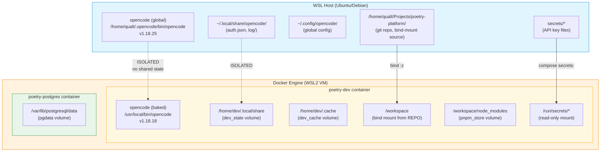

# ana037 — Docker Container Remake Plan (WSL + Global OpenCode Safety)

<!-- ANALYZER-OUTPUT-CONTRACT
schema-version: 1.0
agent: analyzer
claim-type: recommendation
evidence-source: Dockerfile.dev, docker-compose.yml, dev-entrypoint.sh, Makefile, git log
confidence: High
shelf-registration: memory-shelf.yaml (shelf.analyses), delegated to @memory-manager
-->

**Campaign ticket:** DIA-260821-x5nj
**Analysis ID:** ana037
**Date:** 2026-08-28
**Scope:** Stop + remake the `poetry-dev` / `poetry-postgres` container stack without affecting the host-WSL global opencode install.

---

## 1. Executive Summary

The user runs opencode **globally on WSL** (`/home/qualt/.opencode/bin/opencode`, v1.18.25, state at `~/.local/share/opencode`). The Docker dev container (`poetry-dev`) bakes its **own** opencode binary (v1.18.18, pinned in `Dockerfile.dev` line 29) into the image layer. These two installs are **completely isolated** — different binaries, different state dirs, different filesystems. Remaking the container (stop, prune, rebuild, restart) touches only the Docker layer and cannot affect the host WSL opencode.

**Verdict:** Safe to remake. The remake plan below is ordered, reversible, and preserves all stateful data (postgres volume, pnpm store, dev cache).

---

## 2. Architecture Diagram



**Key isolation points:**
- Host opencode binary: `/home/qualt/.opencode/bin/opencode` (WSL filesystem)
- Container opencode binary: `/usr/local/bin/opencode` (image layer, ephemeral)
- Host state: `~/.local/share/opencode/` (WSL filesystem, persistent)
- Container state: `/home/dev/.local/share/` (named volume `dev_state`, Docker-managed)
- No shared paths between the two opencode installs.

---

## 3. What Changed in the Docker Layer (Recent History)

### 3.1 Change Inventory (last 10 commits touching Docker artifacts)

| # | Commit | Change | Cache Impact | Risk |
|---|--------|--------|--------------|------|
| 1 | `ee1a298` DIA-260826-766f | Makefile uses engine-aware compose stack via `compose-env.sh` | None (Makefile only) | Low — `COMPOSE_FILE` now auto-selects `docker-compose.wsl.yml` on WSL |
| 2 | `d65102a` DIA-260825-wprb | Audit fix-all pass | None (no Docker changes) | None |
| 3 | `c19ed6b` DIA-260821-m7vk | **Align container UID/GID + migrate .git ownership at boot** | **HIGH** — `USER_UID`/`USER_GID` build args changed; entrypoint chown logic added | Medium — if host UID != 1000, image must rebuild with correct args |
| 4 | `37a3df4` DIA-260824-a3mk | **Fix `make opencode` PermissionDenied on root-owned opencode log** | **HIGH** — `USER` directive removed from Dockerfile; entrypoint now starts as root, drops via gosu | Medium — image MUST rebuild; old image has `USER dev` baked in |
| 5 | `69dcdaf` DIA-197 | Remove DCP plugin | None (no Docker changes) | None |
| 6 | `d174a89` DIA-210 | Remove `user: 0:0` from docker-compose.yml | Low (compose file only) | Low |
| 7 | `10ed051` DIA-188 | **OMO project-level declaration + opencode 1.18.18 + OMO bake in dev image** | **HIGH** — opencode binary install method changed (script -> direct binary + SHA256); OMO plugin pre-populated in image | Low — already baked into current image |
| 8 | `bcb8379` DIA-180-A | yaml-language-server enabler | Medium — new npm global install layer | Low |
| 9 | `4a6da0d` DIA-185 | Bake `git safe.directory=/workspace` into Dockerfile | Low — single RUN layer | Low |

### 3.2 Cache Invalidation Summary

The current running image (`poetry-platform-dev:latest`, 10.4GB, built 10 days ago) was built **before** commits `c19ed6b` (UID/GID alignment) and `37a3df4` (USER directive removal). These two changes **require a full image rebuild** — the running container is stale relative to the committed Dockerfile.

**Layers that invalidate cache on rebuild:**
- `apt-get install` (base system packages) — only if `Dockerfile.dev` RUN line changes
- Node.js binary download + SHA256 — pinned, won't change unless `NODE_VERSION` ARG changes
- **OpenCode binary download + SHA256** — pinned to 1.18.18, won't change unless `OPENCODE_VERSION` ARG changes
- **npm global install** (pnpm, bun, openspec, language servers) — changes if any version ARG changes
- **USER directive removal** (commit `37a3df4`) — **already committed but NOT in running image**
- **UID/GID build args** (commit `c19ed6b`) — **already committed but NOT in running image**
- **Entrypoint chown logic** (commit `c19ed6b`) — **already committed but NOT in running image**

**Conclusion:** The running container is missing 2 critical fixes. A `make up --build` (or `docker compose build dev && docker compose up -d`) is required.

---

## 4. WSL-Specific Considerations

### 4.1 Filesystem Mount Performance

| Path | Mount Type | Performance | Notes |
|------|-----------|-------------|-------|
| `/home/qualt/Projects/poetry-platform` -> `/workspace` | Bind mount (9p/virtiofs) | **Slow for many small files** | `node_modules` is a named volume (`pnpm_store`) to avoid this |
| `secrets/*` -> `/run/secrets` | Bind mount (read-only) | Fast (5 small files) | No performance concern |
| `pnpm_store:/workspace/node_modules` | Named volume (Docker-managed) | **Fast** | Native ext4 inside WSL2 VM |
| `dev_state:/home/dev/.local/share` | Named volume | Fast | Native ext4 |
| `dev_cache:/home/dev/.cache` | Named volume | Fast | Native ext4 |
| `pgdata:/var/lib/postgresql/data` | Named volume | Fast | Native ext4 |

**Key insight:** The bind mount (`:z`) is the only performance-sensitive path. The `pnpm_store` named volume overlay on `/workspace/node_modules` is the correct pattern — it keeps `node_modules` inside the Docker VM's native filesystem, avoiding the 9p/virtiofs overhead for the 50k+ files in `node_modules`.

### 4.2 WSL Memory/CPU Caps (DIA-207)

The `docker-compose.wsl.yml` override file exists but is currently a no-op (empty `dev: {}` service with commented-out memory limits). WSL2 auto-manages memory via a dynamic VM; Docker containers share the WSL2 VM's memory pool.

**Risk:** If the dev container + postgres + WSL host processes exceed the WSL2 VM's memory cap (default: 50% of Windows RAM), the OOM killer will terminate processes. The commented-out `deploy.resources.limits.memory: 8g` in `docker-compose.wsl.yml` is the escape hatch.

**For remake:** No action needed. The remake does not change memory behavior.

### 4.3 File Permission Mapping (Host WSL User vs Container Dev User)

| Host (WSL) | Container | Mapping |
|------------|-----------|---------|
| `qualt:qualt` (UID 1000, GID 1000) | `dev:dev` (UID `${USER_UID:-1000}`, GID `${USER_GID:-1000}`) | **Aligned** (commit `c19ed6b`) |
| `/home/qualt/Projects/poetry-platform/.git/` | `/workspace/.git/` | Bind mount; ownership migrated at boot by entrypoint `chown -R dev:dev /workspace/.git` |
| `/home/qualt/Projects/poetry-platform/secrets/` | `/run/secrets/` | Read-only mount; no ownership concern |

**Key fix (commit `c19ed6b`):** The entrypoint now runs `chown -R dev:dev /workspace/.git` at boot, so lint-staged / pre-commit hooks can write `.git/index` without EACCES. This fix is in the committed Dockerfile/entrypoint but **NOT in the running image** — another reason to rebuild.

### 4.4 OpenCode: Host Global vs Container Binary

| Aspect | Host WSL | Container |
|--------|----------|-----------|
| Binary path | `/home/qualt/.opencode/bin/opencode` | `/usr/local/bin/opencode` |
| Version | 1.18.25 | 1.18.18 (pinned in Dockerfile) |
| State dir | `~/.local/share/opencode/` | `/home/dev/.local/share/opencode/` (volume `dev_state`) |
| Config dir | `~/.config/opencode/` | `/home/dev/.config/opencode/` |
| Install method | Global install (opencode installer script) | Baked into Docker image (SHA256-verified binary download) |
| OMO plugin | Host-global `~/.cache/opencode/node_modules/oh-my-opencode-slim` | Pre-populated in image (`/home/dev/.cache/opencode/node_modules/`) |
| Affected by `docker compose down`? | **NO** | YES (ephemeral container, state in named volumes) |
| Affected by `docker system prune`? | **NO** | Image layer pruned; named volumes unaffected by `prune` (only by `down -v`) |

**Why container remake does NOT affect host global opencode:**
1. Different binary paths — host is `~/.opencode/bin/opencode`, container is `/usr/local/bin/opencode` (inside Docker image layer)
2. Different state dirs — host is `~/.local/share/opencode/` on WSL ext4, container is `/home/dev/.local/share/opencode/` on Docker named volume
3. Different config dirs — host is `~/.config/opencode/`, container is `/home/dev/.config/opencode/`
4. Docker operations (`compose down`, `system prune`, `volume rm`) only touch Docker-managed resources (images, containers, volumes, networks) — never the WSL host filesystem

### 4.5 Env Sharing (.env, Secrets Profile Hook DIA-260826-u27h)

- `.env` file at repo root: read by `docker-compose.yml` for `POSTGRES_USER`, `POSTGRES_PASSWORD`, `POSTGRES_DB`, port mappings, `USER_UID`, `USER_GID`. Not used by host opencode.
- `secrets/*` files: mounted read-only into container as `/run/secrets/*`. Host opencode reads these from `secrets/` directly (or from its own config). No shared runtime env.
- `/etc/profile.d/secrets.sh` (commit `37a3df4`): re-loads secrets for interactive `docker compose exec` login shells. Container-only.

---

## 5. Risk Assessment

| Risk | Severity | Likelihood | Mitigation |
|------|----------|------------|------------|
| **Postgres data loss** (`pgdata` volume wiped) | **Critical** | Low | Use `make down` (NOT `make clean`) unless volume wipe is intentional. `make clean` = `docker compose down -v` which DELETES all named volumes. |
| **pnpm store loss** (`pnpm_store` volume wiped) | Medium | Low | Same as above. Loss means `make install` must re-download all packages (~2-5 min). |
| **Dev state/cache loss** (`dev_state`, `dev_cache` volumes wiped) | Medium | Low | Same. Loss means opencode logs, plugin cache, mise state must rebuild. |
| **Orphan volumes** (old volumes not attached to new container) | Low | Low | `docker volume ls` before/after; `docker volume prune` only if intentional. |
| **Stale image** (old image not replaced) | Medium | Medium | `docker compose build dev` (or `make up --build`) forces rebuild. |
| **Disk space exhaustion on WSL** (old image + new image = 2x 10.4GB) | Medium | Medium | `docker image prune` after successful remake reclaims ~10GB. |
| **Env drift** (`.env` not read correctly) | Low | Low | `docker compose config --quiet` validates compose file + env interpolation. |
| **Host opencode accidentally affected** | Critical | **Impossible** | Different binary, different state dir, different filesystem. Docker operations cannot touch WSL host paths. |
| **Build failure** (SHA256 mismatch, network error) | Medium | Low | Dockerfile uses SHA256-verified downloads; build fails loudly. Re-run `make build`. |
| **Entrypoint chown failure** (UID mismatch) | Medium | Low | Entrypoint uses `|| true` on chown — boot continues even if chown fails. |

---

## 6. Remake Plan — Step-by-Step

### 6.1 Pre-Flight Checks

```bash
# 1. Verify git working tree is clean (no uncommitted Docker-related changes)
git status --short
# Expected: empty output, or only non-Docker files modified.
# If Dockerfile.dev / docker-compose.yml / dev-entrypoint.sh have uncommitted changes,
# either commit them or stash them before proceeding.

# 2. Verify current container state
docker compose ps
# Expected: poetry-dev (Up, healthy), poetry-postgres (Up, healthy)

# 3. Record current volumes (for rollback reference)
docker volume ls | grep poetry-platform
# Expected: pgdata, pnpm_store, dev_state, dev_cache

# 4. Record current image size
docker images poetry-platform-dev:latest
# Expected: ~10.4GB

# 5. Verify host opencode is unaffected (baseline)
opencode --version
# Expected: 1.18.25 (or whatever host version)
```

### 6.2 Stop Containers (Preserve Volumes)

```bash
# 6. Stop containers WITHOUT wiping volumes
#    `make down` = `docker compose down` (no -v flag)
#    This stops + removes containers but KEEPS named volumes (pgdata, pnpm_store, dev_state, dev_cache)
make down

# Verify containers stopped
docker compose ps
# Expected: empty output (no containers)

# Verify volumes still exist
docker volume ls | grep poetry-platform
# Expected: all 4 volumes still present
```

**Decision point: `make down` vs `make clean`**
- `make down` = `docker compose down` — stops containers, keeps volumes. **Use this.**
- `make clean` = `docker compose down -v` — stops containers AND DELETES all named volumes. **Only use this if you want to wipe postgres data, pnpm store, and dev cache.** This is a destructive operation.

### 6.3 Prune Old Image (Reclaim Disk Space)

```bash
# 7. Remove the old (stale) image to free ~10GB
#    The image is not in use (containers are stopped), so this is safe.
docker rmi poetry-platform-dev:latest

# Verify image removed
docker images poetry-platform-dev:latest
# Expected: "No such image" or empty output
```

**Optional: broader prune** (if WSL disk is tight)
```bash
# Remove all dangling images (not just poetry-platform-dev)
docker image prune -f

# Remove all unused volumes (CAREFUL: only if you want to wipe ALL orphaned volumes)
# docker volume prune -f   # DO NOT RUN unless you want to delete pgdata etc.
```

### 6.4 Rebuild Image

```bash
# 8. Rebuild the dev image from the current Dockerfile.dev
#    This picks up commits c19ed6b (UID/GID alignment) and 37a3df4 (USER directive removal)
make build
# Equivalent: docker compose build dev

# Verify new image built
docker images poetry-platform-dev:latest
# Expected: new image ID, size ~10GB, created "Just now"
```

**Build time estimate:** 5-15 minutes depending on network (downloads Node, opencode, Rust toolchain, Playwright, etc.) and cache state. The build is mostly cacheable — only the UID/GID ARG change and entrypoint COPY will invalidate the final layers.

### 6.5 Start New Containers

```bash
# 9. Start the stack with the new image
#    Volumes are reused (pgdata, pnpm_store, dev_state, dev_cache all still exist)
make up
# Equivalent: docker compose up -d

# Verify containers are running and healthy
docker compose ps
# Expected: poetry-dev (Up, healthy), poetry-postgres (Up, healthy)
# Ports: 0.0.0.0:9000->9000, 0.0.0.0:8000->8000, 0.0.0.0:3000->3000
```

### 6.6 Post-Flight Verification

```bash
# 10. Verify container shell works
make shell
# Inside container:
whoami          # Expected: dev
id              # Expected: uid=1000(dev) gid=1000(dev)
opencode --version  # Expected: v1.18.18
git status      # Expected: clean (no ownership errors on .git/)
exit

# 11. Verify config validation passes
make test-config
# Expected: exit 0 (all validators pass)

# 12. Verify host opencode is STILL UNAFFECTED
opencode --version
# Expected: 1.18.25 (same as pre-flight, unchanged)

# 13. Verify postgres data survived
docker compose exec postgres psql -U poetry -d poetry -c "SELECT count(*) FROM pg_tables;"
# Expected: some number > 0 (your tables are still there)

# 14. Verify pnpm store survived
make shell
# Inside container:
ls /workspace/node_modules/ | head
# Expected: package dirs present (not empty)
exit
```

---

## 7. Before / After Checklist

### Before Remake
- [ ] `git status --short` — working tree clean (or only non-Docker files modified)
- [ ] `docker compose ps` — both containers Up, healthy
- [ ] `docker volume ls | grep poetry-platform` — 4 volumes present (pgdata, pnpm_store, dev_state, dev_cache)
- [ ] `opencode --version` — host opencode works (record version, e.g., 1.18.25)
- [ ] `docker images poetry-platform-dev:latest` — record current image ID + size (~10.4GB)
- [ ] (Optional) Back up postgres: `docker compose exec postgres pg_dump -U poetry poetry > backup.sql`

### After Remake
- [ ] `docker compose ps` — both containers Up, healthy
- [ ] `docker images poetry-platform-dev:latest` — new image ID, size ~10GB
- [ ] `docker volume ls | grep poetry-platform` — same 4 volumes present (not wiped)
- [ ] `make shell` → `whoami` = `dev`, `id` = uid=1000, `opencode --version` = v1.18.18
- [ ] `make shell` → `git status` works (no .git ownership errors)
- [ ] `make test-config` — exit 0
- [ ] `opencode --version` on host — same version as before (e.g., 1.18.25), unchanged
- [ ] `docker compose exec postgres psql -U poetry -d poetry -c "SELECT count(*) FROM pg_tables;"` — tables intact
- [ ] `make shell` → `ls /workspace/node_modules/` — packages present

---

## 8. Rollback Plan (If Remake Fails)

### Scenario A: Build Fails

```bash
# Build failed (SHA256 mismatch, network error, etc.)
# Old image was already removed. Rebuild from scratch:
make build
# If network issue, retry. If SHA256 mismatch, check Dockerfile.dev ARG versions.
# If persistent failure, restore old image from git:
#   git checkout HEAD~5 -- Dockerfile.dev  # revert to known-good Dockerfile
#   make build
```

### Scenario B: Container Starts But Unhealthy

```bash
# Container is Up but not healthy after 30s
# Check logs:
docker compose logs dev | tail -50
# Common causes:
#   - Entrypoint chown failure (UID mismatch) — check USER_UID/USER_GID in .env
#   - Secrets mount failure — check secrets/* files exist and are non-empty
#   - Port conflict — check `ss -tlnp | grep 9000` on host

# Rollback: stop container, restore old image if needed
make down
# If old image was pruned, rebuild from previous Dockerfile:
#   git stash  # save any uncommitted changes
#   git checkout HEAD~5 -- Dockerfile.dev docker-compose.yml dev-entrypoint.sh
#   make build
#   make up
#   git stash pop  # restore uncommitted changes
```

### Scenario C: Postgres Data Lost (Only if `make clean` was accidentally run)

```bash
# If `make clean` was run (volumes wiped), postgres data is gone.
# Recovery: restore from backup (if pre-flight backup was taken)
docker compose up -d postgres
sleep 5
docker compose exec -T postgres psql -U poetry -d poetry < backup.sql
```

### Scenario D: Host OpenCode Broken (Impossible, but for completeness)

```bash
# This CANNOT happen from Docker operations. But if it did:
# Host opencode is at ~/.opencode/bin/opencode — reinstall:
curl -fsSL https://opencode.ai/install | bash
# Or restore from git:
#   git checkout -- ~/.opencode/  # if it was tracked (it shouldn't be)
```

---

## 9. Decision Matrix: `make down` vs `make clean`

| Scenario | Command | Volumes | Postgres Data | pnpm Store | Dev Cache |
|----------|---------|---------|---------------|------------|-----------|
| **Normal remake (recommended)** | `make down` | **Kept** | **Preserved** | **Preserved** | **Preserved** |
| Full wipe + fresh start | `make clean` | **Deleted** | **Lost** | **Lost** (re-download on `make install`) | **Lost** (rebuild on next opencode run) |
| Remake + prune disk | `make down` + `docker image prune` | **Kept** | **Preserved** | **Preserved** | **Preserved** + ~10GB freed |

**Recommendation:** Use `make down` (preserve volumes). Only use `make clean` if you explicitly want to wipe all state and start fresh.

---

## 10. Summary of Plan Steps (Quick Reference)

```
1. git status --short                          # verify clean tree
2. docker compose ps                           # record current state
3. docker volume ls | grep poetry-platform     # record volumes
4. opencode --version                          # record host opencode version
5. make down                                   # stop containers, KEEP volumes
6. docker rmi poetry-platform-dev:latest       # remove old image (~10GB freed)
7. make build                                  # rebuild image (5-15 min)
8. make up                                     # start new containers
9. docker compose ps                           # verify Up + healthy
10. make shell                                 # verify: whoami=dev, opencode --version=v1.18.18
11. make test-config                           # verify config validation passes
12. opencode --version                         # verify host opencode UNCHANGED
13. docker compose exec postgres psql ...      # verify postgres data intact
```

**Total estimated time:** 10-20 minutes (mostly build time).
**Disk space required during remake:** ~20GB (old image + new image coexist briefly if you skip step 6; if you do step 6 first, only ~10GB for new image).
**Risk of data loss:** None (if `make down` is used, not `make clean`).
**Risk to host opencode:** Zero (completely isolated).
