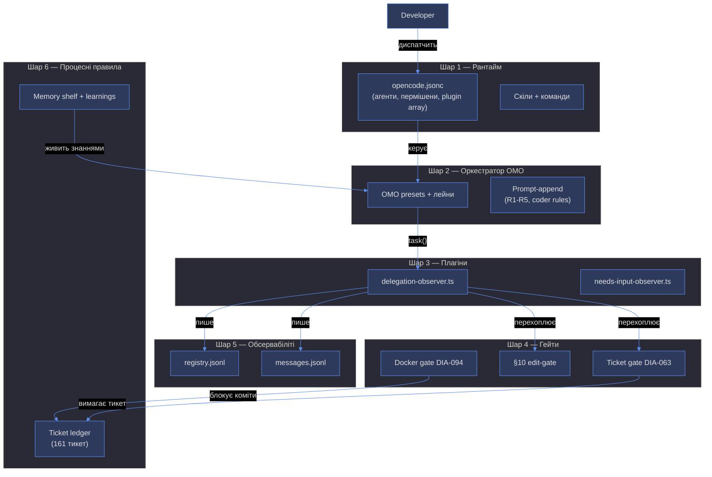
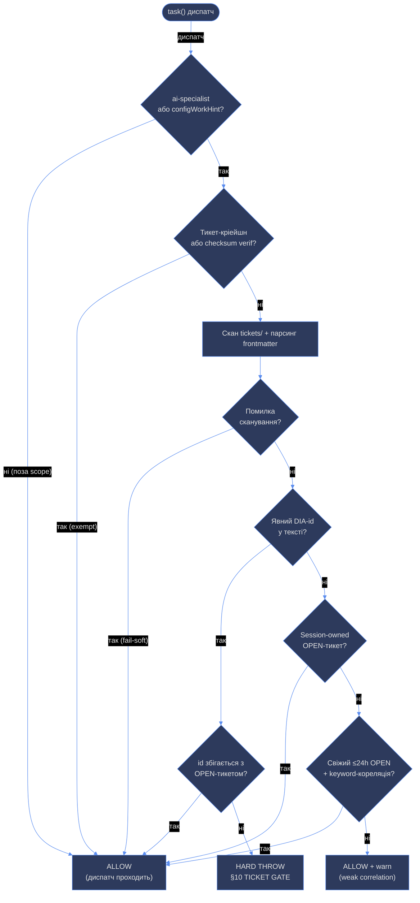
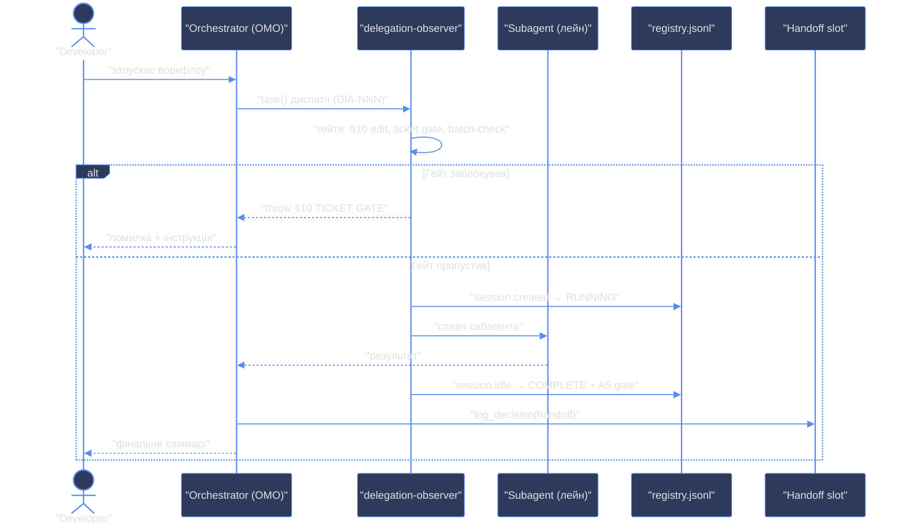

# Агентний харнес poetry-platform — як виконуються воркфлоу

> Навчальний конспект (tch001). Мета: зрозуміла ментальна модель того, як
> диспатчі агентів проходять крізь гейти, пишуться в логи і завершуються
> хендоффом. Факти звірені з `delegation-observer.ts`, AGENTS.md,
> `practice-protected.md` (2026-08-17).

---

## 1. Ментальна модель

Уяви **диспетчерську залізниці**:

- **OpenCode** — це сама залізниця: рейки, поїзди, розклад. Рантайм, який
  вміє запускати агентів і давати їм інструменти.
- **oh-my-opencode-slim (OMO)** — диспетчер: знає, який поїзд (агент) куди
  їде, який маршрут (лейн) і які правила (prompt-append).
- **Плагіни** — контролери на дверях: перевіряють квитки (тикети), не
  пускають без дозволу (гейти), записують кожен прохід у журнал (логи).
- **Тикети (DIA-NNN)** — квитки. Без квитка контролер не пускає на роботу.

**Що це НЕ таке:** гейти — не LLM-судження і не "побажання". Це
детерміністичний Node.js-код у плагіні: regex по тексту диспатча + скан
файлової системи + порівняння статусів. Однаковий вхід → однаковий вихід.

**Ключова ідея:** кожен диспатч сабагента (`task()`) проходить крізь
хук `tool.execute.before` плагіна `delegation-observer.ts`, де стріляють
гейти. Гейт може **пропустити**, **пропустити з попередженням** або
**жорстко заблокувати** (throw → диспатч не відбувається).

---

## 2. Шар 1 — Рантайм OpenCode

| Елемент | Що це | Де живе |
|---|---|---|
| `opencode.jsonc` | Головний конфіг: агенти, пермішени, plugin array | `.opencode/opencode.jsonc` |
| Агенти | Визначення лейнів (ролей) | `.opencode/agents/*.md` + OMO |
| Скіли | Інструкції-воркфлоу (tdd-craftsman, teaching, mermaid...) | `.opencode/skills/*/SKILL.md` |
| Команди | `/команди` (opsx-*, rag) | `.opencode/commands/` |
| Пермішени | Що агенту можна: edit/bash/task | `opencode.jsonc` permission rules |

Три тири пермішенів агентів (practice-protected.md §7):

| Тип | Права | Приклади |
|---|---|---|
| **pure-analyst** | тільки читання | @architector, @ai-specialist, @reviewer |
| **artifact-producer** | Write+Bash, обмежено `knowledge/` | @analyzer, @conspecter, @openspec-plan |
| **executor** | повний Write+Bash | @coder, @designer |

Правило: pure-analyst ніколи не пише файли — якщо його висновок треба
зберегти, оркестратор делегує транскрипцію executor'у.

---

## 3. Шар 2 — Оркестратор OMO

OMO — це плагін-оркестратор (oh-my-opencode-slim@2.2.14), який визначає
**лейни** (ролі агентів) і **пресети** (модельні конфігурації).

- **Presets:** `opencode-go`, `cebula`, `free` — набори моделей для лейнів.
- **Агенти OMO:** coder, coder-escalated, analyzer-escalated, architector,
  conspecter, analyzer, openspec-plan, ai-specialist, ai-auditor,
  resource-manager, reviewer, memory-manager.
- **Вимкнені** (disabled_agents): oracle, fixer, explorer, librarian —
  нативні аліаси OMO, перейменовані в C4-пасі.
- **Prompt-append файли** — додаткові правила, які підмішуються в промпт
  агента:
  - `orchestrator_append.md` — правила оркестратора **R1-R5**:
    - **R1** — кожен диспатч і resume-промпт МАЄ нести літеральний токен
      тикета (`DIA-NNN`). Це те, що перевіряє DIA-063 гейт.
    - **R2** — дизайн @architector персиститься в тикет/`.sdd` до імплементації.
    - **R3** — merge-фаза стартує тільки з записаним `docker compose ps`
      (dev-сервіс Up) у merge-репорті.
    - **R4** — RED (тести) і GREEN (імплементація) одного слайса — РІЗНІ
      інстанси coder (DIA-175).
    - **R5** — fix-лупи реюзають ТОЙ САМИЙ інстанс coder, що писав код.
  - `coder_append.md` — branch-ownership модель (5 обов'язкових фраз для
    паралельних coder-ів у worktree).

---

## 4. Шар 3 — Плагіни (харнес)

Два плагіни реєструються в `opencode.jsonc` plugin array:

### delegation-observer.ts — головний

Хук-поверхня (реальні шейпи @opencode-ai/plugin):

| Hook | Що робить |
|---|---|
| `tool.execute.before` | **Гейти**: §10 edit-gate, §10 ticket gate (DIA-063), batch-dispatch check (A1) |
| `tool.execute.after` | Захоплення `task_id` з результату task() (A2) + edit-time prettier (DIA-105, non-fatal) |
| `event` | Життєвий цикл сесій: `created`→RUNNING, `idle`→COMPLETE + A5 gate + S6, `error`→FAILED + A3 |
| `experimental.session.compacting` | Ін'єкція снапшота registry, щоб делегації пережили компакцію контексту |

### needs-input-observer.ts

Допоміжний — спостерігає за потребою у вводі користувача.

### Архітектура харнеса (M1)



---

## 5. Шар 4 — Гейти (найважливіше)

Гейти — це **енфорсмент-інваріанти воркфлоу**. Вони можуть блокувати
диспатчі/редагування там, де контракт процесу це вимагає (ADR у
`.opencode/memory/adr.md`).

| Гейт | Де живе | Що блокує |
|---|---|---|
| **DIA-063 ticket gate** | плагін, `tool.execute.before` | диспатч §10-лейна без валідного тикета |
| **§10 edit-gate** | плагін, `tool.execute.before` | редагування `.opencode/*` без ai-specialist gate |
| **DIA-094 docker gate** | husky pre-commit | коміт без запущеного dev-контейнера (hard-fail) |
| **A5 quality gate** | плагін, `event` (idle) | завершення сесії без структурованого фінального повідомлення |
| **S2 status transitions** | плагін | некоректні переходи статусів (forward-only) |
| **Merge-gate (R3)** | оркестратор | merge без записаного `docker compose ps` (dev Up) |

### 5.1 Ticket gate (DIA-063) — детальний розбір

**Принцип:** "жодна §10-робота не починається без DIA-тикета". §10 = робота
над AI-тулінгом (конфіг, агенти, скіли, плагіни, пермішени).

**Decision tree (M2):**



**Кроки (notional machine — що реально відбувається):**

1. **Scope.** Гейт вмикається тільки якщо `subagent_type === "ai-specialist"`
   АБО текст диспатча сигналить про конфіг-роботу (`configWorkHint`:
   `/opencode\.jsonc|AGENTS\.md|skill|plugin/i` **І**
   `/config|edit|change|implement|modify|update|gate|review|fix/i`).
   Звичайні лейни (code-navigator, researcher, coder) — поза scope.
   `.opencode\/` навмисно ВИКЛЮЧЕНО з першого regex: `.opencode/session/*`
   і `.opencode/learnings/*` — рантайм-артефакти, не конфіг (DIA-076 A3).

2. **Exempt.** Пропускаються без перевірки лише:
   - диспатчі на **створення** тикета (`create a ticket`, `new ticket`,
     `ticket creation`, `author ticket`) — інакше deadlock: щоб створити
     тикет, треба тикет;
   - механічна boot-перевірка чексум (`checksum verif`, `handoff integrit`)
     — теж проти deadlock'у на старті сесії (DIA-061/DIA-075).

3. **Скан.** Читається `docs/dev-infra-audit/tickets/*.md`, парситься
   YAML-frontmatter (status, session_id, discovered, title). Статуси, які
   вважаються "роботою в процесі": **OPEN, IN-PROGRESS, DISPATCHED**.

4. **Кореляція** — три шляхи, перший збіг виграє:
   - **Path 1 (строгий tri-state):** у тексті є `DIA-\d+` → має збігтися з
     OPEN-тикетом. Якщо явний id є — резолвиться ТІЛЬКИ проти нього, без
     fallthrough на Path 2/3. Це найсильніший сигнал.
   - **Path 2:** немає DIA-id → OPEN-тикет, чий `session_id` = поточна сесія
     (recency не важлива).
   - **Path 3:** немає id і session-owned → свіжий (≤24h) OPEN-тикет, чий
     title корелює з текстом диспатча за keywords (стоп-слова виключені).

5. **Рішення:**
   - **Немає DIA-id взагалі** → слабка кореляція → `warn + allow` (рядок
     `ticket_gate_weak_correlation` у registry). Не блокує.
   - **DIA-id є, але жоден не збігся з OPEN-тикетом** → **HARD THROW**
     `"§10 TICKET GATE: No correlating DIA ticket found..."` → диспатч
     реально блокується (плагін ре-throw'ить помилки з префіксом
     `§10 TICKET GATE:`).
   - **Помилка сканування** (відсутня директорія, битий frontmatter) →
     `warn + allow` + рядок `ticket_gate_scan_failed`. Принцип: *зламаний
     гейт гірший за відсутній гейт* — але це стосується тільки
     інфраструктурних помилок, не самого порушення.

**Чому детерміністичний?** Чистий Node.js: regex по тексту + fs-скан +
порівняння статусів. Історично був недетермінізм (DIA-063 finding C:
`discovered` парсився як дата → локальна північ → різкий 24h-обрив recency;
той самий диспатч проходив, а через 9 хвилин блокувався). Полагоджено
фіксом DIA-076 C1 (tri-state explicit-id precedence): явний id тепер
резолвиться тільки проти OPEN-тикетів, без recency/session-вимог. Єдина
змінна, що лишилась, — стан файлової системи (тикети змінюються), а не час.

---

## 6. Шар 5 — Обсервабіліті

| Артефакт | Що це | Хто пише |
|---|---|---|
| `registry.jsonl` | Реєстр делегацій: кожен task() spawn→complete/fail | плагін (хуки) |
| `messages.jsonl` | Семантичний лог подій: делегації, рішення, хендофи, кризи | плагін + `log_decision` tool |
| `messages.md` | **Похідне в'ю** з messages.jsonl (ніколи не редагується вручну) | `scripts/session-log render` |
| `handoffs/<session-id>.json` | Пер-сесійний хендофф-слот (DIA-085, захист від last-writer-wins) | `log_decision(handoff)` |
| `handoffs/active.json` | Пойнтер на активний хендофф | плагін |
| `boot.json`, `ticker.json` | Boot-події, тікер стану | плагін |

**Інструменти оркестратора:**
- `log_decision(event_type, task_ref, resolution_status, ...)` — компактний
  запис рішень/хендофів/криз у messages.jsonl. Механічні делегації
  логуються хуками автоматично — їх НЕ треба логувати вручну.
- `context_usage(scope)` — оцінка використання контекстного вікна
  (primary: прямий підрахунок токенів останнього повідомлення; fallback:
  activity-signal proxy з registry.jsonl).

**Хендофф (DIA-124, hard rule):** хендофф пишеться через
`log_decision(handoff)` **ДО** фінального саммарі сесії — ніколи після,
ніколи "якщо буде час". Фінальне саммарі посилається на хендофф.

---

## 7. Шар 6 — Процесні правила

### 7.1 Workflow chain (M4)

```mermaid
%%{init: {'theme': 'base', 'themeVariables': {'darkMode': true, 'background': '#1e1e2e', 'primaryColor': '#2d3a5c', 'primaryTextColor': '#e0e0e0', 'primaryBorderColor': '#5b8def', 'lineColor': '#5b8def', 'secondaryColor': '#3d3520', 'tertiaryColor': '#2a2a36', 'signalColor': '#5b8def', 'signalTextColor': '#e0e0e0', 'labelTextColor': '#e0e0e0', 'noteTextColor': '#e0e0e0', 'noteBkgColor': '#3d3520', 'actorLineColor': '#5b8def', 'actorBorderColor': '#5b8def', 'actorBkg': '#2d3a5c', 'actorTextColor': '#e0e0e0', 'sequenceNumberColor': '#e0e0e0', 'activationBorderColor': '#5b8def', 'activationBkgColor': '#2d3a5c'}}}%%
flowchart LR
    SP["openspec-plan\n(proposal/design/tasks)"]
    TR["coder RED\ntest-author"]
    TI["coder GREEN\nimplementer\n(інший інстанс)"]
    RV["reviewer\n(дві осі: Standards\n+ Spec fidelity)"]
    DEC{"Знайдення?"}
    FX["coder fix\n(той самий інстанс)"]
    RR["re-review\n(макс 2 цикли)"]
    PM["memory-manager\n(persist ADR/lessons)"]
    SP -->|"spec"| TR
    TR -->|"тести"| TI
    TI -->|"код + верифікація"| RV
    RV --> DEC
    DEC -->|"ні"| PM
    DEC -->|"так"| FX
    FX -->|"fix + докази"| RR
    RR -->|"verified-closed"| PM
    RR -->|"still-open"| FX
```



Ключові правила ланцюга:

- **Spec → Implementation:** `openspec-plan` (Socratic, practice-protected)
  → `@coder` (tdd-craftsman, вертикальні слайси) → `@reviewer` (дві осі:
  Standards + Spec fidelity).
- **Instance separation (DIA-175):** RED (тести) і GREEN (імплементація)
  одного слайса — РІЗНІ coder-інстанси. Тест-автор ніколи не імплементує
  слайс, який тестував.
- **Same-session fixes (DIA-175):** fix-лупи реюзають ТОЙ САМИЙ інстанс
  coder (resume по task_id/session_id) — фікси потребують контексту
  імплементера.
- **Re-review loop:** макс 2 цикли fix→re-review. Після циклу 2 — ескалація
  до розробника (accept residual risk / manual fix / abort).
- **Coder handoff** зобов'язаний містити докази верифікації: exit codes +
  summary lines тестів/лінта/тайпчека.

### 7.2 Practice-protected zones

Зони, де агент МАЄ ставити питання і чекати на чернетку користувача:

1. OpenSpec proposal.md / design.md authoring
2. TDD edge-case identification
3. Архітектурні рішення, флагнуті @architector
4. Review disposition (розробник вирішує accept/reject)
5. Research persistence decision (persist/skip/partial)
6. Grilling gate (DIA-104) — розробник володіє ВІДПОВІДЯМИ, агент структурує

### 7.3 Ticket ledger

- `docs/dev-infra-audit/tickets/` — 161 тикет, формат `DIA-NNN-<slug>.md`
  (YAML frontmatter: status, session_id, discovered, title).
- Додавання: копія `_TEMPLATE.md` → `DIA-<NNN>-<slug>.md`, заповнити
  frontmatter, додати рядок в index (README.md), оновити лічильники.
- Статуси для гейта: OPEN / IN-PROGRESS / DISPATCHED.

### 7.4 Memory shelf + learnings

- `.opencode/memory-shelf.yaml` — центральний індекс знань (conspects,
  analyses, architectures, rag_bases).
- `.opencode/learnings/` — динамічний досвід (external-patterns/).
- `.opencode/memory/` — ADR, lessons, failures, repo facts.
- Конвенція імен: `knowledge/<type><id>-<topic>/` (res/ana/tch префікси).

---

## 8. Життєвий цикл диспатча — worked example

### M3: sequence diagram



### Приклад 1 (annotated): кейс DIA-194 — блок

Що сталося в реальній сесії:

```
Ai-Specialist Task — DIA-194 ai-specialist gate        ← перший диспатч
Ai-Specialist Task — DIA-194 ai-specialist gate retry  ← ретрай з токеном
§10 TICKET GATE: No correlating DIA ticket found       ← HARD THROW
Code-Navigator Task — Check DIA-194 ticket exists      ← перевірка
```

Розбір по кроках:

1. Оркестратор диспатчить `ai-specialist` — це **primary trigger** гейта
   (subagent_type === "ai-specialist"), scope пройдено.
2. Диспатч не є тикет-кріейшном і не checksum-верифікацією — exempt не
   спрацював.
3. У тексті ретрая є явний `DIA-194` → **Path 1 (строгий tri-state)**.
4. Скан `docs/dev-infra-audit/tickets/` не знайшов DIA-194 зі статусом
   OPEN (файл відсутній, або статус CLOSED/ARCHIVED).
5. Явний id, що не резолвиться в OPEN-тикет → **HARD THROW**. Диспатч
   заблоковано. Оркестратор пішов перевіряти наявність файлу тикета.

**Чому це правильно:** lessons.md L20260815-012 — "closing a parent before
deferred deliverables dispatch requires a follow-up ticket". Якщо батьківський
тикет закрито, а відкладені deliverable ще треба диспатчити — потрібен
новий (follow-up) тикет.

### Приклад 2 (counterexample): як пройти гейт

Правильний диспатч §10-роботи:

```
1. Створити тикет: DIA-195-<slug>.md (status: OPEN) через docs lane
   (копія _TEMPLATE.md + рядок в index).
2. Диспатч з літеральним токеном: "DIA-195: dispatch ai-specialist
   for section 2.5 research gate".
3. Гейт: scope ✓ → exempt ✗ → Path 1: DIA-195 ∈ OPEN → ALLOW.
```

**Контрприклад (що НЕ працює):** диспатч без DIA-id взагалі — пройде з
warn (weak correlation), але це не "прохід", а жовтий прапорець у registry.
Диспатч з id закритого тикета — жорсткий блок.

---

## 9. Перевірка розуміння

1. **Питання:** диспатч несе `DIA-190`, але тикет DIA-190 має статус
   `CLOSED`. Що зробить гейт? *(Відповідь: HARD THROW — явний id, що не
   резолвиться в OPEN-тикет, блокує. Path 2/3 недосяжні — tri-state.)*

2. **Питання:** диспатч `code-navigator` для рекону коду без жодного
   DIA-id. Що зробить гейт? *(Відповідь: нічого — поза scope. Гейт
   вмикається тільки для ai-specialist або configWorkHint.)*

3. **Питання:** чому диспатч на створення тикета exempt? *(Відповідь:
   інакше deadlock — щоб створити тикет, треба вже мати тикет.)*

4. **Питання:** що станеться, якщо директорія `tickets/` зникне?
   *(Відповідь: fail-soft — warn + allow + рядок `ticket_gate_scan_failed`.
   Зламаний гейт гірший за відсутній гейт.)*

---

## 9. Дизайн-філософія: чому енфорсмент працює

### 9.1 Ключовий принцип: гейтинг на межі tool-call

Плагін **не читає і не блокує вільний текст відповіді моделі**. Він перехоплює **виклик інструмента** (`task()`, `edit`, `write`) на хук-межі `tool.execute.before` і валідує **аргументи цього виклику** — текст диспатча, шлях файлу, тип сабагента.

```
Думковий процес (вільний текст)  →  НЕ контролюється, НЕ читається
        │
        ▼
Tool-call аргументи (диспатч, edit)  →  ГЕЙТ: regex + fs-скан + статуси
        │
        ▼
Виконання (спавн сабагента, запис файлу)  →  блокується throw'ом
```

Модель може думати що завгодно — але **зробити** може тільки те, що пройшло детерміністичну перевірку на межі виконання. Це як компілятор: він не розуміє наміру програми, але жорстко енфорсить структурні інваріанти.

### 9.2 Як це скеровує думковий процес — непрямо

Скеровування відбувається через **зворотний зв'язок**, а не через читання думок:

1. **Промпт-рівень (м'який):** AGENTS.md, prompt-append R1-R5, скіли — формують процес мислення, але це поради, модель може їх ігнорувати.
2. **Дія-рівень (жорсткий):** гейт вимагає патерн (напр. токен `DIA-NNN` у диспатчі). Модель швидко вчиться: не вставив токен → диспатч впав з помилкою → треба переробити. **Вимога патерна індукує процесну дисципліну.**

### 9.3 Три принципи працюючого гейта

| Принцип | Приклад у харнесі |
|---|---|
| **Консервативна поверхня розпізнавання** — гейт навмисно тупий (regex, keywords, frontmatter), бо має бути детерміністичним і тестованим | `keywordsCorrelate` — стоп-слова + підрядок, не NLP |
| **Fail-soft vs hard-throw** — гейт розрізняє "інфраструктура зламана" (allow + warn) і "контракт порушено" (block) | `ticket_gate_scan_failed` vs `§10 TICKET GATE` |
| **Гейт сам покритий тестами** — зміна поведінки гейта ламає CI | `scripts/test-ticket-gate.sh` (6/6) у `make test-config` |

### 9.4 Біологічні аналогії (і їхні межі)

#### Аналогія 1: Lock-and-key (нейромедіатор → рецептор)

| Біологія | Харнес |
|---|---|
| Пресинаптична клітина випускає медіатор (ключ) | Оркестратор формує диспатч (текст з токеном) |
| Постсинаптичний рецептор — "ідеальний замок" | Гейт — детерміністична перевірка патерна |
| Зв'язування специфічне: тільки свій ліганд | Тільки диспатч з валідним `DIA-NNN` проходить |
| Зв'язування — фізична подія, не "інтерпретація" | Перевірка — код, не судження |
| Зв'язування запускає каскад трансдукції | Прохід запускає спавн сабагента |
| **Антагоніст**: молекула, що блокує рецептор | Диспатч з id закритого тикета → hard-throw |
| **Частковий агоніст**: слабкий сигнал | Fail-soft warn+allow — пропускає, але пише registry row |

**Де аналогія ламається:**
- Рецептор розпізнає форму молекули (семантика просторової структури); гейт розпізнає синтаксис (regex по рядку). Гейт — це **сканер штрих-коду**, не молекулярне впізнавання.
- У біології зв'язування = сам сигнал. У харнесі патерн — передумова сигналу, не сигнал. Модель думає що завгодно (нейромедіатор "думки" ніхто не блокує) — блокується тільки вихід на межі.
- "Fingerprint" — це не біометричний відбиток (унікальна особа), а **стандартизований квиток зі штрих-кодом**. Гейт не впізнає "особу" диспатча — він перевіряє наявність валідного коду.

#### Аналогія 2: Гормон → каскад (LH → овуляція)

**Точно:** мала специфічна подія запускає великий детерміністичний каскад. LH-сплеск → овуляція; `DIA-NNN` у тексті → спавн сабагента → registry → результати. **Ампліфікація** — ключове слово.

**Відмінність:** гормони — broadcast (усі клітини з рецептором реагують одночасно). Гейт — point-to-point (перевіряється конкретний tool-call, не весь потік). І гормон — це тригер; гейт — це **дозвіл**. Тригер — сам виклик `task()`, гейт — перевірка "чи можна".

#### Аналогія 3: GraphQL schema validation

**Точно:** є схема (структура tool-call аргументів: `subagent_type`, `description`, `prompt`), є валідація (гейт перевіряє патерни), є резолвер (сабагент виконує роботу), є відповідь (результат). Детерміністична валідація перед виконанням — саме це.

**Відмінність:** GraphQL валідує **структурований** запит проти формальної схеми. Гейт витягує патерни з **неструктурованого** тексту (regex по промпту). Це не schema validation — це **pattern extraction з free-form тексту на trust boundary**. Більше схоже на gRPC з protobuf, але контракт тут — не формальна схема, а набір патернів, які гейт шукає в тексті.

### 9.5 Реальний механізм (простіший за аналогії)

```
Неструктурований текст (промпт)  →  Pattern extraction (regex)  →  Детерміністичне рішення (allow/block)
```

Гейт не "розуміє" диспатч. Він шукає в тексті маркери (`DIA-\d+`, `config|edit|change`, `create.*ticket`) і порівнює їх зі станом файлової системи (тикети OPEN/CLOSED). Це **сканер штрих-кодів**, не GraphQL-валідатор і не гормональний рецептор.

**Але аналогії корисні**, бо показують **наслідок**: мала структурована подія → великий детерміністичний каскад. І саме тому система стабільна — рецептор (гейт) не втомлюється, не "інтерпретує", не має настрою. Він або зв'язав ліганд, або ні.

---

## 10. Event-driven orchestration через плагін-роутер

### 10.1 Поточний стан: delegation-observer як REST API

delegation-observer вже має **5 "ендпоїнтів"** (хуків), кожен зі своєю схемою розпізнавання:

| "Ендпоїнт" (хук) | Схема | Детермінований процес |
|---|---|---|
| `tool.execute.before` + ai-specialist | config hint + DIA-id | Ticket gate (Path 1/2/3) |
| `tool.execute.before` + edit | filePath | Prettier (non-fatal) |
| `session.created` | session metadata | RUNNING -> registry row |
| `tool.execute.after` + task | task_id + subagent_type | Registry row |
| `tool.execute.after` + log_decision | event_type=handoff | Handoff slot write |

Кожен ендпоїнт: pattern -> gate -> процес. Але гейти **тільки блокують/дозволяють** — не тригерять каскади.

### 10.2 Один великий плагін як event-driven router

**Принцип міжклітинної комунікації:** клітина випускає ліганд, інша має рецептор-замок. Зв'язування -> детермінований каскад.

**Відображення на плагін:**
- **Ліганд** = маркер у tool-call (`DIA-NNN`, `ANALYZE: topic`, `RESEARCH: query`)
- **Рецептор** = pattern rule (regex, keyword, frontmatter)
- **Каскад** = spawn з динамічним промптом, registry write, chain next

```typescript
const dispatchRoutes = [
  { pattern: /RESEARCH:\s*(.+)/, gate: researchGate,
    onPass: (m) => spawnSubagent({type:'researcher', prompt:`Research: ${m[1]}`}) },
  { pattern: /ANALYZE:\s*(.+)/, gate: analyzeGate,
    onPass: (m) => spawnSubagent({type:'analyzer', prompt:`Analyze: ${m[1]}`}) }
]
```

### 10.3 Обмеження: OpenCode plugin API

Плагін **не може спавнити сабагента** — тільки `task()`. Плагін може: блокувати/дозволяти, логувати, писати файли. Тому event-driven router = **indirect orchestration**:
1. Плагін пише команду в `.opencode/session/commands.jsonl`
2. Модель читає і виконує
3. Або: skill = router, плагін = validator кожного кроку

### 10.4 Choreography vs Orchestration

**Orchestration** (зараз): оркестратор керує всіма. Просто, централізовано.

**Choreography** (ціль): агент сигналізує -> плагін координує наступний крок.

```
@researcher: "SOURCES_READY: sources/res042/" -> spawnConspecter
@conspecter: "CONSPECT_READY: knowledge/res042/conspect.md" -> memoryShelfRegister
```

### 10.5 Сигнальні категорії (міжклітинна комунікація -> harness)

| Біологія | Механізм | Harness аналог |
|---|---|---|
| **Autocrine** | Клітина -> собі | Self-check (pre-commit) |
| **Paracrine** | Сусідні клітини | Сабагент -> наступний (choreography) |
| **Endocrine** | Дistant signal (кров) | Глобальний event (session.created) |
| **Juxtacrine** | Direct contact | Синхронний tool-call (coder -> reviewer) |
| **Synaptic** | Направлений, швидкий | Ticket gate (dispatch -> allow/block) |
| **Electrical** | Швидкий, поширюваний | Context threshold (>=15% -> self-rerun) |

Єдина абстракція: кожен сигнал має тип, джерело, одержувача, каскад.

### 10.6 Еволюційний шлях

1. **Фаза 1 (зараз):** 5 хуків як окремі правила
2. **Фаза 2:** сигнальна таксономія (autocrine/paracrine/endocrine/juxtacrine/synaptic/electrical) як єдина абстракція
3. **Фаза 3:** declarative workflow YAML (trigger + steps + on_success/on_fail)
4. **Фаза 4:** choreography — агенти сигналізують, плагін координує автоматично

Деталі фаз 2-4 визначаються DIA-211 аналізом та архітектурним планом.

---

## Довідник: ключові файли

| Файл | Що там |
|---|---|
| `.opencode/plugins/delegation-observer.ts` | Гейти + обсервабіліті (2984 рядки) |
| `.opencode/opencode.jsonc` | Конфіг, пермішени, plugin array |
| `.opencode/oh-my-opencode-slim.jsonc` | OMO: presets, agents, disabled |
| `.opencode/oh-my-opencode-slim/orchestrator_append.md` | Правила R1-R5 |
| `.opencode/practice-protected.md` | Захищені зони + тири пермішенів |
| `docs/dev-infra-audit/tickets/` | Ticket ledger (161 тикет) |
| `.opencode/memory-shelf.yaml` | Індекс знань |
| `.opencode/session/` | registry.jsonl, messages.jsonl, handoffs |