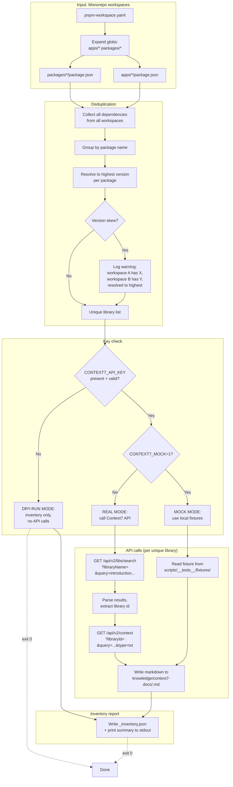

# Design: context7-docs-pipeline

> **Proposal:** `openspec/changes/context7-docs-pipeline/proposal.md`
> **Scope:** dev-infra only — no system architecture decisions, no `.sdd/` escalation required.

## Approach

This change stays within the existing dev-infra module boundary. No new module is introduced, no cross-cutting technology decision is made, and `architecture.md` is not affected. The design follows established patterns in the codebase while introducing two new patterns justified by the workload:

- **Node ESM script in `scripts/`** — all existing scripts are bash, but JSON-heavy work (workspace package.json parsing, semver comparison, Context7 API JSON response handling, markdown generation) is significantly cleaner in Node. The root `package.json` is `"type": "module"` with Node 24, so `.mjs` is natural.
- **Mock mode via env flag** — `CONTEXT7_MOCK=1` routes API calls through local fixtures. This is a new pattern for the project, justified by the need to test API integration without consuming the monthly quota.

Existing patterns followed:

- **Secrets wiring:** `secrets/context7_api_key` → `CONTEXT7_API_KEY` is already wired in `dev-entrypoint.sh`. No changes needed.
- **bats test pattern:** `scripts/__tests__/context7-docs.bats` follows the conventions in `scripts/__tests__/dev-entrypoint.bats`.
- **bats-wrapper syntax checking:** add `scripts/context7-docs.mjs` to the syntax-check loop (though Node syntax checking is `node --check`, not `bash -n`).
- **Output directory:** `knowledge/context7-docs/` fits the existing `knowledge/` pattern.
- **Makefile standalone target:** `make context7-docs` is not wired into `test-infra` (API quota constraint), matching the pattern of other developer-triggered tools.

## Files changed

| File                                        | Change                                                                                                    | Notes                                                      |
| ------------------------------------------- | --------------------------------------------------------------------------------------------------------- | ---------------------------------------------------------- |
| `scripts/context7-docs.mjs`                 | **New file** — Node ESM script, scans workspaces, deduplicates, fetches from Context7, stores as markdown | Executable, self-contained, exits non-zero on fatal errors |
| `scripts/__tests__/context7-docs.bats`      | **New file** — bats tests for dry-run path + mock mode                                                    | Follows `dev-entrypoint.bats` conventions                  |
| `scripts/__tests__/fixtures/context7-mock/` | **New directory** — pre-recorded Context7 API responses for mock mode                                     | JSON fixtures, one per API endpoint shape                  |
| `Makefile`                                  | Add `context7-docs` target + header comment                                                               | `context7-docs` runs `node scripts/context7-docs.mjs`      |
| `.gitignore`                                | Add `knowledge/context7-docs/` entry                                                                      | New section: "Generated by scripts/context7-docs.mjs"      |

## Context7 API contract (confirmed by live research 2026-08-02)

> **IMPORTANT:** The old `api.context7.com` endpoints are DEAD (NXDOMAIN). All calls use `https://context7.com/api`.

### Endpoints

| Operation                | Method | URL                                                       | Auth            | Notes                                                                                                                                                                                                                                                                                                                                                                                                          |
| ------------------------ | ------ | --------------------------------------------------------- | --------------- | -------------------------------------------------------------------------------------------------------------------------------------------------------------------------------------------------------------------------------------------------------------------------------------------------------------------------------------------------------------------------------------------------------------- |
| **Search library**       | GET    | `/api/v2/libs/search?libraryName=<name>&query=<q>`        | Optional Bearer | `query` param is REQUIRED (used for relevance ranking). Use a generic query like `"introduction and usage overview"` for broad fetch. Response: `{"results": [{"id": "/vercel/next.js", "title", "description", "branch", "lastUpdateDate", "state", "totalTokens", "totalSnippets", "stars", "trustScore", "benchmarkScore", "versions"}]}`. `stars` can be -1, `benchmarkScore` can be 0 — not corrupt data. |
| **Fetch docs**           | GET    | `/api/v2/context?libraryId=<id>&query=<q>&type=txt\|json` | Optional Bearer | SYNCHRONOUS — no jobId/polling. `type=txt` returns flat markdown (### Title + Source: url + fenced code, separated by `---`). `type=json` returns `codeSnippets`/`infoSnippets`/`rules`.                                                                                                                                                                                                                       |
| **Refresh (regenerate)** | POST   | `/api/v1/refresh`                                         | Required Bearer | Body: `{"libraryName": "/owner/repo", "branch"?}`. Fire-and-forget.                                                                                                                                                                                                                                                                                                                                            |
| **Add new library**      | POST   | `/api/v2/add/repo/github`                                 | Required Bearer | Body: `{"docsRepoUrl": "..."}`. Async queued.                                                                                                                                                                                                                                                                                                                                                                  |

### Library states

| State                    | Meaning                   | Action                                                                    |
| ------------------------ | ------------------------- | ------------------------------------------------------------------------- |
| `finalized`              | Queryable, docs ready     | Proceed with fetch                                                        |
| `initial` / `processing` | Not yet ready             | API returns 202 `{"error": "library_not_finalized"}`. Retry with backoff. |
| `error`                  | Library generation failed | Log warning, skip                                                         |
| `delete`                 | Library removed           | Log warning, skip                                                         |

### HTTP status codes

| Code | Meaning                 | Action                                                                                            |
| ---- | ----------------------- | ------------------------------------------------------------------------------------------------- |
| 200  | Success                 | Parse response                                                                                    |
| 202  | Library not finalized   | Retry with exponential backoff (3 attempts: 5s, 15s, 45s)                                         |
| 301  | Library moved           | Follow `redirectUrl` from body, log warning                                                       |
| 401  | Invalid API key         | Abort immediately, clear error message                                                            |
| 402  | Spending limit exceeded | Abort immediately, clear error message                                                            |
| 429  | Rate limit              | Respect `Retry-After` header (default 60s if missing). One retry after wait; if still 429, abort. |
| 5xx  | Server error            | Per-library retry (2 attempts, 5s backoff). Failure → log as error, continue.                     |

### Error response format

All errors are JSON: `{"error": "<code>", "message": "..."}`. The `error` field is a machine-readable code (e.g., `"library_not_finalized"`, `"invalid_api_key"`, `"rate_limit_exceeded"`).

### Auth header

```
Authorization: Bearer <key>
```

Key prefix: `ctx7sk`. Free plan: 1000 calls/month, then 20 bonus/day.

### Library ID format

- Base: `/owner/repo` (e.g., `/vercel/next.js`)
- Version pin: `/owner/repo/v1.2.3` (e.g., `/vercel/next.js/v14.0.0`)

For this pipeline: search by package name, use the first result's `id` field (which is the `/owner/repo` format), then fetch docs. Do NOT pin versions in the libraryId — let Context7 serve the latest finalized docs.

## Data flow



### Workspace scanning logic

The script reads `pnpm-workspace.yaml` at repo root to get workspace globs (e.g., `apps/*`, `packages/*`). It expands each glob, reads `package.json` from each matched directory, and collects:

- `dependencies` (production)
- `devDependencies` (dev)
- `peerDependencies` (peer)
- `optionalDependencies` (optional)

All four are merged into a single dependency list per workspace. The script does NOT distinguish between them for deduplication purposes — if a package appears in any dependency type in any workspace, it's included.

**Exclusion list:** Skip workspace packages themselves (anything starting with `@poetry/`) — we don't need docs for our own code. Also skip `node:` built-in prefixes (e.g., `node:fs`).

### Version deduplication

For each unique package name across all workspaces:

1. Collect all version strings (e.g., `["^6.0.1", "~6.0.3", "6.0.2"]`).
2. Strip semver range prefixes (`^`, `~`, `>=`, etc.) to get base versions.
3. Compare using Node's built-in `semver` module (or a simple comparison if `semver` is not already a dependency — Node 24 has experimental `node:semver` but it's not stable yet, so we'll use a lightweight comparison or add `semver` as a devDependency).
4. Resolve to the highest version.
5. If the versions differ across workspaces, log a warning: `"WARN: version skew for <pkg>: workspace A has X.Y.Z, workspace B has W.V.U — resolved to highest: X.Y.Z"`.

### Library search strategy

For each unique package name:

1. **Search:** `GET /api/v2/libs/search?libraryName=<pkg>&query=introduction%20and%20usage%20overview`
   - The `query` param is REQUIRED by the API (used for relevance ranking). We use a generic broad query to maximize coverage.
   - Response: `{"results": [...]}`. Each result has an `id` field (e.g., `"/vercel/next.js"`).
2. **Pick first result:** Use `results[0].id` as the `libraryId`. The API ranks by relevance, so the first result is the best match.
3. **Fallback:** If `results` is empty, log warning: `"WARN: no Context7 library found for <pkg> — skipping"`. Continue to next package.

### Doc fetch strategy

For each resolved `libraryId`:

1. **Fetch:** `GET /api/v2/context?libraryId=<id>&query=introduction%20and%20usage%20overview&type=txt`
   - `type=txt` returns flat markdown, which is what we want for storage.
   - The `query` param is again required. We use the same generic query.
2. **Store:** Write the response body (which is already markdown) to `knowledge/context7-docs/<slug>.md`, where `<slug>` is the `libraryId` with `/` replaced by `-` and leading `/` removed (e.g., `/vercel/next.js` → `vercel-next.js.md`).
3. **Metadata header:** Prepend a YAML frontmatter block to the markdown:
   ```yaml
   ---
   libraryId: /vercel/next.js
   packageName: next
   resolvedVersion: 14.0.0
   fetchedAt: 2026-08-02T12:34:56Z
   ---
   ```
   This metadata helps future RAG indexing and makes the files self-documenting.

### Inventory report structure

`knowledge/context7-docs/_inventory.json`:

```json
{
  "generatedAt": "2026-08-02T12:34:56Z",
  "mode": "real" | "mock" | "dry-run",
  "workspacesScanned": [
    "apps/author-studio",
    "apps/publishing-platform",
    "packages/editor-engine",
    ...
  ],
  "totalDependencies": 127,
  "uniqueLibraries": 89,
  "versionSkewWarnings": [
    {
      "package": "codemirror",
      "versions": {
        "apps/author-studio": "^6.0.3",
        "packages/editor-engine": "^6.0.1"
      },
      "resolved": "6.0.3"
    }
  ],
  "libraries": [
    {
      "packageName": "next",
      "resolvedVersion": "14.0.0",
      "context7LibraryId": "/vercel/next.js",
      "status": "succeeded" | "skipped" | "failed",
      "statusDetail": "202 not finalized after 3 retries" | "404 not found" | ...,
      "outputFile": "vercel-next.js.md"
    },
    ...
  ],
  "summary": {
    "succeeded": 75,
    "skipped": 10,
    "failed": 4
  }
}
```

## Seams

> Per `openspec/config.yaml`: "Include a Seams section listing the pre-agreed public boundaries where tests will live. Prefer existing seams; propose new ones only at the highest level necessary."

| Seam                                                                                               | What it is                                                                         | Test location                                                            | Test type                                                             |
| -------------------------------------------------------------------------------------------------- | ---------------------------------------------------------------------------------- | ------------------------------------------------------------------------ | --------------------------------------------------------------------- |
| **Workspace scanner** (pure function: workspace layout → dependency list)                          | Reads `pnpm-workspace.yaml` + `package.json` files, returns merged dependency list | `scripts/__tests__/context7-docs.bats` (dry-run path)                    | Behavioral: output shape, specific package presence                   |
| **Version dedup logic** (pure function: dependency list → unique libraries with resolved versions) | Groups by package name, resolves highest version, logs skew                        | `scripts/__tests__/context7-docs.bats` (dry-run path)                    | Behavioral: correct dedup, skew warnings                              |
| **Inventory report writer** (pure function: library list + statuses → JSON)                        | Writes `_inventory.json` with metadata                                             | `scripts/__tests__/context7-docs.bats` (dry-run path)                    | Behavioral: valid JSON, expected keys, summary counts                 |
| **API client** (HTTP calls + retry logic)                                                          | Calls Context7 API, handles status codes, retries                                  | `scripts/__tests__/context7-docs.bats` (mock mode via `CONTEXT7_MOCK=1`) | Behavioral: correct retry on 202, abort on 401/402, respect 429       |
| **Markdown writer** (pure function: API response + metadata → markdown file)                       | Writes `<slug>.md` with YAML frontmatter                                           | `scripts/__tests__/context7-docs.bats` (mock mode)                       | Behavioral: file exists, frontmatter present, content matches fixture |
| **Makefile `context7-docs` target**                                                                | CLI entry point                                                                    | Invoked by `make context7-docs`                                          | Implicit: if the target fails, the command fails                      |

### New seams vs. existing seams

- **Workspace scanner, version dedup, inventory writer, API client, markdown writer** — all **new seams**. Justified: this is the first dev-infra script that makes network calls and produces structured output, so it needs behavioral testing at multiple boundaries. A new bats file is the right location (matches `dev-entrypoint.bats` precedent).
- **Makefile target** — existing seam, extended.

### Testability via pure functions

The script is structured as a collection of pure functions (workspace scanner, version dedup, inventory writer, markdown writer) plus an impure API client layer. The pure functions are trivially testable in isolation (input → output, no side effects). The API client is tested via mock mode (fixtures simulate API responses).

This separation is deliberate: it means 80% of the logic (scanning, dedup, report generation) can be tested without any API calls or fixtures, and only the 20% that touches the network needs mock infrastructure.

### Testability env seams

Two env overrides make the script testable without a live API or the real monorepo layout. Both are consumed at the top of `main()` / the HTTP layer and are used by `scripts/__tests__/context7-docs.bats`:

| Env var                   | What it does                                                                                                                                                                       | Test impact                                                                                                                                                  |
| ------------------------- | ---------------------------------------------------------------------------------------------------------------------------------------------------------------------------------- | ------------------------------------------------------------------------------------------------------------------------------------------------------------ |
| `CONTEXT7_RETRY_DELAY_MS` | Collapses ALL retry sleeps — the 202 backoff (nominally 5s/15s/45s), the 5xx 5s retry, and the 429 `Retry-After` wait (default 60s) — to a fixed millisecond value (`scaledDelay`) | bats tests never sleep the nominal backoff; the suite runs in ms instead of minutes                                                                          |
| `CONTEXT7_WORKSPACE_ROOT` | Points the workspace scanner at an arbitrary root instead of `process.cwd()`                                                                                                       | bats point the scanner at synthetic fixture workspaces under `$BATS_TEST_TMPDIR`, so dedup/status logic is tested in isolation from the real monorepo layout |

### Shared-libraryId collision: last-write-wins

Two distinct packages can resolve to the same Context7 `libraryId` (e.g. a scoped and an unscoped name of the same library, or two packages whose first search result is the same `/owner/repo`). In that case each package is marked **"succeeded"** in the inventory — the per-package search/fetch succeeded — but they share one output file: `writeMarkdown` keys the file by the `libraryId` slug, so the second write overwrites the first (last write wins). This is accepted behavior: the docs content is identical for both packages, and `_inventory.json` still records each package's own status and the shared `outputFile`.

## Design constraints and trade-offs

### Why a Node ESM script and not bash

- **JSON-heavy workload:** parsing `package.json` files across multiple workspaces, handling Context7 API JSON responses, comparing semver versions, generating YAML frontmatter — all of this is significantly cleaner in Node than bash + `jq`. Bash + `jq` could do it, but the code would be harder to read and maintain.
- **Node is already the primary runtime:** root `package.json` is `"type": "module"` with Node 24. Every developer has Node installed. No new runtime dependency.
- **Semver comparison:** Node doesn't have a stable built-in `semver` module yet (Node 24's `node:semver` is experimental). We'll either add `semver` as a devDependency (small, well-maintained) or implement a lightweight comparison. Either way, it's cleaner in Node than bash.
- **HTTP client:** Node's built-in `fetch` (stable in Node 24) is sufficient for the API calls. No need for `axios` or `node-fetch`.

**Trade-off:** this is the first Node script in `scripts/`, breaking the bash-only pattern. Justified by the workload, but worth noting for consistency.

### Why `knowledge/context7-docs/` and not a separate top-level directory

- **Consistency:** `knowledge/` already holds research conspects, analyses, and RAG bases. Context7 docs are another form of curated knowledge for AI agents. Keeping them together makes discovery easier.
- **Gitignore pattern:** `knowledge/` already has a `knowledge/*/sources/` ignore pattern. Adding `knowledge/context7-docs/` follows the same structure.
- **Future RAG integration:** if/when the `book-rag` skill or a future RAG pipeline ingests these docs, they're already in the right place.

### Why not wired into CI (`make test-infra`)

- **API quota:** the free plan provides 1000 calls/month, then 20 bonus/day. Running this in CI on every PR would exhaust the quota in days. This is a developer-triggered tool, not a CI gate.
- **Cost isolation:** developers who need fresh docs run the script manually with their own API key. Developers who don't need it don't run it. No shared quota drain.
- **Dry-run is free:** the inventory-only mode (no API calls) could theoretically run in CI, but it's not valuable — the workspace layout doesn't change often enough to justify the CI time, and the output is gitignored anyway.

### Why mock mode via env flag and not a separate test script

- **Single code path:** the script's logic is the same in real mode and mock mode — only the HTTP client changes. Using an env flag (`CONTEXT7_MOCK=1`) means we test the real code path, not a separate test-only implementation.
- **Fixture reuse:** the same fixtures can be used for manual testing (developer wants to see what the output looks like without consuming quota) and automated tests.
- **Explicit opt-in:** mock mode requires the developer to set `CONTEXT7_MOCK=1`, which prevents accidental use in production runs. The script prints a clear warning when in mock mode.

### Why per-library error isolation (not fail-fast)

- **Partial progress is valuable:** if 80 out of 89 libraries succeed and 9 fail (e.g., not finalized, network error), the developer still gets docs for the 80 that worked. Failing the whole run because of 9 transient errors wastes the API calls already made.
- **Fatal errors are still fatal:** 401 (invalid key) and 402 (spending limit) abort immediately — there's no point continuing if the key is broken or the quota is exhausted. But per-library errors (202, 404, 5xx) are logged and skipped.
- **Summary report:** the inventory report includes a summary (N succeeded, M skipped, K failed), so the developer knows exactly what happened. They can re-run later to retry the failed ones.

### Why YAML frontmatter in the markdown files

- **Self-documenting:** each file carries metadata about its source (libraryId, packageName, resolvedVersion, fetchedAt). If the files are moved, renamed, or ingested into a RAG pipeline, the metadata travels with them.
- **RAG indexing:** future RAG pipelines can parse the frontmatter to build indexes (e.g., "show me all docs for libraries at version X.Y.Z").
- **Human-readable:** YAML frontmatter is a standard convention (used by Jekyll, Hugo, Obsidian, etc.). Developers recognize it immediately.

**Trade-off:** the frontmatter adds ~5 lines to each file. Worth it for the metadata, but worth noting.
