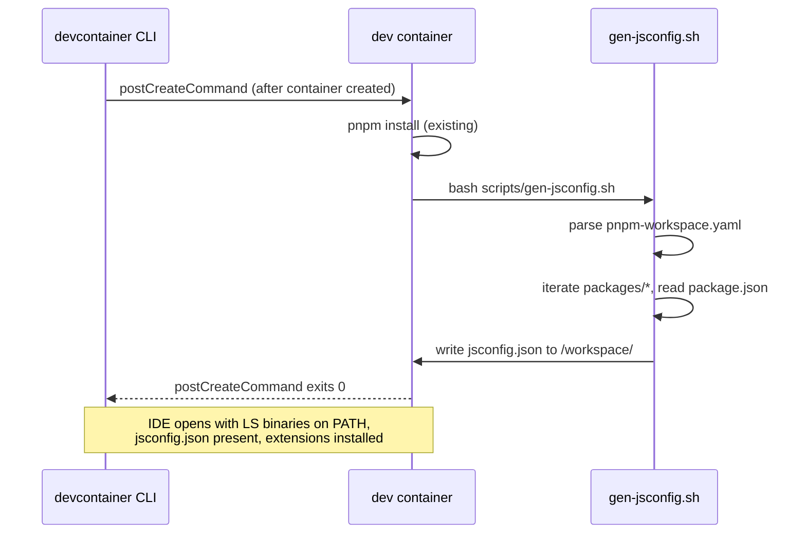

# Design: dev-infra-language-servers

> **Proposal:** `openspec/changes/dev-infra-language-servers/proposal.md`
> **Scope:** dev-infra only — no system architecture decisions, no `.sdd/` escalation required.
> **Extension:** this document now covers both the container scope (T1–T6, original) and the host-global scope (T7–T11, extension). The two scopes share the version-pinning source of truth (`scripts/lsp-versions.env`) but are otherwise disjoint — container RUN steps are untouched; host scripts are additive.

## Approach

This change stays within the existing dev-infra module boundary. No new module is introduced, no cross-cutting technology decision is made, and `architecture.md` is not affected. The design follows established patterns in the codebase:

### Container-scope patterns (T1–T6, unchanged)

- **Pinning pattern:** extend the existing ARG block at the top of `Dockerfile.dev` (lines 21-32) rather than scattering version literals across RUN steps.
- **Install pattern:** extend the existing "Global npm packages" RUN step (lines 68-71) for TypeScript and Python LS binaries; add `rustup component add rust-analyzer` to the existing Rust toolchain RUN step (lines 104-107).
- **Smoke test pattern:** append to the existing "verifying runtimes" block in `scripts/test-docker-smoke.sh` (lines 76-82) using the same `docker compose exec -T dev <tool> --version >/dev/null` shape.
- **bats test pattern:** follow the conventions in `scripts/__tests__/dev-entrypoint.bats` (load `test-helper`, use `assert_status` / `assert_output_contains`).
- **Devcontainer pattern:** `customizations.vscode.extensions` in `.devcontainer/devcontainer.json` auto-installs extensions inside the container (recommendations alone are not auto-installed); `customizations.vscode.settings` holds only container-specific settings (terminal profile). Shared workspace settings live in committed `.vscode/settings.json`; recommended extensions live in committed `.vscode/extensions.json`. `.vscode/` is tracked (removed from `.gitignore`).
- **Generator pattern:** single self-contained bash script at `scripts/gen-jsconfig.sh`, invoked by a Makefile target and by the devcontainer's `postCreateCommand`. Output is gitignored; drift is caught by the bats test validating the output shape.

### Host-scope patterns (T7–T11, new)

- **Single source of truth pattern:** `scripts/lsp-versions.env` — a sourceable `KEY=VALUE` file. Both the install script and the probe script source it; the bats test reads it. `Dockerfile.dev` cross-references it via comment (no ARG changes; Dockerfile's own ARG block remains authoritative for container builds — this is deliberate, see §Design constraints).
- **Host-install pattern:** bash-only scripts (`#!/usr/bin/env bash`, `set -euo pipefail`, bash 4+ documented). Idempotent: version-check-skip before each install. No sudo. npm uses `--prefix "$HOME/.local"` per-invocation (no shell-rc mutation); `NPM_PREFIX` env escape hatch documented. rustup uses `rustup component add`; rustup-absent is a skippable warning with https://rustup.rs URL; `SKIP_RUST=1` escape hatch documented. Exit codes: 0/1 only (no 2).
- **Host-probe pattern:** mirrors `check-tools.sh` line shapes (`ok:` / `fail:` / `skip:`). Aggregate probe — all tools probed, all failures reported in one output, then exit. Every exit-1 includes a what/why/how-to-fix pointer (no bare `exit 1`). Skip is neutral (does not affect exit 0).
- **bats FAKE-mock pattern:** follows `check-tools.bats` `install_fakes()` shape — FAKE binaries planted on `PATH`, env vars drive behavior, the script under test never shells a real LSP binary. Invariant: every `--version` probe in every test case is FAKE-driven.
- **Documentation pattern:** `docs/dev-infra/host-lsp-setup.md` — markdown checklist, owner-runnable, covers npm prefix + PATH note, rustup URL, escape hatches, Gate B live-state troubleshooting.

## Files changed

### Container scope (T1–T6)

| File                                  | Change                                                                                                                                                                                    | Notes                                                               |
| ------------------------------------- | ----------------------------------------------------------------------------------------------------------------------------------------------------------------------------------------- | ------------------------------------------------------------------- |
| `Dockerfile.dev`                      | Add 3 ARGs + 2 RUN steps (npm LS install, rustup component)                                                                                                                               | Extends existing patterns; no structural change                     |
| `scripts/gen-jsconfig.sh`             | **New file** — bash script, reads workspace layout, emits `jsconfig.json` to stdout or a target path                                                                                      | Executable, self-contained, exits non-zero on malformed input       |
| `scripts/__tests__/gen-jsconfig.bats` | **New file** — bats tests for generator output shape                                                                                                                                      | Follows `dev-entrypoint.bats` conventions                           |
| `scripts/test-docker-smoke.sh`        | Append 3 binary-presence assertions                                                                                                                                                       | Extends existing "verifying runtimes" block                         |
| `pyrightconfig.json`                  | **New file** — committed at repo root                                                                                                                                                     | Points at `apps/api-server` and `packages/analytics-pipeline`       |
| `.devcontainer/devcontainer.json`     | Extend `extensions` array (auto-install rust-analyzer + pylance in container); add container-specific `settings` (terminal profile); change `postCreateCommand` from string to array form | Shared workspace settings stay in committed `.vscode/settings.json` |
| `Makefile`                            | Add `gen-jsconfig` target; add as dependency of `test-infra`                                                                                                                              | `gen-jsconfig` runs `scripts/gen-jsconfig.sh`                       |
| `.gitignore`                          | Add `jsconfig.json` entry                                                                                                                                                                 | New section or extend existing                                      |

### Host scope (T7–T11)

| File                                    | Change                                                                                                                                                                                                                                                | Notes                                                                                             |
| --------------------------------------- | ----------------------------------------------------------------------------------------------------------------------------------------------------------------------------------------------------------------------------------------------------- | ------------------------------------------------------------------------------------------------- |
| `scripts/lsp-versions.env`              | **New file** — sourceable `KEY=VALUE` pin source. Keys: `TYPESCRIPT_LANGUAGE_SERVER_VERSION=5.3.0`, `PYRIGHT_VERSION=1.1.411`, `RUST_ANALYZER_VERSION=<rustup channel>`.                                                                              | Single source of truth for host + container LS versions; sourced by install + probe + bats.       |
| `scripts/install-host-lsp.sh`           | **New file** — bash 4+, `set -euo pipefail`, idempotent, installs the 3 LS binaries on the host. Per-tool version-skip, per-tool `installed:` / `already installed:` line, EACCES detection, rustup-conditional logic, `SKIP_RUST=1` escape hatch.    | Exits 0 on full or partial success; 1 on unrecoverable. No logging infra; stdout/stderr only.     |
| `scripts/check-host-lsp.sh`             | **New file** — bash 4+, `set -euo pipefail`, aggregate probe, mirrors `check-tools.sh` line shapes. Sources `lsp-versions.env`, probes all 3 tools, emits aggregate summary, respects `SKIP_RUST=1`.                                                  | Exit 0 if all pass (skip neutral); 1 if any fail. Every exit-1 has a what/why/how-to-fix pointer. |
| `scripts/__tests__/check-host-lsp.bats` | **New file** — 6 core cases (all-ok / one-missing / version-fail / skip-neutral / multi-fail / env-file-missing). FAKE-mock pattern from `check-tools.bats`. Invariant: bats NEVER shells real LSP binaries.                                          | Wired into `make test-shell` via bats-wrapper auto-discovery (baseline 110 → 110+N).              |
| `docs/dev-infra/host-lsp-setup.md`      | **New file** (+ `docs/dev-infra/` directory) — owner-runnable markdown checklist: npm global prefix (`$HOME/.local`) + PATH note, rustup install URL, `SKIP_RUST=1` + `NPM_PREFIX` escape hatches, Gate B live-state troubleshooting.                 | T11 verification checklist also lives here as a linked section.                                   |
| `Makefile`                              | Add `check-host-lsp` target (`bash scripts/check-host-lsp.sh`); edit `test-shell` prereq to `test-shell: check-host-lsp test-opencode-docker`; add `check-host-lsp` to `.PHONY`.                                                                      | `test-shell` now fails fast if host probe fails.                                                  |
| `Dockerfile.dev`                        | Pure documentary comment edits only: at ARG block (~:35-38) `# keep in sync with scripts/lsp-versions.env — the single source of truth for host + container LS versions; T7-T10`; at npm-packages block (~:97-99) same cross-ref. NO RUN/ARG changes. | rust-analyzer needs no cross-ref (RUST_VERSION ARG + rustup install are already self-contained).  |

### Files NOT changed (by ruling)

- **`opencode.jsonc`** — `lsp: true` at line 49 already enables LSP discovery; no custom `lsp` object (Q4 ruling).
- **`Dockerfile.dev` RUN steps** — no behavior change; only documentary comments (Q4 ruling).
- **Windows/CI surface** — out of scope.
- **`.sdd/`** — no new document authored (gap logged in proposal.md, not a blocker).

## Data flow

### jsconfig.json generator

```
pnpm-workspace.yaml          packages/*/package.json
        │                            │
        ▼                            ▼
  ┌─────────────────────────────────────────┐
  │     scripts/gen-jsconfig.sh             │
  │     - parses workspace globs            │
  │     - reads each package's "name"       │
  │     - maps "@poetry/<pkg>" →            │
  │       "packages/<pkg>/src/index.ts"     │
  │     - emits JSON to stdout              │
  └──────────────────┬──────────────────────┘
                     │
          ┌──────────┴──────────┐
          ▼                     ▼
   jsconfig.json          bats test
   (gitignored)          (validates shape)
```

The generator's input contract:

- `pnpm-workspace.yaml` exists at repo root with `packages:` list containing globs.
- Each matched directory has a `package.json` with a `"name"` field (scoped as `@poetry/<pkg>`).
- Each matched directory has `src/index.ts` (the package's entry point, per the existing convention that `main`/`types` point to TS sources directly).

The generator's output contract:

- Valid JSON.
- `compilerOptions.baseUrl`: `"."`
- `compilerOptions.paths`: object mapping `"@poetry/<pkg>"` → `["packages/<pkg>/src/index.ts"]` for every workspace package.
- Exit 0 on success; non-zero with stderr message on any parse failure or missing entry point.

### Devcontainer postCreateCommand chain



The `postCreateCommand` changes from a string (`"pnpm install"`) to an array form:

```json
"postCreateCommand": ["bash", "-c", "pnpm install && bash scripts/gen-jsconfig.sh"]
```

This ensures `jsconfig.json` is regenerated every time a developer recreates the devcontainer, picking up any workspace layout changes since the last run.

### Host-scope install + probe flow (T7–T11)

```
scripts/lsp-versions.env  (single source of truth — sourceable KEY=VALUE)
        │
        │  source
        ├───────────────────────────────┐
        ▼                               ▼
scripts/install-host-lsp.sh     scripts/check-host-lsp.sh
  │ idempotent per-tool           │ aggregate probe, all 3 tools
  │ version-skip before install   │ ok:/fail:/skip: line shape
  │ npm --prefix $HOME/.local     │ mirrors check-tools.sh shape
  │ rustup component (conditional)│ SKIP_RUST=1 escape hatch
  │ SKIP_RUST=1 escape hatch      │ every exit-1: what/why/how-to-fix
  ▼                               ▼
installed binaries on host      stdout/stderr aggregate summary
        │                               │
        │ (owner runs manually)         │ (wired into `make test-shell` prereq)
        ▼                               ▼
docs/dev-infra/host-lsp-setup.md  Gate B live-state check
  (checklist: npm prefix, PATH,     (rust-analyzer absent on this
   rustup URL, escape hatches,       host → SKIP_RUST=1 accepted)
   troubleshooting)
        │
        ▼
scripts/__tests__/check-host-lsp.bats
  (Gate A — FAKE-mock, 6 core cases)
  bats-wrapper auto-discovery
  (make test-shell: 110 → 110+N)
```

The install script's input contract:

- `scripts/lsp-versions.env` exists at the repo root and defines the three `*_VERSION` keys (or the script exits 1 with a pointer).
- npm is on `PATH` (for TS/Python LS). If npm is absent, the script exits 1 with a pointer to the onboarding docs.
- For rust-analyzer: if rustup is on `PATH`, install via `rustup component add`; if absent and `SKIP_RUST≠1`, emit stderr warning + continue (partial install, exit 0); if `SKIP_RUST=1`, emit stdout skip + continue.

The probe script's input contract:

- `scripts/lsp-versions.env` exists at the repo root (else exit 1 with what/why/how-to-fix).
- The three LS binaries may or may not be on `PATH` — that is what the probe checks.
- `SKIP_RUST=1` may be set — if so, rust-analyzer is reported as `skip:` and does not affect exit status.

The probe script's output contract:

- One `ok:` / `fail:` / `skip:` line per tool, in the shape specified by proposal.md §Host-scope 3-gate acceptance (Gate A).
- An aggregate summary line emitted before exit (e.g., `summary: 3 ok, 0 fail, 0 skip` or `summary: 2 ok, 1 fail, 0 skip — see above`).
- Exit 0 if no `fail:` lines (skip is neutral); exit 1 if any `fail:` line. Every exit-1 is preceded by a per-failure remediation pointer (no bare `exit 1`).

## Seams

> Per `openspec/config.yaml`: "Include a Seams section listing the pre-agreed public boundaries where tests will live. Prefer existing seams; propose new ones only at the highest level necessary."

| Seam                                              | What it is                                            | Test location                                                                     | Test type                                                          |
| ------------------------------------------------- | ----------------------------------------------------- | --------------------------------------------------------------------------------- | ------------------------------------------------------------------ |
| **Container image** (Dockerfile.dev build output) | The built dev container with LS binaries installed    | `scripts/test-docker-smoke.sh`                                                    | Smoke: binary presence via `--version`                             |
| **Generator script** (`scripts/gen-jsconfig.sh`)  | Pure bash function of filesystem inputs → JSON output | `scripts/__tests__/gen-jsconfig.bats`                                             | Behavioral: output shape, specific package presence, path validity |
| **Makefile `gen-jsconfig` target**                | CLI entry point for the generator                     | Invoked by `make test-infra`                                                      | Implicit: if the target fails, `test-infra` fails                  |
| **`pyrightconfig.json`**                          | Static configuration file                             | `make test-infra` (via pyright invocation in smoke test or as a standalone check) | Shape: pyright can parse and exit                                  |
| **`.devcontainer/devcontainer.json`**             | Declarative JSON for devcontainer CLI                 | `make test-config` (if extended) or manual review                                 | Shape: valid JSON, expected keys present                           |

### New seams vs. existing seams

- **Container image** — existing seam (already tested for node, python3). Extended, not new.
- **Generator script** — **new seam**. Justified: this is the first dev-infra script that produces a structured artifact (JSON) whose shape matters, so it needs behavioral testing at the script boundary. A new bats file is the right location (matches `dev-entrypoint.bats` precedent).
- **Makefile target, pyrightconfig, devcontainer.json** — existing seams, extended.

No other new seams are introduced. The LS binaries themselves are black boxes; we test their presence, not their behavior.

### Host-scope seams (T7–T11)

The host-scope change introduces two new seams, split along the Gate A / Gate B verification boundary established in proposal.md §Host-scope 3-gate acceptance.

| Seam                                                    | What it is                                                                                                                                              | Test location                                                                                | Test type                                                                                                                                                                 |
| ------------------------------------------------------- | ------------------------------------------------------------------------------------------------------------------------------------------------------- | -------------------------------------------------------------------------------------------- | ------------------------------------------------------------------------------------------------------------------------------------------------------------------------- |
| **Host probe script** (`scripts/check-host-lsp.sh`)     | Pure bash function of `scripts/lsp-versions.env` + host `PATH` → aggregate ok/fail/skip output. Aggregate probe: all 3 tools probed before any exit.    | `scripts/__tests__/check-host-lsp.bats` (Gate A) + `make check-host-lsp` (Gate B)            | Gate A: FAKE-mock behavioral (6 core cases, bats NEVER shells real LSPs). Gate B: real-host.                                                                              |
| **Host install script** (`scripts/install-host-lsp.sh`) | Pure bash function of `scripts/lsp-versions.env` + host npm/rustup → per-tool idempotent install. Per-tool version-skip, EACCES detection, SKIP_RUST=1. | Implicit: if the install breaks, Gate B fails on next `make test-shell`.                     | Behavioral at the script boundary via Gate B live-state; no FAKE-mock unit test (install is destructive; bats covers the probe which is the non-destructive counterpart). |
| **`scripts/lsp-versions.env`**                          | Sourceable KEY=VALUE file, single source of truth for host + container LS pins.                                                                         | `scripts/__tests__/check-host-lsp.bats` env-file-missing case + `make test-config` (future). | Shape: parseable by bash `source`, all three keys present, values match Dockerfile.dev ARGs (cross-ref by comment, not enforced by automation — documented choice).       |
| **`docs/dev-infra/host-lsp-setup.md`**                  | Owner-runnable markdown checklist. No automated test.                                                                                                   | Gate C (T11 manual UX verification).                                                         | Markdown checklist; no automation by design (Q7c ruling).                                                                                                                 |
| **Makefile `check-host-lsp` target**                    | CLI entry point for the probe. Now a prerequisite of `test-shell`.                                                                                      | Invoked by `make test-shell`.                                                                | Implicit: if the target fails, `test-shell` fails before any bats run.                                                                                                    |

### New seams vs. existing seams (host scope)

- **Host probe script** — **new seam**. Justified: it is the host-scope counterpart to the existing `check-tools.sh` seam (mise/node/pnpm). Same line shape, same aggregate-probe design, same `make check-*` CLI entry. A new bats file is the right location (matches `check-tools.bats` precedent, which uses the same FAKE-mock pattern).
- **Host install script** — **new seam, but tested indirectly**. Justified: install is destructive (writes to `$HOME/.local` or rustup components); FAKE-mocking it would require faking npm + rustup + the filesystem effects, which is more complex than it's worth. The probe script (which IS FAKE-mock tested) is the non-destructive counterpart; if the install is broken, Gate B's real-host run catches it. This is a deliberate trade-off, not a gap.
- **`lsp-versions.env`** — **new seam**. Justified: it is the single source of truth, replacing the prior scattered ARG block + hardcoded pins. The env-file-missing bats case covers the structural-drift risk.
- **Makefile `check-host-lsp` target, host-lsp-setup.md** — existing seams extended (Makefile) or new-but-declarative (docs).

### Seams split — why Gate A (FAKE) vs. Gate B (real-host)

The seam map reflects a deliberate two-seam split:

- **Gate A (FAKE-mock seam):** every test in `check-host-lsp.bats` plants FAKE binaries on `PATH` and drives behavior via env vars. This is fast, hermetic, CI-runnable, and covers the script's branching logic (version match, missing tool, skip, env-file-missing). It does NOT verify that the real `typescript-language-server` binary actually runs.
- **Gate B (real-host seam):** the owner runs `bash scripts/check-host-lsp.sh` (or `make check-host-lsp`) against the real installed binaries. This is slow, non-hermetic, and only runs on the owner's machine. It DOES verify the real binaries run.

The two seams are complementary: Gate A covers logic, Gate B covers reality. The invariant — bats NEVER shells real LSP binaries — is the enforcement line between them.

## Design constraints and trade-offs

### Why a bash generator and not a Node/Python script

- **Consistency:** all dev-infra scripts in `scripts/` are bash (`dev-stack.sh`, `dev-entrypoint.sh`, `test-docker-smoke.sh`). Introducing a Node or Python script for one generator breaks the pattern.
- **Dependency minimization:** bash + `jq` (already installed in the container) are sufficient. No need to invoke a Node or Python runtime for a one-time setup step.
- **Testability:** bash scripts are tested by the existing bats infrastructure; adding a Python script would require pytest wiring for dev-infra (currently only used for api-server).

### Why gitignored output instead of committed

- **Drift prevention:** a committed `jsconfig.json` would silently go stale when a new `@poetry/*` package is added. A generator that runs on every `postCreateCommand` and is validated by bats catches this.
- **CI enforcement:** `make test-infra` runs the generator + bats; if the generator's output shape is wrong (e.g., missing a package), CI fails.
- **Cleaner PRs:** generated files in PRs create noise when workspace layout changes; gitignoring keeps PRs focused on source changes.

### Why `pyrightconfig.json` at root instead of per-package `[tool.pyright]` sections

- **Single source of truth:** one file to review for "what does pyright analyze across the monorepo."
- **Monorepo discovery:** pyright's auto-discovery via per-package `pyproject.toml` works for in-package editing but weakens cross-package navigation (e.g., analytics-pipeline importing data-contracts types). A root config with explicit `include` paths gives predictable behavior.
- **Precedent:** the TypeScript side uses a root `jsconfig.json` for the same reason.

### Why extensions auto-install in devcontainer.json while settings stay in `.vscode/`

- **`.vscode/` is tracked** — `settings.json` and `extensions.json` are committed so all developers get consistent formatter/linter/analysis settings and recommended extensions, with or without the devcontainer.
- **Recommendations vs auto-install:** `.vscode/extensions.json` "recommendations" only _suggest_ extensions in the UI; they are not installed. The devcontainer's `customizations.vscode.extensions` array is what actually installs the language-server extensions into the container. Both are needed.
- **Container-specific vs workspace settings:** devcontainer settings (e.g. `terminal.integrated.defaultProfile.linux`) apply only inside the devcontainer; workspace settings in `.vscode/settings.json` apply everywhere. Keeping `rust-analyzer.check.command: clippy` and `typescript.tsdk` in `.vscode/settings.json` (already there) avoids duplicating them in the devcontainer.

### Host-scope design constraints and trade-offs (T7–T11)

#### Why `scripts/lsp-versions.env` instead of duplicating in each script

- **Single source of truth:** one place to bump when a new LS version ships; both `install-host-lsp.sh` and `check-host-lsp.sh` source the same file, so they cannot disagree.
- **bats-readable:** `KEY=VALUE` lines are parseable by bash `source` and by simple `awk`/`grep` in the bats test (no YAML parser needed).
- **Dockerfile cross-ref by comment, not by automation:** `Dockerfile.dev`'s ARG block remains authoritative for container builds because Docker build-time ARGs cannot be sourced from a `.env` file without extra machinery (e.g., `docker build --build-arg-file`). Adding that machinery for one file is not worth the complexity. The comment cross-ref is the cheapest, least-surprising link; a future change can add a `validate-lsp-pins-parity.sh` if drift becomes a real problem.

#### Why npm `--prefix "$HOME/.local"` per-invocation (not shell-rc mutation)

- **No side effects on the owner's shell:** `npm install -g --prefix "$HOME/.local"` writes to `$HOME/.local/bin` and `$HOME/.local/lib`. The script does not touch `.bashrc` / `.zshrc` / `.profile` — adding PATH entries there is the owner's choice, documented in `host-lsp-setup.md`.
- **Per-invocation, not env-sticky:** passing `--prefix` on every `npm install -g` call is explicit and hermetic. Relying on the owner's `npm config set prefix` would be invisible to the script and fail loudly only when the owner's npm config disagrees with the script's assumption.
- **EACCES detection + remediation pointer:** if npm writes to a path the owner cannot access, the script surfaces the EACCES and points at `docs/dev-infra/host-lsp-setup.md` (which documents the fix: set `--prefix` or adjust ownership). No silent `sudo`.
- **`NPM_PREFIX` escape hatch:** if the owner has a non-standard npm global prefix, they can export `NPM_PREFIX=/path` and the script honors it. Documented in `host-lsp-setup.md`.

#### Why rust-analyzer is skippable (SKIP_RUST=1) but TS/Python are not

- **Legit non-rustup path:** some developers install rust-analyzer via `apt install rust-analyzer` (Debian/Ubuntu package) — a legit path that bypasses rustup entirely. The probe must detect rust-analyzer regardless of install method (`rust-analyzer --version` works for both).
- **Rust is not required for the platform's core LSP work:** the poetry-platform is TypeScript + Python first; Rust is limited to `stress-lang-core` WASM. A TS/Python-only developer can legitimately skip rust-analyzer.
- **Escape hatch is explicit, not implicit:** `SKIP_RUST=1` must be set explicitly. Without it, rustup-absent emits a stderr warning and continues (partial install, exit 0). This matches the "every exit-1 has a what/why/how-to-fix pointer" contract — rustup-absent is not an error (exit 0), it is a warning with a remediation URL.

#### Why 6 core bats cases (not more)

- **Sufficiency:** the 6 cases cover every branch of the probe script — success path, each failure mode, skip path, multi-fail aggregation, env-file-missing (the only structural drift risk).
- **Invariant protection:** the 6 cases together enforce the "bats NEVER shells real LSP binaries" invariant. Adding partial-PATH or env-parse tests would not strengthen the invariant.
- **Maintenance cost:** every additional case is a FAKE binary to plant and maintain. 6 cases are enough to keep the probe's logic honest; more is diminishing returns.
- **Q7b ruling:** confirmed by the developer — no partial-PATH / env-parse / install-rerun extras.

#### Why T11 is a manual markdown checklist (not automated)

- **LSP UX is IDE-dependent:** go-to-definition / hover / diagnostics behavior varies across VSCode, opencode-in-container, and opencode-on-host. Automating it would require a browser/IDE harness (Playwright over VSCode is not a thing).
- **Owner-runnable, owner-verifiable:** the checklist is a one-time per-developer verification that the LSP stack actually works for them in their editor of choice. It is not a regression test; it is a setup confirmation.
- **Archived in the change directory:** `openspec/changes/dev-infra-language-servers/verification-T11.md` is the natural home; it dies with the change archive. No ongoing maintenance burden.
- **Q7c ruling:** confirmed by the developer — no automation.

#### Why `check-host-lsp.sh` is wired into `test-shell` (not `check-tools`)

- **Symmetry with `check-tools`:** `check-tools` is deliberately NOT wired into `test-shell` because it requires mise on PATH (a developer convenience, not a CI gate — see `check-tools.sh` lines 7-10). `check-host-lsp` has the same shape but is wired in because:
  - The host probe is faster than mise install (just 3 `--version` calls).
  - The probe catches PATH drift that would otherwise only surface in Gate C (manual UX verification), which is too late.
  - The bats-wrapper auto-discovery of `__tests__/*.bats` already runs the FAKE-mock Gate A under `test-shell`; having the real-host Gate B in the same target is a natural extension.
- **Gate B live-state accepted (Q7a):** on hosts without rust-analyzer, `make test-shell` fails until T8 is implemented or `SKIP_RUST=1` is exported. This is documented in `host-lsp-setup.md` §Troubleshooting and is not a blocker — the bats-wrapper (Gate A) still runs, and `test-infra` (Docker smoke) still passes.

#### Why exit codes are 0/1 only (not 2)

- **Consistency:** every other dev-infra script in the repo uses 0 (success) / 1 (failure). Introducing a new exit code adds cognitive load for no benefit.
- **Idempotency:** partial installs (rustup-absent w/o SKIP_RUST) are exit 0 with a warning, because the install script did what it could. A separate "partial success" code would force every caller to handle 3 states instead of 2.
- **Q2 ruling:** confirmed by the developer — drop exit 2.
