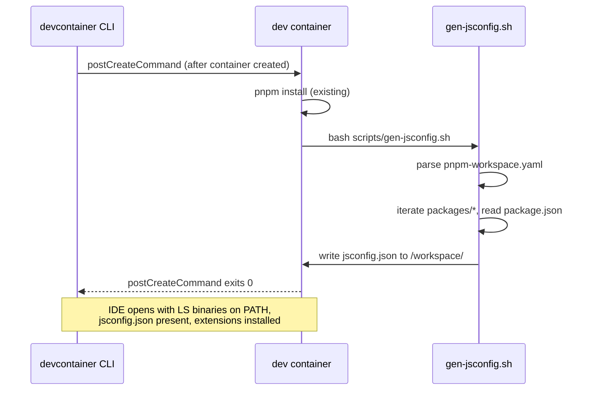

# Design: dev-infra-language-servers

> **Proposal:** `openspec/changes/dev-infra-language-servers/proposal.md`
> **Scope:** dev-infra only — no system architecture decisions, no `.sdd/` escalation required.

## Approach

This change stays within the existing dev-infra module boundary. No new module is introduced, no cross-cutting technology decision is made, and `architecture.md` is not affected. The design follows established patterns in the codebase:

- **Pinning pattern:** extend the existing ARG block at the top of `Dockerfile.dev` (lines 21-32) rather than scattering version literals across RUN steps.
- **Install pattern:** extend the existing "Global npm packages" RUN step (lines 68-71) for TypeScript and Python LS binaries; add `rustup component add rust-analyzer` to the existing Rust toolchain RUN step (lines 104-107).
- **Smoke test pattern:** append to the existing "verifying runtimes" block in `scripts/test-docker-smoke.sh` (lines 76-82) using the same `docker compose exec -T dev <tool> --version >/dev/null` shape.
- **bats test pattern:** follow the conventions in `scripts/__tests__/dev-entrypoint.bats` (load `test-helper`, use `assert_status` / `assert_output_contains`).
- **Devcontainer pattern:** `customizations.vscode.extensions` in `.devcontainer/devcontainer.json` auto-installs extensions inside the container (recommendations alone are not auto-installed); `customizations.vscode.settings` holds only container-specific settings (terminal profile). Shared workspace settings live in committed `.vscode/settings.json`; recommended extensions live in committed `.vscode/extensions.json`. `.vscode/` is tracked (removed from `.gitignore`).
- **Generator pattern:** single self-contained bash script at `scripts/gen-jsconfig.sh`, invoked by a Makefile target and by the devcontainer's `postCreateCommand`. Output is gitignored; drift is caught by the bats test validating the output shape.

## Files changed

| File                                  | Change                                                                                                                                                                                    | Notes                                                               |
| ------------------------------------- | ----------------------------------------------------------------------------------------------------------------------------------------------------------------------------------------- | ------------------------------------------------------------------- |
| `Dockerfile.dev`                      | Add 3 ARGs + 2 RUN steps (npm LS install, rustup component)                                                                                                                               | Extends existing patterns; no structural change                     |
| `scripts/gen-jsconfig.sh`             | **New file** — bash script, reads workspace layout, emits `jsconfig.json` to stdout or a target path                                                                                      | Executable, self-contained, exits non-zero on malformed input       |
| `scripts/__tests__/gen-jsconfig.bats` | **New file** — bats tests for generator output shape                                                                                                                                      | Follows `dev-entrypoint.bats` conventions                           |
| `scripts/test-docker-smoke.sh`        | Append 3 binary-presence assertions                                                                                                                                                       | Extends existing "verifying runtimes" block                         |
| `pyrightconfig.json`                  | **New file** — committed at repo root                                                                                                                                                     | Points at `apps/api-server` and `packages/analytics-pipeline`       |
| `.devcontainer/devcontainer.json`     | Extend `extensions` array (auto-install rust-analyzer + pylance in container); add container-specific `settings` (terminal profile); change `postCreateCommand` from string to array form | Shared workspace settings stay in committed `.vscode/settings.json` |
| `Makefile`                            | Add `gen-jsconfig` target; add as dependency of `test-infra`                                                                                                                              | `gen-jsconfig` runs `scripts/gen-jsconfig.sh`                       |
| `.gitignore`                          | Add `jsconfig.json` entry                                                                                                                                                                 | New section or extend existing                                      |

## Data flow

### jsconfig.json generator

```
pnpm-workspace.yaml          packages/*/package.json
        │                            │
        ▼                            ▼
  ┌─────────────────────────────────────────┐
  │     scripts/gen-jsconfig.sh             │
  │     - parses workspace globs            │
  │     - reads each package's "name"       │
  │     - maps "@poetry/<pkg>" →            │
  │       "packages/<pkg>/src/index.ts"     │
  │     - emits JSON to stdout              │
  └──────────────────┬──────────────────────┘
                     │
          ┌──────────┴──────────┐
          ▼                     ▼
   jsconfig.json          bats test
   (gitignored)          (validates shape)
```

The generator's input contract:

- `pnpm-workspace.yaml` exists at repo root with `packages:` list containing globs.
- Each matched directory has a `package.json` with a `"name"` field (scoped as `@poetry/<pkg>`).
- Each matched directory has `src/index.ts` (the package's entry point, per the existing convention that `main`/`types` point to TS sources directly).

The generator's output contract:

- Valid JSON.
- `compilerOptions.baseUrl`: `"."`
- `compilerOptions.paths`: object mapping `"@poetry/<pkg>"` → `["packages/<pkg>/src/index.ts"]` for every workspace package.
- Exit 0 on success; non-zero with stderr message on any parse failure or missing entry point.

### Devcontainer postCreateCommand chain



The `postCreateCommand` changes from a string (`"pnpm install"`) to an array form:

```json
"postCreateCommand": ["bash", "-c", "pnpm install && bash scripts/gen-jsconfig.sh"]
```

This ensures `jsconfig.json` is regenerated every time a developer recreates the devcontainer, picking up any workspace layout changes since the last run.

## Seams

> Per `openspec/config.yaml`: "Include a Seams section listing the pre-agreed public boundaries where tests will live. Prefer existing seams; propose new ones only at the highest level necessary."

| Seam                                              | What it is                                            | Test location                                                                     | Test type                                                          |
| ------------------------------------------------- | ----------------------------------------------------- | --------------------------------------------------------------------------------- | ------------------------------------------------------------------ |
| **Container image** (Dockerfile.dev build output) | The built dev container with LS binaries installed    | `scripts/test-docker-smoke.sh`                                                    | Smoke: binary presence via `--version`                             |
| **Generator script** (`scripts/gen-jsconfig.sh`)  | Pure bash function of filesystem inputs → JSON output | `scripts/__tests__/gen-jsconfig.bats`                                             | Behavioral: output shape, specific package presence, path validity |
| **Makefile `gen-jsconfig` target**                | CLI entry point for the generator                     | Invoked by `make test-infra`                                                      | Implicit: if the target fails, `test-infra` fails                  |
| **`pyrightconfig.json`**                          | Static configuration file                             | `make test-infra` (via pyright invocation in smoke test or as a standalone check) | Shape: pyright can parse and exit                                  |
| **`.devcontainer/devcontainer.json`**             | Declarative JSON for devcontainer CLI                 | `make test-config` (if extended) or manual review                                 | Shape: valid JSON, expected keys present                           |

### New seams vs. existing seams

- **Container image** — existing seam (already tested for node, python3). Extended, not new.
- **Generator script** — **new seam**. Justified: this is the first dev-infra script that produces a structured artifact (JSON) whose shape matters, so it needs behavioral testing at the script boundary. A new bats file is the right location (matches `dev-entrypoint.bats` precedent).
- **Makefile target, pyrightconfig, devcontainer.json** — existing seams, extended.

No other new seams are introduced. The LS binaries themselves are black boxes; we test their presence, not their behavior.

## Design constraints and trade-offs

### Why a bash generator and not a Node/Python script

- **Consistency:** all dev-infra scripts in `scripts/` are bash (`dev-stack.sh`, `dev-entrypoint.sh`, `test-docker-smoke.sh`). Introducing a Node or Python script for one generator breaks the pattern.
- **Dependency minimization:** bash + `jq` (already installed in the container) are sufficient. No need to invoke a Node or Python runtime for a one-time setup step.
- **Testability:** bash scripts are tested by the existing bats infrastructure; adding a Python script would require pytest wiring for dev-infra (currently only used for api-server).

### Why gitignored output instead of committed

- **Drift prevention:** a committed `jsconfig.json` would silently go stale when a new `@poetry/*` package is added. A generator that runs on every `postCreateCommand` and is validated by bats catches this.
- **CI enforcement:** `make test-infra` runs the generator + bats; if the generator's output shape is wrong (e.g., missing a package), CI fails.
- **Cleaner PRs:** generated files in PRs create noise when workspace layout changes; gitignoring keeps PRs focused on source changes.

### Why `pyrightconfig.json` at root instead of per-package `[tool.pyright]` sections

- **Single source of truth:** one file to review for "what does pyright analyze across the monorepo."
- **Monorepo discovery:** pyright's auto-discovery via per-package `pyproject.toml` works for in-package editing but weakens cross-package navigation (e.g., analytics-pipeline importing data-contracts types). A root config with explicit `include` paths gives predictable behavior.
- **Precedent:** the TypeScript side uses a root `jsconfig.json` for the same reason.

### Why extensions auto-install in devcontainer.json while settings stay in `.vscode/`

- **`.vscode/` is tracked** — `settings.json` and `extensions.json` are committed so all developers get consistent formatter/linter/analysis settings and recommended extensions, with or without the devcontainer.
- **Recommendations vs auto-install:** `.vscode/extensions.json` "recommendations" only _suggest_ extensions in the UI; they are not installed. The devcontainer's `customizations.vscode.extensions` array is what actually installs the language-server extensions into the container. Both are needed.
- **Container-specific vs workspace settings:** devcontainer settings (e.g. `terminal.integrated.defaultProfile.linux`) apply only inside the devcontainer; workspace settings in `.vscode/settings.json` apply everywhere. Keeping `rust-analyzer.check.command: clippy` and `typescript.tsdk` in `.vscode/settings.json` (already there) avoids duplicating them in the devcontainer.
