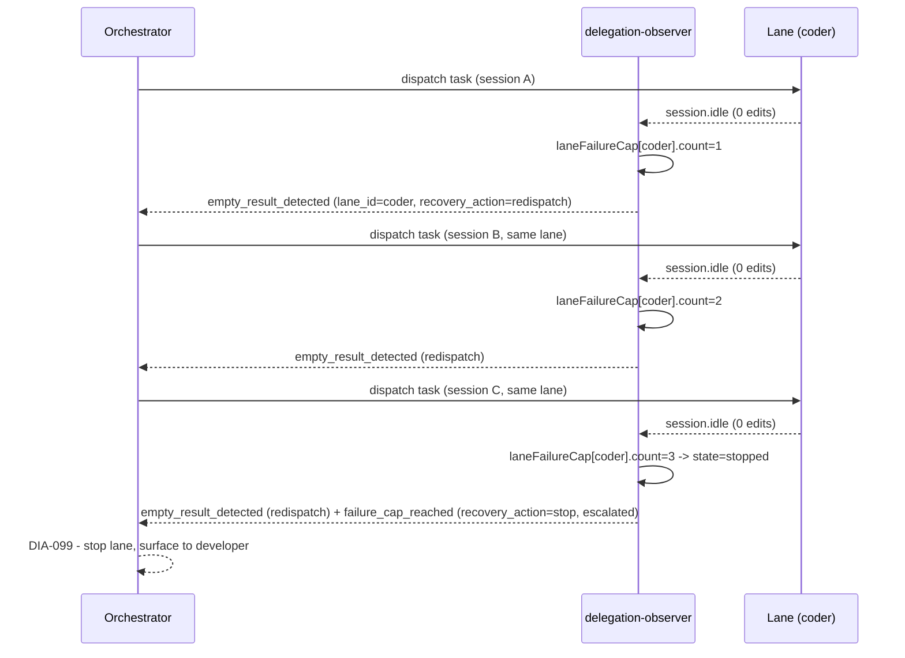

# Design: dia-206-empty-return-recovery

> **Proposal:** `openspec/changes/dia-206-empty-return-recovery/proposal.md`
> **Governing .sdd:** `.sdd/opencode-config/architecture.md` (ADR 1 - plugin is Batch Pattern D dynamic validator)

## Approach

Replace the per-session `failureCap` map (`delegation-observer.ts` ~872-877, used at ~4054-4087) with a per-lane failure map. The lane id is the agent name resolved from `childSessionAgent.get(sessionID)` (already available in the `session.idle` handler at ~4021). The empty-result detection block (~4024-4092) is extended to:

1. Resolve `laneId` from `childSessionAgent` (fallback `"subagent"` if unknown, matching the existing `agentName` fallback).
2. Look up / increment the per-lane counter in the new map.
3. Emit the existing `empty_result_detected` crisis row, now carrying `lane_id` and `recovery_action="redispatch"` (below cap) or `"stop"` (at/after cap).
4. At cap, transition the lane state to `"stopped"` and emit `failure_cap_reached` with `recovery_action="stop"`, `resolution_status="escalated"`.

No new hook event type. The orchestrator already listens for `content_ref=empty-result-requires-redispatch`; the added `lane_id` + `recovery_action` fields give it the structured directive DIA-099 needs.

## Seams (test boundaries)

Per `openspec/config.yaml`, tests live at confirmed public seams. The plugin exposes these via `createDelegationObserver(ctx).hooks`:

- **S1:** `hooks.event({ event: { type: "session.created", properties: { info: { id, parentID, title } } } })` - registers a child session.
- **S2:** `hooks["tool.execute.after"]({ tool: "task", sessionID: parentID, args: { subagent_type, prompt } }, { output: "<task id=...>" })` - registers the lane in `childSessionAgent` (the lane id source).
- **S3:** `hooks["tool.execute.after"]({ tool: "edit", sessionID, ... }, { output })` - registers a file edit (non-empty result).
- **S4:** `hooks.event({ event: { type: "session.idle", properties: { sessionID } } })` - triggers empty-result detection + failure-cap logic.
- **O1:** `.opencode/session/messages.jsonl` - the crisis/recovery rows are appended here; tests assert on parsed rows (`lane_id`, `recovery_action`, `resolution_status`).

These are the EXISTING seams used by `failure-cap.test.mjs` and `empty-result-detection.test.mjs`. No new seam is introduced; the change is observable entirely through O1 (message rows) and the existing registry row (`empty_result_detected`). This keeps the test surface stable.

## Per-lane state machine

In-memory map (mirrors existing `failureCap` pattern; no persistence, no registry schema change):

```
type LaneFailureState = {
  count: number            // consecutive empty results for this lane
  firstFailure: number     // epoch ms of first failure in current streak
  lastSessionId: string    // most recent session that contributed
  state: "monitoring" | "stopped"
}
const laneFailureCap = new Map<string, LaneFailureState>()  // key = laneId
const FAILURE_CAP_THRESHOLD = 3          // unchanged
const FAILURE_CAP_COOLDOWN_MS = 600_000  // unchanged (10 min)
```

Transition rules (applied in the `session.idle` empty-result branch):

| Event            | Condition                                         | Action                                       | New state  | Signal                                                                                                                  |
| ---------------- | ------------------------------------------------- | -------------------------------------------- | ---------- | ----------------------------------------------------------------------------------------------------------------------- |
| empty result     | `count < threshold-1`                             | increment `count`, `lastSessionId=sessionID` | monitoring | `empty_result_detected`, `recovery_action="redispatch"`                                                                 |
| empty result     | `count == threshold-1` (makes `count==threshold`) | increment, `state="stopped"`                 | stopped    | `empty_result_detected` (redispatch) + `failure_cap_reached`, `recovery_action="stop"`, `resolution_status="escalated"` |
| non-empty result | any                                               | delete lane entry                            | (removed)  | none                                                                                                                    |
| cooldown expiry  | `now - firstFailure > COOLDOWN`                   | delete lane entry                            | (removed)  | none                                                                                                                    |
| empty result     | `state=="stopped"` (already capped)               | no further increment (idempotent)            | stopped    | no re-emit of `failure_cap_reached`                                                                                     |

**Idempotency note:** once a lane is `"stopped"`, additional empty results for that lane do NOT re-emit `failure_cap_reached` (avoid spam). The orchestrator's stop decision stands until the lane produces a non-empty result (which resets). Deliberate simplification (ponytail: no need to re-warn the orchestrator every idle).

## Recovery signal schema (message row extension)

Existing `empty_result_detected` row (crisis) gains two fields:

- `lane_id: string` (e.g. `"coder"`, `"reviewer"`, `"subagent"`)
- `recovery_action: "redispatch" | "stop"`

Existing `failure_cap_reached` row changes:

- `resolution_status: "in-flight"` -> `"escalated"` (was non-resolving)
- gains `lane_id` and `recovery_action="stop"`

The orchestrator (DIA-099 resume-truncated-lane) consumes `recovery_action`:

- `"redispatch"` -> re-run the task; per DIA-099 it MAY resume the same session (verify-first, `WORK_LANDED` short-circuit) or dispatch fresh.
- `"stop"` -> do not redispatch this lane; surface to developer.

## Sequence diagram



## Reference to .sdd

`.sdd/opencode-config/architecture.md` ADR 1 establishes the plugin as the dynamic validator for parallel coder batches. This change extends the plugin's empty-result recovery within that same validator role; it does not alter Batch Pattern D semantics, add a module boundary, or introduce a technology choice. No architectural escalation required (AGENTS.md 2.4/2.5).

## Test strategy

New test file `.opencode/plugins/__tests__/empty-return-recovery.test.mjs`, hermetic (mkdtemp + `@opencode-ai/plugin` mock + dynamic import), reusing the `driveTaskDispatch` / `driveToolEdit` / `idleEmpty` helpers from the existing suites. Assertions at seam O1 (messages.jsonl rows). See tasks.md T3/T4 for the concrete cases.

---

<!--
ownership:
  substance: AI
  structure: AI
  interview_depth: compressed
-->
