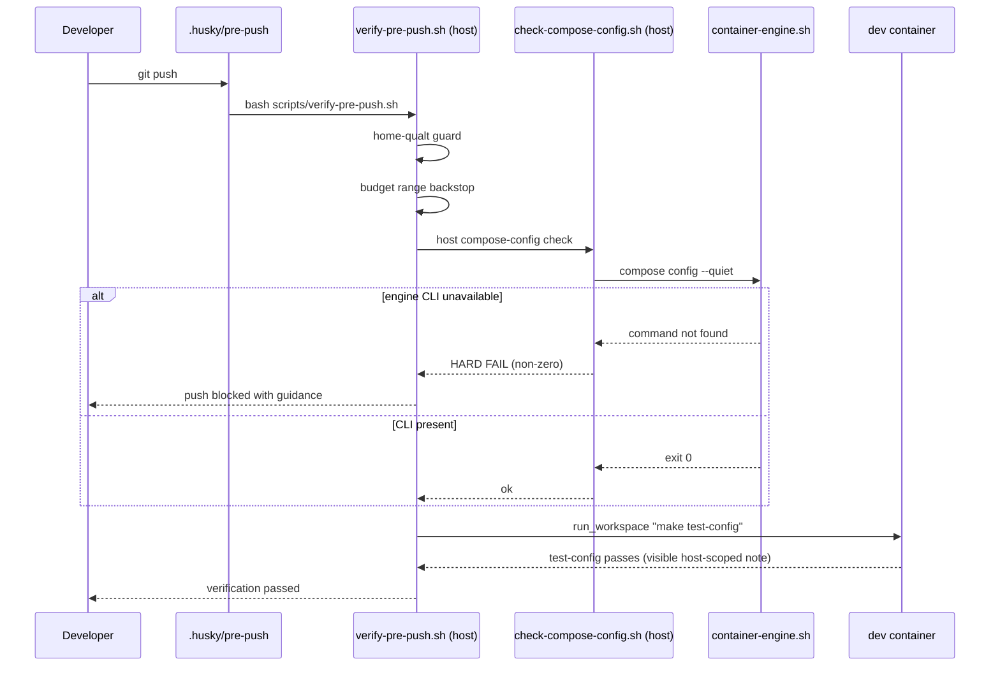

# Design: Unified Docker Development Runtime

## Governing Constraints

- `.sdd/dev-infra/architecture.md` — ADR 8 (bash-3 compatibility)
- `.sdd/dev-infra/architecture.md` — ADR 11 (container topology). Line 99: shared tool pins must have exactly one edit site with parity enforced by a gate; the dev healthcheck must not depend on the opencode binary. Lines 102-104: PHASE 1/3 complete, PHASES 2/4/5 remain.
- `AGENTS.md` §2.4 — dev-infra changes >~20 lines require OpenSpec
- `AGENTS.md` §6 — container gates (DIA-094)
- `DIA-260821-x5nj` / `DIA-260922-cp0m` — this change now owns the container-merge completion (PHASES 2/4/5), superseding the original planning-only framing
- `knowledge/res040-docker-rootless-uid-compatibility/res040-docker-rootless-uid-compatibility-conspect.md` — UID/GID mapping evidence

## Current State

### Container-Merge Progress (2026-09-22)

PHASE 1 (commit 07c0513) and PHASE 3 (commit 63d6478) are complete: the opencode install block is the last layer, and the legacy `tools/opencode-docker` runtime is retired (only `Dockerfile.dev` remains). The "Two Divergent Dockerfiles" table below is retained as the historical rationale for the merge, not as current state. PHASES 2, 4 and 5 are specified in the "Container-Merge Completion" section.

### Two Divergent Dockerfiles

| Aspect               | `Dockerfile.dev` (root)                | `tools/opencode-docker/Dockerfile`                       |
| -------------------- | -------------------------------------- | -------------------------------------------------------- |
| OpenCode version     | 1.18.18                                | 1.18.4                                                   |
| Lines                | 352                                    | 226                                                      |
| Base image           | debian:13-slim                         | debian:13-slim                                           |
| Rust toolchain       | Yes (1.83.0 + rust-analyzer 1.97.1)    | No                                                       |
| Language servers     | Yes (TS, Pyright, YAML, rust-analyzer) | No                                                       |
| OMO plugin cache     | Yes (pre-populated)                    | No                                                       |
| SSH agent forwarding | No                                     | Yes (via bin/opencode-docker wrapper)                    |
| Podman/SELinux       | No                                     | Yes (`--userns=keep-id`, `--security-opt label=disable`) |
| Chromium shm         | Not configured                         | `--shm-size=1g`                                          |
| Entrypoint           | `dev-entrypoint.sh` (bash)             | `bootstrap.py` (Python)                                  |
| Build strategy       | Single-stage                           | Multi-stage (builder-tools → collector → final)          |
| Docker CLI install   | apt-repo (with fallback)               | Static bundles                                           |
| Read-only support    | No                                     | Yes (`--read-only --tmpfs /tmp:exec`)                    |

### Version Drift

The OPENCODE_VERSION ARG differs: 1.18.18 vs 1.18.4. This is the exact problem DIA-260821-x5nj addresses.

## Target State

### Unified Image

`Dockerfile.dev` becomes the single source of truth for the development container. All toolchain, plugins, and runtime configuration live here.

### Engine-Specific Compose Overrides

The UID/GID mapping strategy differs by container engine, not by host OS (res040 §1-3). Two engine-specific override files plus one optional OS overlay:

**`docker-compose.podman.yml`** (Podman engine — `keep-id` + SELinux):

```yaml
services:
  dev:
    userns_mode: keep-id
    security_opt:
      - label=disable
```

Rationale (res040 §2): Podman's `--userns=keep-id` maps the host UID:GID to the same values inside the container, preserving in-container non-root writes and secret readability for bind mounts owned by the host user. `label=disable` bypasses SELinux connectto denials on Fedora.

**`docker-compose.rootless-docker.yml`** (Rootless Docker engine — `user: "0:0"`):

```yaml
services:
  dev:
    user: '0:0'
```

Rationale (res040 §1): In rootless Docker, container UID 0 maps to the host UID of the user running rootless Docker. Setting `user: "0:0"` runs the container process as UID 0, which maps to the host user — making host-owned bind mounts and secrets writable/readable. This is the Docker-side equivalent of Podman's `keep-id` (res040 §3-4).

**`docker-compose.wsl.yml`** (WSL-only overlay — optional, applied on top of engine override):

```yaml
services:
  dev:
    # WSL-specific tuning (if needed)
    # deploy:
    #   resources:
    #     limits:
    #       memory: 8g
```

Rationale: WSL is orthogonal to engine. A WSL host can run either Podman or Docker. WSL-specific settings (memory limits, 9P filesystem tuning) are applied as a separate overlay on top of the selected engine override.

Base `docker-compose.yml` remains the single source of truth for volumes, ports, environment, secrets.

### Unified Launch Command

`scripts/opencode-dev` — bash-3 compatible shell script.

**Interface:**

```
opencode-dev [OPTIONS]

Options:
  --engine=podman|docker   Override auto-detected container engine
  --os=wsl|native          Override auto-detected OS
  --ssh-agent              Force SSH agent forwarding (override auto-detect)
  --no-ssh-agent           Disable SSH agent forwarding (override auto-detect)
  --run-opencode           Launch opencode instead of bash
  --test                   Run make test-infra (host-side)
  --serve                  Launch in serve mode (remote access)
  --help                   Show help
```

**Behavior:**

1. Auto-detect engine via `docker version` output:
   - Contains "Podman" → engine=podman
   - Otherwise → engine=docker
   - Rationale: `docker version` (not `docker --version`) is used because the project's immutable mock supports `version`; both Docker and Podman output remain distinguishable.
2. Auto-detect OS via `/proc/version`:
   - Contains "Microsoft" or "WSL" → os=wsl
   - Otherwise → os=native
3. Auto-detect SSH agent socket (probe order: `$SSH_AUTH_SOCK` → `${XDG_RUNTIME_DIR}/keyring/ssh` → `${XDG_RUNTIME_DIR}/gcr/ssh`):
   - If found: mount read-only at `/tmp/ssh-agent.sock`, set `SSH_AUTH_SOCK=/tmp/ssh-agent.sock`
   - If not found: print warning, skip SSH forwarding
   - Override: `--ssh-agent` forces forwarding, `--no-ssh-agent` disables
4. Select engine override (required): `docker-compose.<engine>.yml`
5. If os=wsl, also select OS overlay (optional): `docker-compose.wsl.yml`
6. If container not running: `docker compose -f docker-compose.yml -f docker-compose.<engine>.yml [-f docker-compose.wsl.yml] up -d dev`
7. Execute appropriate command:
   - Default: `docker compose exec dev bash`
   - `--run-opencode`: `docker compose exec dev opencode`
   - `--test`: `make test-infra` (host-side, not inside container)
   - `--serve`: launch in serve mode (remote access, Tailscale/Android)

**Compose invocation examples:**

- Podman + Fedora: `docker compose -f docker-compose.yml -f docker-compose.podman.yml up -d dev`
- Podman + WSL: `docker compose -f docker-compose.yml -f docker-compose.podman.yml -f docker-compose.wsl.yml up -d dev`
- Docker + Fedora: `docker compose -f docker-compose.yml -f docker-compose.rootless-docker.yml up -d dev`
- Docker + WSL: `docker compose -f docker-compose.yml -f docker-compose.rootless-docker.yml -f docker-compose.wsl.yml up -d dev`

**Compatibility:**

- `make opencode` continues to work
- `docker compose exec dev bash` continues to work

### First-Release Integration Scope

From `tools/opencode-docker` into `Dockerfile.dev`:

1. **Direct in-container Git hooks**
   - Hooks execute inside poetry-dev (no host delegation)
   - Husky remains a project devDependency, provisioned via `pnpm exec` after `pnpm install`
   - `.husky/pre-commit` and `.husky/pre-push` run directly inside container

2. **SSH agent forwarding**
   - Auto-detect host SSH agent socket (probe order: `$SSH_AUTH_SOCK` → `${XDG_RUNTIME_DIR}/keyring/ssh` → `${XDG_RUNTIME_DIR}/gcr/ssh`)
   - Mount read-only at `/tmp/ssh-agent.sock`
   - `GIT_SSH_COMMAND="ssh -o StrictHostKeyChecking=accept-new -o UserKnownHostsFile=/tmp/known_hosts -o IdentityAgent=/tmp/ssh-agent.sock"`
   - `UserKnownHostsFile=/tmp/known_hosts` (writable tmpfs)
   - Graceful degradation: warning if no SSH agent found, explicit `--ssh-agent` / `--no-ssh-agent` overrides

3. **Engine-specific UID/GID mapping** (via compose overrides, not Dockerfile)
   - Podman override: `userns_mode: keep-id` + `security_opt: [label=disable]` (res040 §2)
   - Rootless-Docker override: `user: "0:0"` (res040 §1, §4)
   - Engine detection in `opencode-dev` selects the matching override

4. **Chromium shared memory**
   - `--shm-size=1g` for Playwright chromium

5. **Serve mode**
   - `--serve` flag for remote access (Tailscale/Android)
   - Port publishing + env-file + workdir configuration

6. **Resource limits**
   - 8g memory, 4 CPUs (default)
   - Developer-local override support via `docker-compose.override.yml` or engine-specific override

7. **Git identity**
   - Mount host `~/.gitconfig` read-only at `/home/dev/.gitconfig`
   - Single source of truth for git identity

8. **Entrypoint unification**
   - `dev-entrypoint.sh` as sole entrypoint
   - Migrate `openspec init --tools opencode` from `bootstrap.py`
   - Retire `bootstrap.py` in legacy removal phase

9. **Docker CLI removal**
   - Remove `docker-ce-cli` + `docker-compose-plugin` from `Dockerfile.dev` (~90MB savings)
   - Infrastructure orchestration remains host-side explicit mode

10. **NO engine socket**
    - No Docker/Podman socket mounted (minimal attack surface)
    - Container cannot communicate with engine

### Deferred Scope

Explicitly NOT in first release:

1. **`--read-only --tmpfs /tmp:exec`**
   - Dockerfile.dev explicitly not read-only by design (line 15-17: "intentionally NOT distroless and NOT --read-only: dev must be able to write")
   - Would require significant refactoring

2. **Static Docker CLI bundles**
   - Docker CLI removed entirely from container (no apt-repo install, no static bundles)
   - Infrastructure orchestration remains host-side explicit mode

3. **Multi-stage build optimization**
   - `collect-runtime-deps.sh` pattern
   - Current single-stage build is functional
   - Optimization can come later

## Container-Merge Completion (PHASES 2, 4, 5)

Added 2026-09-22 (DIA-260922-cp0m). These phases complete the merge begun by this change; PHASES 1 and 3 are already implemented. Authority is ADR 11 (`.sdd/dev-infra/architecture.md`).

### PHASE 2 — Single Tool-Pin Source

**Reference-only pin semantics.** ADR 11's "exactly one edit site" is read as ONE SITE PER PIN, not one file for all pins. `.mise.toml [tools]` is the reference for pins mise can install; where mise cannot install a pin, the reference entry is a REFERENCE-ONLY pin for the parity gate and does not imply mise manages the binary.

**Verify-then-branch rule (T10.0).** Before choosing a representation, verify in-container whether mise's registry provides `opencode` and `bun`, then branch:

| Branch | mise support         | Representation                                                                                                          |
| ------ | -------------------- | ----------------------------------------------------------------------------------------------------------------------- |
| A      | `opencode` AND `bun` | both under `[tools]`; extend `check-tools.sh` `probe_tool` to cover the new keys at their Dockerfile ARG values         |
| B      | `bun` only           | `bun` under `[tools]`; the `opencode` pin lives in a dedicated reference (`scripts/pins.env`) read by `parse_reference` |
| C      | neither              | both new pins live in the dedicated reference file; `[tools]` keeps node/pnpm only                                      |

**Hard constraint (stated acceptance criterion).** `make check-tools` MUST NOT break. `scripts/check-tools.sh:53-56` runs an unscoped `mise install` over the entire `[tools]` block and hard-fails on any unresolvable entry; a verification step in T10.0/T10.3 covers this explicitly.

**Gate contract unchanged.** Four comparisons, report-ALL (never fail-fast), exit precedence `2 (INFRA) > 1 (mismatch) > 0 (match)`.

**Alternatives considered.** Put all four pins in `[tools]` unconditionally (rejected: breaks `make check-tools` if mise cannot install opencode); leave the gate at two pairs (rejected: leaves opencode/bun ungated and does not satisfy ADR 11 line 99); gate OMO here too (rejected: OMO already has a 3-way gate, `scripts/check-omo-version-sync.sh`, over a different reference set).

### PHASE 4 — Healthcheck Decoupling

**Probe:** `node --version >/dev/null 2>&1 || exit 1`.

**Rationale:** node is a core runtime, installed deterministically and unaffected by opencode pin bumps; the healthcheck must not depend on the opencode binary because one developer workflow never uses it (ADR 11 line 99).

**Cross-change supersession.** `openspec/changes/dia-260824-opencode-log-permission-fix/tasks.md` task 1.3 (`gosu dev opencode --version`) is SUPERSEDED-BY this change. The gosu wrapper form is moot because the probe no longer runs opencode.

**Alternatives considered.** Keep `opencode --version` (rejected: violates ADR 11 line 99); probe `pnpm` or `mise` (rejected: node is the runtime the app needs and is the least coupled to any single workflow).

### PHASE 5 — Docker CLI Removal and Host-Side Compose-Config Gate

**Chosen variant:** RELOCATE the compose-config check to the host, then REMOVE the Docker CLI. Rationale: `Makefile:209 $(COMPOSE) config --quiet` is the only runtime docker invocation in the repository (the other grep hits are comments, docs, and host-side bats); the host always has docker, so the gate moves rather than disappears.

**Host check interface:**

- `scripts/check-compose-config.sh` (host-only): runs `<engine> compose config --quiet` through `scripts/container-engine.sh`.
- `make check-compose-config` target.
- Invoked host-side from `scripts/verify-pre-push.sh` ABOVE the container-down early-exit (the home-qualt guard and budget backstop precedent).
- HARD FAIL when the engine CLI is unavailable; NEVER a silent skip.

**Offline contract preserved.** `docker compose config` is client-side and needs no daemon, so the documented "offline dev stack never blocks" pre-push contract holds even when the stack is down.

**In-container `test-config`.** The compose-config line is removed from the shared recipe and replaced by an explicit, visible host-scoped skip note: documented, never a silent drop.

**Dockerfile failure-mode correction.** The DIA-131 comment's real delegation path is the engine adapter with `-f docker-compose.yml --user dev` (`scripts/verify-pre-push.sh:68`), not `docker compose exec -T dev`; the real error when the CLI is absent is `bash: docker: command not found`, not `make: docker: No such file or directory`.

**False-green guard (PHASE 3 lesson).** A gate that silently shrinks its own coverage is a Critical defect. The relocated check therefore has a testable non-silent acceptance criterion: missing CLI -> non-zero with guidance; in-container -> visible note, never a silent pass.

#### Pre-push host flow (post-change)



## Seams

### Seam 1: Engine Detection Boundary

**Location:** `scripts/opencode-dev`

**Contract:**

- Input: `docker version` output
- Output: Engine identifier (`podman` or `docker`)
- Override: `--engine=podman|docker` flag

**Test:** Mock-based bats test verifies detection logic by mocking `docker version` output.

### Seam 1b: OS Detection Boundary

**Location:** `scripts/opencode-dev`

**Contract:**

- Input: `/proc/version` content
- Output: OS identifier (`wsl` or `native`)
- Override: `--os=wsl|native` flag

**Test:** Mock-based bats test verifies detection logic by mocking `/proc/version` content.

### Seam 2: Engine Override Boundary

**Location:** `docker-compose.podman.yml`, `docker-compose.rootless-docker.yml`

**Contract:**

- Input: Base `docker-compose.yml` configuration
- Output: Engine-specific UID/GID mapping strategy merged at compose time
- Constraint: No duplication of volumes, ports, environment, secrets
- Evidence: res040 §1-4 (Podman keep-id vs Docker user 0:0)

**Test:** `docker compose config` validates merged configuration.

### Seam 2b: OS Overlay Boundary

**Location:** `docker-compose.wsl.yml`

**Contract:**

- Input: Base `docker-compose.yml` + engine override
- Output: WSL-specific settings merged at compose time (optional)
- Constraint: No duplication of volumes, ports, environment, secrets
- Constraint: Applied on top of engine override, not as a replacement

**Test:** `docker compose config` validates merged configuration with WSL overlay.

### Seam 3: SSH Agent Forwarding Boundary

**Location:** `scripts/opencode-dev` + `Dockerfile.dev`

**Contract:**

- Input: Host SSH agent socket (`$SSH_AUTH_SOCK` or probed paths)
- Output: Socket mounted at `/tmp/ssh-agent.sock` in container
- Constraint: Keys never leave host; only socket forwarded

**Test:** Real acceptance test on Fedora + WSL verifies `git push` works.

### Seam 4: Contract Test Boundary

**Location:** `scripts/__tests__/unified-container-contract.bats`

**Contract:**

- Input: Both compose override files
- Output: Identical `opencode --version` string
- Constraint: Mock tests do NOT prove runtime versions

**Test:** Real acceptance verification on started containers.

### Seam 5: Secrets Ownership Preflight Boundary

**Location:** `scripts/opencode-dev` (preflight function) + `scripts/check-secrets-ownership.sh`

**Contract:**

- Input: `secrets/` directory on host
- Output: Exit 0 if safe, exit 1 with actionable diagnostics if unsafe
- Checks:
  - `secrets/` owned by host rootless-Podman user (UID that `keep-id` maps)
  - Each secret file is mode `0600`
  - No group/other read bits
- Constraint: MUST NOT use `chown -R` or `chmod -R` — only explicit per-file operations
- Constraint: MUST NOT attempt automatic remediation — only print diagnostics and exit
- Constraint: SSH-agent separation preserved (SSH socket forwarding is orthogonal)

**Test:** Mock-based bats test verifies preflight logic by mocking `stat` output and ownership checks.

### Seam 6: Keep-ID Recreation Verification Boundary

**Location:** `scripts/__tests__/keep-id-recreation-verify.bats`

**Contract:**

- Input: Running container with Podman `keep-id` active
- Output: Verification that:
  1. Secret mountpoints are created successfully inside the container
  2. Git index write succeeds (container can write to `.git/` bind mount)
  3. API secret is readable only by intended dev process (no broad read)
- Constraint: Requires real container running (not mock-based)

**Test:** Real acceptance verification on started Podman container.

### Seam 7: Tool-Pin Parity Boundary

**Location:** `scripts/check-pin-sync.sh` (parse_reference / parse_dockerfile) + the tool-pin reference (`.mise.toml [tools]` and/or `scripts/pins.env`)

**Contract:**

- Input: reference pins for node, pnpm, opencode, bun + `Dockerfile.dev` ARG declarations
- Output: `ok:` / `fail:` lines + summary; exit precedence `2 (INFRA) > 1 (mismatch) > 0 (match)`
- Constraint: report-ALL (never fail-fast); exactly four comparisons
- Constraint: adding the new reference pins MUST NOT break `make check-tools` (unscoped `mise install`)

**Test:** `scripts/__tests__/check-pin-sync.bats` (4-pin FAKE-mock matrix) at this seam.

### Seam 8: Healthcheck Probe Boundary

**Location:** `Dockerfile.dev` HEALTHCHECK CMD string

**Contract:**

- Probe: `node --version >/dev/null 2>&1 || exit 1`
- Constraint: MUST NOT reference `opencode`; no `gosu` wrapper required

**Test:** `scripts/__tests__/verify-pre-commit-uid-mismatch.bats` Dockerfile assertion at this seam.

### Seam 9: Host-Side Compose-Config Gate Boundary

**Location:** `scripts/check-compose-config.sh` + `check-compose-config` Makefile target + `scripts/verify-pre-push.sh` host path

**Contract:**

- Input: host engine CLI availability
- Command: `<engine> compose config --quiet` via `scripts/container-engine.sh`
- Output: exit 0 when the merged config validates; non-zero with actionable guidance when the engine CLI is unavailable
- Constraint: MUST NOT silently skip; client-side validation needs no daemon
- Constraint: in-container `make test-config` reports the check as host-scoped and still passes

**Test:** `scripts/__tests__/check-compose-config.bats` (mock CLI absent -> hard fail; present -> pass) at this seam.

## Test Strategy

### Mock-Based Unit Tests

**File:** `scripts/__tests__/opencode-dev.bats`

**Coverage:**

- Default behavior (no flags)
- `--ssh-agent` flag
- `--run-opencode` flag
- `--test` flag
- Engine auto-detection (mock `docker version` with "Podman" vs without)
- OS auto-detection (mock `/proc/version` with "Microsoft"/"WSL" vs without)
- `--engine` override
- `--os` override
- Correct override file selection per engine+OS combination
- Container already running (skip `up`)

**Pattern:** Mock `docker` command; verify correct compose invocation with engine+OS overrides.

**Limitation:** Does NOT verify runtime behavior, version consistency, or UID mapping.

### UID/GID Mapping Tests

**File:** `scripts/__tests__/engine-override-uid.bats`

**Coverage:**

- Podman override: bind-mounted file shows host UID inside container (keep-id semantics, res040 §2)
- Rootless-Docker override: bind-mounted file shows root inside container (UID 0 maps to host user, res040 §1)
- Both strategies: container process can write to host-owned bind mounts
- Both strategies: container process can read host-owned secrets

**Pattern:** Requires real containers running (not mock-based). Verifies the UID mapping contract from res040.

**Integration:** Added to `make test-infra` as acceptance gate.

### Contract Test

**File:** `scripts/__tests__/unified-container-contract.bats`

**Coverage:**

- `docker compose -f docker-compose.yml -f docker-compose.podman.yml exec dev opencode --version`
- `docker compose -f docker-compose.yml -f docker-compose.rootless-docker.yml exec dev opencode --version`
- Assert identical output

**Pattern:** Requires real containers running (not mock-based).

**Integration:** Added to `make test-infra` as acceptance gate.

### Secrets Ownership Preflight Tests

**File:** `scripts/__tests__/check-secrets-ownership.bats`

**Coverage:**

- Preflight passes when `secrets/` owned by host rootless-Podman user and all files mode `0600`
- Preflight fails with actionable diagnostics when `secrets/` owned by wrong user
- Preflight fails with actionable diagnostics when any secret file is not mode `0600`
- Preflight fails with actionable diagnostics when any secret file has group/other read bits
- Preflight script never uses `chown -R` or `chmod -R` (verify by code inspection or mock)

**Pattern:** Mock `stat` and `id` commands; verify preflight logic and diagnostic output.

**Limitation:** Does NOT verify runtime behavior — only preflight logic.

### Keep-ID Recreation Verification Tests

**File:** `scripts/__tests__/keep-id-recreation-verify.bats`

**Coverage:**

- After Podman `keep-id` container start: secret mountpoints exist inside container
- After Podman `keep-id` container start: git index write succeeds (container can write to `.git/`)
- After Podman `keep-id` container start: API secret is readable only by intended dev process (verify mode/owner inside container)

**Pattern:** Requires real Podman container running (not mock-based). Verifies the keep-id recreation contract.

**Integration:** Added to `make test-infra` as acceptance gate (Podman engine only).

### Real Acceptance Verification

**Platforms:** Fedora (Podman or Docker) + WSL (Podman or Docker)

**Checks:**

1. All existing gates pass (`make test-infra`, `make test-config`, `make test-shell`, hooks)
2. SSH agent forwarding works (`git push` to SSH remote)
3. Chromium launches without shared-memory errors
4. `opencode --version` identical on both platforms
5. Bind mounts writable under selected engine strategy (res040 §1-4)
6. Secrets readable under selected engine strategy
7. Preflight refusal works: unsafe `secrets/` ownership/mode causes `opencode-dev` to exit with actionable diagnostics
8. Keep-id recreation verification: secret mountpoints created, git index write succeeds, API secret readable only by intended dev process (Podman engine)

**Evidence:** Collected and attached to implementation ticket.

## Migration Plan

### Phase 1: Preparation (This Ticket)

- Create OpenSpec artifacts (proposal, design, tasks, specs)
- Document decision and rollback plan
- No implementation

### Phase 2: Implementation (Follow-Up Ticket)

1. Integrate SSH agent forwarding into `Dockerfile.dev`
2. Create engine-specific compose overrides:
   - `docker-compose.podman.yml` (keep-id + SELinux, res040 §2)
   - `docker-compose.rootless-docker.yml` (user: "0:0", res040 §1)
   - `docker-compose.wsl.yml` (WSL-only overlay, optional)
3. Configure Chromium `--shm-size=1g`
4. Create `scripts/opencode-dev` with engine+OS auto-detection
5. Add PATH exposure in `dev-entrypoint.sh`
6. Create mock-based bats tests (engine detection, OS detection, override selection)
7. Create UID/GID mapping tests (res040 contract verification)
8. Create contract test (identical `opencode --version`)
9. Update documentation (`docs/docker-dev.md`, `AGENTS.md` §6)

### Phase 3: Verification

1. Run all existing gates on Fedora + WSL
2. Verify SSH push works on both platforms
3. Verify Chromium launches on both platforms
4. Verify `opencode --version` identical on both platforms
5. Collect evidence

### Phase 4: Retirement (COMPLETE — commit 63d6478)

1. Reviewer audit
2. ai-auditor audit
3. Explicit confirmations from both developers
4. Physical deletion of `tools/opencode-docker/`

Superseded-by-direction (DIA-260824-8k62): the legacy runtime was retired before the threshold under explicit developer direction, and PHASE 3 is recorded COMPLETE in ADR 11. The original 7-day/3-day threshold requirement is therefore removed from the delta spec.

### Phase 5: Container-Merge Completion (PHASES 2, 4, 5 — this extension)

1. PHASE 2: extend the pin gate to four pairs and add the reference pins (verify-then-branch; `make check-tools` must not break)
2. PHASE 4: decouple the healthcheck from opencode (node probe) and update the regression test
3. PHASE 5: add the host `check-compose-config` gate, remove the Docker CLI from the image, and update the in-container `test-config` line
4. Reconcile the delta spec (REMOVE legacy-launcher preservation; MODIFY rollback; ADD the three new requirements)

## Rollback Plan

### Immediate Rollback

1. `git revert` the implementation commit(s)
2. Remove `docker-compose.podman.yml`, `docker-compose.rootless-docker.yml`, `docker-compose.wsl.yml`
3. Remove `scripts/opencode-dev`
4. `tools/opencode-docker/` remains unchanged and functional

### No `--legacy` Wrapper

Developer explicitly rejected `--legacy` flag. Use `tools/opencode-docker/bin/opencode-docker` directly for rollback.

### Rollback Triggers

- Any gate failure on either platform
- SSH push failure
- Chromium launch failure
- Version mismatch detected
- Developer request

## Risk Mitigation

### Risk 1: Engine Detection Fails

**Mitigation:** `--engine=podman|docker` override flag allows manual selection.

### Risk 2: OS Detection Fails

**Mitigation:** `--os=wsl|native` override flag allows manual selection. WSL overlay is optional; if detection fails, engine override still applies.

### Risk 3: SSH Agent Socket Not Found

**Mitigation:** Probe order: `$SSH_AUTH_SOCK` → `${XDG_RUNTIME_DIR}/keyring/ssh` → `${XDG_RUNTIME_DIR}/gcr/ssh`. Warning printed if not found; opencode still works.

### Risk 4: Compose Override Merge Conflict

**Mitigation:** Minimal overrides (engine-specific UID mapping + optional WSL overlay only). Base `docker-compose.yml` is single source of truth. `docker compose config` validates merge.

### Risk 5: UID Mapping Strategy Mismatch

**Mitigation:** Engine detection ensures correct strategy: Podman uses keep-id (res040 §2), rootless Docker uses user: "0:0" (res040 §1). If detection fails, manual `--engine` override. UID/GID mapping tests verify the contract.

### Risk 6: Entrypoint Incompatibility

**Mitigation:** Deferred to future iteration. First release keeps `dev-entrypoint.sh` unchanged.

### Risk 7: Unsafe Secrets Ownership Breaks keep-id

**Mitigation:** Preflight refusal with actionable diagnostics. `opencode-dev` checks `secrets/` ownership and mode before starting the container. If unsafe, it prints specific remediation commands (`chown <uid>:<gid> secrets/<file>`, `chmod 0600 secrets/<file>`) and exits non-zero. The script MUST NOT use `chown -R` or `chmod -R` — only explicit per-file operations. The script MUST NOT attempt automatic remediation — only print diagnostics and exit. Rollback: revert ownership/mode changes manually; no automated chown rollback.

### Risk 8: Keep-ID Recreation Fails to Create Secret Mountpoints

**Mitigation:** Keep-id recreation verification test (`scripts/__tests__/keep-id-recreation-verify.bats`) verifies that secret mountpoints are created, git index write succeeds, and API secret is readable only by intended dev process. If verification fails, the test fails and the implementation is blocked.

## Compatibility Evidence

### Podman Engine (Fedora or WSL)

- UID/GID mapping: `--userns=keep-id` maps host UID:GID to same values inside container (res040 §2)
- SELinux (Fedora): `--security-opt label=disable` bypasses connectto denial
- Bind mounts: Host-owned files appear with host UID inside container; writes succeed (res040 §2)
- Secrets: Host-owned secrets readable by non-root container process (res040 §2)
- SSH agent: Socket forwarding works with `keep-id` + `label=disable` (DIA-164)

### Rootless Docker Engine (Fedora or WSL)

- UID/GID mapping: Container UID 0 maps to host UID of user running rootless Docker (res040 §1)
- `user: "0:0"`: Runs container process as UID 0, which maps to host user (res040 §1, §4)
- Bind mounts: Host-owned files appear as root-owned inside container; writes succeed because container runs as root (res040 §1)
- Secrets: Host-owned secrets readable by container process running as root (res040 §1)
- SSH agent: Socket forwarding works with `user: "0:0"`

### WSL Overlay (Optional, Applied on Top of Engine Override)

- WSL is orthogonal to engine; a WSL host can run either Podman or Docker
- WSL-specific settings (memory limits, 9P filesystem tuning) applied as separate overlay
- Docker Desktop on WSL2: Files under `/home/<user>/` follow normal Linux UID/GID; files under `/mnt/c` follow Windows-style permissions (res040 §5)

### Both Engines

- Chromium: `--shm-size=1g` prevents shared-memory errors
- OpenCode: Single image = single version = identical `opencode --version`
- Evidence base: `knowledge/res040-docker-rootless-uid-compatibility/res040-docker-rootless-uid-compatibility-conspect.md`
