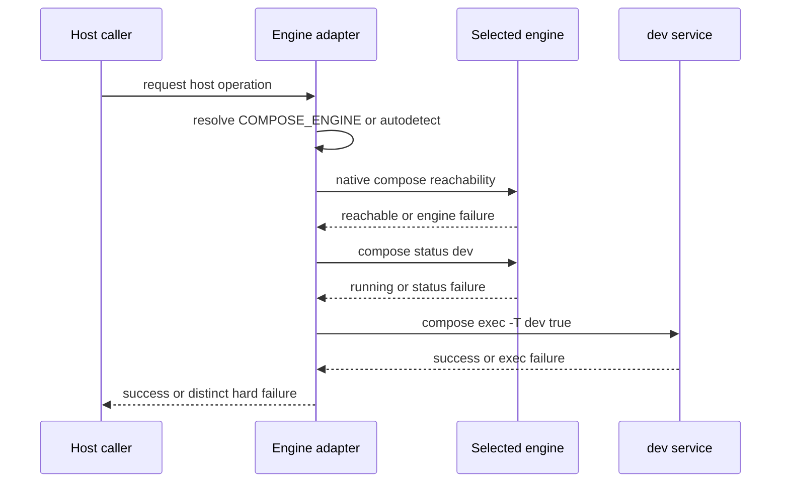

# Design: Podman support for the DIA-094 container-engine adapter

**Governing ticket:** DIA-260912-y2uo "podman support for DIA-094 container-engine adapter with engine-neutral checks, hard-fail preserved"

**Ownership:** substance: developer; structure: AI; interview_depth: compressed; interview_reason: Developer supplied and confirmed the five governing decisions, then explicitly requested synthesis.

## Context

See `proposal.md` for motivation and `specs/host-container-engine-adapter/spec.md` for the behavior contract. Current host-side hooks issue Docker-specific compose, info, status, and exec commands directly. `scripts/compose-env.sh` already provides `COMPOSE_ENGINE` vocabulary and engine-specific compose-file selection, but it intentionally never invokes an engine. The new adapter stays within the existing dev-infra script boundary; no module, technology, data-model, or dependency change is proposed.

`.sdd/dev-infra/architecture.md` ADR 8 requires bash-3-compatible infrastructure scripts. `openspec/specs/container-engine-socket-selection/spec.md` supplies the existing Docker and rootless Podman context. The adapter must preserve the existing Docker-free behavior needed when Make parses host-runnable shell targets.

## Goals / Non-Goals

**Goals:**

- Establish one sourceable host-side contract that resolves the selected engine and invokes its native compose command.
- Make all host-side engine operations consume that contract, including the complete DIA-094 readiness path.
- Preserve strict, non-fallback failure semantics and distinguish engine, service-status, and service-exec failures.
- Retain Docker-free compose-file computation where Make requires it.

**Non-Goals:**

- No container image, compose-service, volume, UID/GID, socket-mount, or in-container command redesign.
- No engine switching after selection and no best-effort commit-gate behavior.
- No new external command, package, service, or persistent state.

## Decisions

1. **One bash-3 host engine contract.** A single sourceable script boundary owns engine selection and exposes the selected native compose invocation to all host callers. It centralizes existing engine selection with compose-file selection rather than duplicating Docker/Podman conditionals across hooks, Make targets, and scripts. This is the smallest shared seam that covers the developer-approved full host scope.

2. **Override first, detection only when unset.** `COMPOSE_ENGINE=docker|podman` is authoritative. The contract uses existing detection behavior only when no override is supplied, validates explicit values at the trust boundary, and reports selection failures before a host-side compose call. This preserves operator control while allowing existing default workflows.

3. **Native command pair.** The resolved contract invokes `docker compose` for Docker and `podman compose` for Podman. A Docker-compatible API path for Podman is excluded by developer decision Q4. In-container execution is deliberately outside the adapter because it does not select or operate the host engine.

4. **Three-stage DIA-094 proof.** The host gate checks selected-engine reachability, then selected-stack `dev` running status, then selected-engine `compose exec -T dev true`. Each stage has a distinct diagnostic and fails closed. This prevents status output from being mistaken for executable readiness.

5. **No cross-engine fallback.** A selected engine remains selected through a failed check. A fallback could target a different compose stack, violating the gate's claim that the selected development environment is usable. This follows developer decision Q5.

### Approach

The adapter provides the highest-level existing script seam for host callers. Compose-file computation remains Docker-free while the adapter uses the selected native command only when an operation is requested. Existing host callers are converted to request config, up, down, exec, reachability, or service-status through the contract rather than assembling direct engine commands. The commit hook consumes the three-stage readiness result before delegating lint work.

## Seams

- **Engine-selection seam:** accepts `COMPOSE_ENGINE` and host detection inputs; returns one validated engine choice and its native compose invocation. Bats mocks prove override precedence, autodetection, and invalid-value failure.
- **Host-operation seam:** accepts a compose config, up, down, exec, reachability, or status request; runs it through the selected invocation. Command-recording Bats mocks prove each operation uses the selected engine only.
- **DIA-094 readiness seam:** evaluates reachability, `dev` running status, and `exec -T dev true` in order. Bats mocks prove each distinct failure and prove status alone cannot pass.
- **Selected-engine acceptance seam:** a real selected engine and development stack demonstrate a running `dev` service and successful non-mutating exec.

## Risks / Trade-offs

- **Existing direct host calls are missed** -> inventory every host-side compose, engine-info, and readiness call and make the Bats command-recording test fail on bypasses.
- **Make parse-time invokes an engine** -> keep compose-file computation Docker-free and run native engine commands only for an actual requested operation.
- **Autodetection is ambiguous on a host with multiple clients** -> operators set authoritative `COMPOSE_ENGINE`; tests preserve documented behavior when it is unset.
- **Status passes but exec is broken** -> require the final non-mutating exec proof and issue an exec-specific hard failure.
- **A fallback masks a selected-engine outage** -> prohibit fallback and preserve the selected engine in every diagnostic.

## Migration Plan

1. Add the bash-3 adapter contract and connect existing compose-file selection without changing compose-service definitions.
2. Migrate every host-side engine caller to the contract, including the DIA-094 consumer hook.
3. Add Bats command-recording coverage for both engines, all covered operations, no fallback, and the three readiness outcomes.
4. Run `make test-shell`, then run selected-engine acceptance evidence with `dev` running and `compose exec -T dev true` succeeding.
5. Roll back by reverting the adapter, caller migration, and tests as one change. No state migration or cleanup is required.
