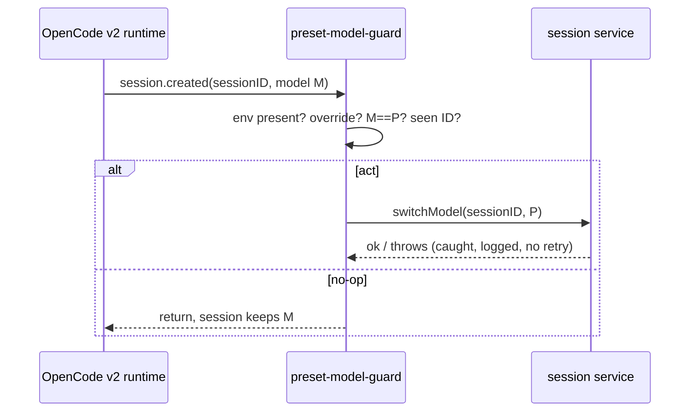

# Design: dia-260918-ok9m-s1-switchmodel-guard

## Context

See proposal.md Why. Current state: `session.created` is already observed by `.opencode/plugins/delegation-observer.ts` ("event" hook: created RUNNING, idle COMPLETE, error FAILED) but nothing acts on the model. Per the S1 V2-ONLY verdict (ADR 2366-2379), v1 can observe `session.created` yet cannot act; model control must go through the v2 path where `ctx.session.switchModel` exists (OMO dist calls it via V2Context at dist/index.js:47796+47845). Governing constraints read: `.sdd/opencode-config/architecture.md` (plugin seam precedent, ADR 3 RED/GREEN separation, ADR 4 same-session fixes).

## Goals / Non-Goals

**Goals:**

- One new v2-shape plugin file that switches divergent newborn sessions to preset intent exactly once at creation.
- Zero changes to delegation-observer, OMO dist, presets, or config-file contents.
- Fail-soft under every error class; session creation never blocked.

**Non-Goals:**

- No per-turn or per-message enforcement (O2 rejected, never re-proposed).
- No config stripper revival (S3 reverted, stays reverted).
- No new module boundary, technology choice, or cross-cutting framework (no architector escalation; plugin-local by design).

## Approach

Reference `.sdd/opencode-config/architecture.md`: the guard follows the Batch Pattern D precedent of a small observer plugin on the session lifecycle, reusing the `session.created` channel family in a separate file so the observer keeps single responsibility.

New file `.opencode/plugins/preset-model-guard.ts`, v2 export shape `{id, server, setup}` per OMO `dist/v2/index.d.ts:4-6`:

1. `setup`: probe the v2 session surface for `switchModel`; if absent (v1 runtime or shape drift), register nothing and log one line (degrade to no-op).
2. `server` event subscription: on `session.created`, run the decision function:
   - read `OH_MY_OPENCODE_SLIM_PRESET`; absent/empty -> return (no-op).
   - resolve preset intent to `{providerID, id}` via the same preset-to-model mapping the active preset uses; unparsable -> log once, return.
   - detect explicit override: newborn session created with `--model` / agent-model selection -> return (no explicit clobbering).
   - compare newborn model to intent; equal -> return.
   - check fired-set for sessionID; present -> return (fire-once).
   - else `await ctx.session.switchModel({sessionID, model: intent})` in try/catch; on throw, log once, return with no retry. Record sessionID in fired-set before (or idempotently after) the call so duplicates stay single.
3. Registration: add the file to the `.opencode/opencode.jsonc` plugin array only if the v2 loader requires explicit registration; otherwise file presence suffices. Then run the version-sync triplet and full `make test-config` re-pass (accepted v2 migration cost).

Data flow:

## Decisions

- D1 New file vs extending delegation-observer: new file, because the observer owns registry + ticket-gate + formatter duties and the guard must be independently revertible (one-file delete). Alternative (add to observer) rejected: couples unrelated failure domains.
- D2 Fired-set in module scope vs persisted: module scope (in-process Set), because sessions are process-scoped and the guarantee is "once per creation event burst"; no disk state, no registry writes. Alternative (registry.jsonl mark) rejected: writes on every session creation for zero cross-process benefit.
- D3 Env-only intent source vs reading preset block: env-only, because `OH_MY_OPENCODE_SLIM_PRESET` is the launch-time intent carrier and reading the preset block would duplicate OMO merge logic (startup vs runtime asymmetry in res-260921-qivl sec 5). Alternative rejected: re-implementing preset merge in the guard.
- D4 setup-time shape probe vs import-time assert: probe, because OMO upgrades can drift the v2 shape and a probe degrades to no-op while an assert crashes every session start.

## Seams

Pre-agreed public boundaries where tests live (confirmed with developer in Compressed Q4/Q7, no amendments):

- S1 v2 `session.created` event hook of the new guard file: ALL behavior tests live here (divergent switch, override exempt, env absent, already-correct, duplicate event, throwing switchModel). Preferred existing seam family: the delegation-observer "event" channel; the guard exposes the same-shaped handler so existing harness patterns (DIA-189 env-marker fixtures, mock session service) transfer directly.
- S2 `setup` shape-probe branch: v1/absent-switchModel degradation test (register-nothing, one log line). No other seams; no test is written at an unconfirmed seam. Confirm S1+S2 with the user before any RED test is authored (done: Q7 agreed).

## Test strategy

RED instance (coder session A, test-author only): failing tests at S1 covering the six spec scenarios (switch once; override zero; env absent zero; already-correct zero; duplicate exactly-one; throw survives with no retry) plus one S2 probe test, using a mocked session service capturing switchModel calls and env-marker fixtures per the DIA-189 pattern. GREEN instance (coder session B, different session per DIA-175): implements the guard file until RED goes green; no refactoring during RED-GREEN cycles. Verification per slice: focused test file run + `make test-config`; full suite once at the end. Fix loops resume the GREEN session (ADR 4).

## Risks / Trade-offs

- [Risk] OMO dist upgrade drifts the v2 `{id, server, setup}` shape or renames switchModel -> Mitigation: setup-time probe degrades to no-op with a log line; version-sync triplet pins the verified dist.
- [Risk] Preset intent parsing diverges from OMO preset merge (startup vs runtime asymmetry) -> Mitigation: env-only intent plus equality short-circuit; a wrong parse degrades to one stray switch at creation, visible in the next-turn model banner, revertible by file delete.
- [Risk] session.created fires for child/subagent spawns the guard should not touch -> Mitigation: equality check plus fired-set make spurious fires no-ops; explicit-override exemption covers --model spawns.
- [Risk] Silent no-op (env unset everywhere) gives false confidence separation is enforced -> Mitigation: one log line per skip class; acceptance case 3 pins the no-op visibly in tests.
- Trade-off: fire-once means a user who changes preset mid-session gets no re-enforcement; accepted by design (creation-time guard only, runtime preset switching stays OMO-owned).

## Migration Plan

1. Land new plugin file + tests (tasks T1-T4); register in plugin array only if loader requires.
2. Run version-sync triplet + full `make test-config`; verify divergent `/new` lands on intent and override/env-absent cases no-op.
3. Rollback: delete the file (and registration line if added); exit 0 on test-config confirms net-zero. No data migration, no config rewrite.

## Open Questions

None. All Compressed interview questions agreed without amendment; no question changes specs, approach, or task breakdown.
