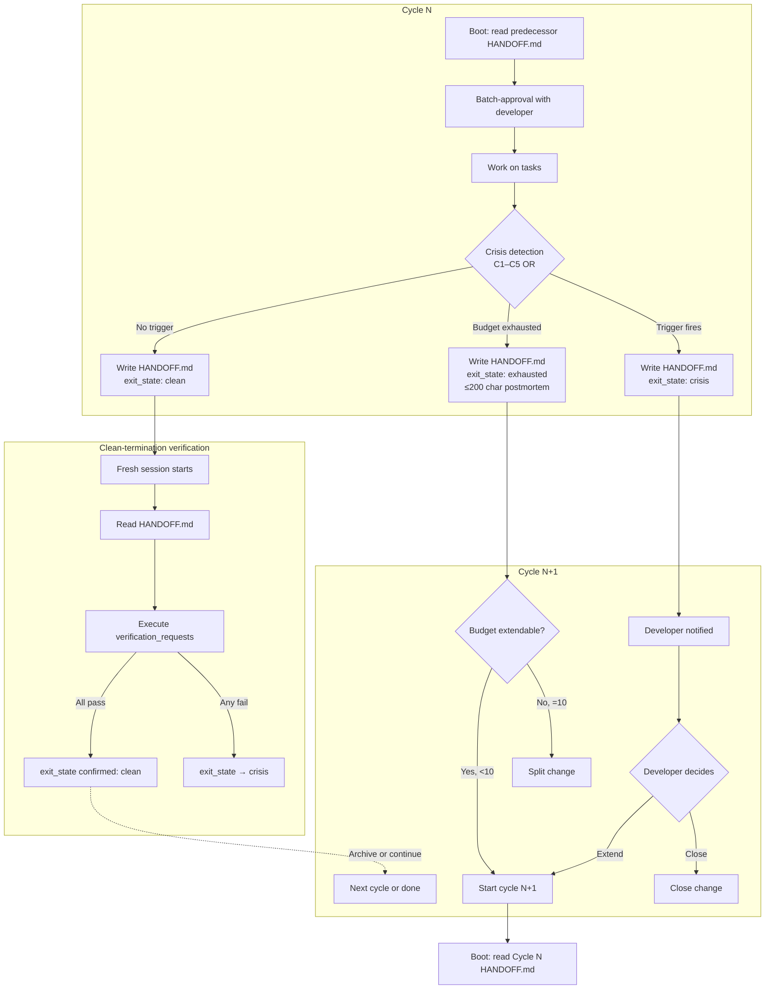

# Design: dia-redispatch-cycle

> **Proposal:** `openspec/changes/dia-redispatch-cycle/proposal.md`
> **Interview:** `openspec/changes/dia-redispatch-cycle/interview.md`
> **Scope:** dev-infra campaign protocol — no application code, no system architecture escalation (per interview Q9).

## Context

### Relationship to AGENTS.md §11 (interview Q3)

The **Batch Interview Protocol** — the general-scope workflow governing how ALL interviews across the project are conducted — belongs in `AGENTS.md §11` (Research & Knowledge Workflow). This change does NOT implement the batch interview protocol; it only references it as a downstream consumer of the HANDOFF.md schema. The batch approval boot protocol defined in §6 of this design is a cycle-specific application of the general pattern, not the general pattern itself.

### Design authority (.sdd/) — greenfield seed

No `.sdd/` module doc previously existed for this protocol. Per interview Q5, this change seeds `.sdd/dia-redispatch-cycle/architecture.md` with 5 ADRs. The ADRs are listed in §12 and their texts are normative — the rule texts below must not contradict them.

### DIA-036 precedent

The HANDOFF.md protocol draws on the DIA-036 session-continuity precedent: structured handoff documents with folded subsections, successor-session bootstrapping from the handoff alone, and explicit verification requests. The specific subsection set (session_summary / fixes_applied / open_tickets / verification_request / resume_instructions) is adapted from that precedent for the cycle-management domain.

---

## §1 — CRISIS-DETECTION rule text

> **ADR reference:** ADR-002 (C1–C5 OR-combined)

### Rule statement

A cycle is **in crisis** when any one of the following triggers fires. Triggers combine via **binary OR** — a single trigger is sufficient; there is no weighted scoring or multi-trigger threshold.

| Trigger | Condition                                                                                                                                                                                          | Detection point                                                   |
| ------- | -------------------------------------------------------------------------------------------------------------------------------------------------------------------------------------------------- | ----------------------------------------------------------------- |
| **C1**  | ≥3 consecutive failures on the **same task** (same T-row in tasks.md)                                                                                                                              | End of each failed attempt; counter resets on success             |
| **C2**  | ≥2 architector re-plans within the same cycle (design.md rewritten)                                                                                                                                | Each `openspec update-change` that rewrites design.md             |
| **C3**  | ≥5 tool calls with **no observable state change** (no file written, no test status changed, no git diff)                                                                                           | After each tool call; state diff is empty for 5 consecutive calls |
| **C4**  | Context overflow or truncation detected (model reports token limit hit, output truncated, or context-window rerun triggered at ≥50%)                                                               | Model/runtime signal                                              |
| **C5**  | Prognosis block (HANDOFF.md "Prognosis for next cycle" section) **unresolved for 1 full cycle** — the successor session did not address a ticket marked as blocking in the predecessor's prognosis | Start of each cycle's batch-approval review                       |

### Trigger semantics

- **C1 (same-task failure loop):** The counter is per-task, not per-cycle. If T2 fails 3 times across cycles 1 and 2, C1 fires at the third failure. The counter resets only when T2 succeeds, not when the cycle changes.
- **C2 (re-plan churn):** A re-plan is counted when design.md is substantively rewritten (not minor edits like typo fixes). The threshold is 2 within a single cycle — one re-plan is a course correction, two is a signal the approach is unstable.
- **C3 (tool-call stagnation):** "No observable state change" means the git working tree is unchanged AND no test file's pass/fail status changed AND no new file was created. Tool calls that only read (search, read, glob) do not count unless 5 consecutive reads produce no subsequent write.
- **C4 (context overflow):** Includes both hard overflow (model refuses to continue) and soft overflow (output truncated, context-window rerun triggered). The ≥50% context rerun threshold is the soft signal — if a cycle reruns ≥50% of its context, C4 is flagged but not yet fired; C4 fires on actual truncation or hard overflow.
- **C5 (prognosis debt):** If cycle N's HANDOFF.md contains a `verification_request` or `open_ticket` marked `[BLOCKING]`, and cycle N+1's batch-approval review does not address it (either resolves or explicitly defers with rationale), C5 fires at the start of cycle N+2.

### Crisis response (not in scope of rule text, but normative)

When a crisis trigger fires:

1. The current cycle is **halted** (no further work in this cycle).
2. A crisis HANDOFF.md is produced with **all 5 subsections populated, abbreviated in content** (§3 schema): `session_summary` includes the `crisis_triggers`; `fixes_applied` may be empty; `open_tickets` is populated; `verification_request` and `resume_instructions` describe crisis-handling only.
3. The developer is notified with the trigger identity and evidence.
4. The developer decides: extend the cycle (override), start a fresh cycle (counts against budget), or close the change.

---

## §2 — PROGNOSIS-DISCIPLINE rule text

> **ADR reference:** ADR-001 (prognosis in HANDOFF.md only)

### Rule statement

Every cycle **must** produce a HANDOFF.md at termination (whether clean, crisis, exhaustion, or manual-halt). The HANDOFF.md contains exactly one prognosis section: **"Prognosis for next cycle"**. There is no separate PROGNOSIS.md file — the prognosis lives in HANDOFF.md as a folded subsection (ADR-001).

### Prognosis discipline constraints

1. **The prognosis is the single source of truth** for what the successor session needs to know. If it's not in the prognosis, the successor session does not act on it.
2. **The prognosis must be self-contained.** The successor session must be able to reconstruct full working context from the HANDOFF.md alone, without reading the predecessor session's conversation history.
3. **The prognosis must be structured.** Free-form prose is not sufficient. The five subsections defined in §3 are required.
4. **The prognosis must be honest.** If the cycle is ending in crisis or exhaustion, the prognosis must say so. Sandbagging (marking a crisis as clean) is a protocol violation.
5. **The prognosis must be actionable.** Each `open_ticket` must have a clear next step. Each `verification_request` must have success criteria. Each `resume_instruction` must be executable without interpretation.

---

## §3 — HANDOFF.md schema: "Prognosis for next cycle"

> **Precedent:** DIA-036 session-continuity

### Top-level structure

```markdown
# HANDOFF.md — Cycle <cycle_id>

## Session summary

<see §3.1>

## Fixes applied

<see §3.2>

## Open tickets

<see §3.3>

## Verification request

<see §3.4>

## Resume instructions

<see §3.5>
```

### §3.1 — session_summary

**Required.** A concise narrative of what this cycle accomplished.

| Field             | Type     | Required | Description                                                                 |
| ----------------- | -------- | -------- | --------------------------------------------------------------------------- |
| cycle_id          | string   | yes      | This cycle's ID (`c-YYYYMMDD-HHMMss` UTC)                                   |
| started_at        | datetime | yes      | ISO 8601 UTC timestamp of cycle start                                       |
| ended_at          | datetime | yes      | ISO 8601 UTC timestamp of cycle end                                         |
| exit_state        | enum     | yes      | One of: `clean`, `crisis`, `exhausted`, `manual-halt`                       |
| tasks_completed   | string[] | yes      | List of task IDs (from tasks.md) that reached "done" in this cycle          |
| tasks_attempted   | string[] | yes      | List of task IDs that were attempted but not completed                      |
| crisis_triggers   | string[] | no       | List of trigger IDs that fired (e.g., `["C1", "C3"]`). Empty if clean exit. |
| summary_narrative | string   | yes      | 3–10 sentence prose summary of what happened and why                        |

### §3.2 — fixes_applied

**Required.** List of concrete changes made during this cycle.

| Field       | Type   | Required | Description                                                       |
| ----------- | ------ | -------- | ----------------------------------------------------------------- |
| file_path   | string | yes      | Path of the changed file                                          |
| change_type | enum   | yes      | One of: `created`, `modified`, `deleted`                          |
| description | string | yes      | What was changed and why (1–3 sentences)                          |
| task_ref    | string | yes      | Task ID this change belongs to                                    |
| test_status | enum   | yes      | One of: `passing`, `failing`, `not_tested`, `no_tests_applicable` |

### §3.3 — open_tickets

**Required.** Unfinished work that the successor session must address.

| Field       | Type     | Required | Description                                                                  |
| ----------- | -------- | -------- | ---------------------------------------------------------------------------- |
| ticket_id   | string   | yes      | Unique ID within this HANDOFF.md (e.g., `OT-001`)                            |
| task_ref    | string   | yes      | Task ID this ticket relates to                                               |
| title       | string   | yes      | Short title                                                                  |
| description | string   | yes      | Full description of what remains                                             |
| blocking    | boolean  | yes      | `true` if this blocks the next cycle from proceeding; `false` if deferrable  |
| next_step   | string   | yes      | Concrete next action the successor should take                               |
| evidence    | string[] | no       | File paths, test outputs, or other evidence supporting the ticket's validity |

### §3.4 — verification_request

**Required.** What the successor session must verify before declaring progress.

| Field            | Type    | Required | Description                                                               |
| ---------------- | ------- | -------- | ------------------------------------------------------------------------- |
| verification_id  | string  | yes      | Unique ID (e.g., `VR-001`)                                                |
| what_to_verify   | string  | yes      | What specifically must be checked                                         |
| success_criteria | string  | yes      | How to determine the verification passed (observable, testable condition) |
| how_to_verify    | string  | yes      | Concrete steps: commands to run, files to read, tests to execute          |
| blocking         | boolean | yes      | `true` if this blocks cycle completion                                    |

### §3.5 — resume_instructions

**Required.** Step-by-step instructions for the successor session to resume work.

| Field           | Type     | Required | Description                                                     |
| --------------- | -------- | -------- | --------------------------------------------------------------- |
| step_number     | integer  | yes      | Sequential step number (1-indexed)                              |
| instruction     | string   | yes      | What to do (imperative mood)                                    |
| rationale       | string   | no       | Why this step is necessary (helps successor understand context) |
| depends_on      | string[] | no       | Step numbers this step depends on (for ordering)                |
| estimated_scope | enum     | yes      | One of: `trivial` (<5 min), `small` (<30 min), `medium` (<2 hr) |

---

## §4 — messages.md 8-column schema

> **Backward compatibility (interview Q4):** Existing 5-column rows are left as-is. New columns are nullable. Readers default missing `cycle_id` to null. No migration.

### Column definitions

| #   | Column name       | Type     | Nullable | Description                                                                                               |
| --- | ----------------- | -------- | -------- | --------------------------------------------------------------------------------------------------------- |
| 1   | timestamp         | datetime | no       | ISO 8601 UTC timestamp of the message                                                                     |
| 2   | sender            | string   | no       | Who produced this message (agent name, developer, system)                                                 |
| 3   | recipient         | string   | no       | Who this message is addressed to                                                                          |
| 4   | channel           | string   | no       | Communication channel (e.g., `handoff`, `delegation`, `verification`, `crisis`)                           |
| 5   | content_ref       | string   | no       | Reference to the message content (file path, section anchor, or inline summary)                           |
| 6   | cycle_id          | string   | **yes**  | Cycle ID this message belongs to (`c-YYYYMMDD-HHMMss` UTC). **Null for pre-cycle messages.**              |
| 7   | evidence          | json[]   | **yes**  | Array of evidence objects (file paths, test outputs, trigger data). **Null if no evidence.**              |
| 8   | prognosis_ref     | string   | **yes**  | Reference to the HANDOFF.md prognosis section this message relates to. **Null if not prognosis-related.** |
| 9   | resolution_status | enum     | **yes**  | One of: `open`, `acknowledged`, `resolved`, `deferred`, `blocked`. **Null for pre-cycle messages.**       |

> **Note:** While described as "8-column" in the interview (referring to the 4 new columns added to the original 5), the actual schema has 9 fields. The "8-column" terminology refers to the extended schema's identity — columns 1–5 are legacy, columns 6–9 are new. The legacy 5 columns are unchanged; the 4 new columns are all nullable.

### Evidence array schema

Each element in the `evidence` JSON array:

```json
{
  "type": "file_path | test_output | trigger_data | screenshot | log_excerpt",
  "value": "<content or path>",
  "produced_at": "<ISO 8601 UTC>",
  "produced_by": "<agent or system name>"
}
```

### Backward compatibility rules

1. Existing rows with only 5 columns remain valid. Parsers must handle rows where columns 6–9 are absent.
2. When a parser encounters a row without `cycle_id`, it defaults to `null`.
3. When a parser encounters a row without `evidence`, it defaults to `null` (not an empty array).
4. When a parser encounters a row without `prognosis_ref`, it defaults to `null`.
5. When a parser encounters a row without `resolution_status`, it defaults to `null`.
6. New rows (produced after this change) must include all 9 fields, with nullable fields set explicitly to `null` if not applicable.

---

## §5 — T5 row schema

The T5 row is the extended task-tracking row used in tasks.md. It adds cycle attribution to the standard task row.

### Row columns

| Column name     | Type     | Required | Description                                                                                                                    |
| --------------- | -------- | -------- | ------------------------------------------------------------------------------------------------------------------------------ |
| task_id         | string   | yes      | Task identifier (e.g., `T1`, `T2`)                                                                                             |
| title           | string   | yes      | Short title                                                                                                                    |
| status          | enum     | yes      | One of: `pending`, `in_progress`, `completed`, `blocked`, `cancelled`                                                          |
| blockers        | string[] | no       | List of task_ids that must complete before this task can start                                                                 |
| cycle_id        | string   | **yes**  | Cycle ID this task was worked on (`c-YYYYMMDD-HHMMss` UTC)                                                                     |
| cycle_number    | integer  | **yes**  | Sequential cycle number within this change (1-indexed)                                                                         |
| attempts        | integer  | **yes**  | Number of attempts made on this task (for C1 tracking)                                                                         |
| last_exit_state | enum     | no       | Exit state of the cycle that last touched this task. One of: `clean`, `crisis`, `exhausted`, `manual-halt` (mirrors §3.1 / §7) |

---

## §6 — Cycle ID format

> **Interview Q8**

Format: `c-YYYYMMDD-HHMMss` UTC

- `c-` prefix distinguishes cycle IDs from other identifiers.
- `YYYYMMDD` is the UTC date of cycle start.
- `HHMMss` is the UTC time of cycle start (24-hour format, seconds included).
- Example: `c-20260803-143025` = cycle started 2026-08-03 at 14:30:25 UTC.
- Generated at cycle start, immutable for the duration of the cycle.
- If two cycles start within the same second, append a sequence suffix: `c-20260803-143025-001`.

---

## §7 — Cycles budget

> **ADR references:** ADR-004 (default 3), ADR-005 (soft exhaustion)

### Budget rules

| Rule               | Value                                                                                                     |
| ------------------ | --------------------------------------------------------------------------------------------------------- |
| Default max-cycles | 3                                                                                                         |
| Override range     | 2..10 (clamped — values below 2 are set to 2, values above 10 are set to 10)                              |
| max-cycles = 1     | **Disallowed.** If you need only 1 cycle, you don't need a redispatch protocol. Use normal flow.          |
| max-cycles > 10    | **Requires change split.** Break the change into multiple smaller changes, each with its own budget.      |
| max-cycles = 2     | **Permitted.** Edge case acknowledged — some changes are small enough for 2 cycles but need the protocol. |

### Budget accounting

- The budget increments **only on full audit pass** — a cycle that ends due to ≥50% context rerun does NOT increment the budget counter unless a full audit pass was completed.
- "Full audit pass" means the cycle produced a complete HANDOFF.md with all five subsections populated, and the successor session acknowledged receipt via the batch-approval protocol.
- Context reruns at ≥50% are tracked separately (in messages.md evidence) but do not consume budget unless the cycle terminates.
- **CLARIFICATION (2026-08-03, handoff-protocol modernization):** the ≥50% context threshold is now a **SAFETY-NET**; the primary SELF-RERUN trigger is **30%** plus campaign milestones (see NEXT-RUN.md §2). Native compaction (`compaction.auto`, opencode.jsonc) handles raw context pressure. Budget accounting is unchanged — only full audit passes increment.

### Exit states

| Exit state    | Meaning                                                               | Post-action                                                                          |
| ------------- | --------------------------------------------------------------------- | ------------------------------------------------------------------------------------ |
| `clean`       | All tasks completed or explicitly cancelled; no crisis triggers fired | Fresh-session verification (§9); change ready to archive                             |
| `crisis`      | A crisis trigger fired (§1); cycle halted                             | Developer notification; developer decides response                                   |
| `exhausted`   | Budget reached (all cycles used) without clean completion             | ≤200 char postmortem; **not** a crisis (ADR-005); developer decides: extend or close |
| `manual-halt` | Developer explicitly stopped the cycle outside of crisis/exhaustion   | HANDOFF.md produced; developer decides next step                                     |

### Exhaustion semantics (ADR-005)

When `exhausted` exit state is reached:

1. A postmortem of **≤200 characters** is produced (in the HANDOFF.md `session_summary.summary_narrative` field).
2. The exit state is `exhausted`, NOT `crisis` — budget exhaustion is a planned boundary, not a failure.
3. No C6 trigger exists — exhaustion is not a crisis trigger. The developer decides whether to extend the budget (if <10) or split the change (if at 10).
4. The HANDOFF.md must still be complete (all five subsections populated), even on exhaustion.

---

## §8 — Batch-approval boot protocol

The incoming session's first action is to read HANDOFF.md and present the prognosis for developer approval **before** any delegation occurs.

### Boot sequence

```
1. Read HANDOFF.md (predecessor cycle's output)
2. Parse "Prognosis for next cycle" section
3. Present each subsection to the developer as a batch:
   a. session_summary — "Here's what the last cycle did. Acknowledge?"
   b. fixes_applied — "Here's what was changed. Review?"
   c. open_tickets — "Here's what's unfinished. Approve each ticket's next_step?"
   d. verification_request — "Here's what needs verification. Approve the verification plan?"
   e. resume_instructions — "Here's the plan for this cycle. Approve?"
4. Developer approves per item (can approve, defer, or reject each)
5. Rejected items become new open_tickets; deferred items carry forward
6. Only after ALL items are approved does the session begin work
```

### Boot protocol constraints

- **No work before approval.** The session must not execute any tool calls, write any files, or delegate to any subagent until the developer has approved the batch.
- **Per-item approval.** The developer can approve some items and reject others. Rejected items are not silently accepted.
- **C5 check.** During step 3c, the session checks whether any `[BLOCKING]` tickets from the predecessor's HANDOFF.md were already supposed to be resolved. If a blocking ticket was supposed to be resolved in this cycle but wasn't, C5 fires (per §1).
- **Audit trail.** The batch-approval interaction is recorded in messages.md (one message per item, with `channel: "delegation"` and `resolution_status: "acknowledged"` or `"deferred"`).

---

## §9 — Clean-termination protocol

> **ADR reference:** ADR-003 (fresh-session independence)

### Rule statement

A cycle can declare `clean` exit **only if** its completion is verified by a **structurally independent** session. The session that produced the work **cannot** certify its own completion.

### Independence mechanism

1. **FRESH session requirement.** Verification is performed by a new session (fresh context window, no access to the producer session's conversation history). The verifier reads only: HANDOFF.md, the actual files in the working tree, and test outputs.
2. **NEXT-RUN §5 clean-cycle check.** The clean-termination protocol uses the NEXT-RUN framework's §5 clean-cycle definition as the positive exit condition: all tasks completed or cancelled, no open blocking tickets, all verification requests passed.
3. **No self-certification.** The producer session cannot write "I'm done" and have that count as verification. The verification must come from a session that did not produce the work.
4. **Untrusted markers block SELF-RERUN.** If the producer session's HANDOFF.md contains markers that suggest self-certification (e.g., "I verified my own work", "all tests pass" without independent test execution), those markers are treated as untrusted and the clean-termination protocol does not accept them. A fresh session must re-run the verification.

### Clean-termination sequence

```
1. Producer session writes HANDOFF.md with exit_state = "clean" (tentative)
2. Producer session writes verification_request section with specific checks
3. Fresh session starts (new context window)
4. Fresh session reads HANDOFF.md
5. Fresh session executes each verification_request (runs tests, reads files, checks outputs)
6. If ALL verifications pass:
   a. Fresh session writes a verification_result section in HANDOFF.md
   b. exit_state is confirmed as "clean"
   c. Change is ready to archive
7. If ANY verification fails:
   a. Fresh session writes verification_result with failure details
   b. exit_state is downgraded to "crisis" (or "manual-halt" if developer intervenes)
   c. A new cycle may be started (counts against budget)
```

---

## §10 — Data flow



---

## §11 — Seams

> Per `openspec/config.yaml`: "Include a Seams section listing the pre-agreed public boundaries where tests will live."

This is a **process/documentation change** — there are no application-code seams. The "seams" are the protocol boundaries where verification procedures apply:

| Seam                                  | What it is                                                                                | Verification method                                                        |
| ------------------------------------- | ----------------------------------------------------------------------------------------- | -------------------------------------------------------------------------- |
| **HANDOFF.md schema boundary**        | The contract between producer session (writes HANDOFF.md) and consumer session (reads it) | Schema validation: all required fields present, enums valid, types correct |
| **CRISIS-DETECTION trigger boundary** | The contract between cycle behavior and crisis detection (does C1–C5 fire correctly?)     | Simulated crisis drills: construct scenarios, verify triggers              |
| **messages.md schema boundary**       | The contract between old 5-column rows and new 9-column schema                            | Backward-compatibility test: old rows parse, new columns default to null   |
| **Batch-approval protocol boundary**  | The contract between predecessor HANDOFF.md and successor session boot                    | Simulation: construct HANDOFF.md, verify boot sequence                     |
| **Clean-termination boundary**        | The contract between producer session's completion claim and fresh-session verification   | Simulation: construct completion scenario, verify independence             |
| **Budget accounting boundary**        | The contract between cycle exits and budget counter                                       | Edge-case testing: max-cycles=2, =3, =10, override clamping                |

### New seams vs. existing seams

All seams are **new** — this protocol did not exist before this change. Justified: the protocol introduces structured handoff, crisis detection, and independent verification for the first time. These are new process boundaries that need verification.

---

## §12 — SDD traceability: 5 ADRs

> **Interview Q5.** These ADRs seed `.sdd/dia-redispatch-cycle/architecture.md`.

### ADR-001: Prognosis location — HANDOFF.md only

**Decision:** The prognosis for the next cycle lives in HANDOFF.md's "Prognosis for next cycle" section, NOT in a separate PROGNOSIS.md file.

**Rationale:** One source of truth per cycle transition. Splitting prognosis into a separate file creates a synchronization problem (which file is authoritative?) and a discoverability problem (where do I look for the prognosis?). HANDOFF.md is already the cycle-transition document; the prognosis is a section of it, not a sibling.

**Consequence:** The HANDOFF.md schema (§3) includes the prognosis as folded subsections. No PROGNOSIS.md file is created or referenced.

### ADR-002: C1–C5 OR-combined triggers

**Decision:** Crisis is detected when ANY of C1–C5 fires (binary OR). No weighted scoring, no multi-trigger thresholds.

**Rationale:** Simple, debuggable, no hidden coupling between trigger conditions. If C1 and C3 both fire, the crisis is not "more severe" than if only C1 fires — it's just two triggers instead of one. The developer sees both and decides. Weighted scoring would introduce a hidden calibration problem (why is C1 worth 3 points but C3 worth 1?) that adds complexity without improving detection.

**Consequence:** The CRISIS-DETECTION rule text (§1) uses binary OR. Each trigger is independently evaluable.

### ADR-003: Fresh-session independence

**Decision:** Verification of cycle completion is structurally enforced via a FRESH session (separate context window). The session that produced the work cannot certify its own completion.

**Rationale:** Self-certification is a classic trust failure. A session that spent 4 hours on a task has cognitive incentive to declare it done. A fresh session has no such incentive — it evaluates the work on its merits (do tests pass? are files consistent? does the HANDOFF.md match reality?). Structural enforcement means the protocol makes self-certification impossible, not just discouraged.

**Consequence:** The clean-termination protocol (§9) requires a fresh session. No exceptions.

### ADR-004: Cycles budget default — max-cycles=3

**Decision:** Default budget is 3 cycles. Override range is 2..10 (clamped). 1 is disallowed. >10 requires change split.

**Rationale:** 3 is the empirical sweet spot — enough cycles for most complex features, not so many that the change becomes unbounded. 1 is disallowed because the redispatch protocol has overhead (HANDOFF.md, batch approval, verification) that's not justified for single-cycle work. >10 is a signal the change is too large and should be split. Clamping (rather than rejecting) overrides prevents accidents (setting max-cycles=1 by mistake gets clamped to 2 with a warning, not silently accepted).

**Consequence:** The budget rules (§7) enforce these constraints.

### ADR-005: Soft exhaustion

**Decision:** Budget exhaustion is a non-crisis exit state. Produces a ≤200-char postmortem. Does NOT trigger a C6 crisis trigger.

**Rationale:** Exhaustion is a planned boundary, not a failure. The developer set the budget; reaching it is expected behavior, not a crisis. Treating it as a crisis would create false alarms and incentivize budget inflation (set max-cycles=10 "just in case"). A concise postmortem (≤200 chars) forces honest summarization without bloating the HANDOFF.md.

**Consequence:** The exit states table (§7) lists `exhausted` separately from `crisis`. No C6 trigger exists.

---

## §13 — Test strategy (verification procedures)

> Per proposal.md Testing Decisions section.

### VP-1: Schema validation

- **What:** HANDOFF.md schema (§3) and messages.md 8-column schema (§4) are internally consistent.
- **How:** Manual review of field definitions: all required fields marked, nullable fields marked, enum values listed, types consistent. Cross-check: HANDOFF.md's `exit_state` enum matches the exit states table (§7). messages.md's `resolution_status` enum is complete.
- **Acceptance:** No contradictions found between field definitions, enums, and cross-references.

### VP-2: Simulated crisis drills

- **What:** Each crisis trigger (C1, C2, C3, C4, C5) fires correctly under its defined conditions.
- **How:** Construct synthetic scenarios:
  - **C1 drill:** Simulate T2 failing 3 times across cycles 1–2. Verify C1 fires at third failure.
  - **C2 drill:** Simulate design.md rewritten twice in cycle 1. Verify C2 fires at second rewrite.
  - **C3 drill:** Simulate 5 tool calls with no file writes, no test changes, no git diff. Verify C3 fires.
  - **C4 drill:** Simulate context truncation event. Verify C4 fires. Simulate ≥50% context rerun without truncation. Verify C4 does NOT fire (only flagged, not fired).
  - **C5 drill:** Simulate cycle N HANDOFF.md with `[BLOCKING]` ticket. Simulate cycle N+1 not addressing it. Verify C5 fires at start of cycle N+2.
- **Acceptance:** Each drill produces the expected trigger (or non-trigger for C4 soft case).

### VP-3: Redispatch flow simulation

- **What:** The batch-approval boot protocol (§8) works end-to-end.
- **How:** Construct a complete HANDOFF.md for a hypothetical cycle end. Simulate a fresh session reading it and presenting the batch for developer approval. Verify each step of the boot sequence executes.
- **Acceptance:** Fresh session can reconstruct context from HANDOFF.md alone.

### VP-4: Budget accounting

- **What:** Cycle counting, exhaustion detection, and soft-exit work correctly.
- **How:** Edge-case scenarios:
  - max-cycles=2: 2 cycles used, clean exit on cycle 2 → change ready to archive.
  - max-cycles=3 (default): 3 cycles used, not clean → exhaustion.
  - max-cycles=10, override clamping: set max-cycles=15 → clamped to 10 with warning.
  - max-cycles=1: rejected with error message.
  - ≥50% context rerun without termination: budget NOT incremented.
- **Acceptance:** Each edge case produces the expected behavior.

### VP-5: Independence guarantee

- **What:** Clean-termination protocol (§9) structurally prevents self-certification.
- **How:** Construct a scenario where the producer session writes "I verified my own work" in HANDOFF.md. Verify the fresh session treats this as an untrusted marker and re-runs verification independently.
- **Acceptance:** Self-certification markers are rejected; fresh session re-verifies.

### VP-6: Backward compatibility

- **What:** Existing 5-column messages.md rows parse correctly with the 9-column schema.
- **How:** Construct a messages.md with old-format rows (5 columns). Parse with the new schema. Verify columns 6–9 default to null.
- **Acceptance:** Old rows parse without error. New columns are null for old rows.

### VP-7: Integration

- **What:** End-to-end protocol execution for a 3-cycle change.
- **How:** Simulate: cycle 1 (clean), cycle 2 (C1 crisis), cycle 3 (exhaustion). Verify: HANDOFF.md produced at each exit, batch-approval executed at each boot, crisis detected on cycle 2, exhaustion postmortem ≤200 chars on cycle 3.
- **Acceptance:** Full protocol flow works without contradictions.

---

## §14 — Rollback plan

| Artifact                                           | Revert                               | Side effects                         |
| -------------------------------------------------- | ------------------------------------ | ------------------------------------ |
| `.sdd/dia-redispatch-cycle/architecture.md`        | Delete file (and directory if empty) | None — greenfield, no consumers yet  |
| HANDOFF.md schema (in design.md)                   | Revert design.md                     | None — protocol not yet in use       |
| messages.md schema extension (in design.md)        | Revert design.md                     | None — nullable, backward-compatible |
| CRISIS-DETECTION + PROGNOSIS-DISCIPLINE rule texts | Revert design.md                     | None — not enforced until activated  |
| `interview.md`                                     | Delete interview.md                  | Loss of traceability source          |

No existing production code is modified. No data migrations. Rollback is file deletion / git checkout.

---

<!--
ownership:
  substance: AI
  structure: AI
  interview_depth: full
-->
